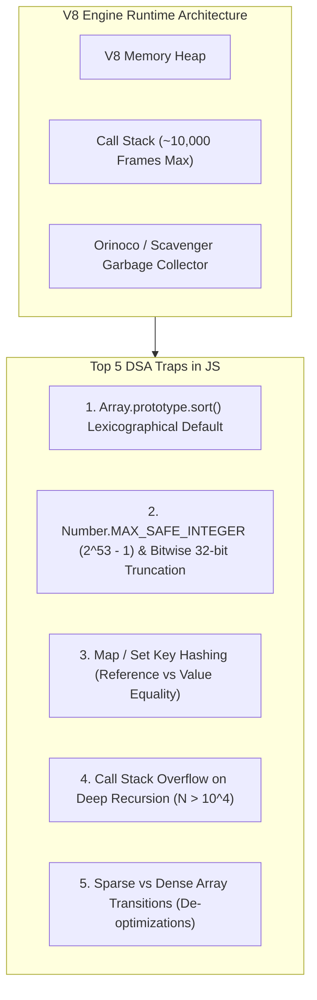

# 01. JavaScript Runtime Quirks & Memory Mastery for MAANG Interviews

---

## 1. Executive Overview

Interviewing in JavaScript for Data Structures and Algorithms (DSA) requires understanding how the V8 JavaScript engine executes code, manages memory, and handles data types. Failing to account for V8-specific quirks will lead to silent bugs, memory limit exceeded (MLE) errors, or stack overflow errors during live whiteboard interviews.



---

## 2. The 5 Fatal JavaScript DSA Pitfalls & Solutions

### Pitfall 1: `Array.prototype.sort()` Performs Lexicographical Sorting

#### The Trap:
By default, JS converts elements into strings before sorting:
```javascript
const nums = [10, 2, 5, 100, 25];
nums.sort();
console.log(nums); // ❌ Output: [10, 100, 2, 25, 5] (Alphabetical order!)
```

#### The Fix:
Always provide an explicit comparator function:
```javascript
// Ascending numerical order
nums.sort((a, b) => a - b); // ✅ Output: [2, 5, 10, 25, 100]

// Descending numerical order
nums.sort((a, b) => b - a); // ✅ Output: [100, 25, 10, 5, 2]
```

---

### Pitfall 2: Number Precision Limits & 32-bit Bitwise Truncation

#### A. Floating Point Range (`Number.MAX_SAFE_INTEGER`)
JavaScript numbers are IEEE 754 double-precision 64-bit floats.
- Maximum safe integer: $2^{53} - 1 = 9,007,199,254,740,991$ (`Number.MAX_SAFE_INTEGER`).
- Beyond this, arithmetic silently loses precision:
```javascript
console.log(9007199254740991 + 1 === 9007199254740991 + 2); // ❌ true!
```
**Fix:** For arbitrarily large integers, use `BigInt` with `n` suffix:
```javascript
const largeSum = 9007199254740991n + 2n; // ✅ 9007199254740993n
```

#### B. Bitwise Operations Truncate to 32-bit Signed Integers
All bitwise operators (`&`, `|`, `^`, `~`, `<<`, `>>`) implicitly cast operands to **32-bit signed integers** $[-2^{31}, 2^{31}-1]$:
```javascript
const big = 2 ** 33;
console.log(big | 0); // ❌ 0 (Lost high 32 bits!)
```
**Fast Integer Division Trick:**
```javascript
// Fast Math.floor for positive numbers:
const mid = (left + right) >> 1; // Safe when left + right < 2^31
// Or standard safe integer division:
const safeMid = Math.floor(left + (right - left) / 2);
```

---

### Pitfall 3: `Map` and `Set` Reference Equality for Coordinates / Pairs

#### The Trap:
In JavaScript, `Map` and `Set` check object key equality using `SameValueZero` (reference equality):
```javascript
const visited = new Set();
visited.add([0, 1]);
console.log(visited.has([0, 1])); // ❌ false! (Different array references)
```

#### The Fix:
Serialize composite keys into strings or unique integer hashes:
```javascript
// Approach A: String serialization (Fast to code in interviews)
const visitedStr = new Set();
visitedStr.add(`${row},${col}`);
console.log(visitedStr.has(`${row},${col}`)); // ✅ true

// Approach B: Mathematical Integer Cantor/Coordinate Hash (Ultra-fast, zero GC pressure)
// Given max columns MAX_C (e.g., 1000):
const key = row * MAX_C + col;
const visitedInt = new Set();
visitedInt.add(key);
```

---

### Pitfall 4: Call Stack Overflow in Deep Recursion ($N > 10^4$)

#### The Trap:
V8 limits call stack size to approximately 10,000 stack frames. Any $O(N)$ tree/graph traversal on degenerate graphs (e.g., skewed tree with $N = 10^5$) throws `RangeError: Maximum call stack size exceeded`.

#### The Fix:
Convert recursion to an **Explicit Iterative Stack**:

```javascript
// ❌ Naive Recursive DFS (Blows stack when N = 10^5)
function dfsRecursive(node) {
  if (!node) return;
  dfsRecursive(node.left);
  dfsRecursive(node.right);
}

// ✅ Hardened Iterative DFS (Handles N = 10^7 safely using Heap memory)
function dfsIterative(root) {
  if (!root) return;
  const stack = [root];
  while (stack.length > 0) {
    const node = stack.pop();
    // Process node...
    if (node.right) stack.push(node.right);
    if (node.left) stack.push(node.left);
  }
}
```

---

### Pitfall 5: Array Allocation & V8 Hidden Classes / De-optimizations

In V8, arrays have internal element kinds:
1. **`PACKED_SMI_ELEMENTS`** (Dense integers only — fastest, optimized memory layout).
2. **`PACKED_DOUBLE_ELEMENTS`** (Dense floats).
3. **`HOLEY_ELEMENTS`** (Sparse arrays with holes created via `arr[100] = 1` on empty array).

```javascript
// ❌ Creating holey arrays (De-optimizes V8 engine)
const badArr = new Array(100); // 100 holes
badArr[0] = 5;

// ✅ Creating dense packed arrays for high performance:
const goodArr = new Array(100).fill(0);

// 🚀 Maximum performance 2D Matrix initialization:
const rows = 100, cols = 100;
const matrix = Array.from({ length: rows }, () => new Int32Array(cols));
```

---

## 3. High-Performance JavaScript DSA Data Structures Checklist

| Problem Need | Idiomatic Modern JS Approach | Big-O Complexity |
| :--- | :--- | :--- |
| **Dynamic Array / Stack** | `const stack = []`; `push()`, `pop()` | $O(1)$ amortized push/pop |
| **Queue (FIFO)** | `Array` with pointer index offset (Avoid `shift()`) | $O(1)$ amortized dequeue |
| **Hash Map / Frequency Counter** | `new Map()` or `Object.create(null)` | $O(1)$ get/set |
| **Unique Set** | `new Set()` | $O(1)$ add/has/delete |
| **Priority Queue / Min-Heap** | Custom 15-line Binary Heap class | $O(\log N)$ push/pop |
| **2D Dynamic Grid** | `Array.from({length: R}, () => new Array(C).fill(0))` | $O(R \times C)$ memory |
