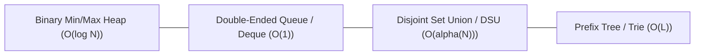
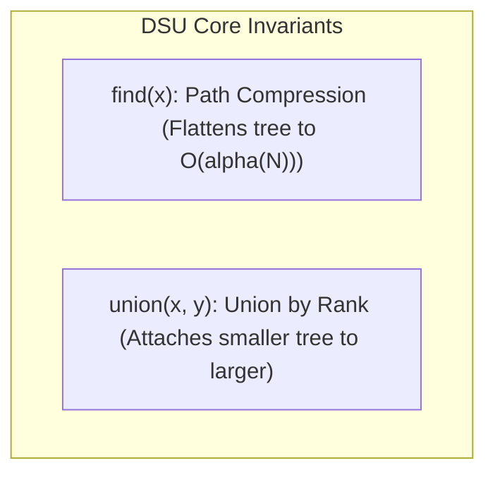

# 02. Zero-Dependency Data Structure Polyfills for JavaScript Interviews

---

## 1. Executive Summary

Standard JavaScript does not ship with built-in `Heap`, `PriorityQueue`, `Deque`, or `UnionFind`. In MAANG live coding interviews (CoderPad / HackerRank / Google Docs), you must be able to implement an idiomatic, lightweight data structure in **under 90 seconds** without external dependencies.



---

## 2. MinHeap & MaxHeap (Universal Priority Queue)

### Visual Representation of Binary Heap Array Mapping
```
Array index:    [0]   [1]   [2]   [3]   [4]   [5]   [6]
Tree Node:      10    15    20    40    50    30    25

Parent(i)      = Math.floor((i - 1) / 2)
LeftChild(i)   = 2 * i + 1
RightChild(i)  = 2 * i + 2
```

### Ultra-Concise Implementation (15 Lines)

```javascript
/**
 * Universal Binary Heap / Priority Queue
 * Default: MinHeap ((a, b) => a - b)
 * For MaxHeap pass: (a, b) => b - a
 */
export class PriorityQueue {
  constructor(compare = (a, b) => a - b) {
    this.heap = [];
    this.compare = compare;
  }

  size() {
    return this.heap.length;
  }

  isEmpty() {
    return this.heap.length === 0;
  }

  peek() {
    return this.heap[0] ?? null;
  }

  push(val) {
    this.heap.push(val);
    this._bubbleUp(this.heap.length - 1);
  }

  pop() {
    if (this.isEmpty()) return null;
    const top = this.heap[0];
    const bottom = this.heap.pop();
    if (!this.isEmpty()) {
      this.heap[0] = bottom;
      this._sinkDown(0);
    }
    return top;
  }

  _bubbleUp(idx) {
    while (idx > 0) {
      const parentIdx = (idx - 1) >> 1;
      if (this.compare(this.heap[idx], this.heap[parentIdx]) >= 0) break;
      [this.heap[idx], this.heap[parentIdx]] = [this.heap[parentIdx], this.heap[idx]];
      idx = parentIdx;
    }
  }

  _sinkDown(idx) {
    const len = this.heap.length;
    while (true) {
      let smallest = idx;
      const left = 2 * idx + 1;
      const right = 2 * idx + 2;

      if (left < len && this.compare(this.heap[left], this.heap[smallest]) < 0) {
        smallest = left;
      }
      if (right < len && this.compare(this.heap[right], this.heap[smallest]) < 0) {
        smallest = right;
      }
      if (smallest === idx) break;
      [this.heap[idx], this.heap[smallest]] = [this.heap[smallest], this.heap[idx]];
      idx = smallest;
    }
  }
}
```

---

## 3. High-Performance Queue / Deque ($O(1)$ Operations)

In JavaScript, `Array.prototype.shift()` is **$O(N)$** because it re-indexes every element in the array. For BFS or Sliding Window algorithms, $O(N)$ shift operations degrade overall performance to $O(N^2)$.

### Pointer-Based Queue ($O(1)$ Amortized)

```javascript
/**
 * O(1) Amortized Queue using pointer offset
 */
export class FastQueue {
  constructor() {
    this.items = [];
    this.head = 0;
  }

  enqueue(val) {
    this.items.push(val);
  }

  dequeue() {
    if (this.isEmpty()) return null;
    const val = this.items[this.head++];
    // Clean up memory buffer periodically to prevent memory leaks
    if (this.head > 1000 && this.head * 2 >= this.items.length) {
      this.items = this.items.slice(this.head);
      this.head = 0;
    }
    return val;
  }

  peek() {
    return this.isEmpty() ? null : this.items[this.head];
  }

  size() {
    return this.items.length - this.head;
  }

  isEmpty() {
    return this.size() === 0;
  }
}
```

---

## 4. Disjoint Set Union (Union-Find with Rank & Path Compression)



### Production Implementation

```javascript
export class DisjointSetUnion {
  constructor(n) {
    this.parent = new Int32Array(n);
    this.rank = new Int32Array(n);
    this.count = n; // Number of connected components
    for (let i = 0; i < n; i++) {
      this.parent[i] = i;
      this.rank[i] = 0;
    }
  }

  // Path compression: Flattens tree height
  find(i) {
    if (this.parent[i] === i) return i;
    return (this.parent[i] = this.find(this.parent[i]));
  }

  // Union by rank: Attaches smaller depth tree under larger
  union(i, j) {
    const rootI = this.find(i);
    const rootJ = this.find(j);
    if (rootI === rootJ) return false;

    if (this.rank[rootI] < this.rank[rootJ]) {
      this.parent[rootI] = rootJ;
    } else if (this.rank[rootI] > this.rank[rootJ]) {
      this.parent[rootJ] = rootI;
    } else {
      this.parent[rootJ] = rootI;
      this.rank[rootI]++;
    }
    this.count--;
    return true;
  }

  connected(i, j) {
    return this.find(i) === this.find(j);
  }
}
```

---

## 5. Prefix Tree (Trie)

```javascript
class TrieNode {
  constructor() {
    this.children = new Map(); // or Array(26).fill(null) for lowercase ASCII
    this.isEndOfWord = false;
  }
}

export class Trie {
  constructor() {
    this.root = new TrieNode();
  }

  insert(word) {
    let node = this.root;
    for (const char of word) {
      if (!node.children.has(char)) {
        node.children.set(char, new TrieNode());
      }
      node = node.children.get(char);
    }
    node.isEndOfWord = true;
  }

  search(word) {
    let node = this.root;
    for (const char of word) {
      if (!node.children.has(char)) return false;
      node = node.children.get(char);
    }
    return node.isEndOfWord;
  }

  startsWith(prefix) {
    let node = this.root;
    for (const char of prefix) {
      if (!node.children.has(char)) return false;
      node = node.children.get(char);
    }
    return true;
  }
}
```
