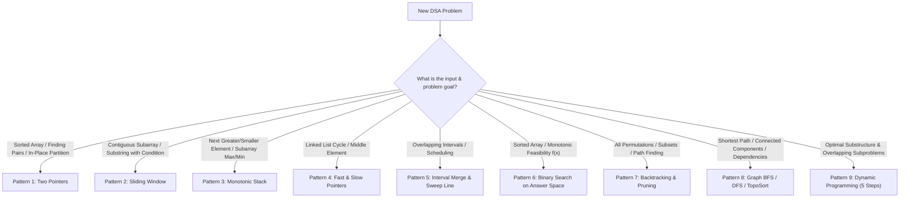
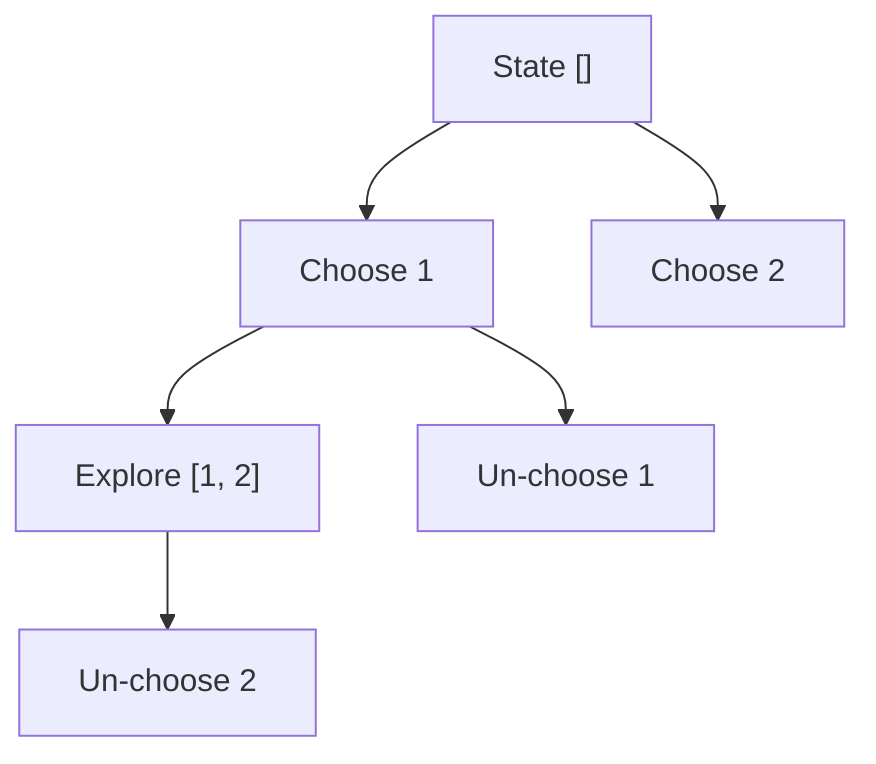
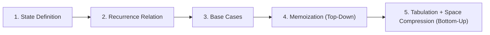

# 03. Core Algorithmic Patterns Master Primer (Nikhil Lohia Method)

---

## 1. Pattern Recognition Decision Tree

When presented with an unseen MAANG algorithmic problem, use this decision framework to identify the target pattern in under 30 seconds:



---

## 2. Pattern Breakdown & Universal Code Templates

---

### Pattern 1: Two Pointers (Opposing & Partitioning)

#### When to Use:
- Input is sorted (e.g., Two Sum II, 3Sum, Container With Most Water).
- Reversing in-place or partitioning (e.g., Dutch National Flag, Sort Colors).

```
Array:  [ 1 ,  3 ,  4 ,  7 ,  11 ,  15 ]
          ^                         ^
          L                         R
   Sum < Target: L++        Sum > Target: R--
```

#### Universal JavaScript Template:
```javascript
function twoPointersOpposite(arr, target) {
  let left = 0;
  let right = arr.length - 1;

  while (left < right) {
    const currentSum = arr[left] + arr[right];
    if (currentSum === target) {
      return [left, right];
    } else if (currentSum < target) {
      left++;
    } else {
      right--;
    }
  }
  return [-1, -1];
}
```

---

### Pattern 2: Sliding Window (Dynamic Expansion & Contraction)

#### When to Use:
- Longest/shortest contiguous subarray/substring meeting a condition (e.g., Longest Substring Without Repeating Characters, Minimum Window Substring).

```
Window state:
[ a , b , c , a , b , c , b , b ]
  ^       ^
  L       R  --> Expand R, update state. If invalid, shrink L.
```

#### Universal JavaScript Template:
```javascript
function dynamicSlidingWindow(str) {
  let left = 0;
  let maxLen = 0;
  const state = new Map(); // Track frequency or window invariant

  for (let right = 0; right < str.length; right++) {
    const char = str[right];
    state.set(char, (state.get(char) || 0) + 1);

    // Shrink window while invalid
    while (/* condition violated, e.g., state.get(char) > 1 */ false) {
      const leftChar = str[left];
      state.set(leftChar, state.get(leftChar) - 1);
      left++;
    }

    maxLen = Math.max(maxLen, right - left + 1);
  }

  return maxLen;
}
```

---

### Pattern 3: Monotonic Stack (Next Greater / Smaller Element)

#### When to Use:
- Finding the nearest larger or smaller element to the left or right in $O(N)$ time (e.g., Daily Temperatures, Largest Rectangle in Histogram, Trapping Rain Water).

```
Stack maintains elements in strictly increasing or decreasing order.
Incoming element pops all smaller elements from the stack.
```

#### Universal JavaScript Template:
```javascript
function nextGreaterElement(nums) {
  const n = nums.length;
  const result = new Array(n).fill(-1);
  const stack = []; // Monotonic decreasing stack of indices

  for (let i = 0; i < n; i++) {
    while (stack.length > 0 && nums[i] > nums[stack[stack.length - 1]]) {
      const prevIdx = stack.pop();
      result[prevIdx] = nums[i];
    }
    stack.push(i);
  }

  return result;
}
```

---

### Pattern 4: Binary Search on Answer Space (Predicate Bisection)

#### When to Use:
- Finding the minimum or maximum value $K$ such that a condition `isValid(K)` holds, where `isValid(K)` is monotonic (e.g., Koko Eating Bananas, Capacity to Ship Packages Within D Days).

```
Feasibility function: [ False , False , False , True , True , True ]
                                                 ^ Target (First True)
```

#### Universal JavaScript Template:
```javascript
function binarySearchOnAnswer(minBound, maxBound, isValidPredicate) {
  let low = minBound;
  let high = maxBound;
  let bestAnswer = high;

  while (low <= high) {
    const mid = low + Math.floor((high - low) / 2);
    if (isValidPredicate(mid)) {
      bestAnswer = mid;
      high = mid - 1; // Try finding smaller valid answer
    } else {
      low = mid + 1;  // Not valid, must increase
    }
  }

  return bestAnswer;
}
```

---

### Pattern 5: Backtracking & State-Space Tree Pruning

#### When to Use:
- Generating all subsets, permutations, combinations, or solving constraint satisfaction problems (N-Queens, Sudoku Solver).



#### Universal JavaScript Template:
```javascript
function backtrackFramework(nums) {
  const results = [];
  const currentPath = [];

  function backtrack(startIndex) {
    // 1. Base Case / Solution Found
    results.push([...currentPath]);

    // 2. Iterate Choices
    for (let i = startIndex; i < nums.length; i++) {
      // 3. Pruning / Constraint Check
      // if (shouldPrune) continue;

      // 4. Make Choice
      currentPath.push(nums[i]);

      // 5. Explore
      backtrack(i + 1);

      // 6. Un-make Choice (Backtrack)
      currentPath.pop();
    }
  }

  backtrack(0);
  return results;
}
```

---

### Pattern 6: Dynamic Programming (The 5-Step Formula)



#### The 5-Step Formula Applied to Coin Change ($O(N \times \text{amount})$):
1. **State**: $DP[a]$ = minimum coins needed to make amount $a$.
2. **Recurrence**: $DP[a] = 1 + \min_{c \in coins} DP[a - c]$ for $a \ge c$.
3. **Base Case**: $DP[0] = 0$, all other $DP[i] = \infty$.
4. **Memoization (Top-Down)**:
```javascript
function coinChangeMemo(coins, amount, memo = {}) {
  if (amount === 0) return 0;
  if (memo[amount] !== undefined) return memo[amount];
  
  let minCoins = Infinity;
  for (const coin of coins) {
    if (amount >= coin) {
      const result = coinChangeMemo(coins, amount - coin, memo);
      if (result !== -1) {
        minCoins = Math.min(minCoins, 1 + result);
      }
    }
  }
  
  memo[amount] = minCoins === Infinity ? -1 : minCoins;
  return memo[amount];
}
```
5. **Tabulation + Space Compression (Bottom-Up)**:
```javascript
function coinChangeTabulation(coins, amount) {
  const dp = new Array(amount + 1).fill(Infinity);
  dp[0] = 0;

  for (let a = 1; a <= amount; a++) {
    for (const coin of coins) {
      if (a >= coin) {
        dp[a] = Math.min(dp[a], 1 + dp[a - coin]);
      }
    }
  }

  return dp[amount] === Infinity ? -1 : dp[amount];
}

// Space-optimized version (when DP depends only on previous states)
// Example: Fibonacci - O(n) space → O(1) space
function fibonacciOptimized(n) {
  if (n <= 1) return n;
  let prev2 = 0, prev1 = 1;
  for (let i = 2; i <= n; i++) {
    const curr = prev1 + prev2;
    prev2 = prev1;
    prev1 = curr;
  }
  return prev1;
}
```

---

## 3. Video Pattern Deep-Dives (Playlist Order)

> Every section in this part is reconstructed from the corresponding video transcript. The instructor narrates each diagram as it is drawn on screen, so the illustrations below mirror what the video shows. Each deep-dive covers the exact problems walked through, the step-by-step reasoning, a code template and complexity analysis.

### Video 1: Two Pointers — 12 Problems, One Pattern

**Video:** `https://www.youtube.com/watch?v=MQmUVokbTrs` · **Transcript:** `00-foundations/video-transcripts/v_MQmUVokbTrs/transcript.txt` · **Frames:** `00-foundations/video-transcripts/v_MQmUVokbTrs/frames/cue_0000.jpg` – `cue_0019.jpg`

#### Why learn patterns at all?

There are thousands of LeetCode problems — nobody can memorise them one by one. But almost every problem is a variation of a handful of *recurring patterns*. The moment you can say "I have applied this before", a new problem stops being scary: your mind immediately starts listing candidate approaches instead of staring at a blank page.

The treasure analogy from the video: if someone says *"a treasure is hidden somewhere in this area"* you have no idea where to start. But if they say *"the treasure is green"*, you at least know what to look for. **Patterns are that colour hint for coding problems** — they give you a starting point, speed up your interview process, and turn "I hope I've seen this question" into "I know the family this question belongs to".

#### The core idea of Two Pointers

Instead of iterating over the array with a single index, you maintain **two pointers** and advance them *simultaneously*. The pattern has three classic variants, and the video walks through all three:

```
Variant 1: Same end, different speeds (slow / fast)
          ┌────┬────┬────┬────┬────┬────┐
  array:  │ a  │ b  │ c  │ d  │ e  │ f  │
          └────┴────┴────┴────┴────┴────┘
  slow ─►  ▲                       slow moves 1 step each round
  fast ─►  ▲                       fast moves 2 steps each round
           (round 1: slow→b, fast→c | round 2: slow→c, fast→e | …)

Variant 2: Opposite ends, converging (left / right)
          ┌────┬────┬────┬────┬────┬────┐
  array:  │ -5 │ -2 │  1 │  3 │  6 │  8 │
          └────┴────┴────┴────┴────┴────┘
            ▲                            ▲
          left                          right
            └────── converge ──────────┘

Variant 3: Same end, same direction (read / write) — for in-place filtering
          ┌────┬────┬────┬────┬────┬────┐
          │ 0  │ 1  │ 0  │ 1  │ 1  │ 0  │
          └────┴────┴────┴────┴────┴────┘
            ▲
         read  (scans every element)
            ▲
         write (keeps the "accepted" region)
```

**Why it matters:** a naive solution usually runs a *nested loop* — fix one element, scan everything else: O(n²). Two pointers let you sweep the array once while moving *both* cursors intelligently, turning the solution into a single O(n) pass.

#### When to use it — the 5 trigger keywords

The video gives five concrete signals to look for in a problem statement (an identification checklist, not an exhaustive list — the more problems you solve, the better your instinct gets):

| # | Signal in the problem statement | Why it points to two pointers |
|---|---|---|
| 1 | **Sorted sequence / sorted array** | The smallest element sits on the left, the largest on the right — you immediately have a *min* and a *max*. If the problem involves the smallest + largest element, two pointers fit. |
| 2 | **Target sum / pair that equals k** | Again you have a min and a max; the only way to make the sum bigger is to move the left pointer up; the only way to make it smaller is to move the right pointer down. |
| 3 | **Compare and combine elements** (merge two sorted lists) | Combine as you go with one pointer per list, instead of scanning one whole list per element of the other. |
| 4 | **Your first instinct is a nested loop** | A nested loop = fix one element + scan the rest. If two pointers can iterate together, a faster approach is usually available immediately. |
| 5 | **Move / shrink a window** | Two pointers *define* an operating window: you have fixed limits and can expand or shrink the interval by moving either pointer. |

The deeper intuition: **two pointers give you finite limits.** When the answer cannot lie beyond two boundaries, the only remaining moves are to *converge* or to *advance both to the end* — which almost always guarantees an O(n) solution.

#### Problem 1 — Two Sum (sorted array)

**Statement:** given a *sorted* array and a target `k`, find two numbers that add up to `k`.

**Brute force:** for every element, scan every later element looking for the complement → O(n²).

**Two-pointer walkthrough (as shown in the video):** place one pointer at the very first element and one at the very last.

```
sorted array:   -5   -2    1    3    6       target k = 1
                 ▲                        ▲
               left                      right

   round 1: left + right = -5 + 6 = 1  ✅  exactly k → answer: (-5, 6)
```

The *mechanism* is the star of this problem — when the sum is **not** the target:

```
Want a BIGGER sum  →  move the left pointer forward  (numbers are increasing, so
                      the sum can only grow)
Want a SMALLER sum →  move the right pointer backward (the sum can only shrink)

Example, target k = 2:
      -5   -1    1    3    6
      ▲                     ▲
  -5 + 6 = 1 (< 2) → move left forward:
      -5   -1    1    3    6
           ▲              ▲
  -1 + 6 = 5 (> 2) → move right backward:
      -5   -1    1    3    6
           ▲         ▲
  -1 + 3 = 2 (== 2) ✅  answer: (-1, 3)
```

Keep iterating like this until you find the exact sum — a single traversal of the array.

```javascript
// Two Sum II — Input Array Is Sorted
function twoSumSorted(arr, k) {
  let left = 0;
  let right = arr.length - 1;
  while (left < right) {
    const sum = arr[left] + arr[right];
    if (sum === k) return [left, right];   // pair found
    else if (sum < k) left++;              // need a bigger sum → smallest pointer up
    else right--;                          // need a smaller sum → largest pointer down
  }
  return null;                             // no such pair
}
// Time: O(n) | Space: O(1)
```

#### Problem 2 — Three Sum

**Statement:** find all triplets that add up to a target.

**The trick — reuse Two Sum inside an outer loop.** Fix one number (the "first" number), then run the exact Two Sum two-pointer approach on the remaining part of the array. Next iteration, fix the next number and run Two Sum again on the rest.

```
sorted array:   -5   -2   -1    1    2    3      target = 0

  outer fix → -5:      -2   -1    1    2    3   ← Two Sum for the pair adding
                       ▲                   ▲       up to 0 − (−5) = 5
                      left                right    → −2 + 2 = 0 ✅ → triplet (−5, −2, 2)

  outer fix → -2:      -1    1    2    3        ← Two Sum for the pair adding to 2
                       ▲             ▲             → −1 + 3 = 2 ✅ → triplet (−2, −1, 3)

  … continue until the outer loop is done
```

**Why the pattern shines:** the *same* Two Sum skeleton solved a *different* problem. This is the "12 problems in one video" magic — applying a pattern, not memorising solutions.

```javascript
function threeSum(nums, target = 0) {
  nums.sort((a, b) => a - b);              // two pointers need a sorted array
  const result = [];
  for (let i = 0; i < nums.length - 2; i++) {
    if (i > 0 && nums[i] === nums[i - 1]) continue;       // skip duplicate fix-points
    let left = i + 1, right = nums.length - 1;
    while (left < right) {
      const sum = nums[i] + nums[left] + nums[right];
      if (sum === target) {
        result.push([nums[i], nums[left], nums[right]]);
        left++; right--;
        while (left < right && nums[left] === nums[left - 1]) left++;      // skip dupes
        while (left < right && nums[right] === nums[right + 1]) right--;   // skip dupes
      } else if (sum < target) left++;
      else right--;
    }
  }
  return result;
}
// Time: O(n²) — outer loop n × inner Two Sum n | Space: O(1) extra (ignoring output)
```

#### Problem 3 — Merge Two Sorted Lists

**Statement:** given two *already sorted* arrays, produce one big sorted array.

**Walkthrough:** start one pointer at the beginning of each array. Compare the two elements; the *smaller* one goes into the result and that pointer advances. Keep comparing as you go.

```
a: [-5,  1,  3]        b: [-1,  2,  4]

  round 1: -5 vs -1 → -5 smaller → result = [-5]         advance a-pointer
  round 2:  1 vs -1 → -1 smaller → result = [-5, -1]     advance b-pointer
  round 3:  1 vs  2 →  1 smaller → result = [-5, -1, 1]  advance a-pointer
  round 4:  3 vs  2 →  2 smaller → result = [-5, -1, 1, 2]  advance b-pointer
  round 5:  3 vs  4 →  3 smaller → result = [-5, -1, 1, 2, 3]  advance a-pointer
  round 6: a exhausted → append the rest of b → [-5, -1, 1, 2, 3, 4] ✅ sorted
```

```javascript
function mergeSorted(a, b) {
  const result = [];
  let i = 0, j = 0;
  while (i < a.length && j < b.length) {          // compare & take the smaller
    if (a[i] <= b[j]) result.push(a[i++]);
    else result.push(b[j++]);
  }
  while (i < a.length) result.push(a[i++]);       // drain whatever is left over
  while (j < b.length) result.push(b[j++]);
  return result;
}
// Time: O(m + n) — one pass over both lists | Space: O(m + n) for the output
```

#### Problem 4 — Remove Duplicates between Two Sorted Arrays

**Statement:** two sorted arrays which may share duplicate/overlapping elements — remove the duplicates in between them.

Same method: start both pointers at the beginnings, keep iterating together, and the moment you run into duplicate elements, skip/remove them — instead of iterating both arrays again and again. The most common form is the in-place duplicate removal on a single sorted array:

```javascript
// Remove Duplicates from Sorted Array (in-place)
function removeDuplicates(nums) {
  if (nums.length === 0) return 0;
  let write = 0;                                        // slow "writer" pointer
  for (let read = 1; read < nums.length; read++) {      // fast "reader" pointer
    if (nums[read] !== nums[write]) {                   // a new distinct value
      write++;
      nums[write] = nums[read];                         // write it next to the last kept
    }
  }
  return write + 1;                                     // new length; nums[0..write] unique
}
// Time: O(n) | Space: O(1)
```

#### Problem 5 — Intersection of Two Sorted Arrays

**Statement:** two sorted arrays that share some elements — find the intersection/merge point where they become the same.

```
a: [ 1, 3, 5, 7, 9 ]        b: [ 2, 4, 6, 8, 9 ]
        ▲                          ▲
     1 vs 2 → 1 smaller, advance a … (smaller elements keep getting skipped)
     … eventually both pointers reach 9 → intersection found ✅
```

```javascript
function intersection(a, b) {
  let i = 0, j = 0;
  const result = [];
  while (i < a.length && j < b.length) {
    if (a[i] === b[j]) { result.push(a[i]); i++; j++; }  // shared element found
    else if (a[i] < b[j]) i++;                            // a's element is smaller → skip it
    else j++;                                             // b's element is smaller → skip it
  }
  return result;
}
// Time: O(m + n) | Space: O(1) extra (ignoring output)
```

*5 problems, 1 pattern.* Two Sum, Three Sum, Merge, Remove Duplicates and Intersection are all "combine / compare / target" problems solved by the same two-pointer sweep.

#### String applications

Two pointers work on strings too.

**Problem 6 — Valid Palindrome.** A string is a palindrome if it reads the same forwards and backwards. Naive way: build the reversed string and compare — two full passes. Efficient way: two pointers on the first and last character, compared *simultaneously*:

```
string:  R  A  D  A  R
         ▲           ▲
      R == R → move both inward

         R  A  D  A  R
            ▲     ▲
      A == A → move both inward

         R  A  D  A  R
               ▲
      pointers merged → every character matched → palindrome ✅

Early exit: string "ABCDX" → A vs X mismatch → stop immediately → NOT a palindrome.
No need to scan the whole string twice.
```

```javascript
function isPalindrome(s) {
  let left = 0, right = s.length - 1;
  while (left < right) {
    if (s[left] !== s[right]) return false;   // mismatch → stop right away
    left++;
    right--;
  }
  return true;
}
// Time: O(n) worst case | Space: O(1)
```

**Problem 7 — Reverse a String (or a section of it).** Pointer at the start, pointer at the end; *swap* the two characters, move one step forward and one step backward, swap again … until the pointers cross.

```
"HELLO"  →  H  E  L  L  O        swap H ↔ O
            ▲              ▲

         →  O  E  L  L  H        swap E ↔ L
               ▲        ▲

         →  O  L  L  E  H        pointers met → done → "OLLEH"
                  ▲▲
```

```javascript
function reverseString(s) {                  // s is an array of characters
  let left = 0, right = s.length - 1;
  while (left < right) {
    [s[left], s[right]] = [s[right], s[left]];   // swap
    left++;
    right--;
  }
  return s;
}
// Time: O(n) | Space: O(1)
```

#### Different speeds — the Fast & Slow pointers

Up to now both pointers advanced at the same speed. The video's second big idea (announced at the start): **advance the two pointers at different speeds.**

**Problem 8 — Middle of a Linked List.** Both pointers start at the head. `slow` moves 1 step per round, `fast` moves 2 steps per round. The moment `fast.next` becomes `null` (or `fast` itself becomes `null` on even lengths), stop — `slow` is exactly at the middle.

```
list:  10 → 20 → 30 → 40 → 50 → null

  start:  slow→10, fast→10
  step 1: slow→20, fast→30
  step 2: slow→30, fast→50     fast.next == null → STOP
                                slow is at 30 = the middle ✅

Why: whenever fast covers k nodes, slow covers k/2 — slow is ALWAYS at the
halfway point of where fast is. That is the entire underlying idea.
```

```javascript
function middleNode(head) {
  let slow = head, fast = head;
  while (fast !== null && fast.next !== null) {
    slow = slow.next;          // 1 step
    fast = fast.next.next;     // 2 steps
  }
  return slow;                 // middle element
}
// Time: O(n) | Space: O(1)
```

**Problem 9 — Linked List Cycle.** One of the nodes points back to an earlier node, creating a loop. Move both pointers; if a cycle exists they are **guaranteed to meet**. Video intuition: think of a race on a circular track — the faster runner is on a loop, so eventually they will catch up with the slower runner.

```
cycle:  10 → 20 → 30 → 40 → 50 ──┐
                           ▲      │
                           └──────┘   (50.next = 30)

  slow +1, fast +2:  slow=20, fast=30 → slow=30, fast=50 → slow=40, fast=30
  → slow=50, fast=40 → slow=30, fast=50 … inside the loop the gap shrinks by 1
    every round → they MUST meet ✅
```

```javascript
function hasCycle(head) {
  let slow = head, fast = head;
  while (fast !== null && fast.next !== null) {
    slow = slow.next;          // 1 step
    fast = fast.next.next;     // 2 steps
    if (slow === fast) return true;   // they met → a cycle exists
  }
  return false;                // fast hit null → no cycle
}
// Time: O(n) | Space: O(1)
```

#### Partitioning with two pointers

**Problem 10 — Separate Zeros and Ones.** Given an array of 0s and 1s, move all 0s to the left and all 1s to the right (order within a group doesn't matter — we only partition). Left pointer scans from the start, right pointer scans from the end. The rule is *symmetrical*:

```
array:   0   1   0   1   1   0
         ▲                   ▲
       left                right

  left sees 0  ✅ belongs on the left  → move left forward
  left sees 1  ❌ doesn't belong here  → hold
  right sees 1 ✅ belongs on the right → move right backward
  right sees 0 ❌ doesn't belong here  → hold

  The moment BOTH are unhappy (left holds a 1, right holds a 0) → SWAP.

  walkthrough:
    [0, 1, 0, 1, 1, 0]
     ▲              ▲        left=0 ✅ → left moves ; right=0 ❌ holds
    [0, 1, 0, 1, 1, 0]
        ▲           ▲        left=1 ❌ holds ; right=0 ❌ holds → SWAP
    [0, 0, 0, 1, 1, 1]
        ▲           ▲        left=0 ✅ → ; right=1 ✅ →
    [0, 0, 0, 1, 1, 1]       pointers cross → done ✅ all 0s left, all 1s right
                 ▲▲
```

```javascript
function separateZeroOne(arr) {
  let left = 0, right = arr.length - 1;
  while (left < right) {
    while (left < right && arr[left] === 0) left++;     // 0 on the left is fine
    while (left < right && arr[right] === 1) right--;   // 1 on the right is fine
    [arr[left], arr[right]] = [arr[right], arr[left]];  // both misplaced → swap
  }
  return arr;
}
// Time: O(n) | Space: O(1) — a single partition pass
```

**Problem 11 — Dutch National Flag (the 3-colour extension).** Same idea with `0, 1, 2`: all 0s must go left, all 2s must go right, and whatever is left in the middle can only be 1s — the 1s sort themselves by exclusion.

```
[2, 0, 1, 0, 2, 1, 0]
          ↓ three-way partition
[0, 0, 0, 1, 1, 2, 2]    0s left, 2s right, 1s stay in the middle wherever they are
```

This generalises "partition around a condition" — the same machinery powering quicksort's `partition` step.

#### The grand finale — Container With Most Water

**Problem 12.** Array entries are the *heights of walls*; any two walls form a container whose water capacity is `min(height[left], height[right]) × (right − left)`. Find the maximum possible water.

**Two-pointer reasoning:** pointer at the first wall, pointer at the last wall → that pair gives the *widest possible* container (you cannot go beyond the ends). The only thing left is to **shrink** the interval and check whether a narrower container with taller walls holds more water:

```
heights:   1   8   6   2   5   4   8   3   7
           ▲                            ▲
         left = 1                    right = 7
    area = min(1,7) × 8 = 8

  Move the SHORTER wall, not the taller one:
  if heights[left] < heights[right] → left++    (moving the taller wall can only
  else                             → right--     keep or shrink the height)
  … track the max area until the pointers meet.
```

```javascript
function maxArea(heights) {
  let left = 0, right = heights.length - 1;
  let max = 0;
  while (left < right) {
    const width = right - left;
    const height = Math.min(heights[left], heights[right]);
    max = Math.max(max, width * height);
    if (heights[left] < heights[right]) left++;   // shrink the shorter wall
    else right--;
  }
  return max;
}
// Time: O(n) | Space: O(1)
```

#### Wrap-up — why the pattern is so powerful

With a **single pattern** the video solved 12 questions: two sum, three sum, merge, duplicate removal, intersection, palindrome, reverse string, middle of a list, list cycle, zeros-ones partition, Dutch flag, and container with most water. Nearly all of them run in **O(n)** — one traversal, constant extra space. That is the payoff of learning patterns instead of solutions: the more problems you solve, the faster your brain classifies the next one.

| Problem | Pointer style | Time |
|---|---|---|
| Two Sum (sorted) | opposite ends converge | O(n) |
| Three Sum | opposite ends + outer fix | O(n²) |
| Merge two sorted lists | two lists, same direction | O(m+n) |
| Remove duplicates (sorted) | read/write in-place | O(n) |
| Intersection of sorted arrays | two lists, same direction | O(m+n) |
| Valid Palindrome | opposite ends converge | O(n) |
| Reverse string / section | opposite ends, swap | O(n) |
| Middle of linked list | fast & slow | O(n) |
| Linked list cycle | fast & slow | O(n) |
| Separate zeros & ones | partition (opposite ends) | O(n) |
| Dutch national flag | 3-way partition | O(n) |
| Container with most water | opposite ends converge | O(n) |

#### Similar problems to practise

- Two Sum II (LeetCode 167) · 3Sum (LeetCode 15) · Merge Sorted Array (LeetCode 88) · Remove Duplicates from Sorted Array (LeetCode 26) · Intersection of Two Arrays (LeetCode 349) · Valid Palindrome (LeetCode 125) · Reverse String (LeetCode 344) · Middle of the Linked List (LeetCode 876) · Linked List Cycle (LeetCode 141) · Move Zeroes (LeetCode 283) / Sort Colors (LeetCode 75) · Container With Most Water (LeetCode 11)

---

### Video 2: Binary Search (`y6SG0rE6nn4`)

**Video:** `https://www.youtube.com/watch?v=y6SG0rE6nn4` · **Transcript:** `00-foundations/video-transcripts/v_y6SG0rE6nn4/transcript.txt` · **Frames:** `00-foundations/video-transcripts/v_y6SG0rE6nn4/frames/cue_0000.jpg` – `cue_0026.jpg`

#### Binary search is far more than "find a number in a sorted array"

If you only remember the textbook line "binary search searches a sorted array", you are throwing away 90% of the pattern. The video opens with a book analogy to rebuild the intuition from scratch:

> You need to open page **78**. Instead of reading page by page from the start, you flip to the **middle** of the book — page 156 — and instantly know: 78 lives in the *first half*. The entire second half is discarded in a single move.

That is the whole engine of binary search: **at every iteration you halve the search space.** On a huge dataset, halving turns a linear scan into O(log n) — the best search complexity you can practically have. And unlike a plain scan, the pattern gives three extra superpowers:

1. **Halving the search space** — O(log n) time, even on very large datasets.
2. **Adaptive problem solving** — add conditions and it still works (rotated arrays, repeated elements, slopes), instead of only matching exact equality.
3. **Searching the answer space** — you are not limited to searching the *input*; you can search the *range of possible answers*. This is the insight that unlocks whole families of "minimize / maximize X within a constraint" problems.

#### The core idea — halve, compare, discard

Keep a `left` pointer and a `right` pointer around the search space, compute the middle, and use one comparison to throw away one half:

```
sorted array:   1    2    4    5    7    9      target = 3
                ▲                  ▲
              left               right

  mid = (left + right) / 2  ──►  arr[2] = 4
  3 < 4  ⇒  every element after mid is ≥ 4 > 3
            ⇒ discard the right half:  right = mid - 1

                1    2    4    5    7    9      target = 3
                ▲    ▲
              left  right

  mid = 0  ──►  arr[0] = 1
  3 > 1  ⇒  every element before mid is ≤ 1 < 3
            ⇒ discard the left half:  left = mid + 1

                1    2    4    5    7    9      target = 3
                     ▲
                  left = right
  mid = 1  ──►  arr[1] = 2
  3 > 2  ⇒  left = mid + 1  →  left(2) > right(1)
            ⇒ search space exhausted → 3 is not in the array
```

In just **two iterations** the entire array shrank to a single element — that is divide and conquer. Keep looping while `left <= right`, and every pass deletes half of the candidates.

**Critical preconditions (the video is explicit about these):**

| Requirement | Why it matters |
|---|---|
| **Monotonic** space | You must be able to say "everything on this side is smaller / larger", so one comparison can eliminate a whole half. |
| **Defined / bounded** space | You must know where the answer *can* live so `left` and `right` exist at all. If you cannot bound the answer, binary search will never help. |
| **Boolean decision per step** | At every mid you answer true/false for a condition and reject one half — that decision *is* the real "comparison". |

#### When to use it — the pattern-recognition cues

The video ends with a checklist of cues. The more you spot, the more confident you can be that binary search applies:

| # | Cue in the problem | What it tells you |
|---|---|---|
| 1 | **Sorted / monotonic / bounded space** | The search space changes predictably and has known limits. |
| 2 | **Increasing or decreasing function** | A monotonic function means you can decide left/right from the sign of the comparison. |
| 3 | **You can decide true/false at mid** | A boolean condition lets you discard one half at every step. |
| 4 | **"Minimize / maximize a value to hit a target"** | e.g. *minimum capacity*, *minimum speed* — you search the **answer space**, not the input. |
| 5 | **Feasibility is monotonic** | "If capacity X works, every capacity ≥ X works" — this is what makes the answer space binary-searchable. |

#### Problem 1 — The classic search in a sorted array

**Statement:** given a sorted array, find a target number (return `-1` if absent).

**Brute force:** scan element by element until found → O(n). Binary search exploits the sortedness to eliminate half the candidates per step.

**Walkthrough (as in the video, searching for `3`):** land on the middle element `4`; since `3 < 4`, the result cannot be after `4`, so discard that half. Recompute the middle, `3 > 1`, discard the left half. Two rounds and the space is nearly gone:

```
round 1   1   2   4   5   7   9          mid = 4
          ▲           ▲
        left         right
          3 < 4  →  discard everything after 4

round 2   1   2   4   5   7   9          mid = 1
          ▲   ▲
        left right
          3 > 1  →  discard everything before 1

round 3   1   2   4   5   7   9          single element 2
              ▲
              left = right
          3 > 2  →  empty space → 3 is not present → -1
```

```javascript
function binarySearchSorted(arr, target) {
  let left = 0;
  let right = arr.length - 1;
  while (left <= right) {
    const mid = Math.floor((left + right) / 2);
    if (arr[mid] === target) return mid;          // found
    else if (arr[mid] < target) left = mid + 1;   // discard left half
    else right = mid - 1;                         // discard right half
  }
  return -1;                                      // search space exhausted
}
// Time: O(log n) | Space: O(1)
```

#### Problem 2 — Search Insert Position (LeetCode 35)

**Statement:** given a sorted array, find the index where `15` should be inserted so the array stays sorted.

**Brute force:** walk the array until the first number bigger than `15` → O(n).

**Binary-search walkthrough (as in the video):** this time the answer is the spot where *everything to the right is greater* — which is exactly the **final `left` pointer**.

```
array:   1   4   11   20            insert 15
         ▲                ▲
       left             right

round 1  mid = 4   15 > 4  ⇒  never inserted at/left of 4
         discard the left half → left = 2

round 2  mid = 11  15 > 11  ⇒  discard again → left = 3

round 3  mid = 20  15 < 20  ⇒  right = 2
         left(3) > right(2) → stop

         right sits on 11, everything after it is > 15
         ⇒ insert 15 right after 11 → answer = left = 3
```

```javascript
function searchInsert(nums, target) {
  let left = 0;
  let right = nums.length - 1;
  while (left <= right) {
    const mid = Math.floor((left + right) / 2);
    if (nums[mid] === target) return mid;
    else if (nums[mid] < target) left = mid + 1;
    else right = mid - 1;
  }
  return left;   // the insertion position
}
// Time: O(log n) | Space: O(1)
```

#### Problem 3 — Search in a Rotated Sorted Array (LeetCode 33)

**Statement:** the array is sorted but *rotated* — e.g. `[11, 20, -12, 1, 4, 8]` — and you must search for a target. It *is* sorted: starting at `-12` the values ascend `-12 → 1 → 4 → 8`, and the rotation just moved `11, 20` (also ascending) to the front.

**Why naive binary search breaks:** values are not monotonic from index 0 to the last index, so one plain comparison cannot safely discard a half.

**Key observation from the video:** cut the array at `mid` — **one half is always fully sorted, and the other half is a smaller rotated-sorted array.** You can tell which is which with a single test: compare the *first* and *last* element of a range.

```
whole range  [11, 20, -12, 1, 4, 8]   first(11) > last(8)
                                      ⇒ this range is rotated-sorted

cut at mid = -12:
  left half   [11, 20]        first(11) < last(20)  ⇒ fully sorted
  right half  [-12, 1, 4, 8]  first(-12) < last(8)  ⇒ fully sorted
```

**Search for `3`:** `3` lies between values `1` and `8`, which live in the right half → **discard the `[11, 20]` half** and apply ordinary binary search inside `[-12, 1, 4, 8]`.

**Search for `20`:** the right half's largest value is `8 < 20` → 20 cannot be there → **discard the entire right half** and move into `[11, 20]`. Partition again: every cut keeps producing one sorted half, so repeat the same check until the target is found.

```javascript
function searchRotated(nums, target) {
  let left = 0;
  let right = nums.length - 1;
  while (left <= right) {
    const mid = Math.floor((left + right) / 2);
    if (nums[mid] === target) return mid;
    if (nums[left] <= nums[mid]) {            // left half is fully sorted
      if (target >= nums[left] && target < nums[mid]) right = mid - 1;
      else left = mid + 1;
    } else {                                  // right half is fully sorted
      if (target > nums[mid] && target <= nums[right]) left = mid + 1;
      else right = mid - 1;
    }
  }
  return -1;
}
// Time: O(log n) | Space: O(1)
```

#### Problem 4 — First and Last Position (LeetCode 34)

**Statement:** in a sorted array where `3` repeats several times, return the *first* and the *last* index of `3`.

**The mental shift (the video's point):** you are **not searching for the number 3** — you are searching for the *boundary* 3s. "These threes look the same, but the first three is very different from all the others."

```
array:   1    3    3    3    3    8

first 3  ▸ left neighbour < 3   AND   right neighbour = 3
last  3  ▸ left neighbour = 3   AND   right neighbour > 3
```

**Leftmost search (as in the video):** binary search as usual; when `mid` lands on a 3, check the neighbours. A 3 with a `3` on its left is *not* the first → the first 3 must be further left → discard the right half and move `right` down. Keep going until the left-smaller/right-equal 3 is found.

**Rightmost search:** the mirror image — a 3 with a `3` on its right is not the last → discard the left half. Stop at the left-equal/right-greater 3.

```javascript
function firstPosition(nums, target) {        // lower bound
  let left = 0, right = nums.length - 1, ans = -1;
  while (left <= right) {
    const mid = Math.floor((left + right) / 2);
    if (nums[mid] === target) { ans = mid; right = mid - 1; }   // probe further left
    else if (nums[mid] < target) left = mid + 1;
    else right = mid - 1;
  }
  return ans;
}

function lastPosition(nums, target) {         // upper bound
  let left = 0, right = nums.length - 1, ans = -1;
  while (left <= right) {
    const mid = Math.floor((left + right) / 2);
    if (nums[mid] === target) { ans = mid; left = mid + 1; }    // probe further right
    else if (nums[mid] < target) left = mid + 1;
    else right = mid - 1;
  }
  return ans;
}
// Time: O(log n) each | Space: O(1)
```

#### The big shift — binary search on the ANSWER SPACE

The video's most important idea: **you do not have to binary-search the input — you can binary-search the answer.**

The textbook "left, right, mid" loop is just the *tip of the iceberg*. The real pattern: define a *range of possible answers*, replace the comparison with a **feasibility check** ("can I satisfy the constraint with this value?"), and halve the answer range until you land on the optimum. This works only because feasibility is **monotonic** — if value X satisfies the constraint, every value on one side of X satisfies it too.

#### Problem 5 — Capacity To Ship Packages Within D Days (LeetCode 1011)

**Statement:** packages with weights `[3, 2, 2, 4, 1, 4]` must all be shipped **within 3 days**; the boat carries up to `capacity` weight per day, packages ship in order. Find the *minimum* capacity that works.

**Bounding the answer space (exactly as the video does):**

```
capacity 0      → cannot ship anything (infeasible)
capacity = total weight = 16  → everything ships on day one
⇒ the answer must live in the DEFINED range  [1, 16]
```

Now the "comparison" becomes a feasibility check: *"can all packages be shipped within 3 days with capacity C?"*

```
test C = 8   (mid of 1..16):
  day 1:  3 + 2 + 2 = 7   ≤ 8   ✓
  day 2:  4 + 1     = 5   ≤ 8   ✓
  day 3:  4         = 4   ≤ 8   ✓
  → everything shipped in 3 days → 8 WORKS
  ⇒ every capacity ≥ 8 also works → discard [9 .. 16], search [1 .. 8]

test C = 4   (mid of 1..8):
  day 1:  3          ≤ 4   ✓
  day 2:  2 + 2 = 4  ≤ 4   ✓
  day 3:  4          ≤ 4   ✓   but packages [1, 4] are LEFT OVER
  → cannot finish in 3 days → 4 FAILS
  ⇒ every capacity ≤ 4 also fails → discard [1 .. 4], search [4 .. 8]
  → mid = 6 works → search [4 .. 6] → 5 fails, 6 works → ANSWER = 6
```

The search space shrank `1 … ∞ → 16 → 8 → 4…8 → 4…6` — every step halves the *answer* range, and the feasibility check plays the role `==` / `<` played in classic binary search.

```javascript
function shipWithinDays(weights, days) {
  const canShip = (capacity) => {                 // feasibility predicate
    let current = 0;
    let needed = 1;
    for (const w of weights) {
      if (current + w > capacity) { needed++; current = w; }
      else current += w;
    }
    return needed <= days;
  };

  let left  = Math.max(...weights);               // heaviest package must fit alone
  let right = weights.reduce((a, b) => a + b, 0); // everything in one day
  while (left < right) {
    const mid = Math.floor((left + right) / 2);
    if (canShip(mid)) right = mid;   // feasible → try smaller
    else left = mid + 1;             // infeasible  → force bigger
  }
  return left;
}
// Time: O(n · log(totalWeight)) | Space: O(1)
```

#### Problem 6 — Koko Eating Bananas (LeetCode 875)

**Statement:** Koko eats bananas from piles `[30, 11, 23, 4, 20]` and has **9 hours** to finish. Speed = bananas per hour. Find the *minimum* speed to eat everything.

**The catch (spelled out in the video):** when Koko finishes a pile before the hour is up, she **stops — she cannot touch the next pile in that same hour.** So a 30-banana pile at speed 8 takes `8 + 8 + 8 + 6` → **four** hour-long slots — the hours per pile are `⌈pile / speed⌉`.

**Bounding the answer space:**

```
speed 0             → cannot eat (infeasible)
speed = max pile (30)  → 1 pile per hour → 5 hours total
speed = ∞           → also 1 pile per hour → 5 hours total
⇒ the answer lives in the DEFINED range  [1, 30]
```

Feasibility check: *"can Koko finish everything within 9 hours at speed S?"*

```
test S = 15   (mid of 1..30):
  pile 30  → ⌈30/15⌉ = 2 hours
  pile 11  → ⌈11/15⌉ = 1 hour
  pile 23  → ⌈23/15⌉ = 2 hours
  pile  4  → ⌈ 4/15⌉ = 1 hour
  pile 20  → ⌈20/15⌉ = 2 hours
  total = 8 hours  ≤  9   ✓  → 15 WORKS
  ⇒ every speed ≥ 15 also works → discard [16 .. 30], search [1 .. 15]
  → repeat: speeds 11 and below need ≥ 10 hours; 12 needs exactly 9
  → ANSWER = 12
```

Ceil division is the key implementation detail — it *is* the "cannot move to the next pile in the same hour" rule:

```javascript
function minEatingSpeed(piles, h) {
  const hoursNeeded = (speed) =>
    piles.reduce((total, pile) => total + Math.ceil(pile / speed), 0);

  let left  = 1;
  let right = Math.max(...piles);   // faster than the biggest pile wastes hours
  while (left < right) {
    const mid = Math.floor((left + right) / 2);
    if (hoursNeeded(mid) <= h) right = mid;   // feasible → slow down
    else left = mid + 1;                       // infeasible → speed up
  }
  return left;
}
// Time: O(n · log(maxPile)) | Space: O(1)
```

#### Wrap-up — why the pattern is so powerful

The video's core message: **binary search is not "search a sorted array" — it is a general halving machine.** The same loop, with the comparison swapped for a feasibility check, solves classic search, rotated arrays, boundary problems, and "minimum capacity / speed under a deadline" all at once.

| Problem | Search space | The "comparison" | Time |
|---|---|---|---|
| Classic search | array indices | `arr[mid] vs target` | O(log n) |
| Search insert position | array indices | same; answer = final `left` | O(log n) |
| Rotated sorted array | array indices + sorted-half check | is target inside the sorted half? | O(log n) |
| First / last position | array indices | boundary conditions per pass | O(log n) each |
| Peak in mountain array | array indices | slope at `mid` | O(log n) |
| Ship packages in D days | **answer range [1, total]** | feasibility `canShip(mid)` | O(n log total) |
| Koko eating bananas | **answer range [1, maxPile]** | feasibility `hoursNeeded(mid) ≤ h` | O(n log max) |

#### Similar problems to practise

- Binary Search (704) · Search Insert Position (35) · Search in Rotated Sorted Array (33) · Find First and Last Position (34) · Find Minimum in Rotated Sorted Array (153) · Find Peak Element (162) · Peak Index in a Mountain Array (852) · Sqrt(x) (69) · Capacity To Ship Packages Within D Days (1011) · Koko Eating Bananas (875) · Split Array Largest Sum (410) · Time Based Key-Value Store (981)

---

### Video 3: Greedy (`2Vxl2HMpt2M`)

**Video:** `https://www.youtube.com/watch?v=2Vxl2HMpt2M` · **Transcript:** `00-foundations/video-transcripts/v_2Vxl2HMpt2M/transcript.txt` · **Frames:** `00-foundations/video-transcripts/v_2Vxl2HMpt2M/frames/cue_0000.jpg` – `cue_0034.jpg`

#### Greedy is a loop, not a magic trick

The video opens with the honest version of a common feeling: greedy problems *look* trivial once someone shows you the trick, and "obvious" to solve — but the trick itself is the whole difficulty. The narrator's line: **once you identify the "greed criteria" of the problem, it becomes super fun and simple to solve.** The hard part of every greedy solution is the sentence before the code:

> You must **prove** that repeatedly taking the best *local* option produces the best *global* result — otherwise your "obvious" solution silently gives the wrong answer.

A second promise from the intro: almost every greedy solution you meet in interviews runs in **linear time** (after an optional sort). That speed is what makes it such a favourite.

#### The core idea — sample space → local optimum → repeat

Greedy is best understood as a loop over a shrinking pool of candidates:

```
 SAMPLE SPACE (all remaining candidates)
      │
      ▼
 pick the best local option available right now   ← the greed criteria
      │
      ▼
 add it to the SOLUTION SET
      │
      ▼
 remove it (and every option it rules out) from the sample space
      │
      ▼
 repeat until the sample space is empty
      │
      ▼
 GLOBAL OPTIMUM  ← never assumed — must be PROVED
```

Two examples from the video make the loop concrete before any LeetCode problem appears:

- **Giving change (real life).** You owe 43 units and hold notes of 1, 5, 10, 20. The greedy criteria: *take the biggest note you can give right now* — 20, then 20, then 1, then 1, then 1. It feels obvious because every local pick is unambiguously correct.
- **Warm-up: build the largest number.** From a set of digits, build the largest number possible. Greedy criteria: *pick the largest remaining digit every time.*

```
digits available:      9   9   7   6   4   1   0
pick the max each time:
  9 → 9     9 → 99     7 → 997     6 → 9976
  4 → 99764  1 → 997641  0 → 9976410

⇒ 9976410   — and this is provably optimal: any number where a
              smaller digit sits before a larger one can be improved
              by swapping them, so descending order is the maximum.
```

#### The catch — why greedy is not always optimal

The video's warning example: **climbing a mountain.** Greedy says *always take the step that gains the most height right now* — heading straight up the face. But the truly optimal path often needs turns and even temporary descents to avoid a cliff. Greedy's local best walks you into a dead end.

This is the single most important discriminator in the pattern:

| Requirement | Why it matters |
|---|---|
| **Local optimum ⇒ global optimum** | If you can prove this, greedy is correct. If you *cannot* prove it, you are guessing. |
| **Steps are independent** | If a later choice can invalidate an earlier one (interdependent steps), greedy breaks — that is the signal to reach for dynamic programming instead. |
| **The greed criteria is the right one** | Your first instinct is often wrong. In the activity problem below, "start as early as possible" sounds greedy but is *not* optimal; "end as early as possible" is. |

#### When to use it — the pattern-recognition cues

| # | Cue in the problem | What it tells you |
|---|---|---|
| 1 | **"Maximize / minimize X"** | You are optimising one quantity — greedy's home turf. |
| 2 | **A locally-best pick is visible** | e.g. *biggest / smallest / earliest / cheapest* — there is a candidate you can rank *right now*. |
| 3 | **Choices don't undo each other** | No backtracking, no "oops, I should have used that cookie earlier". If they do → DP. |
| 4 | **Sorting unlocks the problem** | Sort children/cookies, sort by end time, build a last-occurrence map — greedy nearly always starts by grouping the data. |
| 5 | **A proof is expected** | The question is worth doing greedily only because the counterexample hunt (exchange argument) succeeds. |

#### Problem 1 — Construct the largest number (warm-up)

**Statement:** from a set of digits, arrange them into the largest possible number.

**Greedy criteria:** pick the largest remaining digit at every step — no comparisons, no backtracking.

**Walkthrough:** exactly the `9 9 7 6 4 1 0 → 9976410` loop above. The proof is an *exchange argument*: in any non-optimal arrangement a smaller digit precedes a larger one; swapping them makes the number bigger; therefore the descending arrangement — which is precisely what greedy builds — is maximum.

```javascript
const digits = [9, 9, 7, 6, 4, 1, 0];
digits.sort((a, b) => b - a);          // greedy = choose max each time = sort desc
const largest = digits.join("");       // "9976410"
// Time: O(n log n) | Space: O(1)
```

#### Problem 2 — Assign Cookies (LeetCode 455)

**Statement:** each child has an appetite `g[i]`; each cookie has a size `s[j]`. A child is satisfied only by a cookie of size `≥ appetite`. Return the **maximum number of satisfied children**.

**Why guessing fails:** assign cookies with no strategy (e.g. give a small cookie to a large-appetite child) and a child leaves hungry while a fitting cookie sits unused — the video's naive pass satisfies `0` children.

**Greedy criteria (from the video):** *"If I have a cookie available right now, just give it to the child — we'll worry about the future later."* Concretely: sort children by appetite ascending and cookies by size ascending, then give each child the **smallest cookie that satisfies them**.

**Walkthrough (the video's larger example — 6 children, 5 cookies):**

```
appetites (sorted):   1    2    3    4    5    6
cookie sizes (sorted): 1    2    4    5    6

child 1 (1)  ← cookie 1   (1 ≥ 1)  ✓
child 2 (2)  ← cookie 2   (2 ≥ 2)  ✓
child 3 (3)  ← cookie 4   (4 ≥ 3)  ✓   ← do NOT save the big cookie!
child 4 (4)  ← cookie 5   (5 ≥ 4)  ✓
child 5 (5)  ← cookie 6   (6 ≥ 5)  ✓
child 6 (6)  ← no cookies left      ✗

⇒ 5 satisfied — and 5 is the absolute ceiling (only 5 cookies exist)
```

**The key insight (the anti-intuitive proof):** giving a *big* cookie to a *small*-appetite child wastes reach — that big cookie might be the only one that satisfies a later, hungrier child. Handing out the *smallest fitting* cookie protects the big ones. Hence greedy's local rule is also globally maximal.

```javascript
function findContentChildren(g, s) {        // g = appetites, s = cookie sizes
  g.sort((a, b) => a - b);
  s.sort((a, b) => a - b);
  let i = 0;                                // pointer over children
  for (const cookie of s) {
    if (i < g.length && cookie >= g[i]) i++; // smallest cookie that satisfies child i
  }
  return i;
}
// Time: O(n log n) | Space: O(1)
```

#### Problem 3 — Partition Labels (LeetCode 763)

**Statement:** a string must be split into the **maximum number of contiguous partitions** such that **no character appears in two different partitions**. (One giant partition is always valid but is the *minimum* count — we want the opposite extreme.)

**Greedy criteria:** a partition must stretch at least from its first character to that character's **last occurrence**; if any character inside the window has an even later last occurrence, the window must stretch to *that* — so the cut lands exactly at the running maximum of last occurrences.

**Step 1 — build the last-occurrence map in ONE pass:**

```
s:    A  B  C  A  B  B  C  C  A  D  F  F  G  G  D  E  …
idx:  0  1  2  3  4  5  6  7  8  9 10 11 12 13 14 15

last[ A ] = 8      last[ B ] = 5      last[ C ] = 7
last[ D ] = 14     last[ E ] = 15     last[ F ] = 11     last[ G ] = 13
```

**Step 2 — expand each window to its running maximum (the video's walkthrough):**

```
partition 1:  first char A, last[A] = 8  →  window [0 .. 8]
              scan inside: B→5 ≤ 8 ✓   C→7 ≤ 8 ✓   ⇒ no extension needed
              ⇒ cut after 8          →  partition 1 = [0..8]

partition 2:  next char D (idx 9), last[D] = 14  →  window [9 .. 14]
              scan inside: F→11 ✓   G→13 ✓   D→14 ✓
              but E (at idx 11) has last[E] = 15 > 14
              ⇒ window must stretch to 15   →  partition 2 = [9..15]

partition 3:  the tail continuing past index 15 (left as the video's exercise)
              — same rule: cut where the running maximum last-occurrence ends

⇒ maximum partitions = 3   (no character crosses a cut — a necessary and
   sufficient condition, so greedy hits the global max)
```

```javascript
function partitionLabels(s) {
  const last = {};                          // one pass: last occurrence of each char
  for (let i = 0; i < s.length; i++) last[s[i]] = i;

  const sizes = [];
  let start = 0, end = 0;
  for (let i = 0; i < s.length; i++) {
    end = Math.max(end, last[s[i]]);        // stretch window to latest last-occurrence
    if (i === end) {                        // window closed: every char inside ends inside
      sizes.push(end - start + 1);
      start = i + 1;
    }
  }
  return sizes;                             // number of partitions = sizes.length
}
// Time: O(n) | Space: O(1)  (the map holds at most 26 lowercase letters)
```

#### Problem 4 — Gas Station (LeetCode 134)

**Statement:** a circular road of `n` stations gives `gas[i]` units at station `i` and costs `cost[i]` to drive from `i` to `i + 1`. Find a **starting station** from which a full lap is possible, or `-1` if none exists.

**Feasibility check first (must be done before any greed):** total gas must cover total cost. In the video's example the totals are `15 = 15` — the lap *is* possible, so a start exists.

**Greedy criteria:** while scanning, keep a `tank`. The moment `tank` would go negative at station `i`, **no station from the current candidate up to `i` can be the answer** — any of them would hit that same deficit — so reset the candidate to `i + 1` and the tank to `0`. Thanks to the feasibility check, whichever candidate survives the full scan is guaranteed to complete the circle.

```
stations:    S0     S1     S2     S3
gas:          1      2      3      9        total gas  = 15
cost:         3      4      5      3        total cost = 15   ⇒ lap possible
net:         -2     -2     -2     +6

greedy scan:
  start S0:  tank = 0 + 1 - 3 = -2  < 0   ⇒ S0 can't start
  start S1:  tank = 0 + 2 - 4 = -2  < 0   ⇒ S1 can't start
  start S2:  tank = 0 + 3 - 5 = -2  < 0   ⇒ S2 can't start
  start S3:  tank = 0 + 9 - 3 = +6  ≥ 0   ✓
             +1-3 → 4    +2-4 → 2    +3-5 → 0    never negative ⇒ full lap
  ⇒ answer = S3
```

```javascript
function canCompleteCircuit(gas, cost) {
  let total = 0, tank = 0, start = 0;
  for (let i = 0; i < gas.length; i++) {
    total += gas[i] - cost[i];             // global feasibility
    tank  += gas[i] - cost[i];
    if (tank < 0) { start = i + 1; tank = 0; }   // this run can't start → reset
  }
  return total >= 0 ? start : -1;          // feasible ⇒ the survivor is the answer
}
// Time: O(n) | Space: O(1)
```

#### Problem 5 — Jump Game (LeetCode 55)

**Statement:** standing at index `0`, `nums[i]` = maximum jump length from `i`. Can you reach the **last index**?

**The video's simplifying insight:** if the array has **no zeros**, the answer is always *yes* — jump at least once per step. Zeros are the only possible traps, which tells you the greedy frontier idea below is really about *surviving the zeros*.

**Greedy criteria (the video walks it backwards, shrinking the frontier):** maintain "the leftmost index from which the end is reachable". Start at the last index and move left: if `i + nums[i] ≥ frontier`, then `i` can reach the frontier, so pull the frontier left to `i`. If the frontier reaches `0`, the end is reachable.

```
nums:   1   1   2   5   1   1   1
idx:    0   1   2   3   4   5   6        goal = index 6

frontier = 6
i=5:  5 + 1 = 6 ≥ 6   ⇒ frontier = 5
i=4:  4 + 1 = 5 ≥ 5   ⇒ frontier = 4
i=3:  3 + 5 = 8 ≥ 4   ⇒ frontier = 3   ← the 5-jump vaults everything
i=2:  2 + 2 = 4 ≥ 3   ⇒ frontier = 2
i=1:  1 + 1 = 2 ≥ 2   ⇒ frontier = 1
i=0:  0 + 1 = 1 ≥ 1   ⇒ frontier = 0   ⇒ we CAN reach the last index
```

```javascript
function canJump(nums) {
  let frontier = nums.length - 1;              // backwards narrowing (as in the video)
  for (let i = nums.length - 2; i >= 0; i--) {
    if (i + nums[i] >= frontier) frontier = i; // i can reach the current frontier
  }
  return frontier === 0;
}
// Time: O(n) | Space: O(1)
```

(Same idea, forward: keep `maxReach = Math.max(maxReach, i + nums[i])` and return false as soon as `i > maxReach` — both forms are O(n).)

#### Problem 6 — Jump Game II (LeetCode 45)

**Statement:** same array, but now return the **minimum number of jumps** needed to reach the last index.

**Greedy criteria:** think in *layers (windows)*. A jump lands you somewhere in a window of reachable indices; before you leave that window, compute how far the window as a whole can push — `farthest = max(i + nums[i])` over the window — and that becomes the next window. The count of windows crossed *is* the minimum jump count (each layer is provably the furthest you can be after that many jumps).

**Walkthrough:**

```
nums:    1   1   1   1   5   1   1
idx:     0   1   2   3   4   5   6

jump 1:  window [0..0]   farthest = max(0+1) = 1            → next window [1..1]
jump 2:  window [1..1]   farthest = max(1+1) = 2            → next window [2..2]
jump 3:  window [2..2]   farthest = max(2+1) = 3            → next window [3..3]
jump 4:  window [3..3]   farthest = max(3+1) = 4            → next window [4..4]
jump 5:  window [4..4]   farthest = max(4+5) = 9 ≥ 6        ⇒ reached!

⇒ minimum jumps = 5   (the 5 at idx 4 is what finally overshoots the end)
```

```javascript
function jump(nums) {
  let jumps = 0, windowEnd = 0, farthest = 0;
  for (let i = 0; i < nums.length - 1; i++) {
    farthest = Math.max(farthest, i + nums[i]);  // furthest reachable from this window
    if (i === windowEnd) {                       // window exhausted → must jump
      jumps++;
      windowEnd = farthest;
      if (windowEnd >= nums.length - 1) break;
    }
  }
  return jumps;
}
// Time: O(n) | Space: O(1)
```

#### Problem 7 — Non-overlapping Intervals (LeetCode 435) / activity selection

**Statement:** a set of activities, each with a start and end time. Pick the **maximum number of activities that do not overlap** (LeetCode 435 asks the equivalent: the *minimum* intervals to remove).

**The trap (the video's headline warning):** the *first* greedy thought — *start the earliest activity to not waste the morning* — is **wrong**. An early activity can be a long one that blocks everything after it.

**The correct greed criteria:** pick the activity that **ends the earliest**, then repeatedly pick the next earliest-ending activity that starts after the last pick finished. An early *end* leaves the most room for the future — provably maximal by the standard exchange argument.

**Walkthrough (the video's example):**

```
activity       A       B       C       D       E       F
start–end     1–4     2–5     1–6     5–7     7–8     6–8

sorted by END time:   A(1–4)   B(2–5)   C(1–6)   D(5–7)   F(6–8)   E(7–8)

greedy:
  pick A (1–4)                       lastEnd = 4
  B starts 2 < 4  → overlaps A   → skip
  C starts 1 < 4  → overlaps A   → skip
  D starts 5 ≥ 4  → pick D (5–7)  ⇒ 2 activities, lastEnd = 7
  F starts 6 < 7  → overlaps D   → skip
  E starts 7 ≥ 7  → pick E (7–8)  ⇒ 3 activities, lastEnd = 8

⇒ maximum = 3 activities  (A, D, E)
  — while "start-early" (picking C first) can only fit 2, because C's
    1–6 span kills almost everything that follows.
```

```javascript
function maxNonOverlapping(intervals) {            // intervals = [start, end]
  intervals.sort((a, b) => a[1] - b[1]);           // sort by END time
  let count = 0, lastEnd = -Infinity;
  for (const [start, end] of intervals) {
    if (start >= lastEnd) { count++; lastEnd = end; }   // compatible → take it
  }
  return count;          // LeetCode 435 answer = intervals.length - count
}
// Time: O(n log n) | Space: O(1)
```

#### Wrap-up — the greedy recipe and when you get it for free

The video's summary, distilled into the recipe it always follows:

1. **Identify the optimisation goal** — maximize or minimize *what*? (satisfied children, partitions, jumps, activities…)
2. **Choose a greed criteria** — the ranking you apply at every local step.
3. **(Usually) sort the data first** — sorting groups the candidates so the local pick is fast.
4. **Prove local ⇒ global** — by exchange argument or by hunting a counterexample. If the first criteria fails, *try another*: the video's repeated warning is that the first greedy thought (start-early) is often the wrong one (end-early).
5. **Iterate the sample-space loop** — with the criteria proved, the code is almost always a short scan.

The narrator's closing sales pitch is accurate: greedy code is tiny, easy to debug, and leaves room for follow-ups — which is exactly why interviewers love to ask it.

| Problem | Greed criteria | The proof | Time |
|---|---|---|---|
| Largest number | pick the max remaining digit | exchange argument (swap any inversion) | O(n log n) |
| Assign Cookies (455) | smallest fitting cookie → least hungry child | big cookies are scarce — don't waste them | O(n log n) |
| Partition Labels (763) | cut at running max of last occurrences | no char may cross a cut ⇒ bound is tight | O(n) |
| Gas Station (134) | reset candidate when tank < 0 | total ≥ cost ⇒ the survivor completes the lap | O(n) |
| Jump Game (55) | keep pulling the frontier left | zero is the only trap | O(n) |
| Jump Game II (45) | each layer jumps to the furthest reach | window = best possible frontier after k jumps | O(n) |
| Non-overlapping Intervals (435) | pick the earliest *end* | exchange argument; start-early is a trap | O(n log n) |

**Pros:** intuitive once the criteria is found · usually linear · tiny code. **Cons:** needs an explicit proof · the obvious criteria is often wrong · interdependent decisions mean you actually need DP.

#### Similar problems to practise

- Assign Cookies (455) · Partition Labels (763) · Gas Station (134) · Jump Game (55) · Jump Game II (45) · Non-overlapping Intervals (435) · Candy (135) · Lemonade Change (860) · Remove K Digits (402) · Minimum Number of Arrows to Burst Balloons (452) · Task Scheduler (621) · Maximum Units on a Truck (1710)

---

### Video 4: Stacks — Monotonic Stack (`mcOXqqX6D54`)

**Video:** `https://www.youtube.com/watch?v=mcOXqqX6D54` · **Transcript:** `00-foundations/video-transcripts/v_mcOXqqX6D54/transcript.txt` · **Frames:** `00-foundations/video-transcripts/v_mcOXqqX6D54/frames/cue_0000.jpg` – `cue_0032.jpg`

#### Stacks are a pattern, not just a data structure

The video's opening promise: there is a **coding pattern** behind stack questions — once you can *identify* it, the problems become "super fun and simple to solve". The narrator's analogy for a stack is the **stack of plates** in a cafeteria: the plate you wash first is the one on **top** (the most recently added), and the one at the bottom is touched last. This is the **LIFO — Last-In, First-Out** principle, and every problem in this video is a variation on pointing at *"the most recently added thing"* when something needs to be resolved.

Three operations define the entire pattern:

| Operation | What it does | Analogy |
|---|---|---|
| **push(x)** | add `x` to the top | a new plate lands on the pile |
| **pop()** | remove *and return* the top | you grab the top plate and use it |
| **peek() / top()** | *look at* the top without removing it | you glance at the plate on top |

```
    push("A")      push("B")       pop() → "B"      push("C")      peek() → "C"
       │               │               │                │               │
       ▼               ▼               ▼                ▼               ▼
     ┌───┐           ┌───┐           ┌───┐            ┌───┐           ┌───┐
     │ A │ ← top     │ B │ ← top     │ A │ ← top      │ C │ ← top     │ C │ ← top
     └───┘           └───┘           └───┘            └───┘           └───┘
                     │ A │           ┌───┐                            (not removed)
                     └───┘           │ B │
                                     └───┘
```

#### The core idea — a "top-only" window into your data

A stack is the right tool whenever the problem cares **only about the newest element** and wants everything older to wait their turn. The video strings the intuition together with real-life examples:

- **Expression evaluation & parsing code** — compilers check that brackets in your source are balanced by pushing openings onto a stack and popping them against closings (the exact Valid Parentheses walkthrough below).
- **Tracking histories** — the *undo* button in every editor keeps a stack of performed actions; "undo" looks at the topmost action, and each further undo goes *down* the stack (redo similarly). Same shape as the browser *back* button.

Notice the common thread: length of history is unbounded, but you always interact with **the last thing that happened**. That is the stack pattern in one sentence.

#### When to use it — the pattern-recognition cues

| # | Cue in the problem | What it tells you |
|---|---|---|
| 1 | **"Matching / balancing" (brackets, tags, delimiters)** | Opening must remember itself to be matched later → push; a closing matches the top → pop. |
| 2 | **"Most recent / last seen / top of history"** | Undo stacks, browser history, function-call frames — LIFO is the natural model. |
| 3 | **"Next greater / next smaller element"** | For each element, find the closest element to its left/right that is bigger/smaller → the **monotonic stack** (the second half of this video). |
| 4 | **"Nearest smaller/larger on both sides"** (rain water, stock span, histogram) | You need *both* the next-greater-toward-left *and* next-greater-toward-right → two monotonic passes. |
| 5 | **Trading correctness for time** | The stack lets you compare against *only the elements that can still matter* instead of rescanning the whole input. |

The first three problems are about the *plain* stack (matching and history). The last three are the star of the show: the **monotonic stack** — the stack that stays sorted, which turns O(n²) "for each element, scan everything before it" solutions into O(n).

#### Problem 1 — Valid Parentheses (LeetCode 20)

**Statement:** given a string of `(`, `)`, `{`, `}`, `[`, `]`, return true if the brackets are **balanced and correctly nested**.

**The rules (from the video's walkthrough):**
- every **opening** bracket must have exactly one **matching closing** of the same type (counts must balance);
- a closing bracket must match the **most recent unclosed opening** (order matters — `([)]` is invalid even though types balance);
- no closing bracket may appear before its opening.

**Algorithm:** read left to right. Opening → **push** the bracket. Closing → **peek** the top: if it is the matching complement, **pop**; otherwise the string is invalid. At the end, the stack **must be empty** — anything left over is an unclosed (dangling) opening.

```
string:   (   )   [   ]   {          ← walk top of stack (right end)

(  → push                          stack: [ ( ]
)  → top (  matches  → pop         stack: [ ]
[  → push                          stack: [ [ ]
]  → top [  matches  → pop         stack: [ ]
{  → push                          stack: [ { ]
end → stack NOT empty  ⇒  INVALID  ← the "{" never got closed

correct version "()[]{}" would end with an empty stack  ⇒  VALID
```

```javascript
function isValid(s) {
  const stack = [];
  const closeToOpen = { ")": "(", "]": "[", "}": "{" };
  for (const ch of s) {
    if (ch === "(" || ch === "[" || ch === "{") {
      stack.push(ch);                    // opening → remember it
    } else {
      if (stack.pop() !== closeToOpen[ch]) return false;  // closing → must complement top
    }
  }
  return stack.length === 0;             // empty at the end = nothing dangling
}
// Time: O(n) | Space: O(n)
```

#### Problem 2 — Min Stack (LeetCode 155)

**Statement:** design a stack with `push`, `pop`, `top` **and `getMin()`** — every operation in **O(1)**.

**Why it is hard:** you cannot *iterate* a stack. The naive `getMin` — pop everything, note the smallest, push everything back — is "useless operations" (O(n) per query, and it mutates state). The video's solution: keep a **second stack** that stores the *running minimum*.

**Walkthrough (the video's example — push 1, 5, -3, 8, -1):**

```
 push(x)  = push x to stack; if x ≤ top of minStack, also push x to minStack
 pop()    = pop stack; if the popped value equals top of minStack, pop minStack too
 getMin() = top of minStack

 action       stack          minStack        getMin
 push 1       [1]            [1]             1
 push 5       [1,5]          [1]             1      ← 5 > 1, not a new min
 push -3      [1,5,-3]       [1,-3]          -3     ← new minimum
 push 8       [1,5,-3,8]     [1,-3]          -3
 push -1      [1,5,-3,8,-1]  [1,-3]          -3     ← -1 > -3, not a new min
 pop          [1,5,-3,8]     [1,-3]          -3     ← popped -1 ≠ top of minStack
 pop          [1,5,-3]       [1,-3]          -3
 pop          [1,5]          [1]             1      ← popped -3 == top of minStack → pop it too
```

The trick that makes it correct: the minStack is **monotonic non-increasing** — every element in it was a new minimum *at the moment it was pushed*. When you pop a value that *is* a minimum, it has to leave both stacks in sync.

```javascript
class MinStack {
  constructor() {
    this.stack = [];
    this.mins = [];                       // running minimum at each push-time
  }
  push(val) {
    this.stack.push(val);
    if (this.mins.length === 0 || val <= this.mins[this.mins.length - 1])
      this.mins.push(val);                // only a NEW minimum gets recorded
  }
  pop() {
    const top = this.stack.pop();
    if (top === this.mins[this.mins.length - 1]) this.mins.pop();  // it WAS a min → forget it
  }
  top() { return this.stack[this.stack.length - 1]; }
  getMin() { return this.mins[this.mins.length - 1]; }   // O(1) — just look at the top
}
// Time: O(1) per operation | Space: O(n) — trading space for the instant min
```

#### Problem 3 — Implement Queue using Stacks (LeetCode 232)

**Statement:** build a **FIFO** queue (first-in-first-out) using only two stacks (LIFO). `push` the back, `pop` the front, `peek` the front, `empty`.

**The trick:** LIFO *reverses* order — so **push everything into a first stack, then dump that stack into a second one**: the second stack now holds the elements in FIFO order. A single transfer turns "newest on top" into "oldest on top".

**Walkthrough (the video's example — push 5, 8, 16 → pop → push 23, 42 → pops):**

```
enqueue 5, 8, 16:
  IN = [ 5, 8, 16 ]        (top on the right)

dequeue:
  transfer IN → OUT (this reverses order):
  OUT = [ 16, 8, 5 ]
  pop  → 5                 ← 5 was enqueued first: FIFO ✓

enqueue 23, 42:
  IN = [ 23, 42 ]

dequeue (OUT not empty → do NOT transfer):
  OUT = [ 16, 8 ]  → pop → 8     ✓ keeps FIFO order
dequeue:
  OUT = [ 16 ]     → pop → 16    ✓
dequeue (OUT empty now → transfer again):
  IN = [ 42, 23 ]  → OUT = [ 42, 23 ]  → pop → 23   ✓
```

The rule that makes it O(1) *amortised*: **only transfer when the OUT stack is empty.** Each element is pushed into IN once, moved once, and popped once — three operations per element no matter the order of calls.

```javascript
class MyQueue {
  constructor() { this.in = []; this.out = []; }
  push(x) {
    this.in.push(x);                    // enqueue: always to IN
  }
  transfer() {
    if (this.out.length === 0)          // only when OUT is empty
      while (this.in.length) this.out.push(this.in.pop());  // reverse IN → OUT
  }
  pop() { this.transfer(); return this.out.pop(); }         // front = top of OUT
  peek() { this.transfer(); return this.out[this.out.length - 1]; }
  empty() { return this.in.length === 0 && this.out.length === 0; }
}
// Time: O(1) amortised per operation | Space: O(n) — each element moved at most twice
```

#### The monotonic stack — the pattern inside the pattern

With the plain stack under your belt, the video introduces the version that unlocks the hard problems. A **monotonic stack** is a stack that is always kept sorted (increasing or decreasing) by discarding elements that can never be useful again. The universal recipe from the video:

```
 1. INITIALIZE an empty stack
 2. SCAN the elements one by one
 3. MAINTAIN monotonicity    pop while the top breaks the invariant you want
 4. RESOLVE the answer        when you pop, you've found what the element needed
 5. UPDATE the stack          push the current element
 6. REPEAT until the scan ends
```

The reason it works: when you keep the stack *ordered*, the **top is always "the closest relevant element"** — every discarded element was provably dominated by something closer. Two classic invariants are worth memorising:

| Invariant | Top of stack is… | Classic use |
|---|---|---|
| **Strictly decreasing stack** (smaller on top; pop while `top ≤ current`) | nearest greater element to the left | Next Greater Element, Daily Temperatures |
| **Strictly increasing stack** (larger on top; pop while `top ≥ current`) | nearest smaller element to the left | Largest Rectangle in Histogram, Stock Span |

The video's sales pitch is accurate: **"monotonic stack" is the exact phrase interviewers whisper — hard problems become simple once you spot it**, because the O(n²) brute force collapses to one clean pass.

#### Problem 4 — Next Greater Element (LeetCode 496)

**Statement:** for every element in an array, find the **first element to its right that is larger**; if none, output `-1`. (The video walks the single-array version; LeetCode 496 wraps it with an index-map — the core loop is identical.)

**Brute force vs. stack:** scanning forward for every element is O(n²). Instead, scan **backwards** and keep a stack — when you arrive at element `x`, every element *to the right* is already in the stack, so you pop everything `≤ x` (they are dominated by `x` for anything further left) and the new top is the answer.

**Walkthrough (the video's example — array `[3, 1, 5, 2, 1, 0, 7, 9, 2, 3]`):**

```
array:   [ 3,  1,  5,  2,  1,  0,  7,  9,  2,  3 ]     ← scan right → left

i=9  x=3  stack []                               → -1     push 3    stack [3]
i=8  x=2  top 3 > 2                              →  3     push 2    stack [3,2]
i=7  x=9  pop 2, pop 3 (both ≤ 9) → empty        → -1     push 9    stack [9]
i=6  x=7  top 9 > 7                              →  9     push 7    stack [9,7]
i=5  x=0  top 7 > 0                              →  7     push 0    stack [9,7,0]
i=4  x=1  pop 0 (0 ≤ 1); top 7 > 1               →  7     push 1    stack [9,7,1]
i=3  x=2  pop 1 (1 ≤ 2); top 7 > 2               →  7     push 2    stack [9,7,2]
i=2  x=5  pop 2 (2 ≤ 5); top 7 > 5               →  7     push 5    stack [9,7,5]
i=1  x=1  top 5 > 1                              →  5     push 1    stack [9,7,5,1]
i=0  x=3  pop 1 (1 ≤ 3); top 5 > 3               →  5     push 3    stack [9,7,5,3]

result: [ 5,  5,  7,  7,  7,  7,  9, -1,  3, -1 ]
```

Note the invariant: the stack is always **strictly increasing from top to bottom** (5,7,9 …) — the popped elements genuinely cannot be someone's answer, because `x` is bigger *and* closer to anything further left. Each element is pushed once and popped once → **O(n)**.

```javascript
function nextGreaterElements(nums) {
  const res = new Array(nums.length).fill(-1);
  const stack = [];                              // decreasing candidates
  for (let i = nums.length - 1; i >= 0; i--) {
    while (stack.length && stack[stack.length - 1] <= nums[i]) {
      stack.pop();                               // dominated — can never be an NGE
    }
    res[i] = stack.length ? stack[stack.length - 1] : -1;
    stack.push(nums[i]);
  }
  return res;
}
// Time: O(n) | Space: O(n) — each element pushed and popped at most once
```

#### Problem 5 — Daily Temperatures (LeetCode 739)

**Statement:** each day has a temperature; return, for every day, **how many days you must wait for a warmer day** (0 if never). This is *exactly* Next Greater Element — but instead of the value, you return the **index distance**.

**The refinement the video stresses:** store **POSITIONS (indices), not numbers** — you compare using the values the indices point at, but you answer with the distance. "Instead of storing the actual numbers in your stack, you can store the positions of each of the numbers."

**Walkthrough (the video's example — `[73, 74, 75, 71, 69, 72, 76, 73]`, scanning backwards):**

```
temp: [ 73, 74, 75, 71, 69, 72, 76, 73 ]    stack holds INDICES

i=7  t=73  stack []                          → 0     push 7     stack [7]
i=6  t=76  pop 7 (73 ≤ 76) → empty           → 0     push 6     stack [6]
i=5  t=72  top 6 → t[6]=76 > 72              → 6−5 = 1   push 5  stack [6,5]
i=4  t=69  top 5 → t[5]=72 > 69              → 5−4 = 1   push 4  stack [6,5,4]
i=3  t=71  pop 4 (69 ≤ 71); top 5 → 72 > 71  → 5−3 = 2   push 3  stack [6,5,3]
i=2  t=75  pop 3 (71≤75), pop 5 (72≤75)
            top 6 → t[6]=76 > 75             → 6−2 = 4   push 2  stack [6,2]
i=1  t=74  top 2 → t[2]=75 > 74              → 2−1 = 1   push 1  stack [6,2,1]
i=0  t=73  top 1 → t[1]=74 > 73              → 1−0 = 1   push 0

result: [ 1, 1, 4, 2, 1, 1, 0, 0 ]
```

The video underlines the brute-force pain — day 75 scans 71, 69, 72 and only then finds 76 ("one, two, three, four") — four wasted comparisons per day, O(n²) in total. The stack version compares each element once.

```javascript
function dailyTemperatures(temperatures) {
  const res = new Array(temperatures.length).fill(0);
  const stack = [];                                  // indices, NOT values
  for (let i = temperatures.length - 1; i >= 0; i--) {
    while (stack.length && temperatures[stack[stack.length - 1]] <= temperatures[i]) {
      stack.pop();                                   // not warmer → dominated
    }
    res[i] = stack.length ? stack[stack.length - 1] - i : 0;   // distance, not value
    stack.push(i);
  }
  return res;
}
// Time: O(n) | Space: O(n)
```

#### Problem 6 — Trapping Rain Water (LeetCode 42)

**Statement:** elevation heights (a "city skyline") — compute how much rain water is **trapped between the buildings** after a storm.

**The physics (from the video):** water fills the *valleys* between taller buildings and keeps them level. It flows out at the edges — so a unit of water can sit at position `i` only if **both sides have some wall taller than `height[i]`**. The video's key insight, stated as a building block:

> Water trapped at position `i` = `min(maxHeight on the left, maxHeight on the right) − height[i]`

**The building-block walkthrough:**

```
  left wall 2, right wall 2, current height 1:
          ██
      ██  ██
      ██~~██       min(2, 2) − 1 = 1 unit of water   ← the ~ region

  left max 2, right max 3, current height 1:
      ██    ██
      ██~~  █
      ██~~  ██
      ██~~  ██     min(2, 3) − 1 = 1 unit
                       ↑ the LEFT wall (2) is the bottleneck
```

**Full solution idea (the video's plan, then completed):** compute `maxLeft[i]` = tallest building from the left edge up to `i`, and `maxRight[i]` = tallest from `i` to the right edge. Then sum `max(0, min(maxLeft[i], maxRight[i]) − height[i])` over all positions. The video walks the *whole* example and hands the final loop to the viewer as an exercise — here it is, finished:

```
height: [ 0, 1, 0, 2, 1, 0, 1, 3, 2, 1, 2, 1 ]

maxLeft:  [ 0, 1, 1, 2, 2, 2, 2, 3, 3, 3, 3, 3 ]    ← running max, left → right
maxRight: [ 3, 3, 3, 3, 3, 3, 3, 3, 2, 2, 2, 1 ]    ← running max, right → left

i   h   min(maxL,maxR)   water = min − h
0   0        0                 0
1   1        1                 0
2   0        1                 1  █
3   2        2                 0
4   1        2                 1  █
5   0        2                 2  ██
6   1        2                 1  █
7   3        3                 0
8   2        2                 0
9   1        2                 1  █
10  2        2                 0
11  1        1                 0

sum = 1+1+2+1+1 = 6 units  ✓   (matches the video's count)
```

**The monotonic-stack connection (the video's payoff):** `maxLeft` is the **next-greater element toward the left** scanning left→right, and `maxRight` is the **next-greater toward the right** scanning right→left — so this problem is literally *two* monotonic passes. The naive per-position double scan is O(n²); the two-pass array version is O(n). (A space-O(1) two-pointer refinement exists, but the two-array version is the one the video teaches and the easiest to reason about.)

```javascript
function trap(height) {
  const n = height.length;
  const maxLeft = new Array(n), maxRight = new Array(n);

  maxLeft[0] = height[0];                         // pass 1: next-greater to the LEFT
  for (let i = 1; i < n; i++) maxLeft[i] = Math.max(maxLeft[i - 1], height[i]);

  maxRight[n - 1] = height[n - 1];                // pass 2: next-greater to the RIGHT
  for (let i = n - 2; i >= 0; i--) maxRight[i] = Math.max(maxRight[i + 1], height[i]);

  let water = 0;                                  // pass 3: sum each unit
  for (let i = 0; i < n; i++) {
    water += Math.max(0, Math.min(maxLeft[i], maxRight[i]) - height[i]);
  }
  return water;
}
// Time: O(n) | Space: O(n)
```

#### Wrap-up — the stack family at a glance

The video's closing summary: a stack keeps **the most recent / the greatest / the smallest available element** one step away, and the **next-greater-element idea shows up in problem after problem**. All six problems are the same muscle:

| Problem | Stack stores | The key move | Time |
|---|---|---|---|
| Valid Parentheses (20) | unmatched openings | push on open, pop on matching close | O(n) |
| Min Stack (155) | running minimum | second stack of new minima | O(1)/op |
| Queue using Stacks (232) | two buffers | reverse once via transfer | O(1) amortised |
| Next Greater Element (496) | decreasing candidates | scan backwards, pop dominated | O(n) |
| Daily Temperatures (739) | **indices** of candidates | answer = index distance | O(n) |
| Trapping Rain Water (42) | max-to-left & max-to-right | water = min(maxL, maxR) − height | O(n) |

**Pros:** a single universally-recognised pattern · O(n) blows away O(n²) brute force · only three operations to master. **Cons:** spotting *which* invariant to maintain takes practice · the index-vs-value subtlety (Daily Temperatures) is easy to trip on · two-pass problems (rain water) want a careful setup.

#### Similar problems to practise

- Valid Parentheses (20) · Min Stack (155) · Implement Queue using Stacks (232) · Next Greater Element (496) · Daily Temperatures (739) · Trapping Rain Water (42) · Remove Outermost Parentheses (1021) · Simplify Path (71) · Evaluate Reverse Polish Notation (150) · Next Greater Element II (503) · Car Fleet (853) · Asteroid Collision (735) · Online Stock Span (901) · Largest Rectangle in Histogram (84) · Score of Parentheses (856)

---

### Video 5: Hash Set / Hash Map (`bGw2-Pdg_78`)
**Video:** `https://www.youtube.com/watch?v=bGw2-Pdg_78` · **Transcript:** `00-foundations/video-transcripts/v_bGw2-Pdg_78/transcript.txt` · **Frames:** `00-foundations/video-transcripts/v_bGw2-Pdg_78/frames/frame_0001.jpg` – `frame_70590.jpg`

#### The trigger — "I need to remember this element"

[0:02]-[0:35] The video opens where the Two Pointers video left off: pointer approaches work when you can *compare while scanning*, but sometimes you scan an element and your brain says *"okay, I need to remember this element somehow so I can come back to it later."* That sentence is the entire pattern. The moment you want to *remember* an element — or a fact about it — you reach for a **hash set** or a **hash map**.

#### The two tools — membership vs. state

[0:43]-[3:45] The video draws the core distinction between the two data structures:

| Structure | Stores | Superpower | Typical question it answers |
|---|---|---|---|
| **Hash Set** | elements, *no duplicates* | O(1) "have I seen this before?" | Is 3 in my set? → true / false |
| **Hash Map** | key → value (keys unique, values may repeat) | O(1) "what do I *know* about this key?" | Is 2 present, and what value is attached to it? → e.g. `"CD"` |

```
Hash set — add(2), add(3), add(5), then add(2) again:
  { 2, 3, 5 }     ← 2 already inside, nothing new happens
  query: "is 3 in the set?"  → true      (O(1))

Hash map — key → value:
  { 2 → "AB", 3 → "CD", 5 → "EF" }
  query: "what is the value of key 2?" → "AB"   (O(1))
```

Both cost **O(n) extra space** up front and buy you **O(1) lookups** — that trade is the whole game. Elements can be integers, strings, or objects; the set/map doesn't care.

#### When to use it — the pattern-recognition questions

[8:34]-[9:39] The narrator's checklist applies at the start of any candidate problem:

1. **"Do I need to find duplicates?"** → hash set. Built-in dedup: add everything; if an element is already inside, it's a duplicate.
2. **"Do I need to count frequencies?"** → hash map. Key = element, value = how many times it appeared.
3. **"Do I need to track the *state* of an element I've seen before?"** → hash map. The value holds the remembered state (a count, a truth, a position — anything).

#### Problem 1 — Two Sum with an unsorted array

[3:57]-[6:06] Classic setup: unsorted array, target sum **10**. Brute force is the O(n²) double loop checking *every pair*. The hash-set trick: dump every number into a set, then for each number `x` ask "is (10 − x) in the set?" in O(1):

```
Array: [ -2, -5, 6, 4 ]        target = 10

Hash set: { -2, -5, 6, 4 }   (built in one scan)

  x = -2  → need 12 → in set? No
  x = -5  → need 15 → in set? No
  x =  6  → need  4 → in set? Yes!  → pair (6, 4) sums to 10
```

Two scans total (one to build the set, one to probe) → **O(n) time, O(n) space**. (Aside: the literal LeetCode *Two Sum* wants the *indices*, which is what turns it into a hash-*map* problem — key = number, value = index. Same trigger: "I need to remember where I saw this number.")

#### Problem 2 — Valid Sudoku (LeetCode 36)

[6:08]-[8:27] A valid Sudoku board has *no duplicates* in any row, any column, or any 3×3 box. Three duplicate-checks, one idea: keep a hash set per row, per column, and per box — **27 sets total** (9 rows + 9 columns + 9 boxes):

```
Scan every cell once:
  for each cell (r, c) with digit d:
      if d already in rowSet[r]          → invalid
      if d already in colSet[c]          → invalid
      if d already in boxSet[r/3][c/3]   → invalid
      else: add d to all three sets
```

Every membership test is O(1), so the whole board is validated in one pass — **O(81) = O(1) time (fixed-size board), O(1) space** (27 bounded sets). The classic "seen before?" shape, applied per-region.

#### Problem 3 — Set Matrix Zeroes (LeetCode 73)

[9:47]-[11:22] If any cell in a matrix is `0`, its *entire row and column* must be converted to zero. The trap: you cannot mark **in place while you iterate** — the first zero you write would cascade and turn the whole matrix to zero.

The fix is to *remember* the rows and columns that contain a zero — two hash sets — and only mark in a second pass:

```
  pass 1 (only record)          pass 2 (mark)
  ┌─────────┐                   rowSet = { 1 }  → row 1  → all zero
  │ 1  0  3 │                   colSet = { 1 }  → col 1  → all zero
  │ 4  5  6 │  ───►             result:
  │ 7  8  9 │                       ┌─────────┐
  └─────────┘                       │ 0  0  0 │
                                    │ 4  0  6 │
                                    │ 7  0  9 │
                                    └─────────┘
```

**O(m×n) time** (two passes over the matrix), **O(m + n) space** for the two sets.

#### Problem 4 — Longest Consecutive Sequence (LeetCode 128)

[11:24]-[14:53] Given an array, find the longest run of consecutive integers (order in the array is irrelevant). Example: the array contains 1, 2, 3 and 5, 6, 7, 8 — chain `[1,2,3]` has length 3, chain `[5,6,7,8]` has length 4 → answer **4**.

The trick: add **everything** to a hash set first. Then for each element `x`, only start counting when `x − 1` is **not** in the set — that guarantees `x` is the *start* of a chain, so you never recount a chain from the middle:

```
Set: { 1, 2, 3, 5, 6, 7, 8, 10 }

x = 1  → 0 in set? No  → START.  find 2 ✓ 3 ✓  4? ✗  → chain [1,2,3]      len 3
x = 6  → 5 in set? Yes → skip
x = 2  → 1 in set? Yes → skip
x = 5  → 4 in set? No  → START.  find 6 ✓ 7 ✓ 8 ✓  9? ✗ → chain [5,6,7,8]  len 4  ← longest
x = 8  → 7 in set? Yes → skip
x = 7  → 6 in set? Yes → skip
x = 10 → 9 in set? No  → START.  find 11? ✗                     → chain [10]      len 1
x = 3  → 2 in set? Yes → skip

Answer: 4
```

Two scans: one to dump the array into the set, one to probe chains. Only chain *starts* do work, and every element starts at most one chain, so **O(n) time, O(n) space**.

#### Problem 5 — Valid Anagram (LeetCode 242)

[14:56]-[16:26] Anagrams are two strings with the *same characters* at the *same frequencies*, just rearranged — e.g. `MARRIED` and `ADMIRER`. Use one hash map: first string **increments** each character's count, second string **decrements** it — if every count ends at zero, the frequencies match:

```
       MARRIED                 ADMIRER
          │                       │
          │  increment            │  decrement
          ▼                       ▼
     { M:1, A:1, R:2, I:1, E:1, D:1 }  ──►  all counts back to 0 → anagram ✓

Edge case (extra character): "MARRIEX" → look up X → not in the map → return false immediately
```

Every lookup/increment/decrement is O(1), so the whole check is **O(n) time** — and **O(1) space if the alphabet is bounded** (the video's "constant sample size" argument: a hash map over the English alphabet is constant space, not O(n)).

#### Problem 6 — the "one-look" family (quick mentions)

[16:32]-[17:23] The narrator closes with three problems solved by the *same* "remember everything, then check" device:

| Problem | The trick |
|---|---|
| Contains Duplicate (217) | Add each item to a set; the moment an add finds it already there → true |
| Intersection of Two Arrays (349) | Dump array 1 into a set; iterate array 2 — any element found in the set is an intersection point |
| First Unique Character in a String (387) | One map of character → frequency; a second scan returns the *first* char with frequency 1 |

e.g. `"abcab"` → `{a:2, b:2, c:1}` → the first char with count 1 is `c`.

#### Wrap-up — the hash family at a glance

[17:26]-[18:52] Both structures store **extra state** beside the raw element: *"this element appears once / I've seen it before / here is its count."* That state is what turns O(n²) brute-force (an inner loop re-scanning for information) into O(n) — you **reuse** information instead of recomputing it, and every lookup costs O(1). The only price is extra space, so keep the *constant sample size* trick in mind (alphabet-sized maps are O(1) space), and don't reach for a hash structure when a plain scan already suffices.

#### Similar problems to practise

Two Sum (1) · Valid Sudoku (36) · Set Matrix Zeroes (73) · Longest Consecutive Sequence (128) · Valid Anagram (242) · Contains Duplicate (217) · Intersection of Two Arrays (349) · First Unique Character in a String (387) · Group Anagrams (49) · Top K Frequent Elements (347) · Single Number (136) · Ransom Note (383)

---

### Video 6: Sliding Window (`tk38CTSAYsg`)
**Video:** `https://www.youtube.com/watch?v=tk38CTSAYsg` · **Transcript:** `00-foundations/video-transcripts/v_tk38CTSAYsg/transcript.txt` · **Frames:** `00-foundations/video-transcripts/v_tk38CTSAYsg/frames/frame_0001.jpg` – `frame_91590.jpg`

#### The trigger — "a contiguous segment of a linear structure"

[0:02]-[0:25] The video opens with the core visual: a *window* — a slice of fixed length — that **slides** over an array, and every slide exposes a new contiguous segment. The pattern answers one question: *"I care about consecutive elements of an array or string — is there a smarter way to examine every slice than re-scanning from scratch each time?"* The answer: slide the window and **reuse** everything that stays inside it.

[10:52]-[10:55] The narrator's promise before the examples: *"just focus on your basics."* No exotic structures here — two pointers, a running value, and one idea: move the window, update the state, don't recompute what didn't change.

#### The two flavours — fixed size vs. variable size

Half the battle is picking the right shape. The window comes in exactly two:

| Flavour | Window length | When you see it | Typical asks |
|---|---|---|---|
| **Fixed-size** | always K | "subarray / substring of size K", "every window of length K" | max/min sum, average, vowel count over each K-slice |
| **Variable-size** | grows & shrinks | "longest / shortest segment", "at most K ..." | longest substring with ≤ K distinct, min-size subarray with sum ≥ target, longest run after ≤ K flips |

#### Fixed-size window — the sliding frame

The fixed-size window is a frame of exactly K elements. Each slide **kicks out the left element and pulls in one new element on the right** — the other K−1 elements are unchanged, so you adjust a running aggregate by a subtraction and an addition instead of re-summing the window:

```
Array: [ 2, 5, -1, 7, 3 ]        K = 3

Window 1:   [ 2  5  -1 ]       sum = 6
Window 2:      [ 5  -1  7 ]    sum = 11      ← kick out 2, add 7
Window 3:         [-1  7  3 ]  sum = 9       ← kick out 5, add 3

Max sum over any size-3 window → 11
```

The same frame handles any per-window metric: the **average** of each size-K window (divide the running sum by K), or counting **vowels** inside each size-K substring of a string. Same recipe every time — subtract what left, add what arrived, compare against the running best.

#### Variable-size window — expand and shrink

The variable-size window has two pointers and exactly two moves:

```
  left           right
   ↓              ↓
[  1,  2,  1,  3,  2  ]         window = [ 1, 2, 1 ]

  grow the window   → right++    (includes more elements)
  shrink the window → left++     (drops elements from the front)
```

The window is *valid* while some condition holds (a sum target, a distinct-count budget, a flip budget...). State is maintained **as the pointers move**, never by re-scanning the window:

- **hash set** — distinct / duplicate tracking
- **running sum** — numeric window aggregates
- **frequency map** — per-element counts inside the window
- **min / max queues** — window extremum tracking

[16:49]-[17:02] This is how sliding window kills the O(n²) brute force: every element enters the window once and leaves once, and "what's the current slice's state?" is answered in O(1) from maintained state. The window is your **area of concern** — all the information you need about the current slice lives inside it.

#### How to spot the pattern — the cues

[13:16]-[14:38] Four cues tell you a problem wants a sliding window:

1. **Linear structure.** Arrays and strings only — you cannot slide a window over trees or graphs.
2. **Contiguous segment.** The problem talks about *sub-arrays, sub-strings, a part of the array* — contiguity is what makes the window meaningful.
3. **Min / max asked.** "Find the minimum / maximum size" — you compare windows and keep the best.
4. **Distinct or duplicates counted.** "A hash set to find distinct elements... a hash set to find duplicates... frequency maps" — the problem hands you the state container.

#### Problem 1 — Longest substring with at most K distinct characters

[10:57]-[13:04] Variable-size window. [11:24]-[11:36] The narrator contrasts with an earlier problem in the video: there, as soon as a character repeated (getting another `I`), the window had to shrink *immediately*. Here the rule is relaxed — the substring may hold **at most K distinct characters**, so only exceeding the distinct budget forces the shrink:

```
String:  M I S S I S S I P P I        K = 4 distinct allowed

Grow:     M I S S I S S I P P I       distinct = { M, I, S, P } = 4   ✓ valid, keep growing

Add 'A':  M I S S I S S I P P I A     distinct = 5   ✗ over budget → shrink from the left

Shrink:   I S S I S S I P P I A       distinct = { I, S, P, A } = 4   ✓ valid candidate again
```

The subtle trap the narrator hammers home: **removing a character does not always reduce the distinct count.** If the character you drop is duplicated elsewhere, the distinct count stays — drop an `I` from `MISSISSIPPI` and `{ M, I, S, P }` doesn't shrink; drop an `S` and it still doesn't. So one shrink is often not enough: you keep removing until a *unique* character exits and the count finally drops back to the budget. That duplicated-character insight is why "cut one element" is not a valid shortcut.

#### Problem 2 — Fruits into baskets

[14:41]-[16:47] The "fancy" problem: fruits stand in a line, the basket holds **two fruit types**, pick a contiguous run with the **maximum quantity** of fruit. The narrator's exact observation: *"Isn't this problem literally the same as finding the longest sub-string with at most K distinct characters?"* — with `K = 2`. Identical mechanics, different dressing:

```
Fruits (line of trees):  apple, orange, watermelon, ..., banana, ... , orange, ...

 window [apple, orange]            2 types ✓ record = 2 fruits
 try watermelon → 3 types ✗ → drop a fruit until 2 types → run grows → new best
 try banana     → 3 types ✗ → keep dropping until 2 types again → keep harvesting
 update the max only when the run actually grows; scan to the very end

Answer = 4   ← maximum contiguous fruits with ≤ 2 distinct types
```

The lesson: a problem that reads like a farm story is still "longest window where the distinct-count budget holds". Recognize the pattern under the story — contiguous run + a cap on distinct types = variable-size sliding window.

#### Problem 3 — Minimum size subarray with sum ≥ target

[17:08]-[19:11] Now the direction flips: instead of maximizing *length*, we minimize it. Given the array and target `7`, find the **shortest** contiguous subarray whose sum is ≥ 7:

```
Array: [ 2, 3, 1, 2, 4, 3 ]      target = 7

 [2 3 1 2]   sum 8,  len 4   → candidate
 [1 2 4]     sum 7,  len 3   → better
 [4 3]       sum 7,  len 2   → BEST
 Scan complete → answer = 2
```

Mechanics: while the sum is *below* target, **expand** (`right++`) — the sum only grows. Once the sum *meets or exceeds* target, the window is a candidate, then **shrink** (`left++`) — the sum only falls — and chase a shorter window. Rinse, repeat to the end of the array; the running best only ever improves and nothing is ever rescanned.

#### Problem 4 — Max consecutive ones III

[19:18]-[22:11] Binary array (zeros and ones) and you may flip **at most K zeros** into ones. Find the longest run of ones you can form. The window is valid while the *flip budget* K is non-negative; every zero that enters the window spends one flip:

```
Array: [ 1, 1, 1, 0, 1, 0, 1, 1, ... ]    K = 2 flips

Grow until budget spent:  1 1 1 0 1 0    flips used = 2, K = 0 → can't grow (record 5+)

Shrink from the left ... until a flipped zero leaves → K back to 1 → grow again → length 6 (new best)

K hits 0 again → slide: advancing left++ only refunds a flip when a zero exits

Scan complete → answer = 6
```

Key mechanics: removing a **one** returns nothing (K unchanged); removing a **zero** refunds a flip (K + 1). The budget *is* the state — you track remaining flips, not the ones. Same expand/shrink skeleton, different condition.

#### The blueprint — mechanics recap

[22:14]-[23:35] The narrator compresses the whole pattern into one recipe:

1. **Expand** with `right++` — include the next element.
2. When the window violates the problem's condition, **shrink** with `left++` until it's valid again.
3. **Maintain state** as you move — hash set, running sum, frequency map, or min/max queues.
4. **Scan to the very end** of the array — never stop at the first valid window.
5. **Update a counter / result** as you go; that tracked value is your answer.

#### Choosing the window type — the decision table

[23:37]-[24:42] The closing decision guide, straight from the video:

| Problem phrasing | Window type | Why |
|---|---|---|
| "contiguous subarray", "longest / shortest segment" | **variable-size** | you hunt the best *length*; window grows & shrinks |
| "maximum sum / minimum value between key elements" | **fixed-size** | window length is pinned by the problem |
| "at most K elements" | **variable (shrinking)** | include more, then shrink to meet the budget; you want the minimum possible |
| "unique elements" | variable + **hash set / map** | distinct counts are the state |
| "moving averages / rolling sums" | **fixed-size** | every K-slice, update the result from the running aggregate |

The takeaway: sliding window isn't one problem, it's a family — a fixed frame for K-slices, expand/shrink for longest/shortest segments, and a state container that changes per problem.

#### Similar problems to practise

Maximum Average Subarray I (643) · Max Number of Vowels in a Substring of Given Size (1456) · Longest Substring Without Repeating Characters (3) · Longest Substring with At Most K Distinct Characters (340) · Fruit Into Baskets (904) · Minimum Size Subarray Sum (209) · Max Consecutive Ones III (1004) · Sliding Window Maximum (239) · Permutation in String (567) · Find All Anagrams in a String (438)

---

### Video 7: Breadth First Search (`ahGogUuCpuw`)
**Video:** `https://www.youtube.com/watch?v=ahGogUuCpuw` · **Transcript:** `00-foundations/video-transcripts/v_ahGogUuCpuw/transcript.txt` · **Frames:** `00-foundations/video-transcripts/v_ahGogUuCpuw/frames/cue_0000.jpg` – `cue_0049.jpg`

#### The trigger — "think about a queue"

[0:02]-[0:31] The video opens with a question — *"what comes to your mind when you hear the term breadth first search?"* — and the predictably unhelpful first answer: a graph. Thinking "graph" is exactly why BFS problems feel tricky. The reframe: **think about a Q** — a *queue*. [0:27] "You must first lay down the foundation... if you think about a Q, that can make your life a little easier." Every BFS problem in this video runs the same loop: put a starting node into a queue, then keep pulling elements off until the queue is empty.

#### The core mechanics — one loop, four moves

[3:58]-[7:00] BFS on any structure — binary tree, n-ary tree, graph — is the same four moves:

1. **Start** — put a starting node into the queue.
2. **Pop** — pull an element off the front of the queue.
3. **Discover** — find every *connected neighbor* of the popped element and push them onto the back of the queue.
4. **Repeat** — keep popping until the queue is completely empty.

The queue's **FIFO** (first-in, first-out) order is the whole superpower: it processes elements in the order they were discovered, which is exactly a **level-by-level** sweep — later levels are appended behind earlier ones and can never overtake them. The video's worked graph example:

```
Queue: [ 1 ]                    ← start at node 1

pop 1 → neighbors 2, 7, 3, 6 → Queue: [ 2, 7, 3, 6 ]
pop 2 → neighbor 5            → Queue: [ 7, 3, 6, 5 ]
pop 7 → already visited       → Queue: [ 3, 6, 5 ]
pop 3 → neighbor 4            → Queue: [ 6, 5, 4 ]
pop 6 → neighbor 8            → Queue: [ 5, 4, 8 ]
pop 5, 4, 8 → no neighbors    → Queue: [ ]

Queue empty → the whole graph has been traversed
```

The one bookkeeping rule that makes it terminate: **mark nodes visited as soon as they join the queue** (when `7` pops, it is already visited, so it is skipped). Without a visited marker, cycles re-enqueue nodes forever.

#### The grid is just a graph

[7:00]-[8:34] The video's first unblocking insight: **a grid is nothing but a graph** — every cell is a node, and adjacent cells are its neighbors (constraints usually restrict adjacency to horizontal/vertical; diagonal moves are a per-problem tweak). So the same four moves work on matrices: start at a cell, push it, pop it, push its reachable neighbors, repeat level by level. The grid problems later in the video are literally this idea plus a visited marker.

#### How to spot the pattern — the cues

[28:43]-[29:48] Three cues announce a BFS problem:

1. **Finite state space.** There is a finite set of elements to search amongst — cells of a grid, nodes of a graph, strings reachable through valid mutations — and the problem asks you to traverse it.
2. **Level by level traversal.** The natural sweep through that space is one layer at a time — closest first, then the next ring, then the next.
3. **Parallel starting points.** You are not always rooted at a single node; you can start BFS *simultaneously* from several independent nodes (course schedule: every course with no prerequisites is a valid starting position).

#### Problem 1 — Level Order Traversal (LeetCode 102)

[8:34]-[11:26] The foundational tree question: visit a binary tree level by level, left to right within each level. This is BFS on a tree with zero translation — the root is the first node, its children are the neighbors, and the queue naturally emits levels in order. The one discipline: **insert the left child before the right child** — reversing the insertion order flips a level into right-to-left and breaks "level order."

```
Tree:               Queue story
      1             [ 1 ]            pop 1 → push 2, 3              → [ 2, 3 ]
     / \            pop 2 → push 4, 5                              → [ 3, 4, 5 ]
    2   3           pop 3 → push 6, 7                              → [ 4, 5, 6, 7 ]
   / \ / \          pop 4, 5, 6, 7 → no children                   → [ ]
  4  5 6  7
                    Output: [ [1], [2,3], [4,5,6,7] ]   ← one list per level
```

[10:00]-[11:26] Two variations the video flags:
- **Counting levels:** drop a *dummy / marker value* into the queue after each level's neighbors are added; when the marker surfaces, one level is complete and you push another marker. (The queue-size-per-level variant — pop exactly `size` elements, then a boundary is reached — does the same job.)
- **Zigzag traversal:** alternate the insertion order per level — left-then-right on even levels, right-then-left on odd levels — and the identical loop yields the zigzag output.

#### Problem 2 — Minimum Depth of a Binary Tree (LeetCode 111)

[11:32]-[12:51] A *terminating node* (a leaf) is a node with no children. The minimum depth is the **level of the first leaf** encountered during a level-order sweep — because levels are visited shallowest-first, the first leaf you ever pop is guaranteed to sit on the shallowest level:

```
Tree:                     level-order pop order: 1, 2, 3, 4, 5, 6, 7, 8
       1                  pop 1 → not a leaf
      / \                 pop 2 → not a leaf
     2   3                pop 3 → not a leaf
    /   / \               pop 4 → LEAF  → answer = level of 4 = 3
   4   6   7              (stop here — the rest of the tree is irrelevant)
```

Stop the traversal the moment a leaf pops — no need to touch the rest of the tree. That early exit is exactly why BFS beats recursion here: a depth-first search would wander into the deepest branch before realizing the shallowest leaf was elsewhere.

#### Problem 3 — Left View of a Binary Tree (and right view / level averages)

[12:56]-[13:53] The left view is the set of nodes visible from the left side — the **first node of every level**. Run level order and record only each level's first element:

```
Tree:                     Left view: 1, 2, 3, 4, 9
       1
      / \                 level 1: first = 1
     2   3                level 2: first = 2
    / \   \               level 3: first = 3
   4   5   6              level 4: first = 4
        \
         9
```

[14:11]-[14:51] The right view is the mirror: record the **last** element of each level. And the **average of levels in a binary tree** is the same sweep again — sum each level's values and divide by its size. All three are the identical traversal with a different per-level capture, all in one O(n) pass.

#### Problem 4 — Number of Provinces (LeetCode 547)

[15:05]-[19:44] The first *graph* problem. The input is an **adjacency matrix**: `matrix[i][j] == 1` means node `i` connects directly to node `j`. A province is a connected cluster; the ask is to count the clusters. The trick: run BFS from each *not-yet-visited* node and let one full BFS swallow an entire cluster — **the number of BFS runs equals the number of connected components**:

```
Connections:  node 1 ↔ 6, 9 · node 4 ↔ 2, 7

  BFS run 1: start 1  → visits 1, 9, 6        → province 1  (cannot go further)
  BFS run 2: start 2  → visits 2, 3, 7, 4     → province 2
  BFS run 3: start 5  → visits 5              → province 3  (isolated node)

  Answer: 3 provinces
```

A `visited` array is all the state you need: each BFS marks everything it can reach; the outer loop skips visited nodes and starts a new BFS only where it finds an unvisited one. Every node is touched by exactly one BFS → O(V + E).

#### Problem 5 — Course Schedule (LeetCode 207)

[19:48]-[25:42] The first *implicit* graph problem. Prerequisites arrive as pairs `[ prereq, course ]` — `[1, 4]` means "take course 1 before course 4." You can finish all courses **unless** the prerequisite chain contains a **cycle** (a deadlock like 1 → 4 → 2 → 1). The video builds the graph — an edge `prereq → course` — then applies BFS in the form of **Kahn's algorithm (topological sort)**:

1. Count every course's **in-degree** — how many prerequisites it still waits on.
2. Seed the queue with every course whose in-degree is 0 (no prerequisites — the cue-3 "parallel starting points").
3. Pop a course; each course it *unlocks* is a neighbor — decrement that neighbor's in-degree; the moment it hits 0 (all prerequisites satisfied), push it onto the queue.
4. If the queue drains while some courses still have in-degree > 0, those courses are unreachable → a cycle exists → `false`. Otherwise everything was scheduled → `true`.

```
Courses: 1, 2, 3, 4, 5       Edges: 1→4, 2→3, 4→3, ...
In-degrees: course 4 waits on 2 courses · course 3 on 2 · course 5 on 1 · course 8 on 2

Queue (in-degree 0): [ 1 ]
pop 1 → unlocks 4 → indegree(4): 2 → 1   (not 0 yet, stays out)
   ... processing continues until every unlockable course's indegree hits 0 and joins the queue
Queue empty + all courses scheduled → true.   Any leftover indegree → cycle → false
```

The pivotal queue decision the video returns to at [35:51]-[36:12]: **add an element back to the queue only if its in-degree is zero** — that single condition is what makes the traversal respect dependency order instead of wandering freely.

#### Problem 6 — Minimum Genetic Mutation (LeetCode 433)

[25:50]-[28:43] Genes are strings over `A, C, G, T`; a *mutation* changes exactly one character. Given a start gene, a target gene, and a dictionary of valid intermediate genes, find the **minimum number of mutations**. This is BFS on an *implicit* graph — the nodes are strings, the edges are single-character changes, and the graph materializes only as you explore:

```
start: "AGCAAA"                               target: "GCAACA"

Queue: [ "AGCAAA" ]
pop "AGCAAA" → children = every one-character variation:
                "CGCAAA", "GGCAAA", "TGCAAA", "ACCAAA", ...   (swap each position to A/C/G/T)
                only children present in the dictionary survive
                → invalid variations are pruned and take their whole subtree with them

Each pop = one mutation level → the first time the target pops, its level is the minimum
```

The dictionary is the pruning device: every node has ~24 possible children, so discarding anything not in the dictionary keeps the frontier small. Level counting is the same trick as minimum depth — BFS levels *are* mutation counts.

#### Problem 7 — Maximum Area of an Island (LeetCode 695)

[30:09]-[32:14] A grid of `1`s (land) and `0`s (water); an island is a connected blob of land; find the **largest island's cell count**. Iterate the matrix; every unvisited `1` starts a BFS that swallows its whole island; count the cells each BFS pops; keep the max:

```
Grid:    1 1 0 0 0
         1 1 0 0 0        BFS from (0,0) → island of 4 cells   → max = 4
         0 0 1 0 0        BFS from (2,2) → island of 4 cells   → max stays 4
         0 0 0 1 1        BFS from (3,3) → island of 8 cells   → max = 8
         0 0 0 1 1
         Answer: 8
```

The visited marker does double duty: it prevents re-counting and tells the outer loop whether a BFS is still needed at a cell. Each cell is enqueued and popped at most once → O(m × n).

#### Problem 8 — Rotting Oranges (LeetCode 994)

[32:17]-[33:41] Fresh and rotting oranges in a grid; every minute, rot spreads from rotten oranges to their fresh horizontal/vertical neighbors. Minimum minutes for everything to rot. The seed: **every initially-rotten orange is a BFS starting point** — push them all into the queue up front (the cue-3 "parallel starting points" doing real work). Each BFS level = one minute; when the queue drains, the elapsed level count is the answer — unless a fresh orange is still unreachable, in which case it is `-1`:

```
minute 0:  2 1 1          push both 2s → Queue: [ 2, 2 ]
           1 1 0          minute 1: pop the 2s → rot their fresh neighbors
           0 1 2          minutes 2, 3, 4: keep expanding level by level
                          → all rotten at minute 4 → Answer: 4
```

Level counting again — the exact minimum-depth trick, with days substituted for tree levels.

#### Problem 9 — Shortest Path in a Binary Matrix (LeetCode 1091)

[33:43]-[35:23] A matrix of `1`s (blocked) and `0`s (open); find the **shortest path** from top-left to bottom-right moving only through `0`s. BFS explores cells in order of distance from the start, so the **first time the destination pops, the level it pops at is the shortest distance**:

```
Grid:    0 0 0            Level 0: (0,0)
         1 1 0            Level 1: (0,1), (0,2) ...   (blocked cells never join the queue)
         0 0 0                      ...
                               Level 6: (2,2) first reached at level 6 → shortest = 6
         Answer: 6 steps
```

Two problem-specific twists: the neighbor set is a parameter (the video notes some versions allow all 8 directions, others restrict to horizontal/vertical — tweak the exploration step, not the algorithm), and recovering the *actual path* rather than just its length needs extra bookkeeping — e.g. recording each cell's predecessor as it is discovered.

#### The blueprint — BFS mechanics recap

[35:23]-[37:03] The narrator compresses the pattern into five decisions:

1. **Determine the starting point** — where you begin exploring (a root, an unvisited node, every rotten orange...).
2. **Explore outwards** — the problem defines the *neighbor set*: all 8 directions? left/right only? bottom/right only? That set is how you discover the next level.
3. **Manage your queue** — how you pop elements and, crucially, *when* you add them back or skip them (course schedule: re-enqueue only when in-degree hits 0).
4. **Iterate until the queue is empty** — emptiness is the traversal's end condition.
5. **Validate** — when the queue drains, you have covered the search space; confirm the result is exactly what the problem asked for.

#### When BFS wins — the decision table

The closing guide, distilled from the cues and all nine problems:

| Problem shape | Why BFS | Example |
|---|---|---|
| "shortest / minimum steps, levels, days, mutations" | the first time a target pops gives the minimum level | Minimum Genetic Mutation · Rotting Oranges · Shortest Path in a Binary Matrix |
| "traverse level by level" | the queue's FIFO order *is* a level sweep | Level Order Traversal · left/right view · level averages |
| "count connected clusters / components" | one BFS run swallows an entire cluster | Number of Provinces · Max Area of an Island |
| "detect a cycle in dependencies" | Kahn's algorithm drains the queue until a residue proves the cycle | Course Schedule |
| "finite search space, explore it fully" | pop until empty = cover every reachable node | the grid sweeps |

[36:34]-[37:03] The closing message: *"a simple BFS technique can solve a lot of problems if applied in the right way."* The mental model to keep: understand BFS **from the point of view of a queue** — FIFO processing is its unique selling point, and that is what turns "level by level" into the automatic behavior of the loop.

#### Similar problems to practise

Level Order Traversal (102) · Binary Tree Zigzag Level Order Traversal (103) · Minimum Depth of Binary Tree (111) · Binary Tree Right Side View (199) · Average of Levels in Binary Tree (637) · Number of Provinces (547) · Course Schedule (207) · Course Schedule II (210) · Minimum Genetic Mutation (433) · Number of Islands (200) · Max Area of an Island (695) · Rotting Oranges (994) · Shortest Path in Binary Matrix (1091) · 01 Matrix (542) · Clone Graph (133) · Word Ladder (127)

---

### Video 8: Prefix Sum (`N_AgTyMHgtw`)
**Video:** `https://www.youtube.com/watch?v=N_AgTyMHgtw` · **Transcript:** `00-foundations/video-transcripts/v_N_AgTyMHgtw/transcript.txt` · **Frames:** `00-foundations/video-transcripts/v_N_AgTyMHgtw/frames/cue_0000.jpg` – `cue_0049.jpg`

#### The trigger — "a subarray with a particular sum"

[0:02]-[0:40] The video opens with the trap: *"How hard can it be? You just need to calculate a running total of all of the elements."* The difficulty is never *building* the prefix sum — it is **using** it: "how do you take advantage of the prefix sum that you're calculating? How do you store it? How do you map it effectively so you can make faster queries? That is where the trick lies." The underlying idea never changes — maintain a prefix sum — but how you use it, that is the magic.

#### The core idea — build once, subtract what you don't need

[0:46]-[1:50] Definition: walk the array left to right keeping a running total, and record the cumulative sum at every index into a second array of the same size:

```
Array:   [ 2,  3,  5,  2,  -5,  1,  4 ]
Prefix:  [ 2,  5, 10, 12,   7,  8, 12 ]
            ↑    ↑    ↑
            2   2+3  2+3+5 ...
```

[2:06]-[5:25] That array exists to answer **range-sum queries** in O(1): given two indexes `I` and `J` (with `I ≤ J`), the sum of `array[I..J]` is:

```
sum(I..J) = prefix[J] − prefix[I−1]
```

The repeated punchline, [5:13]: *"you find out all of the sum and then you remove what was not needed."* Verified on the video's example: a middle slice works out to `8 − 10 = −2` (elements 3 and −5 sum to −2 ✓) and another slice `7 − 2 = 5` ✓ — two O(1) lookups that would each otherwise re-scan the array. Build costs O(n) once; then every query is instant, which is exactly what "tell me the answer in constant time" demands when the array is huge and the queries are many.

#### Problem 1 — Range Sum Query 2D (LeetCode 304)

[5:32]-[13:02] Same ask, one extra dimension: two points in a matrix define a rectangle; return the sum of every cell inside it. Same base principle — *find out the whole sum, remove what was not needed* — applied twice.

*Building the prefix matrix:* the first row and first column are plain 1D prefix sums. Every interior cell holds "the sum of everything above-and-left of me". The fill formula is derived piece by piece: take the current cell, add the **top** prefix, add the **left** prefix, then subtract the **top-left** prefix because that block got counted twice:

```
prefix[i][j] = matrix[i][j] + prefix[i−1][j] + prefix[i][j−1] − prefix[i−1][j−1]

Worked cell:  6 + 3 + 8 − 3 = 14      (current 6, top 3, left 8, top-left 3)
```

*Answering a query:* take the sum up to the rectangle's bottom-right corner, strip the region above it and the region to its left, then add back the corner region that was removed twice:

```
sum(r1..r2, c1..c2) = prefix[r2][c2]
                      − prefix[r1−1][c2]      (strip the rows above the rectangle)
                      − prefix[r2][c1−1]      (strip the columns to its left)
                      + prefix[r1−1][c1−1]    (the corner was removed twice → add it back)

Video's worked query:   49 − 27 − 22 + corner = 14   ✓
```

[11:01] The narrator's advice while deriving all this: *"don't complicate the concept. Just remember the basics. What were we doing in one dimension? We calculated the sum up to the very end, and then removed what we did not need."* The 2D version is the same sentence, applied to rows and columns separately.

#### Problem 2 — Pivot Index (LeetCode 724)

[13:13]-[13:51] "A pivot index is a made-up definition where the sum of elements on the left is equal to the sum of elements on the right." On its face it looks unrelated to prefix sums; the narrator's reframing: it is the same machinery wearing different clothes. "All you need to do is find out the cumulative sum from the left direction and then find out the cumulative sum from the right direction. For any index, if the cumulative sum on the left is equal to the cumulative sum on the right, that's it — that is your pivot index."

With the prefix array, both directions come free:

```
total  = prefix[n−1]                       (once, O(n))
left(i)  = prefix[i] − array[i]            (sum of everything strictly before i)
right(i) = total − prefix[i]               (sum of everything strictly after i)
pivot   = first i where left(i) == right(i)
```

[13:45] "This is the starting point where a prefix sum array starts to make sense and you are able to take advantage out of it."

#### Problem 3 — Subarray Sum Equals K (LeetCode 560)

[13:57]-[21:45] The tricky category begins. Given an integer array and a value K, **count** the subarrays whose sum equals K (the video's example: K = 5, and [2, 3], [5], [2, 3, −5, 5] all qualify). The dead giveaway: *"you are interested in a subarray with a certain sum"* — subarray + particular sum is the prefix-sum fingerprint.

The algebra that unlocks it: `sum(I..J) = prefix[J] − prefix[I−1] = K`, rearranged at [16:28]:

```
prefix[J] − K = prefix[I−1]
```

So while scanning, at each index `J` you ask: **"have I already seen `prefix[J] − K`?"** Every earlier position with that prefix is the start of a valid subarray ending at `J`. That "have I seen it and how many times?" question is answered by a **hash map of prefix sum → count**:

```
Array: [ 2, 3, -5, 5, ... ]        K = 5      map seeded { 0: 1 }  (empty prefix)

cur=2  → 2−5 = −3   seen? ✗            map: { 0:1, 2:1 }                    count = 0
cur=5  → 5−5 =  0   seen 1×  → +1      map: { 0:1, 2:1, 5:1 }               count = 1   ([2,3])
cur=0  → 0−5 = −5   seen? ✗            map: { 0:2, 2:1, 5:1 }               count = 1
cur=5  → 5−5 =  0   seen 2×  → +2      map: { 0:2, 2:1, 5:2 }               count = 3   (+[5], +[2,3,−5,5])
```

Mechanics, from the walkthrough: **check the map first, then record the current prefix** (checking after updating would count empty subarrays when K = 0). [17:22] Seed `{ 0: 1 }` — "when I'm at the very first location... the sum is zero and I have seen it once" — the empty prefix before the first element. [19:25]-[20:03] And counts **accumulate**: when sum 0 recurs, a future `prefix − K` lookup finds two starts, completing a shorter and a longer subarray — "that is why I'm maintaining a count."

[21:39] "This just works in a single iteration. It does require a map to store your prefix sum, but it is so efficient" — **O(n) time, O(n) space**, one pass, no re-scanning.

#### The variations — same problem, different costumes

[21:51]-[22:49] The narrator's warning: this problem is "notoriously famous for being asked in a lot of different ways... all of these things are designed to confuse you."

| Wording you'll hear | The substitution | What it really is |
|---|---|---|
| "subarrays whose sum is 0" | K = 0 | exact same count problem |
| "equal number of ones and zeros" | replace every 0 with −1 | equal counts ⇔ subarray sum = 0 |
| "sum divisible by K / some modulo" | store (prefix mod M) in the map | same lookup, keyed by remainder |

[22:49] "The underlying concept should remain the same. Burn that concept in your mind: if you are asked about a subarray sum equaling K, there is a very high chance that you need the help of a prefix sum array. The trick lies in the part — how do you recall the values that you have already encountered?"

#### Problem 4 — Longest Subarray with Sum K (LeetCode 325)

[23:09]-[27:48] Same setup, different question: among all subarrays with sum K, find the **longest**. The count version kept totals; this version wants distance, so the map changes from **sum → count** to **sum → first index**:

- Store only the *first* position where each prefix sum appeared — "if I see zero multiple times, then I want the longest subarray... I'm interested in the first position where I found the sum zero. So I will be looking at a longer array." **Never overwrite** on re-occurrence: the earliest start yields the longest subarray.
- On a hit, length = `current_index − stored_index`, and update a running max.

```
Array: [ 5, 2, 2, 5, 4, ... ]        K = 4     map { sum: first index }

prefix 5  at idx 0        → map { 5:0 }
prefix 7  at idx 1        → 7−4=3 unseen        → map { 5:0, 7:1 }
prefix 9  at idx 2        → 9−4=5 seen at 0     → length = 2−0 = 2   → result = 2   ([2,2])
...the scan continues, and when 18−14 = 4 with 14 stored at its earliest index,
the candidate length 4 beats the current best → result updates from 2 to 4
```

[27:41] "This is how prefix sum comes to your rescue. We just did a single iteration of the array, and we have a very efficient solution" — O(n) time, O(n) space. The one-line difference from Problem 3 (count vs. earliest index in the map) is the entire pattern family in miniature.

#### Choosing the map value — the decision table

[27:50]-[28:10] The closing rule of thumb: *"as soon as you see that, okay, I need a subarray with a particular sum — especially if it's an integer array — this is where a prefix sum concept can come very, very handy."* Two questions then pick the variant:

| Ask | Structure | What you store | Answer extraction |
|---|---|---|---|
| "range sum between I and J" (1D) | prefix **array** | cumulative sums | `prefix[J] − prefix[I−1]` |
| "sum inside this rectangle" (2D) | prefix **matrix** | above-and-left sums | `pre[r2][c2] − pre[r1−1][c2] − pre[r2][c1−1] + pre[r1−1][c1−1]` |
| "count subarrays whose sum = K" | prefix array + **hash map** | sum → count | add `map[prefix − K]` at every step |
| "longest subarray whose sum = K" | prefix array + **hash map** | sum → first index | `max(i − map[prefix − K])` |
| "left sum equals right sum" (pivot) | prefix array + total | cumulative sums both ways | `prefix[i] − a[i] == total − prefix[i]` |

The through-line across every row: **one O(n) build, then constant-time answers** — the prefix sum is only ever a vehicle for making queries fast; the map or matrix is how you recall the values you've already encountered.

#### Similar problems to practise

Running Sum of 1d Array (1480) · Range Sum Query - Immutable (303) · Range Sum Query 2D - Immutable (304) · Find Pivot Index (724) · Subarray Sum Equals K (560) · Contiguous Array (525) · Continuous Subarray Sum (523) · Subarray Sums Divisible by K (974) · Binary Subarrays With Sum (930) · Number of Submatrices That Sum to Target (1074) · Max Sum of Rectangle No Larger Than K (363) · Longest Subarray with Sum K (325)

---

## 4. Video Playlist References

All patterns taught in the YouTube playlist:

| # | Video ID | Pattern | Transcripts | Frames |
|---|----------|---------|-------------|--------|
| 1 | MQmUVokbTrs | Two Pointers | `v_MQmUVokbTrs/video.en.vtt` | `v_MQmUVokbTrs/frames/` |
| 2 | y6SG0rE6nn4 | Binary Search | `v_y6SG0rE6nn4/video.en.vtt` | `v_y6SG0rE6nn4/frames/` |
| 3 | 2Vxl2HMpt2M | Greedy | `v_2Vxl2HMpt2M/video.en.vtt` | `v_2Vxl2HMpt2M/frames/` |
| 4 | mcOXqqX6D54 | Stacks | `v_mcOXqqX6D54/video.en.vtt` | `v_mcOXqqX6D54/frames/` |
| 5 | bGw2-Pdg_78 | Hash Set/Map | `v_bGw2-Pdg_78/video.en.vtt` | `v_bGw2-Pdg_78/frames/` |
| 6 | tk38CTSAYsg | Sliding Window | `v_tk38CTSAYsg/video.en.vtt` | `v_tk38CTSAYsg/frames/` |
| 7 | ahGogUuCpuw | BFS | `v_ahGogUuCpuw/video.en.vtt` | `v_ahGogUuCpuw/frames/` |
| 8 | N_AgTyMHgtw | Prefix Sum | `v_N_AgTyMHgtw/video.en.vtt` | `v_N_AgTyMHgtw/frames/` |
