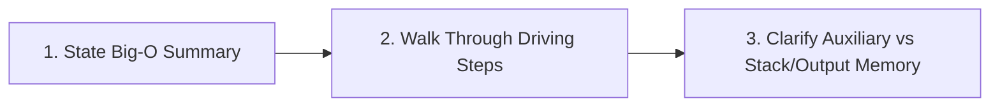

# 04. How to Explain Time & Space Complexity to MAANG Interviewers

---

## 1. Executive Strategy: The 3-Part Verbal Script

In a FAANG / MAANG interview, simply blurting out *"It's O(N) time and O(1) space"* sounds memorized and fails the Communication & Problem Solving evaluation criteria.

Interviewers want to hear:
1. **The Metric & Driving Factor**: What parameter drives the cost ($N$ elements, $V+E$ graph vertices/edges, recursion depth $H$).
2. **The Step-by-Step Accounting**: Why each phase of the algorithm incurs that specific cost.
3. **The Precision Distinction**: Auxiliary Space vs Input/Output Space vs Recursion Call Stack vs V8 Heap memory.

---

## 2. Universal Verbal Formulas for Interviews

### A. For Linear Single-Pass / Two-Pointers ($O(N)$ Time, $O(1)$ Space)
> **🎙️ Verbatim Pitch**:
> *"For **Time Complexity**, this runs in $O(N)$ linear time, where $N$ is the number of elements in the array. We make a single forward pass with our two pointers. In each iteration, we perform constant-time comparisons and pointer updates, meaning each element is visited and processed at most twice (once by the read pointer and once by the write pointer), giving an exact upper bound of $2N$ operations, which reduces to $O(N)$."*
>
> *"For **Space Complexity**, it is strictly $O(1)$ auxiliary space. We mutate the array in-place and only maintain three integer pointer variables (`slow`, `fast`, `n`) on the execution stack, allocating zero additional heap memory."*

---

### B. For Recursive DFS on Trees / Graphs ($O(N)$ Time, $O(H)$ or $O(V)$ Space)
> **🎙️ Verbatim Pitch**:
> *"For **Time Complexity**, this is $O(N)$ where $N$ is the total number of nodes in the binary tree. Our DFS visits every node exactly once and performs constant $O(1)$ work per node."*
>
> *"For **Space Complexity**, the auxiliary memory is dominated by the **call stack**. In the average case of a balanced binary tree, the maximum call stack depth equals the tree height $O(\log N)$. However, in the worst case of a completely skewed/degenerate tree (like a linked list), the recursion depth degrades to $O(N)$, which in V8/Node.js could risk stack overflow if $N > 10^4$."*

---

### C. For Dynamic Programming (Memoization vs Tabulation)
> **🎙️ Verbatim Pitch**:
> *"For **Time Complexity**, it is $O(N \times K)$ where $N$ is the number of items and $K$ is the target capacity. There are $N \times K$ distinct states in our DP matrix, and computing each state takes $O(1)$ time by evaluating previously computed subproblems."*
>
> *"For **Space Complexity**, naive 2D tabulation requires $O(N \times K)$ space. However, because state $i$ only depends on row $i - 1$, we can compress this to **$O(K)$ space** using a 1D rolling array, cutting memory usage from megabytes down to a few kilobytes."*

---

### D. For Divide & Conquer / Sorting / Binary Search
> **🎙️ Verbatim Pitch**:
> *"For **Time Complexity**, this runs in $O(\log N)$ logarithmic time because with every comparison, we halve our search interval $(N \to N/2 \to N/4 \to \dots \to 1)$. The number of divisions until the search space reduces to size 1 is $\log_2(N)$."*
>
> *"For **Space Complexity**, it is $O(1)$ auxiliary space for iterative binary search, or $O(\log N)$ call stack frames if implemented recursively."*

---

## 3. The 4 Big-O Pitfalls That Get Candidates Rejected

| Trap | Why It Fails | What to Say Instead |
| :--- | :--- | :--- |
| **Ignoring the Call Stack** | Claiming recursive algorithms take $O(1)$ space. | *"While we allocate no new variables, the call stack consumes $O(H)$ memory on the execution stack."* |
| **Conflating Input vs Auxiliary Space** | Claiming returning a cloned array of size $N$ is $O(1)$ space. | *"The auxiliary space is $O(1)$ if we exclude the required return array, or $O(N)$ total space."* |
| **String Immutability in JS** | Assuming `str += char` is $O(1)$. In JS, strings are immutable, so concatenation creates a new string in $O(L)$ time! | *"Because JS strings are immutable, repeated concatenation in a loop is $O(N^2)$. We use an array `chunks.push(c)` and `join('')` to maintain $O(N)$."* |
| **Object/Map Deletions** | Assuming `delete obj[key]` is free. | *"In V8, `delete` alters hidden classes and de-optimizes property access. We prefer `map.delete()` or setting to `null`."* |
