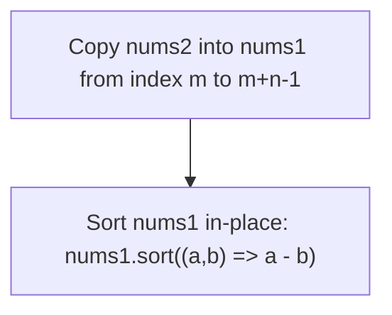
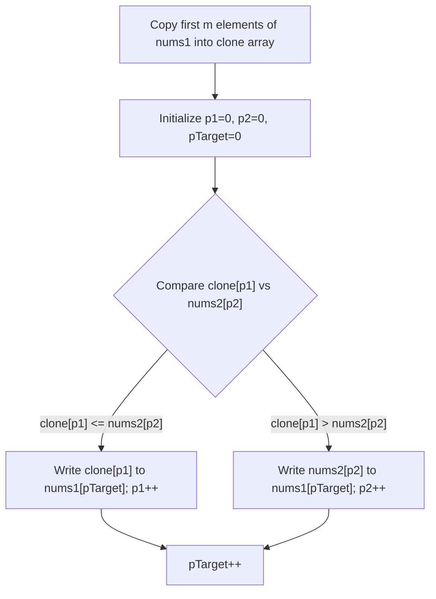
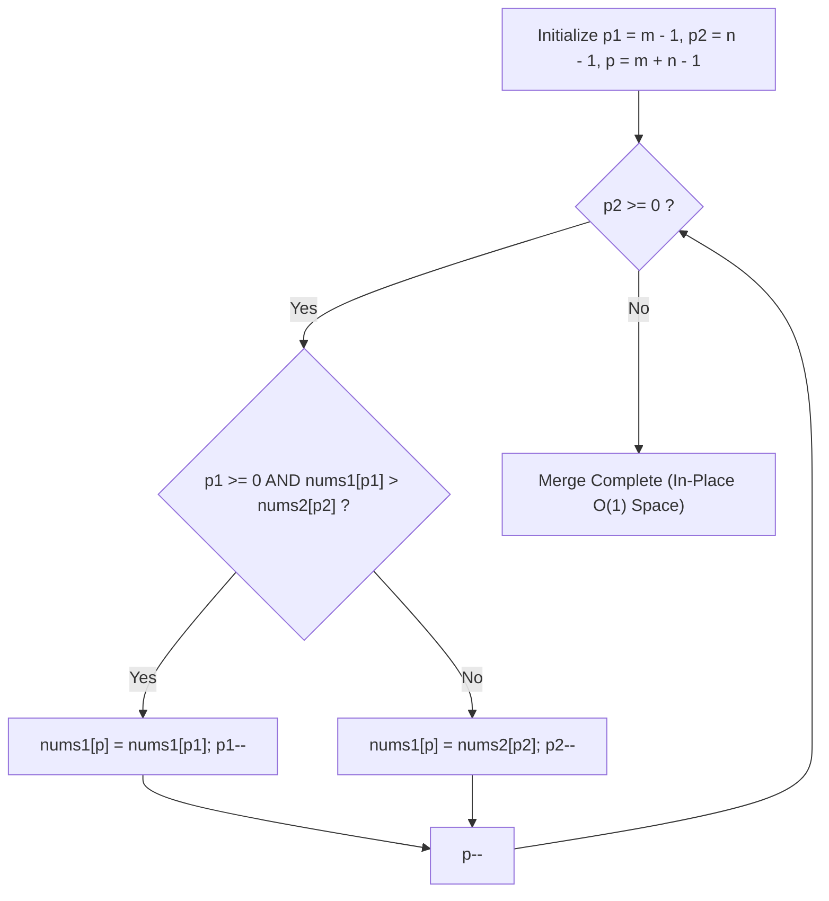
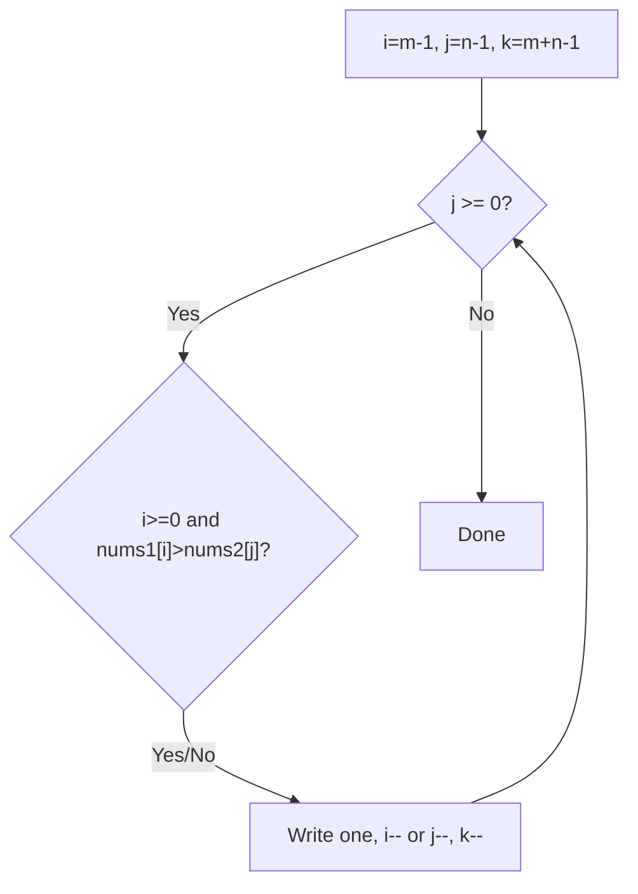

# 88. Merge Sorted Array

- **LeetCode Link**: `https://leetcode.com/problems/merge-sorted-array/`
- **Difficulty**: Easy
- **Pattern Category**: Array / Two Pointers
- **Prerequisite Primer**: `00-foundations/01-two-pointers.md`

---

## 1. Problem Overview & Edge Case Matrix

### Problem Statement
You are given two integer arrays `nums1` and `nums2`, sorted in non-decreasing order, and two integers `m` and `n`, representing the number of elements in `nums1` and `nums2` respectively.

Merge `nums1` and `nums2` into a single array sorted in non-decreasing order. The final sorted array should not be returned by the function, but instead be stored inside the array `nums1`. To accommodate this, `nums1` has a length of `m + n`, where the first `m` elements denote the elements that should be merged, and the last `n` elements are set to `0` and should be ignored.

```
nums1 = [ 1 , 2 , 3 , 0 , 0 , 0 ] , m = 3
nums2 = [ 2 , 5 , 6 ]             , n = 3

Target in-place result:
nums1 = [ 1 , 2 , 2 , 3 , 5 , 6 ]
```

### Upfront Edge Case Matrix

| Edge Case Scenario | Inputs | Expected `nums1` Output | Pitfall / Failure Mode |
| :--- | :--- | :--- | :--- |
| `nums2` is empty ($n=0$) | `nums1 = [1]`, `m = 1`, `nums2 = []`, `n = 0` | `[1]` | Unnecessary overwrites or out-of-bounds loop |
| `nums1` initial elements empty ($m=0$) | `nums1 = [0]`, `m = 0`, `nums2 = [1]`, `n = 1` | `[1]` | Failing to copy remaining elements from `nums2` |
| All elements in `nums2` smaller than `nums1` | `nums1 = [4, 5, 6, 0, 0, 0]`, `nums2 = [1, 2, 3]` | `[1, 2, 3, 4, 5, 6]` | Overwriting unread elements in `nums1` |
| Duplicate / Identical numbers | `nums1 = [2, 2, 0, 0]`, `nums2 = [2, 2]` | `[2, 2, 2, 2]` | Equality comparison edge condition |

---

## 2. Level 1: Brute Force Approach

### Intuition & Visual Idea
The simplest brute force approach is to copy all elements from `nums2` directly into the trailing zero slots of `nums1`, and then invoke JavaScript's built-in sorting method `Array.prototype.sort()`.



### Pseudocode
```text
FUNCTION mergeBruteForce(nums1, m, nums2, n):
    FOR i FROM 0 TO n - 1:
        nums1[m + i] = nums2[i]
    SORT nums1 using ascending numeric comparator
```

### Step-by-Step Dry Run
`nums1 = [1, 3, 5, 0, 0]`, `m = 3`, `nums2 = [2, 4]`, `n = 2`

| Step | Operation | `nums1` State |
| :--- | :--- | :--- |
| 0 | Initial State | `[1, 3, 5, 0, 0]` |
| 1 | Copy `nums2[0]` (2) to `nums1[3]` | `[1, 3, 5, 2, 0]` |
| 2 | Copy `nums2[1]` (4) to `nums1[4]` | `[1, 3, 5, 2, 4]` |
| 3 | Sort `nums1` with numeric comparator | `[1, 2, 3, 4, 5]` |

### Modern JavaScript Implementation
```javascript
/**
 * Level 1: Brute Force (Copy and Sort)
 * Time Complexity:  O((m + n) log(m + n))
 * Space Complexity: O(1) auxiliary (or O(log(m+n)) Timsort stack space)
 */
function mergeBruteForce(nums1, m, nums2, n) {
  // Step 1: Copy elements of nums2 into the end of nums1
  for (let i = 0; i < n; i++) {
    nums1[m + i] = nums2[i];
  }

  // Step 2: Sort nums1 with explicit numerical comparator
  nums1.sort((a, b) => a - b);
}
```

### Complexity Breakdown
- **Time Complexity**: $O((m + n) \log(m + n))$ due to V8's Timsort algorithm.
- **Space Complexity**: $O(1)$ auxiliary space if sorted in place, or $O(\log(m+n))$ stack space for Timsort.

---

## 3. Level 2: Optimized Approach (Forward Two Pointers with Auxiliary Buffer)

### Intuition & Visual Bottleneck Elimination
Since both `nums1` and `nums2` are already sorted, we can merge them in linear time $O(m + n)$ using two pointers starting from the beginning. However, starting from index 0 in `nums1` would overwrite elements we have not yet compared. To prevent overwriting, we copy the first `m` elements of `nums1` into an auxiliary buffer.



### Pseudocode
```text
FUNCTION mergeOptimized(nums1, m, nums2, n):
    clone1 = nums1.slice(0, m)
    p1 = 0, p2 = 0, p = 0
    WHILE p1 < m AND p2 < n:
        IF clone1[p1] <= nums2[p2]:
            nums1[p] = clone1[p1]
            p1++
        ELSE:
            nums1[p] = nums2[p2]
            p2++
        p++
    COPY remaining elements from clone1 or nums2 into nums1
```

### Step-by-Step Dry Run
`nums1 = [1, 3, 0, 0]`, `m = 2`, `nums2 = [2, 4]`, `n = 2`, `clone1 = [1, 3]`

| Step | `p1` (`clone1`) | `p2` (`nums2`) | `p` (`nums1`) | Comparison | Written Value | Resulting `nums1` |
| :--- | :--- | :--- | :--- | :--- | :--- | :--- |
| 1 | 0 (`1`) | 0 (`2`) | 0 | $1 \le 2$ | 1 | `[1, 3, 0, 0]` |
| 2 | 1 (`3`) | 0 (`2`) | 1 | $3 > 2$ | 2 | `[1, 2, 0, 0]` |
| 3 | 1 (`3`) | 1 (`4`) | 2 | $3 \le 4$ | 3 | `[1, 2, 3, 0]` |
| 4 | 2 (Done) | 1 (`4`) | 3 | Copy rest | 4 | `[1, 2, 3, 4]` |

### Modern JavaScript Implementation
```javascript
/**
 * Level 2: Two Pointers with O(m) Auxiliary Buffer
 * Time Complexity:  O(m + n)
 * Space Complexity: O(m)
 */
function mergeOptimized(nums1, m, nums2, n) {
  const clone1 = nums1.slice(0, m);
  let p1 = 0;
  let p2 = 0;
  let p = 0;

  while (p1 < m && p2 < n) {
    if (clone1[p1] <= nums2[p2]) {
      nums1[p++] = clone1[p1++];
    } else {
      nums1[p++] = nums2[p2++];
    }
  }

  // Copy any remaining elements from clone1
  while (p1 < m) {
    nums1[p++] = clone1[p1++];
  }

  // Copy any remaining elements from nums2
  while (p2 < n) {
    nums1[p++] = nums2[p2++];
  }
}
```

### Complexity Breakdown
- **Time Complexity**: $O(m + n)$ — Each element is inspected and placed once.
- **Space Complexity**: $O(m)$ auxiliary space for the `clone1` array.

---

## 4. Level 3: Most Optimal / Canonical Approach (Three Pointers Back-to-Front)

### Intuition & Invariant Proof
Notice that the empty space (the zeroes) in `nums1` is at the **end** (indices $m$ through $m + n - 1$).
If we fill `nums1` from **right to left (largest to smallest)**, we will never overwrite an unread element from `nums1`!

```
nums1: [ 1 , 2 , 3 ,  _ ,  _ ,  _ ]
                 ^              ^
                 p1             p (Write Pointer)
nums2: [ 2 , 5 , 6 ]
                 ^
                 p2
Compare nums1[p1] (3) vs nums2[p2] (6) -> 6 is larger, write to nums1[p], p2--, p--
```



### Pseudocode
```text
FUNCTION mergeMostOptimal(nums1, m, nums2, n):
    p1 = m - 1
    p2 = n - 1
    p = m + n - 1

    WHILE p2 >= 0:
        IF p1 >= 0 AND nums1[p1] > nums2[p2]:
            nums1[p] = nums1[p1]
            p1--
        ELSE:
            nums1[p] = nums2[p2]
            p2--
        p--
```

### Step-by-Step Dry Run
`nums1 = [1, 2, 3, 0, 0, 0]`, `m = 3`, `nums2 = [2, 5, 6]`, `n = 3`

| Step | `p1` (`nums1`) | `p2` (`nums2`) | Write `p` | Condition Checked | Action | Resulting `nums1` |
| :--- | :--- | :--- | :--- | :--- | :--- | :--- |
| 1 | 2 (`3`) | 2 (`6`) | 5 | $3 > 6$ is False | `nums1[5] = 6`, `p2=1` | `[1, 2, 3, 0, 0, 6]` |
| 2 | 2 (`3`) | 1 (`5`) | 4 | $3 > 5$ is False | `nums1[4] = 5`, `p2=0` | `[1, 2, 3, 0, 5, 6]` |
| 3 | 2 (`3`) | 0 (`2`) | 3 | $3 > 2$ is True | `nums1[3] = 3`, `p1=1` | `[1, 2, 3, 3, 5, 6]` |
| 4 | 1 (`2`) | 0 (`2`) | 2 | $2 > 2$ is False | `nums1[2] = 2`, `p2=-1`| `[1, 2, 2, 3, 5, 6]` |
| 5 | Terminate | `p2 < 0` | - | All `nums2` placed | `nums1` already in place | `[1, 2, 2, 3, 5, 6]` |

### Modern JavaScript Implementation
```javascript
/**
 * Level 3: In-Place Back-to-Front Two Pointers
 * Time Complexity:  O(m + n)
 * Space Complexity: O(1) Auxiliary
 */
function merge(nums1, m, nums2, n) {
  let p1 = m - 1;
  let p2 = n - 1;
  let p = m + n - 1;

  // We only need to loop while there are still elements in nums2.
  // If p2 < 0, any remaining elements in nums1 are already in their correct sorted positions.
  while (p2 >= 0) {
    if (p1 >= 0 && nums1[p1] > nums2[p2]) {
      nums1[p] = nums1[p1];
      p1--;
    } else {
      nums1[p] = nums2[p2];
      p2--;
    }
    p--;
  }
}
```

### Complexity Breakdown
- **Time Complexity**: $O(m + n)$ — Single backwards pass, visiting each index at most once.
- **Space Complexity**: $O(1)$ auxiliary space — strictly in-place mutation.

---

## 5. JavaScript-Specific Gotchas & V8 Optimizations
- **No Array Reallocations**: Operating strictly on the pre-allocated array indices avoids trigger of V8 array buffer growth or hidden class transitions.
- **Loop Termination Invariant**: The condition `while (p2 >= 0)` is the most common bug source for junior candidates. If `nums1` runs out first (`p1 < 0`), we must continue copying elements from `nums2`. If `nums2` runs out first (`p2 < 0`), the remaining elements in `nums1` are already sorted in place!

---

## 6. Real-World MAANG Interview Follow-Ups & Extensions

### Follow-Up 1: Merging $K$ Sorted Arrays of Variable Lengths (External Scale)
- **Scenario**: What if instead of 2 arrays, you are given $K$ sorted streams/arrays where total elements $N = 10^9$ and cannot fit in memory at once?
- **Solution Strategy**: Use a **Min-Heap / Priority Queue** of size $K$. Insert the first element of each of the $K$ streams into the MinHeap `[value, arrayIndex, elementIndex]`. Repeatedly extract min and pull the next element from the corresponding stream.
- **JS Code**:
```javascript
import { PriorityQueue } from '../00-foundations/02-data-structure-polyfills.js';

function mergeKSortedArrays(arrays) {
  const minHeap = new PriorityQueue((a, b) => a.val - b.val);
  const result = [];

  // Seed heap with first element of each non-empty array
  for (let i = 0; i < arrays.length; i++) {
    if (arrays[i].length > 0) {
      minHeap.push({ val: arrays[i][0], arrIdx: i, elemIdx: 0 });
    }
  }

  while (!minHeap.isEmpty()) {
    const { val, arrIdx, elemIdx } = minHeap.pop();
    result.push(val);

    if (elemIdx + 1 < arrays[arrIdx].length) {
      minHeap.push({
        val: arrays[arrIdx][elemIdx + 1],
        arrIdx,
        elemIdx: elemIdx + 1
      });
    }
  }

  return result;
}
```
- **Complexity**: $O(N \log K)$ time, $O(K)$ space.

### Follow-Up 2: Streaming Duplicates Deduplication on Continuous Feed
- **Scenario**: What if inputs arrive as continuous streams and we only want to output unique merged items without memory accumulation?
- **Solution Strategy**: Maintain a single `lastEmitted` sentinel variable and emit strictly when `currentVal !== lastEmitted`.
- **JS Code**:
```javascript
function* mergeSortedGenerators(gen1, gen2) {
  let step1 = gen1.next();
  let step2 = gen2.next();
  let lastEmitted = Symbol('none');

  while (!step1.done || !step2.done) {
    let candidate;
    if (step2.done || (!step1.done && step1.value <= step2.value)) {
      candidate = step1.value;
      step1 = gen1.next();
    } else {
      candidate = step2.value;
      step2 = gen2.next();
    }

    if (candidate !== lastEmitted) {
      lastEmitted = candidate;
      yield candidate;
    }
  }
}
```

---

## 7. What LeetCode Discuss Says (Language-Independent)

Source: top-voted post by Aman —
`https://leetcode.com/problems/merge-sorted-array/solutions/3436053/beats-100-best-cjavapython-and-javascrip-ftpu/`
— 955.4K views / 5.9K votes / 210 comments.
Language-independent summary. No new JS here.

### A. Brute way from Discuss

Copy tail, then sort.

```text
FUNCTION mergeBrute(nums1, m, nums2, n):
    FOR j FROM 0 TO n - 1:
        nums1[m + j] = nums2[j]
    SORT nums1 ascending
```

- Time: O((m + n) log(m + n))
- Space: O(1)

### B. Optimal way from Discuss

Reverse 3-pointer. Fill from the back.
Back slots are free, so no overwrite.

```text
FUNCTION mergeOptimal(nums1, m, nums2, n):
    i = m - 1
    j = n - 1
    k = m + n - 1
    WHILE j >= 0:
        IF i >= 0 AND nums1[i] > nums2[j]:
            nums1[k] = nums1[i]
            i--
        ELSE:
            nums1[k] = nums2[j]
            j--
        k--
```

- Time: O(m + n)
- Space: O(1)
- Leftover nums1 needs no work.
- Loop guard is p2 >= 0 (here j >= 0).



### C. Dry run on LeetCode Example 1

`nums1 = [1, 2, 3, 0, 0, 0]`, `m = 3`
`nums2 = [2, 5, 6]`, `n = 3`

| Step | i | j | k | Action | nums1 |
| :--- | :--- | :--- | :--- | :--- | :--- |
| 0 | 2 | 2 | 5 | Start | [1, 2, 3, 0, 0, 6] |
| 1 | 2 | 2 | 5 | 3 > 6? No, write 6 | [1, 2, 3, 0, 0, 6] |
| 2 | 2 | 1 | 4 | 3 > 5? No, write 5 | [1, 2, 3, 0, 5, 6] |
| 3 | 2 | 0 | 3 | 3 > 2? Yes, write 3 | [1, 2, 3, 3, 5, 6] |
| 4 | 1 | 0 | 2 | 2 > 2? No, write 2 | [1, 2, 2, 3, 5, 6] |
| 5 | 1 | -1 | - | j < 0, stop | [1, 2, 2, 3, 5, 6] |

### D. Why B beats A

- No sort() call.
- No extra buffer.
- One back-to-front pass.
- Safe for m = 0 or n = 0.

### E. Pitfalls from comments

- `sort()` questioned: why call
  sort() in a sorting question?
- Guard confusion: loop while
  j >= 0 (p2 >= 0), not i >= 0.
- Decrement confusion: k-- (p--)
  every step, i-- or j-- once.
- m = 0: copy all of nums2.
- n = 0: do nothing.

### F. Companies

- Discuss post itself names none.
- Companies tab on LeetCode is
  premium-locked.
- External source:
  `https://github.com/liquidslr/leetcode-company-wise-problems`
  (LeetCode company tags, updated June 2025).
- All-time (34): Accenture, Amazon,
  AMD, Apple, Avito, Bloomberg,
  Cisco, Cognizant, DE Shaw,
  EPAM Systems, Goldman Sachs,
  Google, HCL, Hubspot, IBM,
  Infosys, LinkedIn, Meta,
  Microsoft, Nvidia, Oracle,
  Palo Alto Networks,
  persistent systems, Qualcomm,
  Samsung, Squarespace, Swiggy,
  TCS, TikTok, Verkada, Visa,
  Wipro, Yandex, Zoho.
- Recent: 30 days — Amazon,
  Google, TCS.
- Recent: 3 months — Amazon,
  Bloomberg, EPAM Systems,
  Google, Meta, Microsoft, TCS.
