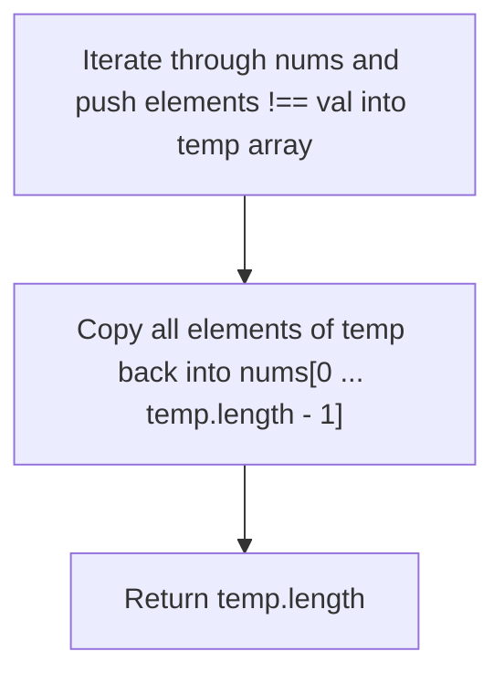
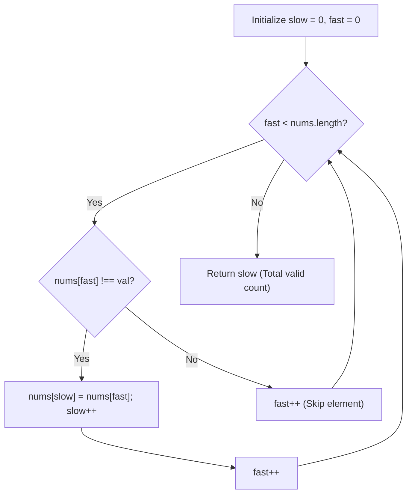
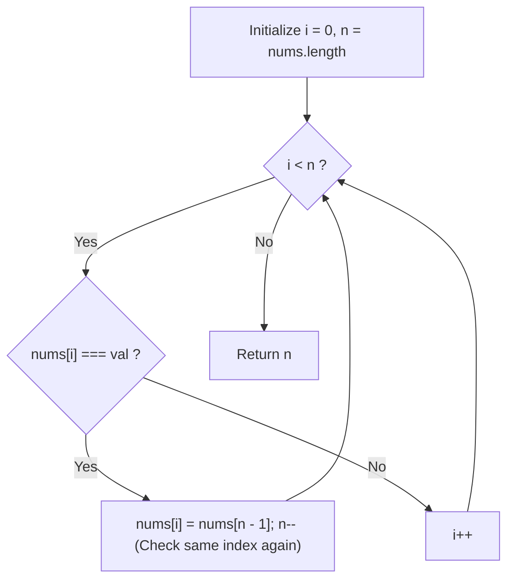

# 27. Remove Element

- **LeetCode Link**: `https://leetcode.com/problems/remove-element/`
- **Difficulty**: Easy
- **Pattern Category**: Array / In-Place Two Pointers
- **Prerequisite Primer**: `00-foundations/01-two-pointers.md`

---

## 1. Problem Overview & Edge Case Matrix

### Problem Statement
Given an integer array `nums` and an integer `val`, remove all occurrences of `val` in `nums` **in-place**. The order of the elements may be changed. Then return the number of elements in `nums` which are not equal to `val`.

Consider the number of elements in `nums` which are not equal to `val` be `k`. To get accepted, you must:
1. Modify the array `nums` such that the first `k` elements of `nums` contain the elements which are not equal to `val`.
2. The remaining elements of `nums` beyond `k` do not matter.
3. Return `k`.

```
nums = [ 3 , 2 , 2 , 3 ] , val = 3
Result: k = 2, nums = [ 2 , 2 , _ , _ ]
```

### Upfront Edge Case Matrix

| Edge Case Scenario | Inputs | Expected Output | Pitfall / Failure Mode |
| :--- | :--- | :--- | :--- |
| Empty Array | `nums = []`, `val = 1` | `k = 0`, `nums = []` | Out-of-bounds array access |
| All elements equal to `val` | `nums = [2, 2, 2]`, `val = 2` | `k = 0`, `nums = [_, _, _]` | Slow pointer incremented erroneously |
| No elements equal to `val` | `nums = [1, 2, 3]`, `val = 4` | `k = 3`, `nums = [1, 2, 3]` | Overwriting valid elements |
| Single element equals `val` | `nums = [1]`, `val = 1` | `k = 0`, `nums = [_]` | Loop fence-post bug |
| Single element differs from `val` | `nums = [1]`, `val = 2` | `k = 1`, `nums = [1]` | Pointer initialization failure |

---

## 2. Level 1: Brute Force Approach (Auxiliary Filtering & Copyback)

### Intuition & Visual Idea
The most intuitive approach is to filter all elements not equal to `val` into a temporary auxiliary array, and then copy the filtered elements back into the beginning of `nums`.



### Pseudocode
```text
FUNCTION removeElementBruteForce(nums, val):
    temp = []
    FOR each num IN nums:
        IF num != val:
            temp.append(num)
    FOR i FROM 0 TO temp.length - 1:
        nums[i] = temp[i]
    RETURN temp.length
```

### Step-by-Step Dry Run
`nums = [3, 2, 2, 3]`, `val = 3`

| Step | Current Element | Condition (`num !== 3`) | `temp` Array | Action |
| :--- | :--- | :--- | :--- | :--- |
| 1 | `nums[0] = 3` | False | `[]` | Skip |
| 2 | `nums[1] = 2` | True | `[2]` | Append |
| 3 | `nums[2] = 2` | True | `[2, 2]` | Append |
| 4 | `nums[3] = 3` | False | `[2, 2]` | Skip |
| 5 | Copyback | - | `nums = [2, 2, 2, 3]` | Return `2` |

### Modern JavaScript Implementation
```javascript
/**
 * Level 1: Brute Force with Auxiliary Array
 * Time Complexity:  O(N)
 * Space Complexity: O(N) auxiliary space
 */
function removeElementBruteForce(nums, val) {
  const temp = [];
  for (let i = 0; i < nums.length; i++) {
    if (nums[i] !== val) {
      temp.push(nums[i]);
    }
  }

  for (let i = 0; i < temp.length; i++) {
    nums[i] = temp[i];
  }

  return temp.length;
}
```

### Complexity Breakdown
- **Time Complexity**: $O(N)$ — Two passes over the array.
- **Space Complexity**: $O(N)$ — Requires allocating an auxiliary `temp` array.

---

## 3. Level 2: Optimized Approach (Fast-Slow Two Pointers)

### Intuition & Visual Bottleneck Elimination
Instead of allocating auxiliary memory, we can maintain two pointers:
- **`fast` pointer**: Scans through every element in the array.
- **`slow` write pointer**: Points to the index where the next valid element should be written.

```
nums: [ 3 , 2 , 2 , 3 ] , val = 3
        ^
      slow, fast

fast=0: nums[0] === 3 -> skip
fast=1: nums[1] !== 3 -> nums[slow] = nums[1], slow++, fast++
```



### Pseudocode
```text
FUNCTION removeElementOptimized(nums, val):
    slow = 0
    FOR fast FROM 0 TO nums.length - 1:
        IF nums[fast] != val:
            nums[slow] = nums[fast]
            slow++
    RETURN slow
```

### Step-by-Step Dry Run
`nums = [0, 1, 2, 2, 3, 0, 4, 2]`, `val = 2`

| Step | `fast` | `nums[fast]` | Condition (`!== 2`) | `slow` | `nums` State |
| :--- | :--- | :--- | :--- | :--- | :--- |
| 1 | 0 | 0 | True | $0 \to 1$ | `[0, 1, 2, 2, 3, 0, 4, 2]` |
| 2 | 1 | 1 | True | $1 \to 2$ | `[0, 1, 2, 2, 3, 0, 4, 2]` |
| 3 | 2 | 2 | False | 2 | `[0, 1, 2, 2, 3, 0, 4, 2]` |
| 4 | 3 | 2 | False | 2 | `[0, 1, 2, 2, 3, 0, 4, 2]` |
| 5 | 4 | 3 | True | $2 \to 3$ | `[0, 1, 3, 2, 3, 0, 4, 2]` |
| 6 | 5 | 0 | True | $3 \to 4$ | `[0, 1, 3, 0, 3, 0, 4, 2]` |
| 7 | 6 | 4 | True | $4 \to 5$ | `[0, 1, 3, 0, 4, 0, 4, 2]` |
| 8 | 7 | 2 | False | 5 | `[0, 1, 3, 0, 4, 0, 4, 2]` |

### Modern JavaScript Implementation
```javascript
/**
 * Level 2: Fast-Slow Two Pointers (In-Place)
 * Time Complexity:  O(N)
 * Space Complexity: O(1) Auxiliary
 */
function removeElementOptimized(nums, val) {
  let slow = 0;
  for (let fast = 0; fast < nums.length; fast++) {
    if (nums[fast] !== val) {
      nums[slow] = nums[fast];
      slow++;
    }
  }
  return slow;
}
```

### Complexity Breakdown
- **Time Complexity**: $O(N)$ — Exactly $N$ iterations.
- **Space Complexity**: $O(1)$ — In-place modifications without allocating extra heap memory.

---

## 4. Level 3: Most Optimal / Canonical Approach (Two Pointers - Swap from Right)

### Intuition & Bottleneck Elimination
What if elements equal to `val` are **rare**? For instance: `nums = [1, 2, 3, 4, 5, 6, ..., 1000]`, `val = 1`.
Level 2 performs 999 unnecessary assignments (`nums[0]=nums[1]`, `nums[1]=nums[2]`, ...).
Since the problem states that **order does not matter**, when we encounter `nums[i] === val`, we can swap it with the last element and reduce the array size by 1!

```
nums = [ 3 , 2 , 2 , 3 ] , val = 3
         ^           ^
         i           n - 1

nums[i] === 3 -> nums[i] = nums[n-1], n-- (Do not increment i, recheck swapped value!)
```



### Pseudocode
```text
FUNCTION removeElementMostOptimal(nums, val):
    i = 0
    n = nums.length
    WHILE i < n:
        IF nums[i] == val:
            nums[i] = nums[n - 1]
            n--
        ELSE:
            i++
    RETURN n
```

### Step-by-Step Dry Run
`nums = [4, 1, 2, 3, 5]`, `val = 4`

| Step | `i` | `n` | `nums[i]` | Condition (`=== 4`) | Action | `nums` State |
| :--- | :--- | :--- | :--- | :--- | :--- | :--- |
| 1 | 0 | 5 | 4 | True | `nums[0] = nums[4] (5)`, `n = 4` | `[5, 1, 2, 3, 5]` |
| 2 | 0 | 4 | 5 | False | `i = 1` | `[5, 1, 2, 3, 5]` |
| 3 | 1 | 4 | 1 | False | `i = 2` | `[5, 1, 2, 3, 5]` |
| 4 | 2 | 4 | 2 | False | `i = 3` | `[5, 1, 2, 3, 5]` |
| 5 | 3 | 4 | 3 | False | `i = 4` | `[5, 1, 2, 3, 5]` |
| 6 | 4 | 4 | - | `i < n` False | Terminate | Return `n = 4` |

### Modern JavaScript Implementation
```javascript
/**
 * Level 3: Two Pointers - Swap with Last Element (Optimal when elements to remove are rare)
 * Time Complexity:  O(N) (At most N operations total, fewer writes)
 * Space Complexity: O(1) Auxiliary
 */
function removeElement(nums, val) {
  let i = 0;
  let n = nums.length;

  while (i < n) {
    if (nums[i] === val) {
      nums[i] = nums[n - 1];
      n--; // Reduce length, inspect swapped element at index i on next loop
    } else {
      i++;
    }
  }

  return n;
}
```

### Complexity Breakdown
- **Time Complexity**: $O(N)$ — The number of assignment operations is equal to the number of elements to remove ($K \le N$).
- **Space Complexity**: $O(1)$ — Zero auxiliary space.

---

## 5. JavaScript-Specific Gotchas & V8 Optimizations
- **Do Not Use `nums.splice(i, 1)`**: `splice()` shifts all subsequent elements to the left, turning an $O(N)$ algorithm into an $O(N^2)$ algorithm.
- **Do Not Reallocate Length**: Mutating `nums.length = n` is valid JS, but LeetCode inspects the first $k$ elements based on the returned integer $k$.

---

## 6. Real-World MAANG Interview Follow-Ups & Extensions

### Follow-Up 1: Preserving Relative Order with Minimal Writes
- **Scenario**: What if the interviewer requires preserving the original order of non-removed elements?
- **Solution Strategy**: Level 3 modifies order. To maintain relative order, we must use Level 2 (Fast-Slow pointers), which guarantees stable relative ordering with at most $N$ writes.

### Follow-Up 2: Batch Removal of Multiple Target Values (Set Lookup)
- **Scenario**: What if instead of removing a single value `val`, we are given a set of $M$ values `targets = [v1, v2, ...]` to remove?
- **Solution Strategy**: Convert `targets` to a `Set` for $O(1)$ lookup time and apply Fast-Slow two pointers.
- **JS Code**:
```javascript
function removeMultipleElements(nums, targets) {
  const targetSet = new Set(targets);
  let slow = 0;

  for (let fast = 0; fast < nums.length; fast++) {
    if (!targetSet.has(nums[fast])) {
      nums[slow] = nums[fast];
      slow++;
    }
  }

  return slow;
}
```
- **Complexity**: $O(N + M)$ time, $O(M)$ auxiliary space.
