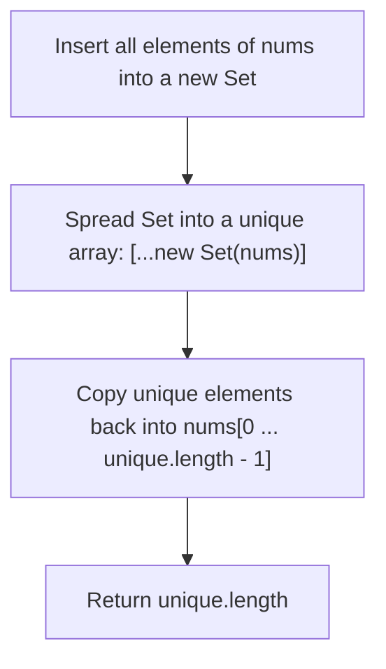
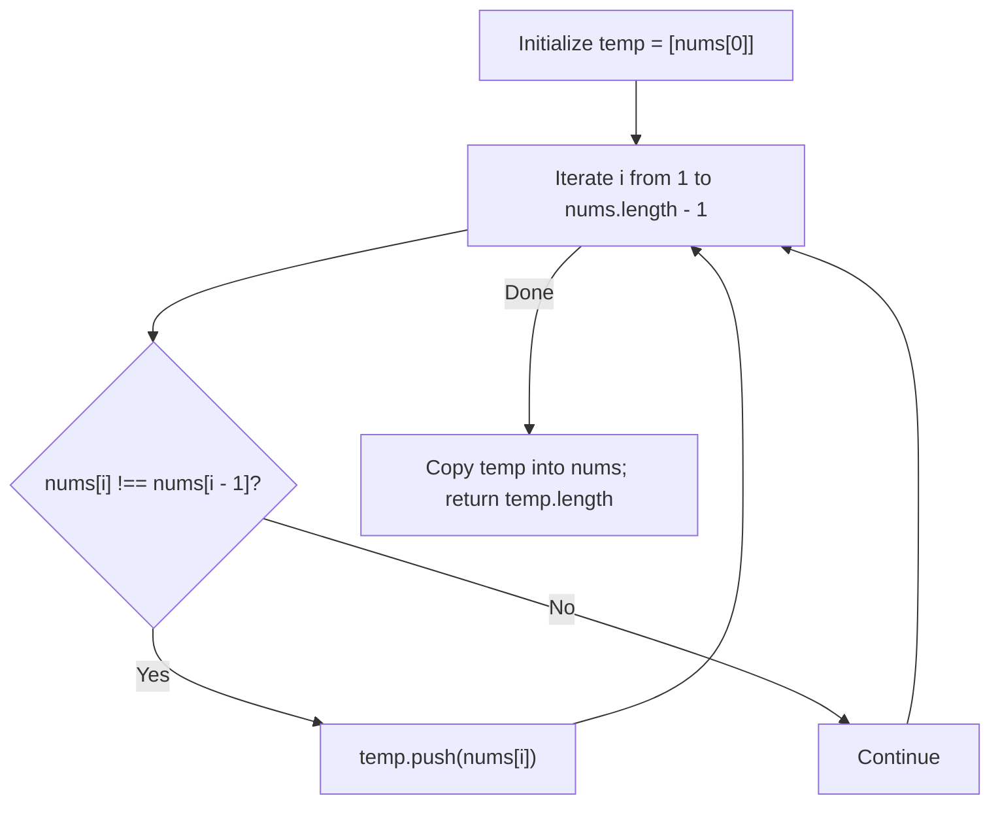
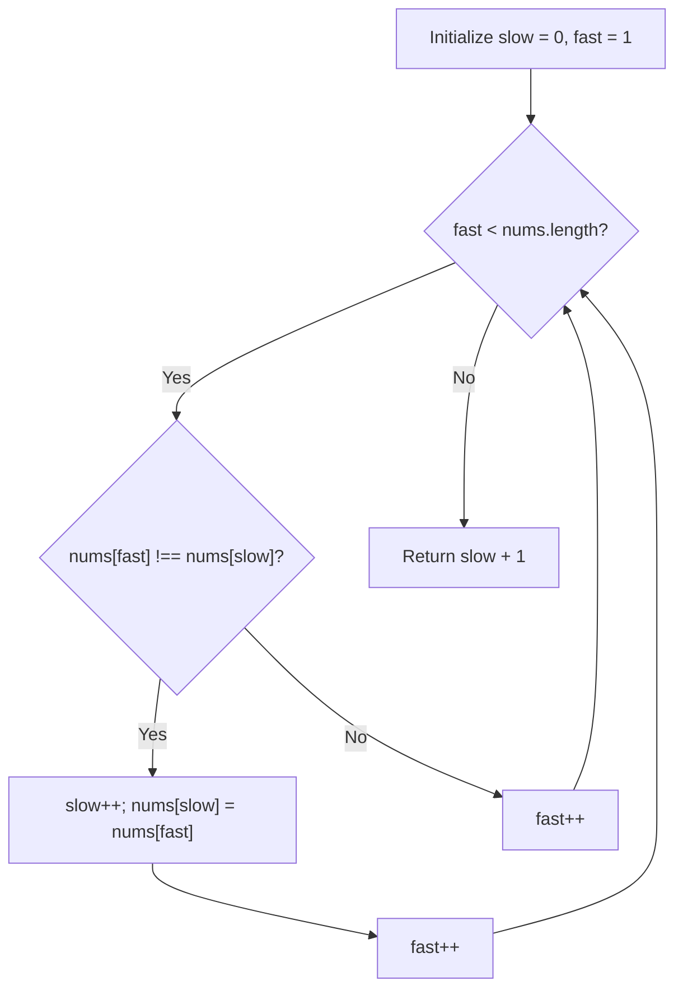

# 26. Remove Duplicates from Sorted Array

- **LeetCode Link**: `https://leetcode.com/problems/remove-duplicates-from-sorted-array/`
- **Difficulty**: Easy
- **Pattern Category**: Array / Two Pointers
- **Prerequisite Primer**: `00-foundations/01-two-pointers.md`

---

## 1. Problem Overview & Edge Case Matrix

### Problem Statement
Given an integer array `nums` sorted in non-decreasing order, remove the duplicates **in-place** such that each unique element appears only once. The relative order of the elements should be kept the same. Then return the number of unique elements in `nums`.

Consider the number of unique elements of `nums` to be `k`. You must modify `nums` such that the first `k` elements contain the unique elements in the order they were present initially. The remaining elements beyond index `k - 1` are not important.

```
nums = [ 0 , 0 , 1 , 1 , 1 , 2 , 2 , 3 , 3 , 4 ]

Result: k = 5
nums = [ 0 , 1 , 2 , 3 , 4 , _ , _ , _ , _ , _ ]
```

### Upfront Edge Case Matrix

| Edge Case Scenario | Inputs | Expected Output | Pitfall / Failure Mode |
| :--- | :--- | :--- | :--- |
| Empty Array | `nums = []` | `k = 0` | Index out-of-bounds on `nums[0]` |
| Single Element | `nums = [1]` | `k = 1`, `nums = [1]` | Loop failing to execute or off-by-one |
| All Identical Elements | `nums = [2, 2, 2, 2]` | `k = 1`, `nums = [2]` | Advancing write pointer erroneously |
| All Unique Elements | `nums = [1, 2, 3, 4]` | `k = 4`, `nums = [1, 2, 3, 4]` | Unnecessary writes or premature termination |
| Negative and Positive Values | `nums = [-3, -3, -2, 0, 0, 1]` | `k = 4`, `nums = [-3, -2, 0, 1]` | Sign coercion bugs |

---

## 2. Level 1: Brute Force Approach (Set Deduplication & Overwrite)

### Intuition & Visual Idea
Use JavaScript's native `Set` data structure to extract unique values, convert the set back to an array, and copy the values over the initial portion of `nums`.



### Pseudocode
```text
FUNCTION removeDuplicatesBruteForce(nums):
    IF nums.length == 0: RETURN 0
    unique = Array.from(new Set(nums))
    FOR i FROM 0 TO unique.length - 1:
        nums[i] = unique[i]
    RETURN unique.length
```

### Step-by-Step Dry Run
`nums = [1, 1, 2]`

| Step | Operation | State |
| :--- | :--- | :--- |
| 1 | Construct Set from `nums` | `Set { 1, 2 }` |
| 2 | Convert Set to Array | `unique = [1, 2]` |
| 3 | Overwrite `nums[0]` with `unique[0]` | `nums[0] = 1` |
| 4 | Overwrite `nums[1]` with `unique[1]` | `nums[1] = 2` |
| 5 | Return length | `2` |

### Modern JavaScript Implementation
```javascript
/**
 * Level 1: Brute Force (Set Deduplication)
 * Time Complexity:  O(N)
 * Space Complexity: O(N) Auxiliary Space
 */
function removeDuplicatesBruteForce(nums) {
  if (nums.length === 0) return 0;

  const unique = [...new Set(nums)];
  for (let i = 0; i < unique.length; i++) {
    nums[i] = unique[i];
  }

  return unique.length;
}
```

### Complexity Breakdown
- **Time Complexity**: $O(N)$ — Iterates through the array to populate the set and then copies back.
- **Space Complexity**: $O(N)$ — The `Set` and `unique` array take auxiliary linear space.

---

## 3. Level 2: Optimized Approach (Linear Scan with Temporary Array)

### Intuition & Visual Bottleneck Elimination
Since `nums` is already sorted, adjacent duplicates are consecutive. We can iterate once through `nums` and collect only elements that differ from their preceding neighbor into an auxiliary array, then copy them back.



### Pseudocode
```text
FUNCTION removeDuplicatesOptimized(nums):
    IF nums.length <= 1: RETURN nums.length
    temp = [nums[0]]
    FOR i FROM 1 TO nums.length - 1:
        IF nums[i] != nums[i - 1]:
            temp.push(nums[i])
    FOR i FROM 0 TO temp.length - 1:
        nums[i] = temp[i]
    RETURN temp.length
```

### Step-by-Step Dry Run
`nums = [0, 0, 1, 1, 2]`

| Step | `i` | `nums[i]` | `nums[i-1]` | `nums[i] !== nums[i-1]` | `temp` Array |
| :--- | :--- | :--- | :--- | :--- | :--- |
| 1 | 1 | 0 | 0 | False | `[0]` |
| 2 | 2 | 1 | 0 | True | `[0, 1]` |
| 3 | 3 | 1 | 1 | False | `[0, 1]` |
| 4 | 4 | 2 | 1 | True | `[0, 1, 2]` |
| 5 | Copyback | - | - | - | Return `3` |

### Modern JavaScript Implementation
```javascript
/**
 * Level 2: Consecutive Comparison with Auxiliary Array
 * Time Complexity:  O(N)
 * Space Complexity: O(U) where U is unique elements count
 */
function removeDuplicatesOptimized(nums) {
  if (nums.length <= 1) return nums.length;

  const temp = [nums[0]];
  for (let i = 1; i < nums.length; i++) {
    if (nums[i] !== nums[i - 1]) {
      temp.push(nums[i]);
    }
  }

  for (let i = 0; i < temp.length; i++) {
    nums[i] = temp[i];
  }

  return temp.length;
}
```

### Complexity Breakdown
- **Time Complexity**: $O(N)$
- **Space Complexity**: $O(U)$ auxiliary space where $U \le N$.

---

## 4. Level 3: Most Optimal / Canonical Approach (Fast-Slow In-Place Two Pointers)

### Intuition & Invariant Proof
We can perform the deduplication entirely in-place in $O(1)$ auxiliary space:
- **`slow` write pointer**: Points to the last confirmed unique element index.
- **`fast` read pointer**: Scans forward looking for elements where `nums[fast] !== nums[slow]`.

```
nums: [ 0 , 0 , 1 , 1 , 1 , 2 , 2 , 3 , 3 , 4 ]
        ^   ^
      slow fast

nums[fast] === nums[slow] (0 === 0) -> fast++
fast advances until nums[fast] === 1.
nums[fast] !== nums[slow] -> slow++, nums[slow] = nums[fast]
```



### Pseudocode
```text
FUNCTION removeDuplicates(nums):
    IF nums.length == 0: RETURN 0
    slow = 0
    FOR fast FROM 1 TO nums.length - 1:
        IF nums[fast] != nums[slow]:
            slow++
            nums[slow] = nums[fast]
    RETURN slow + 1
```

### Step-by-Step Dry Run
`nums = [0, 0, 1, 1, 2]`

| Step | `slow` | `fast` | `nums[slow]` | `nums[fast]` | Comparison | Action | Array State |
| :--- | :--- | :--- | :--- | :--- | :--- | :--- | :--- |
| 1 | 0 | 1 | 0 | 0 | Equal | `fast++` | `[0, 0, 1, 1, 2]` |
| 2 | 0 | 2 | 0 | 1 | Different | `slow=1`, `nums[1]=1` | `[0, 1, 1, 1, 2]` |
| 3 | 1 | 3 | 1 | 1 | Equal | `fast++` | `[0, 1, 1, 1, 2]` |
| 4 | 1 | 4 | 1 | 2 | Different | `slow=2`, `nums[2]=2` | `[0, 1, 2, 1, 2]` |
| 5 | End | 5 | - | - | Loop terminates | Return `slow + 1 = 3` | `[0, 1, 2, ...]` |

### Modern JavaScript Implementation
```javascript
/**
 * Level 3: In-Place Two Pointers (Canonical)
 * Time Complexity:  O(N)
 * Space Complexity: O(1) Auxiliary
 */
function removeDuplicates(nums) {
  if (nums.length === 0) return 0;

  let slow = 0;
  for (let fast = 1; fast < nums.length; fast++) {
    if (nums[fast] !== nums[slow]) {
      slow++;
      nums[slow] = nums[fast];
    }
  }

  return slow + 1;
}
```

### Complexity Breakdown
- **Time Complexity**: $O(N)$ — Single pass through `nums`.
- **Space Complexity**: $O(1)$ — Zero extra allocations.

---

## 5. JavaScript-Specific Gotchas & V8 Optimizations
- **Direct Index Writing**: Writing to `nums[slow]` preserves the packed array structure in V8, avoiding hidden class transitions.
- **Return Value**: Notice we return `slow + 1` (the count of unique items), not `slow` (the last index).

---

## 6. Real-World MAANG Interview Follow-Ups & Extensions

### Follow-Up 1: Generalizing to Allow at Most $K$ Duplicates
- **Scenario**: What if each unique element is allowed to appear at most $K$ times (e.g., $K = 2$ in LeetCode 80)?
- **Solution Strategy**: Compare `nums[fast]` with `nums[slow - k]`. If `nums[fast] > nums[slow - k]`, place element at `nums[slow++]`.
- **JS Code**:
```javascript
function removeDuplicatesAtMostK(nums, k) {
  if (nums.length <= k) return nums.length;
  let slow = k;

  for (let fast = k; fast < nums.length; fast++) {
    if (nums[fast] !== nums[slow - k]) {
      nums[slow++] = nums[fast];
    }
  }

  return slow;
}
```

### Follow-Up 2: Streaming Deduplication with $O(1)$ Working Memory
- **Scenario**: What if elements arrive in an infinite sorted stream over a WebSocket or Node.js pipeline?
- **Solution Strategy**: Maintain a single variable `lastSeen` and yield only new distinct values.
- **JS Code**:
```javascript
async function* deduplicateStream(asyncIterable) {
  let lastSeen = Symbol('EMPTY');
  for await (const item of asyncIterable) {
    if (item !== lastSeen) {
      lastSeen = item;
      yield item;
    }
  }
}
```
