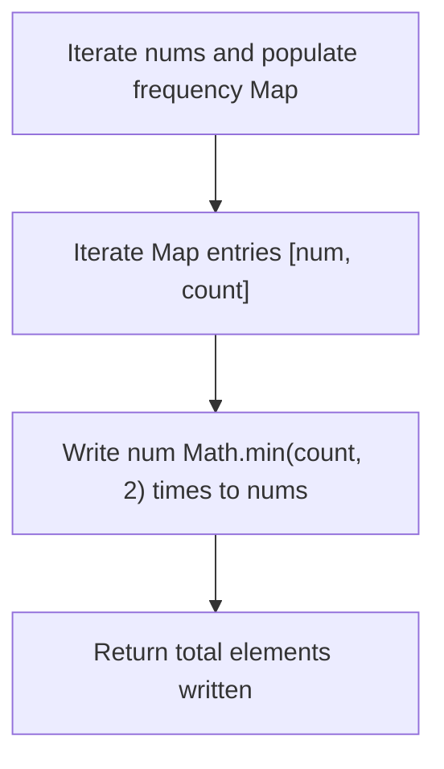
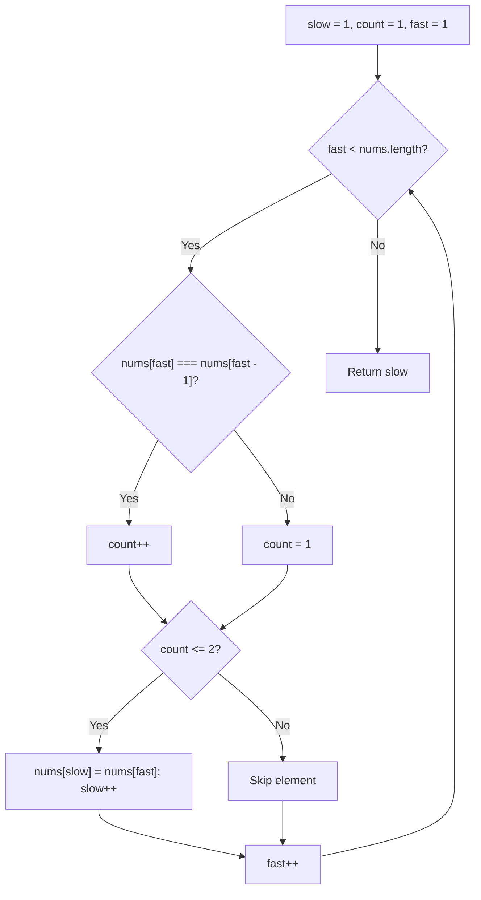
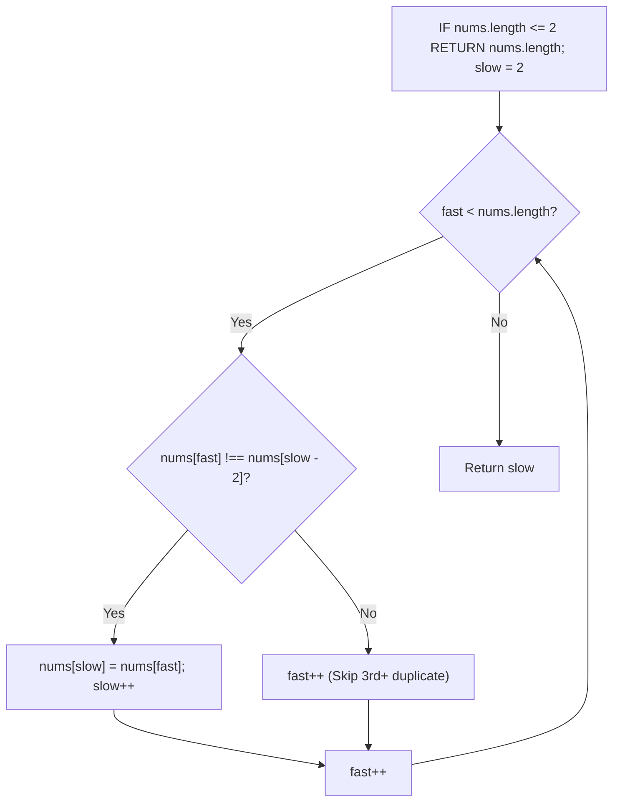
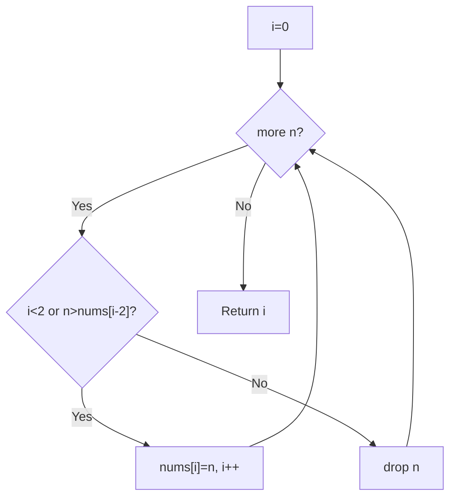

# 80. Remove Duplicates from Sorted Array II

- **LeetCode Link**: `https://leetcode.com/problems/remove-duplicates-from-sorted-array-ii/`
- **Difficulty**: Medium
- **Pattern Category**: Array / Two Pointers
- **Prerequisite Primer**: `00-foundations/01-two-pointers.md`

---

## 1. Problem Overview & Edge Case Matrix

### Problem Statement
Given an integer array `nums` sorted in non-decreasing order, remove some duplicates **in-place** such that each unique element appears **at most twice**. The relative order of the elements should be kept the same.

Return `k` after placing the final result in the first `k` slots of `nums`.

```
nums = [ 1 , 1 , 1 , 2 , 2 , 3 ]

Result: k = 5
nums = [ 1 , 1 , 2 , 2 , 3 , _ ]
```

### Upfront Edge Case Matrix

| Edge Case Scenario | Inputs | Expected Output | Pitfall / Failure Mode |
| :--- | :--- | :--- | :--- |
| Array Length $\le 2$ | `nums = [1, 1]` | `k = 2`, `nums = [1, 1]` | Attempting to access negative index `slow - 2` |
| All Identical Elements ($>2$) | `nums = [1, 1, 1, 1, 1]` | `k = 2`, `nums = [1, 1]` | Incrementing write pointer beyond 2 |
| No Element Appears $> 2$ Times | `nums = [1, 2, 2, 3]` | `k = 4`, `nums = [1, 2, 2, 3]` | Overwriting valid entries |
| All Distinct Elements | `nums = [1, 2, 3, 4, 5]` | `k = 5`, `nums = [1, 2, 3, 4, 5]` | Unnecessary operations |

---

## 2. Level 1: Brute Force Approach (Frequency Map with Array Rebuild)

### Intuition & Visual Idea
Count the frequency of each element using a `Map`, then reconstruct the first `k` elements by writing at most 2 copies of each distinct key.



### Pseudocode
```text
FUNCTION removeDuplicatesII_BruteForce(nums):
    counts = new Map()
    FOR num IN nums:
        counts[num] = (counts[num] || 0) + 1
    
    k = 0
    FOR [num, count] IN counts:
        occurrences = MIN(count, 2)
        FOR i FROM 1 TO occurrences:
            nums[k] = num
            k++
    RETURN k
```

### Step-by-Step Dry Run
`nums = [1, 1, 1, 2, 2, 3]`

| Key | Total Frequency | Allowed Writes (`min(freq, 2)`) | `nums` State after write |
| :--- | :--- | :--- | :--- |
| 1 | 3 | 2 | `[1, 1, ...]` |
| 2 | 2 | 2 | `[1, 1, 2, 2, ...]` |
| 3 | 1 | 1 | `[1, 1, 2, 2, 3]` |
| Total | - | - | Return `k = 5` |

### Modern JavaScript Implementation
```javascript
/**
 * Level 1: Frequency Map Rebuild
 * Time Complexity:  O(N)
 * Space Complexity: O(U) Auxiliary Space (U = unique elements)
 */
function removeDuplicatesII_BruteForce(nums) {
  const counts = new Map();
  for (const num of nums) {
    counts.set(num, (counts.get(num) || 0) + 1);
  }

  let k = 0;
  for (const [num, count] of counts.entries()) {
    const times = Math.min(count, 2);
    for (let i = 0; i < times; i++) {
      nums[k++] = num;
    }
  }

  return k;
}
```

### Complexity Breakdown
- **Time Complexity**: $O(N)$ — Two passes (frequency counting + rewriting).
- **Space Complexity**: $O(U)$ auxiliary space for storing the frequency map.

---

## 3. Level 2: Optimized Approach (Two Pointers with Explicit Count Accumulator)

### Intuition & Visual Bottleneck Elimination
Instead of allocating a `Map`, track the occurrence count of the current contiguous element using an accumulator variable `count`.



### Pseudocode
```text
FUNCTION removeDuplicatesII_Optimized(nums):
    IF nums.length <= 2: RETURN nums.length
    slow = 1, count = 1
    FOR fast FROM 1 TO nums.length - 1:
        IF nums[fast] == nums[fast - 1]:
            count++
        ELSE:
            count = 1
        IF count <= 2:
            nums[slow] = nums[fast]
            slow++
    RETURN slow
```

### Step-by-Step Dry Run
`nums = [1, 1, 1, 2, 2, 3]`

| `fast` | `nums[fast]` | `nums[fast-1]` | `count` | `count <= 2` | `slow` | `nums` State |
| :--- | :--- | :--- | :--- | :--- | :--- | :--- |
| 1 | 1 | 1 | 2 | True | $1 \to 2$ | `[1, 1, 1, 2, 2, 3]` |
| 2 | 1 | 1 | 3 | False | 2 | `[1, 1, 1, 2, 2, 3]` |
| 3 | 2 | 1 | 1 | True | $2 \to 3$ | `[1, 1, 2, 2, 2, 3]` |
| 4 | 2 | 2 | 2 | True | $3 \to 4$ | `[1, 1, 2, 2, 2, 3]` |
| 5 | 3 | 2 | 1 | True | $4 \to 5$ | `[1, 1, 2, 2, 3, 3]` |

### Modern JavaScript Implementation
```javascript
/**
 * Level 2: Two Pointers with Count Accumulator
 * Time Complexity:  O(N)
 * Space Complexity: O(1) Auxiliary
 */
function removeDuplicatesII_Optimized(nums) {
  if (nums.length <= 2) return nums.length;

  let slow = 1;
  let count = 1;

  for (let fast = 1; fast < nums.length; fast++) {
    if (nums[fast] === nums[fast - 1]) {
      count++;
    } else {
      count = 1;
    }

    if (count <= 2) {
      nums[slow] = nums[fast];
      slow++;
    }
  }

  return slow;
}
```

### Complexity Breakdown
- **Time Complexity**: $O(N)$ — Single scan.
- **Space Complexity**: $O(1)$ — Only a few primitive scalar variables.

---

## 4. Level 3: Most Optimal / Canonical Approach (Compare with `nums[slow - 2]`)

### Intuition & Mathematical Invariant
Because the array is sorted, any element `nums[fast]` can only appear at most twice if and only if:
$$\text{nums}[\text{fast}] > \text{nums}[\text{slow} - 2]$$

```
nums: [ 1 , 1 , 1 , 2 , 2 , 3 ]
        ^   ^   ^
    slow-2 slow fast

nums[fast] (1) is NOT greater than nums[slow - 2] (1) -> Duplicate #3, skip!
fast advances to 2. nums[fast] (2) > nums[slow - 2] (1) -> Write nums[slow++] = 2!
```



### Pseudocode
```text
FUNCTION removeDuplicates(nums):
    IF nums.length <= 2: RETURN nums.length
    slow = 2
    FOR fast FROM 2 TO nums.length - 1:
        IF nums[fast] != nums[slow - 2]:
            nums[slow] = nums[fast]
            slow++
    RETURN slow
```

### Step-by-Step Dry Run
`nums = [1, 1, 1, 2, 2, 3]`

| `fast` | `nums[fast]` | `nums[slow - 2]` | Condition (`!=`) | Action | `slow` | `nums` State |
| :--- | :--- | :--- | :--- | :--- | :--- | :--- |
| 2 | 1 | `nums[0] = 1` | False | Skip | 2 | `[1, 1, 1, 2, 2, 3]` |
| 3 | 2 | `nums[0] = 1` | True | `nums[2] = 2` | 3 | `[1, 1, 2, 2, 2, 3]` |
| 4 | 2 | `nums[1] = 1` | True | `nums[3] = 2` | 4 | `[1, 1, 2, 2, 2, 3]` |
| 5 | 3 | `nums[2] = 2` | True | `nums[4] = 3` | 5 | `[1, 1, 2, 2, 3, 3]` |

### Modern JavaScript Implementation
```javascript
/**
 * Level 3: Most Optimal Generalized In-Place Two Pointers
 * Time Complexity:  O(N)
 * Space Complexity: O(1) Auxiliary
 */
function removeDuplicates(nums) {
  if (nums.length <= 2) return nums.length;

  let slow = 2;
  for (let fast = 2; fast < nums.length; fast++) {
    if (nums[fast] !== nums[slow - 2]) {
      nums[slow] = nums[fast];
      slow++;
    }
  }

  return slow;
}
```

### Complexity Breakdown
- **Time Complexity**: $O(N)$ — Single forward traversal.
- **Space Complexity**: $O(1)$ — Absolute minimum memory footprint.

---

## 5. JavaScript-Specific Gotchas & V8 Optimizations
- **Generalized Form**: This template effortlessly generalises to **at most $K$ duplicates** simply by replacing `2` with `k`:
  ```javascript
  let slow = k;
  for (let fast = k; fast < nums.length; fast++) {
    if (nums[fast] !== nums[slow - k]) nums[slow++] = nums[fast];
  }
  ```

---

## 6. Real-World MAANG Interview Follow-Ups & Extensions

### Follow-Up 1: Arbitrary $K$-Repeats with Dynamic Querying
- **Scenario**: Design an in-place partitioning function that accepts variable $K$ dynamically at runtime.
- **JS Code**:
```javascript
function removeDuplicatesGeneral(nums, maxAllowed = 2) {
  if (nums.length <= maxAllowed) return nums.length;
  let slow = maxAllowed;

  for (let fast = maxAllowed; fast < nums.length; fast++) {
    if (nums[fast] !== nums[slow - maxAllowed]) {
      nums[slow++] = nums[fast];
    }
  }

  return slow;
}
```

### Follow-Up 2: External Sorting Stream with Max $K$ Consecutive Output
- **Scenario**: How to process a sorted binary stream of gigabytes of telemetry records on a Node.js `TransformStream` without memory overhead?
- **JS Code**:
```javascript
import { Transform } from 'stream';

export class DeduplicateTransformStream extends Transform {
  constructor(k = 2) {
    super({ objectMode: true });
    this.k = k;
    this.lastVal = null;
    this.currentCount = 0;
  }

  _transform(chunk, encoding, callback) {
    if (chunk === this.lastVal) {
      if (this.currentCount < this.k) {
        this.currentCount++;
        this.push(chunk);
      }
    } else {
      this.lastVal = chunk;
      this.currentCount = 1;
      this.push(chunk);
    }
    callback();
  }
}
```

---

## 7. What LeetCode Discuss Says (Language-Independent)

Source: top-voted post by Stefan Pochmann —
`https://leetcode.com/problems/remove-duplicates-from-sorted-array-ii/solutions/27976/3-6-easy-lines-c-java-python-ruby-by-ste-pq39/`
— 2K votes / 146.1K views / 226 comments.
Language-independent summary. No new JS here.

### A. Naive way (baseline context)

Count runs with a counter and rebuild.
Extra state per run, easy off-by-one.

```text
FUNCTION dedupNaive(nums):
    count = 1
    out = [nums[0]]
    FOR j FROM 1 TO LENGTH(nums) - 1:
        IF nums[j] == nums[j-1]:
            count++
        ELSE:
            count = 1
        IF count <= 2:
            APPEND nums[j] TO out
    COPY out INTO nums
    RETURN LENGTH(out)
```

- Time: O(n)
- Space: O(n)

### B. Post's way: keep if beyond last two

Writer `i` starts at 0. Keep `n`
when fewer than 2 kept so far
(`i < 2`) or `n` exceeds `nums[i-2]`.
Sorted order makes that check enough.

```text
FUNCTION dedupOptimal(nums):
    i = 0
    FOR n IN nums:
        IF i < 2 OR n > nums[i-2]:
            nums[i] = n
            i++
    RETURN i
```

- Time: O(n)
- Space: O(1)
- Generalizes to at most K: compare
  against nums[i-K] (from comments).



### C. Dry run on LeetCode Example 1

`nums = [1, 1, 1, 2, 2, 3]`

| Step | n | i | Action | nums |
| :--- | :--- | :--- | :--- | :--- |
| 0 | 1 | 0 | i<2, keep | [1, 1, 1, 2, 2, 3] |
| 1 | 1 | 1 | i<2, keep | [1, 1, 1, 2, 2, 3] |
| 2 | 1 | 2 | 1>1? No, drop | [1, 1, 1, 2, 2, 3] |
| 3 | 2 | 2 | 2>1? Yes, keep | [1, 1, 2, 2, 2, 3] |
| 4 | 2 | 3 | 2>1? Yes, keep | [1, 1, 2, 2, 2, 3] |
| 5 | 3 | 4 | 3>2? Yes, keep | [1, 1, 2, 2, 3, 3] |
| 6 | - | 5 | Return 5 | [1, 1, 2, 2, 3, _] |

### D. Why B beats A

- No counter, no second array.
- One comparison per element.
- Same shape works for any K.

### E. Pitfalls from comments

- Magic `i-2` looks wrong until you
  see sorted order guarantees it.
- `n > nums[i-2]` not `!=`: with
  at-most-2, greater is the test.
- Return i, not i + 1 (unlike Q26).
- First two always kept via `i < 2`.

### F. Companies

- Discuss post itself names none.
- External source:
  `https://github.com/liquidslr/leetcode-company-wise-problems`
  (LeetCode company tags, updated June 2025).
- All-time (9): Accolite, Amazon,
  Bloomberg, FreshWorks, Google,
  Meta, Microsoft, TikTok,
  Wissen Technology.
- Recent: 30 days — Google.
- Recent: 3 months — Amazon, Google.
