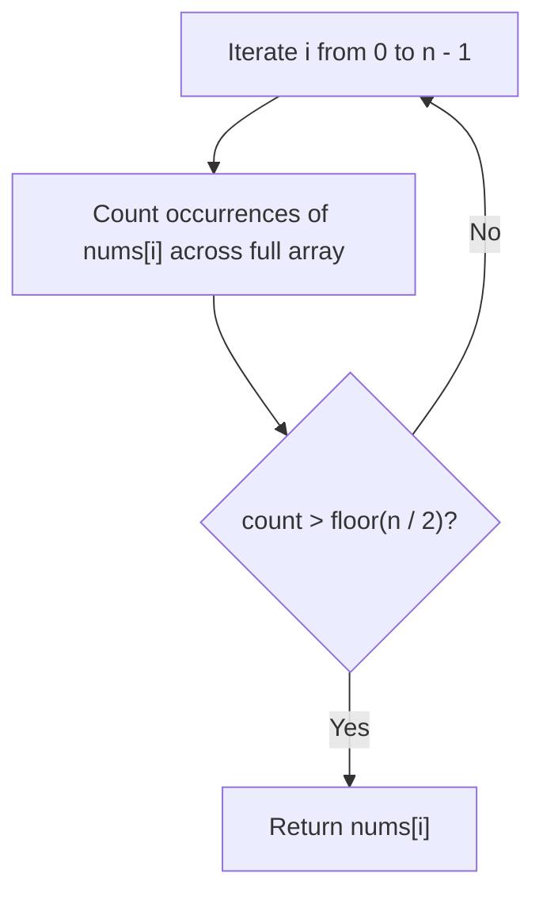
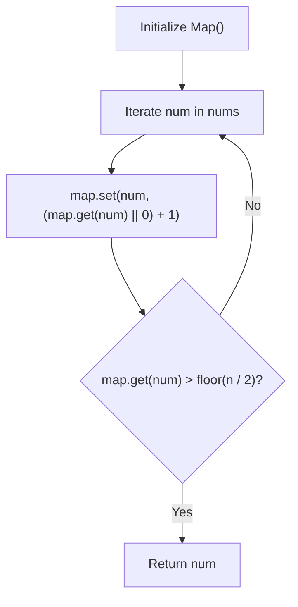
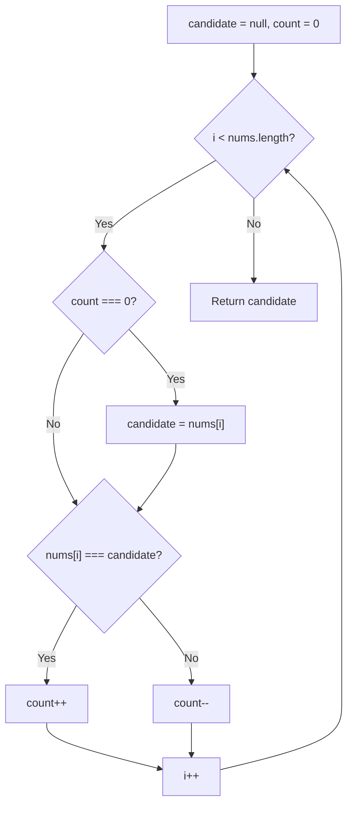
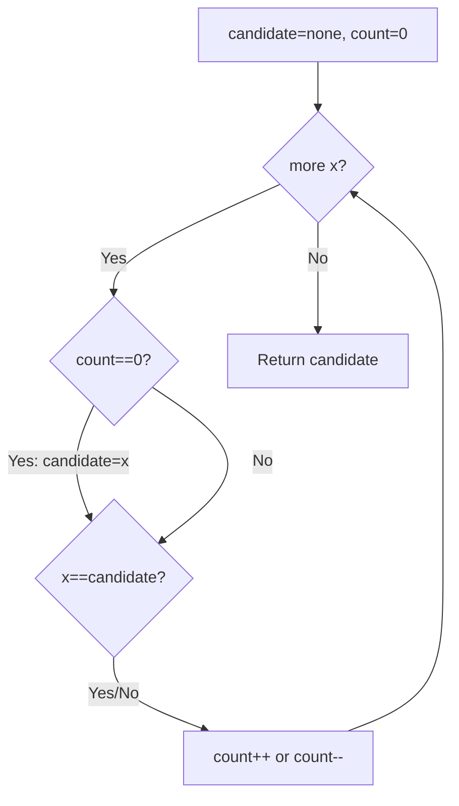

# 169. Majority Element

- **LeetCode Link**: `https://leetcode.com/problems/majority-element/`
- **Difficulty**: Easy
- **Pattern Category**: Array / Boyer-Moore Voting
- **Prerequisite Primer**: `00-foundations/01-two-pointers.md`

---

## 1. Problem Overview & Edge Case Matrix

### Problem Statement
Given an array `nums` of size `n`, return the **majority element**.
The majority element is the element that appears **more than $\lfloor n / 2 \rfloor$ times**. You may assume that the majority element always exists in the array.

```
nums = [ 2 , 2 , 1 , 1 , 1 , 2 , 2 ]
Length n = 7, Floor(n / 2) = 3
Count of 2 is 4 (> 3) -> Output: 2
```

### Upfront Edge Case Matrix

| Edge Case Scenario | Inputs | Expected Output | Pitfall / Failure Mode |
| :--- | :--- | :--- | :--- |
| Single Element Array | `nums = [1]` | `1` | Count threshold $\lfloor 1/2 \rfloor = 0$, loop termination |
| Two Elements (Identical) | `nums = [3, 3]` | `3` | Tie-breaking bugs |
| All Negative Numbers | `nums = [-5, -5, -2]` | `-5` | Object key sign coercion / default zero issues |
| Interleaved Elements | `nums = [1, 2, 1, 2, 1]` | `1` | Premature candidate reset in voting |

---

## 2. Level 1: Brute Force Approach (Nested Frequency Scan)

### Intuition & Visual Idea
For every element in the array, perform a full secondary scan to count its total occurrences. If any element has a count $> \lfloor n / 2 \rfloor$, immediately return it.



### Pseudocode
```text
FUNCTION majorityElementBruteForce(nums):
    n = nums.length
    majorityThreshold = FLOOR(n / 2)
    FOR i FROM 0 TO n - 1:
        count = 0
        FOR j FROM 0 TO n - 1:
            IF nums[j] == nums[i]:
                count++
        IF count > majorityThreshold:
            RETURN nums[i]
```

### Step-by-Step Dry Run
`nums = [3, 2, 3]`, $n = 3$, threshold = $\lfloor 3 / 2 \rfloor = 1$

| `i` | `nums[i]` | Inner Loop Count of `nums[i]` | Condition (`count > 1`) | Result |
| :--- | :--- | :--- | :--- | :--- |
| 0 | 3 | Scan `[3, 2, 3]` $\to$ Count = 2 | $2 > 1$ (True) | Return 3 |

### Modern JavaScript Implementation
```javascript
/**
 * Level 1: Brute Force (Nested Count)
 * Time Complexity:  O(N^2)
 * Space Complexity: O(1)
 */
function majorityElementBruteForce(nums) {
  const threshold = Math.floor(nums.length / 2);

  for (let i = 0; i < nums.length; i++) {
    let count = 0;
    for (let j = 0; j < nums.length; j++) {
      if (nums[j] === nums[i]) {
        count++;
      }
    }
    if (count > threshold) {
      return nums[i];
    }
  }

  return -1;
}
```

### Complexity Breakdown
- **Time Complexity**: $O(N^2)$ — Two nested loops over $N$ elements.
- **Space Complexity**: $O(1)$ — Only a single counter variable.

---

## 3. Level 2: Optimized Approach (Hash Map Frequency Counter)

### Intuition & Visual Bottleneck Elimination
Maintain a frequency `Map` to record the count of each element in a single linear pass. If any element's frequency exceeds $\lfloor n / 2 \rfloor$, return it immediately.



### Pseudocode
```text
FUNCTION majorityElementOptimized(nums):
    map = new Map()
    threshold = FLOOR(nums.length / 2)
    FOR num IN nums:
        count = (map.get(num) || 0) + 1
        map.set(num, count)
        IF count > threshold:
            RETURN num
```

### Step-by-Step Dry Run
`nums = [2, 2, 1, 1, 1, 2, 2]`, threshold = 3

| Step | `num` | `map` State | `count > 3` |
| :--- | :--- | :--- | :--- |
| 1 | 2 | `{ 2 => 1 }` | False |
| 2 | 2 | `{ 2 => 2 }` | False |
| 3 | 1 | `{ 2 => 2, 1 => 1 }` | False |
| 4 | 1 | `{ 2 => 2, 1 => 2 }` | False |
| 5 | 1 | `{ 2 => 2, 1 => 3 }` | False |
| 6 | 2 | `{ 2 => 3, 1 => 3 }` | False |
| 7 | 2 | `{ 2 => 4, 1 => 3 }` | $4 > 3$ (True) $\to$ Return 2 |

### Modern JavaScript Implementation
```javascript
/**
 * Level 2: Hash Map Single Pass
 * Time Complexity:  O(N)
 * Space Complexity: O(N)
 */
function majorityElementOptimized(nums) {
  const threshold = Math.floor(nums.length / 2);
  const freqMap = new Map();

  for (const num of nums) {
    const count = (freqMap.get(num) || 0) + 1;
    freqMap.set(num, count);
    if (count > threshold) {
      return num;
    }
  }

  return -1;
}
```

### Complexity Breakdown
- **Time Complexity**: $O(N)$ — Single pass through `nums`.
- **Space Complexity**: $O(N)$ — Map stores up to $N - \lfloor N/2 \rfloor$ distinct keys.

---

## 4. Level 3: Most Optimal / Canonical Approach (Boyer-Moore Voting Algorithm)

### Intuition & Mathematical Invariant
Because the majority element occurs **more than $N / 2$ times**, its count is greater than the sum of all other elements combined.
If we pair up different elements and cancel them out, the majority element will always be the surviving remainder.

```
Array: [ 2 , 2 , 1 , 1 , 1 , 2 , 2 ]
Pairings: (2, 1), (2, 1), (2, 1) -> Survivor: 2!
```



### Pseudocode
```text
FUNCTION majorityElement(nums):
    candidate = null
    count = 0
    FOR num IN nums:
        IF count == 0:
            candidate = num
        IF num == candidate:
            count++
        ELSE:
            count--
    RETURN candidate
```

### Step-by-Step Dry Run
`nums = [2, 2, 1, 1, 1, 2, 2]`

| Step | `num` | `count` Before | Candidate Before | Action | Candidate After | `count` After |
| :--- | :--- | :--- | :--- | :--- | :--- | :--- |
| 1 | 2 | 0 | `null` | Reset candidate to 2 | 2 | 1 |
| 2 | 2 | 1 | 2 | Match (`count++`) | 2 | 2 |
| 3 | 1 | 2 | 2 | Mismatch (`count--`)| 2 | 1 |
| 4 | 1 | 1 | 2 | Mismatch (`count--`)| 2 | 0 |
| 5 | 1 | 0 | 2 | Reset candidate to 1 | 1 | 1 |
| 6 | 2 | 1 | 1 | Mismatch (`count--`)| 1 | 0 |
| 7 | 2 | 0 | 1 | Reset candidate to 2 | 2 | 1 |

### Modern JavaScript Implementation
```javascript
/**
 * Level 3: Boyer-Moore Voting Algorithm (Optimal)
 * Time Complexity:  O(N)
 * Space Complexity: O(1) Auxiliary
 */
function majorityElement(nums) {
  let candidate = null;
  let count = 0;

  for (let i = 0; i < nums.length; i++) {
    if (count === 0) {
      candidate = nums[i];
    }
    count += nums[i] === candidate ? 1 : -1;
  }

  return candidate;
}
```

### Complexity Breakdown
- **Time Complexity**: $O(N)$ — Single linear pass.
- **Space Complexity**: $O(1)$ — Only two scalar variables `candidate` and `count`.

---

## 5. JavaScript-Specific Gotchas & V8 Optimizations
- **Branchless Increment**: Writing `count += (nums[i] === candidate ? 1 : -1)` enables efficient branch prediction in V8 pipeline.
- **Assumption Guard**: The problem guarantees a majority element exists. In a general interview setting, always verify with a second pass if existence is not guaranteed.

---

## 6. Real-World MAANG Interview Follow-Ups & Extensions

### Follow-Up 1: Elements Appearing More than $\lfloor N / 3 \rfloor$ Times (Majority Element II)
- **Scenario**: Find all elements that appear more than $\lfloor n / 3 \rfloor$ times. (At most 2 such elements can exist).
- **Solution Strategy**: Generalized Boyer-Moore with 2 candidates and 2 counters, followed by a second verification pass.
- **JS Code**:
```javascript
function majorityElementII(nums) {
  let cand1 = null, cand2 = null;
  let count1 = 0, count2 = 0;

  for (const num of nums) {
    if (cand1 !== null && num === cand1) {
      count1++;
    } else if (cand2 !== null && num === cand2) {
      count2++;
    } else if (count1 === 0) {
      cand1 = num;
      count1 = 1;
    } else if (count2 === 0) {
      cand2 = num;
      count2 = 1;
    } else {
      count1--;
      count2--;
    }
  }

  // Verification pass
  const result = [];
  const threshold = Math.floor(nums.length / 3);
  let c1 = 0, c2 = 0;
  for (const num of nums) {
    if (num === cand1) c1++;
    else if (num === cand2) c2++;
  }

  if (c1 > threshold) result.push(cand1);
  if (c2 > threshold) result.push(cand2);
  return result;
}
```

### Follow-Up 2: Distributed Map-Reduce / Streaming Telemetry at Scale
- **Scenario**: What if telemetry data is split across 100 worker nodes in chunks ($N = 10^{12}$)?
- **Solution Strategy**: Each worker runs Boyer-Moore locally and emits its `(candidate, count)`. The coordinator combines pairs: identical candidates sum counts; differing candidates subtract smaller count from larger. A second streaming map pass counts final candidate frequencies.

---

## 7. What LeetCode Discuss Says (Language-Independent)

Source: top-voted post by coderoath —
`https://leetcode.com/problems/majority-element/solutions/51613/on-time-o1-space-fastest-solution-by-cod-9pb9/`
— 1.7K votes / 305.1K views / 191 comments.
Language-independent summary. No new JS here.

### A. Naive ways (baseline context)

Count with a HashMap, or sort and
take the middle. Both cost extra.

```text
FUNCTION majorityNaive(nums):
    counts = EMPTY MAP
    FOR x IN nums:
        counts[x]++
        IF counts[x] > LENGTH(nums)/2:
            RETURN x
```

- Time: O(n)
- Space: O(n)

### B. Post's way: Boyer-Moore vote

Keep one candidate plus a count.
Same value: count++. Different:
count--. Zero count: swap in the
new value. Majority (> n/2) always
survives the cancellations.

```text
FUNCTION majorityOptimal(nums):
    candidate = NONE
    count = 0
    FOR x IN nums:
        IF count == 0:
            candidate = x
        IF x == candidate:
            count++
        ELSE:
            count--
    RETURN candidate
```

- Time: O(n)
- Space: O(1)
- Needs the > n/2 guarantee.



### C. Dry run on LeetCode Example 2

`nums = [2, 2, 1, 1, 1, 2, 2]`

| Step | x | candidate | count |
| :--- | :--- | :--- | :--- |
| 0 | - | none | 0 |
| 1 | 2 | 2 | 1 |
| 2 | 2 | 2 | 2 |
| 3 | 1 | 2 | 1 |
| 4 | 1 | 2 | 0 |
| 5 | 1 | 1 | 1 |
| 6 | 2 | 1 | 0 |
| 7 | 2 | 2 | 1 |
| 8 | - | 2 | Return 2 |

### D. Why B beats A

- No map, no sort.
- One pass, two variables.
- Cancelling pairs can never kill
  a true > n/2 majority.

### E. Pitfalls from comments

- This IS Boyer-Moore (top comment
  cites the source paper, 1.8K).
- Needs > n/2, not >= n/2: input
  like [1,1,1,1,2,3,4,5] is invalid.
- No verification pass needed here
  (unlike Majority Element II).
- count==0 swap is the whole trick.

### F. Companies

- Discuss post itself names none.
- External source:
  `https://github.com/liquidslr/leetcode-company-wise-problems`
  (LeetCode company tags, updated June 2025).
- All-time (24): Accenture, Adobe,
  Amazon, Autodesk, Bloomberg,
  Cognizant, DE Shaw, Flipkart,
  Goldman Sachs, Google, IBM,
  Infosys, Meta, Microsoft,
  Morgan Stanley, Odoo, Oracle,
  PornHub, Qualcomm, TCS,
  Walmart Labs, Yandex, Zenefits,
  Zoho.
- Recent: 30 days — Amazon,
  Google, Meta.
- Recent: 3 months — Amazon,
  Bloomberg, Google, Meta,
  Microsoft.
