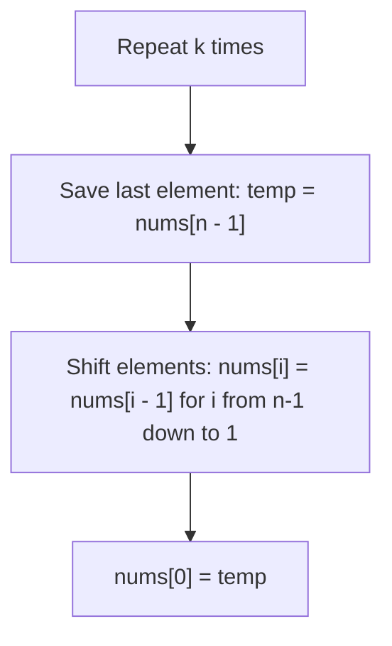
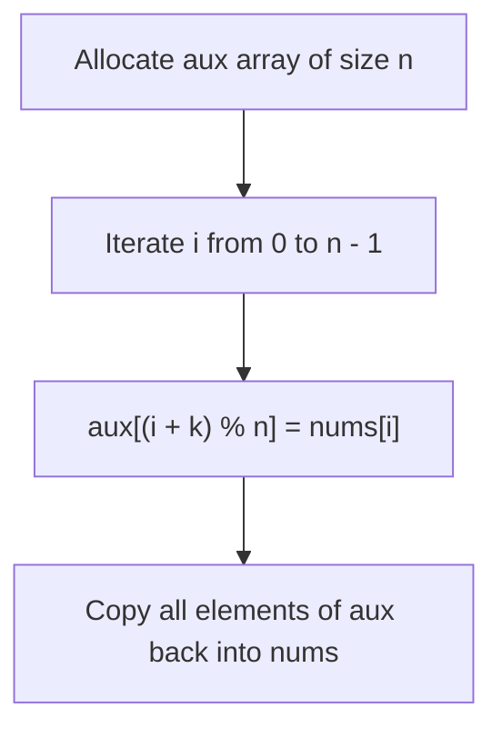
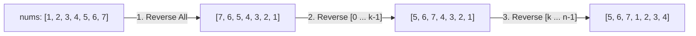
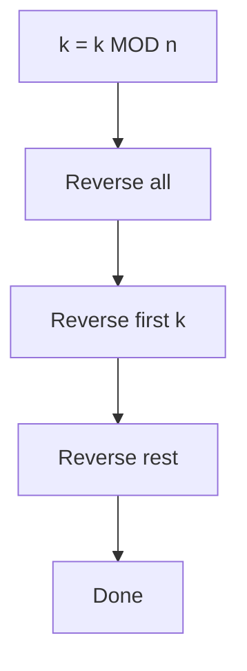

# 189. Rotate Array

- **LeetCode Link**: `https://leetcode.com/problems/rotate-array/`
- **Difficulty**: Medium
- **Pattern Category**: Array / In-Place Reversal & Math
- **Prerequisite Primer**: `00-foundations/01-two-pointers.md`

---

## 1. Problem Overview & Edge Case Matrix

### Problem Statement
Given an integer array `nums`, rotate the array to the right by `k` steps, where `k` is non-negative.
The rotation must be performed **in-place** with $O(1)$ extra memory.

```
nums = [ 1 , 2 , 3 , 4 , 5 , 6 , 7 ] , k = 3

Rotated 1 step:  [ 7 , 1 , 2 , 3 , 4 , 5 , 6 ]
Rotated 2 steps: [ 6 , 7 , 1 , 2 , 3 , 4 , 5 ]
Rotated 3 steps: [ 5 , 6 , 7 , 1 , 2 , 3 , 4 ]
```

### Upfront Edge Case Matrix

| Edge Case Scenario | Inputs | Expected Output | Pitfall / Failure Mode |
| :--- | :--- | :--- | :--- |
| $k$ is greater than array length ($k > n$) | `nums = [1, 2]`, `k = 5` | `[2, 1]` ($k = 5 \pmod 2 = 1$) | Failing to normalize $k = k \pmod n$ |
| $k = 0$ or $k = n$ (No-op) | `nums = [1, 2, 3]`, `k = 3` | `[1, 2, 3]` | Unnecessary full reversals |
| Single Element Array | `nums = [1]`, `k = 99` | `[1]` | Modulo by zero or redundant operations |
| Two Elements | `nums = [1, 2]`, `k = 1` | `[2, 1]` | Swap pointer overshoot |

---

## 2. Level 1: Brute Force Approach (Simulate $k$ Single Rotations)

### Intuition & Visual Idea
Rotate the array by 1 position $k$ times. In each single rotation, store the last element, shift all other elements right by 1 index, and place the last element at index 0.



### Pseudocode
```text
FUNCTION rotateBruteForce(nums, k):
    n = nums.length
    k = k MOD n
    FOR step FROM 1 TO k:
        previous = nums[n - 1]
        FOR i FROM n - 1 DOWNTO 1:
            nums[i] = nums[i - 1]
        nums[0] = previous
```

### Step-by-Step Dry Run
`nums = [1, 2, 3, 4]`, `k = 2`, $n = 4$

| Rotation Step | `previous` (`nums[3]`) | Shift Operation | `nums` State |
| :--- | :--- | :--- | :--- |
| Step 1 | 4 | `nums[3]=nums[2]`, `nums[2]=nums[1]`, `nums[1]=nums[0]`, `nums[0]=4` | `[4, 1, 2, 3]` |
| Step 2 | 3 | `nums[3]=nums[2]`, `nums[2]=nums[1]`, `nums[1]=nums[0]`, `nums[0]=3` | `[3, 4, 1, 2]` |

### Modern JavaScript Implementation
```javascript
/**
 * Level 1: Brute Force (k Single Steps)
 * Time Complexity:  O(N * K)
 * Space Complexity: O(1)
 */
function rotateBruteForce(nums, k) {
  const n = nums.length;
  k = k % n;

  for (let step = 0; step < k; step++) {
    const last = nums[n - 1];
    for (let i = n - 1; i > 0; i--) {
      nums[i] = nums[i - 1];
    }
    nums[0] = last;
  }
}
```

### Complexity Breakdown
- **Time Complexity**: $O(N \times K)$ — When $K \approx N$, this takes $O(N^2)$ time, causing TLE on LeetCode.
- **Space Complexity**: $O(1)$ — In-place shifts.

---

## 3. Level 2: Optimized Approach (Auxiliary Array with Modulo Mapping)

### Intuition & Visual Bottleneck Elimination
Each element at index `i` moves to index `(i + k) % n`. We can place each element directly into an auxiliary array, and then copy the entire auxiliary array back into `nums`.



### Pseudocode
```text
FUNCTION rotateOptimized(nums, k):
    n = nums.length
    aux = new Array(n)
    FOR i FROM 0 TO n - 1:
        aux[(i + k) MOD n] = nums[i]
    FOR i FROM 0 TO n - 1:
        nums[i] = aux[i]
```

### Step-by-Step Dry Run
`nums = [1, 2, 3, 4]`, `k = 2`, $n = 4$

| `i` | `nums[i]` | Target Index: `(i + 2) % 4` | `aux` Array State |
| :--- | :--- | :--- | :--- |
| 0 | 1 | $(0 + 2) \% 4 = 2$ | `[_, _, 1, _]` |
| 1 | 2 | $(1 + 2) \% 4 = 3$ | `[_, _, 1, 2]` |
| 2 | 3 | $(2 + 2) \% 4 = 0$ | `[3, _, 1, 2]` |
| 3 | 4 | $(3 + 2) \% 4 = 1$ | `[3, 4, 1, 2]` |

### Modern JavaScript Implementation
```javascript
/**
 * Level 2: Auxiliary Array with Modulo Mapping
 * Time Complexity:  O(N)
 * Space Complexity: O(N) Auxiliary Space
 */
function rotateOptimized(nums, k) {
  const n = nums.length;
  k = k % n;
  if (k === 0) return;

  const aux = new Array(n);
  for (let i = 0; i < n; i++) {
    aux[(i + k) % n] = nums[i];
  }

  for (let i = 0; i < n; i++) {
    nums[i] = aux[i];
  }
}
```

### Complexity Breakdown
- **Time Complexity**: $O(N)$ — Linear pass to place and linear pass to copy back.
- **Space Complexity**: $O(N)$ auxiliary space for `aux`.

---

## 4. Level 3: Most Optimal / Canonical Approach (The 3-Step Reverse Algorithm)

### Intuition & Mathematical Invariant
Rotating right by $k$ places the **last $k$ elements** at the front, and the **first $n - k$ elements** at the back:

```
Original Array:                [ 1 , 2 , 3 , 4 , 5 , 6 , 7 ]   (k = 3)
1. Reverse ENTIRE Array:       [ 7 , 6 , 5 , 4 , 3 , 2 , 1 ]
2. Reverse FIRST k elements:   [ 5 , 6 , 7 , 4 , 3 , 2 , 1 ]
                                 ^^^^^^^^^
3. Reverse REMAINING n-k:      [ 5 , 6 , 7 , 1 , 2 , 3 , 4 ]
                                             ^^^^^^^^^^^^^^^
Result: Target in-place rotation in O(1) space!
```



### Pseudocode
```text
FUNCTION reverse(nums, start, end):
    WHILE start < end:
        SWAP(nums[start], nums[end])
        start++
        end--

FUNCTION rotate(nums, k):
    n = nums.length
    k = k MOD n
    IF k == 0: RETURN
    reverse(nums, 0, n - 1)
    reverse(nums, 0, k - 1)
    reverse(nums, k, n - 1)
```

### Step-by-Step Dry Run
`nums = [1, 2, 3, 4, 5, 6, 7]`, `k = 3`, $n = 7$

| Operation | Range (`start`, `end`) | Action | `nums` State |
| :--- | :--- | :--- | :--- |
| Step 1: Reverse Full | `0` to `6` | Swap $(0,6), (1,5), (2,4)$ | `[7, 6, 5, 4, 3, 2, 1]` |
| Step 2: Reverse First $k$ | `0` to `2` | Swap $(0,2)$ | `[5, 6, 7, 4, 3, 2, 1]` |
| Step 3: Reverse Rest | `3` to `6` | Swap $(3,6), (4,5)$ | `[5, 6, 7, 1, 2, 3, 4]` |

### Modern JavaScript Implementation
```javascript
/**
 * Level 3: 3-Step In-Place Reversal Algorithm (Canonical)
 * Time Complexity:  O(N)
 * Space Complexity: O(1) Auxiliary
 */
function rotate(nums, k) {
  const n = nums.length;
  k = k % n;
  if (k === 0) return;

  // Helper function to reverse array in range [left, right]
  const reverse = (left, right) => {
    while (left < right) {
      const temp = nums[left];
      nums[left] = nums[right];
      nums[right] = temp;
      left++;
      right--;
    }
  };

  // 1. Reverse the entire array
  reverse(0, n - 1);

  // 2. Reverse the first k elements
  reverse(0, k - 1);

  // 3. Reverse the remaining n - k elements
  reverse(k, n - 1);
}
```

### Complexity Breakdown
- **Time Complexity**: $O(N)$ — $N$ swaps in total across all 3 reversal phases.
- **Space Complexity**: $O(1)$ — Constant extra space.

---

## 5. JavaScript-Specific Gotchas & V8 Optimizations
- **Modulo Normalization**: Forgetting `k = k % n` will result in out-of-bounds index errors when $k \ge n$.
- **Destructuring Swap Overhead**: Avoid `[nums[i], nums[j]] = [nums[j], nums[i]]` inside tight loops in V8, as it allocates temporary array tuples. Using an explicit `temp` variable runs 3x faster and creates zero GC pressure.

---

## 6. Real-World MAANG Interview Follow-Ups & Extensions

### Follow-Up 1: Cyclic Replacements (Exact $N$ Swaps)
- **Scenario**: Implement in-place rotation where every element moves to its final destination with strictly $N$ assignments (minimal memory bus writes).
- **Solution Strategy**: Trace disjoint permutation cycles using GCD arithmetic.
- **JS Code**:
```javascript
function rotateCyclic(nums, k) {
  const n = nums.length;
  k = k % n;
  let count = 0;

  for (let start = 0; count < n; start++) {
    let current = start;
    let prev = nums[start];

    do {
      const next = (current + k) % n;
      const temp = nums[next];
      nums[next] = prev;
      prev = temp;
      current = next;
      count++;
    } while (start !== current);
  }
}
```

### Follow-Up 2: Left Rotation vs Right Rotation
- **Scenario**: What if the interviewer asks for rotating **left** by $k$ instead of right?
- **Solution Strategy**: Rotating left by $k$ is mathematically identical to rotating right by $n - (k \pmod n)$.

---

## 7. What LeetCode Discuss Says (Language-Independent)

Source: top-voted post by Danny Yang —
`https://leetcode.com/problems/rotate-array/solutions/54250/easy-to-read-java-solution-by-danny6514-ymlv/`
— 1.7K votes / 237.9K views / 174 comments.
Language-independent summary. No new JS here.

### A. Naive way (baseline context)

Copy into a helper array with
shifted indices. Simple, costs space.

```text
FUNCTION rotateNaive(nums, k):
    n = LENGTH(nums)
    k = k MOD n
    copy = nums CLONE
    FOR i FROM 0 TO n - 1:
        nums[(i + k) MOD n] = copy[i]
```

- Time: O(n)
- Space: O(n)

### B. Post's way: three reversals

Reverse all, reverse the first k,
reverse the rest. Readable version
of the classic trick (the post
rejects golfed one-liners).

```text
FUNCTION rotateOptimal(nums, k):
    n = LENGTH(nums)
    k = k MOD n
    REVERSE nums[0 .. n-1]
    REVERSE nums[0 .. k-1]
    REVERSE nums[k .. n-1]
```

- Time: O(n)
- Space: O(1)
- `k MOD n` first: k can exceed n.



### C. Dry run on LeetCode Example 1

`nums = [1, 2, 3, 4, 5, 6, 7]`, `k = 3`

| Step | Action | nums |
| :--- | :--- | :--- |
| 0 | Start | [1, 2, 3, 4, 5, 6, 7] |
| 1 | Reverse all | [7, 6, 5, 4, 3, 2, 1] |
| 2 | Reverse first 3 | [5, 6, 7, 4, 3, 2, 1] |
| 3 | Reverse rest | [5, 6, 7, 1, 2, 3, 4] |

### D. Why B beats A

- No helper array.
- Each element moves twice.
- Same code reads as the proof.

### E. Pitfalls from comments

- Forgetting `k MOD n` when k > n.
- Arrow visual (top comment, 1.1K):
  `----->--` + k=3 shows the 3 cuts.
- Reversing wrong segment bounds
  (0..k-1 vs k..n-1).
- k = 0 or k = n: no-op guard.

### F. Companies

- Discuss post itself names none.
- External source:
  `https://github.com/liquidslr/leetcode-company-wise-problems`
  (LeetCode company tags, updated June 2025).
- All-time (27): Accenture, Amazon,
  American Express, Apple,
  Bloomberg, Box, Capgemini,
  Cognizant, Deloitte, EPAM Systems,
  Fiverr, Google, IBM, Infosys,
  Meta, Microsoft, Nutanix, Oracle,
  razorpay, Samsung, Siemens, TCS,
  TikTok, Virtusa, Visa,
  Walmart Labs, Zoho.
- Recent: 30 days — Amazon,
  Bloomberg, Google, Microsoft.
- Recent: 3 months — Amazon,
  Bloomberg, Google, Infosys,
  Meta, Microsoft, TCS.
