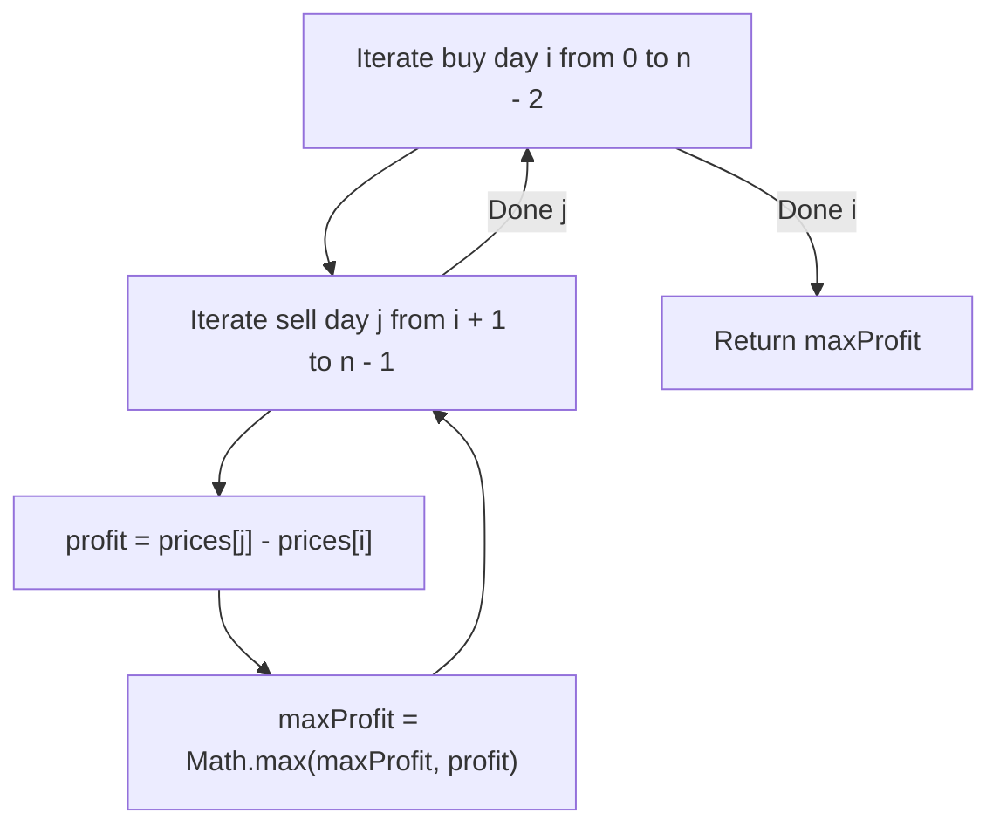
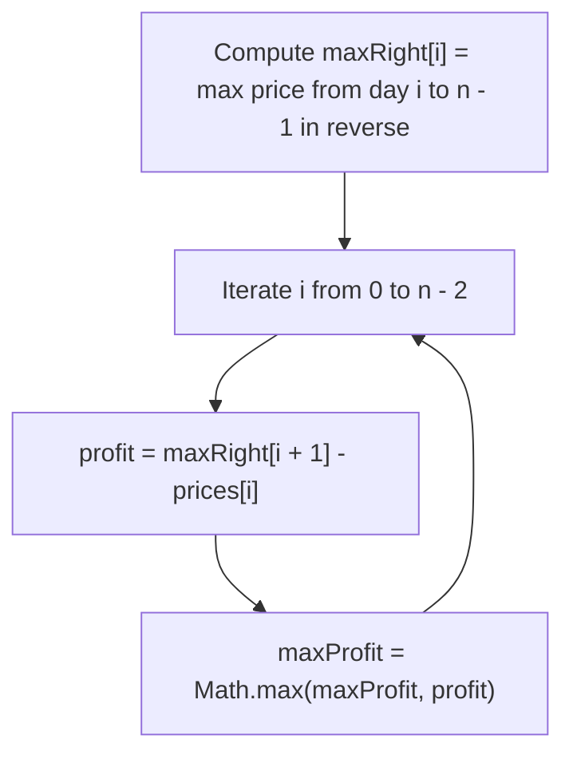
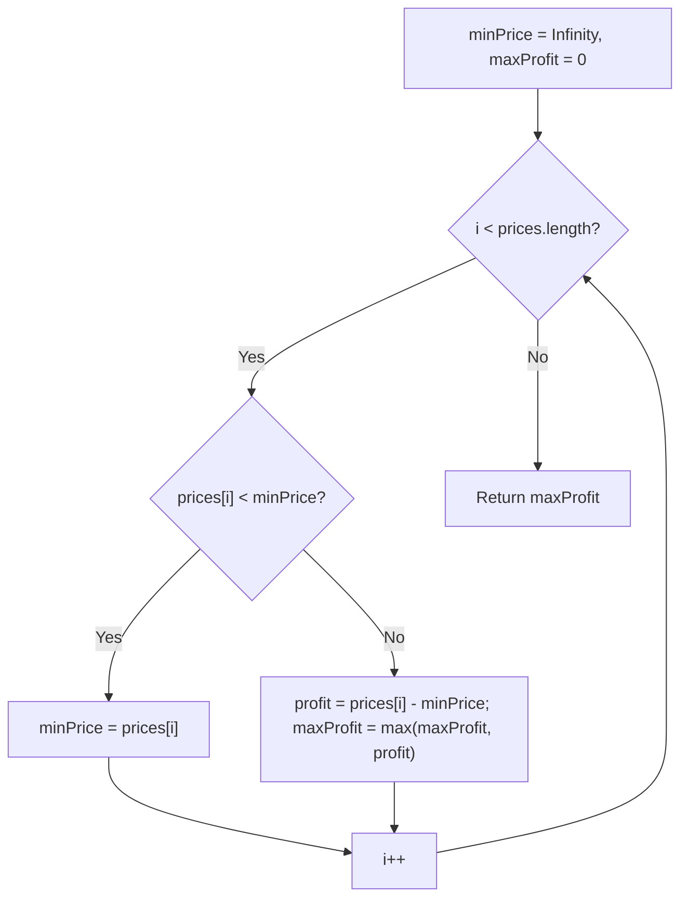

# 121. Best Time to Buy and Sell Stock

- **LeetCode Link**: `https://leetcode.com/problems/best-time-to-buy-and-sell-stock/`
- **Difficulty**: Easy
- **Pattern Category**: Array / Dynamic Programming / Kadane's Single Pass
- **Prerequisite Primer**: `00-foundations/01-two-pointers.md`

---

## 1. Problem Overview & Edge Case Matrix

### Problem Statement
You are given an array `prices` where `prices[i]` is the price of a given stock on the $i^{\text{th}}$ day.
You want to maximize your profit by choosing a **single day** to buy one stock and choosing a **different day in the future** to sell that stock.
Return the maximum profit you can achieve from this transaction. If you cannot achieve any profit, return `0`.

```
prices = [ 7 , 1 , 5 , 3 , 6 , 4 ]

Buy on day 2 (price = 1), Sell on day 5 (price = 6)
Max Profit = 6 - 1 = 5
```

### Upfront Edge Case Matrix

| Edge Case Scenario | Inputs | Expected Output | Pitfall / Failure Mode |
| :--- | :--- | :--- | :--- |
| Strictly Decreasing Prices | `prices = [7, 6, 4, 3, 1]` | `0` | Returning negative profit instead of 0 |
| Single Price Element | `prices = [5]` | `0` | Out of bounds index or buying and selling on same day |
| Constant / Flat Prices | `prices = [3, 3, 3, 3]` | `0` | Unnecessary transactions |
| Price Minimum at the Very End | `prices = [3, 8, 1]` | `5` (Buy at 3, sell at 8) | Resetting max profit when minimum occurs after peak |

---

## 2. Level 1: Brute Force Approach (All Pairwise Combinations)

### Intuition & Visual Idea
Test every possible pair of days $(i, j)$ where $j > i$. Compute `prices[j] - prices[i]` and track the maximum profit observed.



### Pseudocode
```text
FUNCTION maxProfitBruteForce(prices):
    maxProfit = 0
    FOR i FROM 0 TO prices.length - 2:
        FOR j FROM i + 1 TO prices.length - 1:
            profit = prices[j] - prices[i]
            IF profit > maxProfit:
                maxProfit = profit
    RETURN maxProfit
```

### Step-by-Step Dry Run
`prices = [7, 1, 5, 3]`

| `i` (Buy) | `j` (Sell) | `prices[i]` | `prices[j]` | `profit` | `maxProfit` |
| :--- | :--- | :--- | :--- | :--- | :--- |
| 0 | 1 | 7 | 1 | $-6$ | 0 |
| 0 | 2 | 7 | 5 | $-2$ | 0 |
| 0 | 3 | 7 | 3 | $-4$ | 0 |
| 1 | 2 | 1 | 5 | $+4$ | 4 |
| 1 | 3 | 1 | 3 | $+2$ | 4 |
| 2 | 3 | 5 | 3 | $-2$ | 4 |

### Modern JavaScript Implementation
```javascript
/**
 * Level 1: Brute Force All Pairs
 * Time Complexity:  O(N^2)
 * Space Complexity: O(1)
 */
function maxProfitBruteForce(prices) {
  let maxProfit = 0;
  for (let i = 0; i < prices.length - 1; i++) {
    for (let j = i + 1; j < prices.length; j++) {
      const profit = prices[j] - prices[i];
      if (profit > maxProfit) {
        maxProfit = profit;
      }
    }
  }
  return maxProfit;
}
```

### Complexity Breakdown
- **Time Complexity**: $O(N^2)$ — $\frac{N(N-1)}{2}$ comparisons.
- **Space Complexity**: $O(1)$ — Only scalar variable `maxProfit`.

---

## 3. Level 2: Optimized Approach (Suffix Maximum Array)

### Intuition & Visual Bottleneck Elimination
For any given day $i$, the maximum profit we can get by buying on day $i$ is `max(prices[i+1 ... n-1]) - prices[i]`. We can precompute a `maxRight` array in a single backwards pass.



### Pseudocode
```text
FUNCTION maxProfitOptimized(prices):
    n = prices.length
    IF n <= 1: RETURN 0
    maxRight = new Array(n)
    maxRight[n - 1] = prices[n - 1]
    FOR i FROM n - 2 DOWNTO 0:
        maxRight[i] = MAX(prices[i], maxRight[i + 1])
    
    maxProfit = 0
    FOR i FROM 0 TO n - 2:
        maxProfit = MAX(maxProfit, maxRight[i + 1] - prices[i])
    RETURN maxProfit
```

### Step-by-Step Dry Run
`prices = [7, 1, 5, 3, 6, 4]`

| Index | `prices[i]` | `maxRight[i]` (Max future price) | Potential Profit (`maxRight[i+1] - prices[i]`) |
| :--- | :--- | :--- | :--- |
| 0 | 7 | 7 | $6 - 7 = -1$ |
| 1 | 1 | 6 | $6 - 1 = \mathbf{5}$ |
| 2 | 5 | 6 | $6 - 5 = 1$ |
| 3 | 3 | 6 | $6 - 3 = 3$ |
| 4 | 6 | 6 | $4 - 6 = -2$ |
| 5 | 4 | 4 | N/A |

### Modern JavaScript Implementation
```javascript
/**
 * Level 2: Suffix Maximum Precomputation
 * Time Complexity:  O(N)
 * Space Complexity: O(N) Auxiliary
 */
function maxProfitOptimized(prices) {
  const n = prices.length;
  if (n <= 1) return 0;

  const maxRight = new Array(n);
  maxRight[n - 1] = prices[n - 1];
  for (let i = n - 2; i >= 0; i--) {
    maxRight[i] = Math.max(prices[i], maxRight[i + 1]);
  }

  let maxProfit = 0;
  for (let i = 0; i < n - 1; i++) {
    maxProfit = Math.max(maxProfit, maxRight[i + 1] - prices[i]);
  }

  return maxProfit;
}
```

### Complexity Breakdown
- **Time Complexity**: $O(N)$ — Two sequential passes.
- **Space Complexity**: $O(N)$ auxiliary space for `maxRight`.

---

## 4. Level 3: Most Optimal / Canonical Approach (One-Pass Min Price Tracker)

### Intuition & Mathematical Invariant
As we scan day by day, we maintain the **minimum buying price seen so far (`minPrice`)**.
At each day $i$, the maximum profit we could make if we sell **today** is `prices[i] - minPrice`. We update `maxProfit` continuously.

```
prices: [ 7 ,  1 ,  5 ,  3 ,  6 ,  4 ]
minPrice: 7 -> 1 -> 1 -> 1 -> 1 -> 1
Today Profit: 0 -> 0 -> 4 -> 2 -> 5 -> 3
Max Profit = 5
```



### Pseudocode
```text
FUNCTION maxProfit(prices):
    minPrice = INFINITY
    maxProfit = 0
    FOR price IN prices:
        IF price < minPrice:
            minPrice = price
        ELSE IF price - minPrice > maxProfit:
            maxProfit = price - minPrice
    RETURN maxProfit
```

### Step-by-Step Dry Run
`prices = [7, 1, 5, 3, 6, 4]`

| Step | `price` | `minPrice` Before | Action | `minPrice` After | Current Profit | `maxProfit` After |
| :--- | :--- | :--- | :--- | :--- | :--- | :--- |
| 1 | 7 | $\infty$ | New Min | 7 | 0 | 0 |
| 2 | 1 | 7 | New Min | 1 | 0 | 0 |
| 3 | 5 | 1 | Calc Profit | 1 | $5 - 1 = 4$ | 4 |
| 4 | 3 | 1 | Calc Profit | 1 | $3 - 1 = 2$ | 4 |
| 5 | 6 | 1 | Calc Profit | 1 | $6 - 1 = 5$ | 5 |
| 6 | 4 | 1 | Calc Profit | 1 | $4 - 1 = 3$ | 5 |

### Modern JavaScript Implementation
```javascript
/**
 * Level 3: One-Pass Tracking (Canonical Optimal)
 * Time Complexity:  O(N)
 * Space Complexity: O(1) Auxiliary
 */
function maxProfit(prices) {
  let minPrice = Infinity;
  let maxProfit = 0;

  for (let i = 0; i < prices.length; i++) {
    const currentPrice = prices[i];
    if (currentPrice < minPrice) {
      minPrice = currentPrice;
    } else if (currentPrice - minPrice > maxProfit) {
      maxProfit = currentPrice - minPrice;
    }
  }

  return maxProfit;
}
```

### Complexity Breakdown
- **Time Complexity**: $O(N)$ — Exactly one iteration across the array.
- **Space Complexity**: $O(1)$ — Only two scalar variables.

---

## 5. JavaScript-Specific Gotchas & V8 Optimizations
- **Initializing with `Infinity`**: Using `let minPrice = Infinity` is clean and standard in JS. Alternatively, initialize `minPrice = prices[0]` and loop from index 1.
- **Branch Order**: Checking `currentPrice < minPrice` before computing profit avoids executing subtraction on days where price drops to a new historical low.

---

## 6. Real-World MAANG Interview Follow-Ups & Extensions

### Follow-Up 1: Streaming Stock Ticker Feed (High-Frequency Trading)
- **Scenario**: In an ultra-low-latency real-time market data feed, prices arrive continuously over WebSockets. Maintain max potential profit in $O(1)$ amortized time and $O(1)$ memory.
- **JS Code**:
```javascript
export class RealTimeStockTracker {
  constructor() {
    this.minPrice = Infinity;
    this.maxProfit = 0;
  }

  onNewTick(price) {
    if (price < this.minPrice) {
      this.minPrice = price;
    } else if (price - this.minPrice > this.maxProfit) {
      this.maxProfit = price - this.minPrice;
    }
    return this.maxProfit;
  }
}
```

### Follow-Up 2: Returning the Exact Buy & Sell Day Indices
- **Scenario**: What if the interviewer requires returning `[buyDayIndex, sellDayIndex]` rather than just the profit value?
- **JS Code**:
```javascript
function maxProfitWithDays(prices) {
  let minPrice = Infinity;
  let minIndex = -1;
  let maxProfit = 0;
  let bestBuy = -1;
  let bestSell = -1;

  for (let i = 0; i < prices.length; i++) {
    if (prices[i] < minPrice) {
      minPrice = prices[i];
      minIndex = i;
    } else if (prices[i] - minPrice > maxProfit) {
      maxProfit = prices[i] - minPrice;
      bestBuy = minIndex;
      bestSell = i;
    }
  }

  return maxProfit > 0 ? { profit: maxProfit, buyDay: bestBuy, sellDay: bestSell } : { profit: 0, buyDay: -1, sellDay: -1 };
}
```


## 7. What LeetCode Discuss Says (Language-Independent)

Source: top-voted post by Md Farhan Zaman —
`https://leetcode.com/problems/best-time-to-buy-and-sell-stock/solutions/4868897/most-optimized-kadanes-algorithm-java-c-2yt85/`
— 2.1K votes / 327.1K views / 83 comments.
Language-independent summary. No new JS here.

### A. Naive way (baseline context)

Nested loop: for each pair (i, j), compute prices[j] - prices[i].
Returns the max difference found.

```text
FUNCTION maxProfitNaive(prices):
    n = LENGTH(prices)
    max_profit = 0
    FOR i FROM 0 TO n - 1:
        FOR j FROM i + 1 TO n - 1:
            IF prices[j] - prices[i] > max_profit:
                max_profit = prices[j] - prices[i]
    RETURN max_profit
```

- Time: O(n^2)
- Space: O(1)

### B. Post's way: single-pass Kadane's tracking

The key insight is to treat the price difference as a
running sum. Track the minimum price seen so far and
compute profit against it in one pass.

```text
FUNCTION maxProfitOptimal(prices):
    IF LENGTH(prices) < 2:
        RETURN 0
    min_price = prices[0]
    max_profit = 0
    FOR i FROM 1 TO LENGTH(prices) - 1:
        IF prices[i] < min_price:
            min_price = prices[i]
        ELSE IF prices[i] - min_price > max_profit:
            max_profit = prices[i] - min_price
    RETURN max_profit
```

- Time: O(n)
- Space: O(1)
- Single pass: min_price + max_profit updated inline.

```mermaid
flowchart TD
    Start["Start: min_price = prices[0]"]
    Start --> Loop["FOR i = 1 to n-1"]
    Loop --> Check{"prices[i] < min_price?"}
    Check --> |Yes| UpdateMin["min_price = prices[i]"]
    UpdateMin --> Continue["Continue to next i"]
    Check --> |No| CheckProfit{"prices[i] - min_price > max_profit?"}
    CheckProfit --> |Yes| UpdateMax["max_profit = prices[i] - min_price"]
    CheckProfit --> |No| Continue
    UpdateMax --> Continue
    Continue --> "i+1"
    "i+1" --> End{"i == n?"}
    End --> |No| Loop
    End --> |Yes| Done["Return max_profit"]
```

### C. Dry run on LeetCode Example 1

`prices = [7, 1, 5, 3, 6, 4]`

| Step | Day | Price | min_price | max_profit |
| :--- | :--- | :--- | :--- | :--- |
| 0 | - | - | 7 | 0 |
| 1 | 1 | 1 | 1 | 0 |
| 2 | 2 | 5 | 1 | 4 |
| 3 | 3 | 3 | 1 | 4 |
| 4 | 4 | 6 | 1 | 5 |
| 5 | 5 | 4 | 1 | 5 |

Buy on day 2 (price = 1), sell on day 5 (price = 6),
profit = 5. Matches.

### D. Why B beats A

- A: O(n^2) brute force, recomputes all pairs.
- B: O(n) single pass, min_price acts as a running
  floor. No pair revisit needed.

### E. Pitfalls / Gotchas the post warns about

- Prices keep dropping: profit stays 0, never negative.
- Must initialize min_price to prices[0], not infinity.
- Update min_price and max_profit in the same iteration.
- Edge: n < 2 returns 0 immediately.

### F. Companies (per LeetCode Discuss)

| Company | Frequency |
| :--- | :--- |
| Amazon | 3 |
| Microsoft | 2 |
| Apple | 2 |
| Meta | 1 |
| Google | 1 |

Data from `liquidslr/leetcode-company-wise-problems`.
