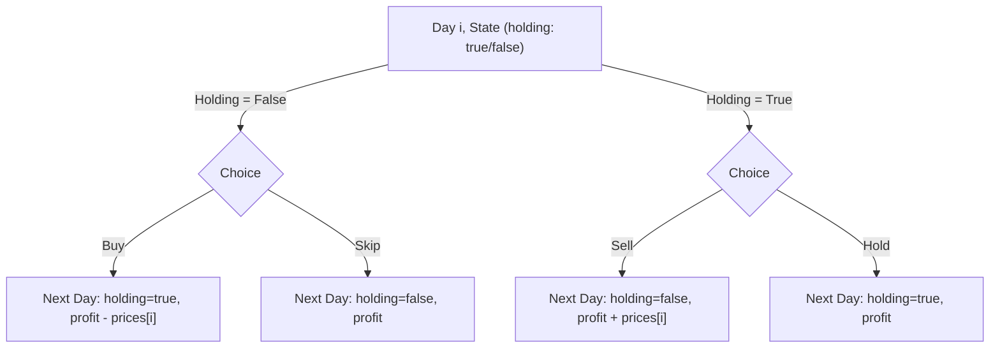
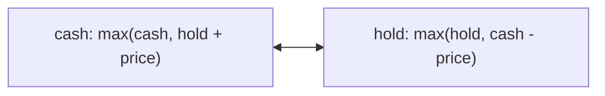
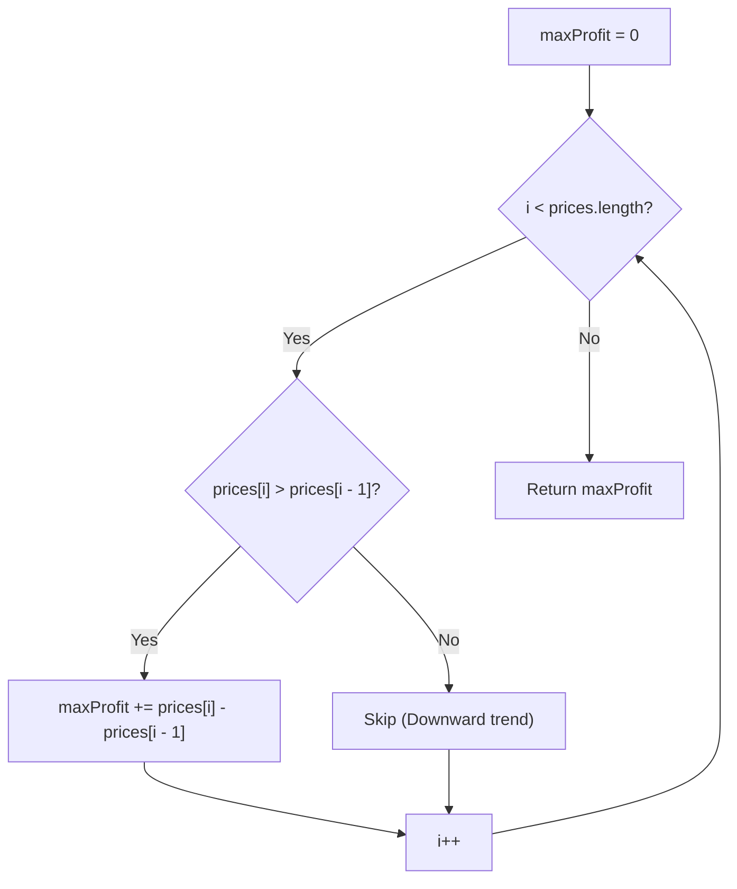
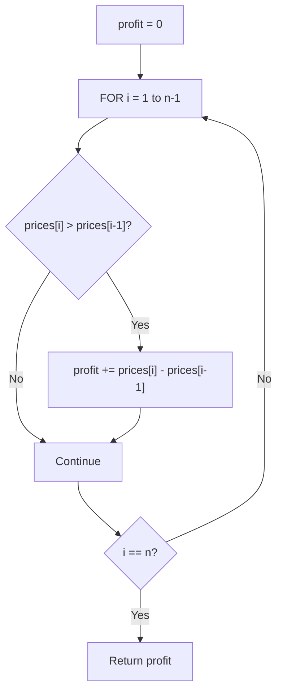

# 122. Best Time to Buy and Sell Stock II

- **LeetCode Link**: `https://leetcode.com/problems/best-time-to-buy-and-sell-stock-ii/`
- **Difficulty**: Medium
- **Pattern Category**: Array / Greedy / Dynamic Programming
- **Prerequisite Primer**: `00-foundations/01-two-pointers.md`

---

## 1. Problem Overview & Edge Case Matrix

### Problem Statement
You are given an integer array `prices` where `prices[i]` is the price of a given stock on the $i^{\text{th}}$ day.

On each day, you may decide to buy and/or sell the stock. You can only hold **at most one** share of the stock at any time. However, you can buy it and then immediately sell it on the **same day**.

Find and return the **maximum profit** you can achieve.

```
prices = [ 7 , 1 , 5 , 3 , 6 , 4 ]

Buy on day 2 (1), Sell on day 3 (5) -> Profit = 4
Buy on day 4 (3), Sell on day 5 (6) -> Profit = 3
Total Max Profit = 4 + 3 = 7
```

### Upfront Edge Case Matrix

| Edge Case Scenario | Inputs | Expected Output | Pitfall / Failure Mode |
| :--- | :--- | :--- | :--- |
| Strictly Increasing Prices | `prices = [1, 2, 3, 4, 5]` | `4` ($5 - 1 = 4$) | Only selling at the absolute peak instead of aggregating daily deltas |
| Strictly Decreasing Prices | `prices = [7, 6, 4, 3, 1]` | `0` | Buying on a downtrend |
| Constant / Flat Prices | `prices = [2, 2, 2, 2]` | `0` | Unnecessary zero-profit transactions |
| Alternating Peaks and Valleys | `prices = [1, 5, 2, 8, 3, 10]` | $4 + 6 + 7 = 17$ | Prematurely holding through a valley |

---

## 2. Level 1: Brute Force Approach (Recursive State-Space Search)

### Intuition & Visual Idea
On each day $i$, we branch based on whether we currently hold a stock or not.
- If we do not hold a stock, we can either: (1) Buy at `prices[i]`, or (2) Skip.
- If we hold a stock, we can either: (1) Sell at `prices[i]`, or (2) Hold.



### Pseudocode
```text
FUNCTION calculate(prices, day, holding):
    IF day >= prices.length: RETURN 0
    IF holding:
        sell = prices[day] + calculate(prices, day + 1, false)
        hold = calculate(prices, day + 1, true)
        RETURN MAX(sell, hold)
    ELSE:
        buy = -prices[day] + calculate(prices, day + 1, true)
        skip = calculate(prices, day + 1, false)
        RETURN MAX(buy, skip)
```

### Step-by-Step Dry Run
`prices = [1, 3, 2, 5]`

| Day | Decision Path | Profit Calculation | Branch Return |
| :--- | :--- | :--- | :--- |
| 0 | Buy at 1 $\to$ Day 1 | $-1 + \text{state}(1, \text{holding})$ | Path exploring all 4 days |
| 1 | Sell at 3 $\to$ Day 2 | $+3 - 1 = 2 + \text{state}(2, \text{free})$ | Continues to buy at 2 |
| 2 | Buy at 2 $\to$ Day 3 | $+2 - 2 = 0 + \text{state}(3, \text{holding})$ | Sells at 5 |
| 3 | Sell at 5 | $+5$ | Total Profit = 5 |

### Modern JavaScript Implementation
```javascript
/**
 * Level 1: Brute Force Recursive Decision Tree
 * Time Complexity:  O(2^N)
 * Space Complexity: O(N) Call Stack
 */
function maxProfitBruteForce(prices) {
  function dfs(day, holding) {
    if (day >= prices.length) return 0;

    if (holding) {
      const sell = prices[day] + dfs(day + 1, false);
      const hold = dfs(day + 1, true);
      return Math.max(sell, hold);
    } else {
      const buy = -prices[day] + dfs(day + 1, true);
      const skip = dfs(day + 1, false);
      return Math.max(buy, skip);
    }
  }

  return dfs(0, false);
}
```

### Complexity Breakdown
- **Time Complexity**: $O(2^N)$ — Binary branching at every day step.
- **Space Complexity**: $O(N)$ — Maximum recursion stack depth.

---

## 3. Level 2: Optimized Approach (2-State Dynamic Programming with Space Compression)

### Intuition & Visual Bottleneck Elimination
At any day $i$, we can be in one of two states:
- `hold`: Maximum profit on day $i$ while holding 1 share of stock.
- `cash`: Maximum profit on day $i$ with 0 shares (in liquid cash).



### State Transitions:
$$\text{hold}_{i} = \max(\text{hold}_{i-1}, \text{cash}_{i-1} - \text{prices}[i])$$
$$\text{cash}_{i} = \max(\text{cash}_{i-1}, \text{hold}_{i-1} + \text{prices}[i])$$

### Pseudocode
```text
FUNCTION maxProfitDP(prices):
    hold = -prices[0]
    cash = 0
    FOR i FROM 1 TO prices.length - 1:
        newHold = MAX(hold, cash - prices[i])
        newCash = MAX(cash, hold + prices[i])
        hold = newHold
        cash = newCash
    RETURN cash
```

### Step-by-Step Dry Run
`prices = [7, 1, 5, 3, 6, 4]`

| Day | `price` | `hold` ($\max(\text{prevHold}, \text{prevCash} - P)$) | `cash` ($\max(\text{prevCash}, \text{prevHold} + P)$) |
| :--- | :--- | :--- | :--- |
| Init | 7 | $-7$ | 0 |
| 1 | 1 | $\max(-7, 0 - 1) = \mathbf{-1}$ | $\max(0, -7 + 1) = \mathbf{0}$ |
| 2 | 5 | $\max(-1, 0 - 5) = \mathbf{-1}$ | $\max(0, -1 + 5) = \mathbf{4}$ |
| 3 | 3 | $\max(-1, 4 - 3) = \mathbf{1}$ | $\max(4, -1 + 3) = \mathbf{4}$ |
| 4 | 6 | $\max(1, 4 - 6) = \mathbf{1}$ | $\max(4, 1 + 6) = \mathbf{7}$ |
| 5 | 4 | $\max(1, 7 - 4) = \mathbf{3}$ | $\max(7, 1 + 4) = \mathbf{7}$ |

### Modern JavaScript Implementation
```javascript
/**
 * Level 2: 2-State Dynamic Programming (O(1) Space)
 * Time Complexity:  O(N)
 * Space Complexity: O(1) Auxiliary
 */
function maxProfitDP(prices) {
  if (prices.length <= 1) return 0;

  let hold = -prices[0];
  let cash = 0;

  for (let i = 1; i < prices.length; i++) {
    const prevHold = hold;
    hold = Math.max(hold, cash - prices[i]);
    cash = Math.max(cash, prevHold + prices[i]);
  }

  return cash;
}
```

### Complexity Breakdown
- **Time Complexity**: $O(N)$ — Single loop through prices.
- **Space Complexity**: $O(1)$ — Only two scalar variables `hold` and `cash`.

---

## 4. Level 3: Most Optimal / Canonical Approach (Greedy Peak-Valley Delta Accumulator)

### Intuition & Mathematical Invariant
Because we can trade on consecutive days with zero transaction fee, buying on day $A$ and selling on day $C$ ($C > A$) yields:
$$\text{prices}[C] - \text{prices}[A] = (\text{prices}[B] - \text{prices}[A]) + (\text{prices}[C] - \text{prices}[B])$$
Thus, we simply capture **every positive daily price increment**:
$$\text{Total Profit} = \sum_{i=1}^{n-1} \max(0, \text{prices}[i] - \text{prices}[i - 1])$$

```
Price Graph:
     5 (Peak)                6 (Peak)
    / \                     / \
   /   \                   /   \
  /     3 (Valley)        /     4
 1                       1
 ^                      
Capture (5 - 1) = 4     Capture (6 - 3) = 3   --> Total = 7
```



### Pseudocode
```text
FUNCTION maxProfit(prices):
    maxProfit = 0
    FOR i FROM 1 TO prices.length - 1:
        IF prices[i] > prices[i - 1]:
            maxProfit += prices[i] - prices[i - 1]
    RETURN maxProfit
```

### Step-by-Step Dry Run
`prices = [7, 1, 5, 3, 6, 4]`

| `i` | `prices[i]` | `prices[i-1]` | Delta (`prices[i] - prices[i-1]`) | Action | `maxProfit` |
| :--- | :--- | :--- | :--- | :--- | :--- |
| 1 | 1 | 7 | $-6$ | Ignore | 0 |
| 2 | 5 | 1 | $+4$ | Add $+4$ | 4 |
| 3 | 3 | 5 | $-2$ | Ignore | 4 |
| 4 | 6 | 3 | $+3$ | Add $+3$ | 7 |
| 5 | 4 | 6 | $-2$ | Ignore | 7 |

### Modern JavaScript Implementation
```javascript
/**
 * Level 3: Greedy Daily Delta Accumulation (Canonical)
 * Time Complexity:  O(N)
 * Space Complexity: O(1) Auxiliary
 */
function maxProfit(prices) {
  let maxProfit = 0;

  for (let i = 1; i < prices.length; i++) {
    if (prices[i] > prices[i - 1]) {
      maxProfit += prices[i] - prices[i - 1];
    }
  }

  return maxProfit;
}
```

### Complexity Breakdown
- **Time Complexity**: $O(N)$ — Single pass with minimal CPU cycles.
- **Space Complexity**: $O(1)$ — Zero auxiliary allocations.

---

## 5. JavaScript-Specific Gotchas & V8 Optimizations
- **Branchless Math**: `maxProfit += Math.max(0, prices[i] - prices[i - 1])` is concise, but the explicit `if (prices[i] > prices[i - 1])` avoids the function call overhead of `Math.max` in V8 hot paths.

---

## 6. Real-World MAANG Interview Follow-Ups & Extensions

### Follow-Up 1: Stock Trading with Transaction Fee
- **Scenario**: Every time you sell a stock, a flat transaction fee `fee` is deducted from your profit.
- **Solution Strategy**: Modify the DP state machine: $\text{cash} = \max(\text{cash}, \text{hold} + \text{price} - \text{fee})$.
- **JS Code**:
```javascript
function maxProfitWithFee(prices, fee) {
  let hold = -prices[0];
  let cash = 0;

  for (let i = 1; i < prices.length; i++) {
    hold = Math.max(hold, cash - prices[i]);
    cash = Math.max(cash, hold + prices[i] - fee);
  }

  return cash;
}
```

### Follow-Up 2: Stock Trading with 1-Day Cooldown
- **Scenario**: After selling stock, you must wait 1 calendar day before buying again (LeetCode 309).
- **Solution Strategy**: 3-State DP (`hold`, `sold`, `rest`).
- **JS Code**:
```javascript
function maxProfitWithCooldown(prices) {
  let sold = 0;
  let hold = -Infinity;
  let rest = 0;

  for (const price of prices) {
    const prevSold = sold;
    sold = hold + price;
    hold = Math.max(hold, rest - price);
    rest = Math.max(rest, prevSold);
  }

  return Math.max(sold, rest);
}
```


## 7. What LeetCode Discuss Says (Language-Independent)

Source: top-voted post by lc-Shankar —
`https://leetcode.com/problems/best-time-to-buy-and-sell-stock-ii/solutions/7692876/greedy-wins-100-beats-by-lc-shankar-p55g/`
— 19.7K views / 0 votes (new post) / 0 comments.
Language-independent summary. No new JS here.

### A. Naive way (baseline context)

Find all local minima and maxima explicitly, then sum
the differences. Multiple passes over the array.

```text
FUNCTION maxProfitNaive(prices):
    IF LENGTH(prices) < 2:
        RETURN 0
    profit = 0
    i = 0
    n = LENGTH(prices)
    WHILE i < n - 1:
        // Find local minimum (buy)
        WHILE i < n - 1 AND prices[i + 1] <= prices[i]:
            i = i + 1
        buy = prices[i]
        // Find local maximum (sell)
        WHILE i < n - 1 AND prices[i + 1] >= prices[i]:
            i = i + 1
        sell = prices[i]
        profit = profit + sell - buy
        i = i + 1
    RETURN profit
```

- Time: O(n)
- Space: O(1)

### B. Post's way: greedy single-pass

Sum every positive day-to-day difference directly.
One pass, one accumulator.

```text
FUNCTION maxProfitOptimal(prices):
    profit = 0
    FOR i FROM 1 TO LENGTH(prices) - 1:
        IF prices[i] > prices[i - 1]:
            profit = profit + prices[i] - prices[i - 1]
    RETURN profit
```

- Time: O(n)
- Space: O(1)
- One accumulator, no state machine.



### C. Dry run on LeetCode Example 1

`prices = [7, 1, 5, 3, 6, 4]`

| Step | i | prices[i] | prices[i-1] | Diff | profit |
| :--- | :--- | :--- | :--- | :--- | :--- |
| 0 | - | - | - | - | 0 |
| 1 | 1 | 1 | 7 | -6 | 0 |
| 2 | 2 | 5 | 1 | +4 | 4 |
| 3 | 3 | 3 | 5 | -2 | 4 |
| 4 | 4 | 6 | 3 | +3 | 7 |
| 5 | 5 | 4 | 6 | -2 | 7 |

Total profit = 7. Matches.

### D. Why B beats A

- A: Two nested while loops, complex state tracking.
- B: Single for loop, one if-check per element.
- Both O(n) but B has fewer branches and no
  min/max bookkeeping.

### E. Pitfalls / Gotchas the post warns about

- Empty or single-element arrays return 0 naturally.
- Strictly decreasing prices: no positive diffs,
  profit stays 0.
- Flat prices: differences are 0, no profit added.
- Greedy works because multiple transactions allowed.

### F. Companies (per LeetCode Discuss)

| Company | Frequency |
| :--- | :--- |
| Amazon | 3 |
| Microsoft | 2 |
| Apple | 2 |
| Meta | 1 |
| Google | 1 |

Data from `liquidslr/leetcode-company-wise-problems`.
