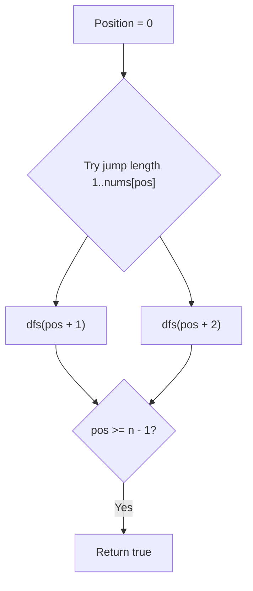
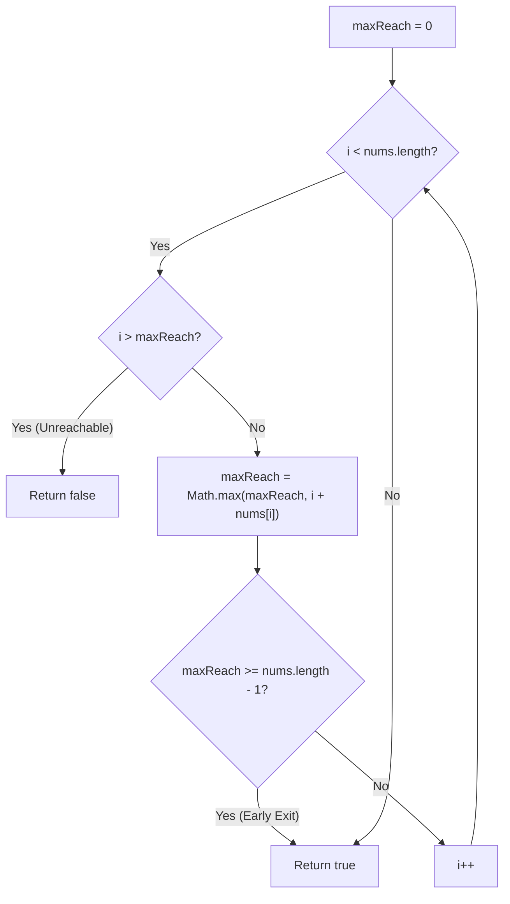

# 55. Jump Game

- **LeetCode Link**: `https://leetcode.com/problems/jump-game/`
- **Difficulty**: Medium
- **Pattern Category**: Array / Greedy / Dynamic Programming
- **Prerequisite Primer**: `00-foundations/01-two-pointers.md`

---

## 1. Problem Overview & Edge Case Matrix

### Problem Statement
You are given an integer array `nums`. You are initially positioned at the array's **first index**, and each element in the array represents your **maximum jump length** at that position.

Return `true` if you can reach the last index, or `false` otherwise.

```
nums = [ 2 , 3 , 1 , 1 , 4 ]
Index:   0   1   2   3   4

From index 0 (jump 1) -> index 1.
From index 1 (jump 3) -> index 4 (Last index reached!) -> Output: true
```

### Upfront Edge Case Matrix

| Edge Case Scenario | Inputs | Expected Output | Pitfall / Failure Mode |
| :--- | :--- | :--- | :--- |
| Single Element Array | `nums = [0]` | `true` | Already at destination index 0 |
| Trapped by Zero at Start | `nums = [0, 2, 3]` | `false` | Infinite loop or out of bounds reach |
| Multiple Consecutive Zeros | `nums = [3, 2, 1, 0, 4]` | `false` | All jumps land on trapped zero index 3 |
| Huge Jump Values ($10^5$) | `nums = [100000, 0, 0]` | `true` | Integer overflow in reach calculation |

---

## 2. Level 1: Brute Force Approach (Recursive Backtracking)

### Intuition & Visual Idea
Starting at index 0, explore every jump length from 1 up to `nums[position]`. If any path reaches `nums.length - 1`, return `true`.



### Pseudocode
```text
FUNCTION canJumpFromPosition(position, nums):
    IF position == nums.length - 1: RETURN true
    furthestJump = MIN(position + nums[position], nums.length - 1)
    FOR nextPos FROM position + 1 TO furthestJump:
        IF canJumpFromPosition(nextPos, nums):
            RETURN true
    RETURN false
```

### Step-by-Step Dry Run
`nums = [2, 3, 1, 1, 4]`

| Position | Allowed Jumps | Next Positions Checked | Status |
| :--- | :--- | :--- | :--- |
| 0 | 2 | Try pos 1, pos 2 | Recurse into pos 1 |
| 1 | 3 | Try pos 2, 3, 4 | Recurse into pos 4 |
| 4 | - | $4 \ge 4$ (Target) | Return `true` |

### Modern JavaScript Implementation
```javascript
/**
 * Level 1: Brute Force Recursive Exploration
 * Time Complexity:  O(2^N)
 * Space Complexity: O(N) Call Stack
 */
function canJumpBruteForce(nums) {
  function canJumpFrom(pos) {
    if (pos >= nums.length - 1) return true;

    const furthest = Math.min(pos + nums[pos], nums.length - 1);
    for (let next = pos + 1; next <= furthest; next++) {
      if (canJumpFrom(next)) {
        return true;
      }
    }
    return false;
  }

  return canJumpFrom(0);
}
```

### Complexity Breakdown
- **Time Complexity**: $O(2^N)$ — Exponential recursion tree with redundant subproblems.
- **Space Complexity**: $O(N)$ — Recursion call stack.

---

## 3. Level 2: Optimized Approach (Bottom-Up Dynamic Programming Tabulation)

### Intuition & Visual Bottleneck Elimination
Define `dp[i]` as boolean: can we reach the last index from index `i`?
Base case: `dp[n - 1] = true`.
Working backwards from $n - 2$ down to 0, `dp[i] = true` if there is any `j` within jump range such that `dp[j] === true`.

```mermaid
flowchart RL
    Target["dp[4] = TRUE"] <-- "jump 1" --- Pos3["dp[3] = TRUE"]
    Pos3 <-- "jump 1" --- Pos2["dp[2] = TRUE"]
    Pos2 <-- "jump 3" --- Pos1["dp[1] = TRUE"]
    Pos1 <-- "jump 2" --- Pos0["dp[0] = TRUE"]
```

### Pseudocode
```text
FUNCTION canJumpDP(nums):
    n = nums.length
    dp = new Array(n).fill(false)
    dp[n - 1] = true
    FOR i FROM n - 2 DOWNTO 0:
        furthest = MIN(i + nums[i], n - 1)
        FOR j FROM i + 1 TO furthest:
            IF dp[j] == true:
                dp[i] = true
                BREAK
    RETURN dp[0]
```

### Step-by-Step Dry Run
`nums = [2, 3, 1, 1, 4]`, $n = 5$

| Index `i` | `nums[i]` | Max Reach `i + nums[i]` | Checking `dp[j]` in range | `dp[i]` Result |
| :--- | :--- | :--- | :--- | :--- |
| 4 | 4 | 4 | Base Case | `dp[4] = true` |
| 3 | 1 | 4 | `dp[4] === true` | `dp[3] = true` |
| 2 | 1 | 3 | `dp[3] === true` | `dp[2] = true` |
| 1 | 3 | 4 | `dp[2,3,4]` has true | `dp[1] = true` |
| 0 | 2 | 2 | `dp[1,2]` has true | `dp[0] = true` |

### Modern JavaScript Implementation
```javascript
/**
 * Level 2: Bottom-Up Dynamic Programming (Uint8Array for max performance)
 * Time Complexity:  O(N^2)
 * Space Complexity: O(N)
 */
function canJumpDP(nums) {
  const n = nums.length;
  const dp = new Uint8Array(n);
  dp[n - 1] = 1; // 1 represents true

  for (let i = n - 2; i >= 0; i--) {
    const furthest = Math.min(i + nums[i], n - 1);
    for (let j = i + 1; j <= furthest; j++) {
      if (dp[j] === 1) {
        dp[i] = 1;
        break;
      }
    }
  }

  return dp[0] === 1;
}
```

### Complexity Breakdown
- **Time Complexity**: $O(N^2)$ — In worst case, inner loop scans up to $N$ entries for each $i$.
- **Space Complexity**: $O(N)$ — Size of DP table.

---

## 4. Level 3: Most Optimal / Canonical Approach (Greedy Maximum Reach Tracker)

### Intuition & Mathematical Invariant
As we scan from left to right, we maintain `maxReach` (the furthest index we can possibly reach so far).
- At index `i`, if `i > maxReach`, we have hit an unreachable wall (e.g. trapped by zeros) $\to$ return `false`.
- Otherwise, we update `maxReach = max(maxReach, i + nums[i])`.
- If `maxReach >= n - 1`, we can reach the end $\to$ return `true` immediately!

```
nums: [ 2 , 3 , 1 , 1 , 4 ]
i=0: nums[0]=2 -> maxReach = max(0, 0+2) = 2
i=1: nums[1]=3 -> maxReach = max(2, 1+3) = 4 >= 4 (Target reached!)
```



### Pseudocode
```text
FUNCTION canJump(nums):
    maxReach = 0
    FOR i FROM 0 TO nums.length - 1:
        IF i > maxReach:
            RETURN false
        maxReach = MAX(maxReach, i + nums[i])
        IF maxReach >= nums.length - 1:
            RETURN true
    RETURN true
```

### Step-by-Step Dry Run
`nums = [3, 2, 1, 0, 4]`

| `i` | `nums[i]` | `i > maxReach` | `i + nums[i]` | `maxReach` After | Status |
| :--- | :--- | :--- | :--- | :--- | :--- |
| 0 | 3 | $0 > 0$ False | $0 + 3 = 3$ | 3 | Continue |
| 1 | 2 | $1 > 3$ False | $1 + 2 = 3$ | 3 | Continue |
| 2 | 1 | $2 > 3$ False | $2 + 1 = 3$ | 3 | Continue |
| 3 | 0 | $3 > 3$ False | $3 + 0 = 3$ | 3 | Continue |
| 4 | 4 | $4 > 3$ **True** | - | - | **Trapped! Return false** |

### Modern JavaScript Implementation
```javascript
/**
 * Level 3: Greedy Maximum Reach (Canonical Optimal)
 * Time Complexity:  O(N)
 * Space Complexity: O(1) Auxiliary
 */
function canJump(nums) {
  let maxReach = 0;
  const target = nums.length - 1;

  for (let i = 0; i < nums.length; i++) {
    if (i > maxReach) {
      return false; // Cannot reach this index
    }
    maxReach = Math.max(maxReach, i + nums[i]);
    if (maxReach >= target) {
      return true; // Early exit optimization
    }
  }

  return true;
}
```

### Complexity Breakdown
- **Time Complexity**: $O(N)$ — Single forward pass, potentially exiting much earlier.
- **Space Complexity**: $O(1)$ — Zero auxiliary allocations.

---

## 5. JavaScript-Specific Gotchas & V8 Optimizations
- **Early Exit**: `if (maxReach >= target) return true` cuts execution time on large test inputs from $O(N)$ to $O(1)$ when initial jumps are large.

---

## 6. Real-World MAANG Interview Follow-Ups & Extensions

### Follow-Up 1: Minimum Jumps to Reach the End (Jump Game II)
- **Scenario**: If reaching the end is guaranteed, what is the minimum number of jumps required?
- **Solution Strategy**: Implicit BFS tracking current jump window `[curStart, curEnd]`.
- **JS Code**:
```javascript
function jumpMinCount(nums) {
  let jumps = 0;
  let curEnd = 0;
  let curFarthest = 0;

  for (let i = 0; i < nums.length - 1; i++) {
    curFarthest = Math.max(curFarthest, i + nums[i]);
    if (i === curEnd) {
      jumps++;
      curEnd = curFarthest;
      if (curEnd >= nums.length - 1) break;
    }
  }

  return jumps;
}
```

### Follow-Up 2: Jump Game with Battery / Energy Drain
- **Scenario**: Each jump of length $D$ consumes $D^2$ energy units. Given starting energy $E$, determine if you can reach index $n - 1$.
- **Solution Strategy**: Dijkstra's algorithm on an implicit DAG using `PriorityQueue`.
