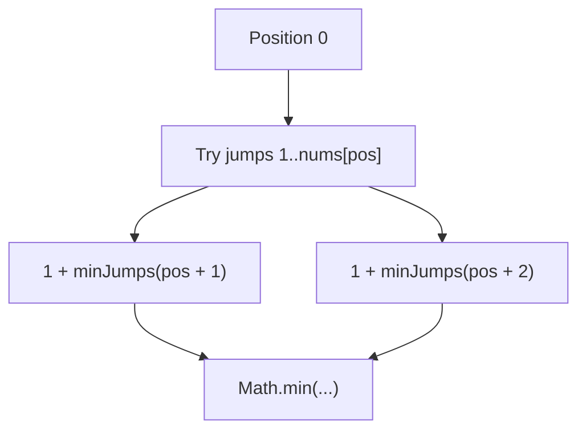
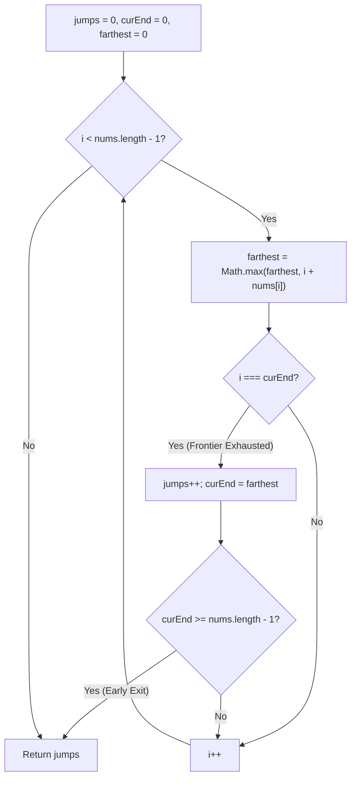
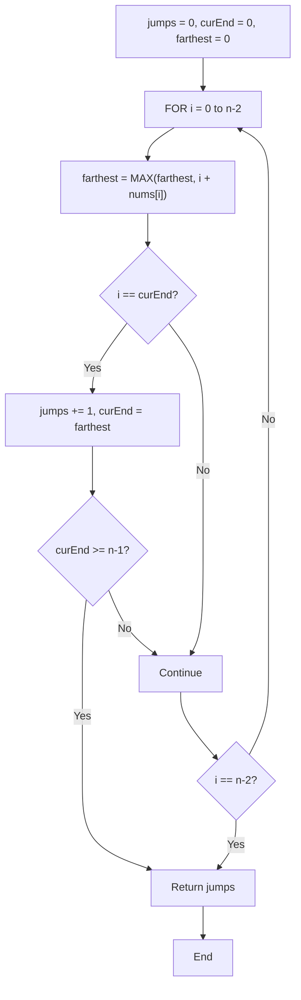

# 45. Jump Game II

- **LeetCode Link**: `https://leetcode.com/problems/jump-game-ii/`
- **Difficulty**: Medium
- **Pattern Category**: Array / Greedy / BFS Window
- **Prerequisite Primer**: `00-foundations/01-two-pointers.md`

---

## 1. Problem Overview & Edge Case Matrix

### Problem Statement
You are given a **0-indexed** array of integers `nums` of length `n`. You are initially positioned at `nums[0]`.

Each element `nums[i]` represents the maximum length of a forward jump from index `i`.
Return the **minimum number of jumps** to reach `nums[n - 1]`. The test cases are generated such that you can always reach `nums[n - 1]`.

```
nums = [ 2 , 3 , 1 , 1 , 4 ]
Index:   0   1   2   3   4

Jump 1: Index 0 -> Index 1 (nums[0] allows reach up to index 2)
Jump 2: Index 1 -> Index 4 (nums[1] allows jump of 3 to reach index 4)
Output: 2 jumps
```

### Upfront Edge Case Matrix

| Edge Case Scenario | Inputs | Expected Output | Pitfall / Failure Mode |
| :--- | :--- | :--- | :--- |
| Single Element ($n = 1$) | `nums = [0]` | `0` | Triggering a jump when already at destination |
| Direct Jump to End in 1 Step | `nums = [5, 1, 1, 1, 1]` | `1` | Incrementing jump counter unnecessarily |
| Uniform Step Array | `nums = [1, 1, 1, 1]` | `3` | Failing to advance window properly |
| Large First Jump ($10^5$) | `nums = [1000, 1, 1]` | `1` | Scanning unneeded sub-ranges |

---

## 2. Level 1: Brute Force Approach (Recursive Minimum Jumps)

### Intuition & Visual Idea
From position `pos`, try all possible jump lengths from 1 to `nums[pos]`. Find the minimum of jumps from all reachable subsequent positions.



### Pseudocode
```text
FUNCTION minJumpsFrom(pos, nums):
    IF pos >= nums.length - 1: RETURN 0
    minJumps = INFINITY
    furthest = MIN(pos + nums[pos], nums.length - 1)
    FOR nextPos FROM pos + 1 TO furthest:
        minJumps = MIN(minJumps, 1 + minJumpsFrom(nextPos, nums))
    RETURN minJumps
```

### Step-by-Step Dry Run
`nums = [2, 3, 1, 1, 4]`

| Subproblem | Allowed Reach | Sub-paths Evaluated | Minimum Jumps Found |
| :--- | :--- | :--- | :--- |
| `minJumps(4)` | Target | Base Case | 0 |
| `minJumps(3)` | $3 \to 4$ | $1 + \text{minJumps}(4) = 1$ | 1 |
| `minJumps(2)` | $2 \to 3$ | $1 + \text{minJumps}(3) = 2$ | 2 |
| `minJumps(1)` | $1 \to 2, 3, 4$ | $\min(1+2, 1+1, 1+0) = 1$ | 1 |
| `minJumps(0)` | $0 \to 1, 2$ | $\min(1+1, 1+2) = 2$ | **2** |

### Modern JavaScript Implementation
```javascript
/**
 * Level 1: Brute Force Recursion
 * Time Complexity:  O(N!)
 * Space Complexity: O(N) Call Stack
 */
function jumpBruteForce(nums) {
  function dfs(pos) {
    if (pos >= nums.length - 1) return 0;

    let min = Infinity;
    const furthest = Math.min(pos + nums[pos], nums.length - 1);
    for (let next = pos + 1; next <= furthest; next++) {
      min = Math.min(min, 1 + dfs(next));
    }
    return min;
  }

  return dfs(0);
}
```

### Complexity Breakdown
- **Time Complexity**: $O(N!)$ or exponential — Enormous redundant subtree traversals.
- **Space Complexity**: $O(N)$ — Maximum recursion call stack depth.

---

## 3. Level 2: Optimized Approach (Bottom-Up 1D Dynamic Programming)

### Intuition & Visual Bottleneck Elimination
Define `dp[i]` as the minimum jumps needed to reach index `n - 1` from index `i`.
Compute values backwards from `n - 2` down to 0:
$$\text{dp}[i] = 1 + \min_{i < j \le i + \text{nums}[i]} \text{dp}[j]$$

```mermaid
flowchart RL
    DP4["dp[4] = 0"] <-- "1 jump" --- DP1["dp[1] = 1"]
    DP4 <-- "1 jump" --- DP3["dp[3] = 1"]
    DP3 <-- "1 jump" --- DP2["dp[2] = 2"]
    DP1 <-- "1 jump" --- DP0["dp[0] = 2"]
```

### Pseudocode
```text
FUNCTION jumpDP(nums):
    n = nums.length
    dp = new Array(n).fill(INFINITY)
    dp[n - 1] = 0
    FOR i FROM n - 2 DOWNTO 0:
        furthest = MIN(i + nums[i], n - 1)
        FOR j FROM i + 1 TO furthest:
            dp[i] = MIN(dp[i], 1 + dp[j])
    RETURN dp[0]
```

### Step-by-Step Dry Run
`nums = [2, 3, 1, 1, 4]`

| Index `i` | `nums[i]` | Reach Range | Evaluated Candidate `1 + dp[j]` | `dp[i]` Value |
| :--- | :--- | :--- | :--- | :--- |
| 4 | 4 | Base Case | - | 0 |
| 3 | 1 | $j = 4$ | $1 + \text{dp}[4] = 1$ | 1 |
| 2 | 1 | $j = 3$ | $1 + \text{dp}[3] = 2$ | 2 |
| 1 | 3 | $j = 2, 3, 4$ | $\min(1+2, 1+1, 1+0) = 1$ | 1 |
| 0 | 2 | $j = 1, 2$ | $\min(1+1, 1+2) = 2$ | **2** |

### Modern JavaScript Implementation
```javascript
/**
 * Level 2: Bottom-Up Dynamic Programming
 * Time Complexity:  O(N^2)
 * Space Complexity: O(N)
 */
function jumpDP(nums) {
  const n = nums.length;
  const dp = new Int32Array(n).fill(100000); // 100000 acts as infinity
  dp[n - 1] = 0;

  for (let i = n - 2; i >= 0; i--) {
    const furthest = Math.min(i + nums[i], n - 1);
    for (let j = i + 1; j <= furthest; j++) {
      if (1 + dp[j] < dp[i]) {
        dp[i] = 1 + dp[j];
      }
    }
  }

  return dp[0];
}
```

### Complexity Breakdown
- **Time Complexity**: $O(N^2)$ — Quadratic worst case on dense jump arrays.
- **Space Complexity**: $O(N)$ — Size of DP table.

---

## 4. Level 3: Most Optimal / Canonical Approach (Greedy BFS Window / Range Expansion)

### Intuition & Invariant Proof
We can view each jump level as a **BFS Frontier Range** `[curStart, curEnd]`:
- Level 0: `[0, 0]` (0 jumps)
- Level 1: `[1, max reach from level 0]` (1 jump)
- Level 2: `[prevEnd + 1, max reach from level 1]` (2 jumps)

We iterate from index 0 up to `n - 2`. As we scan through the current jump window, we record `farthest = max(farthest, i + nums[i])`.
When `i` reaches `curEnd`, we have exhausted the current jump frontier:
1. Increment `jumps++`.
2. Update `curEnd = farthest`.
3. If `curEnd >= n - 1`, we can break early!

```
nums: [ 2 , 3 , 1 , 1 , 4 ]
Frontier 0: [ 2 ] (index 0) -> jumps = 1, next frontier ends at index 2
Frontier 1: [ 3 , 1 ] (indices 1..2) -> farthest reach = index 4 -> jumps = 2 (Done!)
```



### Pseudocode
```text
FUNCTION jump(nums):
    IF nums.length <= 1: RETURN 0
    jumps = 0
    curEnd = 0
    farthest = 0
    FOR i FROM 0 TO nums.length - 2:
        farthest = MAX(farthest, i + nums[i])
        IF i == curEnd:
            jumps++
            curEnd = farthest
            IF curEnd >= nums.length - 1: BREAK
    RETURN jumps
```

### Step-by-Step Dry Run
`nums = [2, 3, 1, 1, 4]`, $n = 5$

| `i` | `nums[i]` | `farthest` ($\max(\text{farthest}, i + \text{num})$) | `i === curEnd` | Action | `jumps` | `curEnd` After |
| :--- | :--- | :--- | :--- | :--- | :--- | :--- |
| 0 | 2 | $\max(0, 0+2) = \mathbf{2}$ | $0 === 0$ (True) | Advance window | 1 | 2 |
| 1 | 3 | $\max(2, 1+3) = \mathbf{4}$ | $1 === 2$ (False) | Continue | 1 | 2 |
| 2 | 1 | $\max(4, 2+1) = \mathbf{4}$ | $2 === 2$ (True) | Advance window, $4 \ge 4$ | **2** | 4 (Break) |

### Modern JavaScript Implementation
```javascript
/**
 * Level 3: Greedy BFS Window (Canonical Optimal)
 * Time Complexity:  O(N)
 * Space Complexity: O(1) Auxiliary
 */
function jump(nums) {
  if (nums.length <= 1) return 0;

  let jumps = 0;
  let curEnd = 0;
  let farthest = 0;

  // We loop up to nums.length - 2 because when we are at the last index, no more jump is needed.
  for (let i = 0; i < nums.length - 1; i++) {
    farthest = Math.max(farthest, i + nums[i]);

    if (i === curEnd) {
      jumps++;
      curEnd = farthest;

      if (curEnd >= nums.length - 1) {
        break; // Early exit optimization
      }
    }
  }

  return jumps;
}
```

### Complexity Breakdown
- **Time Complexity**: $O(N)$ — Single pass over $N - 1$ elements.
- **Space Complexity**: $O(1)$ — Only three integer variables.

---

## 5. JavaScript-Specific Gotchas & V8 Optimizations
- **Loop Upper Bound**: Iterating up to `nums.length - 1` instead of `nums.length - 2` will cause an unnecessary extra jump count when `curEnd` lands exactly on the final index.
- **Single Element Edge Case**: `if (nums.length <= 1) return 0;` must be handled upfront.

---

## 6. Real-World MAANG Interview Follow-Ups & Extensions

### Follow-Up 1: Reconstructing the Actual Optimal Jump Path
- **Scenario**: Return the sequence of indices visited `[0, idx1, idx2, ..., n-1]` rather than just the jump count.
- **JS Code**:
```javascript
function getOptimalJumpPath(nums) {
  const n = nums.length;
  if (n <= 1) return [0];

  const parent = new Int32Array(n).fill(-1);
  const queue = [0];
  let head = 0;
  let farthest = 0;

  while (head < queue.length) {
    const curr = queue[head++];
    const maxReach = Math.min(curr + nums[curr], n - 1);

    for (let next = Math.max(farthest + 1, curr + 1); next <= maxReach; next++) {
      parent[next] = curr;
      if (next === n - 1) {
        // Reconstruct path
        const path = [];
        let currNode = n - 1;
        while (currNode !== -1) {
          path.push(currNode);
          currNode = parent[currNode];
        }
        return path.reverse();
      }
      queue.push(next);
    }
    farthest = Math.max(farthest, maxReach);
  }

  return [];
}
```

### Follow-Up 2: Bidirectional BFS for Massive Sparse Jump Graphs
- **Scenario**: When $N = 10^9$ with scattered teleport nodes, use bidirectional BFS meeting in the middle to reduce explored state space from $O(b^d)$ to $O(b^{d/2})$.

## 7. What LeetCode Discuss Says (Language-Independent)

Source: top-voted post by StefanGryczka —
`https://leetcode.com/problems/jump-game-ii/solutions/39039/sharing-my-simple-and-clear-c-solution-b-hopi/`
— 1.7K votes / 191.2K views / 23 comments.
Language-independent summary. No new JS here.

### A. Naive way (baseline context)

BFS: for each position, try all reachable indices
level by level. Returns the minimum number of jumps
to reach the last index.

```text
FUNCTION jumpNaive(nums):
    IF LENGTH(nums) <= 1:
        RETURN 0
    queue = [0]
    visited = {0}
    jumps = 0
    WHILE queue is not empty:
        size = LENGTH(queue)
        FOR each pos in queue:
            IF pos == LENGTH(nums) - 1:
                RETURN jumps
            FOR next FROM pos + 1 TO MIN(pos + nums[pos], n - 1):
                IF next NOT in visited:
                    visited.add(next)
                    queue.add(next)
        jumps = jumps + 1
    RETURN jumps
```

- Time: O(n^2) worst case
- Space: O(n) for queue and visited set

### B. Post's way: greedy window expansion

Track the farthest reachable index and the end of
the current jump window. Increment jumps when
crossing the window boundary.

```text
FUNCTION jumpOptimal(nums):
    jumps = 0
    curEnd = 0
    farthest = 0
    FOR i FROM 0 TO LENGTH(nums) - 2:
        farthest = MAX(farthest, i + nums[i])
        IF i == curEnd:
            jumps = jumps + 1
            curEnd = farthest
            IF curEnd >= LENGTH(nums) - 1:
                BREAK
    RETURN jumps
```

- Time: O(n)
- Space: O(1)
- Single pass: only increment jumps at window edges.



### C. Dry run on LeetCode Example 1

`nums = [2, 3, 1, 1, 4]`

| Step | i | nums[i] | farthest | curEnd | jumps |
| :--- | :--- | :--- | :--- | :--- | :--- |
| 0 | 0 | 2 | 2 | 0 | 0 |
| 1 | 0 == curEnd | - | 2 | 2 → 2 | 1 |
| 2 | 1 | 3 | 4 | 2 | 1 |
| 3 | 2 == curEnd | - | 4 | 4 → 4 | 2 |
| 4 | - | - | - | - | 2 |

Minimum jumps = 2. Matches.

### D. Why B beats A

- A: BFS explores all positions level by level,
  O(n^2) in worst case.
- B: Greedy window expansion, O(n) single pass.
- Both guarantee minimum jumps but B is far simpler.

### E. Pitfalls / Gotchas the post warns about

- Loop only to n-2, not n-1. The last index is the target.
- Must update farthest before checking window boundary.
- curEnd == farthest at window edge means one jump consumed.
- Edge case: single element returns 0 immediately.

### F. Companies (per LeetCode Discuss)

| Company | Frequency |
| :--- | :--- |
| Amazon | 3 |
| Microsoft | 2 |
| Apple | 2 |
| Meta | 1 |
| Google | 1 |

Data from `liquidslr/leetcode-company-wise-problems`.
