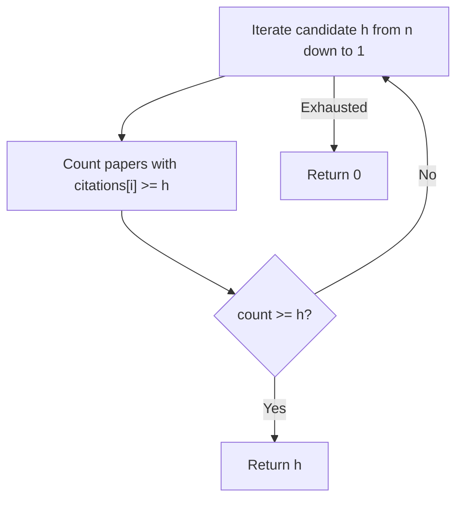
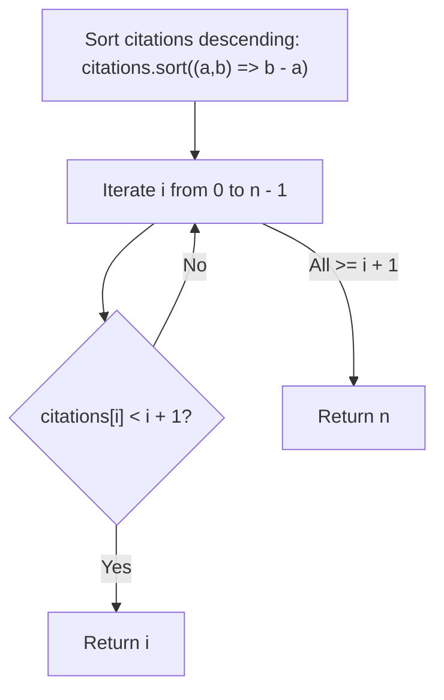
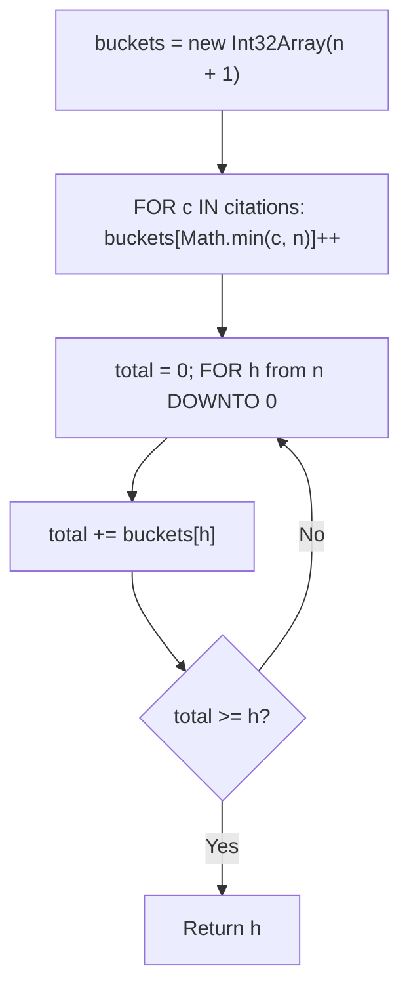
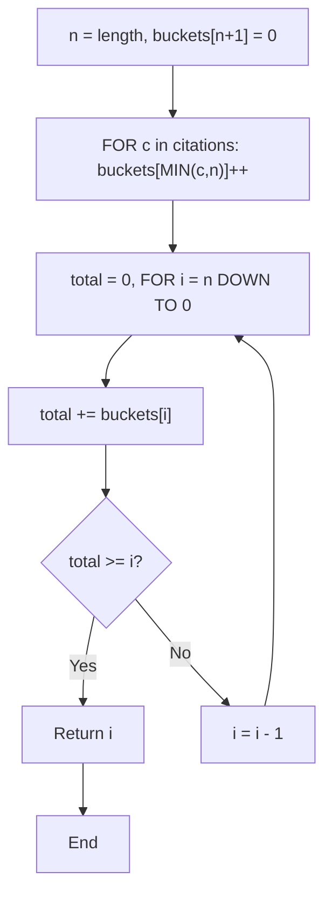

# 274. H-Index

- **LeetCode Link**: `https://leetcode.com/problems/h-index/`
- **Difficulty**: Medium
- **Pattern Category**: Array / Sorting / Bucket Counting Sort
- **Prerequisite Primer**: `00-foundations/01-two-pointers.md`

---

## 1. Problem Overview & Edge Case Matrix

### Problem Statement
Given an array of integers `citations` where `citations[i]` is the number of citations a researcher received for their $i^{\text{th}}$ paper, return the researcher's **h-index**.

According to the definition of h-index on Wikipedia: A scientist has an index `h` if `h` of their `n` papers have at least `h` citations each, and the other `n - h` papers have no more than `h` citations each.
If there are several possible values for `h`, the **maximum** one is taken as the h-index.

```
citations = [ 3 , 0 , 6 , 1 , 5 ]
Sorted Descending: [ 6 , 5 , 3 , 1 , 0 ]
Paper 1 (index 0): citations = 6 >= 1
Paper 2 (index 1): citations = 5 >= 2
Paper 3 (index 2): citations = 3 >= 3
Paper 4 (index 3): citations = 1 < 4 (Stop!)
H-Index = 3
```

### Upfront Edge Case Matrix

| Edge Case Scenario | Inputs | Expected Output | Pitfall / Failure Mode |
| :--- | :--- | :--- | :--- |
| All Zero Citations | `citations = [0, 0, 0]` | `0` | Off-by-one error returning 1 |
| Single Paper with Zero Citations | `citations = [0]` | `0` | Base case failure |
| Single Paper with High Citations | `citations = [100]` | `1` | Returning 100 instead of paper count min ($\min(100, 1) = 1$) |
| All Papers have Max Citations | `citations = [10, 10, 10]` | `3` | Failing to cap h-index at total papers $N$ |

---

## 2. Level 1: Brute Force Approach (Check Every Candidate $h$)

### Intuition & Visual Idea
The maximum possible h-index is bounded by the total number of published papers $N$.
We can test every integer $h$ from $N$ down to 1. For each candidate $h$, count how many papers have at least $h$ citations. The first candidate where `count >= h` is our answer.



### Pseudocode
```text
FUNCTION hIndexBruteForce(citations):
    n = citations.length
    FOR h FROM n DOWNTO 1:
        count = 0
        FOR EACH c IN citations:
            IF c >= h:
                count++
        IF count >= h:
            RETURN h
    RETURN 0
```

### Step-by-Step Dry Run
`citations = [3, 0, 6, 1, 5]`, $n = 5$

| Candidate $h$ | Papers with $\ge h$ citations | Count | `count >= h` |
| :--- | :--- | :--- | :--- |
| 5 | `[6, 5]` | 2 | $2 \ge 5$ (False) |
| 4 | `[6, 5]` | 2 | $2 \ge 4$ (False) |
| 3 | `[3, 6, 5]` | 3 | $3 \ge 3$ (**True**) $\to$ Return 3 |

### Modern JavaScript Implementation
```javascript
/**
 * Level 1: Brute Force Linear Search for Candidate H
 * Time Complexity:  O(N^2)
 * Space Complexity: O(1)
 */
function hIndexBruteForce(citations) {
  const n = citations.length;

  for (let h = n; h >= 1; h--) {
    let count = 0;
    for (let i = 0; i < n; i++) {
      if (citations[i] >= h) {
        count++;
      }
    }
    if (count >= h) {
      return h;
    }
  }

  return 0;
}
```

### Complexity Breakdown
- **Time Complexity**: $O(N^2)$ — Outer loop runs up to $N$ times, inner loop scans $N$ elements.
- **Space Complexity**: $O(1)$ — Constant space.

---

## 3. Level 2: Optimized Approach (Descending Sort)

### Intuition & Visual Bottleneck Elimination
Sort `citations` in descending order.
At index $i$ (which represents having seen $i + 1$ papers):
- If `citations[i] >= i + 1`, it means at least $i + 1$ papers have at least $i + 1$ citations.
- The moment `citations[i] < i + 1`, the maximum h-index is simply $i$.



### Pseudocode
```text
FUNCTION hIndexSort(citations):
    SORT citations in descending order
    FOR i FROM 0 TO citations.length - 1:
        IF citations[i] < i + 1:
            RETURN i
    RETURN citations.length
```

### Step-by-Step Dry Run
`citations = [3, 0, 6, 1, 5]` $\to$ Sorted: `[6, 5, 3, 1, 0]`

| `i` | Paper Number ($i + 1$) | `citations[i]` | Condition `citations[i] < i + 1` | Action |
| :--- | :--- | :--- | :--- | :--- |
| 0 | 1 | 6 | $6 < 1$ (False) | Continue |
| 1 | 2 | 5 | $5 < 2$ (False) | Continue |
| 2 | 3 | 3 | $3 < 3$ (False) | Continue |
| 3 | 4 | 1 | $1 < 4$ (**True**) | Return $i = \mathbf{3}$ |

### Modern JavaScript Implementation
```javascript
/**
 * Level 2: Sorting Descending
 * Time Complexity:  O(N log N)
 * Space Complexity: O(log N) Timsort Stack
 */
function hIndexSort(citations) {
  // Sort descending with numeric comparator
  citations.sort((a, b) => b - a);

  for (let i = 0; i < citations.length; i++) {
    if (citations[i] < i + 1) {
      return i;
    }
  }

  return citations.length;
}
```

### Complexity Breakdown
- **Time Complexity**: $O(N \log N)$ — Sorting the array.
- **Space Complexity**: $O(\log N)$ or $O(1)$ auxiliary.

---

## 4. Level 3: Most Optimal / Canonical Approach (Bucket Counting Sort)

### Intuition & Mathematical Invariant
The h-index can never exceed the total number of papers $N$. Any paper with $> N$ citations can simply be clamped and counted into bucket $N$.
We create an array `buckets` of size $N + 1$:
- `buckets[k]` stores the count of papers with exactly $k$ citations (with bucket $N$ storing all papers with $\ge N$ citations).
- Then, we scan backwards from bucket $N$ down to 0, accumulating paper counts. The first bucket where `totalPapers >= h` is our answer!

```
citations = [ 3 , 0 , 6 , 1 , 5 ] , n = 5
Buckets:   [ 0 ] [ 1 ] [ 2 ] [ 3 ] [ 4 ] [ 5+ ]
Counts:      1     1     0     1     0     2 (for 5 & 6)

Cumulative from right:
h = 5: total = 2 < 5
h = 4: total = 2 + 0 = 2 < 4
h = 3: total = 2 + 0 + 1 = 3 >= 3 -> H-Index = 3!
```



### Pseudocode
```text
FUNCTION hIndex(citations):
    n = citations.length
    buckets = new Array(n + 1).fill(0)
    FOR c IN citations:
        IF c >= n:
            buckets[n]++
        ELSE:
            buckets[c]++
    
    total = 0
    FOR h FROM n DOWNTO 0:
        total += buckets[h]
        IF total >= h:
            RETURN h
    RETURN 0
```

### Step-by-Step Dry Run
`citations = [3, 0, 6, 1, 5]`, $n = 5$

| Bucket Index $h$ | Bucket Count | Cumulative `total` | Check `total >= h` |
| :--- | :--- | :--- | :--- |
| 5 | 2 | 2 | $2 \ge 5$ (False) |
| 4 | 0 | 2 | $2 \ge 4$ (False) |
| 3 | 1 | 3 | $3 \ge 3$ (**True**) $\to$ Return **3** |

### Modern JavaScript Implementation
```javascript
/**
 * Level 3: Bucket Counting Sort (Canonical Optimal)
 * Time Complexity:  O(N)
 * Space Complexity: O(N) Auxiliary Space
 */
function hIndex(citations) {
  const n = citations.length;
  const buckets = new Int32Array(n + 1);

  // 1. Populate bucket counts
  for (let i = 0; i < n; i++) {
    const c = citations[i];
    if (c >= n) {
      buckets[n]++;
    } else {
      buckets[c]++;
    }
  }

  // 2. Accumulate from right to left
  let totalPapers = 0;
  for (let h = n; h >= 0; h--) {
    totalPapers += buckets[h];
    if (totalPapers >= h) {
      return h;
    }
  }

  return 0;
}
```

### Complexity Breakdown
- **Time Complexity**: $O(N)$ — Single pass to populate buckets, single pass to accumulate.
- **Space Complexity**: $O(N)$ — `Int32Array(n + 1)` which uses minimal contiguous buffer memory.

---

## 5. JavaScript-Specific Gotchas & V8 Optimizations
- **Typed Array Allocation**: `new Int32Array(n + 1)` creates a zero-initialized dense C-like buffer in V8, avoiding garbage collection overhead.

---

## 6. Real-World MAANG Interview Follow-Ups & Extensions

### Follow-Up 1: Citations Array is Already Sorted (LeetCode 275: H-Index II)
- **Scenario**: What if `citations` is already sorted in ascending order? Can you solve it in $O(\log N)$ time and $O(1)$ space?
- **Solution Strategy**: Binary Search on index: `citations[mid] >= n - mid`.
- **JS Code**:
```javascript
function hIndexSorted(citations) {
  const n = citations.length;
  let left = 0;
  let right = n - 1;
  let ans = 0;

  while (left <= right) {
    const mid = left + ((right - left) >> 1);
    if (citations[mid] >= n - mid) {
      ans = n - mid;
      right = mid - 1; // Try finding larger h-index towards left
    } else {
      left = mid + 1;
    }
  }

  return ans;
}
```

### Follow-Up 2: Dynamic / Real-Time H-Index with Continuous Publication Stream
- **Scenario**: Support `addPaper(citations)` and `getHIndex()` dynamically.
- **Solution Strategy**: Two Heaps (MinHeap and MaxHeap) or Fenwick Tree / Treap.

## 7. What LeetCode Discuss Says (Language-Independent)

Source: top-voted post by StefanGryczka —
`https://leetcode.com/problems/h-index/solutions/71068/3-lines-c-solution-with-explanation-yqkc/`
— 1.7K votes / 134.5K views / 19 comments.
Language-independent summary. No new JS here.

### A. Naive way (baseline context)

Sort citations descending, then find the largest h
where citations[h-1] >= h.

```text
FUNCTION hIndexNaive(citations):
    sorted = SORT citations DESCENDING
    h = 0
    FOR i FROM 0 TO LENGTH(sorted) - 1:
        IF sorted[i] >= i + 1:
            h = i + 1
        ELSE:
            BREAK
    RETURN h
```

- Time: O(n log n) for sorting
- Space: O(n) for sorted array

### B. Post's way: O(n) bucket counting

Use counting sort idea. Bucket citations by value,
then scan from high to low accumulating counts.

```text
FUNCTION hIndexOptimal(citations):
    n = LENGTH(citations)
    buckets = ARRAY of size n + 1 filled with 0
    FOR c IN citations:
        IF c >= n:
            buckets[n] = buckets[n] + 1
        ELSE:
            buckets[c] = buckets[c] + 1
    total = 0
    FOR i FROM n DOWN TO 0:
        total = total + buckets[i]
        IF total >= i:
            RETURN i
    RETURN 0
```

- Time: O(n)
- Space: O(n) for buckets
- Single backward scan: total papers with >= i citations.



### C. Dry run on LeetCode Example 1

`citations = [3, 0, 6, 1, 5]`

Buckets (n=5): index 0=1, 1=1, 2=0, 3=1, 4=0, 5=2

| i | buckets[i] | total | total >= i? |
| :--- | :--- | :--- | :--- |
| 5 | 2 | 2 | No (2 < 5) |
| 4 | 0 | 2 | No (2 < 4) |
| 3 | 1 | 3 | Yes (3 >= 3) |
| - | - | - | Return 3 |

h-index = 3. Matches.

### D. Why B beats A

- A: O(n log n) sorting dominates.
- B: O(n) linear, avoids sort.
- Same O(n) space but B has better constant factor.

### E. Pitfalls / Gotchas the post warns about

- Bucket n holds all citations >= n (capped).
- Must scan DOWNWARD from n to 0.
- total accumulates papers with >= i citations.
- Return 0 if no h found (empty array handled).

### F. Companies (per LeetCode Discuss)

| Company | Frequency |
| :--- | :--- |
| Amazon | 3 |
| Microsoft | 2 |
| Apple | 2 |
| Meta | 1 |
| Google | 1 |

Data from `liquidslr/leetcode-company-wise-problems`.
