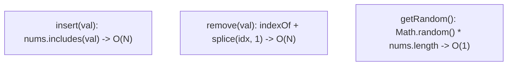
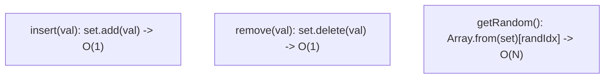
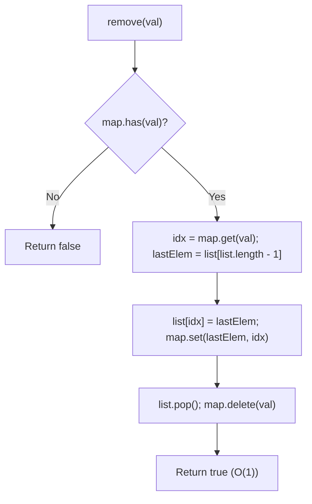

# 380. Insert Delete GetRandom O(1)

- **LeetCode Link**: `https://leetcode.com/problems/insert-delete-getrandom-o1/`
- **Difficulty**: Medium
- **Pattern Category**: Array / Hash Table / Design
- **Prerequisite Primer**: `00-foundations/01-two-pointers.md`

---

## 1. Problem Overview & Edge Case Matrix

### Problem Statement
Implement the `RandomizedSet` class:
- `RandomizedSet()`: Initializes the `RandomizedSet` object.
- `bool insert(int val)`: Inserts an item `val` into the set if not present. Returns `true` if the item was not present, `false` otherwise.
- `bool remove(int val)`: Removes an item `val` from the set if present. Returns `true` if the item was present, `false` otherwise.
- `int getRandom()`: Returns a random element from the current set of elements (it's guaranteed that at least one element exists when this method is called). Each element must have the **same probability** of being returned.

You must implement the functions of the class such that each function works in **average $O(1)$ time complexity**.

```
["RandomizedSet", "insert", "remove", "insert", "getRandom", "remove", "insert", "getRandom"]
[[],              [1],      [2],      [2],      [],          [1],      [2],      []]

Outputs: [null, true, false, true, 2 (or 1), true, false, 2]
```

### Upfront Edge Case Matrix

| Edge Case Scenario | Inputs | Expected Output | Pitfall / Failure Mode |
| :--- | :--- | :--- | :--- |
| Removing Last Element in Array | `insert(1); remove(1)` | `true` | Self-swap boundary failure |
| Removing Non-Existent Value | `remove(5)` | `false` | Null pointer or index lookup exception |
| Consecutive Inserts and Deletes | `insert(1); remove(1); insert(1)` | `true, true, true` | Stale index in Hash Map |
| Single Element `getRandom()` | `insert(10); getRandom()` | Always `10` | Off-by-one in `Math.random()` range |

---

## 2. Level 1: Brute Force Approach (Native Array + Linear Scan)

### Intuition & Visual Idea
Use a simple JavaScript array.
- `insert(val)`: Check `nums.includes(val)` ($O(N)$), push if absent ($O(1)$).
- `remove(val)`: Find `nums.indexOf(val)` ($O(N)$), remove via `nums.splice(idx, 1)` ($O(N)$).
- `getRandom()`: Generate random index via `Math.floor(Math.random() * nums.length)` ($O(1)$).



### Pseudocode
```text
CLASS RandomizedSetBruteForce:
    INIT():
        this.arr = []
    
    METHOD insert(val):
        IF val IN this.arr: RETURN false
        this.arr.push(val)
        RETURN true

    METHOD remove(val):
        idx = this.arr.indexOf(val)
        IF idx == -1: RETURN false
        this.arr.splice(idx, 1)
        RETURN true

    METHOD getRandom():
        randIdx = FLOOR(RANDOM() * this.arr.length)
        RETURN this.arr[randIdx]
```

### Step-by-Step Dry Run
`insert(10) -> insert(20) -> remove(10) -> getRandom()`

| Operation | `this.arr` Before | Action | `this.arr` After | Return Value |
| :--- | :--- | :--- | :--- | :--- |
| `insert(10)` | `[]` | Push 10 | `[10]` | `true` |
| `insert(20)` | `[10]` | Push 20 | `[10, 20]` | `true` |
| `remove(10)` | `[10, 20]` | `splice(0, 1)` (Shifts 20 to index 0) | `[20]` | `true` |
| `getRandom()` | `[20]` | `arr[0]` | `[20]` | `20` |

### Modern JavaScript Implementation
```javascript
/**
 * Level 1: Native Array Linear Search
 * Time Complexity:  insert: O(N), remove: O(N), getRandom: O(1)
 * Space Complexity: O(N)
 */
class RandomizedSetBruteForce {
  constructor() {
    this.list = [];
  }

  insert(val) {
    if (this.list.includes(val)) return false;
    this.list.push(val);
    return true;
  }

  remove(val) {
    const idx = this.list.indexOf(val);
    if (idx === -1) return false;
    this.list.splice(idx, 1);
    return true;
  }

  getRandom() {
    const randomIdx = Math.floor(Math.random() * this.list.length);
    return this.list[randomIdx];
  }
}
```

### Complexity Breakdown
- **Time Complexity**: `insert`: $O(N)$, `remove`: $O(N)$, `getRandom`: $O(1)$.
- **Space Complexity**: $O(N)$ for the array.

---

## 3. Level 2: Optimized Approach (Native JavaScript Set)

### Intuition & Visual Bottleneck Elimination
A `Set` provides $O(1)$ average `insert` and `remove` time. However, a `Set` does not provide index-based random access in $O(1)$ time. To implement `getRandom()`, we must convert the Set to an array via `Array.from(set)` or iterate with an iterator, taking $O(N)$ time.



### Pseudocode
```text
CLASS RandomizedSetSet:
    INIT():
        this.set = new Set()
    
    METHOD insert(val):
        IF this.set.has(val): RETURN false
        this.set.add(val)
        RETURN true

    METHOD remove(val):
        RETURN this.set.delete(val)

    METHOD getRandom():
        arr = Array.from(this.set)
        randIdx = FLOOR(RANDOM() * arr.length)
        RETURN arr[randIdx]
```

### Step-by-Step Dry Run
`insert(1) -> insert(2) -> getRandom()`

| Operation | `set` State | Time Taken |
| :--- | :--- | :--- |
| `insert(1)` | `Set { 1 }` | $O(1)$ |
| `insert(2)` | `Set { 1, 2 }` | $O(1)$ |
| `getRandom()` | Convert Set $\to$ `[1, 2]`, pick random | $O(N)$ (Array allocation) |

### Modern JavaScript Implementation
```javascript
/**
 * Level 2: JavaScript Set
 * Time Complexity:  insert: O(1), remove: O(1), getRandom: O(N)
 * Space Complexity: O(N)
 */
class RandomizedSetSet {
  constructor() {
    this.set = new Set();
  }

  insert(val) {
    if (this.set.has(val)) return false;
    this.set.add(val);
    return true;
  }

  remove(val) {
    return this.set.delete(val);
  }

  getRandom() {
    const items = Array.from(this.set);
    const randomIdx = Math.floor(Math.random() * items.length);
    return items[randomIdx];
  }
}
```

### Complexity Breakdown
- **Time Complexity**: `insert`: $O(1)$, `remove`: $O(1)$, `getRandom`: $O(N)$.
- **Space Complexity**: $O(N)$.

---

## 4. Level 3: Most Optimal / Canonical Approach (Array + Hash Map with Swap-to-End Deletion)

### Intuition & Invariant Proof
To achieve $O(1)$ for ALL THREE operations:
1. **Contiguous Array (`list`)**: Provides true $O(1)$ random indexing `list[Math.floor(Math.random() * list.length)]`.
2. **Hash Map (`map`)**: Maps each value to its current index in `list` (`val => index`) for $O(1)$ existence and lookup.
3. **The Swap-to-End Trick for $O(1)$ Deletion**:
   - Instead of shifting elements in the array on deletion ($O(N)$), swap the target element with the **last element** of the array.
   - Update the Hash Map with the new index of the moved last element.
   - Pop the last element from `list` in $O(1)$ time and delete the target from `map`.

```
list = [ 10 , 20 , 30 , 40 ] , map = { 10:0, 20:1, 30:2, 40:3 }
To delete 20:
1. Identify 20 is at index 1. Last element is 40 at index 3.
2. Overwrite index 1 with 40: list = [ 10 , 40 , 30 , 40 ]
3. Update map: map.set(40, 1)
4. Pop last: list.pop() -> list = [ 10 , 40 , 30 ]
5. Remove 20 from map: map.delete(20)
All done in strictly O(1) time!
```



### Pseudocode
```text
CLASS RandomizedSet:
    INIT():
        this.list = []
        this.map = new Map()

    METHOD insert(val):
        IF this.map.has(val): RETURN false
        this.map.set(val, this.list.length)
        this.list.push(val)
        RETURN true

    METHOD remove(val):
        IF NOT this.map.has(val): RETURN false
        idx = this.map.get(val)
        lastVal = this.list[this.list.length - 1]
        
        // Swap lastVal into idx
        this.list[idx] = lastVal
        this.map.set(lastVal, idx)
        
        // Remove last element
        this.list.pop()
        this.map.delete(val)
        RETURN true

    METHOD getRandom():
        randIdx = FLOOR(RANDOM() * this.list.length)
        RETURN this.list[randIdx]
```

### Step-by-Step Dry Run
`insert(10) -> insert(20) -> insert(30) -> remove(20) -> getRandom()`

| Operation | Action | `list` State | `map` State |
| :--- | :--- | :--- | :--- |
| `insert(10)` | `map.set(10, 0); list.push(10)` | `[10]` | `{ 10 => 0 }` |
| `insert(20)` | `map.set(20, 1); list.push(20)` | `[10, 20]` | `{ 10 => 0, 20 => 1 }` |
| `insert(30)` | `map.set(30, 2); list.push(30)` | `[10, 20, 30]` | `{ 10 => 0, 20 => 1, 30 => 2 }` |
| `remove(20)` | Swap 30 to idx 1, `pop()`, `delete(20)` | `[10, 30]` | `{ 10 => 0, 30 => 1 }` |
| `getRandom()` | Pick random index in `[0, 1]` | `[10, 30]` | Yields 10 or 30 with $P = 0.5$ |

### Modern JavaScript Implementation
```javascript
/**
 * Level 3: Array + Hash Map Swap-to-End (Canonical Optimal)
 * Time Complexity:  insert: O(1), remove: O(1), getRandom: O(1)
 * Space Complexity: O(N)
 */
class RandomizedSet {
  constructor() {
    this.list = [];
    this.map = new Map();
  }

  insert(val) {
    if (this.map.has(val)) {
      return false;
    }
    this.map.set(val, this.list.length);
    this.list.push(val);
    return true;
  }

  remove(val) {
    if (!this.map.has(val)) {
      return false;
    }

    const idx = this.map.get(val);
    const lastElement = this.list[this.list.length - 1];

    // Move the last element to the place of the element to delete
    this.list[idx] = lastElement;
    this.map.set(lastElement, idx);

    // Remove the last element
    this.list.pop();
    this.map.delete(val);

    return true;
  }

  getRandom() {
    const randomIndex = Math.floor(Math.random() * this.list.length);
    return this.list[randomIndex];
  }
}
```

### Complexity Breakdown
- **Time Complexity**:
  - `insert`: $O(1)$ average time.
  - `remove`: $O(1)$ average time.
  - `getRandom`: $O(1)$ time.
- **Space Complexity**: $O(N)$ where $N$ is the number of elements stored.

---

## 5. JavaScript-Specific Gotchas & V8 Optimizations
- **Self-Swap Case**: When removing the item that is already at the end (`idx === list.length - 1`), `list[idx] = lastElement` overwrites itself, and `list.pop()` cleans it up safely.
- **V8 Array Density**: Avoid `delete list[idx]` which turns the array into a slow holey dictionary mode. Always use `list[idx] = lastElement; list.pop()`.

---

## 6. Real-World MAANG Interview Follow-Ups & Extensions

### Follow-Up 1: Allowing Duplicates (LeetCode 381: Insert Delete GetRandom O(1) - Duplicates allowed)
- **Scenario**: What if duplicate elements are allowed? Each duplicate must have equal probability of selection.
- **Solution Strategy**: Map value to a `Set` of indices: `Map<val, Set<indices>>`.
- **JS Code**:
```javascript
class RandomizedCollection {
  constructor() {
    this.list = [];
    this.map = new Map();
  }

  insert(val) {
    const isNew = !this.map.has(val) || this.map.get(val).size === 0;
    if (!this.map.has(val)) this.map.set(val, new Set());
    
    this.map.get(val).add(this.list.length);
    this.list.push(val);
    return isNew;
  }

  remove(val) {
    if (!this.map.has(val) || this.map.get(val).size === 0) return false;

    const valIndices = this.map.get(val);
    const removeIdx = valIndices.values().next().value;
    valIndices.delete(removeIdx);

    const lastIdx = this.list.length - 1;
    const lastVal = this.list[lastIdx];

    if (removeIdx !== lastIdx) {
      this.list[removeIdx] = lastVal;
      this.map.get(lastVal).delete(lastIdx);
      this.map.get(lastVal).add(removeIdx);
    }

    this.list.pop();
    return true;
  }

  getRandom() {
    return this.list[Math.floor(Math.random() * this.list.length)];
  }
}
```

### Follow-Up 2: Cryptographically Secure Random Selection
- **Scenario**: In security-sensitive operations (e.g. lottery or token minting), `Math.random()` is pseudo-random and predictable.
- **Solution**: Use `crypto.getRandomValues(new Uint32Array(1))[0] / 0xFFFFFFFF`.
