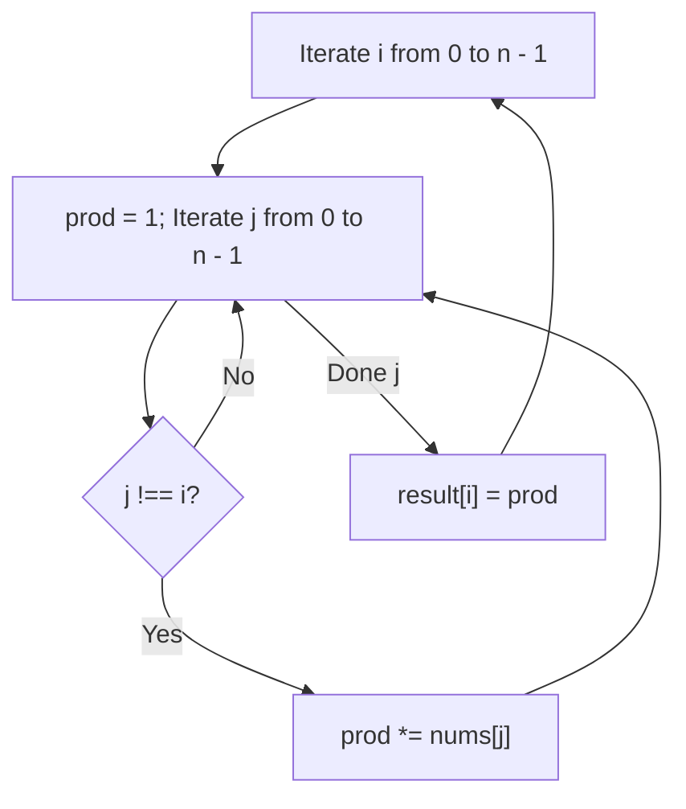
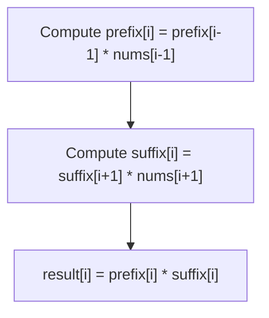
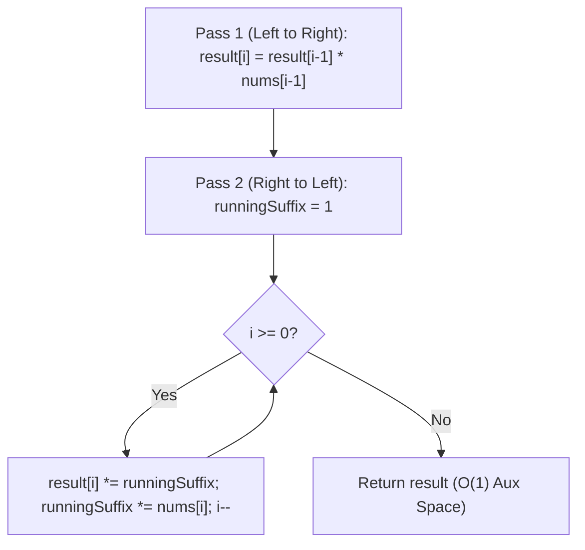

# 238. Product of Array Except Self

- **LeetCode Link**: `https://leetcode.com/problems/product-of-array-except-self/`
- **Difficulty**: Medium
- **Pattern Category**: Array / Prefix & Suffix Products
- **Prerequisite Primer**: `00-foundations/01-two-pointers.md`

---

## 1. Problem Overview & Edge Case Matrix

### Problem Statement
Given an integer array `nums`, return an array `answer` such that `answer[i]` is equal to the product of all the elements of `nums` except `nums[i]`.

The product of any prefix or suffix of `nums` is **guaranteed to fit in a 32-bit integer**.

You must write an algorithm that runs in **$O(N)$ time** and **without using the division operation**.

```
nums = [ 1 , 2 , 3 , 4 ]

answer[0] = 2 * 3 * 4 = 24
answer[1] = 1 * 3 * 4 = 12
answer[2] = 1 * 2 * 4 = 8
answer[3] = 1 * 2 * 3 = 6
Output: [ 24 , 12 , 8 , 6 ]
```

### Upfront Edge Case Matrix

| Edge Case Scenario | Inputs | Expected Output | Pitfall / Failure Mode |
| :--- | :--- | :--- | :--- |
| Contains Exactly One Zero | `nums = [1, 2, 0, 4]` | `[0, 0, 8, 0]` | Division by zero if division were used |
| Contains Two or More Zeros | `nums = [0, 4, 0]` | `[0, 0, 0]` | Failing to propagate zero products across all positions |
| Negative Numbers | `nums = [-1, 1, 0, -3, 3]` | `[0, 0, 9, 0, 0]` | Sign inversion errors with negative zeros |
| Two Elements Only | `nums = [2, 5]` | `[5, 2]` | Prefix/suffix bounds initialization bug |

---

## 2. Level 1: Brute Force Approach (Nested Product for Every Index)

### Intuition & Visual Idea
For every index `i`, loop through all other indices $j \neq i$ and multiply all `nums[j]` together.



### Pseudocode
```text
FUNCTION productExceptSelfBruteForce(nums):
    n = nums.length
    result = new Array(n)
    FOR i FROM 0 TO n - 1:
        prod = 1
        FOR j FROM 0 TO n - 1:
            IF i != j:
                prod *= nums[j]
        result[i] = prod
    RETURN result
```

### Step-by-Step Dry Run
`nums = [1, 2, 3, 4]`

| `i` | Elements Multiplied ($j \neq i$) | Product Value | `result[i]` |
| :--- | :--- | :--- | :--- |
| 0 | $2 \times 3 \times 4$ | 24 | 24 |
| 1 | $1 \times 3 \times 4$ | 12 | 12 |
| 2 | $1 \times 2 \times 4$ | 8 | 8 |
| 3 | $1 \times 2 \times 3$ | 6 | 6 |

### Modern JavaScript Implementation
```javascript
/**
 * Level 1: Brute Force Nested Multiplication
 * Time Complexity:  O(N^2)
 * Space Complexity: O(1) auxiliary (excluding output array)
 */
function productExceptSelfBruteForce(nums) {
  const n = nums.length;
  const result = new Array(n);

  for (let i = 0; i < n; i++) {
    let prod = 1;
    for (let j = 0; j < n; j++) {
      if (i !== j) {
        prod *= nums[j];
      }
    }
    result[i] = prod;
  }

  return result;
}
```

### Complexity Breakdown
- **Time Complexity**: $O(N^2)$ — Quadratic runtime, causes TLE for $N = 10^5$.
- **Space Complexity**: $O(1)$ auxiliary space.

---

## 3. Level 2: Optimized Approach (Separate Prefix & Suffix Arrays)

### Intuition & Visual Bottleneck Elimination
Notice that for any index `i`:
$$\text{result}[i] = (\text{product of elements to the left of } i) \times (\text{product of elements to the right of } i)$$
We construct two arrays:
- `prefix[i]`: Product of all elements from index 0 up to $i - 1$.
- `suffix[i]`: Product of all elements from index $i + 1$ up to $n - 1$.
- Then, `result[i] = prefix[i] * suffix[i]`.



### Pseudocode
```text
FUNCTION productExceptSelfOptimized(nums):
    n = nums.length
    prefix = new Array(n)
    suffix = new Array(n)
    
    prefix[0] = 1
    FOR i FROM 1 TO n - 1:
        prefix[i] = prefix[i - 1] * nums[i - 1]

    suffix[n - 1] = 1
    FOR i FROM n - 2 DOWNTO 0:
        suffix[i] = suffix[i + 1] * nums[i + 1]

    result = new Array(n)
    FOR i FROM 0 TO n - 1:
        result[i] = prefix[i] * suffix[i]
    RETURN result
```

### Step-by-Step Dry Run
`nums = [1, 2, 3, 4]`

| Index `i` | `nums[i]` | `prefix[i]` (Left product) | `suffix[i]` (Right product) | `result[i] = prefix * suffix` |
| :--- | :--- | :--- | :--- | :--- |
| 0 | 1 | 1 | $2 \times 3 \times 4 = 24$ | $1 \times 24 = \mathbf{24}$ |
| 1 | 2 | 1 | $3 \times 4 = 12$ | $1 \times 12 = \mathbf{12}$ |
| 2 | 3 | $1 \times 2 = 2$ | 4 | $2 \times 4 = \mathbf{8}$ |
| 3 | 4 | $1 \times 2 \times 3 = 6$ | 1 | $6 \times 1 = \mathbf{6}$ |

### Modern JavaScript Implementation
```javascript
/**
 * Level 2: Prefix & Suffix Arrays
 * Time Complexity:  O(N)
 * Space Complexity: O(N) Auxiliary Space
 */
function productExceptSelfOptimized(nums) {
  const n = nums.length;
  const prefix = new Int32Array(n);
  const suffix = new Int32Array(n);
  const result = new Int32Array(n);

  prefix[0] = 1;
  for (let i = 1; i < n; i++) {
    prefix[i] = prefix[i - 1] * nums[i - 1];
  }

  suffix[n - 1] = 1;
  for (let i = n - 2; i >= 0; i--) {
    suffix[i] = suffix[i + 1] * nums[i + 1];
  }

  for (let i = 0; i < n; i++) {
    result[i] = prefix[i] * suffix[i];
  }

  return Array.from(result);
}
```

### Complexity Breakdown
- **Time Complexity**: $O(N)$ — Three sequential linear passes.
- **Space Complexity**: $O(N)$ auxiliary space for `prefix` and `suffix` arrays.

---

## 4. Level 3: Most Optimal / Canonical Approach ($O(1)$ Space In-Place Output Array)

### Intuition & Memory Optimization
We can eliminate auxiliary arrays completely:
1. Construct the **prefix products directly into the `output` array**.
2. Iterate backwards while maintaining a single running scalar `suffixProduct = 1`.
3. Multiply `output[i] *= suffixProduct` and update `suffixProduct *= nums[i]`.

```
nums: [ 1 , 2 , 3 , 4 ]
Pass 1 (Prefix in output): [ 1 , 1 , 2 , 6 ]
Pass 2 (Running Suffix from Right):
i = 3: output[3] = 6 * 1 = 6, suffix = 1 * 4 = 4
i = 2: output[2] = 2 * 4 = 8, suffix = 4 * 3 = 12
i = 1: output[1] = 1 * 12 = 12, suffix = 12 * 2 = 24
i = 0: output[0] = 1 * 24 = 24
Result: [ 24 , 12 , 8 , 6 ]
```



### Pseudocode
```text
FUNCTION productExceptSelf(nums):
    n = nums.length
    result = new Array(n)
    result[0] = 1
    FOR i FROM 1 TO n - 1:
        result[i] = result[i - 1] * nums[i - 1]
    
    suffix = 1
    FOR i FROM n - 1 DOWNTO 0:
        result[i] *= suffix
        suffix *= nums[i]
    RETURN result
```

### Step-by-Step Dry Run
`nums = [1, 2, 3, 4]`

| Step | `i` | `result[i]` Before | `suffix` | `result[i] * suffix` | `result` State | `suffix` After |
| :--- | :--- | :--- | :--- | :--- | :--- | :--- |
| 1 | 3 | 6 | 1 | $6 \times 1 = \mathbf{6}$ | `[1, 1, 2, 6]` | $1 \times 4 = 4$ |
| 2 | 2 | 2 | 4 | $2 \times 4 = \mathbf{8}$ | `[1, 1, 8, 6]` | $4 \times 3 = 12$ |
| 3 | 1 | 1 | 12 | $1 \times 12 = \mathbf{12}$ | `[1, 12, 8, 6]` | $12 \times 2 = 24$ |
| 4 | 0 | 1 | 24 | $1 \times 24 = \mathbf{24}$ | `[24, 12, 8, 6]` | $24 \times 1 = 24$ |

### Modern JavaScript Implementation
```javascript
/**
 * Level 3: In-Place Output Array (Canonical Optimal)
 * Time Complexity:  O(N)
 * Space Complexity: O(1) Auxiliary Space
 */
function productExceptSelf(nums) {
  const n = nums.length;
  const result = new Array(n);

  // Step 1: Compute prefix products directly in result array
  result[0] = 1;
  for (let i = 1; i < n; i++) {
    result[i] = result[i - 1] * nums[i - 1];
  }

  // Step 2: Multiply by running suffix product from right to left
  let suffixProduct = 1;
  for (let i = n - 1; i >= 0; i--) {
    result[i] *= suffixProduct;
    suffixProduct *= nums[i];
  }

  return result;
}
```

### Complexity Breakdown
- **Time Complexity**: $O(N)$ — Exactly two linear traversals.
- **Space Complexity**: $O(1)$ auxiliary space — Output array does not count towards extra space per problem specifications.

---

## 5. JavaScript-Specific Gotchas & V8 Optimizations
- **Negative Zero Gotcha**: In JavaScript, `0 * -1` evaluates to `-0`. While `-0 === 0` is `true`, `Object.is(-0, 0)` is `false`. Modern V8 engines handle this cleanly, but writing `result[i] = result[i] === 0 ? 0 : result[i]` guarantees standard integer zero.

---

## 6. Real-World MAANG Interview Follow-Ups & Extensions

### Follow-Up 1: Division under Large Prime Modulo $10^9 + 7$ (Fermat's Little Theorem)
- **Scenario**: What if array elements can be modified and we need prefix products modulo $10^9 + 7$?
- **Solution**: Division under modulo $P$ is equivalent to multiplication by modular inverse: $A / B \equiv A \times B^{P - 2} \pmod P$.
- **JS Code**:
```javascript
function modInverse(a, mod = 1000000007n) {
  let res = 1n;
  let base = BigInt(a) % mod;
  let exp = mod - 2n;
  while (exp > 0n) {
    if (exp % 2n === 1n) res = (res * base) % mod;
    base = (base * base) % mod;
    exp /= 2n;
  }
  return res;
}
```

### Follow-Up 2: Dynamic Range Product Queries with Point Updates
- **Scenario**: How to support `update(index, val)` and `getProductExcept(index)` in $O(\log N)$ time?
- **Solution Strategy**: Implement a **Segment Tree** storing range multiplication.
