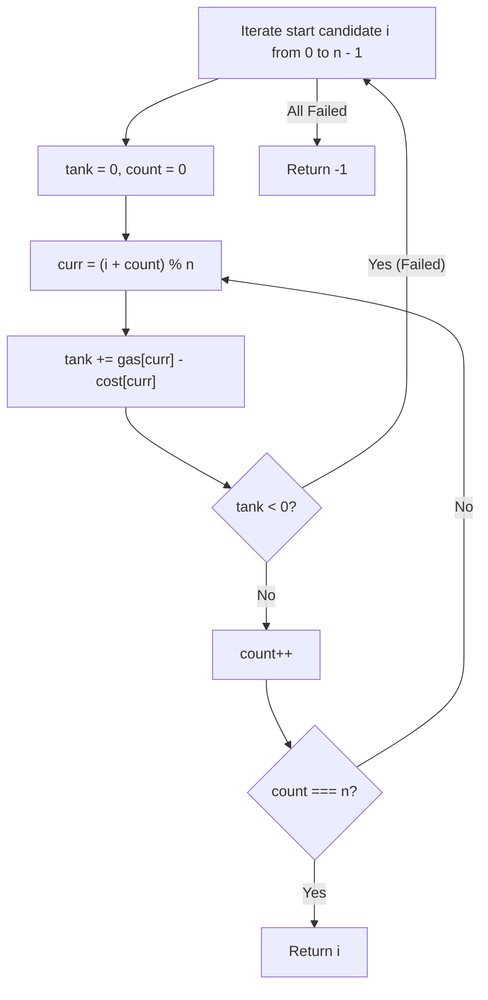
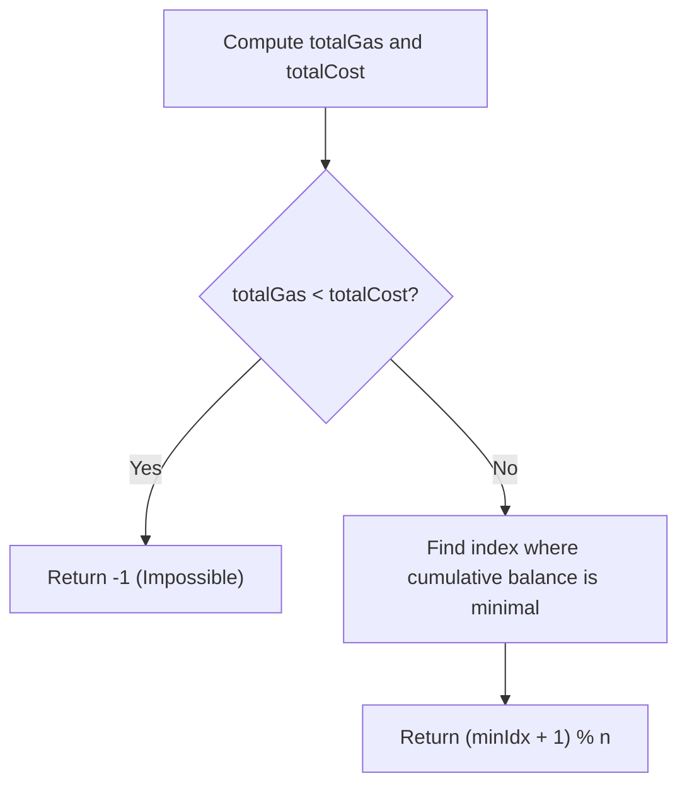
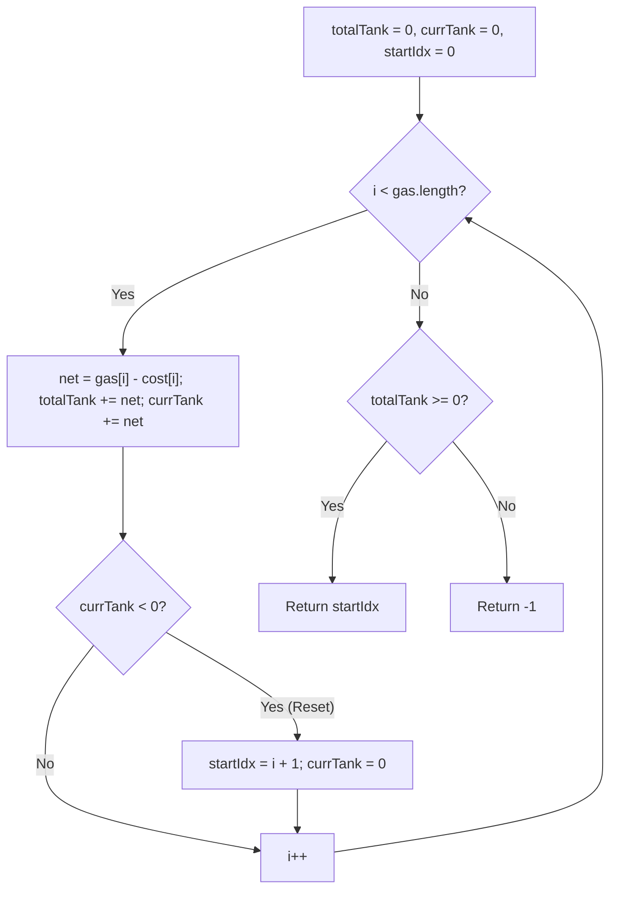

# 134. Gas Station

- **LeetCode Link**: `https://leetcode.com/problems/gas-station/`
- **Difficulty**: Medium
- **Pattern Category**: Array / Greedy
- **Prerequisite Primer**: `00-foundations/01-two-pointers.md`

---

## 1. Problem Overview & Edge Case Matrix

### Problem Statement
There are `n` gas stations along a circular route, where the amount of gas at the $i^{\text{th}}$ station is `gas[i]`.

You have a car with an unlimited gas tank and it costs `cost[i]` of gas to travel from the $i^{\text{th}}$ station to its next $(i + 1)^{\text{th}}$ station. You begin the journey with an empty tank at one of the gas stations.

Given two integer arrays `gas` and `cost`, return the starting gas station's index if you can travel around the circuit once in the clockwise direction, otherwise return `-1`. If there exists a solution, it is **guaranteed to be unique**.

```
gas  = [ 1 , 2 , 3 , 4 , 5 ]
cost = [ 3 , 4 , 5 , 1 , 2 ]
net  = [-2 ,-2 ,-2 , 3 , 3 ]

Total gas = 15, Total cost = 15 -> Possible!
Start at index 3 (gas[3]=4, cost[3]=1):
- Reach 4: tank = (4-1) + 5 = 8
- Reach 0: tank = 8 - 2 + 1 = 7
- Reach 1: tank = 7 - 3 + 2 = 6
- Reach 2: tank = 6 - 4 + 3 = 5
- Reach 3: tank = 5 - 5 = 0 (Completed full circuit!)
Output: 3
```

### Upfront Edge Case Matrix

| Edge Case Scenario | Inputs | Expected Output | Pitfall / Failure Mode |
| :--- | :--- | :--- | :--- |
| Total Gas < Total Cost | `gas = [2, 3, 4]`, `cost = [3, 4, 3]` | `-1` | Loop running indefinitely searching for start |
| Single Gas Station (Sufficient) | `gas = [5]`, `cost = [4]` | `0` | Off-by-one modulo errors |
| Single Gas Station (Insufficient) | `gas = [2]`, `cost = [3]` | `-1` | Zero-loop edge condition |
| Exact Net Zero Match | `gas = [1, 2, 3]`, `cost = [3, 2, 1]` | `2` | Premature exit before full circuit check |

---

## 2. Level 1: Brute Force Approach (Simulate Full Circuit from Every Station)

### Intuition & Visual Idea
Test every station $i$ as a potential candidate start. Simulate driving clockwise across $n$ stations. If the tank drops below 0 at any point, abandon candidate $i$ and test $i + 1$.



### Pseudocode
```text
FUNCTION canCompleteCircuitBruteForce(gas, cost):
    n = gas.length
    FOR start FROM 0 TO n - 1:
        tank = 0
        success = true
        FOR step FROM 0 TO n - 1:
            curr = (start + step) MOD n
            tank += gas[curr] - cost[curr]
            IF tank < 0:
                success = false
                BREAK
        IF success:
            RETURN start
    RETURN -1
```

### Step-by-Step Dry Run
`gas = [1, 2, 3, 4, 5]`, `cost = [3, 4, 5, 1, 2]`

| Start Index | Station Visited | Net Gas Added | Running Tank | Status |
| :--- | :--- | :--- | :--- | :--- |
| `start = 0` | 0 | $1 - 3 = -2$ | $-2 < 0$ | Fail immediately |
| `start = 1` | 1 | $2 - 4 = -2$ | $-2 < 0$ | Fail immediately |
| `start = 2` | 2 | $3 - 5 = -2$ | $-2 < 0$ | Fail immediately |
| `start = 3` | $3 \to 4 \to 0 \to 1 \to 2$ | $+3, +3, -2, -2, -2$ | $3 \to 6 \to 4 \to 2 \to 0$ | **Success! Return 3** |

### Modern JavaScript Implementation
```javascript
/**
 * Level 1: Brute Force Circuit Simulation
 * Time Complexity:  O(N^2)
 * Space Complexity: O(1)
 */
function canCompleteCircuitBruteForce(gas, cost) {
  const n = gas.length;

  for (let start = 0; start < n; start++) {
    let tank = 0;
    let possible = true;

    for (let step = 0; step < n; step++) {
      const curr = (start + step) % n;
      tank += gas[curr] - cost[curr];
      if (tank < 0) {
        possible = false;
        break;
      }
    }

    if (possible) {
      return start;
    }
  }

  return -1;
}
```

### Complexity Breakdown
- **Time Complexity**: $O(N^2)$ — Can scan up to $N$ stations for each of the $N$ starting points.
- **Space Complexity**: $O(1)$.

---

## 3. Level 2: Optimized Approach (Cumulative Lowest Deficit Valley)

### Intuition & Visual Bottleneck Elimination
Consider the cumulative net fuel balance over time.
1. If the total net sum $\sum (\text{gas}[i] - \text{cost}[i]) < 0$, completing the circuit is mathematically impossible $\to$ return `-1`.
2. Otherwise, a valid start index is guaranteed. The optimal starting station is the one immediately following the **lowest cumulative valley** in the net fuel graph.



### Pseudocode
```text
FUNCTION canCompleteCircuitOptimized(gas, cost):
    total = 0
    minBalance = INFINITY
    minIdx = -1
    balance = 0
    
    FOR i FROM 0 TO gas.length - 1:
        net = gas[i] - cost[i]
        total += net
        balance += net
        IF balance < minBalance:
            minBalance = balance
            minIdx = i

    IF total < 0: RETURN -1
    RETURN (minIdx + 1) MOD gas.length
```

### Step-by-Step Dry Run
`gas = [1, 2, 3, 4, 5]`, `cost = [3, 4, 5, 1, 2]`

| `i` | Net (`gas - cost`) | Cumulative `balance` | `minBalance` | `minIdx` |
| :--- | :--- | :--- | :--- | :--- |
| 0 | $-2$ | $-2$ | $-2$ | 0 |
| 1 | $-2$ | $-4$ | $-4$ | 1 |
| 2 | $-2$ | $-6$ | $\mathbf{-6}$ (Valley) | $\mathbf{2}$ |
| 3 | $+3$ | $-3$ | $-6$ | 2 |
| 4 | $+3$ | $0$ | $-6$ | 2 |
| Result | Total = 0 | Minimal valley at `i = 2` | Start = $(2 + 1) \% 5 = \mathbf{3}$ |

### Modern JavaScript Implementation
```javascript
/**
 * Level 2: Lowest Cumulative Valley
 * Time Complexity:  O(N)
 * Space Complexity: O(1)
 */
function canCompleteCircuitOptimized(gas, cost) {
  let totalBalance = 0;
  let runningBalance = 0;
  let minBalance = Infinity;
  let minIndex = -1;

  for (let i = 0; i < gas.length; i++) {
    const net = gas[i] - cost[i];
    totalBalance += net;
    runningBalance += net;

    if (runningBalance < minBalance) {
      minBalance = runningBalance;
      minIndex = i;
    }
  }

  if (totalBalance < 0) {
    return -1;
  }

  return (minIndex + 1) % gas.length;
}
```

### Complexity Breakdown
- **Time Complexity**: $O(N)$ — Single pass.
- **Space Complexity**: $O(1)$ — Only scalar accumulators.

---

## 4. Level 3: Most Optimal / Canonical Approach (Greedy Resetting Tank)

### Intuition & Mathematical Invariant
Key Theorem: If starting at station $A$ allows you to reach up to station $B$, but you fail at station $B + 1$ ($\text{tank} < 0$), then **no station between $A$ and $B$ can be a valid start!**
Why? Because any intermediate station $C$ ($A < C \le B$) would start with $\text{tank} = 0$, which is strictly less than or equal to the non-negative gas accumulated when arriving at $C$ from $A$.

Therefore, whenever `currentTank < 0`, we immediately discard all stations from $A$ to $B$ and reset our starting candidate to $B + 1$ with `currentTank = 0`!

```
gas:  [ 1 ,  2 ,  3 ,  4 ,  5 ]
cost: [ 3 ,  4 ,  5 ,  1 ,  2 ]
net:  [-2 , -2 , -2 ,  3 ,  3 ]

i=0: tank = -2 < 0 -> start = 1, tank = 0
i=1: tank = -2 < 0 -> start = 2, tank = 0
i=2: tank = -2 < 0 -> start = 3, tank = 0
i=3: tank = +3 >= 0 -> start remains 3, tank = 3
i=4: tank = 3 + 3 = 6 >= 0 -> start = 3 (Valid!)
```



### Pseudocode
```text
FUNCTION canCompleteCircuit(gas, cost):
    totalTank = 0
    currTank = 0
    start = 0

    FOR i FROM 0 TO gas.length - 1:
        net = gas[i] - cost[i]
        totalTank += net
        currTank += net
        IF currTank < 0:
            start = i + 1
            currTank = 0

    RETURN totalTank >= 0 ? start : -1
```

### Step-by-Step Dry Run
`gas = [1, 2, 3, 4, 5]`, `cost = [3, 4, 5, 1, 2]`

| `i` | Net Gas | `currTank` | `totalTank` | Condition (`currTank < 0`) | `start` After |
| :--- | :--- | :--- | :--- | :--- | :--- |
| 0 | $-2$ | $-2 \to 0$ | $-2$ | True (Reset) | 1 |
| 1 | $-2$ | $-2 \to 0$ | $-4$ | True (Reset) | 2 |
| 2 | $-2$ | $-2 \to 0$ | $-6$ | True (Reset) | 3 |
| 3 | $+3$ | $3$ | $-3$ | False | 3 |
| 4 | $+3$ | $6$ | $0$ | False | 3 |
| End | - | - | Total Tank = $0 \ge 0$ | **Return start = 3** | - |

### Modern JavaScript Implementation
```javascript
/**
 * Level 3: Greedy One-Pass Resetting Tank (Canonical Optimal)
 * Time Complexity:  O(N)
 * Space Complexity: O(1) Auxiliary
 */
function canCompleteCircuit(gas, cost) {
  let totalTank = 0;
  let currentTank = 0;
  let startStation = 0;

  for (let i = 0; i < gas.length; i++) {
    const netGas = gas[i] - cost[i];
    totalTank += netGas;
    currentTank += netGas;

    // If current tank is negative, we cannot reach station i + 1 from startStation
    if (currentTank < 0) {
      startStation = i + 1;
      currentTank = 0;
    }
  }

  return totalTank >= 0 ? startStation : -1;
}
```

### Complexity Breakdown
- **Time Complexity**: $O(N)$ — Exactly $N$ loop steps.
- **Space Complexity**: $O(1)$ — Only three primitive number variables.

---

## 5. JavaScript-Specific Gotchas & V8 Optimizations
- **Single Pass Guarantee**: Many candidates do a second verification loop to make sure `startStation` can make the full loop. But because we track `totalTank >= 0`, mathematics guarantees that if the total fuel is sufficient, `startStation` is guaranteed to succeed!

---

## 6. Real-World MAANG Interview Follow-Ups & Extensions

### Follow-Up 1: Fuel Tank with Limited Maximum Capacity $C$
- **Scenario**: What if the car's fuel tank has a maximum capacity $C$ and cannot hold more than $C$ gas (`tank = Math.min(tank + gas[i], C)`)?
- **Solution Strategy**: The greedy theorem no longer holds because excess fuel is discarded. We must use a **Sliding Window / Monotonic Queue** over $2N$ circular elements.

### Follow-Up 2: Bidirectional Gas Station Tour
- **Scenario**: What if you can choose to travel either clockwise or counter-clockwise?
- **Solution Strategy**: Run Level 3 in the forward direction, then run a mirrored Level 3 in the backward direction, returning the valid index or `-1`.
