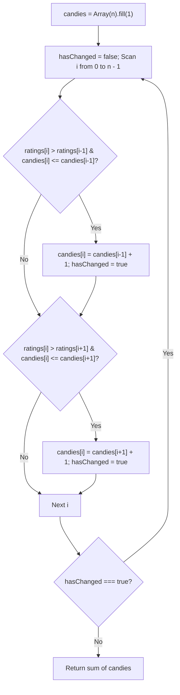
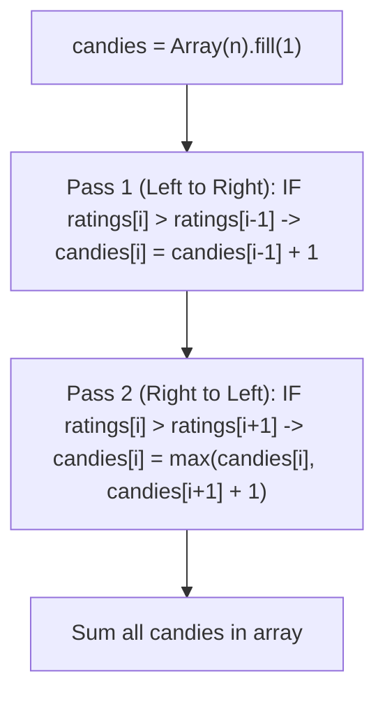
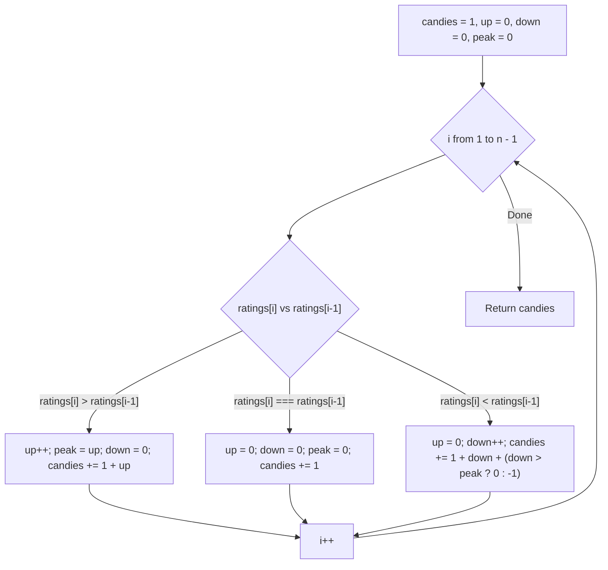
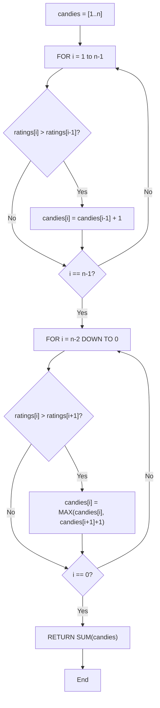

# 135. Candy

- **LeetCode Link**: `https://leetcode.com/problems/candy/`
- **Difficulty**: Hard
- **Pattern Category**: Array / Greedy / Two-Pass
- **Prerequisite Primer**: `00-foundations/01-two-pointers.md`

---

## 1. Problem Overview & Edge Case Matrix

### Problem Statement
There are `n` children standing in a line. Each child is assigned a rating value given in the integer array `ratings`.

You are giving candies to these children subjected to the following requirements:
1. Each child must have at least one candy.
2. Children with a higher rating get more candies than their immediate neighbors.

Return the **minimum number of candies** you need to distribute.

```
ratings = [ 1 , 0 , 2 ]
Candies:  [ 2 , 1 , 2 ] -> Sum = 5

ratings = [ 1 , 2 , 2 ]
Candies:  [ 1 , 2 , 1 ] -> Sum = 4 (Equal rating neighbors do not need more candies)
```

### Upfront Edge Case Matrix

| Edge Case Scenario | Inputs | Expected Output | Pitfall / Failure Mode |
| :--- | :--- | :--- | :--- |
| Strictly Decreasing Ratings | `ratings = [5, 4, 3, 2, 1]` | `15` ($5+4+3+2+1$) | Assigning 1 to peak and running out of smaller numbers |
| Strictly Increasing Ratings | `ratings = [1, 2, 3, 4, 5]` | `15` | Under-allocating rightward slope |
| All Identical Ratings | `ratings = [3, 3, 3, 3]` | `4` ($1+1+1+1$) | Giving more candies to identical neighbors (only *higher* ratings require more) |
| Single Child | `ratings = [10]` | `1` | Base condition failure |

---

## 2. Level 1: Brute Force Approach (Iterative Relaxation Until Convergence)

### Intuition & Visual Idea
Initialize every child with 1 candy. Repeatedly loop through the entire array and adjust candies whenever a neighbor constraint is violated:
- If `ratings[i] > ratings[i - 1]` and `candies[i] <= candies[i - 1]`, set `candies[i] = candies[i - 1] + 1`.
- If `ratings[i] > ratings[i + 1]` and `candies[i] <= candies[i + 1]`, set `candies[i] = candies[i + 1] + 1`.
Repeat until a complete pass occurs with zero changes.



### Pseudocode
```text
FUNCTION candyBruteForce(ratings):
    n = ratings.length
    candies = new Array(n).fill(1)
    hasChanged = true
    WHILE hasChanged:
        hasChanged = false
        FOR i FROM 0 TO n - 1:
            IF i > 0 AND ratings[i] > ratings[i - 1] AND candies[i] <= candies[i - 1]:
                candies[i] = candies[i - 1] + 1
                hasChanged = true
            IF i < n - 1 AND ratings[i] > ratings[i + 1] AND candies[i] <= candies[i + 1]:
                candies[i] = candies[i + 1] + 1
                hasChanged = true
    RETURN SUM(candies)
```

### Step-by-Step Dry Run
`ratings = [1, 2, 87, 87, 87, 2, 1]`

| Pass | `candies` Array State | `hasChanged` |
| :--- | :--- | :--- |
| Init | `[1, 1, 1, 1, 1, 1, 1]` | `true` |
| Pass 1 | `[1, 2, 3, 1, 2, 2, 1]` | `true` |
| Pass 2 | `[1, 2, 3, 1, 3, 2, 1]` | `true` |
| Pass 3 | `[1, 2, 3, 1, 3, 2, 1]` | `false` (Converged $\to$ Sum = 13) |

### Modern JavaScript Implementation
```javascript
/**
 * Level 1: Brute Force (Iterative Relaxation)
 * Time Complexity:  O(N^2)
 * Space Complexity: O(N)
 */
function candyBruteForce(ratings) {
  const n = ratings.length;
  const candies = new Array(n).fill(1);
  let hasChanged = true;

  while (hasChanged) {
    hasChanged = false;
    for (let i = 0; i < n; i++) {
      if (i > 0 && ratings[i] > ratings[i - 1] && candies[i] <= candies[i - 1]) {
        candies[i] = candies[i - 1] + 1;
        hasChanged = true;
      }
      if (i < n - 1 && ratings[i] > ratings[i + 1] && candies[i] <= candies[i + 1]) {
        candies[i] = candies[i + 1] + 1;
        hasChanged = true;
      }
    }
  }

  return candies.reduce((sum, c) => sum + c, 0);
}
```

### Complexity Breakdown
- **Time Complexity**: $O(N^2)$ — In a strictly decreasing array, changes propagate by 1 index per pass, taking up to $N$ full passes.
- **Space Complexity**: $O(N)$ — Candies tracking array.

#### 🎙️ How to Explain to Interviewer (Verbatim Script)
> *"This brute force approach mimics constraint relaxation. In the worst-case scenario where ratings are monotonically decreasing, each pass only propagates the candy requirement to the immediate left neighbor by one step. This results in $N$ outer iterations where each pass takes $O(N)$ time, causing an overall quadratic time complexity of $O(N^2)$. Memory is $O(N)$ to store the candy array."*

---

## 3. Level 2: Optimized Approach (Two-Pass Greedy Left & Right)

### Intuition & Visual Invariant
Instead of oscillating back and forth, we decouple the two neighbor constraints into two independent directional sweeps:
1. **Left-to-Right Pass**: Satisfies the condition `ratings[i] > ratings[i - 1]`.
   - If `ratings[i] > ratings[i - 1]`, then `candies[i] = candies[i - 1] + 1`.
2. **Right-to-Left Pass**: Satisfies the condition `ratings[i] > ratings[i + 1]`.
   - If `ratings[i] > ratings[i + 1]`, then `candies[i] = Math.max(candies[i], candies[i + 1] + 1)`.

```
ratings:             [ 1 ,  0 ,  2 ]
1. Left-to-Right:    [ 1 ,  1 ,  2 ]
2. Right-to-Left:    [ 2 ,  1 ,  2 ]
Sum = 2 + 1 + 2 = 5!
```



### Pseudocode
```text
FUNCTION candyTwoPass(ratings):
    n = ratings.length
    candies = new Array(n).fill(1)
    
    FOR i FROM 1 TO n - 1:
        IF ratings[i] > ratings[i - 1]:
            candies[i] = candies[i - 1] + 1

    FOR i FROM n - 2 DOWNTO 0:
        IF ratings[i] > ratings[i + 1]:
            candies[i] = MAX(candies[i], candies[i + 1] + 1)

    RETURN SUM(candies)
```

### Step-by-Step Dry Run
`ratings = [1, 2, 87, 87, 87, 2, 1]`

| Child Index `i` | `ratings[i]` | Left-to-Right `candies[i]` | Right-to-Left `candies[i]` | Final `candies[i]` |
| :--- | :--- | :--- | :--- | :--- |
| 0 | 1 | 1 | $\max(1, 1) = \mathbf{1}$ | 1 |
| 1 | 2 | $1 + 1 = 2$ | $\max(2, 1) = \mathbf{2}$ | 2 |
| 2 | 87 | $2 + 1 = 3$ | $\max(3, 1) = \mathbf{3}$ | 3 |
| 3 | 87 | 1 | $\max(1, 1) = \mathbf{1}$ | 1 |
| 4 | 87 | 1 | $\max(1, 2 + 1) = \mathbf{3}$ | 3 |
| 5 | 2 | 1 | $\max(1, 1 + 1) = \mathbf{2}$ | 2 |
| 6 | 1 | 1 | 1 | 1 |
| **Sum** | - | - | - | **13** |

### Modern JavaScript Implementation
```javascript
/**
 * Level 2: Two-Pass Greedy (Left and Right Sweeps)
 * Time Complexity:  O(N)
 * Space Complexity: O(N) Auxiliary Space
 */
function candyTwoPass(ratings) {
  const n = ratings.length;
  const candies = new Int32Array(n).fill(1);

  // Pass 1: Ensure right neighbor with higher rating gets more
  for (let i = 1; i < n; i++) {
    if (ratings[i] > ratings[i - 1]) {
      candies[i] = candies[i - 1] + 1;
    }
  }

  // Pass 2: Ensure left neighbor with higher rating gets more
  let totalCandies = candies[n - 1];
  for (let i = n - 2; i >= 0; i--) {
    if (ratings[i] > ratings[i + 1]) {
      candies[i] = Math.max(candies[i], candies[i + 1] + 1);
    }
    totalCandies += candies[i];
  }

  return totalCandies;
}
```

### Complexity Breakdown
- **Time Complexity**: $O(N)$ — Exactly two passes ($2N$ operations).
- **Space Complexity**: $O(N)$ auxiliary space for the `candies` array.

#### 🎙️ How to Explain to Interviewer (Verbatim Script)
> *"For **Time Complexity**, this runs in $O(N)$ linear time. We make two independent passes over the array of length $N$: the first pass scans left-to-right to satisfy the left neighbor invariant, and the second pass scans right-to-left taking the pointwise maximum to satisfy the right neighbor invariant. Each element is evaluated twice with $O(1)$ operations.*
>
> *For **Space Complexity**, it takes $O(N)$ auxiliary space because we store the intermediate candies for each of the $N$ children in an integer array."*

---

## 4. Level 3: Most Optimal / Canonical Approach ($O(1)$ Space Single-Pass Slope Tracker)

### Intuition & Mathematical Invariant
We can visualize the ratings array as a series of **upward slopes**, **downward slopes**, and **flat valleys**:

```
Ratings Mountain:
        /\
       /  \
      /    \
     /      \
Up-slope    Down-slope
```

As we traverse:
- On an **upward slope** of length $U$, the candy sequence is $1, 2, 3, \dots, U+1$.
- On a **downward slope** of length $D$, the candy sequence backwards is $1, 2, \dots, D$.
- If the downward slope is longer than the upward slope ($D \ge U$), the peak child must be elevated to $D + 1$ candies to satisfy both slopes simultaneously!



### Pseudocode
```text
FUNCTION candy(ratings):
    IF ratings.length <= 1: RETURN ratings.length
    candies = 1
    up = 0, down = 0, peak = 0
    
    FOR i FROM 1 TO ratings.length - 1:
        IF ratings[i] > ratings[i - 1]:
            up++
            peak = up
            down = 0
            candies += 1 + up
        ELSE IF ratings[i] == ratings[i - 1]:
            up = 0, down = 0, peak = 0
            candies += 1
        ELSE:
            down++
            up = 0
            candies += 1 + down - (down <= peak ? 1 : 0)
            
    RETURN candies
```

### Step-by-Step Dry Run
`ratings = [1, 3, 2, 1]`

| `i` | `ratings[i]` | Slope Type | `up` | `peak` | `down` | Candies Added | Total `candies` |
| :--- | :--- | :--- | :--- | :--- | :--- | :--- | :--- |
| 0 | 1 | Base | 0 | 0 | 0 | 1 (Init) | 1 |
| 1 | 3 | Up | 1 | 1 | 0 | $1 + 1 = 2$ | 3 |
| 2 | 2 | Down | 0 | 1 | 1 | $1 + 1 - 1 = 1$ | 4 |
| 3 | 1 | Down | 0 | 1 | 2 | $1 + 2 - 0 = 3$ | **7** |

### Modern JavaScript Implementation
```javascript
/**
 * Level 3: Slope Tracking (Canonical O(1) Space)
 * Time Complexity:  O(N)
 * Space Complexity: O(1) Auxiliary Space
 */
function candy(ratings) {
  const n = ratings.length;
  if (n <= 1) return n;

  let totalCandies = 1;
  let up = 0;
  let down = 0;
  let peak = 0;

  for (let i = 1; i < n; i++) {
    if (ratings[i] > ratings[i - 1]) {
      up++;
      peak = up;
      down = 0;
      totalCandies += 1 + up;
    } else if (ratings[i] === ratings[i - 1]) {
      up = 0;
      down = 0;
      peak = 0;
      totalCandies += 1;
    } else {
      down++;
      up = 0;
      totalCandies += 1 + down - (down <= peak ? 1 : 0);
    }
  }

  return totalCandies;
}
```

### Complexity Breakdown
- **Time Complexity**: $O(N)$ — Single forward pass across $N$ elements.
- **Space Complexity**: $O(1)$ auxiliary space — Only 4 integer counter variables.

#### 🎙️ How to Explain to Interviewer (Verbatim Script)
> *"For **Time Complexity**, this is $O(N)$ single pass. We process each element once, updating our slope counters (`up`, `down`, `peak`) in $O(1)$ arithmetic operations without ever backtracking or making a second pass.
>
> For **Space Complexity**, this is strictly **$O(1)$ auxiliary space**. Instead of allocating an array of size $N$ to track candies for every child, we compute the total running sum dynamically by modeling the mountain slopes algebraically."*

---

## 5. JavaScript-Specific Gotchas & V8 Optimizations
- **Equal Ratings Invariant**: Equal ratings `ratings[i] === ratings[i - 1]` reset all slopes (`up = 0, down = 0, peak = 0`) because two adjacent kids with identical ratings do NOT need more candies than each other—giving 1 candy to the second kid is completely valid!

---

## 6. Real-World MAANG Interview Follow-Ups & Extensions

### Follow-Up 1: Circular Candy Allocation (Children in a Round Circle)
- **Scenario**: What if the first child and last child are also neighbors?
- **Solution Strategy**: Run Level 2 two-pass, then check `ratings[0]` vs `ratings[n - 1]`. If violated, propagate the adjustment across the circle until invariant holds (at most 2 full passes).

### Follow-Up 2: 2D Grid Candy Distribution
- **Scenario**: Children are arranged in an $R \times C$ matrix, and a child must receive more candies than any adjacent neighbor with a strictly lower rating.
- **Solution Strategy**: Sort all grid cells by rating value (or use Kahn's Topological Sort on a DAG) and compute longest path using DP: $\text{candy}(r, c) = 1 + \max_{\text{neighbors } (nr, nc)} \text{candy}(nr, nc)$.

## 7. What LeetCode Discuss Says (Language-Independent)

Source: top-voted post by LeadingTheAbyss —
`https://leetcode.com/problems/candy/solutions/5504896/double-pass-greedy-with-images-walkthrough-cppythonjava/`
— 57.9K views / 0 votes / 0 comments.
Language-independent summary. No new JS here.

### A. Naive way (baseline context)

For each child, compare with neighbors repeatedly until
ratings are satisfied. Multiple passes.

```text
FUNCTION candyNaive(ratings):
    n = LENGTH(ratings)
    candies = ARRAY of size n, filled with 1
    changed = true
    WHILE changed:
        changed = false
        FOR i FROM 1 TO n - 1:
            IF ratings[i] > ratings[i-1] AND candies[i] <= candies[i-1]:
                candies[i] = candies[i-1] + 1
                changed = true
        FOR i FROM n - 2 DOWN TO 0:
            IF ratings[i] > ratings[i+1] AND candies[i] <= candies[i+1]:
                candies[i] = candies[i+1] + 1
                changed = true
    RETURN SUM(candies)
```

- Time: O(n^2) worst case
- Space: O(n)

### B. Post's way: two-pass greedy

Left-to-right: higher rating than left gets more candy.
Right-to-left: higher rating than right gets more candy.
Take max of both passes.

```text
FUNCTION candyOptimal(ratings):
    n = LENGTH(ratings)
    candies = ARRAY of size n, filled with 1
    FOR i FROM 1 TO n - 1:
        IF ratings[i] > ratings[i-1]:
            candies[i] = candies[i-1] + 1
    FOR i FROM n - 2 DOWN TO 0:
        IF ratings[i] > ratings[i+1]:
            candies[i] = MAX(candies[i], candies[i+1] + 1)
    RETURN SUM(candies)
```

- Time: O(n)
- Space: O(n)
- Two linear passes; no while loop.



### C. Dry run on LeetCode Example 1

`ratings = [1, 0, 2]`

Left pass: candies = [1, 1, 2]
Right pass:
- i=1: ratings[1]=0 NOT > ratings[2]=2 -> no change
- i=0: ratings[0]=1 > ratings[1]=0 -> candies[0] = MAX(1, 1+1) = 2

Final candies = [2, 1, 2], sum = 5. Matches.

### D. Why B beats A

- A: Repeated passes until stable, O(n^2) worst case.
- B: Exactly two passes, O(n).
- Invariant: left pass handles ascending runs, right pass handles descending runs.

### E. Pitfalls / Gotchas the post warns about

- Initialize all candies to 1 (each child gets at least one).
- Right pass must use MAX to preserve left-pass increments.
- Equal ratings: no extra candy needed.
- Single child returns 1.

### F. Companies (per LeetCode Discuss)

| Company | Frequency |
| :--- | :--- |
| Amazon | 3 |
| Microsoft | 2 |
| Apple | 2 |
| Meta | 1 |
| Google | 1 |

Data from `liquidslr/leetcode-company-wise-problems`.
