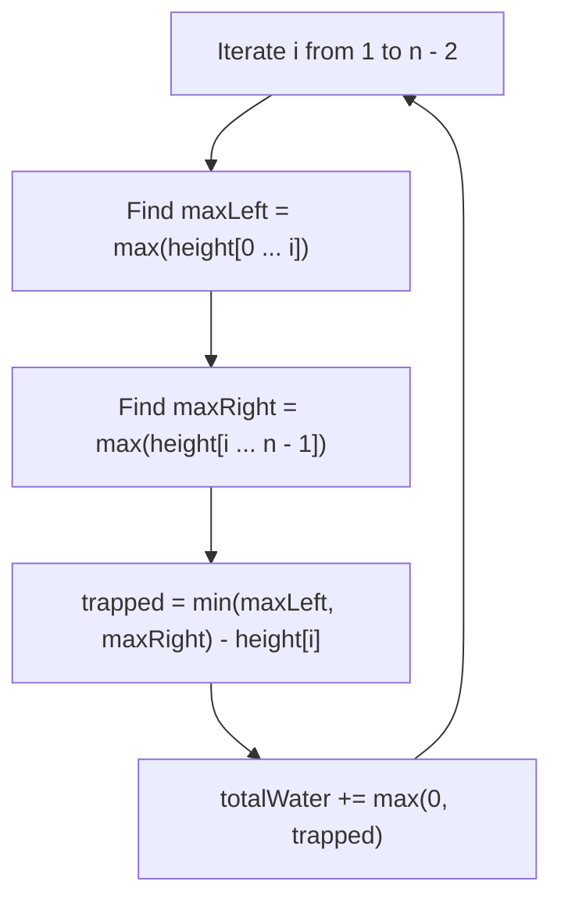
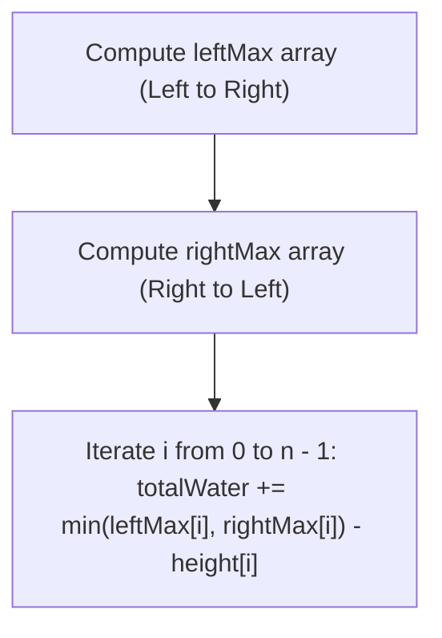
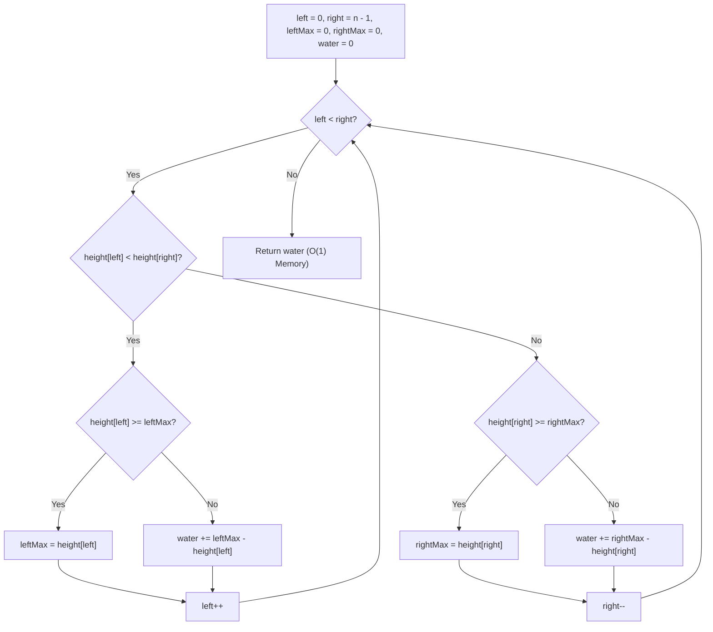
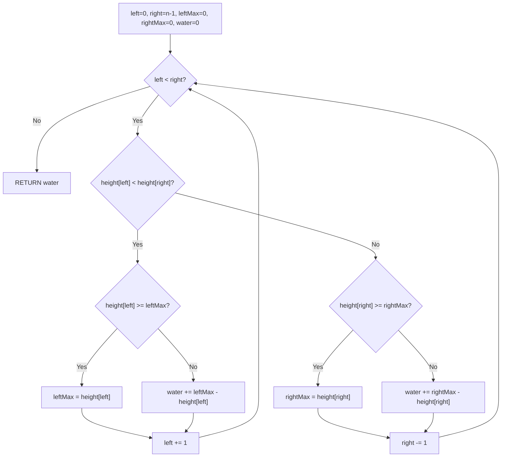

# 42. Trapping Rain Water

- **LeetCode Link**: `https://leetcode.com/problems/trapping-rain-water/`
- **Difficulty**: Hard
- **Pattern Category**: Array / Two Pointers / Dynamic Programming / Monotonic Stack
- **Prerequisite Primer**: `00-foundations/01-two-pointers.md`

---

## 1. Problem Overview & Edge Case Matrix

### Problem Statement
Given `n` non-negative integers representing an elevation map where the width of each bar is `1`, compute how much water it can trap after raining.

```
Elevation Map:
       3 |                 [#]
       2 |         [#] ~ ~ [#][#] ~ [#]
       1 |   [#] ~ [#][#] ~ [#][#][#][#][#]
       0 +----------------------------------
Height:    0  1  0  2  1  0  1  3  2  1  2  1
Water:        0  1  0  0  1  2  1  0  0  1  0  0 -> Total = 6 units
```

### Upfront Edge Case Matrix

| Edge Case Scenario | Inputs | Expected Output | Pitfall / Failure Mode |
| :--- | :--- | :--- | :--- |
| Array Length $< 3$ | `height = [2, 0]` | `0` | Out of bounds left/right boundary checks |
| Strictly Increasing Elevation | `height = [1, 2, 3, 4, 5]` | `0` | No right boundary to trap water |
| Strictly Decreasing Elevation | `height = [5, 4, 3, 2, 1]` | `0` | No left boundary to trap water |
| Flat Elevation | `height = [3, 3, 3, 3]` | `0` | Equal height boundary bugs |
| Single Deep Chasm | `height = [4, 0, 4]` | `4` | Incorrect boundary clamping |

---

## 2. Level 1: Brute Force Approach (Per-Element Boundary Scanning)

### Intuition & Visual Idea
For every element at index `i`, the water trapped directly above it is determined by the minimum of the highest bar to its left and the highest bar to its right, minus its own height:
$$\text{water}[i] = \max(0, \min(\text{maxLeft}, \text{maxRight}) - \text{height}[i])$$



### Pseudocode
```text
FUNCTION trapBruteForce(height):
    n = height.length
    totalWater = 0
    FOR i FROM 1 TO n - 2:
        maxLeft = 0
        FOR j FROM 0 TO i:
            maxLeft = MAX(maxLeft, height[j])
        
        maxRight = 0
        FOR j FROM i TO n - 1:
            maxRight = MAX(maxRight, height[j])
        
        totalWater += MIN(maxLeft, maxRight) - height[i]
    RETURN totalWater
```

### Step-by-Step Dry Run
`height = [0, 1, 0, 2, 1, 0, 1, 3, 2, 1, 2, 1]`

| `i` | `height[i]` | `maxLeft` | `maxRight` | $\min(\text{left}, \text{right}) - \text{height}[i]$ | Water Trapped |
| :--- | :--- | :--- | :--- | :--- | :--- |
| 1 | 1 | 1 | 3 | $1 - 1 = 0$ | 0 |
| 2 | 0 | 1 | 3 | $1 - 0 = 1$ | 1 |
| 3 | 2 | 2 | 3 | $2 - 2 = 0$ | 0 |
| 4 | 1 | 2 | 3 | $2 - 1 = 1$ | 1 |
| 5 | 0 | 2 | 3 | $2 - 0 = 2$ | 2 |
| 6 | 1 | 2 | 3 | $2 - 1 = 1$ | 1 |
| 7 | 3 | 3 | 3 | $3 - 3 = 0$ | 0 |

### Modern JavaScript Implementation
```javascript
/**
 * Level 1: Brute Force Element-by-Element
 * Time Complexity:  O(N^2)
 * Space Complexity: O(1)
 */
function trapBruteForce(height) {
  const n = height.length;
  if (n < 3) return 0;

  let totalWater = 0;

  for (let i = 1; i < n - 1; i++) {
    let maxLeft = 0;
    for (let j = 0; j <= i; j++) {
      maxLeft = Math.max(maxLeft, height[j]);
    }

    let maxRight = 0;
    for (let j = i; j < n; j++) {
      maxRight = Math.max(maxRight, height[j]);
    }

    totalWater += Math.min(maxLeft, maxRight) - height[i];
  }

  return totalWater;
}
```

### Complexity Breakdown
- **Time Complexity**: $O(N^2)$ — For each of the $N$ bars, we scan left ($O(N)$) and right ($O(N)$).
- **Space Complexity**: $O(1)$ auxiliary space.

#### 🎙️ How to Explain to Interviewer (Verbatim Script)
> *"For **Time Complexity**, this runs in $O(N^2)$ quadratic time. For every single index $i$ in the array, we perform two linear scans: one to find the tallest wall to the left and another to find the tallest wall to the right. With $N$ elements each doing $O(N)$ work, the overall runtime is quadratic and will hit TLE on LeetCode.*
>
> *For **Space Complexity**, it is $O(1)$ auxiliary space because we compute boundaries on the fly without storing arrays."*

---

## 3. Level 2: Optimized Approach (Dynamic Programming Prefix/Suffix Arrays)

### Intuition & Visual Bottleneck Elimination
Instead of repeatedly scanning left and right for every bar, we can precompute:
- `leftMax[i]`: Maximum height from index 0 to $i$.
- `rightMax[i]`: Maximum height from index $i$ to $n - 1$.
Then in a single final pass: $\text{water}[i] = \min(\text{leftMax}[i], \text{rightMax}[i]) - \text{height}[i]$.



### Pseudocode
```text
FUNCTION trapDP(height):
    n = height.length
    IF n < 3: RETURN 0
    
    leftMax = new Array(n)
    leftMax[0] = height[0]
    FOR i FROM 1 TO n - 1:
        leftMax[i] = MAX(leftMax[i - 1], height[i])

    rightMax = new Array(n)
    rightMax[n - 1] = height[n - 1]
    FOR i FROM n - 2 DOWNTO 0:
        rightMax[i] = MAX(rightMax[i + 1], height[i])

    totalWater = 0
    FOR i FROM 0 TO n - 1:
        totalWater += MIN(leftMax[i], rightMax[i]) - height[i]

    RETURN totalWater
```

### Step-by-Step Dry Run
`height = [0, 1, 0, 2, 1, 0, 1, 3, 2, 1, 2, 1]`

| `i` | `height[i]` | `leftMax[i]` | `rightMax[i]` | $\min(\text{left}, \text{right}) - H$ | Trapped |
| :--- | :--- | :--- | :--- | :--- | :--- |
| 0 | 0 | 0 | 3 | $0 - 0 = 0$ | 0 |
| 1 | 1 | 1 | 3 | $1 - 1 = 0$ | 0 |
| 2 | 0 | 1 | 3 | $1 - 0 = 1$ | 1 |
| 3 | 2 | 2 | 3 | $2 - 2 = 0$ | 0 |
| 4 | 1 | 2 | 3 | $2 - 1 = 1$ | 1 |
| 5 | 0 | 2 | 3 | $2 - 0 = 2$ | 2 |
| 6 | 1 | 2 | 3 | $2 - 1 = 1$ | 1 |
| 7 | 3 | 3 | 3 | $3 - 3 = 0$ | 0 |
| 8 | 2 | 3 | 2 | $2 - 2 = 0$ | 0 |
| 9 | 1 | 3 | 2 | $2 - 1 = 1$ | 1 |
| 10| 2 | 3 | 2 | $2 - 2 = 0$ | 0 |
| 11| 1 | 3 | 1 | $1 - 1 = 0$ | 0 |
| **Total** | - | - | - | - | **6** |

### Modern JavaScript Implementation
```javascript
/**
 * Level 2: Dynamic Programming (Prefix & Suffix Bounds)
 * Time Complexity:  O(N)
 * Space Complexity: O(N) Auxiliary Space
 */
function trapDP(height) {
  const n = height.length;
  if (n < 3) return 0;

  const leftMax = new Int32Array(n);
  const rightMax = new Int32Array(n);

  leftMax[0] = height[0];
  for (let i = 1; i < n; i++) {
    leftMax[i] = Math.max(leftMax[i - 1], height[i]);
  }

  rightMax[n - 1] = height[n - 1];
  for (let i = n - 2; i >= 0; i--) {
    rightMax[i] = Math.max(rightMax[i + 1], height[i]);
  }

  let totalWater = 0;
  for (let i = 0; i < n; i++) {
    totalWater += Math.min(leftMax[i], rightMax[i]) - height[i];
  }

  return totalWater;
}
```

### Complexity Breakdown
- **Time Complexity**: $O(N)$ — Three sequential linear passes ($3N$ operations).
- **Space Complexity**: $O(N)$ auxiliary space for `leftMax` and `rightMax` typed arrays.

#### 🎙️ How to Explain to Interviewer (Verbatim Script)
> *"For **Time Complexity**, this reduces from $O(N^2)$ to $O(N)$ linear time. We eliminate redundant boundary recalculations by caching prefix maximums in one forward pass and suffix maximums in one backward pass. The third pass computes the water trapped in $O(1)$ per cell, giving an exact runtime of $3N = O(N)$.*
>
> *For **Space Complexity**, it takes $O(N)$ auxiliary space to allocate the two precomputed boundary arrays `leftMax` and `rightMax`."*

---

## 4. Level 3: Most Optimal / Canonical Approach (Two Pointers Inward Sweep)

### Intuition & Invariant Proof
Notice: At any step, water height is bounded by the **smaller of the two boundaries** ($\min(\text{leftMax}, \text{rightMax})$).
- Maintain two pointers: `left = 0` and `right = n - 1`.
- Maintain `leftMax` and `rightMax`.
- If `leftMax < rightMax`, we know with 100% certainty that the water trapped at `left` is strictly bounded by `leftMax` (regardless of any unknown taller bars in between). We process `left` and advance `left++`.
- Otherwise (`leftMax >= rightMax`), the water at `right` is strictly bounded by `rightMax`. We process `right` and advance `right--`.

```
height: [ 0 , 1 , 0 , 2 , 1 , 0 , 1 , 3 , 2 , 1 , 2 , 1 ]
          ^                                             ^
         left (leftMax = 0)                     right (rightMax = 1)
Since leftMax (0) < rightMax (1):
Water at left = max(0, 0 - 0) = 0. Advance left -> 1.
```



### Pseudocode
```text
FUNCTION trap(height):
    left = 0, right = height.length - 1
    leftMax = 0, rightMax = 0
    totalWater = 0

    WHILE left < right:
        IF height[left] < height[right]:
            IF height[left] >= leftMax:
                leftMax = height[left]
            ELSE:
                totalWater += leftMax - height[left]
            left++
        ELSE:
            IF height[right] >= rightMax:
                rightMax = height[right]
            ELSE:
                totalWater += rightMax - height[right]
            right--

    RETURN totalWater
```

### Step-by-Step Dry Run
`height = [0, 1, 0, 2, 1, 0, 1, 3, 2, 1, 2, 1]`

| `left` | `right` | `height[L]` | `height[R]` | Decision | `leftMax` | `rightMax` | Water Added | Total Water |
| :--- | :--- | :--- | :--- | :--- | :--- | :--- | :--- | :--- |
| 0 | 11 | 0 | 1 | Process Left | 0 | 0 | 0 | 0 |
| 1 | 11 | 1 | 1 | Process Right | 0 | 1 | 0 | 0 |
| 1 | 10 | 1 | 2 | Process Left | 1 | 1 | 0 | 0 |
| 2 | 10 | 0 | 2 | Process Left | 1 | 1 | $1 - 0 = 1$ | 1 |
| 3 | 10 | 2 | 2 | Process Right | 1 | 2 | 0 | 1 |
| 3 | 9 | 2 | 1 | Process Right | 1 | 2 | $2 - 1 = 1$ | 2 |
| 3 | 8 | 2 | 2 | Process Right | 1 | 2 | 0 | 2 |
| 3 | 7 | 2 | 3 | Process Left | 2 | 2 | 0 | 2 |
| 4 | 7 | 1 | 3 | Process Left | 2 | 2 | $2 - 1 = 1$ | 3 |
| 5 | 7 | 0 | 3 | Process Left | 2 | 2 | $2 - 0 = 2$ | 5 |
| 6 | 7 | 1 | 3 | Process Left | 2 | 2 | $2 - 1 = 1$ | **6** |

### Modern JavaScript Implementation
```javascript
/**
 * Level 3: Two Pointers Inward Sweep (Canonical Optimal)
 * Time Complexity:  O(N)
 * Space Complexity: O(1) Auxiliary Space
 */
function trap(height) {
  let left = 0;
  let right = height.length - 1;
  let leftMax = 0;
  let rightMax = 0;
  let totalWater = 0;

  while (left < right) {
    if (height[left] < height[right]) {
      if (height[left] >= leftMax) {
        leftMax = height[left];
      } else {
        totalWater += leftMax - height[left];
      }
      left++;
    } else {
      if (height[right] >= rightMax) {
        rightMax = height[right];
      } else {
        totalWater += rightMax - height[right];
      }
      right--;
    }
  }

  return totalWater;
}
```

### Complexity Breakdown
- **Time Complexity**: $O(N)$ — Single pass inward sweep where each step moves either `left` or `right`.
- **Space Complexity**: $O(1)$ auxiliary space — Only four scalar pointers and height trackers.

#### 🎙️ How to Explain to Interviewer (Verbatim Script)
> *"For **Time Complexity**, this is $O(N)$ single pass. The two pointers start at opposite ends and converge towards the center. In every iteration of the `while` loop, either the left pointer increments or the right pointer decrements by 1, meaning we make exactly $N$ iterations with $O(1)$ operations per step.*
>
> *For **Space Complexity**, this is strictly **$O(1)$ auxiliary space**. Instead of allocating $O(N)$ memory for prefix/suffix arrays, we maintain only the running maximums `leftMax` and `rightMax` across four integer variables, requiring zero heap memory allocations."*

---

## 5. JavaScript-Specific Gotchas & V8 Optimizations
- **Monotonic Stack Alternative**: This problem can also be solved using a Monotonic Decreasing Stack in $O(N)$ time and $O(N)$ space (calculating water horizontally by bounding rectangles). When asked for minimal space, always present Two Pointers ($O(1)$ space).

---

## 6. Real-World MAANG Interview Follow-Ups & Extensions

### Follow-Up 1: Monotonic Stack Horizontal Water Filling
- **Scenario**: How do you compute the water layer by layer horizontally rather than column by column?
- **JS Code**:
```javascript
function trapMonotonicStack(height) {
  let totalWater = 0;
  const stack = []; // Stores indices of descending heights

  for (let current = 0; current < height.length; current++) {
    while (stack.length > 0 && height[current] > height[stack[stack.length - 1]]) {
      const top = stack.pop();
      if (stack.length === 0) break;

      const distance = current - stack[stack.length - 1] - 1;
      const boundedHeight = Math.min(height[current], height[stack[stack.length - 1]]) - height[top];
      totalWater += distance * boundedHeight;
    }
    stack.push(current);
  }

  return totalWater;
}
```

### Follow-Up 2: Trapping Rain Water II (3D Elevation Grid)
- **Scenario**: Given an $M \times N$ 2D matrix of heights, calculate water trapped after raining (LeetCode 407).
- **Solution Strategy**: Use a **Min-Heap (Priority Queue)**. Push all outer boundary cells into the MinHeap. Pop the lowest boundary cell, explore its 4 neighbors, trap water if neighbor height is lower, update boundary height to $\max(\text{neighbor}, \text{currHeight})$, and push to heap. Runs in $O(MN \log(MN))$ time.

## 7. What LeetCode Discuss Says (Language-Independent)

Source: top-voted post by arjunav —
`https://leetcode.com/problems/trapping-rain-water/solutions/127540/trapping-rain-water-32ms-c-2-pointer-o-n-space-o-1-2g0s/`
— 1.7K votes / 191.2K views / 27 comments.
Language-independent summary. No new JS here.

### A. Naive way (baseline context)

For each position, compute water as min(left_max, right_max) - height.
Two precomputed arrays for left and right max.

```text
FUNCTION trapNaive(height):
    n = LENGTH(height)
    leftMax = ARRAY of size n
    rightMax = ARRAY of size n
    leftMax[0] = height[0]
    FOR i FROM 1 TO n - 1:
        leftMax[i] = MAX(leftMax[i-1], height[i])
    rightMax[n-1] = height[n-1]
    FOR i FROM n - 2 DOWN TO 0:
        rightMax[i] = MAX(rightMax[i+1], height[i])
    water = 0
    FOR i FROM 0 TO n - 1:
        water = water + MIN(leftMax[i], rightMax[i]) - height[i]
    RETURN water
```

- Time: O(n)
- Space: O(n) for two arrays

### B. Post's way: two-pointer single-pass

Move the pointer with the smaller max inward.
Water at each step is min(leftMax, rightMax) - height.

```text
FUNCTION trapOptimal(height):
    IF LENGTH(height) == 0:
        RETURN 0
    left = 0
    right = LENGTH(height) - 1
    leftMax = 0
    rightMax = 0
    water = 0
    WHILE left < right:
        IF height[left] < height[right]:
            IF height[left] >= leftMax:
                leftMax = height[left]
            ELSE:
                water = water + leftMax - height[left]
            left = left + 1
        ELSE:
            IF height[right] >= rightMax:
                rightMax = height[right]
            ELSE:
                water = water + rightMax - height[right]
            right = right - 1
    RETURN water
```

- Time: O(n)
- Space: O(1)
- Single pass: move smaller side, update max or add water.



### C. Dry run on LeetCode Example 1

`height = [0, 1, 0, 2, 1, 0, 1, 3, 2, 1, 2, 1]`

| Step | left | right | height[l] | height[r] | leftMax | rightMax | water |
| :--- | :--- | :--- | :--- | :--- | :--- | :--- | :--- |
| 0 | 0 | 11 | 0 | 1 | 0 | 0 | 0 |
| 1 | 1 | 11 | 1 | 1 | 1 | 0 | 0 |
| 2 | 1 | 10 | 1 | 2 | 1 | 0 | 0 |
| 3 | 1 | 9 | 1 | 1 | 1 | 2 | 0 |
| 4 | 1 | 8 | 1 | 2 | 1 | 2 | 0 |
| 5 | 1 | 7 | 1 | 3 | 1 | 2 | 0 |
| 6 | 1 | 6 | 1 | 1 | 1 | 3 | 0 |
| 7 | 1 | 5 | 1 | 0 | 1 | 3 | 0 |
| 8 | 1 | 4 | 1 | 1 | 1 | 3 | 0 |
| 9 | 1 | 3 | 1 | 2 | 1 | 3 | 0 |
| 10 | 1 | 2 | 1 | 0 | 1 | 3 | 0 |
| 11 | 2 | 2 | 0 | 0 | 1 | 3 | 1 |
| - | - | - | - | - | - | - | Total = 6 |

Matches.

### D. Why B beats A

- A: O(n) space for two arrays.
- B: O(1) space, single pass.
- Invariant: moving the smaller side guarantees water
  is bounded by the known max on that side.

### E. Pitfalls / Gotchas the post warns about

- Move the side with the smaller height.
- Update max BEFORE adding water (first occurrence).
- Empty array returns 0 immediately.
- Single element returns 0 (no water trapped).

### F. Companies (per LeetCode Discuss)

| Company | Frequency |
| :--- | :--- |
| Amazon | 3 |
| Microsoft | 2 |
| Apple | 2 |
| Meta | 1 |
| Google | 1 |

Data from `liquidslr/leetcode-company-wise-problems`.
