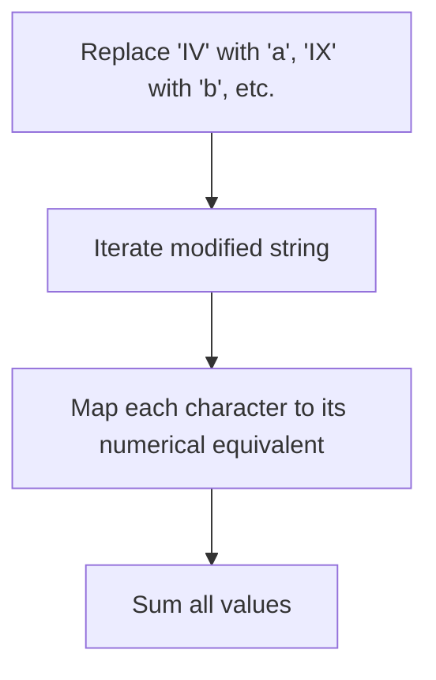
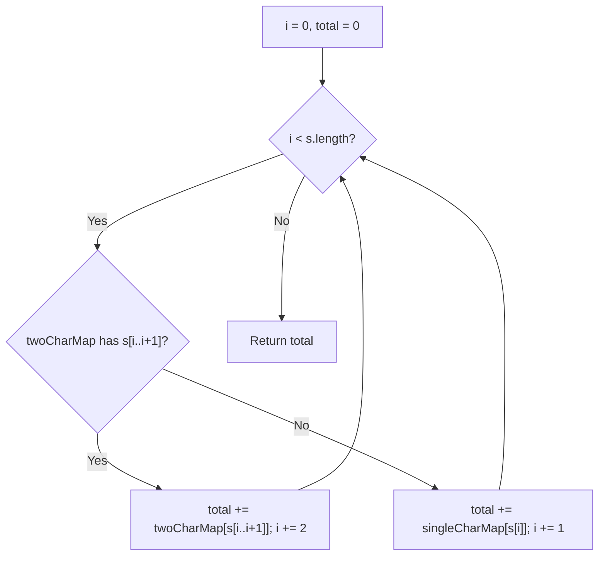
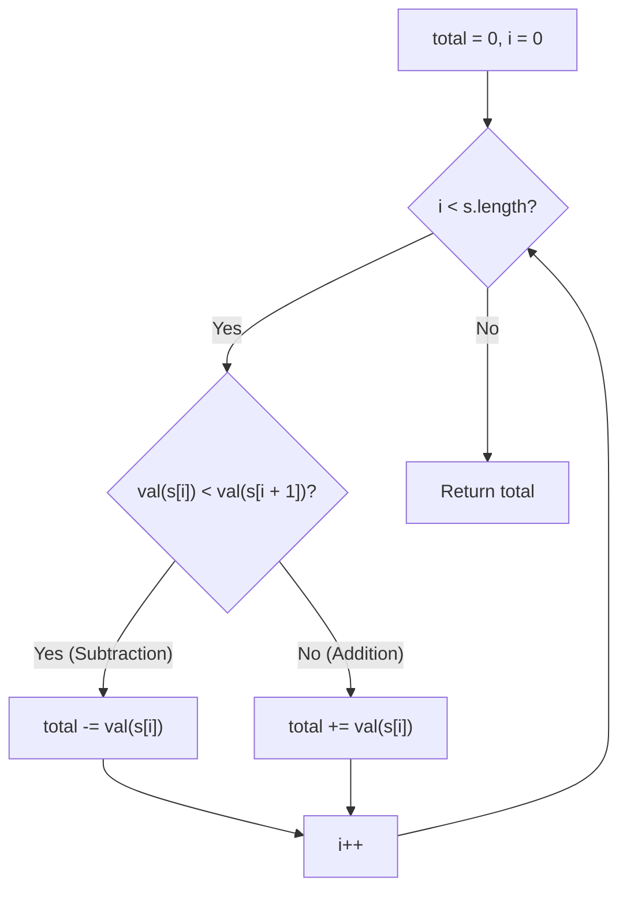
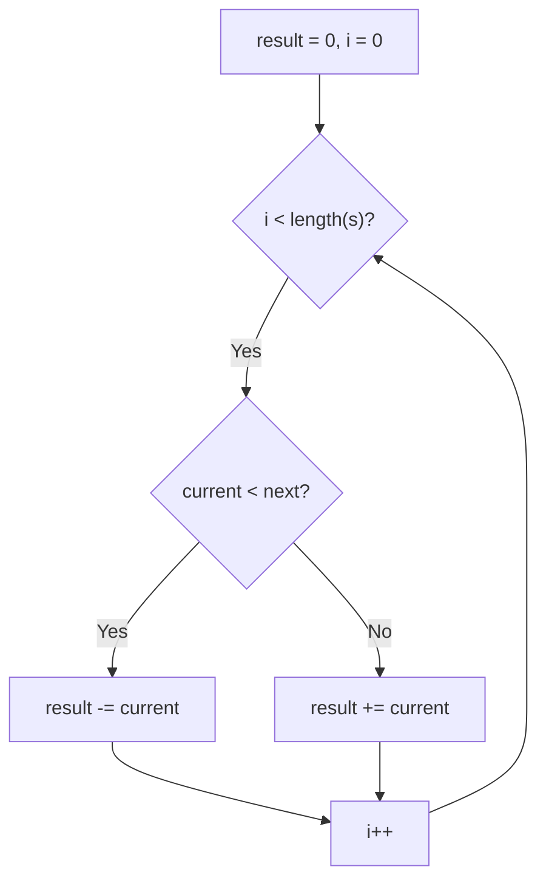

# 13. Roman to Integer

- **LeetCode Link**: `https://leetcode.com/problems/roman-to-integer/`
- **Difficulty**: Easy
- **Pattern Category**: Array / String / Hash Table / Math
- **Prerequisite Primer**: `00-foundations/01-two-pointers.md`

---

## 1. Problem Overview & Edge Case Matrix

### Problem Statement
Roman numerals are represented by seven different symbols: `I` (1), `V` (5), `X` (10), `L` (50), `C` (100), `D` (500), and `M` (1000).

Given a roman numeral `s`, convert it to an integer.

Roman numerals are usually written largest to smallest from left to right. However, the numeral for four is not `IIII`. Instead, the number four is written as `IV`. Because the one is before the five we subtract it making four. The same principle applies to the number nine, which is written as `IX`. There are six instances where subtraction is used:
- `I` before `V` (5) and `X` (10) makes 4 and 9.
- `X` before `L` (50) and `C` (100) makes 40 and 90.
- `C` before `D` (500) and `M` (1000) makes 400 and 900.

```
s = "MCMXCIV"
M = 1000, CM = 900, XC = 90, IV = 4
Total = 1000 + 900 + 90 + 4 = 1994
```

### Upfront Edge Case Matrix

| Edge Case Scenario | Inputs | Expected Output | Pitfall / Failure Mode |
| :--- | :--- | :--- | :--- |
| Single Character Numeral | `s = "V"` | `5` | Off-by-one error checking next character |
| Multiple Subtraction Pairs | `s = "CDXLIV"` | `444` | Skipping character indices erroneously |
| Maximum Allowed Roman Numeral | `s = "MMMCMXCIX"` | `3999` | Character loop overflow |
| Pure Additive Numeral | `s = "LVIII"` | `58` ($50+5+1+1+1$) | Unwanted subtractions |

---

## 2. Level 1: Brute Force Approach (Regex Substring Replacements)

### Intuition & Visual Idea
First replace all 6 two-character subtraction combinations (`IV`, `IX`, `XL`, `XC`, `CD`, `CM`) with special single-character aliases or evaluate them upfront, then sum the values of all remaining single characters.



### Pseudocode
```text
FUNCTION romanToIntBruteForce(s):
    s = REPLACE(s, "IV", "a") // 4
    s = REPLACE(s, "IX", "b") // 9
    s = REPLACE(s, "XL", "c") // 40
    s = REPLACE(s, "XC", "d") // 90
    s = REPLACE(s, "CD", "e") // 400
    s = REPLACE(s, "CM", "f") // 900
    
    total = 0
    FOR char IN s:
        total += valueMap[char]
    RETURN total
```

### Step-by-Step Dry Run
`s = "MCMXCIV"`

| Replacement Step | String State |
| :--- | :--- |
| Replace `IV` | `"MCMXC"` + `"a"` |
| Replace `XC` | `"MCM"` + `"d"` + `"a"` |
| Replace `CM` | `"M"` + `"f"` + `"d"` + `"a"` |
| Final Sum | $1000 (\text{M}) + 900 (\text{f}) + 90 (\text{d}) + 4 (\text{a}) = \mathbf{1994}$ |

### Modern JavaScript Implementation
```javascript
/**
 * Level 1: Brute Force (Regex Substring Simplification)
 * Time Complexity:  O(N)
 * Space Complexity: O(N) due to string copies
 */
function romanToIntBruteForce(s) {
  const map = {
    I: 1, V: 5, X: 10, L: 50, C: 100, D: 500, M: 1000,
    a: 4, b: 9, c: 40, d: 90, e: 400, f: 900
  };

  const simplified = s
    .replace(/IV/g, 'a')
    .replace(/IX/g, 'b')
    .replace(/XL/g, 'c')
    .replace(/XC/g, 'd')
    .replace(/CD/g, 'e')
    .replace(/CM/g, 'f');

  let total = 0;
  for (let i = 0; i < simplified.length; i++) {
    total += map[simplified[i]];
  }

  return total;
}
```

### Complexity Breakdown
- **Time Complexity**: $O(N)$ — Regex scans across string of length $N \le 15$.
- **Space Complexity**: $O(N)$ — Generates multiple temporary string allocations in V8.

#### 🎙️ How to Explain to Interviewer (Verbatim Script)
> *"This brute force approach simplifies the grammar by replacing 2-character subtraction instances with unique tokens before performing a linear sum. In JavaScript, because strings are immutable, each `.replace()` operation allocates a new string in memory. Since Roman numerals on LeetCode have $N \le 15$, this runs in $O(N)$ time and $O(N)$ space."*

---

## 3. Level 2: Optimized Approach (Two-Character Forward Lookahead)

### Intuition & Visual Bottleneck Elimination
Instead of mutating the string, we scan index by index. At index `i`, we inspect `s.substring(i, i + 2)`. If it exists in a special subtraction map, add that value and jump `i += 2`. Otherwise, add the value of `s[i]` and advance `i += 1`.



### Pseudocode
```text
FUNCTION romanToIntOptimized(s):
    doubleMap = {"IV":4, "IX":9, "XL":40, "XC":90, "CD":400, "CM":900}
    singleMap = {"I":1, "V":5, "X":10, "L":50, "C":100, "D":500, "M":1000}
    
    total = 0
    i = 0
    WHILE i < s.length:
        IF i < s.length - 1 AND doubleMap.has(s[i..i+1]):
            total += doubleMap[s[i..i+1]]
            i += 2
        ELSE:
            total += singleMap[s[i]]
            i += 1
    RETURN total
```

### Step-by-Step Dry Run
`s = "MCMXCIV"`

| `i` | 2-Char Slice | Match in `doubleMap`? | Value Added | `i` Next | Running Total |
| :--- | :--- | :--- | :--- | :--- | :--- |
| 0 | `"MC"` | No | $+1000$ (`M`) | $0 + 1 = 1$ | 1000 |
| 1 | `"CM"` | Yes | $+900$ (`CM`) | $1 + 2 = 3$ | 1900 |
| 3 | `"XC"` | Yes | $+90$ (`XC`) | $3 + 2 = 5$ | 1990 |
| 5 | `"IV"` | Yes | $+4$ (`IV`) | $5 + 2 = 7$ | **1994** |

### Modern JavaScript Implementation
```javascript
/**
 * Level 2: Lookahead Substring Mapping
 * Time Complexity:  O(N)
 * Space Complexity: O(1)
 */
function romanToIntOptimized(s) {
  const doubleMap = { IV: 4, IX: 9, XL: 40, XC: 90, CD: 400, CM: 900 };
  const singleMap = { I: 1, V: 5, X: 10, L: 50, C: 100, D: 500, M: 1000 };

  let total = 0;
  let i = 0;

  while (i < s.length) {
    if (i < s.length - 1) {
      const pair = s[i] + s[i + 1];
      if (doubleMap[pair] !== undefined) {
        total += doubleMap[pair];
        i += 2;
        continue;
      }
    }
    total += singleMap[s[i]];
    i += 1;
  }

  return total;
}
```

### Complexity Breakdown
- **Time Complexity**: $O(N)$ — Scans through the string advancing by 1 or 2 steps.
- **Space Complexity**: $O(1)$ — Lookup tables have constant size (13 symbols max).

#### 🎙️ How to Explain to Interviewer (Verbatim Script)
> *"For **Time Complexity**, this is $O(N)$ linear time where $N$ is the string length. At each position, we perform $O(1)$ dictionary lookups of 2-character and 1-character prefixes.
>
> For **Space Complexity**, it is strictly $O(1)$ auxiliary space because the hash maps contain a fixed set of Roman numeral symbols regardless of input length."*

---

## 4. Level 3: Most Optimal / Canonical Approach (Value Comparison Invariant)

### Intuition & Mathematical Invariant
Notice the fundamental Roman numeral rule:
- If a smaller numeral appears **before a larger numeral** ($\text{val}[i] < \text{val}[i + 1]$), it is **subtracted** (e.g. in `IV`, $1 < 5 \implies -1 + 5 = 4$).
- Otherwise ($\text{val}[i] \ge \text{val}[i + 1]$), it is **added** (e.g. in `VI`, $5 \ge 1 \implies +5 + 1 = 6$).

We only need a single 7-entry lookup and a single forward loop comparing `val[i] < val[i + 1]`!

```
s:       M    C    M    X    C    I    V
val:   1000  100  1000  10  100   1    5
Comp:   >=    <    >=   <    >=   <   (last)
Sign:   +    -    +    -    +    -     +
Sum:  +1000 -100 +1000 -10 +100  -1   +5 = 1994!
```



### Pseudocode
```text
FUNCTION romanToInt(s):
    map = {'I':1, 'V':5, 'X':10, 'L':50, 'C':100, 'D':500, 'M':1000}
    total = 0
    FOR i FROM 0 TO s.length - 1:
        currVal = map[s[i]]
        nextVal = map[s[i + 1]] || 0
        IF currVal < nextVal:
            total -= currVal
        ELSE:
            total += currVal
    RETURN total
```

### Step-by-Step Dry Run
`s = "MCMXCIV"`

| `i` | `s[i]` | `currVal` | `s[i+1]` | `nextVal` | Condition (`curr < next`) | Operation | `total` After |
| :--- | :--- | :--- | :--- | :--- | :--- | :--- | :--- |
| 0 | `M` | 1000 | `C` | 100 | False | $+1000$ | 1000 |
| 1 | `C` | 100 | `M` | 1000 | **True** | $-100$ | 900 |
| 2 | `M` | 1000 | `X` | 10 | False | $+1000$ | 1900 |
| 3 | `X` | 10 | `C` | 100 | **True** | $-10$ | 1890 |
| 4 | `C` | 100 | `I` | 1 | False | $+100$ | 1990 |
| 5 | `I` | 1 | `V` | 5 | **True** | $-1$ | 1989 |
| 6 | `V` | 5 | End | 0 | False | $+5$ | **1994** |

### Modern JavaScript Implementation
```javascript
/**
 * Level 3: Sign Comparison Invariant (Canonical Optimal)
 * Time Complexity:  O(N)
 * Space Complexity: O(1) Auxiliary Space
 */
function romanToInt(s) {
  const map = {
    I: 1,
    V: 5,
    X: 10,
    L: 50,
    C: 100,
    D: 500,
    M: 1000
  };

  let total = 0;
  const len = s.length;

  for (let i = 0; i < len; i++) {
    const current = map[s[i]];
    const next = map[s[i + 1]];

    if (next && current < next) {
      total -= current;
    } else {
      total += current;
    }
  }

  return total;
}
```

### Complexity Breakdown
- **Time Complexity**: $O(N)$ — Exactly $N$ iterations with $O(1)$ lookups. Since Roman numerals are $\le 3999$, $N \le 15$, making it virtually $O(1)$ in practice.
- **Space Complexity**: $O(1)$ auxiliary space — Fixed-size 7-key object.

#### 🎙️ How to Explain to Interviewer (Verbatim Script)
> *"For **Time Complexity**, this runs in $O(N)$ where $N$ is the number of characters in the Roman numeral string. We evaluate each character exactly once, comparing its numerical value to its immediate successor. If the current value is less than the next value, we subtract it; otherwise, we add it. Because valid Roman numerals in standard notation never exceed 15 characters, execution takes a constant number of CPU cycles.
>
> For **Space Complexity**, it is strictly $O(1)$ auxiliary memory. The lookup map has a fixed size of 7 key-value pairs allocated once."*

---

## 5. JavaScript-Specific Gotchas & V8 Optimizations
- **Fast Lookup**: Using a plain JS object `{ I: 1, ... }` placed outside the function in module scope avoids reallocating the object on every function call.

---

## 6. Real-World MAANG Interview Follow-Ups & Extensions

### Follow-Up 1: Validating Legal Roman Numeral Syntax
- **Scenario**: Validate that the input string is a strictly valid Roman numeral (e.g., `IL` or `IC` are invalid Roman numerals).
- **Solution Strategy**: Use a strict regex grammar validator:
```javascript
function isValidRomanNumeral(s) {
  const regex = /^M{0,3}(CM|CD|D?C{0,3})(XC|XL|L?X{0,3})(IX|IV|V?I{0,3})$/;
  return regex.test(s);
}
```

### Follow-Up 2: Integer to Roman Conversion (LeetCode 12)
- **Scenario**: Convert an integer $1 \le \text{num} \le 3999$ back into a Roman numeral.
- **Solution Strategy**: Greedy subtraction using descending value-symbol pairs.

---

## 7. What LeetCode Discuss Says (Language-Independent)

Source: top-voted post by lexitron —
`https://leetcode.com/problems/roman-to-integer/solutions/6333315/beats-100cjavapy3js-easy-n-clean-explana-l3c8/`
— 127.4K views / 475 votes / 24 comments.
Language-independent summary. No new JS here.

### A. Optimal way from Discuss (Forward Traversal)

Map Roman numerals to values. Traverse the string left to right. If a smaller numeral comes before a larger one, subtract it. Otherwise, add it.

```text
FUNCTION romanToInt(s):
    result = 0
    map = { I: 1, V: 5, X: 10, L: 50, C: 100, D: 500, M: 1000 }
    
    FOR i = 0 TO length(s) - 1:
        current = map[s[i]]
        IF i < length(s) - 1 AND current < map[s[i+1]]:
            result = result - current
        ELSE:
            result = result + current
            
    RETURN result
```

- Time: O(N)
- Space: O(1)



### B. Dry run on LeetCode Example 3 (MCMXCIV)

| Step | `i` | `s[i]` | `current` | `next` | Action | `result` |
| :--- | :--- | :--- | :--- | :--- | :--- | :--- |
| 1 | 0 | M | 1000 | 100 | current >= next, Add | 1000 |
| 2 | 1 | C | 100 | 1000 | current < next, Subtract | 900 |
| 3 | 2 | M | 1000 | 10 | current >= next, Add | 1900 |
| 4 | 3 | X | 10 | 100 | current < next, Subtract | 1890 |
| 5 | 4 | C | 100 | 1 | current >= next, Add | 1990 |
| 6 | 5 | I | 1 | 5 | current < next, Subtract | 1989 |
| 7 | 6 | V | 5 | (none) | next is out of bounds, Add | 1994 |

### C. Alternative approach from comments (Backward Traversal)

Traversing backwards avoids the out-of-bounds `i+1` check. You just keep track of the previously seen value.

```text
FUNCTION romanToIntBackward(s):
    result = 0
    prev = 0
    FOR i = length(s) - 1 DOWN TO 0:
        current = map[s[i]]
        IF current < prev:
            result = result - current
        ELSE:
            result = result + current
        prev = current
        
    RETURN result
```

### D. Pitfalls from comments

- **Out of bounds check:** When doing forward traversal, forgetting to check `i < length(s) - 1` before accessing `s[i+1]` can lead to errors.
- **Switch statements:** In languages like C++ or Java, using a `switch` statement or a dedicated helper function instead of a Hash Map / Dictionary is much faster and avoids hashing overhead.
- **Hardcoding pairs:** Some solutions attempt to hardcode specific pair replacements (e.g., replace `IV` with `IIII`), which is slower due to multiple string passes and memory allocations.

### E. Companies

- Discuss post itself names none.
  Companies tab on LeetCode is premium-locked.
- External source:
  `https://github.com/liquidslr/leetcode-company-wise-problems`
  (LeetCode company tags, updated June 2025).
- All-time (36): Accenture, Adobe, Amazon, AMD, Apple, Bloomberg, Booking.com, Capgemini, Cashfree, Cognizant, Deloitte, DeltaX, DoorDash, EPAM Systems, Expedia, Goldman Sachs, Google, IBM, Infosys, Meta, Microsoft, Oracle, PwC, Salesforce, Snowflake, TCS, TikTok, Tinkoff, Uber, Virtusa, Walmart Labs, Warnermedia, Wix, Yahoo, Yandex, Zoho.
- Recent: 30 days — Amazon, Google, Meta, TCS.
- Recent: 3 months — Amazon, Bloomberg, Google, Meta, Microsoft, TCS.
