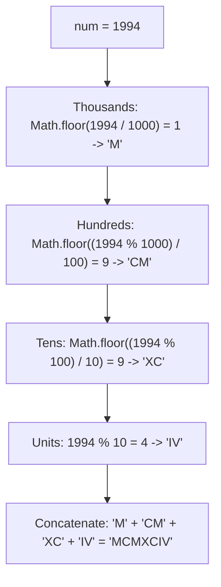
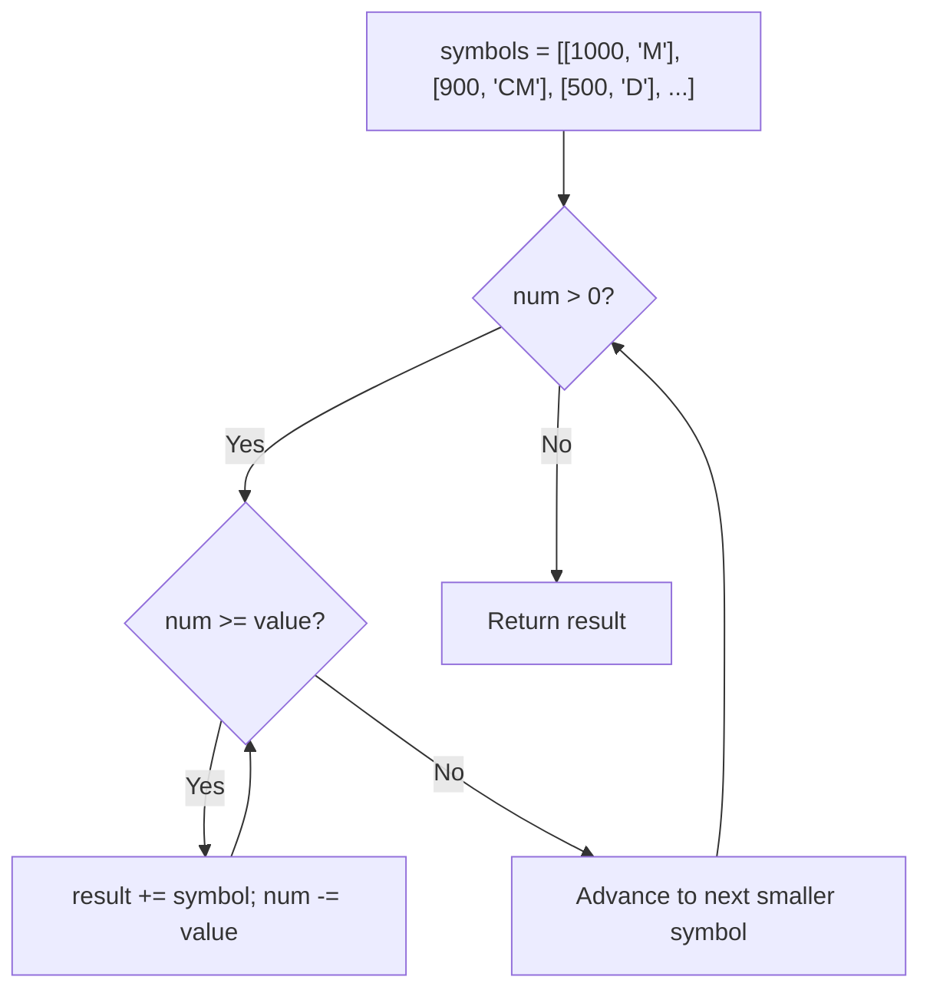
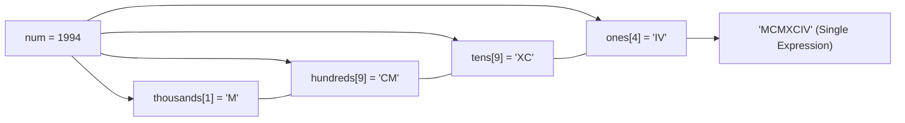
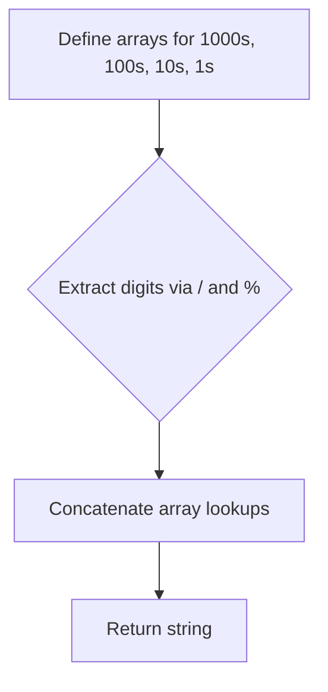

# 12. Integer to Roman

- **LeetCode Link**: `https://leetcode.com/problems/integer-to-roman/`
- **Difficulty**: Medium
- **Pattern Category**: Array / String / Greedy / Math
- **Prerequisite Primer**: `00-foundations/01-two-pointers.md`

---

## 1. Problem Overview & Edge Case Matrix

### Problem Statement
Given an integer `num` in the range $[1, 3999]$, convert it to a Roman numeral.

Seven different symbols represent Roman numerals with the following values:
- `I` = 1, `V` = 5, `X` = 10, `L` = 50, `C` = 100, `D` = 500, `M` = 1000
- Subtractive forms: `IV` = 4, `IX` = 9, `XL` = 40, `XC` = 90, `CD` = 400, `CM` = 900

```
num = 1994
1000 = M
 900 = CM
  90 = XC
   4 = IV
Output: "MCMXCIV"
```

### Upfront Edge Case Matrix

| Edge Case Scenario | Inputs | Expected Output | Pitfall / Failure Mode |
| :--- | :--- | :--- | :--- |
| Minimum Allowed Number ($1$) | `num = 1` | `"I"` | Division / modulo by larger bases |
| Maximum Allowed Number ($3999$) | `num = 3999` | `"MMMCMXCIX"` | Array lookup overflow |
| Pure Multiples of Ten / Hundred | `num = 400` | `"CD"` | Trailing empty strings |
| Repeated Symbols ($3, 30, 300, 3000$) | `num = 3888` | `"MMMDCCCLXXXVIII"` | Maximum length Roman numeral (15 chars) |

---

## 2. Level 1: Brute Force Approach (Digit-by-Digit Place Value Decomposition)

### Intuition & Visual Idea
Decompose `num` into thousands, hundreds, tens, and units places using integer division and modulo. Use `switch`/`if` blocks to translate each place value independently into Roman symbols.



### Pseudocode
```text
FUNCTION intToRomanBruteForce(num):
    th = FLOOR(num / 1000)
    hd = FLOOR((num % 1000) / 100)
    tn = FLOOR((num % 100) / 10)
    un = num % 10

    res = ""
    res += REPEAT("M", th)
    res += convertHundreds(hd)
    res += convertTens(tn)
    res += convertUnits(un)
    RETURN res
```

### Step-by-Step Dry Run
`num = 1994`

| Place Value | Digit | Conversion Logic | Roman Substring |
| :--- | :--- | :--- | :--- |
| Thousands ($1000$) | 1 | $1 \times \text{'M'}$ | `"M"` |
| Hundreds ($100$) | 9 | $9 \implies \text{'CM'}$ | `"CM"` |
| Tens ($10$) | 9 | $9 \implies \text{'XC'}$ | `"XC"` |
| Units ($1$) | 4 | $4 \implies \text{'IV'}$ | `"IV"` |
| Result | - | Concatenate parts | `"MCMXCIV"` |

### Modern JavaScript Implementation
```javascript
/**
 * Level 1: Digit Decomposition Switch
 * Time Complexity:  O(1)
 * Space Complexity: O(1)
 */
function intToRomanBruteForce(num) {
  let result = '';

  // Thousands
  const thousands = Math.floor(num / 1000);
  result += 'M'.repeat(thousands);
  num %= 1000;

  // Hundreds
  const hundreds = Math.floor(num / 100);
  if (hundreds === 9) result += 'CM';
  else if (hundreds >= 5) result += 'D' + 'C'.repeat(hundreds - 5);
  else if (hundreds === 4) result += 'CD';
  else result += 'C'.repeat(hundreds);
  num %= 100;

  // Tens
  const tens = Math.floor(num / 10);
  if (tens === 9) result += 'XC';
  else if (tens >= 5) result += 'L' + 'X'.repeat(tens - 5);
  else if (tens === 4) result += 'XL';
  else result += 'X'.repeat(tens);
  num %= 10;

  // Units
  if (num === 9) result += 'IX';
  else if (num >= 5) result += 'V' + 'I'.repeat(num - 5);
  else if (num === 4) result += 'IV';
  else result += 'I'.repeat(num);

  return result;
}
```

### Complexity Breakdown
- **Time Complexity**: $O(1)$ — Maximum 4 digits processed.
- **Space Complexity**: $O(1)$ — String accumulator.

#### 🎙️ How to Explain to Interviewer (Verbatim Script)
> *"This brute force approach manually isolates each base-10 digit using division and modulo, mapping each position (thousands, hundreds, tens, units) to its Roman representation via conditional branch logic. Because $num \le 3999$, the number of operations is strictly constant $O(1)$."*

---

## 3. Level 2: Optimized Approach (Greedy Descending Subtraction)

### Intuition & Visual Bottleneck Elimination
Represent all 13 possible Roman symbols and combinations in descending numerical order.
Repeatedly subtract the largest possible symbol value from `num` until `num` drops below that symbol value, then advance to the next symbol.



### Pseudocode
```text
FUNCTION intToRomanGreedy(num):
    values  = [1000, 900, 500, 400, 100, 90, 50, 40, 10, 9, 5, 4, 1]
    symbols = ["M", "CM", "D", "CD", "C", "XC", "L", "XL", "X", "IX", "V", "IV", "I"]
    
    result = []
    FOR i FROM 0 TO values.length - 1:
        WHILE num >= values[i]:
            result.push(symbols[i])
            num -= values[i]
    RETURN result.join("")
```

### Step-by-Step Dry Run
`num = 1994`

| Step | `values[i]` | `symbols[i]` | Condition `num >= value` | `num` After | `result` Accumulator |
| :--- | :--- | :--- | :--- | :--- | :--- |
| 1 | 1000 | `M` | $1994 \ge 1000$ (True) | 994 | `["M"]` |
| 2 | 900 | `CM` | $994 \ge 900$ (True) | 94 | `["M", "CM"]` |
| 3 | 500..100 | `D..C` | False | 94 | Unchanged |
| 4 | 90 | `XC` | $94 \ge 90$ (True) | 4 | `["M", "CM", "XC"]` |
| 5 | 50..5 | `L..V` | False | 4 | Unchanged |
| 6 | 4 | `IV` | $4 \ge 4$ (True) | 0 | `["M", "CM", "XC", "IV"]` |

### Modern JavaScript Implementation
```javascript
/**
 * Level 2: Greedy Value-Symbol Table (Clean & Idiomatic)
 * Time Complexity:  O(1)
 * Space Complexity: O(1) Auxiliary Space
 */
function intToRomanGreedy(num) {
  const valToSymbol = [
    [1000, 'M'],
    [900, 'CM'],
    [500, 'D'],
    [400, 'CD'],
    [100, 'C'],
    [90, 'XC'],
    [50, 'L'],
    [40, 'XL'],
    [10, 'X'],
    [9, 'IX'],
    [5, 'V'],
    [4, 'IV'],
    [1, 'I']
  ];

  const result = [];

  for (let i = 0; i < valToSymbol.length && num > 0; i++) {
    const [val, symbol] = valToSymbol[i];
    while (num >= val) {
      result.push(symbol);
      num -= val;
    }
  }

  return result.join('');
}
```

### Complexity Breakdown
- **Time Complexity**: $O(1)$ — The outer loop runs 13 times, inner loop executes at most 15 times total.
- **Space Complexity**: $O(1)$ — Fixed 13-entry mapping table.

#### 🎙️ How to Explain to Interviewer (Verbatim Script)
> *"For **Time Complexity**, this is $O(1)$ constant time. We iterate through a fixed lookup table of 13 primary and subtractive Roman values. In each step, we greedily extract the largest fitting Roman symbol. Since the maximum allowed number is 3999 (`MMMDCCCLXXXVIII`), the while loop executes at most 15 times in the absolute worst case.
>
> For **Space Complexity**, it is $O(1)$ auxiliary memory since the symbol dictionary is statically sized."*

---

## 4. Level 3: Most Optimal / Canonical Approach (Direct 4-Array Place Value Lookups)

### Intuition & Mathematical Invariant
Because Roman numerals map cleanly to base-10 digits, we can predefine 4 small arrays for thousands, hundreds, tens, and units:

```
thousands = ["", "M", "MM", "MMM"]
hundreds  = ["", "C", "CC", "CCC", "CD", "D", "DC", "DCC", "DCCC", "CM"]
tens      = ["", "X", "XX", "XXX", "XL", "L", "LX", "LXX", "LXXX", "XC"]
ones      = ["", "I", "II", "III", "IV", "V", "VI", "VII", "VIII", "IX"]
```
The result is computed in a single line:
$$\text{thousands}[\lfloor N / 1000 \rfloor] + \text{hundreds}[\lfloor (N \% 1000) / 100 \rfloor] + \text{tens}[\lfloor (N \% 100) / 10 \rfloor] + \text{ones}[N \% 10]$$



### Pseudocode
```text
FUNCTION intToRoman(num):
    M = ["", "M", "MM", "MMM"]
    C = ["", "C", "CC", "CCC", "CD", "D", "DC", "DCC", "DCCC", "CM"]
    X = ["", "X", "XX", "XXX", "XL", "L", "LX", "LXX", "LXXX", "XC"]
    I = ["", "I", "II", "III", "IV", "V", "VI", "VII", "VIII", "IX"]
    
    RETURN M[FLOOR(num / 1000)] +
           C[FLOOR((num % 1000) / 100)] +
           X[FLOOR((num % 100) / 10)] +
           I[num % 10]
```

### Step-by-Step Dry Run
`num = 1994`

| Component | Calculation | Array Index | Lookup Result |
| :--- | :--- | :--- | :--- |
| `M` | `Math.floor(1994 / 1000)` | 1 | `"M"` |
| `C` | `Math.floor((1994 % 1000) / 100)` | 9 | `"CM"` |
| `X` | `Math.floor((1994 % 100) / 10)` | 9 | `"XC"` |
| `I` | `1994 % 10` | 4 | `"IV"` |
| **Combined** | Concatenation | - | `"MCMXCIV"` |

### Modern JavaScript Implementation
```javascript
/**
 * Level 3: Direct Static Digit Lookup (Canonical Optimal)
 * Time Complexity:  O(1)
 * Space Complexity: O(1) Auxiliary Space
 */
const M = ['', 'M', 'MM', 'MMM'];
const C = ['', 'C', 'CC', 'CCC', 'CD', 'D', 'DC', 'DCC', 'DCCC', 'CM'];
const X = ['', 'X', 'XX', 'XXX', 'XL', 'L', 'LX', 'LXX', 'LXXX', 'XC'];
const I = ['', 'I', 'II', 'III', 'IV', 'V', 'VI', 'VII', 'VIII', 'IX'];

function intToRoman(num) {
  return (
    M[Math.floor(num / 1000)] +
    C[Math.floor((num % 1000) / 100)] +
    X[Math.floor((num % 100) / 10)] +
    I[num % 10]
  );
}
```

### Complexity Breakdown
- **Time Complexity**: $O(1)$ — Exactly 4 array lookups and 3 string concatenations.
- **Space Complexity**: $O(1)$ auxiliary space — 4 static arrays of total size 34 strings.

#### 🎙️ How to Explain to Interviewer (Verbatim Script)
> *"For **Time Complexity**, this is pure $O(1)$ execution. By mapping the base-10 digit positions directly to precomputed Roman string literals, we avoid all loops and conditionals entirely. We perform exactly 4 index lookups and a single string concatenation.
>
> For **Space Complexity**, it is strictly $O(1)$ auxiliary memory. The 4 arrays store a total of 34 constant string references in static memory."*

---

## 5. JavaScript-Specific Gotchas & V8 Optimizations
- **Module-Level Constants**: Defining `M, C, X, I` outside the function prevents reallocating the arrays on every invocation, achieving zero garbage collection overhead.

---

## 6. Real-World MAANG Interview Follow-Ups & Extensions

### Follow-Up 1: Arbitrary Base Number to Roman Conversion
- **Scenario**: What if the input number exceeds 3999 (e.g. up to $10^6$), using the historical vinculum notation (overline $\overline{V} = 5000, \overline{X} = 10000$)?
- **Solution Strategy**: Extend the Greedy table in Level 2 with overline symbol tiers.

### Follow-Up 2: Excel Sheet Column Title Conversion (LeetCode 168)
- **Scenario**: Convert a number to Excel 1-indexed Base-26 alphanumeric titles (`1 -> A`, `28 -> AB`).
- **Solution Strategy**: Base-26 conversion with 1-based offset subtraction (`(num - 1) % 26`).

---

## 7. What LeetCode Discuss Says (Language-Independent)

Source: top-voted post by Aditya Bhate —
`https://leetcode.com/problems/integer-to-roman/solutions/2849929/easiest-o1-faang-method-ever/`
— 177.7K views / 807 votes / 79 comments.
Language-independent summary. No new JS here.

### A. Optimal way from Discuss (Greedy Subtraction / Array Mapping)

Hardcode arrays for each decimal place (thousands, hundreds, tens, ones). Then use modulo and division to pick the exact Roman numeral string for each digit. Since the maximum number is 3999, the arrays are small and fixed.

```text
FUNCTION intToRoman(num):
    thousands = ["", "M", "MM", "MMM"]
    hundreds = ["", "C", "CC", "CCC", "CD", "D", "DC", "DCC", "DCCC", "CM"]
    tens = ["", "X", "XX", "XXX", "XL", "L", "LX", "LXX", "LXXX", "XC"]
    ones = ["", "I", "II", "III", "IV", "V", "VI", "VII", "VIII", "IX"]
    
    RETURN thousands[num / 1000] 
           + hundreds[(num % 1000) / 100] 
           + tens[(num % 100) / 10] 
           + ones[num % 10]
```

- Time: O(1)
- Space: O(1)



### B. Dry run on LeetCode Example 3 (1994)

| Step | Place | Calculation | Array | Index | String |
| :--- | :--- | :--- | :--- | :--- | :--- |
| 1 | Thousands | 1994 / 1000 | thousands | 1 | "M" |
| 2 | Hundreds | (1994 % 1000) / 100 = 994 / 100 | hundreds | 9 | "CM" |
| 3 | Tens | (1994 % 100) / 10 = 94 / 10 | tens | 9 | "XC" |
| 4 | Ones | 1994 % 10 = 4 | ones | 4 | "IV" |

Final string: "M" + "CM" + "XC" + "IV" = "MCMXCIV"

### C. Pitfalls from comments

- **Time Complexity Debate:** Some comments argue over whether this is $O(1)$ or $O(N)$. Because the problem limits input to 3999, the number of operations is strictly bounded and constant, making it $O(1)$.
- **Alternative (Loop):** You can also use a greedy loop with pairs `[1000, "M"], [900, "CM"]...` where you subtract the largest possible value until `num == 0`. The array lookup (shown above) avoids the loop entirely and is up to 3x faster in environments like Java/C++.

### D. Companies

- Discuss post itself names none.
  Companies tab on LeetCode is premium-locked.
- External source:
  `https://github.com/liquidslr/leetcode-company-wise-problems`
  (LeetCode company tags, updated June 2025).
- All-time (30): Adobe, Agoda, Amazon, AMD, BlackRock, Bloomberg, Booking.com, Docusign, DoorDash, Geico, Goldman Sachs, Google, IBM, Infosys, LinkedIn, Meta, Microsoft, Oracle, Palo Alto Networks, Salesforce, Swiggy, TCS, TikTok, UiPath, Verkada, Walmart Labs, Warnermedia, Wix, X, Zoho.
- Recent: 30 days — Google, Meta.
- Recent: 3 months — Amazon, Bloomberg, Google, IBM, Meta, Microsoft, TCS.
