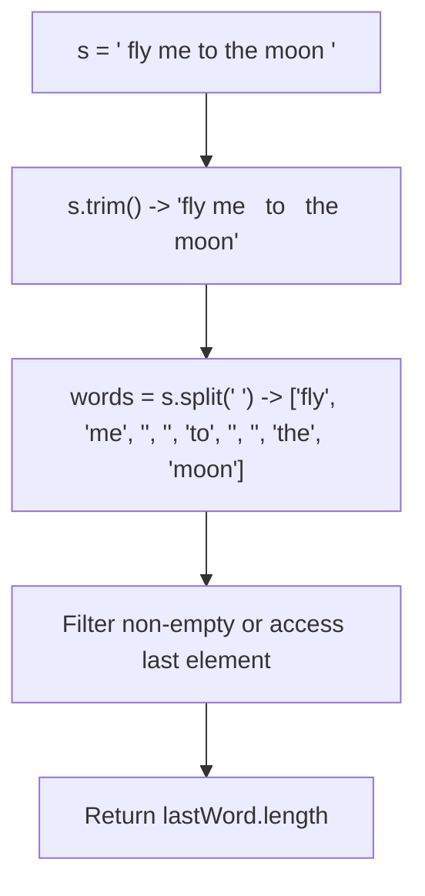
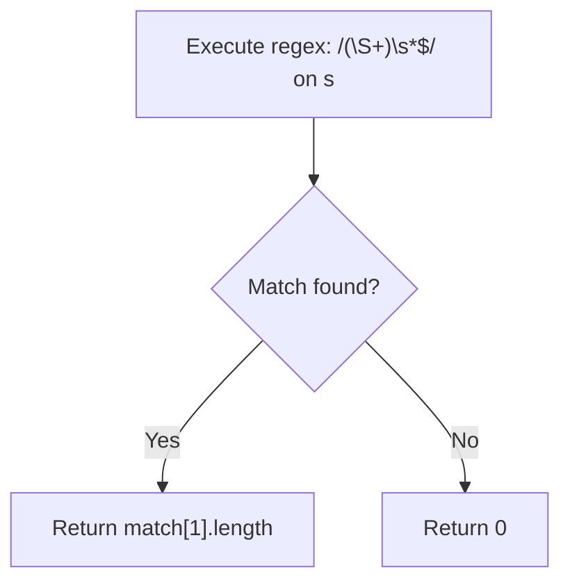
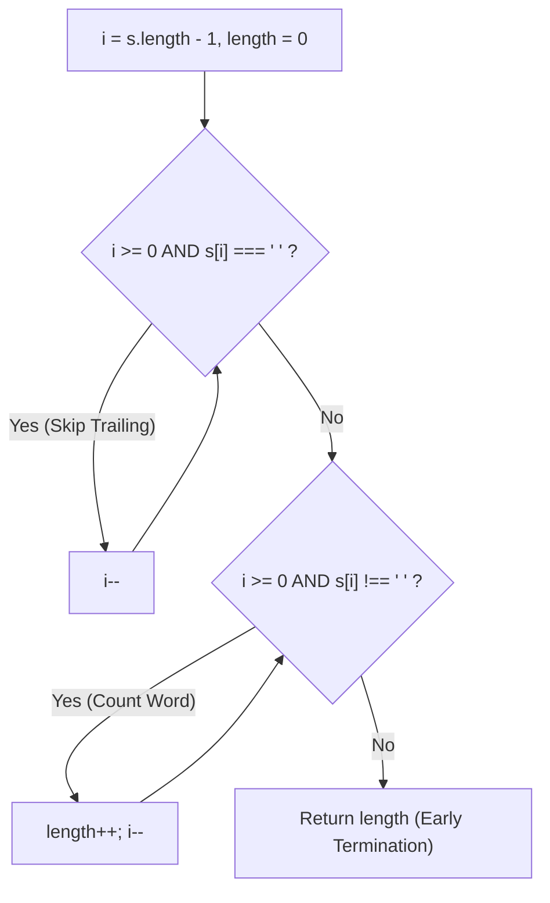
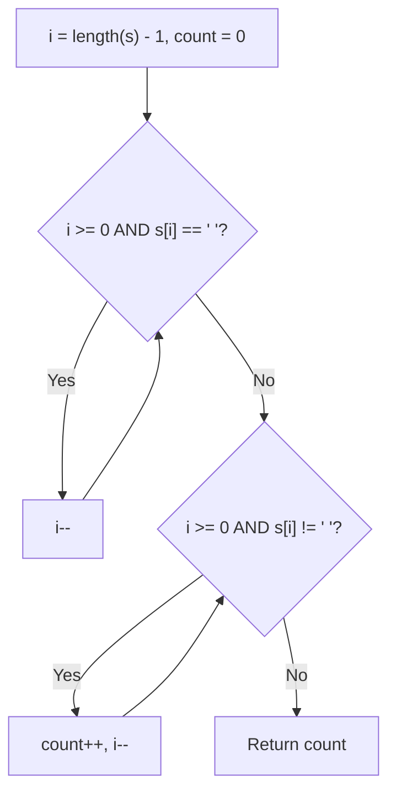

# 58. Length of Last Word

- **LeetCode Link**: `https://leetcode.com/problems/length-of-last-word/`
- **Difficulty**: Easy
- **Pattern Category**: Array / String / Two Pointers
- **Prerequisite Primer**: `00-foundations/01-two-pointers.md`

---

## 1. Problem Overview & Edge Case Matrix

### Problem Statement
Given a string `s` consisting of words and spaces, return the length of the **last word** in the string.
A word is a maximal substring consisting of non-space characters only.

```
s = "Hello World"
Last word is "World" -> Length = 5

s = "   fly me   to   the moon  "
Last word is "moon" -> Length = 4
```

### Upfront Edge Case Matrix

| Edge Case Scenario | Inputs | Expected Output | Pitfall / Failure Mode |
| :--- | :--- | :--- | :--- |
| Trailing Whitespace | `s = "a "` | `1` | Inspecting last character directly without trimming |
| Multiple Spaces Between Words | `s = "a   b"` | `1` | Incorrect token splitting |
| Single Word (No Spaces) | `s = "hello"` | `5` | Loop underflow index bound |
| Single Character Word | `s = "a"` | `1` | Fence-post loop error |

---

## 2. Level 1: Brute Force Approach (Built-in Trim & Split)

### Intuition & Visual Idea
Use JavaScript's built-in `trim()` to eliminate leading and trailing whitespace, split by spaces, and take the length of the last element in the resulting array.



### Pseudocode
```text
FUNCTION lengthOfLastWordBruteForce(s):
    words = s.trim().split(/\s+/)
    RETURN words[words.length - 1].length
```

### Step-by-Step Dry Run
`s = "   fly me to the moon  "`

| Step | Operation | Intermediate State |
| :--- | :--- | :--- |
| 1 | `s.trim()` | `"fly me to the moon"` |
| 2 | `s.split(/\s+/)` | `["fly", "me", "to", "the", "moon"]` |
| 3 | Access Last | `"moon"` |
| 4 | Return Length | `4` |

### Modern JavaScript Implementation
```javascript
/**
 * Level 1: String Trim and Regex Split
 * Time Complexity:  O(N)
 * Space Complexity: O(N) Auxiliary Memory
 */
function lengthOfLastWordBruteForce(s) {
  const words = s.trim().split(/\s+/);
  return words[words.length - 1].length;
}
```

### Complexity Breakdown
- **Time Complexity**: $O(N)$ — `.trim()` scans the string, `.split()` allocates tokens for all words.
- **Space Complexity**: $O(N)$ — Creates an array of word string copies in the V8 heap.

#### 🎙️ How to Explain to Interviewer (Verbatim Script)
> *"This brute force approach uses standard library string utilities. While concise, `.trim().split(/\s+/)` processes the entire string from left to right and allocates an array containing every word in heap memory. For large strings, this consumes $O(N)$ auxiliary space and incurs garbage collection overhead."*

---

## 3. Level 2: Optimized Approach (Regex Terminal Lookbehind)

### Intuition & Visual Bottleneck Elimination
Instead of creating an array of all words, we can use a single regex matching the last contiguous block of non-space characters followed by optional trailing spaces `/\b(\w+)\s*$/`.



### Pseudocode
```text
FUNCTION lengthOfLastWordRegex(s):
    match = s.match(/(\S+)\s*$/)
    RETURN match ? match[1].length : 0
```

### Step-by-Step Dry Run
`s = "   fly me   to   the moon  "`

| Regex Step | Matched Group | Length |
| :--- | :--- | :--- |
| Scan from end | `moon  ` matches `(\S+)\s*$` | Captured Group 1 = `"moon"` |
| Length | `"moon".length` | `4` |

### Modern JavaScript Implementation
```javascript
/**
 * Level 2: Regex Terminal Match
 * Time Complexity:  O(N)
 * Space Complexity: O(1) auxiliary (excluding match tuple)
 */
function lengthOfLastWordRegex(s) {
  const match = s.match(/(\S+)\s*$/);
  return match ? match[1].length : 0;
}
```

### Complexity Breakdown
- **Time Complexity**: $O(N)$ — Regex engine scans the string.
- **Space Complexity**: $O(1)$ auxiliary space.

#### 🎙️ How to Explain to Interviewer (Verbatim Script)
> *"For **Time Complexity**, regex evaluation runs in $O(N)$ time.
> For **Space Complexity**, it takes $O(1)$ auxiliary memory since we only capture the final word match."*

---

## 4. Level 3: Most Optimal / Canonical Approach (Two-Phase Backward Pointer Scan)

### Intuition & Invariant Proof
We don't need to read the entire string from the beginning!
1. Start a pointer `i = s.length - 1` at the very end.
2. **Phase 1 (Skip trailing spaces)**: Decrement `i` while `s[i] === ' '`.
3. **Phase 2 (Count word characters)**: Decrement `i` and increment `length` while `i >= 0 && s[i] !== ' '`.
4. Return `length`.

```
s = "   the moon   "
                  ^ i starts here
Phase 1 (Skip spaces): i moves backwards to 'n': "   the moon   "
                                                            ^
Phase 2 (Count chars): count 'n', 'o', 'o', 'm' -> length = 4, stops at space!
```



### Pseudocode
```text
FUNCTION lengthOfLastWord(s):
    i = s.length - 1
    length = 0
    
    // Skip trailing spaces
    WHILE i >= 0 AND s[i] == ' ':
        i--

    // Count characters of the last word
    WHILE i >= 0 AND s[i] != ' ':
        length++
        i--

    RETURN length
```

### Step-by-Step Dry Run
`s = "moon  "`

| Step | `i` | `s[i]` | Phase | Action | `length` |
| :--- | :--- | :--- | :--- | :--- | :--- |
| 1 | 5 | `' '` | Phase 1 | `i--` (Skip space) | 0 |
| 2 | 4 | `' '` | Phase 1 | `i--` (Skip space) | 0 |
| 3 | 3 | `'n'` | Phase 2 | `length++`, `i--` | 1 |
| 4 | 2 | `'o'` | Phase 2 | `length++`, `i--` | 2 |
| 5 | 1 | `'o'` | Phase 2 | `length++`, `i--` | 3 |
| 6 | 0 | `'m'` | Phase 2 | `length++`, `i--` | 4 |
| 7 | -1 | End | Phase 2 | Terminate | **4** |

### Modern JavaScript Implementation
```javascript
/**
 * Level 3: Backward Pointer Scan (Canonical Optimal)
 * Time Complexity:  O(N) worst-case, O(K) average where K is last word length
 * Space Complexity: O(1) Auxiliary Space
 */
function lengthOfLastWord(s) {
  let i = s.length - 1;
  let length = 0;

  // 1. Skip trailing spaces
  while (i >= 0 && s[i] === ' ') {
    i--;
  }

  // 2. Count non-space characters of the last word
  while (i >= 0 && s[i] !== ' ') {
    length++;
    i--;
  }

  return length;
}
```

### Complexity Breakdown
- **Time Complexity**: $O(N)$ worst case (e.g. string with only spaces or a single word at index 0). In practice, it runs in **$O(K)$ time** where $K$ is the length of the trailing spaces plus the last word, terminating immediately without scanning the rest of the string.
- **Space Complexity**: $O(1)$ auxiliary space — Only two integer variables `i` and `length`.

#### 🎙️ How to Explain to Interviewer (Verbatim Script)
> *"For **Time Complexity**, this is $O(N)$ in the worst case, but average-case runtime is $O(K)$ where $K$ is the length of the last word plus trailing spaces. By scanning backwards from the end of the string, we terminate the moment we hit the first space preceding the final word, avoiding scanning the remaining $N - K$ characters.
>
> For **Space Complexity**, it is strictly $O(1)$ auxiliary memory. We allocate no arrays or substring copies, using only two primitive pointers."*

---

## 5. JavaScript-Specific Gotchas & V8 Optimizations
- **Direct Character Indexing**: `s[i]` in V8 is an $O(1)$ character code lookup without string slicing overhead.

---

## 6. Real-World MAANG Interview Follow-Ups & Extensions

### Follow-Up 1: Streaming Word Length Parser (Chunked Buffers)
- **Scenario**: What if the string is streamed in chunks of $64\text{KB}$?
- **Solution Strategy**: Maintain state across chunks: `currentWordLen` and `trailingSpaces`.

### Follow-Up 2: Length of First Word vs Last Word
- **Scenario**: Return both `{ firstWordLen, lastWordLen }` in a single pass.
- **Solution**: Scan forward from start for `firstWordLen`, and backward from end for `lastWordLen`.

---

## 7. What LeetCode Discuss Says (Language-Independent)

Source: top-voted post by Firdavs —
`https://leetcode.com/problems/length-of-last-word/solutions/5096503/97-43-easy-solution-with-explanation/`
— 176.7K views / 590 votes / 4 comments.
Language-independent summary. No new JS here.

### A. Optimal way from Discuss (Reverse Traversal)

The last word is always at the end of the string. Instead of splitting the string and allocating an array, start from the end and work backward. First, skip any trailing spaces. Then, count the characters until you hit the next space or the start of the string.

```text
FUNCTION lengthOfLastWord(s):
    count = 0
    i = length(s) - 1
    
    WHILE i >= 0 AND s[i] == ' ':
        i--
        
    WHILE i >= 0 AND s[i] != ' ':
        count++
        i--
        
    RETURN count
```

- Time: O(N)
- Space: O(1)



### B. Dry run on LeetCode Example 2 ("   fly me   to   the moon  ")

| Step | `i` | `s[i]` | Action | `count` |
| :--- | :--- | :--- | :--- | :--- |
| 1 | 26, 25 | ' ' | Skip spaces | 0 |
| 2 | 24 | 'n' | Found letter | 1 |
| 3 | 23 | 'o' | Found letter | 2 |
| 4 | 22 | 'o' | Found letter | 3 |
| 5 | 21 | 'm' | Found letter | 4 |
| 6 | 20 | ' ' | Found space | Break loop |

Final count returned: 4.

### C. Pitfalls from comments

- **Using Split:** Some languages have `.trim().split(" ")` built-in, but this allocates an array of strings resulting in $O(N)$ space and two passes. The reverse loop achieves $O(1)$ space and early termination.
- **Two Loops Criticism:** A comment argues two loops are sub-optimal, but using one while loop with an `IF` condition or two distinct while loops both perform exactly $O(N)$ time. The two `WHILE` loops pattern is structurally cleaner for early termination.

### D. Companies

- Discuss post itself names none.
  Companies tab on LeetCode is premium-locked.
- External source:
  `https://github.com/liquidslr/leetcode-company-wise-problems`
  (LeetCode company tags, updated June 2025).
- All-time (7): Amazon, Bloomberg, Google, Meta, Microsoft, Qualcomm, TCS.
- Recent: 30 days — (none).
- Recent: 3 months — Bloomberg, Google.
