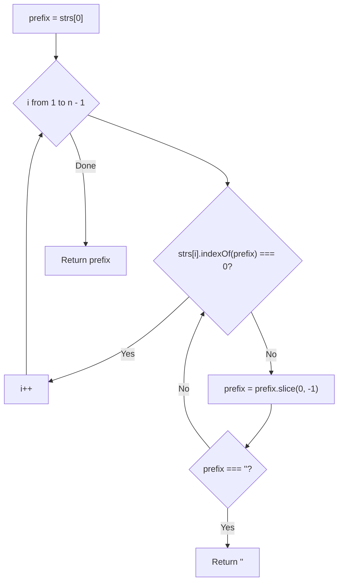
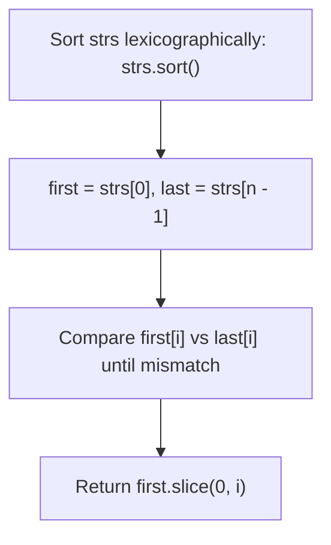
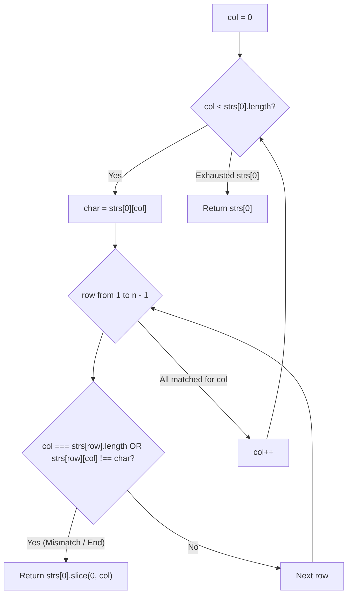
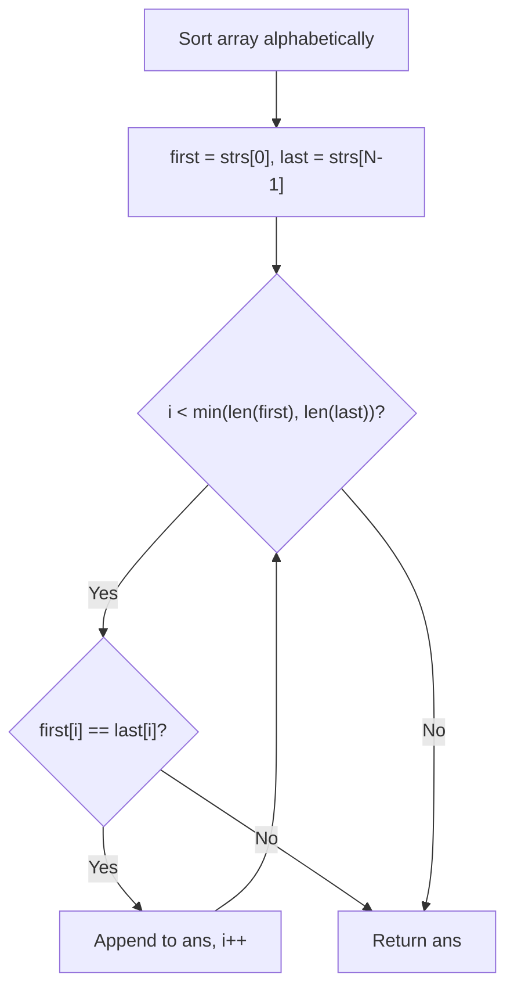

# 14. Longest Common Prefix

- **LeetCode Link**: `https://leetcode.com/problems/longest-common-prefix/`
- **Difficulty**: Easy
- **Pattern Category**: Array / String / Trie / Vertical Scanning
- **Prerequisite Primer**: `00-foundations/01-two-pointers.md`

---

## 1. Problem Overview & Edge Case Matrix

### Problem Statement
Write a function to find the longest common prefix string amongst an array of strings.
If there is no common prefix, return an empty string `""`.

```
strs = [ "flower" , "flow" , "flight" ]
Common prefix = "fl"

strs = [ "dog" , "racecar" , "car" ]
Common prefix = ""
```

### Upfront Edge Case Matrix

| Edge Case Scenario | Inputs | Expected Output | Pitfall / Failure Mode |
| :--- | :--- | :--- | :--- |
| Empty Array | `strs = []` | `""` | Index out of bounds on `strs[0]` |
| Single String in Array | `strs = ["single"]` | `"single"` | Redundant loop or returning empty string |
| Array Contains Empty String | `strs = ["", "b"]` | `""` | Attempting to access `char` at index 0 of empty string |
| All Identical Strings | `strs = ["apple", "apple", "apple"]` | `"apple"` | Loop boundary premature exit |
| No Common Prefix at Index 0 | `strs = ["dog", "racecar"]` | `""` | Character mismatch handling |

---

## 2. Level 1: Brute Force Approach (Horizontal Scanning)

### Intuition & Visual Idea
Initialize the prefix as the entire first string `prefix = strs[0]`.
Iterate through the remaining strings. For each string `strs[i]`, trim `prefix` from the right until `strs[i].startsWith(prefix)` is true. If `prefix` becomes empty, return `""`.



### Pseudocode
```text
FUNCTION longestCommonPrefixHorizontal(strs):
    IF strs.length == 0: RETURN ""
    prefix = strs[0]
    FOR i FROM 1 TO strs.length - 1:
        WHILE strs[i].indexOf(prefix) != 0:
            prefix = prefix.substring(0, prefix.length - 1)
            IF prefix == "": RETURN ""
    RETURN prefix
```

### Step-by-Step Dry Run
`strs = ["flower", "flow", "flight"]`

| Iteration `i` | `strs[i]` | `prefix` Candidate | Match? | Action |
| :--- | :--- | :--- | :--- | :--- |
| Init | - | `"flower"` | - | Base |
| `i = 1` | `"flow"` | `"flower"` $\to$ `"flowe"` $\to$ `"flow"` | Yes (`"flow"`) | `prefix = "flow"` |
| `i = 2` | `"flight"` | `"flow"` $\to$ `"flo"` $\to$ `"fl"` | Yes (`"fl"`) | `prefix = "fl"` |
| Result | - | - | - | Return `"fl"` |

### Modern JavaScript Implementation
```javascript
/**
 * Level 1: Horizontal Scanning
 * Time Complexity:  O(S) where S is the sum of all characters
 * Space Complexity: O(1) auxiliary
 */
function longestCommonPrefixHorizontal(strs) {
  if (strs.length === 0) return '';

  let prefix = strs[0];
  for (let i = 1; i < strs.length; i++) {
    while (strs[i].indexOf(prefix) !== 0) {
      prefix = prefix.slice(0, -1);
      if (prefix === '') return '';
    }
  }

  return prefix;
}
```

### Complexity Breakdown
- **Time Complexity**: $O(S)$ where $S$ is the total number of characters across all strings. In the worst case (e.g. all strings identical), we inspect all characters.
- **Space Complexity**: $O(1)$ auxiliary space.

#### 🎙️ How to Explain to Interviewer (Verbatim Script)
> *"This horizontal scanning approach compares the prefix cumulatively across strings: $LCP(S_1 \dots S_n) = LCP(LCP(S_1, S_2), S_3) \dots$. If a very short string appears at the end of a long list of identical strings, it does redundant work trimming long prefixes. In the worst case, this takes $O(S)$ time where $S$ is the sum of all characters, and $O(1)$ auxiliary space."*

---

## 3. Level 2: Optimized Approach (Lexicographical Sort & Extremes Comparison)

### Intuition & Visual Bottleneck Elimination
When an array of strings is sorted lexicographically, the string with the **least** commonality with the first string is the **last string** in the sorted array!
Thus, we only need to sort the array and find the common prefix between `strs[0]` and `strs[strs.length - 1]`.

```
strs: ["flower", "flow", "flight"]
Sorted: ["flight", "flow", "flower"]
          ^^^^^^             ^^^^^^
Compare first ("flight") and last ("flower"):
'f' === 'f', 'l' === 'l', 'i' !== 'o' -> Prefix = "fl"!
```



### Pseudocode
```text
FUNCTION longestCommonPrefixSort(strs):
    IF strs.length == 0: RETURN ""
    SORT strs lexicographically
    first = strs[0]
    last = strs[strs.length - 1]
    
    i = 0
    WHILE i < first.length AND i < last.length AND first[i] == last[i]:
        i++
    RETURN first.substring(0, i)
```

### Step-by-Step Dry Run
`strs = ["flower", "flow", "flight"]` $\to$ Sorted: `["flight", "flow", "flower"]`

| `i` | `first[i]` (`"flight"`) | `last[i]` (`"flower"`) | Match? | Action |
| :--- | :--- | :--- | :--- | :--- |
| 0 | `'f'` | `'f'` | Yes | `i++` |
| 1 | `'l'` | `'l'` | Yes | `i++` |
| 2 | `'i'` | `'o'` | **No (Mismatch)** | Stop! |
| Result | - | - | - | Return `"flight".slice(0, 2) = "fl"` |

### Modern JavaScript Implementation
```javascript
/**
 * Level 2: Lexicographical Sort Extremes Comparison
 * Time Complexity:  O(N * M * log N) where N = count, M = max length
 * Space Complexity: O(1) or O(log N) sort stack
 */
function longestCommonPrefixSort(strs) {
  if (strs.length === 0) return '';

  strs.sort();
  const first = strs[0];
  const last = strs[strs.length - 1];
  let i = 0;

  while (i < first.length && i < last.length && first[i] === last[i]) {
    i++;
  }

  return first.slice(0, i);
}
```

### Complexity Breakdown
- **Time Complexity**: $O(N \times M \log N)$ to sort $N$ strings of average length $M$.
- **Space Complexity**: $O(\log N)$ stack space for sorting.

#### 🎙️ How to Explain to Interviewer (Verbatim Script)
> *"For **Time Complexity**, sorting $N$ strings takes $O(N \cdot M \log N)$ string comparisons. After sorting, the most divergent strings occupy the first and last indices. We compare only these two boundaries in $O(M)$ time.
>
> For **Space Complexity**, it takes $O(\log N)$ stack memory for V8 Timsort."*

---

## 4. Level 3: Most Optimal / Canonical Approach (Vertical Column-by-Column Scanning)

### Intuition & Invariant Proof
Scan column by column (character by character across all strings at index `col`):
1. For character index `col = 0, 1, 2, ...` of the first string `strs[0]`:
2. Compare `char = strs[0][col]` against `strs[row][col]` for every string `row` from 1 to $n - 1$.
3. The moment `col === strs[row].length` (a string ended) OR `strs[row][col] !== char` (character mismatch), return `strs[0].slice(0, col)`.
4. If no mismatch occurs, return `strs[0]`.

```
Vertical Column Scan:
  col 0  1  2  3  4  5
      f  l  o  w  e  r   (strs[0])
      f  l  o  w         (strs[1])
      f  l  i  g  h  t   (strs[2])
      |  |  X (Mismatch at col 2: 'o' !== 'i')
Prefix = strs[0].slice(0, 2) = "fl"
```



### Pseudocode
```text
FUNCTION longestCommonPrefix(strs):
    IF strs.length == 0: RETURN ""
    FOR col FROM 0 TO strs[0].length - 1:
        char = strs[0][col]
        FOR row FROM 1 TO strs.length - 1:
            IF col == strs[row].length OR strs[row][col] != char:
                RETURN strs[0].substring(0, col)
    RETURN strs[0]
```

### Step-by-Step Dry Run
`strs = ["flower", "flow", "flight"]`

| `col` | `char` (`strs[0][col]`) | `strs[1][col]` | `strs[2][col]` | All Match? | Action |
| :--- | :--- | :--- | :--- | :--- | :--- |
| 0 | `'f'` | `'f'` | `'f'` | Yes | Advance `col = 1` |
| 1 | `'l'` | `'l'` | `'l'` | Yes | Advance `col = 2` |
| 2 | `'o'` | `'o'` | `'i'` | **No ('o' !== 'i')** | Early Return `strs[0].slice(0, 2) = "fl"` |

### Modern JavaScript Implementation
```javascript
/**
 * Level 3: Vertical Scanning (Canonical Optimal)
 * Time Complexity:  O(S) worst case, O(minLen * N) average with instant early exit
 * Space Complexity: O(1) Auxiliary Space
 */
function longestCommonPrefix(strs) {
  if (strs.length === 0) return '';

  for (let col = 0; col < strs[0].length; col++) {
    const char = strs[0][col];

    for (let row = 1; row < strs.length; row++) {
      if (col === strs[row].length || strs[row][col] !== char) {
        return strs[0].slice(0, col);
      }
    }
  }

  return strs[0];
}
```

### Complexity Breakdown
- **Time Complexity**: $O(S)$ worst case, where $S$ is the total characters across all strings. In the best/average case where prefix is short ($K$ characters), it executes in **$O(K \times N)$ operations**, terminating immediately without reading the remaining characters of any string.
- **Space Complexity**: $O(1)$ auxiliary space — Only constant integer index pointers.

#### 🎙️ How to Explain to Interviewer (Verbatim Script)
> *"For **Time Complexity**, vertical scanning runs in $O(S)$ worst case, but has optimal early termination. In typical cases where the common prefix has length $K$, we perform only $K \times N$ character comparisons and exit the moment the first mismatch occurs, without scanning the remainder of the strings.
>
> For **Space Complexity**, this is strictly **$O(1)$ auxiliary space**. We allocate zero extra data structures and slice the resulting prefix directly from the first string."*

---

## 5. JavaScript-Specific Gotchas & V8 Optimizations
- **Direct Character Access**: In JavaScript, `strs[row][col]` directly retrieves the character at index `col`. If `col >= strs[row].length`, it evaluates to `undefined`, which safely triggers the mismatch condition `undefined !== char`.

---

## 6. Real-World MAANG Interview Follow-Ups & Extensions

### Follow-Up 1: Finding LCP in Dynamic Streaming Queries (Trie Approach)
- **Scenario**: Given a dynamic dictionary of $10^6$ words where words are inserted and deleted, find LCP of any subset of words.
- **Solution Strategy**: Insert strings into a **Trie**. The LCP of all words in the Trie is the length of the longest path from root with single outgoing edges.

### Follow-Up 2: Longest Common Substring (Non-Prefix)
- **Scenario**: Find the longest common contiguous substring anywhere inside all strings.
- **Solution Strategy**: Generalized Suffix Tree or Binary Search on substring length + Rolling Hash (Rabin-Karp) in $O(N \cdot M \log M)$ time.

---

## 7. What LeetCode Discuss Says (Language-Independent)

Source: top-voted post by Akbar —
`https://leetcode.com/problems/longest-common-prefix/solutions/3273176/python3-c-java-19-ms-beats-99-91/`
— 3.2M views / 4.6K votes / 194 comments.
Language-independent summary. No new JS here.

### A. Optimal way from Discuss (Sort & Compare Ends)

If you sort an array of strings alphabetically, you only need to compare the first string and the last string in the sorted array. Any common prefix they share must necessarily be shared by all the strings between them in the sorted order.

```text
FUNCTION longestCommonPrefixSort(strs):
    IF length(strs) == 0 RETURN ""
    
    SORT strs alphabetically
    
    first = strs[0]
    last = strs[length(strs) - 1]
    ans = ""
    
    FOR i = 0 TO min(length(first), length(last)) - 1:
        IF first[i] != last[i]:
            BREAK
        ans += first[i]
        
    RETURN ans
```

- Time: O(M * N log N) where N is number of strings and M is max string length
- Space: O(1) or O(N) depending on language's sorting algorithm



### B. Dry run on LeetCode Example 1 (["flower","flow","flight"])

| Step | Action | State |
| :--- | :--- | :--- |
| 1 | Sort the array alphabetically | `["flight", "flow", "flower"]` |
| 2 | Assign `first` and `last` | `first = "flight"`, `last = "flower"` |
| 3 | Compare `first[0]` ('f') and `last[0]` ('f') | Match. `ans = "f"` |
| 4 | Compare `first[1]` ('l') and `last[1]` ('l') | Match. `ans = "fl"` |
| 5 | Compare `first[2]` ('i') and `last[2]` ('o') | Mismatch. Break loop. |

Final answer returned: `"fl"`

### C. Pitfalls from comments

- **Sorting Overhead:** While incredibly concise, sorting is mathematically slower ($O(M \cdot N \log N)$) than a vertical scan ($O(M \cdot N)$). For typical interview constraints it is perfectly fast, but in an interview, be prepared to discuss vertical scanning to avoid the $O(N \log N)$ hit.
- **Why sorting works:** The most common confusion in the comments is why comparing only the first and last strings is sufficient. Alphabetic sorting guarantees that the strings with the *most different* characters are at the opposite ends of the array.
- **Shortest string fallacy:** A common misconception is that sorting places the shortest string first. Alphabetic sorting sorts by character values, not length (e.g., `["abcd", "abefg", "abd"]` sorts to `["abcd", "abd", "abefg"]`, where neither the first nor last is shortest).

### D. Companies

- Discuss post itself names none.
  Companies tab on LeetCode is premium-locked.
- External source:
  `https://github.com/liquidslr/leetcode-company-wise-problems`
  (LeetCode company tags, updated June 2025).
- All-time (53): Accenture, Adobe, Amazon, American Express, Apple, Barclays, Bloomberg, Capgemini, CME Group, Deloitte, Deutsche Bank, Disney, EPAM Systems, Fidelity, Google, HashedIn, HSBC, Hudson River Trading, IBM, Infosys, Jane Street, Larsen & Toubro, Meta, Microsoft, Nokia, Nvidia, Opentext, Oracle, Oyo, Palo Alto Networks, Persistent Systems, PhonePe, Publicis Sapient, PwC, Qualcomm, Quora, Revolut, Roblox, SAP, Sigmoid, Target, TCS, TikTok, Uber, USAA, Virtusa, Visa, Walmart Labs, Wipro, Yahoo, Yelp, Zoho.
- Recent: 30 days — Amazon, Google.
- Recent: 3 months — Amazon, Apple, Bloomberg, Google, IBM, Meta, Microsoft, Opentext, TCS.
