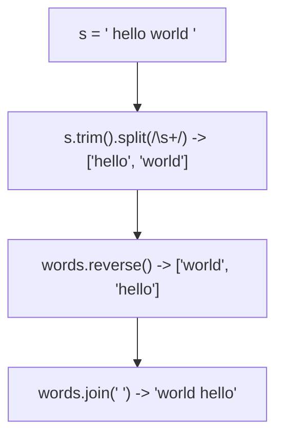
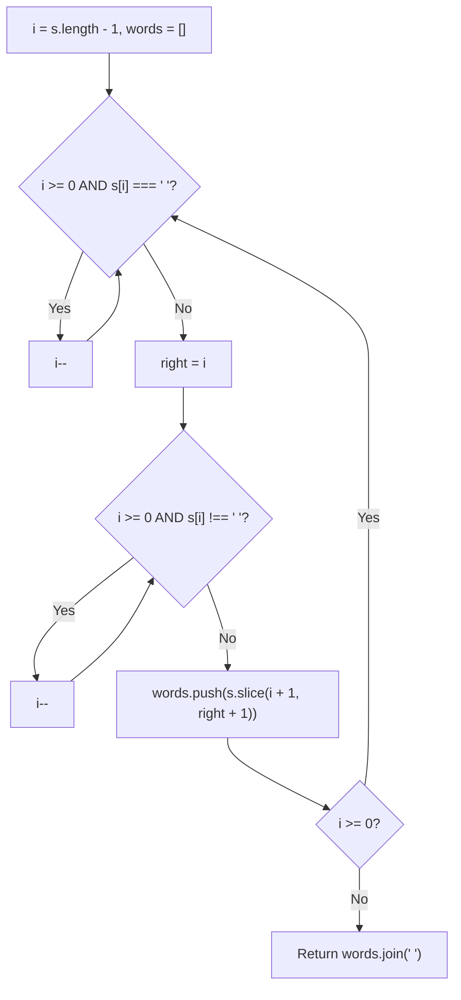
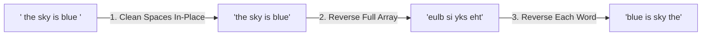
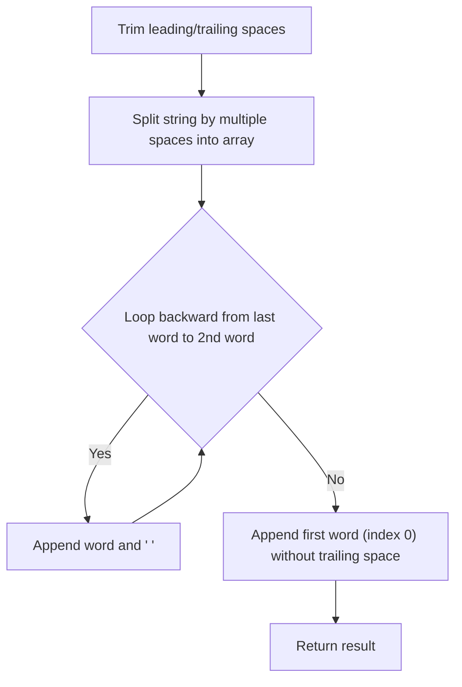

# 151. Reverse Words in a String

- **LeetCode Link**: `https://leetcode.com/problems/reverse-words-in-a-string/`
- **Difficulty**: Medium
- **Pattern Category**: Array / String / Two Pointers
- **Prerequisite Primer**: `00-foundations/01-two-pointers.md`

---

## 1. Problem Overview & Edge Case Matrix

### Problem Statement
Given an input string `s`, reverse the order of the **words**.

A **word** is defined as a sequence of non-space characters. The words in `s` will be separated by at least one space.

Return a string of the words in reverse order concatenated by a single space.
Note that `s` may contain leading or trailing spaces or multiple spaces between two words. The returned string should only have a single space separating the words. Do not include any extra spaces.

```
s = "the sky is blue"
Output: "blue is sky the"

s = "  hello world  "
Output: "world hello"

s = "a good   example"
Output: "example good a"
```

### Upfront Edge Case Matrix

| Edge Case Scenario | Inputs | Expected Output | Pitfall / Failure Mode |
| :--- | :--- | :--- | :--- |
| Leading and Trailing Whitespace | `s = "  hello world  "` | `"world hello"` | Trailing/leading empty word artifacts |
| Multiple Consecutive Internal Spaces | `s = "a   good   example"` | `"example good a"` | Empty string elements resulting from naive `.split(' ')` |
| Single Word Only | `s = "single"` | `"single"` | Index out of bounds in loop |
| Only Whitespace | `s = "    "` | `""` | Returning space instead of empty string |

---

## 2. Level 1: Brute Force Approach (Built-in Split, Filter, Reverse & Join)

### Intuition & Visual Idea
Use JavaScript standard library functions: split the string by spaces, filter out all empty tokens, reverse the array of words, and join them with a single space.



### Pseudocode
```text
FUNCTION reverseWordsBruteForce(s):
    words = s.trim().split(/\s+/)
    words.reverse()
    RETURN words.join(" ")
```

### Step-by-Step Dry Run
`s = "  a good   example  "`

| Step | Operation | Resulting State |
| :--- | :--- | :--- |
| 1 | `s.trim()` | `"a good   example"` |
| 2 | `.split(/\s+/)` | `["a", "good", "example"]` |
| 3 | `.reverse()` | `["example", "good", "a"]` |
| 4 | `.join(' ')` | `"example good a"` |

### Modern JavaScript Implementation
```javascript
/**
 * Level 1: Standard Library Built-ins
 * Time Complexity:  O(N)
 * Space Complexity: O(N) Auxiliary Space
 */
function reverseWordsBruteForce(s) {
  return s.trim().split(/\s+/).reverse().join(' ');
}
```

### Complexity Breakdown
- **Time Complexity**: $O(N)$ — `.trim()`, `.split(/\s+/)`, `.reverse()`, and `.join(' ')` each perform a linear pass over the characters.
- **Space Complexity**: $O(N)$ — Creates intermediate word arrays and substring copies in the V8 heap.

#### 🎙️ How to Explain to Interviewer (Verbatim Script)
> *"This brute-force approach uses standard library string operations. We trim the input, split on whitespace regex `/\s+/` to discard multi-space delimiters, reverse the array of words in-place, and join with a single space. While clean and $O(N)$ in time, it allocates multiple intermediate arrays and string buffers in the V8 heap, consuming $O(N)$ auxiliary memory."*

---

## 3. Level 2: Optimized Approach (Two Pointers Backward Word Scanning)

### Intuition & Visual Bottleneck Elimination
Instead of allocating an array of all words and reversing it, scan the string from **right to left**:
1. Use pointer `i` starting at the end of the string.
2. Skip trailing spaces.
3. Mark `end = i`.
4. Scan backwards until a space is found to mark `start = i + 1`.
5. Extract `s.slice(start, end + 1)` and append to our result words list.

```
s = "  hello world  "
               ^^^^^ -> Word 1: "world"
        ^^^^^        -> Word 2: "hello"
Result: ["world", "hello"].join(" ") = "world hello"
```



### Pseudocode
```text
FUNCTION reverseWordsOptimized(s):
    words = []
    i = s.length - 1
    WHILE i >= 0:
        WHILE i >= 0 AND s[i] == ' ': i--
        IF i < 0: BREAK
        right = i
        WHILE i >= 0 AND s[i] != ' ': i--
        words.push(s.substring(i + 1, right + 1))
    RETURN words.join(" ")
```

### Step-by-Step Dry Run
`s = "a good example"`

| Step | `i` Scanning | Found Word Slice | `words` List |
| :--- | :--- | :--- | :--- |
| 1 | `i` scans `"example"` | `s.slice(7, 14)` | `["example"]` |
| 2 | `i` scans `"good"` | `s.slice(2, 6)` | `["example", "good"]` |
| 3 | `i` scans `"a"` | `s.slice(0, 1)` | `["example", "good", "a"]` |
| Result | `.join(" ")` | - | `"example good a"` |

### Modern JavaScript Implementation
```javascript
/**
 * Level 2: Backward Two Pointers Scan
 * Time Complexity:  O(N)
 * Space Complexity: O(N) for output word collection
 */
function reverseWordsOptimized(s) {
  const words = [];
  let i = s.length - 1;

  while (i >= 0) {
    // 1. Skip spaces
    while (i >= 0 && s[i] === ' ') {
      i--;
    }
    if (i < 0) break;

    // 2. Capture word boundary
    const right = i;
    while (i >= 0 && s[i] !== ' ') {
      i--;
    }

    words.push(s.slice(i + 1, right + 1));
  }

  return words.join(' ');
}
```

### Complexity Breakdown
- **Time Complexity**: $O(N)$ — Single backward traversal where each character is visited once.
- **Space Complexity**: $O(N)$ — Stores word slices in the `words` array.

#### 🎙️ How to Explain to Interviewer (Verbatim Script)
> *"For **Time Complexity**, this runs in $O(N)$ time with a single backward sweep. We scan the string from right to left, isolating word boundaries and pushing each word directly in reverse order.
>
> For **Space Complexity**, it takes $O(N)$ auxiliary memory to collect the words for the final output string."*

---

## 4. Level 3: Most Optimal / Canonical Approach (In-Place 3-Step Character Array Reversal)

### Intuition & Invariant Proof
In languages with mutable strings (like C++ or character arrays in JS):
1. **Clean Whitespace In-Place**: Compress multiple internal and trailing spaces using fast-slow two pointers.
2. **Reverse the ENTIRE Character Array**: `"the sky is blue"` $\to$ `"eulb si yks eht"`.
3. **Reverse EACH Individual Word in the Reversed Array**:
   - `"eulb"` $\to$ `"blue"`
   - `"si"` $\to$ `"is"`
   - `"yks"` $\to$ `"sky"`
   - `"eht"` $\to$ `"the"`
   - Result: `"blue is sky the"`!

```
Original:       "  the   sky  is   blue  "
1. Clean Space: ['t','h','e',' ','s','k','y',' ','i','s',' ','b','l','u','e']
2. Reverse All: ['e','u','l','b',' ','s','i',' ','y','k','s',' ','e','h','t']
3. Reverse Each:['b','l','u','e',' ','i','s',' ','s','k','y',' ','t','h','e']
```



### Pseudocode
```text
FUNCTION reverseWords(s):
    arr = cleanSpaces(s) // Returns character array without redundant spaces
    reverse(arr, 0, arr.length - 1)
    
    start = 0
    FOR end FROM 0 TO arr.length:
        IF end == arr.length OR arr[end] == ' ':
            reverse(arr, start, end - 1)
            start = end + 1
            
    RETURN arr.join("")
```

### Step-by-Step Dry Run
`arr = ['e', 'u', 'l', 'b', ' ', 's', 'i', ' ', 'e', 'h', 't']`

| `start` | `end` | Word Found | Reverse Range | Array State |
| :--- | :--- | :--- | :--- | :--- |
| 0 | 4 (`' '`) | `'eulb'` | `[0, 3]` | `['b','l','u','e', ' ', 's','i', ' ', 'e','h','t']` |
| 5 | 7 (`' '`) | `'si'` | `[5, 6]` | `['b','l','u','e', ' ', 'i','s', ' ', 'e','h','t']` |
| 8 | 11 (End) | `'eht'` | `[8, 10]` | `['b','l','u','e', ' ', 'i','s', ' ', 't','h','e']` |

### Modern JavaScript Implementation
```javascript
/**
 * Level 3: In-Place Character Array Reversal (Canonical C-Style Invariant)
 * Time Complexity:  O(N)
 * Space Complexity: O(N) (Character array allocation in JS)
 */
function reverseWords(s) {
  // Step 1: Clean spaces into a mutable character array
  const chars = [];
  let i = 0;
  const n = s.length;

  while (i < n) {
    while (i < n && s[i] === ' ') i++; // Skip spaces
    if (i >= n) break;
    if (chars.length > 0) chars.push(' '); // Add single space between words
    while (i < n && s[i] !== ' ') {
      chars.push(s[i++]);
    }
  }

  // Step 2: Helper to reverse sub-array in place
  const reverse = (left, right) => {
    while (left < right) {
      const temp = chars[left];
      chars[left] = chars[right];
      chars[right] = temp;
      left++;
      right--;
    }
  };

  // Step 3: Reverse the entire character array
  reverse(0, chars.length - 1);

  // Step 4: Reverse each word individually
  let start = 0;
  for (let end = 0; end <= chars.length; end++) {
    if (end === chars.length || chars[end] === ' ') {
      reverse(start, end - 1);
      start = end + 1;
    }
  }

  return chars.join('');
}
```

### Complexity Breakdown
- **Time Complexity**: $O(N)$ — Space cleaning takes $N$ steps, full reversal takes $N/2$ swaps, and individual word reversals take $N/2$ swaps total $\implies O(N)$.
- **Space Complexity**: $O(N)$ in JavaScript (due to string immutability requiring a character array). In C/C++, this runs in strictly $O(1)$ auxiliary space.

#### 🎙️ How to Explain to Interviewer (Verbatim Script)
> *"For **Time Complexity**, this is $O(N)$ linear time. We perform three sequential phases: (1) cleaning spaces using two pointers, (2) reversing the entire array, and (3) reversing each individual word in-place. Each character is moved and swapped a constant number of times.
>
> For **Space Complexity**, in JavaScript strings are immutable primitives, so converting the string into a mutable character array consumes $O(N)$ memory. However, on the character array itself, all reversal operations are strictly $O(1)$ auxiliary in-place mutations."*

---

## 5. JavaScript-Specific Gotchas & V8 Optimizations
- **String Immutability in JS**: Always explain to the interviewer that unlike C/C++ `std::string` or `char*`, JavaScript strings cannot be mutated in-place (`s[0] = 'a'` fails silently in non-strict mode).

---

## 6. Real-World MAANG Interview Follow-Ups & Extensions

### Follow-Up 1: Streaming File Word Reversal ($100\text{GB}$ File)
- **Scenario**: Reverse the order of words in a massive text file that cannot fit in RAM.
- **Solution Strategy**: Read file backwards in $64\text{MB}$ chunks using file descriptors (`fs.read`), find word boundaries across chunk borders, and stream reversed words to output.

### Follow-Up 2: Reverse Words III (Keep Word Order, Reverse Characters in Each Word)
- **Scenario**: Reverse the characters in each word while preserving word order (LeetCode 557).
- **Solution**: Skip step 3 (do not reverse entire array, only reverse individual words).

---

## 7. What LeetCode Discuss Says (Language-Independent)

Source: top-voted post by Raunak dinesh kodwani —
`https://leetcode.com/problems/reverse-words-in-a-string/solutions/3595568/5-line-simple-solution-with-full-explanation/`
— 163.2K views / 890 votes / 40 comments.
Language-independent summary. No new JS here.

### A. Optimal way from Discuss (Split & Reverse)

The simplest approach splits the string by whitespaces into an array of words, then iterates through the array backward, appending each word and a single space to the result.

```text
FUNCTION reverseWords(s):
    s = TRIM(s)
    words = SPLIT(s, by multiple spaces)
    out = ""
    
    FOR i = length(words) - 1 DOWN TO 1:
        out = out + words[i] + " "
        
    out = out + words[0]
    RETURN out
```

- Time: O(N)
- Space: O(N)



### B. Dry run on LeetCode Example 2 ("  hello world  ")

| Step | Operation | Result |
| :--- | :--- | :--- |
| 1 | Trim spaces | `"hello world"` |
| 2 | Split by multiple spaces | `["hello", "world"]` |
| 3 | Loop `i = 1` | `out = "" + "world" + " "` |
| 4 | End loop | `out = "world "` |
| 5 | Append `words[0]` | `out = "world " + "hello"` |

Final returned string: `"world hello"`.

### C. Pitfalls from comments

- **String Concatenation Overhead:** Using standard string concatenation (e.g., `out += ...`) in languages like Java creates a new string object in memory on every addition, making the time complexity degrade to $O(N^2)$ in the worst case. It is highly recommended to use a mutable structure like `StringBuilder`, an array `join()`, or a two-pointer in-place reversal algorithm (where strings are mutable, like C++).
- **Two Pointers (In-Place) approach:** Many comments point out that while splitting is easy and clean, interviewers often ask to solve it with $O(1)$ extra space if strings are mutable (C++). This requires a 3-step process: 1. Reverse the entire string, 2. Reverse each individual word, 3. Clean up the spaces.

### D. Companies

- Discuss post itself names none.
  Companies tab on LeetCode is premium-locked.
- External source:
  `https://github.com/liquidslr/leetcode-company-wise-problems`
  (LeetCode company tags, updated June 2025).
- All-time (36): Accenture, Amazon, Apple, Barclays, Bloomberg, Cisco, Deutsche Bank, EPAM Systems, Goldman Sachs, Google, HCL, IBM, Infosys, LinkedIn, Meta, Microsoft, Nvidia, Nykaa, Oracle, ServiceNow, Snap, TCS, TikTok, Uber, Yelp, Zoho, Zopsmart.
- Recent: 30 days — Meta.
- Recent: 3 months — Amazon, Deutsche Bank, Google, Meta.
