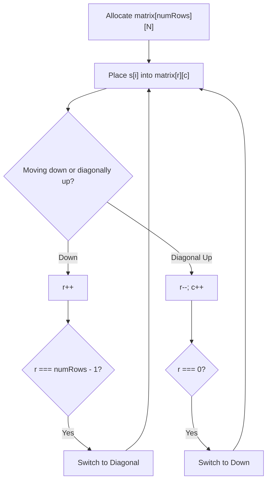
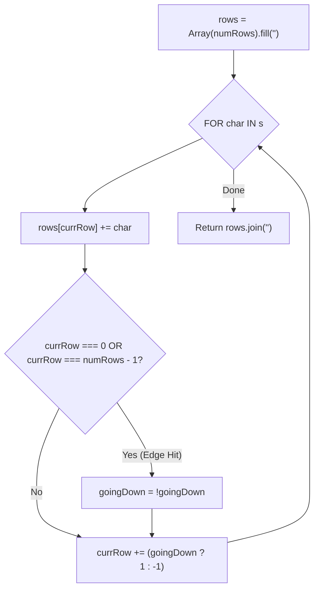
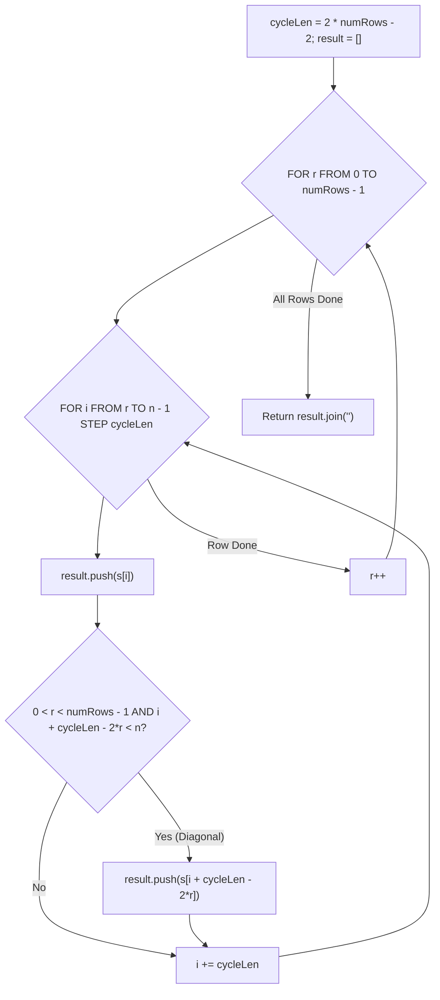

# 6. Zigzag Conversion

- **LeetCode Link**: `https://leetcode.com/problems/zigzag-conversion/`
- **Difficulty**: Medium
- **Pattern Category**: Array / String / Simulation / Math
- **Prerequisite Primer**: `00-foundations/01-two-pointers.md`

---

## 1. Problem Overview & Edge Case Matrix

### Problem Statement
The string `"PAYPALISHIRING"` is written in a zigzag pattern on a given number of rows like this:

```
P   A   H   N
A P L S I I G
Y   I   R
```
And then read line by line: `"PAHNAPLSIIGYIR"`.

Write the code that will take a string and make this conversion given a number of rows.

### Upfront Edge Case Matrix

| Edge Case Scenario | Inputs | Expected Output | Pitfall / Failure Mode |
| :--- | :--- | :--- | :--- |
| `numRows = 1` | `s = "AB"`, `numRows = 1` | `"AB"` | Division by zero or infinite loop in bounce logic |
| `numRows >= s.length` | `s = "PAYPAL"`, `numRows = 10` | `"PAYPAL"` | Creating empty unpopulated rows |
| Single Character String | `s = "A"`, `numRows = 2` | `"A"` | Redundant allocations |
| Two Rows | `s = "ABCD"`, `numRows = 2` | `"ACBD"` | Alternating even/odd indexing check |

---

## 2. Level 1: Brute Force Approach (2D Character Grid Simulation)

### Intuition & Visual Idea
Create a 2D matrix of characters with `numRows` rows and $N$ columns. Simulate a pen moving down vertically, then diagonally up-right when the bottom row is hit. Finally, scan row-by-row and concatenate non-empty characters.



### Pseudocode
```text
FUNCTION convertBruteForce(s, numRows):
    IF numRows == 1 OR numRows >= s.length: RETURN s
    grid = 2D array of size [numRows][s.length] filled with null
    
    r = 0, c = 0
    goingDown = true
    FOR char IN s:
        grid[r][c] = char
        IF goingDown:
            IF r == numRows - 1:
                goingDown = false
                r--
                c++
            ELSE:
                r++
        ELSE:
            IF r == 0:
                goingDown = true
                r++
            ELSE:
                r--
                c++
                
    RETURN concatenateAllNonNull(grid)
```

### Step-by-Step Dry Run
`s = "PAYPAL"`, `numRows = 3`

| `char` | `(r, c)` Position | Direction After Placement |
| :--- | :--- | :--- |
| `'P'` | `(0, 0)` | Down $\implies (1, 0)$ |
| `'A'` | `(1, 0)` | Down $\implies (2, 0)$ |
| `'Y'` | `(2, 0)` | Bottom hit! Switch to Diagonal $\implies (1, 1)$ |
| `'P'` | `(1, 1)` | Diagonal $\implies (0, 2)$ |
| `'A'` | `(0, 2)` | Top hit! Switch to Down $\implies (1, 2)$ |
| `'L'` | `(1, 2)` | Down $\implies (2, 2)$ |

### Modern JavaScript Implementation
```javascript
/**
 * Level 1: 2D Grid Simulation
 * Time Complexity:  O(numRows * N)
 * Space Complexity: O(numRows * N)
 */
function convertBruteForce(s, numRows) {
  if (numRows === 1 || numRows >= s.length) return s;

  const n = s.length;
  const grid = Array.from({ length: numRows }, () => new Array(n).fill(null));

  let r = 0;
  let c = 0;
  let goingDown = true;

  for (let i = 0; i < n; i++) {
    grid[r][c] = s[i];

    if (goingDown) {
      if (r === numRows - 1) {
        goingDown = false;
        r--;
        c++;
      } else {
        r++;
      }
    } else {
      if (r === 0) {
        goingDown = true;
        r++;
      } else {
        r--;
        c++;
      }
    }
  }

  let result = '';
  for (let row = 0; row < numRows; row++) {
    for (let col = 0; col < n; col++) {
      if (grid[row][col] !== null) {
        result += grid[row][col];
      }
    }
  }

  return result;
}
```

### Complexity Breakdown
- **Time Complexity**: $O(\text{numRows} \times N)$ — Scanning the entire 2D matrix.
- **Space Complexity**: $O(\text{numRows} \times N)$ — Allocating the 2D grid in heap memory.

#### 🎙️ How to Explain to Interviewer (Verbatim Script)
> *"This brute-force approach explicitly builds the 2D visual matrix of size $numRows \times N$. We simulate placing each character down columns and across diagonal diagonals, and then scan the entire grid row by row. Because most cells in the matrix remain empty, it wastes $O(numRows \times N)$ memory and time scanning null cells."*

---

## 3. Level 2: Optimized Approach (Row-by-Row String Buckets with Direction Toggle)

### Intuition & Visual Bottleneck Elimination
We don't care about the empty column spaces! We only care which **row bucket** each character belongs to.
1. Create `numRows` string buffers `rows = ["", "", ...]`.
2. Maintain `currRow = 0` and `step = -1`.
3. For each character in `s`, append to `rows[currRow]`.
4. If `currRow === 0` or `currRow === numRows - 1`, flip direction: `step = -step`.
5. Update `currRow += step`.
6. Join all row strings: `rows.join("")`.



### Pseudocode
```text
FUNCTION convertRowBuckets(s, numRows):
    IF numRows == 1 OR numRows >= s.length: RETURN s
    rows = new Array(numRows).fill("")
    currRow = 0
    goingDown = false

    FOR char IN s:
        rows[currRow] += char
        IF currRow == 0 OR currRow == numRows - 1:
            goingDown = NOT goingDown
        currRow += goingDown ? 1 : -1

    RETURN rows.join("")
```

### Step-by-Step Dry Run
`s = "PAYPALISHIRING"`, `numRows = 3`

| `char` | `currRow` | Action | Direction | `rows` State |
| :--- | :--- | :--- | :--- | :--- |
| `'P'` | 0 | Top Hit $\implies$ Reverse | Down (`+1`) | `["P", "", ""]` |
| `'A'` | 1 | Down | Down (`+1`) | `["P", "A", ""]` |
| `'Y'` | 2 | Bottom Hit $\implies$ Reverse | Up (`-1`) | `["P", "A", "Y"]` |
| `'P'` | 1 | Up | Up (`-1`) | `["P", "AP", "Y"]` |
| `'A'` | 0 | Top Hit $\implies$ Reverse | Down (`+1`) | `["PA", "AP", "Y"]` |
| `'L'` | 1 | Down | Down (`+1`) | `["PA", "APL", "Y"]` |

### Modern JavaScript Implementation
```javascript
/**
 * Level 2: Row Buckets with Direction Toggle
 * Time Complexity:  O(N)
 * Space Complexity: O(N) Auxiliary Space
 */
function convertRowBuckets(s, numRows) {
  if (numRows === 1 || numRows >= s.length) return s;

  const rows = Array.from({ length: numRows }, () => []);
  let currRow = 0;
  let goingDown = false;

  for (let i = 0; i < s.length; i++) {
    rows[currRow].push(s[i]);
    if (currRow === 0 || currRow === numRows - 1) {
      goingDown = !goingDown;
    }
    currRow += goingDown ? 1 : -1;
  }

  return rows.map(r => r.join('')).join('');
}
```

### Complexity Breakdown
- **Time Complexity**: $O(N)$ — Single pass through string `s`.
- **Space Complexity**: $O(N)$ — The `rows` arrays store exactly $N$ characters total.

#### 🎙️ How to Explain to Interviewer (Verbatim Script)
> *"For **Time Complexity**, this is $O(N)$ linear time. We iterate through the string of length $N$ once, placing each character into its corresponding row bucket, and finally concatenate the $numRows$ arrays in $O(N)$ total time.
>
> For **Space Complexity**, it takes $O(N)$ auxiliary memory to store the character buffers across the $numRows$ rows."*

---

## 4. Level 3: Most Optimal / Canonical Approach (Direct Mathematical Cycle Indexing)

### Intuition & Mathematical Invariant
Notice the repetition cycle length:
$$\text{cycleLen} = 2 \times \text{numRows} - 2$$
For any row $r \in [0, \text{numRows} - 1]$:
- In row $0$ and row $\text{numRows} - 1$, characters appear at indices:
  $$i = r + k \times \text{cycleLen}$$
- In internal rows $0 < r < \text{numRows} - 1$, each cycle contains **two** characters:
  1. The vertical character at index: $i = r + k \times \text{cycleLen}$
  2. The diagonal character at index: $j = (k + 1) \times \text{cycleLen} - r$

We can write the output string directly row by row without any auxiliary row buffers!

```
cycleLen = 2 * 3 - 2 = 4 (for numRows = 3)
Row 0: indices 0, 4, 8, 12 ...
Row 1: indices 1, (4-1)=3, 5, (8-1)=7, 9, (12-1)=11 ...
Row 2: indices 2, 6, 10 ...
```



### Pseudocode
```text
FUNCTION convert(s, numRows):
    IF numRows == 1 OR numRows >= s.length: RETURN s
    cycleLen = 2 * numRows - 2
    result = []
    
    FOR r FROM 0 TO numRows - 1:
        FOR i FROM r TO s.length - 1 STEP cycleLen:
            result.push(s[i])
            diagIdx = i + cycleLen - 2 * r
            IF r != 0 AND r != numRows - 1 AND diagIdx < s.length:
                result.push(s[diagIdx])
                
    RETURN result.join("")
```

### Step-by-Step Dry Run
`s = "PAYPALISHIRING"`, `numRows = 3`, `cycleLen = 4`, $N = 14$

| Row `r` | Primary `i` | Diagonal `i + 4 - 2*r` | Characters Appended |
| :--- | :--- | :--- | :--- |
| `r = 0` | 0, 4, 8, 12 | None (Top Row) | `'P', 'A', 'H', 'N'` |
| `r = 1` | 1, 5, 9, 13 | $1+2=3, 5+2=7, 9+2=11$ | `'A', 'P', 'L', 'S', 'I', 'I', 'G'` |
| `r = 2` | 2, 6, 10 | None (Bottom Row) | `'Y', 'I', 'R'` |
| Combined | - | - | `"PAHNAPLSIIGYIR"` |

### Modern JavaScript Implementation
```javascript
/**
 * Level 3: Direct Mathematical Step Indexing (Canonical Optimal)
 * Time Complexity:  O(N)
 * Space Complexity: O(1) Auxiliary Space (excluding output)
 */
function convert(s, numRows) {
  if (numRows === 1 || numRows >= s.length) return s;

  const n = s.length;
  const cycleLen = 2 * numRows - 2;
  const result = [];

  for (let r = 0; r < numRows; r++) {
    for (let i = r; i < n; i += cycleLen) {
      // 1. Append the vertical element
      result.push(s[i]);

      // 2. Append the diagonal element if not in first or last row
      const diagIdx = i + cycleLen - 2 * r;
      if (r !== 0 && r !== numRows - 1 && diagIdx < n) {
        result.push(s[diagIdx]);
      }
    }
  }

  return result.join('');
}
```

### Complexity Breakdown
- **Time Complexity**: $O(N)$ — Every character index in the string is visited and pushed to `result` exactly once.
- **Space Complexity**: $O(1)$ auxiliary space — Allocates zero intermediate row arrays or data structures.

#### 🎙️ How to Explain to Interviewer (Verbatim Script)
> *"For **Time Complexity**, this is $O(N)$ linear time. By recognizing that the zigzag traversal has a fixed cycle period of $2 \times numRows - 2$, we calculate the exact index of each character directly in mathematical order. Every character is accessed and appended once.
>
> For **Space Complexity**, it is strictly **$O(1)$ auxiliary memory** (excluding the return string). We avoid creating $numRows$ dynamic arrays, building the final result directly from the input string."*

---

## 5. JavaScript-Specific Gotchas & V8 Optimizations
- **Base Case Guard**: `if (numRows === 1 || numRows >= s.length) return s;` is mandatory. When `numRows = 1`, `cycleLen = 2(1) - 2 = 0`, which would trigger an infinite loop `i += 0`.

---

## 6. Real-World MAANG Interview Follow-Ups & Extensions

### Follow-Up 1: Inverting the Zigzag (Decoding)
- **Scenario**: Given the zigzag-encoded string `"PAHNAPLSIIGYIR"` and `numRows`, reconstruct the original string `"PAYPALISHIRING"`.
- **Solution Strategy**: Calculate the count of characters in each row using cycle arithmetic, slice the input string into rows, and read back using the direction toggle pointer.

### Follow-Up 2: Memory-Constrained Streaming Zigzag on Ultra-Large Text
- **Scenario**: What if `s` is a $10\text{GB}$ stream and cannot fit in memory?
- **Solution Strategy**: Compute total character count $N$. In pass $r \in [0, \text{numRows}-1]$, read chunks directly from disk at offsets $r + k \times \text{cycleLen}$ and stream directly to standard output without holding the file in memory.
