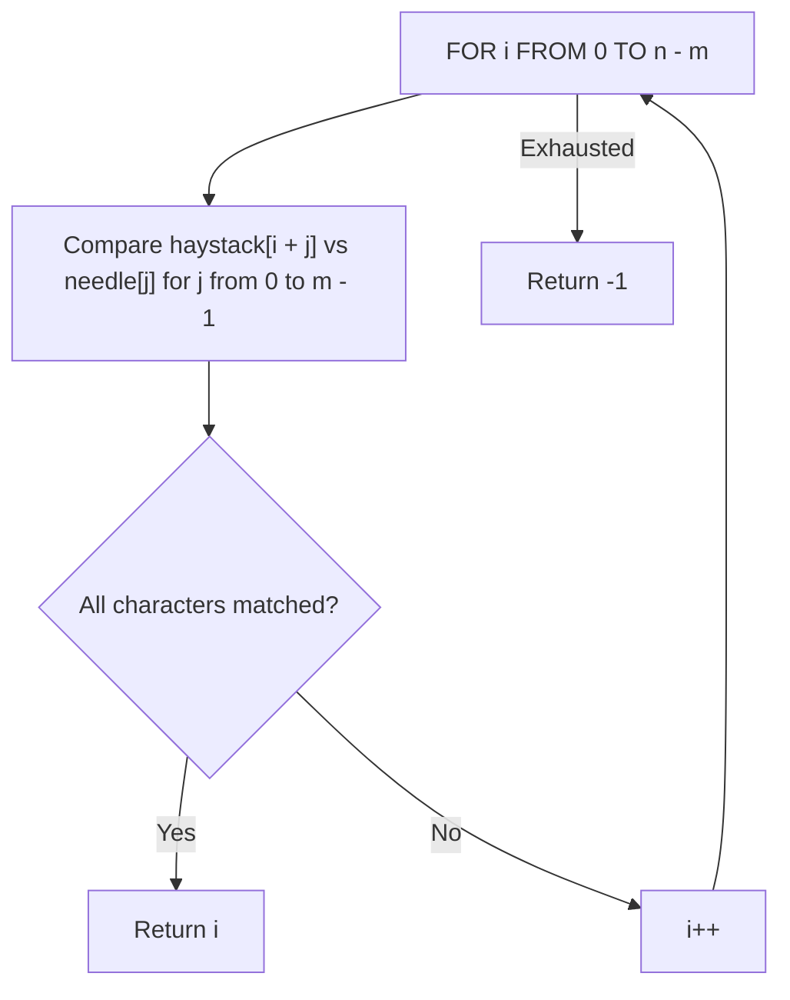
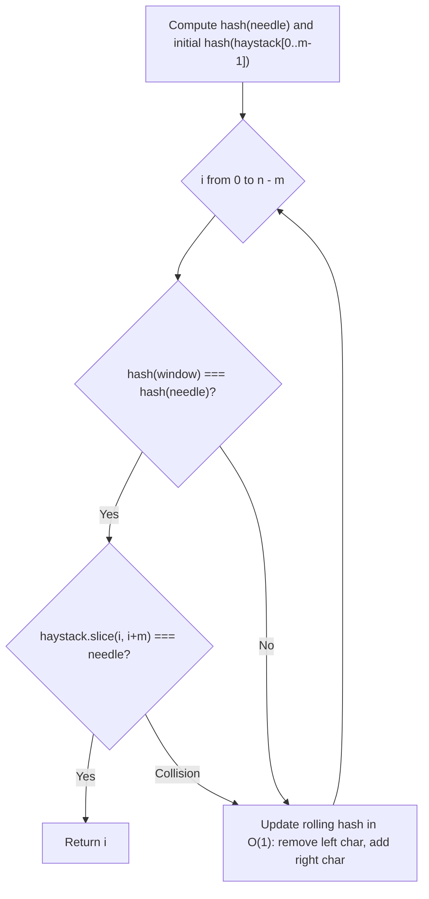
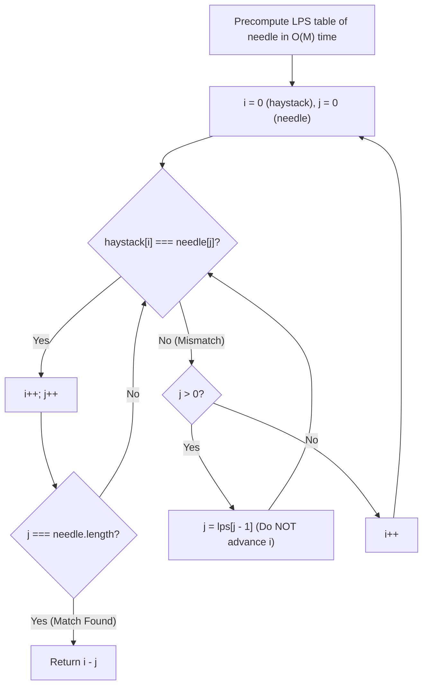
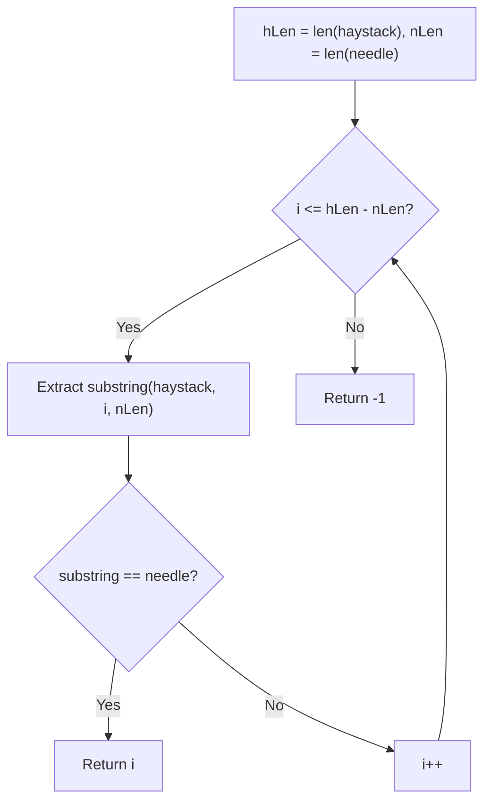

# 28. Find the Index of the First Occurrence in a String

- **LeetCode Link**: `https://leetcode.com/problems/find-the-index-of-the-first-occurrence-in-a-string/`
- **Difficulty**: Easy
- **Pattern Category**: Array / String / KMP / Rabin-Karp
- **Prerequisite Primer**: `00-foundations/01-two-pointers.md`

---

## 1. Problem Overview & Edge Case Matrix

### Problem Statement
Given two strings `needle` and `haystack`, return the index of the first occurrence of `needle` in `haystack`, or `-1` if `needle` is not part of `haystack`.

```
haystack = "sadbutsad", needle = "sad"
First occurrence at index 0 -> Output: 0

haystack = "leetcode", needle = "leeto"
"leeto" does not occur in "leetcode" -> Output: -1
```

### Upfront Edge Case Matrix

| Edge Case Scenario | Inputs | Expected Output | Pitfall / Failure Mode |
| :--- | :--- | :--- | :--- |
| `needle` Longer than `haystack` | `haystack = "a"`, `needle = "aaa"` | `-1` | Loop boundary error |
| Identical Strings | `haystack = "abc"`, `needle = "abc"` | `0` | Off-by-one upper bound |
| Needle at Very End | `haystack = "mississippi"`, `needle = "pi"` | `9` | Incomplete terminal check |
| Overlapping Repeated Patterns | `haystack = "aabaaabaaac"`, `needle = "aabaaac"` | `4` | Redundant backtracking in naive search |

---

## 2. Level 1: Brute Force Approach (Sliding Window Substring Search)

### Intuition & Visual Idea
Slide a window of length $M$ (length of `needle`) across `haystack` from index `0` to $N - M$. For each start index `i`, compare characters one by one. The moment a full match of length $M$ is found, return `i`.



### Pseudocode
```text
FUNCTION strStrBruteForce(haystack, needle):
    n = haystack.length, m = needle.length
    IF m > n: RETURN -1
    
    FOR i FROM 0 TO n - m:
        match = true
        FOR j FROM 0 TO m - 1:
            IF haystack[i + j] != needle[j]:
                match = false
                BREAK
        IF match: RETURN i
        
    RETURN -1
```

### Step-by-Step Dry Run
`haystack = "sadbutsad"`, `needle = "sad"`, $N = 9, M = 3$

| `i` | Window Substring `haystack[i ... i+2]` | `needle` | Match? | Action |
| :--- | :--- | :--- | :--- | :--- |
| 0 | `"sad"` | `"sad"` | **Yes** | Return `i = 0` |

### Modern JavaScript Implementation
```javascript
/**
 * Level 1: Brute Force Sliding Window
 * Time Complexity:  O((N - M + 1) * M)
 * Space Complexity: O(1) auxiliary
 */
function strStrBruteForce(haystack, needle) {
  const n = haystack.length;
  const m = needle.length;
  if (m > n) return -1;

  for (let i = 0; i <= n - m; i++) {
    let match = true;
    for (let j = 0; j < m; j++) {
      if (haystack[i + j] !== needle[j]) {
        match = false;
        break;
      }
    }
    if (match) return i;
  }

  return -1;
}
```

### Complexity Breakdown
- **Time Complexity**: $O((N - M + 1) \times M) \approx O(N \times M)$ — In degenerate cases like `haystack = "aaaaaab"`, `needle = "aab"`, it checks $M$ characters for almost every index.
- **Space Complexity**: $O(1)$ auxiliary space.

#### 🎙️ How to Explain to Interviewer (Verbatim Script)
> *"This brute-force approach slides a window of size $M$ over the string of size $N$. For each candidate position, we perform up to $M$ character comparisons. In the worst-case scenario with repeated prefixes, this takes $O(N \cdot M)$ time and $O(1)$ auxiliary space."*

---

## 3. Level 2: Optimized Approach (Rabin-Karp Rolling Hash)

### Intuition & Visual Bottleneck Elimination
Instead of comparing all $M$ characters at each position, we compute a **polynomial rolling hash** of `needle` and compare it against the rolling hash of the current window in `haystack` in $O(1)$ time. When the hashes match, we do a character-by-character check to guard against hash collisions.

```
Hash function: H = (c0 * 26^(m-1) + c1 * 26^(m-2) + ... + cm-1) mod MOD
Rolling shift: newHash = ((oldHash - oldChar * 26^(m-1)) * 26 + newChar) mod MOD
```



### Pseudocode
```text
FUNCTION strStrRabinKarp(haystack, needle):
    n = haystack.length, m = needle.length
    IF m > n: RETURN -1
    
    BASE = 256, MOD = 1000000007
    needleHash = 0, windowHash = 0, power = 1
    
    FOR i FROM 0 TO m - 2: power = (power * BASE) MOD MOD
    FOR i FROM 0 TO m - 1:
        needleHash = (needleHash * BASE + CODE(needle[i])) MOD MOD
        windowHash = (windowHash * BASE + CODE(haystack[i])) MOD MOD
        
    FOR i FROM 0 TO n - m:
        IF windowHash == needleHash AND haystack[i..i+m-1] == needle:
            RETURN i
        IF i < n - m:
            windowHash = (windowHash - CODE(haystack[i]) * power) MOD MOD
            windowHash = (windowHash * BASE + CODE(haystack[i + m])) MOD MOD
            IF windowHash < 0: windowHash += MOD
            
    RETURN -1
```

### Step-by-Step Dry Run
`haystack = "sadbutsad"`, `needle = "sad"`

| Window `i` | Window Substring | Window Hash | Needle Hash | Hash Match? | Action |
| :--- | :--- | :--- | :--- | :--- | :--- |
| 0 | `"sad"` | $H_0$ | $H_{\text{needle}}$ | **True** | String verification matches $\implies$ Return `0` |

### Modern JavaScript Implementation
```javascript
/**
 * Level 2: Rabin-Karp Rolling Hash
 * Time Complexity:  O(N + M) average, O(N * M) worst-case collision
 * Space Complexity: O(1) Auxiliary Space
 */
function strStrRabinKarp(haystack, needle) {
  const n = haystack.length;
  const m = needle.length;
  if (m > n) return -1;

  const BASE = 256;
  const MOD = 1000000007;

  let needleHash = 0;
  let windowHash = 0;
  let power = 1;

  for (let i = 0; i < m - 1; i++) {
    power = (power * BASE) % MOD;
  }

  for (let i = 0; i < m; i++) {
    needleHash = (needleHash * BASE + needle.charCodeAt(i)) % MOD;
    windowHash = (windowHash * BASE + haystack.charCodeAt(i)) % MOD;
  }

  for (let i = 0; i <= n - m; i++) {
    if (windowHash === needleHash) {
      if (haystack.slice(i, i + m) === needle) {
        return i;
      }
    }

    if (i < n - m) {
      windowHash = (windowHash - ((haystack.charCodeAt(i) * power) % MOD) + MOD) % MOD;
      windowHash = (windowHash * BASE + haystack.charCodeAt(i + m)) % MOD;
    }
  }

  return -1;
}
```

### Complexity Breakdown
- **Time Complexity**: $O(N + M)$ average time — $O(M)$ to compute initial hash, $O(1)$ to roll the window across $N$ positions.
- **Space Complexity**: $O(1)$ auxiliary space.

#### 🎙️ How to Explain to Interviewer (Verbatim Script)
> *"For **Time Complexity**, Rabin-Karp runs in $O(N + M)$ average time. We precompute the needle hash in $O(M)$ time and slide a rolling hash window in $O(1)$ time per step across the $N$ characters. Spurious hash collisions are verified in $O(M)$ time, which occurs rarely with a large prime modulo ($10^9+7$).
>
> For **Space Complexity**, it is strictly $O(1)$ auxiliary memory."*

---

## 4. Level 3: Most Optimal / Canonical Approach (Knuth-Morris-Pratt / KMP Algorithm)

### Intuition & Invariant Proof
When a character mismatch occurs after matching $k$ characters, we don't need to restart the search from index $i + 1$!
Instead, we use the **Longest Prefix Suffix (LPS)** table of `needle`:
- `lps[i]` = length of the longest proper prefix of `needle[0 ... i]` that is also a suffix of `needle[0 ... i]`.
- When mismatch occurs at `needle[j]`, we fallback to `j = lps[j - 1]` without moving the pointer in `haystack` backward!

```
needle = "a a b a a a c"
lps    = [0, 1, 0, 1, 2, 2, 0]

If mismatch occurs at index 5 ('a' !== 'c'):
Instead of restarting from scratch, jump needle index to lps[4] = 2!
```



### Pseudocode
```text
FUNCTION computeLPS(pattern):
    lps = new Array(pattern.length).fill(0)
    len = 0, i = 1
    WHILE i < pattern.length:
        IF pattern[i] == pattern[len]:
            len++
            lps[i] = len
            i++
        ELSE:
            IF len != 0: len = lps[len - 1]
            ELSE: lps[i] = 0; i++
    RETURN lps

FUNCTION strStr(haystack, needle):
    IF needle == "": RETURN 0
    lps = computeLPS(needle)
    i = 0, j = 0
    WHILE i < haystack.length:
        IF haystack[i] == needle[j]:
            i++; j++
            IF j == needle.length: RETURN i - j
        ELSE:
            IF j != 0: j = lps[j - 1]
            ELSE: i++
    RETURN -1
```

### Step-by-Step Dry Run
`haystack = "aabaaabaaac"`, `needle = "aabaaac"`

| `i` (`haystack`) | `j` (`needle`) | `haystack[i]` | `needle[j]` | Match? | Action |
| :--- | :--- | :--- | :--- | :--- | :--- |
| 0..4 | 0..4 | `"aabaa"` | `"aabaa"` | Yes | `i=5, j=5` |
| 5 | 5 | `'a'` | `'a'` | Yes | `i=6, j=6` |
| 6 | 6 | `'b'` | `'c'` | **Mismatch!** | `j = lps[5] = 2`, keep `i = 6` |
| 6 | 2 | `'b'` | `'b'` | Yes | `i=7, j=3` |
| 7..10 | 3..6 | `"aaac"` | `"aaac"` | Yes | `j = 7` (Match!) $\implies$ Return $11 - 7 = \mathbf{4}$ |

### Modern JavaScript Implementation
```javascript
/**
 * Level 3: Knuth-Morris-Pratt (KMP) Algorithm (Canonical Optimal)
 * Time Complexity:  O(N + M) Guaranteed Deterministic
 * Space Complexity: O(M) for LPS Table
 */
function strStr(haystack, needle) {
  const n = haystack.length;
  const m = needle.length;
  if (m === 0) return 0;
  if (m > n) return -1;

  // 1. Build Longest Prefix Suffix (LPS) Array
  const lps = new Int32Array(m);
  let len = 0;
  let i = 1;

  while (i < m) {
    if (needle[i] === needle[len]) {
      len++;
      lps[i] = len;
      i++;
    } else {
      if (len !== 0) {
        len = lps[len - 1]; // Fallback in pattern prefix
      } else {
        lps[i] = 0;
        i++;
      }
    }
  }

  // 2. KMP Search with Zero Backtracking in Haystack
  let hIdx = 0;
  let nIdx = 0;

  while (hIdx < n) {
    if (haystack[hIdx] === needle[nIdx]) {
      hIdx++;
      nIdx++;

      if (nIdx === m) {
        return hIdx - m; // Match found
      }
    } else {
      if (nIdx !== 0) {
        nIdx = lps[nIdx - 1]; // Fallback needle pointer
      } else {
        hIdx++; // Advance haystack pointer
      }
    }
  }

  return -1;
}
```

### Complexity Breakdown
- **Time Complexity**: $O(N + M)$ deterministic upper bound — LPS preprocessing takes $O(M)$ time; searching takes $O(N)$ because the `hIdx` pointer never decreases.
- **Space Complexity**: $O(M)$ auxiliary space for the `lps` typed array.

#### 🎙️ How to Explain to Interviewer (Verbatim Script)
> *"For **Time Complexity**, the Knuth-Morris-Pratt (KMP) algorithm guarantees $O(N + M)$ deterministic worst-case runtime. The LPS table is constructed in $O(M)$ steps. During the search phase, the text pointer `hIdx` strictly increments and never backtracks, while the pattern pointer `nIdx` falls back using the LPS table at most $N$ total times, ensuring linear time even on adversarial repeating patterns.
>
> For **Space Complexity**, it takes $O(M)$ auxiliary space to store the LPS array of size equal to the needle length."*

---

## 5. JavaScript-Specific Gotchas & V8 Optimizations
- **Typed Array Allocation**: `new Int32Array(m)` creates a contiguous C-like memory block in V8, avoiding dynamic array resizing and GC overhead.

---

## 6. Real-World MAANG Interview Follow-Ups & Extensions

### Follow-Up 1: Finding ALL Occurrences in Streaming Text
- **Scenario**: Return all starting indices where `needle` appears in a continuous stream of text.
- **Solution Strategy**: When `nIdx === m`, record match at `hIdx - m`, then reset `nIdx = lps[nIdx - 1]` and continue reading the stream.

### Follow-Up 2: Multi-Pattern Matching (Aho-Corasick Algorithm)
- **Scenario**: Find occurrences of $K$ different dictionary words in a text simultaneously in $O(N + \sum M_i)$ time.
- **Solution Strategy**: Build a Trie with KMP failure transitions (Aho-Corasick automaton).

---

## 7. What LeetCode Discuss Says (Language-Independent)

Source: top-voted post by Hyassin —
`https://leetcode.com/problems/find-the-index-of-the-first-occurrence-in-a-string/solutions/4751433/beats-100-with-this-easy-solution-in-java-python-c-c/`
— 264.2K views / 968 votes / 81 comments.
Language-independent summary. No new JS here.

### A. Optimal way from Discuss (Sliding Window / Substring Matching)

Iterate through the `haystack` string with a window size equal to the length of the `needle`. Compare each substring. Since we only need the *first* occurrence, we can immediately return the index when a match is found.

```text
FUNCTION strStr(haystack, needle):
    hLen = length(haystack)
    nLen = length(needle)
    
    FOR i = 0 TO hLen - nLen:
        IF substring(haystack, start=i, length=nLen) == needle:
            RETURN i
            
    RETURN -1
```

- Time: O(N * M) where N is length of haystack and M is length of needle.
- Space: O(1) conceptually, but depends on language implementation of substring slicing.



### B. Dry run on LeetCode Example 1 ("sadbutsad", "sad")

| Step | `i` | Substring (len=3) | Matches "sad"? | Action |
| :--- | :--- | :--- | :--- | :--- |
| 1 | 0 | `haystack[0..2]` = "sad" | Yes | Return `i = 0` |

### C. Pitfalls from comments

- **Using built-in methods vs manual checking:** The top solution uses built-in `substring()` / `.substr()` or slicing. Many comments argue that in an interview setting, the interviewer will likely ban `indexOf()` and may also ban `substring()`, wanting you to manually check characters with a nested loop or use the KMP algorithm (Knuth-Morris-Pratt, $O(N+M)$). However, the manual nested loop is essentially the same $O(N \cdot M)$ complexity.
- **Space complexity of substring:** In languages like Java or C++, `.substring()` or `.substr()` allocates a new string object, which means the space complexity in practice is $O(M)$ per iteration. A purely index-based two-pointer nested loop achieves true $O(1)$ space.
- **Loop bound check:** The loop bound must be exactly `hLen - nLen` (inclusive). If you loop to `hLen - 1`, you will get out-of-bounds exceptions when extracting the substring near the end of `haystack`.

### D. Companies

- Discuss post itself names none.
  Companies tab on LeetCode is premium-locked.
- External source:
  `https://github.com/liquidslr/leetcode-company-wise-problems`
  (LeetCode company tags, updated June 2025).
- All-time (16): Amazon, Apple, Bloomberg, Capgemini, Cognizant, Expedia, Google, Infosys, Meta, Microsoft, PayPal, Pocket Gems, Qualcomm, TCS, Yandex, Zoho.
- Recent: 30 days — Amazon, Bloomberg, Google, Meta.
- Recent: 3 months — Amazon, Bloomberg, Cognizant, Google, Meta, Microsoft.
