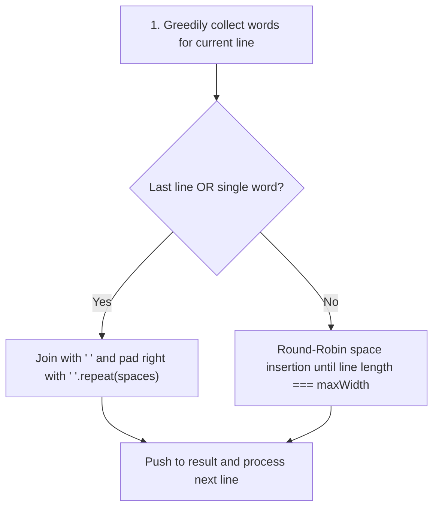
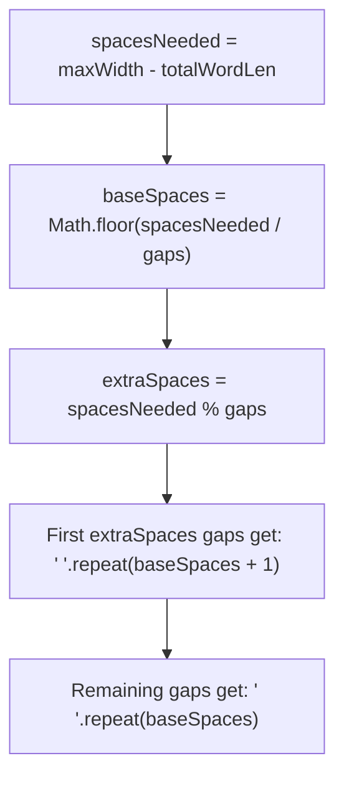
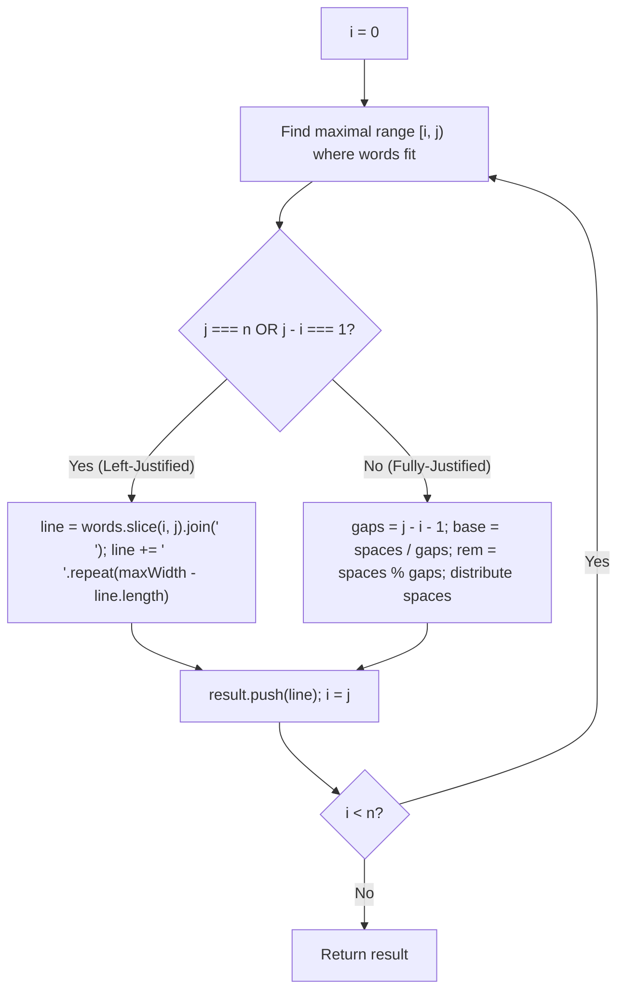

# 68. Text Justification

- **LeetCode Link**: `https://leetcode.com/problems/text-justification/`
- **Difficulty**: Hard
- **Pattern Category**: Array / String / Simulation / Greedy
- **Prerequisite Primer**: `00-foundations/01-two-pointers.md`

---

## 1. Problem Overview & Edge Case Matrix

### Problem Statement
Given an array of strings `words` and a width `maxWidth`, format the text such that each line has exactly `maxWidth` characters and is fully (left and right) justified.

You should pack your words in a greedy approach; that is, pack as many words as you can in each line. Pad extra spaces `' '` when necessary so that each line has exactly `maxWidth` characters.

Extra spaces between words should be distributed as evenly as possible. If the number of spaces on a line does not divide evenly between words, the **empty slots on the left will be assigned more spaces than the slots on the right**.

For the **last line of text**, it should be **left-justified**, and no extra space is inserted between words.

```
words = ["This", "is", "an", "example", "of", "text", "justification."], maxWidth = 16

Output:
[
   "This    is    an",
   "example  of text",
   "justification.  "
]
```

### Upfront Edge Case Matrix

| Edge Case Scenario | Inputs | Expected Output | Pitfall / Failure Mode |
| :--- | :--- | :--- | :--- |
| Single Word in a Line | `words = ["Listen"]`, `maxWidth = 10` | `["Listen    "]` | Division by zero in space slots |
| Last Line Left-Justified | `words = ["a", "b"]`, `maxWidth = 5` | `["a b  "]` | Fully justifying last line instead of left-aligning |
| Exact Fit without Extra Spaces | `words = ["what", "must", "be"]`, `maxWidth = 12` | `["what must be"]` | Incorrect space count calculation |
| Single Long Word Fitting Exactly | `words = ["acknowledgment"]`, `maxWidth = 14` | `["acknowledgment"]` | Off-by-one trailing padding error |

---

## 2. Level 1: Brute Force Approach (Simulate Line Packing & Round-Robin Space Insertion)

### Intuition & Visual Idea
1. Group words into lines greedily until adding the next word exceeds `maxWidth`.
2. For each line, calculate total remaining spaces: `spacesNeeded = maxWidth - totalChars`.
3. If the line has $>1$ word and is not the last line, distribute spaces by repeatedly cycling through word gaps in a round-robin loop.
4. For single-word lines or the last line, join with a single space and pad the remainder with spaces on the right.



### Pseudocode
```text
FUNCTION fullJustifyBruteForce(words, maxWidth):
    result = []
    i = 0
    WHILE i < words.length:
        line = [words[i]]
        charCount = words[i].length
        i++
        WHILE i < words.length AND charCount + 1 + words[i].length <= maxWidth:
            line.push(words[i])
            charCount += 1 + words[i].length
            i++
            
        // Justification logic
        IF i == words.length OR line.length == 1:
            str = line.join(" ")
            str += REPEAT(" ", maxWidth - str.length)
            result.push(str)
        ELSE:
            spaces = maxWidth - SUM_LENGTHS(line)
            gaps = line.length - 1
            gapSpaces = Array(gaps).fill("")
            WHILE spaces > 0:
                FOR g FROM 0 TO gaps - 1:
                    IF spaces > 0: gapSpaces[g] += " "; spaces--
            result.push(INTERLEAVE(line, gapSpaces))
            
    RETURN result
```

### Step-by-Step Dry Run
`words = ["This", "is", "an"]`, `maxWidth = 16`
- Words: `"This"` (4), `"is"` (2), `"an"` (2). Total word chars = 8.
- Remaining spaces = $16 - 8 = 8$ spaces.
- Gaps = 2.
- Round-robin: 8 spaces split across 2 gaps $\implies$ 4 spaces per gap.
- Result: `"This    is    an"` (Length = 16).

### Modern JavaScript Implementation
```javascript
/**
 * Level 1: Brute Force Round-Robin Space Insertion
 * Time Complexity:  O(N * maxWidth)
 * Space Complexity: O(N)
 */
function fullJustifyBruteForce(words, maxWidth) {
  const result = [];
  let i = 0;
  const n = words.length;

  while (i < n) {
    const line = [words[i]];
    let lineCharLen = words[i].length;
    i++;

    while (i < n && lineCharLen + 1 + words[i].length <= maxWidth) {
      line.push(words[i]);
      lineCharLen += 1 + words[i].length;
      i++;
    }

    // Edge Case: Last line or single word line
    if (i === n || line.length === 1) {
      let str = line.join(' ');
      str += ' '.repeat(maxWidth - str.length);
      result.push(str);
      continue;
    }

    // Fully justify: Calculate spaces per gap
    const totalWordLen = line.reduce((sum, w) => sum + w.length, 0);
    let totalSpaces = maxWidth - totalWordLen;
    const gaps = line.length - 1;
    const gapArray = new Array(gaps).fill('');

    while (totalSpaces > 0) {
      for (let g = 0; g < gaps && totalSpaces > 0; g++) {
        gapArray[g] += ' ';
        totalSpaces--;
      }
    }

    let justified = '';
    for (let g = 0; g < gaps; g++) {
      justified += line[g] + gapArray[g];
    }
    justified += line[line.length - 1];
    result.push(justified);
  }

  return result;
}
```

### Complexity Breakdown
- **Time Complexity**: $O(N \times \text{maxWidth})$ — Round-robin space loop decrements one space at a time.
- **Space Complexity**: $O(N)$ — Output array storing formatted lines.

#### 🎙️ How to Explain to Interviewer (Verbatim Script)
> *"This brute-force approach collects words greedily into lines and then distributes spaces character-by-character in a round-robin loop across word gaps. While correct, cycling one space at a time does unnecessary work when $maxWidth$ is large."*

---

## 3. Level 2: Optimized Approach (Mathematical Quotient & Remainder Distribution)

### Intuition & Visual Bottleneck Elimination
Instead of cycling one space at a time, we use integer division and modulo arithmetic:
- `spacesNeeded = maxWidth - totalWordLength`
- `baseSpaces = Math.floor(spacesNeeded / numGaps)`
- `extraSpaces = spacesNeeded % numGaps`
- The first `extraSpaces` gaps receive `baseSpaces + 1` spaces, and the remaining gaps receive `baseSpaces` spaces!

```
Total spaces = 8, Gaps = 3
baseSpaces  = Math.floor(8 / 3) = 2 spaces
extraSpaces = 8 % 3 = 2 spaces
Gaps distribution: [ 2+1, 2+1, 2 ] = [ 3, 3, 2 ] spaces
```



### Pseudocode
```text
FUNCTION fullJustifyMath(words, maxWidth):
    // For each full line:
    baseSpaces = FLOOR(spaces / gaps)
    extraSpaces = spaces MOD gaps
    FOR g FROM 0 TO gaps - 1:
        currentGap = baseSpaces + (g < extraSpaces ? 1 : 0)
        lineStr += words[g] + REPEAT(" ", currentGap)
```

### Step-by-Step Dry Run
`words = ["example", "of", "text"]`, `maxWidth = 16`
- Words length = $7 + 2 + 4 = 13$.
- `spacesNeeded` = $16 - 13 = 3$.
- `gaps` = 2.
- `baseSpaces` = $\lfloor 3 / 2 \rfloor = 1$.
- `extraSpaces` = $3 \pmod 2 = 1$.
- Gap 0: $1 + 1 = 2$ spaces.
- Gap 1: $1 + 0 = 1$ space.
- Result: `"example  of text"` (Length = 16).

### Modern JavaScript Implementation
```javascript
/**
 * Level 2: Quotient and Remainder Space Distribution
 * Time Complexity:  O(Total Characters)
 * Space Complexity: O(N)
 */
function fullJustifyMath(words, maxWidth) {
  const result = [];
  let i = 0;
  const n = words.length;

  while (i < n) {
    let lineLen = words[i].length;
    let j = i + 1;

    while (j < n && lineLen + 1 + words[j].length <= maxWidth) {
      lineLen += 1 + words[j].length;
      j++;
    }

    const numWords = j - i;
    const isLastLine = j === n;

    // Case 1: Single word or last line -> Left justify
    if (numWords === 1 || isLastLine) {
      let lineStr = words.slice(i, j).join(' ');
      lineStr += ' '.repeat(maxWidth - lineStr.length);
      result.push(lineStr);
    } else {
      // Case 2: Fully justify with quotient & remainder
      const wordChars = words.slice(i, j).reduce((s, w) => s + w.length, 0);
      const totalSpaces = maxWidth - wordChars;
      const gaps = numWords - 1;
      const baseSpaces = Math.floor(totalSpaces / gaps);
      const extraSpaces = totalSpaces % gaps;

      let lineStr = '';
      for (let k = 0; k < gaps; k++) {
        const gapSize = baseSpaces + (k < extraSpaces ? 1 : 0);
        lineStr += words[i + k] + ' '.repeat(gapSize);
      }
      lineStr += words[j - 1]; // Append last word of line
      result.push(lineStr);
    }

    i = j;
  }

  return result;
}
```

### Complexity Breakdown
- **Time Complexity**: $O(\sum \text{length}(words)) \approx O(N)$ — Linear pass over words and generated lines.
- **Space Complexity**: $O(N)$ for the returned lines list.

#### 🎙️ How to Explain to Interviewer (Verbatim Script)
> *"For **Time Complexity**, this runs in $O(N)$ linear time where $N$ is the total number of characters in all words. We process each word once using a two-pointer window `[i, j)`.
>
> For **Space Complexity**, it takes $O(N)$ memory to store the resulting justified lines."*

---

## 4. Level 3: Most Optimal / Canonical Approach (Clean Modular Single-Pass Justifier)

### Intuition & Invariant Proof
We structure the solution cleanly into two distinct invariant handlers:
1. **Window Identification**: Find the maximal slice `[left, right)` fitting on a single line.
2. **Deterministic Formatting Invariant**:
   - If `right === words.length` (last line) OR `right - left === 1` (single word): Left-justify via `words.slice(left, right).join(' ')` padded with trailing spaces.
   - Otherwise: Fully justify by distributing `(maxWidth - totalChars) / gaps` base spaces and giving 1 extra space to the first `remainder` gaps.

```
Line Builder Matrix:
+-------------------------------------------------------------+
| Condition                   | Action                        |
+-------------------------------------------------------------+
| Last Line (right === n)     | Left-justify, pad right       |
| Single Word (gaps === 0)    | Left-justify, pad right       |
| Multiple Words (gaps > 0)   | Full justify (base + extra)   |
+-------------------------------------------------------------+
```



### Pseudocode
```text
FUNCTION fullJustify(words, maxWidth):
    result = []
    i = 0
    WHILE i < words.length:
        j = i + 1
        lineChars = words[i].length
        WHILE j < words.length AND lineChars + 1 + words[j].length <= maxWidth:
            lineChars += 1 + words[j].length
            j++
            
        isLastLine = (j == words.length)
        numWords = j - i
        
        IF numWords == 1 OR isLastLine:
            line = JOIN(words[i..j-1], " ")
            line += REPEAT(" ", maxWidth - line.length)
        ELSE:
            totalWordLen = SUM_LEN(words[i..j-1])
            spaces = maxWidth - totalWordLen
            gaps = numWords - 1
            base = FLOOR(spaces / gaps)
            rem = spaces MOD gaps
            line = ""
            FOR k FROM 0 TO gaps - 1:
                line += words[i + k] + REPEAT(" ", base + (k < rem ? 1 : 0))
            line += words[j - 1]
            
        result.push(line)
        i = j
    RETURN result
```

### Step-by-Step Dry Run
`words = ["Science","is","what","we","understand","well","enough","to","explain","to","a","computer."]`
`maxWidth = 20`

| Line Range `[i, j)` | Line Words | Words Chars | Total Spaces Needed | Gaps | Space Split | Resulting Line |
| :--- | :--- | :--- | :--- | :--- | :--- | :--- |
| `[0, 3)` | `"Science", "is", "what"` | $7+2+4=13$ | $20 - 13 = 7$ | 2 | $7/2 = 3$ (rem 1) $\implies [4, 3]$ | `"Science    is   what"` |
| `[3, 6)` | `"we", "understand", "well"` | $2+10+4=16$ | $20 - 16 = 4$ | 2 | $4/2 = 2$ (rem 0) $\implies [2, 2]$ | `"we  understand  well"` |
| `[6, 9)` | `"enough", "to", "explain"` | $6+2+7=15$ | $20 - 15 = 5$ | 2 | $5/2 = 2$ (rem 1) $\implies [3, 2]$ | `"enough   to   explain"` |
| `[9, 12)` | `"to", "a", "computer."` | Last Line | - | - | Left-Justified | `"to a computer.      "` |

### Modern JavaScript Implementation
```javascript
/**
 * Level 3: Canonical Modular Justification
 * Time Complexity:  O(Total Characters)
 * Space Complexity: O(N) Output Memory
 */
function fullJustify(words, maxWidth) {
  const result = [];
  let i = 0;
  const n = words.length;

  while (i < n) {
    let lineChars = words[i].length;
    let j = i + 1;

    // Expand window [i, j)
    while (j < n && lineChars + 1 + words[j].length <= maxWidth) {
      lineChars += 1 + words[j].length;
      j++;
    }

    const numWords = j - i;
    const isLastLine = j === n;

    if (numWords === 1 || isLastLine) {
      // Left justify
      let line = words.slice(i, j).join(' ');
      line += ' '.repeat(maxWidth - line.length);
      result.push(line);
    } else {
      // Full justify
      let wordCharsOnly = 0;
      for (let k = i; k < j; k++) {
        wordCharsOnly += words[k].length;
      }

      const totalSpaces = maxWidth - wordCharsOnly;
      const gaps = numWords - 1;
      const baseSpaces = Math.floor(totalSpaces / gaps);
      const extraSpaces = totalSpaces % gaps;

      let line = '';
      for (let k = 0; k < gaps; k++) {
        const gapSize = baseSpaces + (k < extraSpaces ? 1 : 0);
        line += words[i + k] + ' '.repeat(gapSize);
      }
      line += words[j - 1];
      result.push(line);
    }

    i = j;
  }

  return result;
}
```

### Complexity Breakdown
- **Time Complexity**: $O(N)$ where $N$ is the sum of characters across all words. Each word is inspected once to construct lines and once during string assembly.
- **Space Complexity**: $O(N)$ memory required for the output array of strings.

#### 🎙️ How to Explain to Interviewer (Verbatim Script)
> *"For **Time Complexity**, this algorithm is $O(N)$ linear time where $N$ is the total character length of the input text. We advance through words using two pointers `[i, j)` to group words greedily, and format each line in a single pass using integer division for space distribution.
>
> For **Space Complexity**, it takes $O(N)$ memory solely to store the output array of justified string lines."*

---

## 5. JavaScript-Specific Gotchas & V8 Optimizations
- **String Repeat Operator**: `' '.repeat(count)` in modern V8 is heavily optimized at the engine C++ level, executing significantly faster than manual string concatenation loops.

---

## 6. Real-World MAANG Interview Follow-Ups & Extensions

### Follow-Up 1: Word-Wrapping with Dynamic Programming (Knuth-Plass Line Breaking)
- **Scenario**: In LaTeX and typography engines, greedy line breaking can leave awkward ragged lines. Minimize total raggedness: $\sum (\text{extraSpaces})^3$.
- **Solution Strategy**: $O(N^2)$ Dynamic Programming solving the classic Matrix Chain / Line Breaking optimization.

### Follow-Up 2: Bidirectional Right-to-Left Justification (Arabic / Hebrew)
- **Scenario**: When formatting Right-to-Left (RTL) scripts, extra spaces must be placed on the rightmost gaps instead of leftmost gaps.
- **Solution**: Invert the remainder condition: `k >= gaps - extraSpaces ? baseSpaces + 1 : baseSpaces`.
