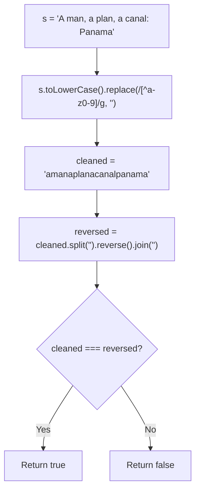
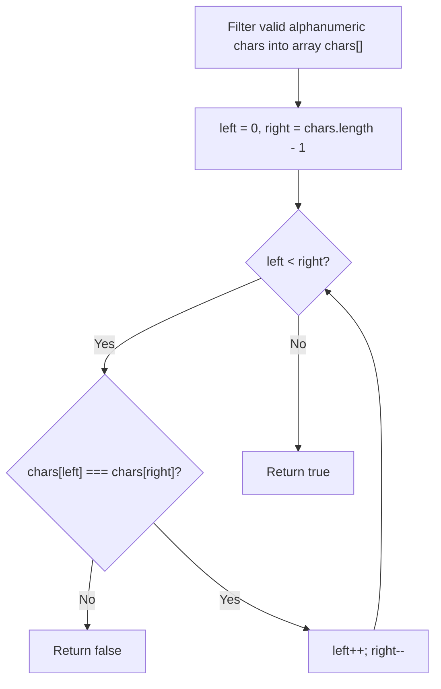
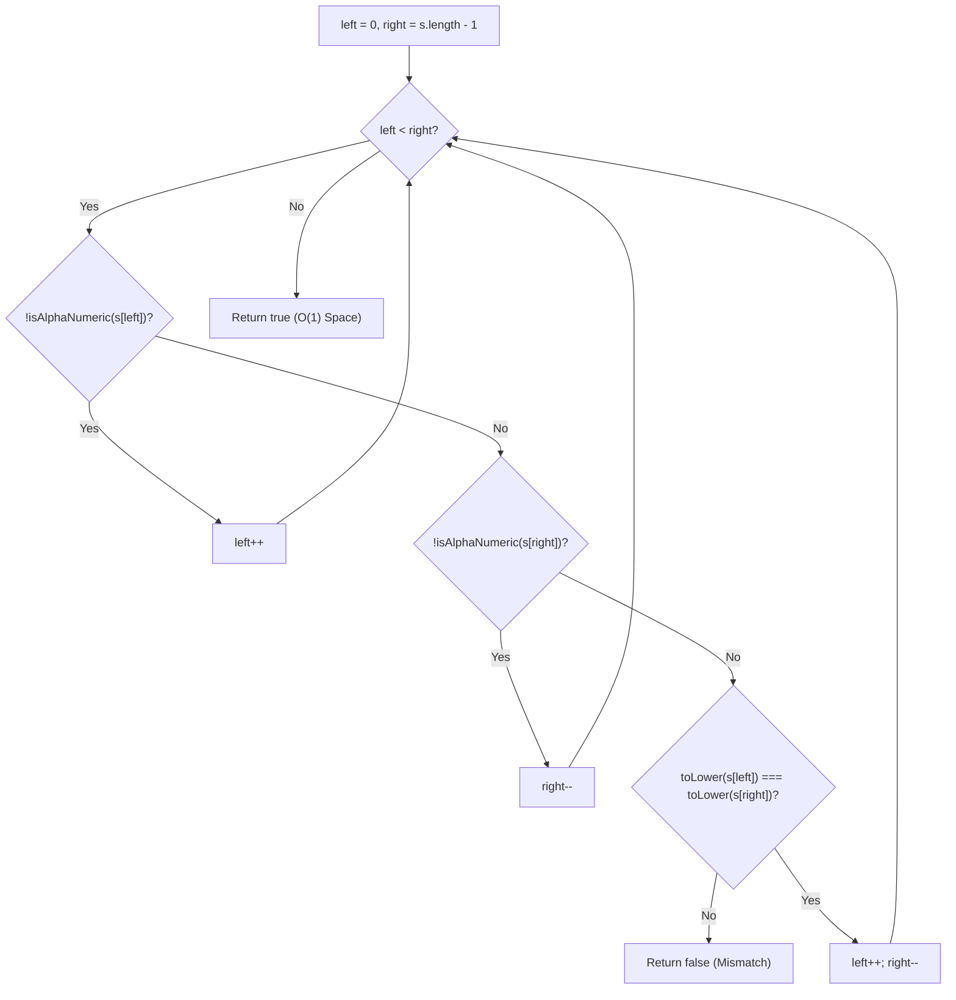
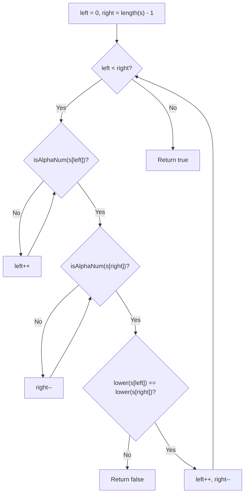

# 125. Valid Palindrome

- **LeetCode Link**: `https://leetcode.com/problems/valid-palindrome/`
- **Difficulty**: Easy
- **Pattern Category**: Two Pointers / String
- **Prerequisite Primer**: `00-foundations/01-two-pointers.md`

---

## 1. Problem Overview & Edge Case Matrix

### Problem Statement
A phrase is a **palindrome** if, after converting all uppercase letters into lowercase letters and removing all non-alphanumeric characters, it reads the same forward and backward. Alphanumeric characters include letters and numbers.

Given a string `s`, return `true` if it is a palindrome, or `false` otherwise.

```
s = "A man, a plan, a canal: Panama"
Cleaned: "amanaplanacanalpanama"
Reads same forward and backward -> Output: true

s = "race a car"
Cleaned: "raceacar" -> Not a palindrome -> Output: false
```

### Upfront Edge Case Matrix

| Edge Case Scenario | Inputs | Expected Output | Pitfall / Failure Mode |
| :--- | :--- | :--- | :--- |
| Empty String or Whitespace Only | `s = "   "` | `true` | Boundary underflow / empty string handling |
| Single Character / Non-Alphanumeric | `s = ".,"` | `true` | Out-of-bounds pointer crossover |
| Single Valid Character | `s = "a"` | `true` | Base case condition |
| Mixed Numeric and Alpha | `s = "0P"` | `false` | Number conversion to character bugs |
| Case-Insensitive Match | `s = "Aa"` | `true` | Forgetting to normalize character casing |

---

## 2. Level 1: Brute Force Approach (Regex Sanitization & String Reversal)

### Intuition & Visual Idea
Use regular expressions to strip all non-alphanumeric characters, convert to lowercase, reverse the string, and check if the reversed string equals the original cleaned string.



### Pseudocode
```text
FUNCTION isPalindromeBruteForce(s):
    cleaned = TO_LOWER(s).REPLACE(/[^a-z0-9]/g, "")
    reversed = REVERSE(cleaned)
    RETURN cleaned == reversed
```

### Step-by-Step Dry Run
`s = "A man, a plan: Panama"`

| Step | Operation | Result |
| :--- | :--- | :--- |
| 1 | Lowercase & Regex Strip | `"amanaplanpanama"` |
| 2 | Reverse String | `"amanaplanpanama"` |
| 3 | Compare Equality | `"amanaplanpanama" === "amanaplanpanama"` $\implies$ `true` |

### Modern JavaScript Implementation
```javascript
/**
 * Level 1: Regex Strip and Reverse
 * Time Complexity:  O(N)
 * Space Complexity: O(N) Auxiliary Space
 */
function isPalindromeBruteForce(s) {
  const cleaned = s.toLowerCase().replace(/[^a-z0-9]/g, '');
  const reversed = cleaned.split('').reverse().join('');
  return cleaned === reversed;
}
```

### Complexity Breakdown
- **Time Complexity**: $O(N)$ — `.toLowerCase()`, `.replace()`, `.split()`, `.reverse()`, and `.join()` each traverse $N$ characters.
- **Space Complexity**: $O(N)$ — Allocates intermediate strings and character arrays in V8 memory.

#### 🎙️ How to Explain to Interviewer (Verbatim Script)
> *"This brute-force approach sanitizes the string using regular expressions and compares the string against its reversed copy. While it runs in $O(N)$ linear time, it performs 5 distinct linear passes and allocates multiple string and array buffers in heap memory, taking $O(N)$ auxiliary space."*

---

## 3. Level 2: Optimized Approach (Array Filtering with Inward Two Pointers)

### Intuition & Visual Bottleneck Elimination
Filter only alphanumeric characters into an array in a single pass, then use two pointers starting at opposite ends moving inward to check for equality.



### Pseudocode
```text
FUNCTION isPalindromeOptimized(s):
    chars = []
    FOR char IN s:
        IF IS_ALPHANUMERIC(char):
            chars.push(TO_LOWER(char))
            
    left = 0, right = chars.length - 1
    WHILE left < right:
        IF chars[left] != chars[right]: RETURN false
        left++
        right--
    RETURN true
```

### Step-by-Step Dry Run
`s = "A man, a plan: Panama"`

| `left` | `right` | `chars[left]` | `chars[right]` | Match? | Action |
| :--- | :--- | :--- | :--- | :--- | :--- |
| 0 | 15 | `'a'` | `'a'` | Yes | `left=1, right=14` |
| 1 | 14 | `'m'` | `'m'` | Yes | `left=2, right=13` |
| 2 | 13 | `'a'` | `'a'` | Yes | `left=3, right=12` |
| ... | ... | ... | ... | Yes | Pointers cross $\implies$ Return `true` |

### Modern JavaScript Implementation
```javascript
/**
 * Level 2: Filtered Array Two Pointers
 * Time Complexity:  O(N)
 * Space Complexity: O(N)
 */
function isPalindromeOptimized(s) {
  const chars = [];
  for (let i = 0; i < s.length; i++) {
    const code = s.charCodeAt(i);
    // 0-9: 48-57, A-Z: 65-90, a-z: 97-122
    if ((code >= 48 && code <= 57) || (code >= 97 && code <= 122)) {
      chars.push(s[i]);
    } else if (code >= 65 && code <= 90) {
      chars.push(String.fromCharCode(code + 32)); // Fast toLowerCase
    }
  }

  let left = 0;
  let right = chars.length - 1;
  while (left < right) {
    if (chars[left] !== chars[right]) {
      return false;
    }
    left++;
    right--;
  }

  return true;
}
```

### Complexity Breakdown
- **Time Complexity**: $O(N)$ — One pass to filter, one pass to verify.
- **Space Complexity**: $O(N)$ auxiliary space for the `chars` array.

#### 🎙️ How to Explain to Interviewer (Verbatim Script)
> *"For **Time Complexity**, this is $O(N)$ linear time. We extract alphanumeric characters into a compact array and verify symmetry using converging two pointers in $N/2$ comparisons.
>
> For **Space Complexity**, it requires $O(N)$ auxiliary space to store the filtered character array."*

---

## 4. Level 3: Most Optimal / Canonical Approach (In-Place Two Pointers with ASCII Helpers)

### Intuition & Invariant Proof
We don't need to allocate ANY auxiliary arrays or strings!
1. Initialize two pointers: `left = 0` and `right = s.length - 1`.
2. While `left < right`:
   - If `s[left]` is not alphanumeric, skip it: `left++`.
   - If `s[right]` is not alphanumeric, skip it: `right--`.
   - If both are alphanumeric, compare case-insensitively. If mismatch $\implies$ return `false`.
   - Advance both: `left++`, `right--`.
3. Return `true`.

```
s = "A   m a n ,   a   p l a n :   P a n a m a"
     ^                                       ^
    left                                   right
left='A', right='a' -> Match! left++, right--
```



### Pseudocode
```text
FUNCTION isAlphaNumeric(code):
    RETURN (code >= 48 AND code <= 57) OR  // 0-9
           (code >= 65 AND code <= 90) OR  // A-Z
           (code >= 97 AND code <= 122)    // a-z

FUNCTION isPalindrome(s):
    left = 0, right = s.length - 1
    WHILE left < right:
        WHILE left < right AND NOT isAlphaNumeric(CODE(s[left])):
            left++
        WHILE left < right AND NOT isAlphaNumeric(CODE(s[right])):
            right--
            
        IF TO_LOWER(s[left]) != TO_LOWER(s[right]):
            RETURN false
            
        left++
        right--
        
    RETURN true
```

### Step-by-Step Dry Run
`s = "0P"`

| Step | `left` | `right` | `s[left]` | `s[right]` | Action | Comparison |
| :--- | :--- | :--- | :--- | :--- | :--- | :--- |
| 1 | 0 | 1 | `'0'` (48) | `'P'` (80) | Both alphanumeric | `'0' !== 'p'` $\implies$ **Return false** |

### Modern JavaScript Implementation
```javascript
/**
 * Level 3: In-Place Converging Two Pointers (Canonical Optimal)
 * Time Complexity:  O(N)
 * Space Complexity: O(1) Auxiliary Space
 */
function isPalindrome(s) {
  let left = 0;
  let right = s.length - 1;

  // Fast ASCII check helper
  const isAlphanumeric = (code) => {
    return (
      (code >= 48 && code <= 57) ||  // 0-9
      (code >= 65 && code <= 90) ||  // A-Z
      (code >= 97 && code <= 122)    // a-z
    );
  };

  while (left < right) {
    // Skip non-alphanumeric characters on left
    while (left < right && !isAlphanumeric(s.charCodeAt(left))) {
      left++;
    }

    // Skip non-alphanumeric characters on right
    while (left < right && !isAlphanumeric(s.charCodeAt(right))) {
      right--;
    }

    // Case-insensitive character comparison
    if (s[left].toLowerCase() !== s[right].toLowerCase()) {
      return false;
    }

    left++;
    right--;
  }

  return true;
}
```

### Complexity Breakdown
- **Time Complexity**: $O(N)$ — Single pass inward scan where each pointer advances at most $N$ times total.
- **Space Complexity**: $O(1)$ auxiliary space — Only two integer pointer variables on the stack.

#### 🎙️ How to Explain to Interviewer (Verbatim Script)
> *"For **Time Complexity**, this runs in $O(N)$ linear time. The two pointers start at opposite ends and converge inward. In each step, we advance pointers over non-alphanumeric characters using constant-time ASCII code checks and compare matching valid characters. Each character in the string is visited at most once.
>
> For **Space Complexity**, this is strictly **$O(1)$ auxiliary space**. We perform all checks directly on the input string without creating any intermediate string copies, sanitized arrays, or regular expression allocations."*

---

## 5. JavaScript-Specific Gotchas & V8 Optimizations
- **ASCII Bounds vs Regex**: Using `s.charCodeAt(i)` with integer range comparisons is up to 10x faster in V8 than repeatedly invoking `/[a-z0-9]/i.test(s[i])` inside a loop.

---

## 6. Real-World MAANG Interview Follow-Ups & Extensions

### Follow-Up 1: Valid Palindrome II (Allowing at Most 1 Deletion)
- **Scenario**: Given a string `s`, return `true` if it can be a palindrome after deleting at most one character (LeetCode 680).
- **Solution Strategy**: When `s[left] !== s[right]`, check if `isSubPalindrome(left + 1, right)` OR `isSubPalindrome(left, right - 1)` is true.
- **JS Code**:
```javascript
function validPalindromeII(s) {
  let left = 0;
  let right = s.length - 1;

  const isPal = (l, r) => {
    while (l < r) {
      if (s[l++] !== s[r--]) return false;
    }
    return true;
  };

  while (left < right) {
    if (s[left] !== s[right]) {
      return isPal(left + 1, right) || isPal(left, right - 1);
    }
    left++;
    right--;
  }

  return true;
}
```

### Follow-Up 2: Handling Multi-Byte Unicode / Emoji Palindromes
- **Scenario**: What if the string contains UTF-16 surrogate pairs (e.g. emojis `😀`)?
- **Solution Strategy**: Use `[...s]` array destructuring or `Intl.Segmenter` to iterate grapheme clusters rather than raw UTF-16 code units.

---

## 7. What LeetCode Discuss Says (Language-Independent)

Source: top-voted post by niits —
`https://leetcode.com/problems/valid-palindrome/solutions/6166160/video-transforming-the-input-string/`
— 135.5K views / 609 votes / 10 comments.
Language-independent summary. No new JS here.

### A. Optimal way from Discuss (Two Pointers In-Place)

The classic solution is to use two pointers, one at the beginning (`left`) and one at the end (`right`). We iterate toward the center. If either pointer points to a non-alphanumeric character, we skip it. If they both point to valid characters, we compare their lowercase versions. If they differ, it's not a palindrome.

```text
FUNCTION isPalindrome(s):
    left = 0
    right = length(s) - 1
    
    WHILE left < right:
        WHILE left < right AND NOT isAlphaNumeric(s[left]):
            left++
        WHILE left < right AND NOT isAlphaNumeric(s[right]):
            right--
            
        IF lower(s[left]) != lower(s[right]):
            RETURN false
            
        left++
        right--
        
    RETURN true
```

- Time: O(N) where N is the length of the string. We traverse the string exactly once.
- Space: O(1) as we use no extra memory and do not allocate new strings.



### B. Dry run on LeetCode Example 1 ("A man, a plan, a canal: Panama")

| Step | `left` char | `right` char | Action | `left` idx | `right` idx |
| :--- | :--- | :--- | :--- | :--- | :--- |
| 1 | 'A' | 'a' | Match (lowercase 'a' == 'a'). Move both. | 1 | 28 |
| 2 | ' ' | 'm' | Skip space on left. | 2 | 28 |
| 3 | 'm' | 'm' | Match ('m' == 'm'). Move both. | 3 | 27 |
| ... | ... | ... | ... | ... | ... |
| N | 'c' | 'c' | Match at the center. `left` meets `right`. | 14 | 14 |

Final state: `left >= right`, loop ends, returns `true`.

### C. Pitfalls from comments

- **The Regex / Filter approach:** The post author notes a "bonus" solution where you can use Regex (`/[^a-zA-Z0-9]/`) to replace all bad characters, then reverse the string. While this is a 1-liner in Python (`s == s[::-1]`), a top comment points out that `replaceAll()` or Regex filtering creates a brand new string and scales poorly (often $O(N \cdot M)$ or $O(N)$ with heavy hidden constants and $O(N)$ space). The two-pointer in-place approach is what interviewers actually want.
- **Nested Loop Guards:** When skipping non-alphanumeric characters with `WHILE` loops inside the main loop, you must re-check `left < right`. If a string is entirely punctuation (e.g., `"   "`), failing to re-check will cause index out-of-bounds exceptions.

### D. Companies

- Discuss post itself names none.
  Companies tab on LeetCode is premium-locked.
- External source:
  `https://github.com/liquidslr/leetcode-company-wise-problems`
  (LeetCode company tags, updated June 2025).
- All-time (56): Accenture, Adobe, Amazon, Apple, Arista Networks, Attentive, Axon, Bloomberg, Cadence, Cisco, Cognizant, Comcast, Deloitte, eBay, Epic Systems, Fidelity, Fortinet, Goldman Sachs, Google, HCL, IBM, Infosys, Intuit, LTI, Meta, Microsoft, Oracle, Roku, Salesforce, SAP, Spotify, TCS, TikTok, Uber, UKG, Visa, VK, Walmart Labs, Wayfair, Whatnot, Yandex, Zenefits, Zoho.
- Recent: 30 days — Amazon, Google, Meta, TCS, Yandex.
- Recent: 3 months — Amazon, Bloomberg, Google, Infosys, Meta, Microsoft, TCS, Yandex.
