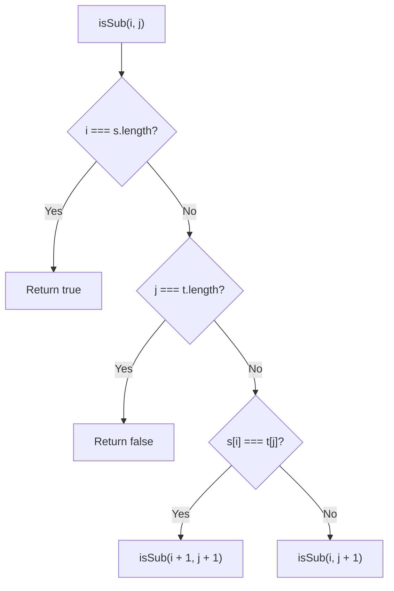
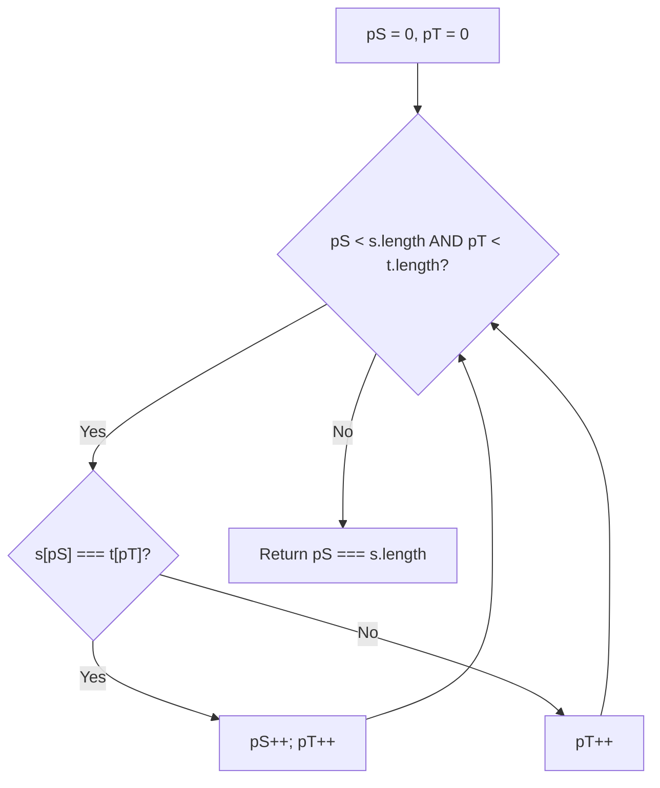
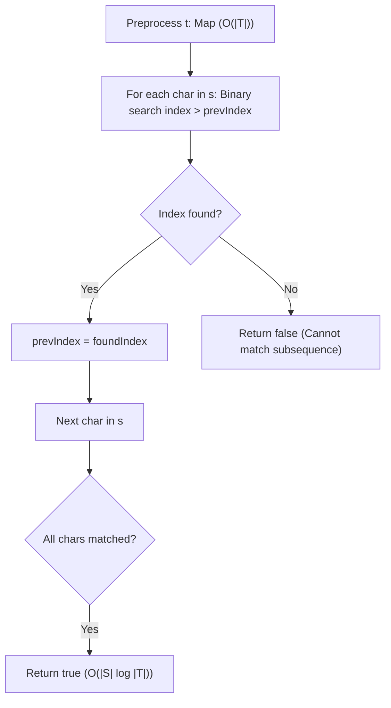
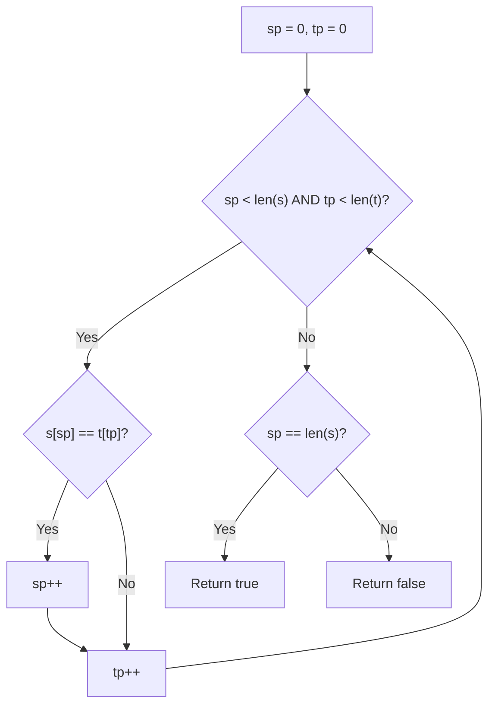

# 392. Is Subsequence

- **LeetCode Link**: `https://leetcode.com/problems/is-subsequence/`
- **Difficulty**: Easy
- **Pattern Category**: Two Pointers / Greedy / Binary Search
- **Prerequisite Primer**: `00-foundations/01-two-pointers.md`

---

## 1. Problem Overview & Edge Case Matrix

### Problem Statement
Given two strings `s` and `t`, return `true` if `s` is a **subsequence** of `t`, or `false` otherwise.

A **subsequence** of a string is a new string that is formed from the original string by deleting some (can be none) of the characters without disturbing the relative positions of the remaining characters. (i.e., `"ace"` is a subsequence of `"abcde"` while `"aec"` is not).

```
s = "abc", t = "ahbgdc"
'a', 'b', 'c' appear in order in t -> Output: true

s = "axc", t = "ahbgdc"
'x' does not appear in t -> Output: false
```

### Upfront Edge Case Matrix

| Edge Case Scenario | Inputs | Expected Output | Pitfall / Failure Mode |
| :--- | :--- | :--- | :--- |
| `s` is Empty | `s = ""`, `t = "ahbgdc"` | `true` | Empty string is always a valid subsequence |
| `t` is Empty (`s` is non-empty) | `s = "b"`, `t = ""` | `false` | Out of bounds index access |
| `s` and `t` are Identical | `s = "abc"`, `t = "abc"` | `true` | Full match termination |
| `s` Longer than `t` | `s = "abcdef"`, `t = "abc"` | `false` | Redundant full scan |

---

## 2. Level 1: Brute Force Approach (Recursive Subsequence Search)

### Intuition & Visual Idea
Recursively compare characters of `s` and `t` from the beginning:
- If `s[i] === t[j]`, advance both `i + 1` and `j + 1`.
- Otherwise, advance only `j + 1` (skip character in `t`).
- Base cases: If `i === s.length`, return `true`. If `j === t.length`, return `false`.



### Pseudocode
```text
FUNCTION isSubsequenceRecursive(s, t, i, j):
    IF i == s.length: RETURN true
    IF j == t.length: RETURN false
    IF s[i] == t[j]:
        RETURN isSubsequenceRecursive(s, t, i + 1, j + 1)
    ELSE:
        RETURN isSubsequenceRecursive(s, t, i, j + 1)
```

### Step-by-Step Dry Run
`s = "abc"`, `t = "ahbgdc"`

| Call | `i` (`s`) | `j` (`t`) | `s[i]` vs `t[j]` | Action |
| :--- | :--- | :--- | :--- | :--- |
| 1 | 0 (`'a'`) | 0 (`'a'`) | Match | Recurse `(1, 1)` |
| 2 | 1 (`'b'`) | 1 (`'h'`) | Mismatch | Recurse `(1, 2)` |
| 3 | 1 (`'b'`) | 2 (`'b'`) | Match | Recurse `(2, 3)` |
| 4 | 2 (`'c'`) | 3 (`'g'`) | Mismatch | Recurse `(2, 4)` |
| 5 | 2 (`'c'`) | 4 (`'d'`) | Mismatch | Recurse `(2, 5)` |
| 6 | 2 (`'c'`) | 5 (`'c'`) | Match | Recurse `(3, 6)` |
| 7 | 3 | 6 | $i == \text{s.length}$ | **Return true** |

### Modern JavaScript Implementation
```javascript
/**
 * Level 1: Recursive Search
 * Time Complexity:  O(|T|)
 * Space Complexity: O(|T|) Call Stack
 */
function isSubsequenceBruteForce(s, t) {
  function check(i, j) {
    if (i === s.length) return true;
    if (j === t.length) return false;

    if (s[i] === t[j]) {
      return check(i + 1, j + 1);
    }
    return check(i, j + 1);
  }

  return check(0, 0);
}
```

### Complexity Breakdown
- **Time Complexity**: $O(|T|)$ — At each step, pointer $j$ advances by 1.
- **Space Complexity**: $O(|T|)$ — Recursion call stack depth up to length of $t$.

#### 🎙️ How to Explain to Interviewer (Verbatim Script)
> *"This recursive approach matches characters sequentially. While it runs in $O(|T|)$ time, in JavaScript each recursive step adds a frame to the V8 call stack. For very large text strings $|T| > 10^4$, this risks throwing a `RangeError: Maximum call stack size exceeded`."*

---

## 3. Level 2: Optimized Approach (Two Pointers Linear Scan)

### Intuition & Visual Bottleneck Elimination
Convert the recursion into an iterative loop using two pointers:
- Pointer `pS` for string `s`.
- Pointer `pT` for string `t`.
Traverse `t`. Whenever `s[pS] === t[pT]`, advance `pS++`. If `pS` reaches `s.length`, return `true` immediately.

```
s: [ a , b , c ]       (pS)
t: [ a , h , b , g , d , c ]  (pT)
Match 'a' -> pS=1, pT=1
Skip  'h' -> pS=1, pT=2
Match 'b' -> pS=2, pT=3
Skip  'g', 'd' -> pS=2, pT=5
Match 'c' -> pS=3 === s.length -> Done!
```



### Pseudocode
```text
FUNCTION isSubsequence(s, t):
    pS = 0, pT = 0
    WHILE pS < s.length AND pT < t.length:
        IF s[pS] == t[pT]:
            pS++
        pT++
    RETURN pS == s.length
```

### Step-by-Step Dry Run
`s = "abc"`, `t = "ahbgdc"`

| `pT` | `t[pT]` | `pS` | `s[pS]` | Comparison | `pS` After |
| :--- | :--- | :--- | :--- | :--- | :--- |
| 0 | `'a'` | 0 | `'a'` | Match | 1 |
| 1 | `'h'` | 1 | `'b'` | Mismatch | 1 |
| 2 | `'b'` | 1 | `'b'` | Match | 2 |
| 3 | `'g'` | 2 | `'c'` | Mismatch | 2 |
| 4 | `'d'` | 2 | `'c'` | Mismatch | 2 |
| 5 | `'c'` | 2 | `'c'` | Match | 3 |
| Result | - | - | - | $pS == 3 == s.length$ | **Return true** |

### Modern JavaScript Implementation
```javascript
/**
 * Level 2: Two Pointers Forward Scan (Canonical Optimal for Single Query)
 * Time Complexity:  O(|T|)
 * Space Complexity: O(1) Auxiliary Space
 */
function isSubsequence(s, t) {
  let pS = 0;
  let pT = 0;
  const sLen = s.length;
  const tLen = t.length;

  while (pS < sLen && pT < tLen) {
    if (s[pS] === t[pT]) {
      pS++;
    }
    pT++;
  }

  return pS === sLen;
}
```

### Complexity Breakdown
- **Time Complexity**: $O(|T|)$ — Single pass over `t`, with early exit if `s` is matched before reaching the end of `t`.
- **Space Complexity**: $O(1)$ auxiliary space — Only two integer pointers.

#### 🎙️ How to Explain to Interviewer (Verbatim Script)
> *"For **Time Complexity**, this is $O(|T|)$ linear time. We advance through `t` using pointer `pT` and increment `pS` each time a matching character is found. The loop executes at most $|T|$ times.
>
> For **Space Complexity**, this is strictly **$O(1)$ auxiliary memory** as we only track two integer pointers."*

---

## 4. Level 3: Most Optimal / Canonical Approach (Precomputed Inverted Index + Binary Search)

### Intuition & The MAANG Follow-Up Scenario
**Follow-Up Problem**: What if there are **$K = 10^9$ incoming query strings $s_1, s_2, \dots$** to test against the same fixed, massive target string $t$?
Running Level 2 would take $O(K \times |T|)$ which times out.

Instead, we precompute a character-to-indices hash map for $t$:
`Map<char, Array<indices>>`.
For each character in query string $s$:
- Use **Binary Search** (`upper_bound`) on the list of indices of that character to find the smallest index greater than our current position in $t$.
- Time per query drops from $O(|T|)$ down to **$O(|S| \log |T|)$**!

```
t = "a h b g d c a"
Map:
'a' -> [0, 6]
'b' -> [2]
'c' -> [5]
'd' -> [4]
'g' -> [3]
'h' -> [1]

For s = "abc":
1. Find smallest index for 'a' > -1 -> 0 (curr = 0)
2. Find smallest index for 'b' > 0  -> 2 (curr = 2)
3. Find smallest index for 'c' > 2  -> 5 (curr = 5) -> Valid!
```



### Pseudocode
```text
CLASS SubsequenceChecker:
    INIT(t):
        this.charIndices = new Map()
        FOR i FROM 0 TO t.length - 1:
            this.charIndices[t[i]].push(i)

    METHOD isSubsequence(s):
        currIndex = -1
        FOR char IN s:
            IF NOT this.charIndices.has(char): RETURN false
            list = this.charIndices.get(char)
            nextIdx = binarySearchFirstGreaterThan(list, currIndex)
            IF nextIdx == -1: RETURN false
            currIndex = nextIdx
        RETURN true
```

### Step-by-Step Dry Run
`t = "ahbgdc"`, `s = "abc"`, `indexMap = {'a':[0], 'b':[2], 'c':[5], 'd':[4], 'g':[3], 'h':[1]}`

| Query Char `s[i]` | Target `currIdx` | Candidate Indices in `t` | Binary Search Match | `currIdx` After |
| :--- | :--- | :--- | :--- | :--- |
| `'a'` | $-1$ | `[0]` | $0 > -1 \implies 0$ | 0 |
| `'b'` | $0$ | `[2]` | $2 > 0 \implies 2$ | 2 |
| `'c'` | $2$ | `[5]` | $5 > 2 \implies 5$ | 5 |
| Result | - | - | All characters found in ascending order | **Return true** |

### Modern JavaScript Implementation
```javascript
/**
 * Level 3: Binary Search Index Lookup (Optimal for Massive Multi-Query System)
 * Preprocessing Time:  O(|T|)
 * Query Time:          O(|S| * log(|T|))
 * Space Complexity:    O(|T|)
 */
class SubsequenceMatcher {
  constructor(t) {
    this.indexMap = new Map();
    for (let i = 0; i < t.length; i++) {
      const char = t[i];
      if (!this.indexMap.has(char)) {
        this.indexMap.set(char, []);
      }
      this.indexMap.get(char).push(i);
    }
  }

  isSubsequence(s) {
    let currIdx = -1;

    for (let i = 0; i < s.length; i++) {
      const char = s[i];
      if (!this.indexMap.has(char)) return false;

      const indices = this.indexMap.get(char);
      // Binary search for smallest index > currIdx
      const nextIdx = this._binarySearchFirstGreater(indices, currIdx);
      if (nextIdx === -1) return false;

      currIdx = nextIdx;
    }

    return true;
  }

  _binarySearchFirstGreater(arr, target) {
    let left = 0;
    let right = arr.length - 1;
    let result = -1;

    while (left <= right) {
      const mid = left + ((right - left) >> 1);
      if (arr[mid] > target) {
        result = arr[mid];
        right = mid - 1; // Try finding smaller index
      } else {
        left = mid + 1;
      }
    }

    return result;
  }
}
```

### Complexity Breakdown
- **Preprocessing Time**: $O(|T|)$ — Single pass to build index lists.
- **Query Time**: $O(|S| \log |T|)$ — For each character in $S$, binary search over at most $|T|$ indices.
- **Space Complexity**: $O(|T|)$ — Stores all indices of characters in `t`.

#### 🎙️ How to Explain to Interviewer (Verbatim Script)
> *"For a single query, Two Pointers in $O(|T|)$ time and $O(1)$ space is optimal. However, if the interviewer poses the follow-up where $t$ is static and we receive millions of query strings $s_i$, we precompute an inverted index of $t$ mapping each character to its sorted list of occurrence indices in $O(|T|)$ space.
>
> For each query $s$, we locate the next valid position using Binary Search (`upper_bound`), reducing query time from $O(|T|)$ down to $O(|S| \log |T|)$."*

---

## 5. JavaScript-Specific Gotchas & V8 Optimizations
- **Empty String Subsequence**: `if (s.length === 0) return true;` is mathematically true since the empty string is a prefix of every string.

---

## 6. Real-World MAANG Interview Follow-Ups & Extensions

### Follow-Up 1: Longest Word in Dictionary That is a Subsequence
- **Scenario**: Given a string $t$ and a list of dictionary words, find the longest word in the dictionary that is a subsequence of $t$ (LeetCode 524).
- **Solution Strategy**: Sort dictionary by length descending, then test words using `isSubsequence`.

### Follow-Up 2: Shortest Way to Form String
- **Scenario**: Find minimum number of subsequences of $t$ needed to concatenate into $s$ (LeetCode 1055).
- **Solution Strategy**: Greedy Two Pointers restarting at beginning of $t$ each time no further character can be matched.

---

## 7. What LeetCode Discuss Says (Language-Independent)

Source: top-voted post by niits —
`https://leetcode.com/problems/is-subsequence/solutions/3034947/video-two-pointer-solution/`
— 45.7K views / 252 votes / 7 comments.
Language-independent summary. No new JS here.

### A. Optimal way from Discuss (Two Pointers)

To check if `s` is a subsequence of `t`, we must find all characters of `s` inside `t` in the correct relative order. We can use two pointers: `sp` pointing to `s` and `tp` pointing to `t`. We iterate through `t`, and whenever the character in `t` matches the character in `s`, we advance `sp`. If `sp` reaches the end of `s`, we found the whole subsequence.

```text
FUNCTION isSubsequence(s, t):
    sp = 0
    tp = 0
    
    WHILE sp < length(s) AND tp < length(t):
        IF s[sp] == t[tp]:
            sp++
        tp++
        
    RETURN sp == length(s)
```

- Time: O(T) where T is the length of string `t`. We traverse `t` at most once.
- Space: O(1) using only two integer pointers.



### B. Dry run on LeetCode Example 1 (s = "abc", t = "ahbgdc")

| Step | `sp` | `s[sp]` | `tp` | `t[tp]` | Match? | Action |
| :--- | :--- | :--- | :--- | :--- | :--- | :--- |
| 1 | 0 | 'a' | 0 | 'a' | Yes | `sp++`, `tp++` |
| 2 | 1 | 'b' | 1 | 'h' | No | `tp++` |
| 3 | 1 | 'b' | 2 | 'b' | Yes | `sp++`, `tp++` |
| 4 | 2 | 'c' | 3 | 'g' | No | `tp++` |
| 5 | 2 | 'c' | 4 | 'd' | No | `tp++` |
| 6 | 2 | 'c' | 5 | 'c' | Yes | `sp++`, `tp++` |
| 7 | 3 | (end)| 6 | (end)| - | Loop ends. |

Result: `sp` (3) == `length(s)` (3), returns true.

### C. Pitfalls from comments

- **Using built-in `indexOf`:** Some attempts loop over `s` and use `t.indexOf(char, lastIndex)` to find the next character. While this works and often performs well in modern standard libraries, the Two Pointers manual loop is explicitly $O(T)$ in the worst case without any hidden overhead, and demonstrates algorithmic understanding.
- **Dynamic Programming overkill:** Since this question is often grouped with DP string questions (like Longest Common Subsequence), some users write an $O(S \cdot T)$ 2D matrix DP solution. This is massive overkill in time and space when a simple greedy $O(T)$ match is guaranteed to work because any valid match prefix preserves the possibility of finding the remaining suffix.

### D. Companies

- Discuss post itself names none.
  Companies tab on LeetCode is premium-locked.
- External source:
  `https://github.com/liquidslr/leetcode-company-wise-problems`
  (LeetCode company tags, updated June 2025).
- All-time (15): Adobe, Amazon, Bloomberg, Goldman Sachs, Google, Infosys, Meta, Microsoft, Pinterest, Qualcomm, Tesla, Tinkoff, Wix, Yandex, Zoho.
- Recent: 30 days — (none).
- Recent: 3 months — Amazon.
