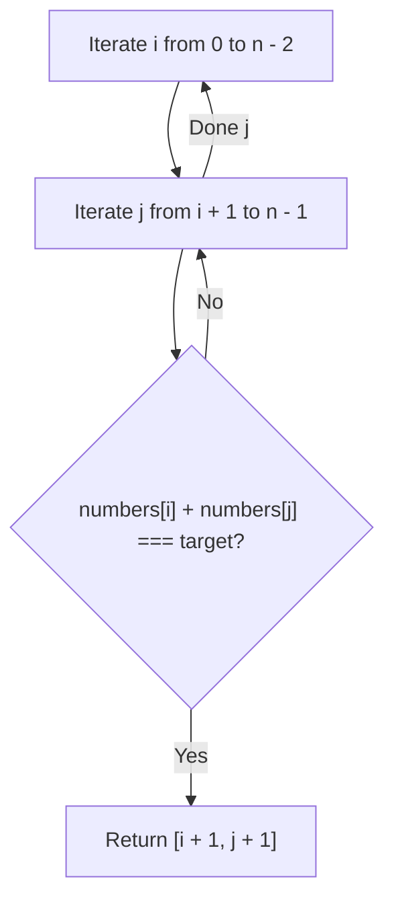
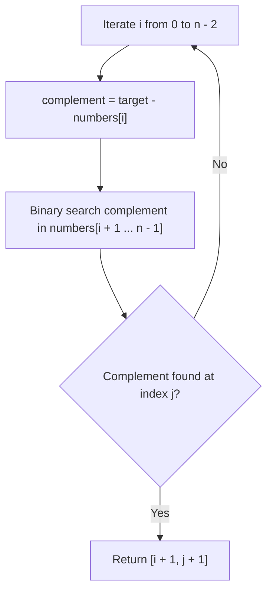
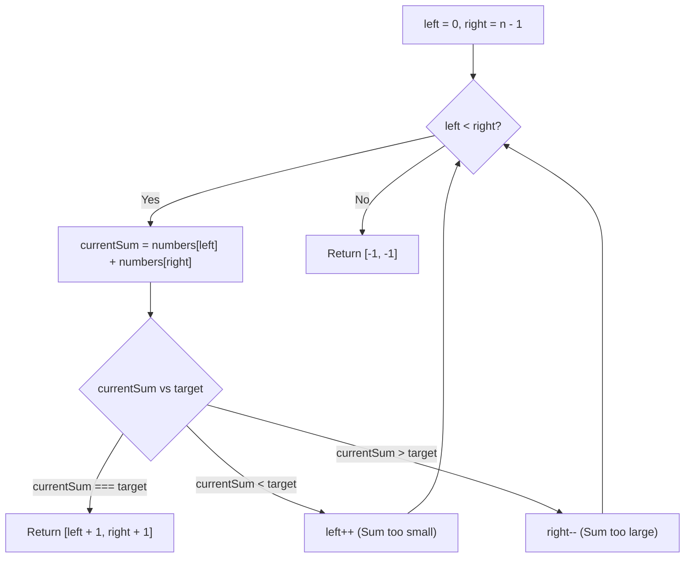
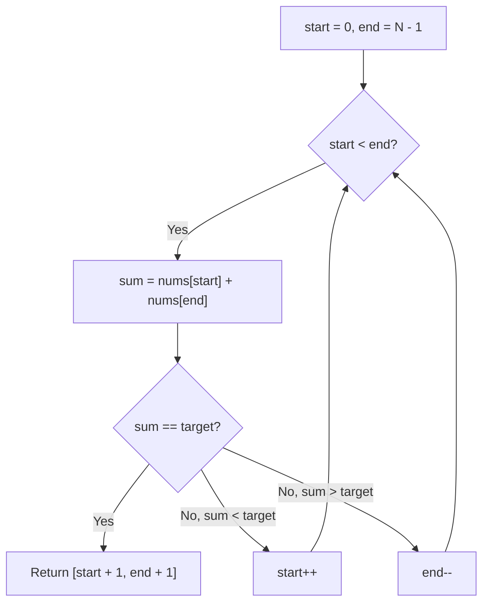

# 167. Two Sum II - Input Array Is Sorted

- **LeetCode Link**: `https://leetcode.com/problems/two-sum-ii-input-array-is-sorted/`
- **Difficulty**: Medium
- **Pattern Category**: Two Pointers / Binary Search
- **Prerequisite Primer**: `00-foundations/01-two-pointers.md`

---

## 1. Problem Overview & Edge Case Matrix

### Problem Statement
Given a **1-indexed** array of integers `numbers` that is already **sorted in non-decreasing order**, find two numbers such that they add up to a specific `target` number.

Return the indices of the two numbers, `index1` and `index2`, added by one as an integer array `[index1, index2]` of length 2.

The tests are generated such that there is **exactly one solution**. You may not use the same element twice. Your solution must use only **$O(1)$ extra space**.

```
numbers = [ 2 , 7 , 11 , 15 ] , target = 9
numbers[0] + numbers[1] = 2 + 7 = 9
Return 1-indexed positions: [ 1 , 2 ]
```

### Upfront Edge Case Matrix

| Edge Case Scenario | Inputs | Expected Output | Pitfall / Failure Mode |
| :--- | :--- | :--- | :--- |
| Exact Two Elements | `numbers = [2, 3]`, `target = 5` | `[1, 2]` | Loop bounds terminating prematurely |
| Negative Numbers | `numbers = [-3, -1, 0, 4]`, `target = -4` | `[1, 2]` | Absolute value assumption bugs |
| Duplicate Numbers Adding to Target | `numbers = [0, 0, 3, 4]`, `target = 0` | `[1, 2]` | Using same element twice (`left === right`) |
| 1-Indexed Return Requirement | `numbers = [1, 2]`, `target = 3` | `[1, 2]` | Returning 0-indexed `[0, 1]` |

---

## 2. Level 1: Brute Force Approach (Nested Pairs Check)

### Intuition & Visual Idea
Test every possible pair $(i, j)$ where $j > i$. If `numbers[i] + numbers[j] === target`, return `[i + 1, j + 1]`.



### Pseudocode
```text
FUNCTION twoSumBruteForce(numbers, target):
    n = numbers.length
    FOR i FROM 0 TO n - 2:
        FOR j FROM i + 1 TO n - 1:
            IF numbers[i] + numbers[j] == target:
                RETURN [i + 1, j + 1]
    RETURN [-1, -1]
```

### Step-by-Step Dry Run
`numbers = [2, 7, 11, 15]`, `target = 9`

| `i` | `j` | `numbers[i]` | `numbers[j]` | Sum | Sum === Target? | Action |
| :--- | :--- | :--- | :--- | :--- | :--- | :--- |
| 0 | 1 | 2 | 7 | 9 | **Yes** | Return `[0 + 1, 1 + 1] = [1, 2]` |

### Modern JavaScript Implementation
```javascript
/**
 * Level 1: Brute Force Nested Pairs
 * Time Complexity:  O(N^2)
 * Space Complexity: O(1)
 */
function twoSumBruteForce(numbers, target) {
  const n = numbers.length;
  for (let i = 0; i < n - 1; i++) {
    for (let j = i + 1; j < n; j++) {
      if (numbers[i] + numbers[j] === target) {
        return [i + 1, j + 1];
      }
    }
  }
  return [-1, -1];
}
```

### Complexity Breakdown
- **Time Complexity**: $O(N^2)$ — Up to $\frac{N(N-1)}{2}$ pair evaluations.
- **Space Complexity**: $O(1)$ auxiliary space.

#### 🎙️ How to Explain to Interviewer (Verbatim Script)
> *"This brute-force approach checks every pairwise sum. With $N$ elements, there are $O(N^2)$ possible pairs. It ignores the critical constraint that the input array is already sorted, resulting in quadratic runtime."*

---

## 3. Level 2: Optimized Approach (Binary Search for Complement)

### Intuition & Visual Bottleneck Elimination
Since the array is sorted, for each index $i$, we can search for the complement `complement = target - numbers[i]` in the remaining subarray `[i + 1 ... n - 1]` using **Binary Search** in $O(\log N)$ time.



### Pseudocode
```text
FUNCTION twoSumBinarySearch(numbers, target):
    FOR i FROM 0 TO numbers.length - 2:
        complement = target - numbers[i]
        j = binarySearch(numbers, i + 1, numbers.length - 1, complement)
        IF j != -1:
            RETURN [i + 1, j + 1]
    RETURN [-1, -1]
```

### Step-by-Step Dry Run
`numbers = [2, 7, 11, 15]`, `target = 9`

| `i` | `numbers[i]` | `complement = 9 - numbers[i]` | Binary Search Range | Found Index `j` | Result |
| :--- | :--- | :--- | :--- | :--- | :--- |
| 0 | 2 | 7 | `[1 ... 3]` (`[7, 11, 15]`) | Index 1 | Return `[1, 2]` |

### Modern JavaScript Implementation
```javascript
/**
 * Level 2: Binary Search for Complement
 * Time Complexity:  O(N log N)
 * Space Complexity: O(1) Auxiliary Space
 */
function twoSumBinarySearch(numbers, target) {
  const n = numbers.length;

  for (let i = 0; i < n - 1; i++) {
    const complement = target - numbers[i];
    let left = i + 1;
    let right = n - 1;

    while (left <= right) {
      const mid = left + ((right - left) >> 1);
      if (numbers[mid] === complement) {
        return [i + 1, mid + 1];
      } else if (numbers[mid] < complement) {
        left = mid + 1;
      } else {
        right = mid - 1;
      }
    }
  }

  return [-1, -1];
}
```

### Complexity Breakdown
- **Time Complexity**: $O(N \log N)$ — We iterate through $N$ elements, executing a binary search taking $O(\log N)$ steps for each element.
- **Space Complexity**: $O(1)$ auxiliary space.

#### 🎙️ How to Explain to Interviewer (Verbatim Script)
> *"For **Time Complexity**, this runs in $O(N \log N)$ time. For each of the $N$ elements, we leverage the sorted property to search for its target complement using binary search in logarithmic time $O(\log N)$.
>
> For **Space Complexity**, it is $O(1)$ auxiliary space because binary search is executed iteratively with pointers."*

---

## 4. Level 3: Most Optimal / Canonical Approach (Opposing Two Pointers Convergence)

### Intuition & Invariant Proof
Place two pointers at opposite extremes: `left = 0` (smallest element) and `right = n - 1` (largest element).
Let `currentSum = numbers[left] + numbers[right]`:
- **If `currentSum === target`**: Solution found! Return `[left + 1, right + 1]`.
- **If `currentSum < target`**: The sum is too small. Because `numbers` is sorted, no element paired with `numbers[left]` can reach `target`. We must increment `left++` to increase the sum.
- **If `currentSum > target`**: The sum is too large. No element paired with `numbers[right]` can be small enough to reach `target`. We must decrement `right--` to decrease the sum.

```
numbers = [ 2 , 7 , 11 , 15 ] , target = 9
            ^             ^
           left          right
Sum = 2 + 15 = 17 > 9 -> right--

numbers = [ 2 , 7 , 11 , 15 ]
            ^        ^
           left     right
Sum = 2 + 11 = 13 > 9 -> right--

numbers = [ 2 , 7 , 11 , 15 ]
            ^   ^
           left right
Sum = 2 + 7 = 9 === target -> Return [1, 2]!
```



### Pseudocode
```text
FUNCTION twoSum(numbers, target):
    left = 0
    right = numbers.length - 1
    
    WHILE left < right:
        sum = numbers[left] + numbers[right]
        IF sum == target:
            RETURN [left + 1, right + 1]
        ELSE IF sum < target:
            left++
        ELSE:
            right--
            
    RETURN [-1, -1]
```

### Step-by-Step Dry Run
`numbers = [2, 7, 11, 15]`, `target = 9`

| Step | `left` | `right` | `numbers[left]` | `numbers[right]` | `currentSum` | Comparison | Action |
| :--- | :--- | :--- | :--- | :--- | :--- | :--- | :--- |
| 1 | 0 | 3 | 2 | 15 | 17 | $17 > 9$ | `right = 2` |
| 2 | 0 | 2 | 2 | 11 | 13 | $13 > 9$ | `right = 1` |
| 3 | 0 | 1 | 2 | 7 | 9 | $9 === 9$ | **Return `[1, 2]`** |

### Modern JavaScript Implementation
```javascript
/**
 * Level 3: Opposing Two Pointers (Canonical Optimal)
 * Time Complexity:  O(N)
 * Space Complexity: O(1) Auxiliary Space
 */
function twoSum(numbers, target) {
  let left = 0;
  let right = numbers.length - 1;

  while (left < right) {
    const currentSum = numbers[left] + numbers[right];

    if (currentSum === target) {
      return [left + 1, right + 1];
    } else if (currentSum < target) {
      left++;
    } else {
      right--;
    }
  }

  return [-1, -1];
}
```

### Complexity Breakdown
- **Time Complexity**: $O(N)$ — Single pass where in each step either `left` increments or `right` decrements, taking at most $N$ iterations.
- **Space Complexity**: $O(1)$ auxiliary space — Strictly two primitive integer pointers.

#### 🎙️ How to Explain to Interviewer (Verbatim Script)
> *"For **Time Complexity**, this runs in $O(N)$ linear time. The two pointers begin at the opposite boundaries of the sorted array and move inward monotonically. Each step discards one row or column of the conceptual search matrix in $O(1)$ time, guaranteeing that we find the unique target pair in at most $N$ iterations.
>
> For **Space Complexity**, this is strictly **$O(1)$ auxiliary memory**. We mutate no inputs and maintain only two scalar indices on the call stack."*

---

## 5. JavaScript-Specific Gotchas & V8 Optimizations
- **1-Based Indexing**: Always remember that the question asks for 1-based indexing (`[left + 1, right + 1]`).
- **No Integer Overflow on Sum**: In JavaScript, numbers are 64-bit double precision floats up to $9 \times 10^{15}$, so standard addition `numbers[left] + numbers[right]` will never overflow for 32-bit integer inputs.

---

## 6. Real-World MAANG Interview Follow-Ups & Extensions

### Follow-Up 1: 3Sum / K-Sum Extension
- **Scenario**: How does this algorithm extend to 3 numbers summing to 0 (LeetCode 15) or $K$ numbers summing to target (LeetCode 18)?
- **Solution Strategy**: Fix the first $K - 2$ numbers with outer loops and reduce the innermost two variables to this $O(N)$ Two Pointers subproblem, achieving $O(N^{K-1})$ time.

### Follow-Up 2: Streaming Pair Sum on Infinite Sorted Feed
- **Scenario**: What if numbers arrive continuously as an infinite sorted stream?
- **Solution**: Maintain a bounded window buffer and hash map with expiration timestamps.

---

## 7. What LeetCode Discuss Says (Language-Independent)

Source: top-voted post by Shashikant Pandey —
`https://leetcode.com/problems/two-sum-ii-input-array-is-sorted/solutions/51249/best-optimal-solution-beats-100-java-c-python-javascript/`
— 24.6K views / 122 votes / 2 comments. (Note: Many older identical solutions exist with 500K+ views, sharing the same logic).
Language-independent summary. No new JS here.

### A. Optimal way from Discuss (Two Pointers)

Because the array is already sorted, we can avoid the typical $O(N)$ space Hash Map approach used in standard Two Sum. Instead, place one pointer at the start and one at the end. Check the sum of the values. If the sum is too small, move the start pointer up to get a larger value. If it's too big, move the end pointer down.

```text
FUNCTION twoSum(numbers, target):
    start = 0
    end = length(numbers) - 1
    
    WHILE start < end:
        sum = numbers[start] + numbers[end]
        
        IF sum == target:
            RETURN [start + 1, end + 1] // 1-based indexing
        ELSE IF sum < target:
            start++
        ELSE:
            end--
```

- Time: O(N) where N is length of numbers. We process each element at most once.
- Space: O(1) using only two integer pointers.



### B. Dry run on LeetCode Example 1 ([2, 7, 11, 15], target = 9)

| Step | `start` | `end` | `nums[start]` | `nums[end]` | Sum | Action |
| :--- | :--- | :--- | :--- | :--- | :--- | :--- |
| 1 | 0 | 3 | 2 | 15 | 17 | 17 > 9. Move `end` down (`end--`). |
| 2 | 0 | 2 | 2 | 11 | 13 | 13 > 9. Move `end` down (`end--`). |
| 3 | 0 | 1 | 2 | 7 | 9 | 9 == 9. Match found. |

Returns `[0 + 1, 1 + 1]` = `[1, 2]`.

### C. Pitfalls from comments

- **Using a HashMap:** In a regular Two Sum problem, you use a HashMap ($O(N)$ space). Many people reflexively use a HashMap here. While it will pass the time constraints, it fails the problem's explicit requirement: *Your solution must use only constant extra space.*
- **Binary Search Approach:** Since the array is sorted, you *could* pick a number and do a binary search for the complement. However, that takes $O(N \log N)$ time, which is worse than the Two Pointers $O(N)$ approach.
- **1-based Indexing:** A very common mistake is returning `[start, end]`. The problem statement explicitly requires returning the indices as a 1-indexed array, so you must return `[start + 1, end + 1]`.

### D. Companies

- Discuss post itself names none.
  Companies tab on LeetCode is premium-locked.
- External source:
  `https://github.com/liquidslr/leetcode-company-wise-problems`
  (LeetCode company tags, updated June 2025).
- All-time (15): Adobe, Amazon, Apple, Bloomberg, EPAM Systems, Google, Infosys, Meta, Microsoft, Oracle, TCS, TikTok, Visa, Yandex, Zoho.
- Recent: 30 days — Amazon, Google.
- Recent: 3 months — Amazon, Google, Meta, Microsoft, TCS.
