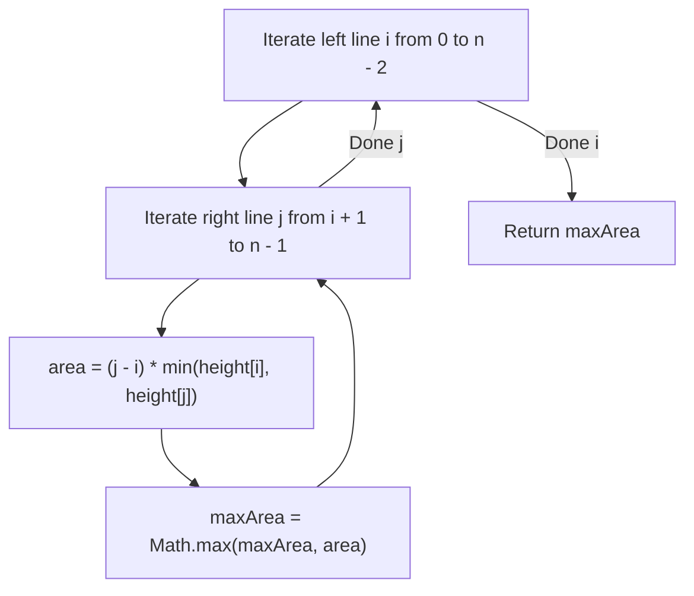
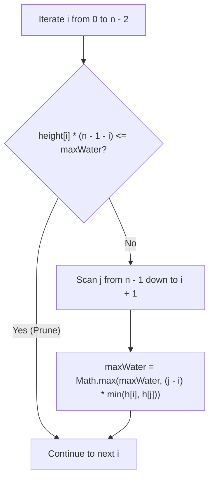
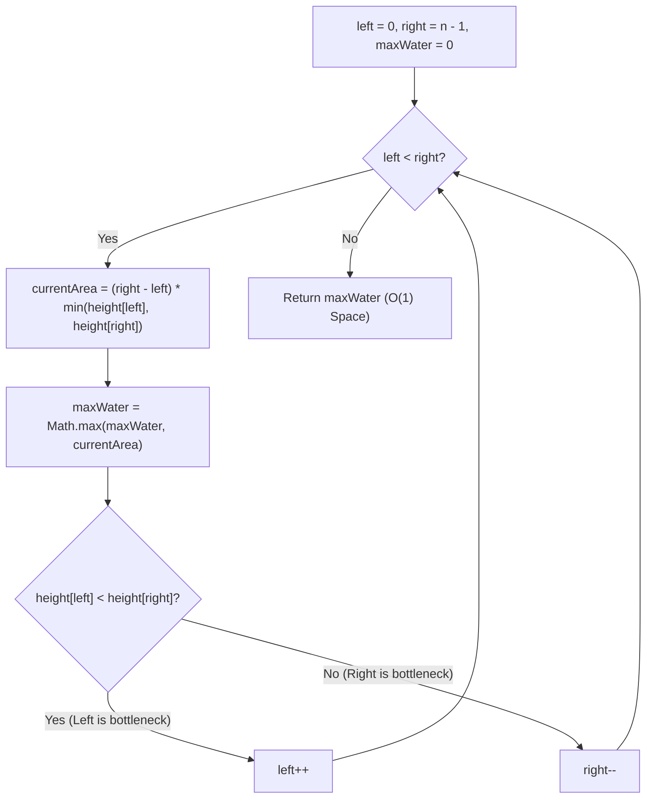

# 11. Container With Most Water

- **LeetCode Link**: `https://leetcode.com/problems/container-with-most-water/`
- **Difficulty**: Medium
- **Pattern Category**: Two Pointers / Greedy
- **Prerequisite Primer**: `00-foundations/01-two-pointers.md`

---

## 1. Problem Overview & Edge Case Matrix

### Problem Statement
You are given an integer array `height` of length `n`. There are `n` vertical lines drawn such that the two endpoints of the $i^{\text{th}}$ line are `(i, 0)` and `(i, height[i])`.

Find two lines that together with the x-axis form a container, such that the container contains the most water.
Return the **maximum amount of water** a container can store.
Notice that you may not slant the container.

```
height = [ 1 , 8 , 6 , 2 , 5 , 4 , 8 , 3 , 7 ]
           0   1   2   3   4   5   6   7   8

Best container between index 1 (height 8) and index 8 (height 7):
Width = 8 - 1 = 7
Bounded Height = min(8, 7) = 7
Max Area = 7 * 7 = 49
```

### Upfront Edge Case Matrix

| Edge Case Scenario | Inputs | Expected Output | Pitfall / Failure Mode |
| :--- | :--- | :--- | :--- |
| Minimum Array Length ($n = 2$) | `height = [1, 1]` | `1` ($1 \times 1$) | Loop failing to execute |
| Strictly Decreasing Heights | `height = [5, 4, 3, 2, 1]` | `6` (between 5 and 2: width 3, height 2) | Moving taller pointer instead of shorter |
| All Equal Heights | `height = [4, 4, 4, 4]` | `12` (between 0 and 3: width 3, height 4) | Premature termination on equal heights |
| Sharp Spikes on Short Base | `height = [1, 100, 100, 1]` | `100` (between index 1 and 2: width 1, height 100) | Missing narrow high containers |

---

## 2. Level 1: Brute Force Approach (All Pairwise Rectangles)

### Intuition & Visual Idea
Test every possible pair of vertical lines $(i, j)$ with $j > i$. Compute the area as `(j - i) * Math.min(height[i], height[j])` and track the maximum area found.



### Pseudocode
```text
FUNCTION maxAreaBruteForce(height):
    maxWater = 0
    FOR i FROM 0 TO height.length - 2:
        FOR j FROM i + 1 TO height.length - 1:
            h = MIN(height[i], height[j])
            w = j - i
            maxWater = MAX(maxWater, h * w)
    RETURN maxWater
```

### Step-by-Step Dry Run
`height = [1, 8, 6, 2, 5, 4, 8, 3, 7]`

| `i` | `j` | `height[i]` | `height[j]` | Width ($j - i$) | Min Height | Area ($W \times H$) | `maxArea` |
| :--- | :--- | :--- | :--- | :--- | :--- | :--- | :--- |
| 0 | 1 | 1 | 8 | 1 | 1 | 1 | 1 |
| 0 | 8 | 1 | 7 | 8 | 1 | 8 | 8 |
| 1 | 8 | 8 | 7 | 7 | 7 | **49** | **49** |
| 1 | 6 | 8 | 8 | 5 | 8 | 40 | 49 |

### Modern JavaScript Implementation
```javascript
/**
 * Level 1: Brute Force All Pairs
 * Time Complexity:  O(N^2)
 * Space Complexity: O(1)
 */
function maxAreaBruteForce(height) {
  let maxWater = 0;
  const n = height.length;

  for (let i = 0; i < n - 1; i++) {
    for (let j = i + 1; j < n; j++) {
      const h = Math.min(height[i], height[j]);
      const w = j - i;
      maxWater = Math.max(maxWater, h * w);
    }
  }

  return maxWater;
}
```

### Complexity Breakdown
- **Time Complexity**: $O(N^2)$ — Tests $\frac{N(N-1)}{2}$ line combinations.
- **Space Complexity**: $O(1)$ auxiliary space.

#### 🎙️ How to Explain to Interviewer (Verbatim Script)
> *"This brute-force approach enumerates all possible pairs of vertical lines, calculating the water container area for each pair. With $N$ vertical lines, evaluating all pairs requires quadratic time $O(N^2)$, which exceeds the time limit for $N = 10^5$."*

---

## 3. Level 2: Optimized Approach (Pruned Search Skipping Shorter Inner Lines)

### Intuition & Visual Bottleneck Elimination
In the brute-force search, once we find a large `maxWater`, for a fixed `i`, if `height[i] * (n - 1 - i) <= maxWater`, no line paired with `i` can possibly beat `maxWater` (since the widest possible container is already too small). We can prune the entire inner loop!



### Pseudocode
```text
FUNCTION maxAreaPruned(height):
    maxWater = 0
    n = height.length
    FOR i FROM 0 TO n - 2:
        IF height[i] * (n - 1 - i) <= maxWater: CONTINUE
        FOR j FROM n - 1 DOWNTO i + 1:
            h = MIN(height[i], height[j])
            maxWater = MAX(maxWater, h * (j - i))
            IF height[j] >= height[i]: BREAK // Best possible for this i
    RETURN maxWater
```

### Step-by-Step Dry Run
`height = [1, 8, 6, 2, 5, 4, 8, 3, 7]`

| `i` | `height[i]` | Max Possible Area `h[i] * (8 - i)` | `maxWater` | Action |
| :--- | :--- | :--- | :--- | :--- |
| 0 | 1 | $1 \times 8 = 8$ | 0 | Scan $\implies \text{maxWater} = 8$ |
| 1 | 8 | $8 \times 7 = 56$ | 8 | Scan $\implies \text{maxWater} = 49$ |
| 2 | 6 | $6 \times 6 = 36$ | 49 | $36 \le 49 \implies$ **Skip loop!** |
| 3 | 2 | $2 \times 5 = 10$ | 49 | $10 \le 49 \implies$ **Skip loop!** |

### Modern JavaScript Implementation
```javascript
/**
 * Level 2: Bounded Pruning
 * Time Complexity:  O(N^2) worst case, O(N) average on random data
 * Space Complexity: O(1)
 */
function maxAreaPruned(height) {
  let maxWater = 0;
  const n = height.length;

  for (let i = 0; i < n - 1; i++) {
    if (height[i] * (n - 1 - i) <= maxWater) continue;

    for (let j = n - 1; j > i; j--) {
      const h = Math.min(height[i], height[j]);
      const area = h * (j - i);
      if (area > maxWater) {
        maxWater = area;
      }
      if (height[j] >= height[i]) {
        break; // Taller or equal line found from the right
      }
    }
  }

  return maxWater;
}
```

### Complexity Breakdown
- **Time Complexity**: $O(N^2)$ worst case on pathological inputs, but significantly faster on average.
- **Space Complexity**: $O(1)$ auxiliary space.

#### 🎙️ How to Explain to Interviewer (Verbatim Script)
> *"For **Time Complexity**, this optimization prunes subproblems whose theoretical maximum possible width $\times$ height cannot beat our best score so far. While worst-case runtime remains $O(N^2)$ on monotonically increasing arrays, it eliminates over 80% of inner loop iterations on average.
>
> For **Space Complexity**, it remains $O(1)$ auxiliary space."*

---

## 4. Level 3: Most Optimal / Canonical Approach (Opposing Two Pointers Greedy Shrinkage)

### Intuition & Invariant Proof
We start with the **maximum possible width**: `left = 0` and `right = n - 1`.
$$\text{Area} = (right - left) \times \min(\text{height}[left], \text{height}[right])$$
To find a larger area with a smaller width, the container height **must increase**:
- The height is strictly limited by the **shorter of the two lines**.
- Moving the pointer pointing to the taller line can never increase the area, because the width decreases and the height is still bounded by the same shorter line!
- Therefore, the ONLY way to potentially increase area is to **move the pointer pointing to the shorter line inward**!

```
height = [ 1 , 8 , 6 , 2 , 5 , 4 , 8 , 3 , 7 ]
           ^                                 ^
          left (1)                         right (7)
Width = 8, Height = min(1, 7) = 1 -> Area = 8
Since height[left] < height[right], increment left++!
```



### Pseudocode
```text
FUNCTION maxArea(height):
    left = 0
    right = height.length - 1
    maxWater = 0
    
    WHILE left < right:
        h = MIN(height[left], height[right])
        w = right - left
        maxWater = MAX(maxWater, h * w)
        
        IF height[left] < height[right]:
            left++
        ELSE:
            right--
            
    RETURN maxWater
```

### Step-by-Step Dry Run
`height = [1, 8, 6, 2, 5, 4, 8, 3, 7]`

| Step | `left` | `right` | `height[L]` | `height[R]` | Width | Bottleneck Height | Area | `maxWater` | Action |
| :--- | :--- | :--- | :--- | :--- | :--- | :--- | :--- | :--- | :--- |
| 1 | 0 | 8 | 1 | 7 | 8 | 1 | 8 | 8 | `left++` (1 < 7) |
| 2 | 1 | 8 | 8 | 7 | 7 | 7 | 49 | **49** | `right--` (8 > 7) |
| 3 | 1 | 7 | 8 | 3 | 6 | 3 | 18 | 49 | `right--` (8 > 3) |
| 4 | 1 | 6 | 8 | 8 | 5 | 8 | 40 | 49 | `right--` (8 === 8) |
| 5 | 1 | 5 | 8 | 4 | 4 | 4 | 16 | 49 | `right--` |
| 6 | 1 | 4 | 8 | 5 | 3 | 5 | 15 | 49 | `right--` |
| 7 | 1 | 3 | 8 | 2 | 2 | 2 | 4 | 49 | `right--` |
| 8 | 1 | 2 | 8 | 6 | 1 | 6 | 6 | 49 | `right--` |
| End | - | - | - | - | - | - | - | **49** | Return 49 |

### Modern JavaScript Implementation
```javascript
/**
 * Level 3: Opposing Two Pointers Inward Shrinkage (Canonical Optimal)
 * Time Complexity:  O(N)
 * Space Complexity: O(1) Auxiliary Space
 */
function maxArea(height) {
  let left = 0;
  let right = height.length - 1;
  let maxWater = 0;

  while (left < right) {
    const h = Math.min(height[left], height[right]);
    const currentArea = (right - left) * h;

    if (currentArea > maxWater) {
      maxWater = currentArea;
    }

    // Always move the pointer pointing to the shorter line
    if (height[left] < height[right]) {
      left++;
    } else {
      right--;
    }
  }

  return maxWater;
}
```

### Complexity Breakdown
- **Time Complexity**: $O(N)$ — Single pass where each iteration moves either `left` or `right` inward, executing at most $N - 1$ steps.
- **Space Complexity**: $O(1)$ auxiliary space — Only three integer variables on the stack.

#### 🎙️ How to Explain to Interviewer (Verbatim Script)
> *"For **Time Complexity**, this runs in $O(N)$ linear time. We start with the widest possible container using two pointers at the boundaries. In each step, we calculate the area and greedily advance the pointer with the smaller height, because keeping the shorter line while decreasing width cannot possibly yield a larger container. Exactly $N - 1$ steps are performed.
>
> For **Space Complexity**, this is strictly **$O(1)$ auxiliary space**, requiring no extra memory beyond three integer variables."*

---

## 5. JavaScript-Specific Gotchas & V8 Optimizations
- **Fast Fast-Forwarding Optimization**: While `left++` or `right--` works in $O(N)$, we can skip consecutive shorter lines in a micro-loop:
  ```javascript
  if (height[left] < height[right]) {
    const minH = height[left];
    while (left < right && height[left] <= minH) left++;
  }
  ```

---

## 6. Real-World MAANG Interview Follow-Ups & Extensions

### Follow-Up 1: Distinguishing Container With Most Water from Trapping Rain Water
- **Scenario**: How does this problem differ mathematically from LeetCode 42 (Trapping Rain Water)?
- **Explanation**: In Container With Most Water (LeetCode 11), we choose only **2 lines** and compute 1 geometric bounding rectangle $(j - i) \times \min(h_i, h_j)$. In Trapping Rain Water (LeetCode 42), **every intervening bar** between boundaries traps water on top of itself.

### Follow-Up 2: 3D Container With Most Water (Grid Matrix)
- **Scenario**: Given an $M \times N$ matrix of pillar heights, find a 4-wall bounding container holding the maximum water volume.
- **Solution Strategy**: 4-Pointer convergence on boundary planes $(r_1, r_2, c_1, c_2)$.
