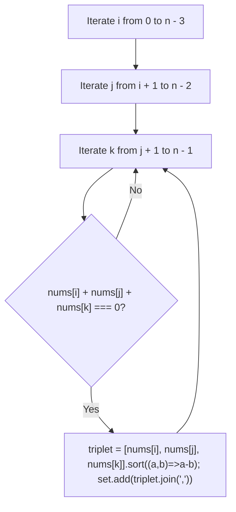
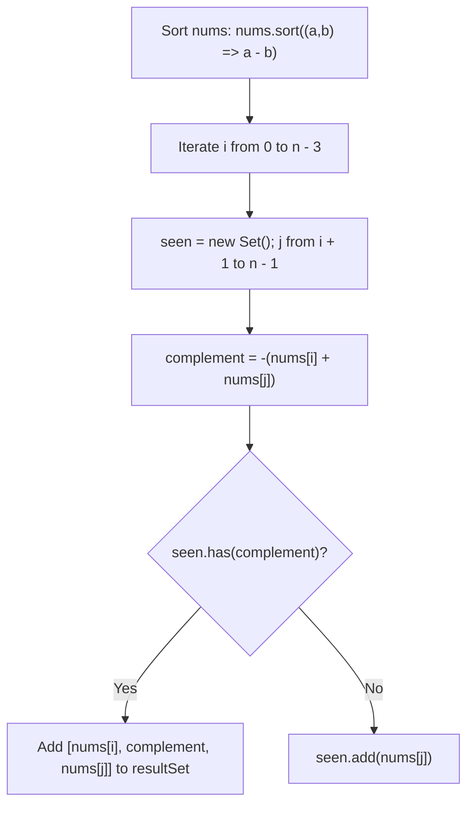
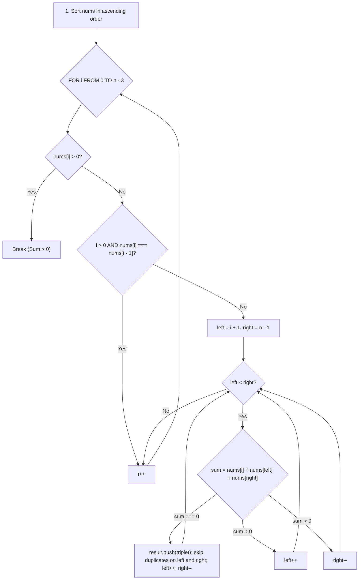
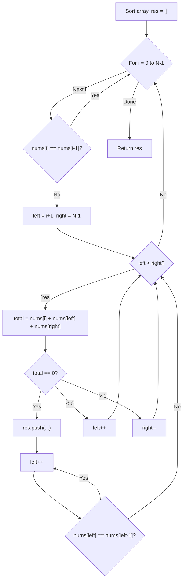

# 15. 3Sum

- **LeetCode Link**: `https://leetcode.com/problems/3sum/`
- **Difficulty**: Medium
- **Pattern Category**: Two Pointers / Sorting
- **Prerequisite Primer**: `00-foundations/01-two-pointers.md`

---

## 1. Problem Overview & Edge Case Matrix

### Problem Statement
Given an integer array `nums`, return all the triplets `[nums[i], nums[j], nums[k]]` such that `i != j`, `i != k`, and `j != k`, and `nums[i] + nums[j] + nums[k] == 0`.

Notice that the solution set **must not contain duplicate triplets**.

```
nums = [ -1 , 0 , 1 , 2 , -1 , -4 ]
Sorted: [ -4 , -1 , -1 , 0 , 1 , 2 ]

Triplets summing to 0:
[ [-1, -1, 2] , [-1, 0, 1] ]
```

### Upfront Edge Case Matrix

| Edge Case Scenario | Inputs | Expected Output | Pitfall / Failure Mode |
| :--- | :--- | :--- | :--- |
| Fewer than 3 Elements | `nums = [0, 1]` | `[]` | Index out of bounds in loop |
| All Zeros | `nums = [0, 0, 0, 0]` | `[[0, 0, 0]]` | Returning duplicate `[0, 0, 0]` multiple times |
| No Valid Triplet | `nums = [1, 2, 3]` | `[]` | False positive on sum |
| Duplicate Values in Inputs | `nums = [-2, 0, 0, 2, 2]` | `[[-2, 0, 2]]` | Failing to skip identical duplicate elements |
| Extreme Integer Bounds | `nums = [-10^5, 0, 10^5]` | `[[-10^5, 0, 10^5]]` | Integer overflow assumption bugs |

---

## 2. Level 1: Brute Force Approach (Cubic 3-Loop Scan & Set Deduplication)

### Intuition & Visual Idea
Test every possible triplet `(i, j, k)` with $i < j < k$. If `nums[i] + nums[j] + nums[k] === 0`, sort the 3 numbers and insert into a `Set` serialized as a string `${a},${b},${c}` to avoid duplicate triplets.



### Pseudocode
```text
FUNCTION threeSumBruteForce(nums):
    n = nums.length
    tripletSet = new Set()
    
    FOR i FROM 0 TO n - 3:
        FOR j FROM i + 1 TO n - 2:
            FOR k FROM j + 1 TO n - 1:
                IF nums[i] + nums[j] + nums[k] == 0:
                    triplet = [nums[i], nums[j], nums[k]].SORT()
                    tripletSet.add(triplet.JOIN(","))
                    
    RETURN DESERIALIZE(tripletSet)
```

### Step-by-Step Dry Run
`nums = [-1, 0, 1, 2, -1, -4]`

| `(i, j, k)` | Values | Sum | Sum === 0? | Sorted String Added |
| :--- | :--- | :--- | :--- | :--- |
| `(0, 1, 2)` | `-1, 0, 1` | 0 | **Yes** | `"-1,0,1"` |
| `(0, 3, 4)` | `-1, 2, -1` | 0 | **Yes** | `"-1,-1,2"` |
| `(1, 2, 4)` | `0, 1, -1` | 0 | **Yes** | `"-1,0,1"` (Ignored by Set as duplicate) |

### Modern JavaScript Implementation
```javascript
/**
 * Level 1: Brute Force Cubic Combinations with Set Deduplication
 * Time Complexity:  O(N^3)
 * Space Complexity: O(N) for Set storage
 */
function threeSumBruteForce(nums) {
  const n = nums.length;
  const set = new Set();
  const result = [];

  for (let i = 0; i < n - 2; i++) {
    for (let j = i + 1; j < n - 1; j++) {
      for (let k = j + 1; k < n; k++) {
        if (nums[i] + nums[j] + nums[k] === 0) {
          const triplet = [nums[i], nums[j], nums[k]].sort((a, b) => a - b);
          const key = triplet.join(',');
          if (!set.has(key)) {
            set.add(key);
            result.push(triplet);
          }
        }
      }
    }
  }

  return result;
}
```

### Complexity Breakdown
- **Time Complexity**: $O(N^3)$ — Three nested loops evaluate $\approx \frac{N^3}{6}$ triplets.
- **Space Complexity**: $O(N)$ — Stores string keys in the `Set`.

#### 🎙️ How to Explain to Interviewer (Verbatim Script)
> *"This brute-force approach checks every combination of three indices using three nested loops. To prevent duplicate triplets in the result, it sorts each valid triplet and inserts a string key into a hash set. With $N = 3000$, $\approx 4.5 \times 10^9$ operations are executed, causing Time Limit Exceeded."*

---

## 3. Level 2: Optimized Approach (Sorting + Hash Set Complement Lookup)

### Intuition & Visual Bottleneck Elimination
Sort `nums` first. Then fix the first element `nums[i]`. For the remaining subarray, we solve a 2-Sum problem using a `Set` to find `-(nums[i] + nums[j])` in $O(N)$ time.



### Pseudocode
```text
FUNCTION threeSumHashSet(nums):
    SORT nums
    result = []
    FOR i FROM 0 TO nums.length - 3:
        IF i > 0 AND nums[i] == nums[i - 1]: CONTINUE
        seen = new Set()
        FOR j FROM i + 1 TO nums.length - 1:
            complement = -(nums[i] + nums[j])
            IF seen.has(complement):
                result.push([nums[i], complement, nums[j]])
                WHILE j + 1 < nums.length AND nums[j] == nums[j + 1]: j++
            seen.add(nums[j])
    RETURN result
```

### Step-by-Step Dry Run
`nums = [-4, -1, -1, 0, 1, 2]`

| Fixed `nums[i]` | `j` | `nums[j]` | Complement `-(nums[i] + nums[j])` | `seen` Set | Found Triplet |
| :--- | :--- | :--- | :--- | :--- | :--- |
| `i = 1` (`-1`) | 2 | `-1` | $-(-1 + -1) = 2$ | `{-1}` | None |
| `i = 1` (`-1`) | 3 | `0` | $-(-1 + 0) = 1$ | `{-1, 0}` | None |
| `i = 1` (`-1`) | 4 | `1` | $-(-1 + 1) = 0$ | Has `0`! | `[-1, 0, 1]` |
| `i = 1` (`-1`) | 5 | `2` | $-(-1 + 2) = -1$| Has `-1`!| `[-1, -1, 2]` |

### Modern JavaScript Implementation
```javascript
/**
 * Level 2: Sorting + Hash Set 2-Sum
 * Time Complexity:  O(N^2)
 * Space Complexity: O(N) for Hash Set
 */
function threeSumHashSet(nums) {
  nums.sort((a, b) => a - b);
  const result = [];
  const n = nums.length;

  for (let i = 0; i < n - 2; i++) {
    if (nums[i] > 0) break; // If lowest element > 0, sum cannot be 0
    if (i > 0 && nums[i] === nums[i - 1]) continue; // Skip duplicates for i

    const seen = new Set();
    for (let j = i + 1; j < n; j++) {
      const complement = -(nums[i] + nums[j]);
      if (seen.has(complement)) {
        result.push([nums[i], complement, nums[j]]);
        while (j + 1 < n && nums[j] === nums[j + 1]) {
          j++; // Skip duplicates for j
        }
      }
      seen.add(nums[j]);
    }
  }

  return result;
}
```

### Complexity Breakdown
- **Time Complexity**: $O(N^2)$ — Outer loop runs $N$ times, inner Hash Set scan runs $N$ times.
- **Space Complexity**: $O(N)$ — Stores elements in `seen` Set for each iteration.

#### 🎙️ How to Explain to Interviewer (Verbatim Script)
> *"For **Time Complexity**, sorting the array takes $O(N \log N)$. Fixing the first element and executing a hash-set two-sum lookup for the remaining subarray takes $O(N)$ time per element, yielding an overall quadratic runtime of $O(N^2)$.
>
> For **Space Complexity**, it requires $O(N)$ auxiliary memory to maintain the hash set across iterations."*

---

## 4. Level 3: Most Optimal / Canonical Approach (Sorting + Two Pointers In-Place Deduplication)

### Intuition & Mathematical Invariant
1. **Sort `nums` in ascending order**: `nums.sort((a, b) => a - b)`.
2. Fix index `i` from `0` to `n - 3`.
   - **Early Exit**: If `nums[i] > 0`, break immediately (the sum of three positive numbers can never be 0).
   - **Skip Duplicates for `i`**: If `i > 0 && nums[i] === nums[i - 1]`, `continue`.
3. Set two pointers: `left = i + 1` and `right = n - 1`.
   - `sum = nums[i] + nums[left] + nums[right]`
   - If `sum === 0`: Push `[nums[i], nums[left], nums[right]]`.
     - **Skip all duplicates for `left`**: `while (left < right && nums[left] === nums[left + 1]) left++`.
     - **Skip all duplicates for `right`**: `while (left < right && nums[right] === nums[right - 1]) right--`.
     - Advance both `left++`, `right--`.
   - If `sum < 0`: Increment `left++`.
   - If `sum > 0`: Decrement `right--`.

```
nums = [ -4 , -1 , -1 ,  0 ,  1 ,  2 ]
          ^     ^                  ^
          i    left              right
Fixed nums[i] = -4:
left=-1, right=2 -> sum = -3 < 0 -> left++
...
Fixed nums[i] = -1:
left=-1, right=2 -> sum = 0! Record [-1, -1, 2], left++, right--
left=0,  right=1 -> sum = 0! Record [-1, 0, 1], left++, right--
```



### Pseudocode
```text
FUNCTION threeSum(nums):
    SORT nums
    result = []
    n = nums.length
    
    FOR i FROM 0 TO n - 3:
        IF nums[i] > 0: BREAK
        IF i > 0 AND nums[i] == nums[i - 1]: CONTINUE
        
        left = i + 1
        right = n - 1
        WHILE left < right:
            sum = nums[i] + nums[left] + nums[right]
            IF sum == 0:
                result.push([nums[i], nums[left], nums[right]])
                WHILE left < right AND nums[left] == nums[left + 1]: left++
                WHILE left < right AND nums[right] == nums[right - 1]: right--
                left++
                right--
            ELSE IF sum < 0:
                left++
            ELSE:
                right--
                
    RETURN result
```

### Step-by-Step Dry Run
`nums = [-4, -1, -1, 0, 1, 2]`

| `i` | `nums[i]` | `left` | `right` | `nums[left]` | `nums[right]` | `sum` | Action |
| :--- | :--- | :--- | :--- | :--- | :--- | :--- | :--- |
| 0 | -4 | 1 | 5 | -1 | 2 | $-3 < 0$ | `left = 2` |
| 0 | -4 | 2 | 5 | -1 | 2 | $-3 < 0$ | `left = 3` |
| 0 | -4 | 3 | 5 | 0 | 2 | $-2 < 0$ | `left = 4` |
| 0 | -4 | 4 | 5 | 1 | 2 | $-1 < 0$ | `left = 5` (Done for $i=0$) |
| 1 | -1 | 2 | 5 | -1 | 2 | $\mathbf{0}$ | **Record `[-1, -1, 2]`**, `left=3, right=4` |
| 1 | -1 | 3 | 4 | 0 | 1 | $\mathbf{0}$ | **Record `[-1, 0, 1]`**, `left=4, right=3` |
| 2 | -1 | - | - | - | - | - | $nums[2] == nums[1] \implies$ **Skip!** |

### Modern JavaScript Implementation
```javascript
/**
 * Level 3: Sorting + Two Pointers In-Place Deduplication (Canonical Optimal)
 * Time Complexity:  O(N^2)
 * Space Complexity: O(1) Auxiliary Space (excluding output and sort stack)
 */
function threeSum(nums) {
  // Numerical ascending sort
  nums.sort((a, b) => a - b);
  const result = [];
  const n = nums.length;

  for (let i = 0; i < n - 2; i++) {
    // Optimization: If the smallest number is > 0, sum can never be 0
    if (nums[i] > 0) break;

    // Skip duplicate elements for the first number
    if (i > 0 && nums[i] === nums[i - 1]) continue;

    let left = i + 1;
    let right = n - 1;

    while (left < right) {
      const sum = nums[i] + nums[left] + nums[right];

      if (sum === 0) {
        result.push([nums[i], nums[left], nums[right]]);

        // Skip duplicates for the second number
        while (left < right && nums[left] === nums[left + 1]) {
          left++;
        }
        // Skip duplicates for the third number
        while (left < right && nums[right] === nums[right - 1]) {
          right--;
        }

        left++;
        right--;
      } else if (sum < 0) {
        left++;
      } else {
        right--;
      }
    }
  }

  return result;
}
```

### Complexity Breakdown
- **Time Complexity**: $O(N^2)$ — Sorting takes $O(N \log N)$. The outer loop runs $N - 2$ times, and the inner two-pointer search takes $O(N)$ time per outer iteration $\implies O(N^2)$.
- **Space Complexity**: $O(1)$ auxiliary space — Modifies pointers directly without allocating sets or extra buffers (or $O(\log N)$ for Timsort stack).

#### 🎙️ How to Explain to Interviewer (Verbatim Script)
> *"For **Time Complexity**, this algorithm runs in $O(N^2)$ time. Sorting `nums` takes $O(N \log N)$. We iterate through each element as a fixed base candidate $nums[i]$ and use an $O(N)$ converging two-pointer scan on the remainder of the array. The early exit condition `nums[i] > 0` and duplicate skipping logic prune redundant branches.
>
> For **Space Complexity**, it is strictly **$O(1)$ auxiliary space** (excluding the return array), as all deduplication is performed algebraically via pointer skipping rather than allocating hash sets."*

---

## 5. JavaScript-Specific Gotchas & V8 Optimizations
- **Sorting Comparator**: Omitting `(a, b) => a - b` will sort negatives alphabetically (`[-1, -4, 0, 1]`), breaking the two-pointer monotonicity invariant.
- **Duplicate Skipping Order**: The duplicate skips `while (nums[left] === nums[left + 1]) left++` must occur **after** a valid triplet is found and recorded, followed by `left++` and `right--`.

---

## 6. Real-World MAANG Interview Follow-Ups & Extensions

### Follow-Up 1: 3Sum Closest (LeetCode 16)
- **Scenario**: Find three integers such that the sum is closest to `target`.
- **Solution Strategy**: Same sorting + two pointers pattern, maintaining `closestSum` by minimizing $| \text{sum} - \text{target} |$.

### Follow-Up 2: Generalized $K$-Sum Framework (LeetCode 18: 4Sum)
- **Scenario**: Solve for $K$ elements summing to `target` for arbitrary $K \ge 3$.
- **Solution Strategy**: Recursive reduction: for $K > 2$, fix the first element with an outer loop and recurse on $(K - 1)\text{-Sum}$. When $K = 2$, execute the $O(N)$ Two Pointers base case.
- **JS Code**:
```javascript
function kSum(nums, target, k, start = 0) {
  const result = [];
  if (start >= nums.length) return result;

  if (k === 2) {
    let left = start, right = nums.length - 1;
    while (left < right) {
      const sum = nums[left] + nums[right];
      if (sum === target) {
        result.push([nums[left], nums[right]]);
        while (left < right && nums[left] === nums[left + 1]) left++;
        while (left < right && nums[right] === nums[right - 1]) right--;
        left++; right--;
      } else if (sum < target) left++;
      else right--;
    }
    return result;
  }

  for (let i = start; i < nums.length - k + 1; i++) {
    if (i > start && nums[i] === nums[i - 1]) continue;
    const subResults = kSum(nums, target - nums[i], k - 1, i + 1);
    for (const sub of subResults) {
      result.push([nums[i], ...sub]);
    }
  }

  return result;
}
```

---

## 7. What LeetCode Discuss Says (Language-Independent)

Source: top-voted post by niits —
`https://leetcode.com/problems/3sum/solutions/3109452/video-two-pointer-solution/`
— 489.8K views / 2.1K votes / 64 comments.
Language-independent summary. No new JS here.

### A. Optimal way from Discuss (Sort + Two Pointers)

Managing 3 pointers at once is very difficult. The optimal strategy is to first **sort** the array, then iterate through it fixing one element (`nums[i]`) at a time. For the remaining part of the array, use the Two Sum II approach (Two Pointers: `left` and `right`) to find pairs that sum to `-nums[i]`. Because the array is sorted, we can easily skip duplicate values to ensure unique triplets.

```text
FUNCTION threeSum(nums):
    SORT nums ascending
    res = []
    
    FOR i = 0 TO length(nums) - 1:
        // Skip duplicate values for the first element
        IF i > 0 AND nums[i] == nums[i - 1]:
            CONTINUE
            
        left = i + 1
        right = length(nums) - 1
        
        WHILE left < right:
            total = nums[i] + nums[left] + nums[right]
            
            IF total == 0:
                res.push([nums[i], nums[left], nums[right]])
                left++
                // Skip duplicate values for the second element
                WHILE left < right AND nums[left] == nums[left - 1]:
                    left++
            ELSE IF total < 0:
                left++
            ELSE:
                right--
                
    RETURN res
```

- Time: O(N^2) where N is the length of the array. The sorting takes O(N log N) and the nested loops take O(N^2).
- Space: O(1) or O(N) depending on the sorting algorithm used by the language (e.g., Python's Timsort uses O(N)).



### B. Dry run on LeetCode Example 1 ([-1, 0, 1, 2, -1, -4])

| Step | Array | `i` (fixed) | `left` | `right` | Total | Action |
| :--- | :--- | :--- | :--- | :--- | :--- | :--- |
| 1 | `[-4,-1,-1,0,1,2]` | 0 (`-4`) | 1 (`-1`) | 5 (`2`) | -3 | Total < 0, `left++` |
| 2 | | 0 (`-4`) | 2 (`-1`) | 5 (`2`) | -3 | Total < 0, `left++` |
| ... | | ... | | | | ... (moves to next `i`) |
| 3 | | 1 (`-1`) | 2 (`-1`) | 5 (`2`) | 0 | **Match!** Add `[-1, -1, 2]`. `left++`. Skip duplicate left (`-1`), `left` is now 3 (`0`). |
| 4 | | 1 (`-1`) | 3 (`0`) | 5 (`2`) | 1 | Total > 0, `right--`. |
| 5 | | 1 (`-1`) | 3 (`0`) | 4 (`1`) | 0 | **Match!** Add `[-1, 0, 1]`. |

### C. Pitfalls from comments

- **Skipping Duplicates:** The problem explicitly requires unique triplets. The easiest mistake is failing to skip duplicates. You must skip duplicates for the outer loop (`i`) AND skip duplicates for the inner pointer (`left`) whenever a valid triplet is found.
- **Hash Set vs Sorting:** You can solve this using Hash Sets (similar to Two Sum), but managing the uniqueness of triplets inside a Hash Set without sorting often leads to timeouts or $O(N)$ extra memory limits being exceeded. The sorting + Two Pointers approach naturally eliminates duplicates in $O(1)$ space.
- **Optimization:** If `nums[i] > 0`, you can immediately `break` the outer loop. Since the array is sorted, if the first number is positive, the sum of three positive numbers can never equal zero.

### D. Companies

- Discuss post itself names none.
  Companies tab on LeetCode is premium-locked.
- External source:
  `https://github.com/liquidslr/leetcode-company-wise-problems`
  (LeetCode company tags, updated June 2025).
- All-time (65): Accenture, Adobe, Agoda, Amazon, AMD, American Express, Apple, Autodesk, Bloomberg, ByteDance, Cisco, Cloudflare, Coupang, Deloitte, Dream11, eBay, EPAM Systems, Flipkart, Goldman Sachs, Google, Harness, IBM, Infosys, Meesho, Meta, Microsoft, Morgan Stanley, Myntra, Nutanix, Nvidia, Ola Cabs, Oracle, Oyo, PayPal, PhonePe, Qualcomm, Quora, Roku, Rubrik, Salesforce, Samsung, TCS, Tesla, TikTok, Trexquant, Turing, Vimeo, Visa, Walmart Labs, Wissen Technology, Wix, Works Applications, Zoho.
- Recent: 30 days — Amazon, Bloomberg, Google, Meta, Microsoft, Ola Cabs.
- Recent: 3 months — Amazon, Apple, Bloomberg, Google, Infosys, Meta, Microsoft, TCS.
