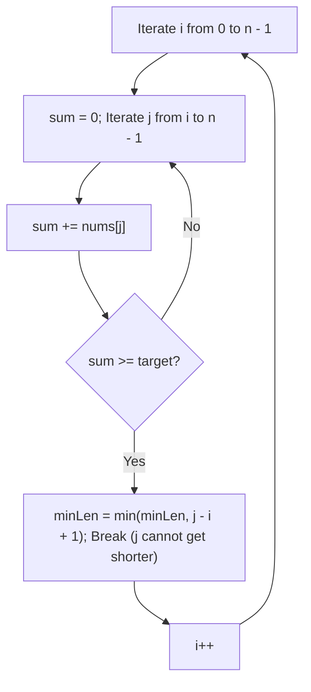
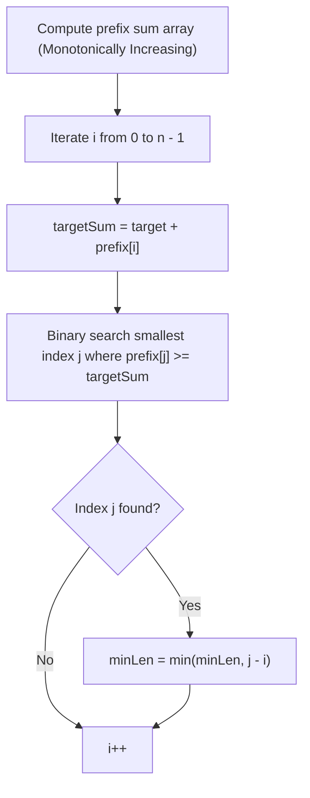
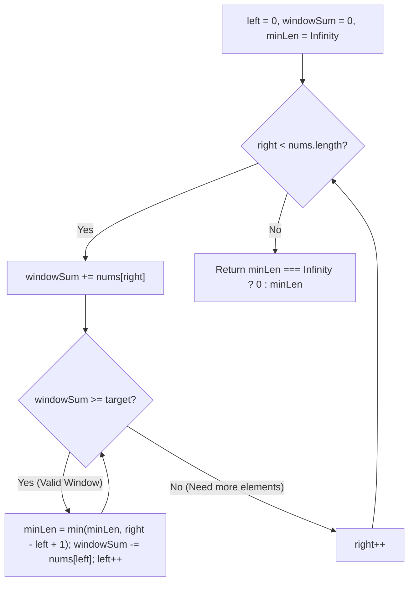

# 209. Minimum Size Subarray Sum

- **LeetCode Link**: `https://leetcode.com/problems/minimum-size-subarray-sum/`
- **Difficulty**: Medium
- **Pattern Category**: Sliding Window / Two Pointers / Binary Search
- **Prerequisite Primer**: `00-foundations/01-two-pointers.md`

---

## 1. Problem Overview & Edge Case Matrix

### Problem Statement
Given an array of positive integers `nums` and a positive integer `target`, return the **minimal length** of a subarray whose sum is greater than or equal to `target`. If there is no such subarray, return `0` instead.

```
target = 7, nums = [ 2 , 3 , 1 , 2 , 4 , 3 ]

Subarrays with sum >= 7:
[2, 3, 1, 2] -> sum = 8 (len 4)
[3, 1, 2, 4] -> sum = 10 (len 4)
[1, 2, 4]    -> sum = 7 (len 3)
[4, 3]       -> sum = 7 (len 2 - Minimal!)
Output: 2
```

### Upfront Edge Case Matrix

| Edge Case Scenario | Inputs | Expected Output | Pitfall / Failure Mode |
| :--- | :--- | :--- | :--- |
| Total Array Sum $< \text{target}$ | `target = 100`, `nums = [1, 2, 3]` | `0` | Returning `Infinity` instead of `0` |
| Single Element $\ge \text{target}$ | `target = 4`, `nums = [1, 4, 2]` | `1` | Failure to catch instant 1-length match |
| All Elements Required | `target = 11`, `nums = [1, 2, 3, 5]` | `4` ($1+2+3+5 = 11$) | Off-by-one window shrinkage |
| Large Target Value | `target = 10^9`, `nums = [...]` | `0` or valid min | Integer accumulation range checks |

---

## 2. Level 1: Brute Force Approach (All Subarray Sums)

### Intuition & Visual Idea
Test every possible contiguous subarray starting at index $i$ and ending at index $j$. Calculate the sum and record the minimum length $j - i + 1$ whenever `sum >= target`.



### Pseudocode
```text
FUNCTION minSubArrayLenBruteForce(target, nums):
    n = nums.length
    minLen = INFINITY
    
    FOR i FROM 0 TO n - 1:
        sum = 0
        FOR j FROM i TO n - 1:
            sum += nums[j]
            IF sum >= target:
                minLen = MIN(minLen, j - i + 1)
                BREAK // Inner loop can only increase length
                
    RETURN minLen == INFINITY ? 0 : minLen
```

### Step-by-Step Dry Run
`target = 7`, `nums = [2, 3, 1, 2, 4, 3]`

| `i` | `j` Range | Subarray | Sum | `sum >= 7`? | Length | `minLen` |
| :--- | :--- | :--- | :--- | :--- | :--- | :--- |
| 0 | $0 \to 3$ | `[2, 3, 1, 2]` | 8 | Yes | 4 | 4 |
| 1 | $1 \to 4$ | `[3, 1, 2, 4]` | 10 | Yes | 4 | 4 |
| 2 | $2 \to 4$ | `[1, 2, 4]` | 7 | Yes | 3 | 3 |
| 4 | $4 \to 5$ | `[4, 3]` | 7 | Yes | 2 | **2** |

### Modern JavaScript Implementation
```javascript
/**
 * Level 1: Brute Force All Subarrays with Early Break
 * Time Complexity:  O(N^2)
 * Space Complexity: O(1)
 */
function minSubArrayLenBruteForce(target, nums) {
  const n = nums.length;
  let minLen = Infinity;

  for (let i = 0; i < n; i++) {
    let sum = 0;
    for (let j = i; j < n; j++) {
      sum += nums[j];
      if (sum >= target) {
        minLen = Math.min(minLen, j - i + 1);
        break; // Shorter subarray starting at i cannot be found
      }
    }
  }

  return minLen === Infinity ? 0 : minLen;
}
```

### Complexity Breakdown
- **Time Complexity**: $O(N^2)$ — Two nested loops over $N$ elements.
- **Space Complexity**: $O(1)$ auxiliary space.

#### 🎙️ How to Explain to Interviewer (Verbatim Script)
> *"This brute-force approach considers each index $i$ as a starting point and expands forward until the running sum meets or exceeds $target$. With all positive integers, further expanding $j$ will only increase subarray length, so we break early. The worst-case runtime is quadratic $O(N^2)$ when no subarray reaches the target, using $O(1)$ extra space."*

---

## 3. Level 2: Optimized Approach (Prefix Sums + Binary Search)

### Intuition & Visual Bottleneck Elimination
Because all numbers are positive, the prefix sum array `prefix` is **strictly monotonically increasing**.
- `prefix[k] = sum(nums[0 ... k - 1])`
- The sum of subarray `nums[i ... j]` is `prefix[j + 1] - prefix[i]`.
- For each starting index $i$, we want: $\text{prefix}[j + 1] \ge \text{target} + \text{prefix}[i]$.
- We can find the smallest valid $j$ in $O(\log N)$ time using **Binary Search** (`lower_bound`)!



### Pseudocode
```text
FUNCTION minSubArrayLenBinarySearch(target, nums):
    n = nums.length
    prefix = new Array(n + 1).fill(0)
    FOR i FROM 0 TO n - 1:
        prefix[i + 1] = prefix[i] + nums[i]
        
    minLen = INFINITY
    FOR i FROM 0 TO n - 1:
        targetSum = target + prefix[i]
        bound = binarySearchLowerBound(prefix, targetSum)
        IF bound <= n:
            minLen = MIN(minLen, bound - i)
            
    RETURN minLen == INFINITY ? 0 : minLen
```

### Step-by-Step Dry Run
`target = 7`, `nums = [2, 3, 1, 2, 4, 3]`, `prefix = [0, 2, 5, 6, 8, 12, 15]`

| `i` | `prefix[i]` | Required `prefix[j] >= target + prefix[i]` | Binary Search Found `j` | Subarray Length ($j - i$) | `minLen` |
| :--- | :--- | :--- | :--- | :--- | :--- |
| 0 | 0 | $\ge 7$ | $j = 4$ (`prefix[4] = 8`) | $4 - 0 = 4$ | 4 |
| 1 | 2 | $\ge 9$ | $j = 5$ (`prefix[5] = 12`) | $5 - 1 = 4$ | 4 |
| 2 | 5 | $\ge 12$ | $j = 5$ (`prefix[5] = 12`) | $5 - 2 = 3$ | 3 |
| 4 | 8 | $\ge 15$ | $j = 6$ (`prefix[6] = 15`) | $6 - 4 = 2$ | **2** |

### Modern JavaScript Implementation
```javascript
/**
 * Level 2: Prefix Sums + Binary Search
 * Time Complexity:  O(N log N)
 * Space Complexity: O(N) Auxiliary Space
 */
function minSubArrayLenBinarySearch(target, nums) {
  const n = nums.length;
  const prefix = new Int32Array(n + 1);

  for (let i = 0; i < n; i++) {
    prefix[i + 1] = prefix[i] + nums[i];
  }

  let minLen = Infinity;

  for (let i = 0; i < n; i++) {
    const required = target + prefix[i];
    let left = i + 1;
    let right = n;
    let bestJ = -1;

    while (left <= right) {
      const mid = left + ((right - left) >> 1);
      if (prefix[mid] >= required) {
        bestJ = mid;
        right = mid - 1; // Try finding smaller end index
      } else {
        left = mid + 1;
      }
    }

    if (bestJ !== -1) {
      minLen = Math.min(minLen, bestJ - i);
    }
  }

  return minLen === Infinity ? 0 : minLen;
}
```

### Complexity Breakdown
- **Time Complexity**: $O(N \log N)$ — Prefix sum array takes $O(N)$, and for each of the $N$ positions, binary search takes $O(\log N)$.
- **Space Complexity**: $O(N)$ — Prefix sum array of size $N + 1$.

#### 🎙️ How to Explain to Interviewer (Verbatim Script)
> *"For **Time Complexity**, this achieves $O(N \log N)$. Because all elements are positive, the cumulative prefix sums are strictly monotonically increasing. For each starting index $i$, we locate the minimal end index $j$ using binary search in logarithmic time $O(\log N)$.
>
> For **Space Complexity**, it requires $O(N)$ auxiliary space for the prefix sums buffer."*

---

## 4. Level 3: Most Optimal / Canonical Approach (Dynamic Sliding Window)

### Intuition & Invariant Proof
Maintain a dynamic sliding window `[left, right]` and running sum `windowSum`:
1. **Expand Right**: Add `nums[right]` to `windowSum` as `right` iterates from `0` to `n - 1`.
2. **Shrink Left**: Whenever `windowSum >= target`, we have a valid window!
   - Update `minLen = min(minLen, right - left + 1)`.
   - Subtract `nums[left]` from `windowSum` and advance `left++` to see if a shorter window can still satisfy the target sum.
3. Because both `left` and `right` only move **forward**, each element is added and subtracted at most once $\implies O(N)$ total operations!

```
nums: [ 2 , 3 , 1 , 2 , 4 , 3 ] , target = 7
Window [2, 3, 1, 2] -> sum = 8 >= 7 (len 4) -> shrink left: sum = 6 < 7
Window [3, 1, 2, 4] -> sum = 10 >= 7 (len 4) -> shrink left: sum = 7 >= 7 (len 3) -> shrink left: sum = 6 < 7
Window [1, 2, 4, 3] -> shrink left -> Window [4, 3] -> sum = 7 >= 7 (len 2 - Minimal!)
```



### Pseudocode
```text
FUNCTION minSubArrayLen(target, nums):
    left = 0
    windowSum = 0
    minLen = INFINITY
    
    FOR right FROM 0 TO nums.length - 1:
        windowSum += nums[right]
        
        WHILE windowSum >= target:
            minLen = MIN(minLen, right - left + 1)
            windowSum -= nums[left]
            left++
            
    RETURN minLen == INFINITY ? 0 : minLen
```

### Step-by-Step Dry Run
`target = 7`, `nums = [2, 3, 1, 2, 4, 3]`

| `right` | `nums[right]` | `windowSum` | Condition `sum >= 7` | Window Length | `minLen` | Action on Shrink |
| :--- | :--- | :--- | :--- | :--- | :--- | :--- |
| 0..2 | 2, 3, 1 | 6 | False | - | $\infty$ | `right++` |
| 3 | 2 | 8 | **True** | $3 - 0 + 1 = 4$ | 4 | `windowSum -= 2 = 6, left = 1` |
| 4 | 4 | 10 | **True** | $4 - 1 + 1 = 4$ | 4 | `windowSum -= 3 = 7, left = 2` |
| 4 | 4 | 7 | **True** | $4 - 2 + 1 = 3$ | 3 | `windowSum -= 1 = 6, left = 3` |
| 5 | 3 | 9 | **True** | $5 - 3 + 1 = 3$ | 3 | `windowSum -= 2 = 7, left = 4` |
| 5 | 3 | 7 | **True** | $5 - 4 + 1 = 2$ | **2** | `windowSum -= 4 = 3, left = 5` |

### Modern JavaScript Implementation
```javascript
/**
 * Level 3: Dynamic Sliding Window (Canonical Optimal)
 * Time Complexity:  O(N) Amortized
 * Space Complexity: O(1) Auxiliary Space
 */
function minSubArrayLen(target, nums) {
  let left = 0;
  let windowSum = 0;
  let minLen = Infinity;
  const n = nums.length;

  for (let right = 0; right < n; right++) {
    windowSum += nums[right];

    // Shrink window from the left while condition holds
    while (windowSum >= target) {
      const currentLen = right - left + 1;
      if (currentLen < minLen) {
        minLen = currentLen;
      }
      windowSum -= nums[left];
      left++;
    }
  }

  return minLen === Infinity ? 0 : minLen;
}
```

### Complexity Breakdown
- **Time Complexity**: $O(N)$ amortized — The right pointer advances $N$ times, and the left pointer advances at most $N$ times across the entire algorithm execution. Each element is added once and subtracted at most once ($2N$ operations total).
- **Space Complexity**: $O(1)$ auxiliary space — Only primitive integer variables on the stack.

#### 🎙️ How to Explain to Interviewer (Verbatim Script)
> *"For **Time Complexity**, this runs in $O(N)$ amortized linear time. We maintain a dynamic sliding window `[left, right]`. Although there is a nested while loop, the left pointer only increments and never resets backwards. Thus, every element enters the window sum once and leaves the window sum once, bounding total operations to $2N = O(N)$.
>
> For **Space Complexity**, it is strictly **$O(1)$ auxiliary memory**, allocating zero arrays or hash maps."*

---

## 5. JavaScript-Specific Gotchas & V8 Optimizations
- **Positive Numbers Only Invariant**: This sliding window approach works because all numbers in `nums` are strictly positive. If the array contained **negative numbers**, expanding the window could decrease the sum, breaking monotonicity (requiring a Monotonic Deque / Prefix Hash Map as in LeetCode 862).

---

## 6. Real-World MAANG Interview Follow-Ups & Extensions

### Follow-Up 1: Allowing Negative Numbers in the Array (LeetCode 862: Shortest Subarray with Sum at Least K)
- **Scenario**: What if `nums` can contain negative integers?
- **Solution Strategy**: The sliding window monotonicity breaks. We compute prefix sums and maintain a **Monotonic Increasing Deque** of prefix sum indices in $O(N)$ time.

### Follow-Up 2: Streaming Network Rate-Limiting Window
- **Scenario**: Find the minimum duration window in a live stream of packet timestamps containing at least $K$ megabytes of throughput.
- **Solution**: Dynamic Sliding Window with timestamp delta tracking.
