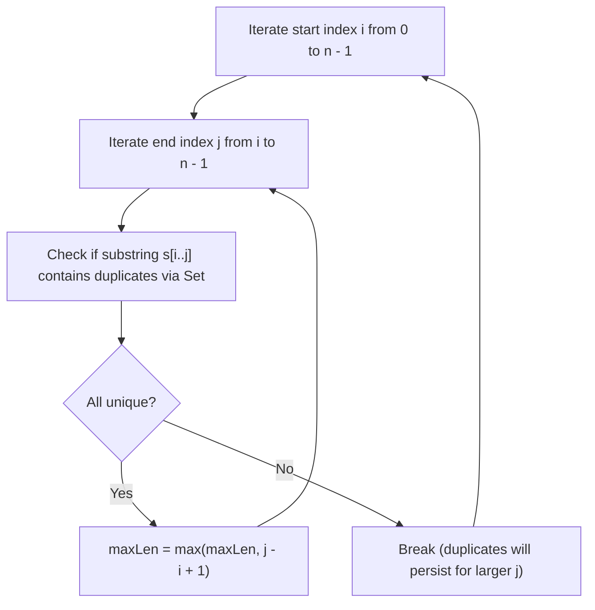
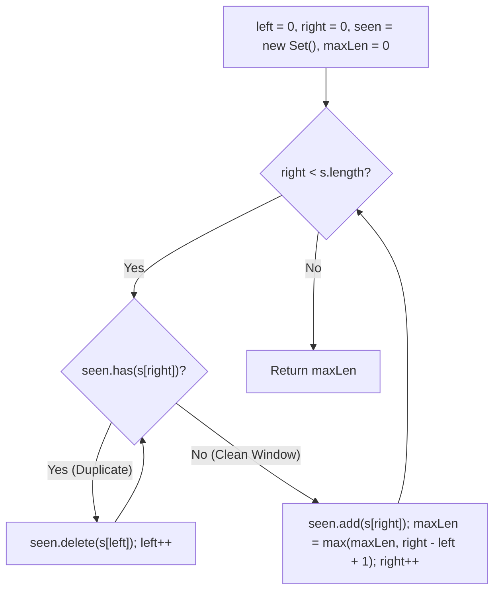
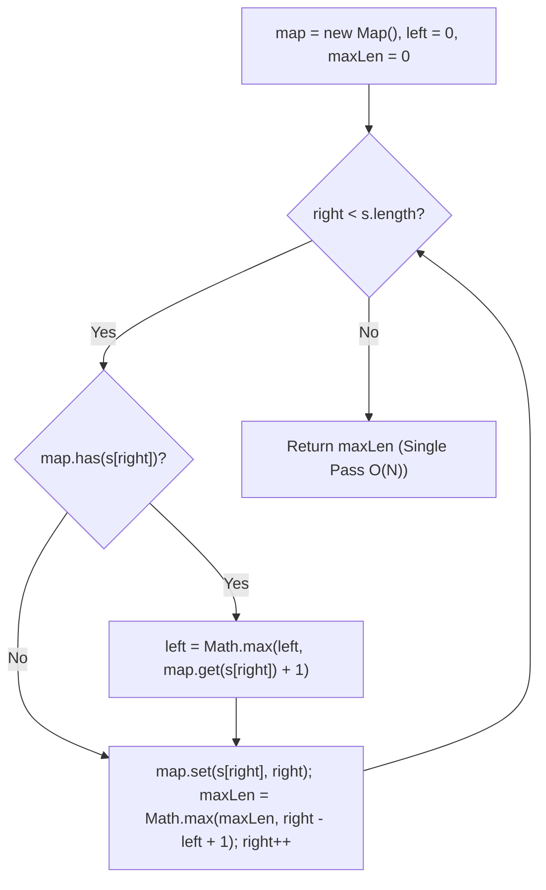

# 3. Longest Substring Without Repeating Characters

- **LeetCode Link**: `https://leetcode.com/problems/longest-substring-without-repeating-characters/`
- **Difficulty**: Medium
- **Pattern Category**: Sliding Window / Hash Table
- **Prerequisite Primer**: `00-foundations/01-two-pointers.md`

---

## 1. Problem Overview & Edge Case Matrix

### Problem Statement
Given a string `s`, find the length of the **longest substring** without duplicate characters.

```
s = "abcabcbb"
Longest substring without repeating characters is "abc" -> Length: 3

s = "bbbbb"
Longest substring is "b" -> Length: 1

s = "pwwkew"
Longest substring is "wke" -> Length: 3 (Notice "pwke" is a subsequence, not substring)
```

### Upfront Edge Case Matrix

| Edge Case Scenario | Inputs | Expected Output | Pitfall / Failure Mode |
| :--- | :--- | :--- | :--- |
| Empty String | `s = ""` | `0` | Returning 1 or array index error |
| Single Character | `s = "a"` | `1` | Failure to register 1-length window |
| All Identical Characters | `s = "bbbbb"` | `1` | Failure to contract window repeatedly |
| All Unique Characters | `s = "abcdef"` | `6` | Unnecessary shrinkage |
| Symbols, Spaces, and Digits | `s = "a b c a b c"` | `3` (`"a b"`, `" b "`) | Forgetting that space `' '` is a valid character |

---

## 2. Level 1: Brute Force Approach (All Substrings with Set Check)

### Intuition & Visual Idea
Generate every possible substring $s[i \dots j]$. For each substring, use a `Set` to check if all characters are unique. Track the maximum length among all valid substrings.



### Pseudocode
```text
FUNCTION lengthOfLongestSubstringBruteForce(s):
    n = s.length
    maxLen = 0
    FOR i FROM 0 TO n - 1:
        seen = new Set()
        FOR j FROM i TO n - 1:
            IF seen.has(s[j]):
                BREAK
            seen.add(s[j])
            maxLen = MAX(maxLen, j - i + 1)
    RETURN maxLen
```

### Step-by-Step Dry Run
`s = "pwwkew"`

| `i` | `j` | `s[j]` | `seen` Set | Valid? | `maxLen` |
| :--- | :--- | :--- | :--- | :--- | :--- |
| 0 | 0 | `'p'` | `{'p'}` | Yes | 1 |
| 0 | 1 | `'w'` | `{'p', 'w'}` | Yes | 2 |
| 0 | 2 | `'w'` | Duplicate `'w'` | **No (Break)** | 2 |
| 1 | 1 | `'w'` | `{'w'}` | Yes | 2 |
| 2 | 2..4 | `'w','k','e'` | `{'w','k','e'}` | Yes | **3** |

### Modern JavaScript Implementation
```javascript
/**
 * Level 1: Brute Force All Substrings
 * Time Complexity:  O(N^2)
 * Space Complexity: O(min(N, Sigma))
 */
function lengthOfLongestSubstringBruteForce(s) {
  const n = s.length;
  let maxLen = 0;

  for (let i = 0; i < n; i++) {
    const seen = new Set();
    for (let j = i; j < n; j++) {
      if (seen.has(s[j])) {
        break;
      }
      seen.add(s[j]);
      maxLen = Math.max(maxLen, j - i + 1);
    }
  }

  return maxLen;
}
```

### Complexity Breakdown
- **Time Complexity**: $O(N^2)$ — Two nested loops examining substrings.
- **Space Complexity**: $O(\min(N, \Sigma))$ — `seen` Set stores unique characters (where $\Sigma$ is character alphabet size).

#### 🎙️ How to Explain to Interviewer (Verbatim Script)
> *"This brute-force approach evaluates all possible substrings starting at index $i$. As soon as a duplicate character is encountered, we break the inner loop since extending the substring further cannot eliminate the duplicate. The worst-case runtime is $O(N^2)$ with $O(\min(N, \Sigma))$ space."*

---

## 3. Level 2: Optimized Approach (Sliding Window with Set Shrinkage)

### Intuition & Visual Bottleneck Elimination
Maintain a dynamic sliding window `[left, right]` using a `Set`:
- If `s[right]` is not in the set, add it and update `maxLen = max(maxLen, right - left + 1)`.
- If `s[right]` is already in the set, repeatedly delete `s[left]` from the set and advance `left++` until the duplicate is evicted.

```
s: [ a , b , c , a , b , c , b , b ]
Window: [a, b, c] -> right sees 'a'
Evict s[left] ('a') from Set, left++ -> Window becomes [b, c, a]
```



### Pseudocode
```text
FUNCTION lengthOfLongestSubstringSet(s):
    seen = new Set()
    left = 0, maxLen = 0
    FOR right FROM 0 TO s.length - 1:
        WHILE seen.has(s[right]):
            seen.delete(s[left])
            left++
        seen.add(s[right])
        maxLen = MAX(maxLen, right - left + 1)
    RETURN maxLen
```

### Step-by-Step Dry Run
`s = "abcabcbb"`

| `right` | `s[right]` | Action | `left` | Window in Set | `maxLen` |
| :--- | :--- | :--- | :--- | :--- | :--- |
| 0 | `'a'` | Add `'a'` | 0 | `{'a'}` | 1 |
| 1 | `'b'` | Add `'b'` | 0 | `{'a', 'b'}` | 2 |
| 2 | `'c'` | Add `'c'` | 0 | `{'a', 'b', 'c'}` | **3** |
| 3 | `'a'` | Evict `'a'`, `left=1`, Add `'a'` | 1 | `{'b', 'c', 'a'}` | 3 |
| 4 | `'b'` | Evict `'b'`, `left=2`, Add `'b'` | 2 | `{'c', 'a', 'b'}` | 3 |

### Modern JavaScript Implementation
```javascript
/**
 * Level 2: Sliding Window with Hash Set
 * Time Complexity:  O(2N) = O(N)
 * Space Complexity: O(min(N, Sigma))
 */
function lengthOfLongestSubstringSet(s) {
  const seen = new Set();
  let left = 0;
  let maxLen = 0;

  for (let right = 0; right < s.length; right++) {
    while (seen.has(s[right])) {
      seen.delete(s[left]);
      left++;
    }
    seen.add(s[right]);
    maxLen = Math.max(maxLen, right - left + 1);
  }

  return maxLen;
}
```

### Complexity Breakdown
- **Time Complexity**: $O(2N) = O(N)$ — Each character is visited once by `right` and deleted at most once by `left`.
- **Space Complexity**: $O(\min(N, \Sigma))$ — Hash set stores at most $\Sigma$ unique characters.

#### 🎙️ How to Explain to Interviewer (Verbatim Script)
> *"For **Time Complexity**, this runs in $O(N)$ time. We maintain a dynamic sliding window using a hash set. When a duplicate character is encountered, the left pointer shrinks the window character by character until the duplicate is evicted. Each character is added to and removed from the set at most once, taking $2N$ operations.
>
> For **Space Complexity**, it takes $O(\min(N, \Sigma))$ auxiliary space where $\Sigma$ is the alphabet size."*

---

## 4. Level 3: Most Optimal / Canonical Approach (Optimized Map with Direct Left Pointer Jump)

### Intuition & Invariant Proof
Instead of evicting characters from `left` one-by-one, store each character's **most recent index**: `Map<char, lastSeenIndex>`.
When `s[right]` is encountered:
- If `s[right]` was seen previously at `prevIndex`:
- We can **instantly teleport** `left` to `prevIndex + 1`!
- **Critical Guard**: We must ensure `left` never moves backward: `left = Math.max(left, prevIndex + 1)`.
- Update `map.set(s[right], right)` and `maxLen = Math.max(maxLen, right - left + 1)`.

```
s: [ a , b , c , a , b , c ]
     0   1   2   3   4   5
right = 3 ('a'):
'a' was last seen at index 0.
Instantly jump left = max(0, 0 + 1) = 1 in O(1) step!
```



### Pseudocode
```text
FUNCTION lengthOfLongestSubstring(s):
    lastSeen = new Map()
    left = 0
    maxLen = 0
    
    FOR right FROM 0 TO s.length - 1:
        char = s[right]
        IF lastSeen.has(char):
            left = MAX(left, lastSeen.get(char) + 1)
        lastSeen.set(char, right)
        maxLen = MAX(maxLen, right - left + 1)
        
    RETURN maxLen
```

### Step-by-Step Dry Run
`s = "abba"`

| `right` | `s[right]` | `lastSeen` Lookup | `left` Before | `left` Calculation | `left` After | Window Length | `maxLen` |
| :--- | :--- | :--- | :--- | :--- | :--- | :--- | :--- |
| 0 | `'a'` | None | 0 | - | 0 | $0 - 0 + 1 = 1$ | 1 |
| 1 | `'b'` | None | 0 | - | 0 | $1 - 0 + 1 = 2$ | 2 |
| 2 | `'b'` | Index 1 | 0 | $\max(0, 1 + 1)$ | 2 | $2 - 2 + 1 = 1$ | 2 |
| 3 | `'a'` | Index 0 | 2 | $\max(2, 0 + 1)$ | **2** (Guarded!) | $3 - 2 + 1 = 2$ | **2** |

### Modern JavaScript Implementation
```javascript
/**
 * Level 3: Direct Index Jump Sliding Window (Canonical Optimal)
 * Time Complexity:  O(N) Strictly Single Pass
 * Space Complexity: O(min(N, Sigma))
 */
function lengthOfLongestSubstring(s) {
  const lastSeen = new Map();
  let left = 0;
  let maxLen = 0;

  for (let right = 0; right < s.length; right++) {
    const char = s[right];

    if (lastSeen.has(char)) {
      // Jump left pointer forward past the last occurrence
      left = Math.max(left, lastSeen.get(char) + 1);
    }

    lastSeen.set(char, right);
    maxLen = Math.max(maxLen, right - left + 1);
  }

  return maxLen;
}
```

### Complexity Breakdown
- **Time Complexity**: $O(N)$ strictly single pass — The loop runs exactly $N$ iterations without any nested while loops.
- **Space Complexity**: $O(\min(N, \Sigma))$ — Hash Map stores at most $\Sigma$ characters (e.g. 128 for ASCII, 256 for extended ASCII).

#### 🎙️ How to Explain to Interviewer (Verbatim Script)
> *"For **Time Complexity**, this is strictly $O(N)$ in a single forward pass. Instead of evicting characters one by one with a nested while loop, we store the most recent index of every character in a hash map. When a repeated character is encountered, we jump the `left` pointer directly to `lastSeenIndex + 1` in $O(1)$ time, taking `Math.max(left, ...)` to ensure the pointer never regresses.
>
> For **Space Complexity**, it takes $O(\min(N, \Sigma))$ auxiliary space bounded by the distinct character set size $\Sigma$."*

---

## 5. JavaScript-Specific Gotchas & V8 Optimizations
- **The `abba` Trap**: In `s = "abba"`, at index 3 (`'a'`), `'a'` was seen at index 0. If you write `left = lastSeen.get(char) + 1`, `left` would jump backwards from 2 to 1! Using `Math.max(left, lastSeen.get(char) + 1)` is required to prevent backward pointer regression.

---

## 6. Real-World MAANG Interview Follow-Ups & Extensions

### Follow-Up 1: Longest Substring with at Most $K$ Distinct Characters (LeetCode 340)
- **Scenario**: Allow up to $K$ distinct characters in the window.
- **Solution Strategy**: Maintain a frequency `Map`. When `map.size > k`, shrink `left` until a key's count drops to 0 and is deleted.

### Follow-Up 2: Substring with Fixed ASCII Table (Zero GC)
- **Scenario**: When $s$ contains only 128 standard ASCII characters, eliminate Map allocation entirely.
- **JS Code**:
```javascript
function lengthOfLongestSubstringASCII(s) {
  const lastSeen = new Int32Array(128).fill(-1);
  let left = 0, maxLen = 0;

  for (let right = 0; right < s.length; right++) {
    const code = s.charCodeAt(right);
    if (lastSeen[code] >= left) {
      left = lastSeen[code] + 1;
    }
    lastSeen[code] = right;
    maxLen = Math.max(maxLen, right - left + 1);
  }
  return maxLen;
}
```
