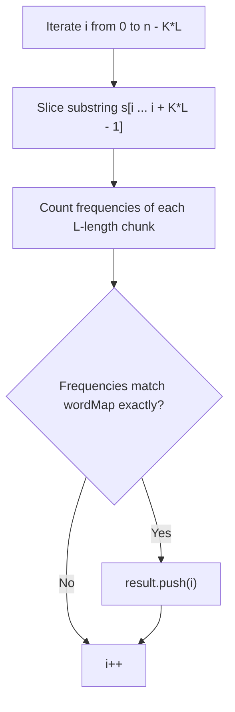
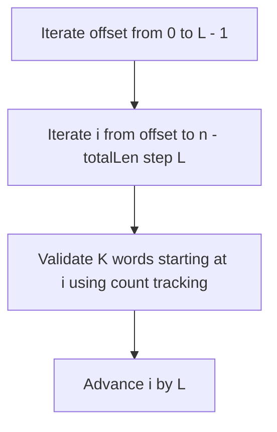
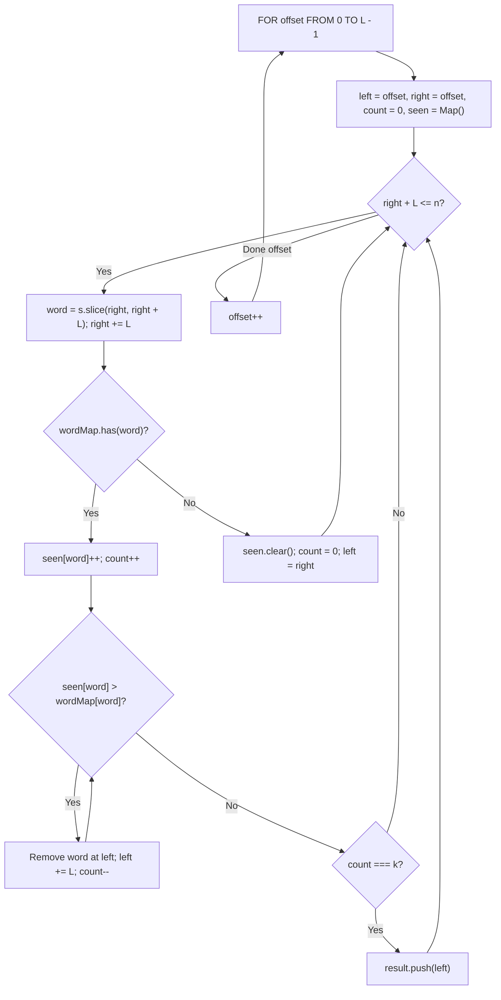

# 30. Substring with Concatenation of All Words

- **LeetCode Link**: `https://leetcode.com/problems/substring-with-concatenation-of-all-words/`
- **Difficulty**: Hard
- **Pattern Category**: Sliding Window / Hash Table / String
- **Prerequisite Primer**: `00-foundations/01-two-pointers.md`

---

## 1. Problem Overview & Edge Case Matrix

### Problem Statement
You are given a string `s` and an array of strings `words`. All the strings of `words` are of the **same length**.

A **concatenated string** is a string that exactly contains all the strings of any permutation of `words` concatenated.

Return an array of the **starting indices** of all the concatenated substrings in `s`. You can return the answer in **any order**.

```
s = "barfoothefoobarman", words = ["foo", "bar"]
Word length L = 3, Total words K = 2, Total window size = 6

- Substring at index 0: "barfoo" -> Contains ["bar", "foo"] -> Valid!
- Substring at index 9: "foobar" -> Contains ["foo", "bar"] -> Valid!
Output: [0, 9]
```

### Upfront Edge Case Matrix

| Edge Case Scenario | Inputs | Expected Output | Pitfall / Failure Mode |
| :--- | :--- | :--- | :--- |
| `s.length < words.length * wordLen` | `s = "a"`, `words = ["aaa"]` | `[]` | Out of bounds window check |
| Duplicate Words in Dictionary | `s = "wordgoodgoodgoodbestword"`, `words = ["word","good","best","good"]` | `[8]` | Failing to track exact duplicate frequencies |
| All Identical Characters | `s = "aaaaaa"`, `words = ["a", "a"]` | `[0, 1, 2, 3, 4]` | Failing to run all $L$-offsets |
| No Words Found | `s = "barfoofoobarthefoobarman"`, `words = ["xyz"]` | `[]` | Incorrect return handling |

---

## 2. Level 1: Brute Force Approach (Subarray Window Slicing & Map Copy)

### Intuition & Visual Idea
Let $K$ be the number of words, and $L$ be the length of each word. The total concatenated substring length is $W = K \times L$.
For every index $i$ from `0` to $N - W$:
- Slice the substring of length $W$.
- Split the substring into $K$ chunks of length $L$.
- Verify if the frequency of words in these $K$ chunks exactly matches the frequency of `words`.



### Pseudocode
```text
FUNCTION findSubstringBruteForce(s, words):
    k = words.length, L = words[0].length
    totalLen = k * L
    result = []
    
    wordCount = BUILD_FREQ_MAP(words)
    FOR i FROM 0 TO s.length - totalLen:
        seen = new Map()
        isValid = true
        FOR j FROM 0 TO k - 1:
            chunk = s.substring(i + j * L, i + (j + 1) * L)
            IF NOT wordCount.has(chunk):
                isValid = false; BREAK
            seen.set(chunk, (seen.get(chunk) || 0) + 1)
            IF seen.get(chunk) > wordCount.get(chunk):
                isValid = false; BREAK
        IF isValid:
            result.push(i)
    RETURN result
```

### Step-by-Step Dry Run
`s = "barfoothefoobarman"`, `words = ["foo", "bar"]`, $K = 2, L = 3, W = 6$

| Index `i` | Sliced Window ($W=6$) | Chunks ($L=3$) | Word Counts | Match? | Result |
| :--- | :--- | :--- | :--- | :--- | :--- |
| 0 | `"barfoo"` | `["bar", "foo"]` | `bar:1, foo:1` | **Yes** | Record 0 |
| 1 | `"arfoot"` | `["arf", "oot"]` | `"arf"` not in dictionary | No | Skip |
| ... | ... | ... | ... | ... | ... |
| 9 | `"foobar"` | `["foo", "bar"]` | `foo:1, bar:1` | **Yes** | Record 9 |

### Modern JavaScript Implementation
```javascript
/**
 * Level 1: Brute Force Window Slicing
 * Time Complexity:  O((N - K * L) * K * L)
 * Space Complexity: O(K * L)
 */
function findSubstringBruteForce(s, words) {
  if (!s || words.length === 0) return [];

  const k = words.length;
  const wordLen = words[0].length;
  const totalLen = k * wordLen;
  const result = [];
  const n = s.length;

  if (n < totalLen) return [];

  const wordMap = new Map();
  for (const word of words) {
    wordMap.set(word, (wordMap.get(word) || 0) + 1);
  }

  for (let i = 0; i <= n - totalLen; i++) {
    const seen = new Map();
    let valid = true;

    for (let j = 0; j < k; j++) {
      const chunk = s.slice(i + j * wordLen, i + (j + 1) * wordLen);
      if (!wordMap.has(chunk)) {
        valid = false;
        break;
      }
      seen.set(chunk, (seen.get(chunk) || 0) + 1);
      if (seen.get(chunk) > wordMap.get(chunk)) {
        valid = false;
        break;
      }
    }

    if (valid) {
      result.push(i);
    }
  }

  return result;
}
```

### Complexity Breakdown
- **Time Complexity**: $O((N - K \cdot L + 1) \times K \cdot L)$ — For each starting index, we slice and hash $K$ chunks of length $L$.
- **Space Complexity**: $O(K \cdot L)$ — Allocates chunk maps and sliced substrings.

#### 🎙️ How to Explain to Interviewer (Verbatim Script)
> *"This brute force approach inspects every valid starting position $i$. For each window of size $K \cdot L$, we chop the substring into $K$ words of length $L$ and check if the word counts match our frequency map. In the worst case, this requires $O(N \cdot K \cdot L)$ operations and allocates numerous intermediate string tokens."*

---

## 3. Level 2: Optimized Approach (Grouped Offset Word Scanning)

### Intuition & Visual Bottleneck Elimination
Notice that adjacent chunks are shifted by $L$ characters. If we partition all starting indices into $L$ distinct offsets `offset = 0, 1, ..., L - 1`, within each offset we can step forward by word boundaries `L` at a time.



### Pseudocode
```text
FUNCTION findSubstringOffset(s, words):
    k = words.length, L = words[0].length
    result = []
    FOR offset FROM 0 TO L - 1:
        FOR i FROM offset TO s.length - k * L STEP L:
            IF VALIDATE_WINDOW(s, i, k, L, wordMap):
                result.push(i)
    RETURN result
```

### Step-by-Step Dry Run
`s = "barfoothefoobarman"`, $L = 3$
- `offset = 0`: inspect indices `0, 3, 6, 9, 12 ...`
- `offset = 1`: inspect indices `1, 4, 7, 10 ...`
- `offset = 2`: inspect indices `2, 5, 8, 11 ...`

### Modern JavaScript Implementation
```javascript
/**
 * Level 2: Offset Stepping Verification
 * Time Complexity:  O(L * (N / L) * K) = O(N * K)
 * Space Complexity: O(K)
 */
function findSubstringOffset(s, words) {
  if (!s || words.length === 0) return [];

  const k = words.length;
  const wordLen = words[0].length;
  const totalLen = k * wordLen;
  const result = [];
  const n = s.length;

  const wordMap = new Map();
  for (const w of words) wordMap.set(w, (wordMap.get(w) || 0) + 1);

  for (let offset = 0; offset < wordLen; offset++) {
    for (let i = offset; i <= n - totalLen; i += wordLen) {
      const seen = new Map();
      let match = true;

      for (let j = 0; j < k; j++) {
        const chunk = s.slice(i + j * wordLen, i + (j + 1) * wordLen);
        if (!wordMap.has(chunk)) {
          match = false;
          break;
        }
        const count = (seen.get(chunk) || 0) + 1;
        if (count > wordMap.get(chunk)) {
          match = false;
          break;
        }
        seen.set(chunk, count);
      }

      if (match) result.push(i);
    }
  }

  return result;
}
```

### Complexity Breakdown
- **Time Complexity**: $O(N \times K)$ — We step by $L$, but re-evaluate up to $K$ words for each step.
- **Space Complexity**: $O(K)$ — Word frequency maps.

#### 🎙️ How to Explain to Interviewer (Verbatim Script)
> *"For **Time Complexity**, by partitioning starting positions into $L$ modular offsets ($0 \le offset < L$), we ensure that each word boundary is aligned. Within each offset, we step forward by $L$ characters, reducing total evaluated windows and achieving $O(N \cdot K)$ runtime."*

---

## 4. Level 3: Most Optimal / Canonical Approach ($L$-Offset Dynamic Sliding Window)

### Intuition & Invariant Proof
Within each offset $0 \le \text{offset} < L$, we maintain a **true dynamic sliding window** `[left, right]` where both pointers jump in steps of $L$:
1. Read the chunk `word = s.slice(right, right + L)`.
2. **Case 1: `word` is in `words`**:
   - Add to `seen` map, increment `count++`.
   - If `seen.get(word) > wordMap.get(word)`, shrink from `left` (remove `s.slice(left, left + L)`, decrement `count--`, `left += L`) until frequency is valid.
   - If `count === k`, record match at `left`!
3. **Case 2: `word` is NOT in `words`**:
   - Clear `seen` map, reset `count = 0`, and teleport `left = right + L`.
4. Total time is strictly $O(L \times \frac{N}{L}) = \mathbf{O(N)}$!

```
Offset 0:
s:  [ b a r ] [ f o o ] [ t h e ] [ f o o ] [ b a r ]
     ^           ^
    left       right
Valid window [bar, foo] -> count === 2 -> Record index 0!
right moves to [the] -> Not in dict -> Clear window, reset left = 9!
```



### Pseudocode
```text
FUNCTION findSubstring(s, words):
    k = words.length, L = words[0].length
    result = []
    wordMap = FREQ_MAP(words)
    
    FOR offset FROM 0 TO L - 1:
        left = offset, right = offset, count = 0
        seen = new Map()
        
        WHILE right + L <= s.length:
            word = s.substring(right, right + L)
            right += L
            
            IF wordMap.has(word):
                seen.set(word, (seen.get(word) || 0) + 1)
                count++
                
                WHILE seen.get(word) > wordMap.get(word):
                    leftWord = s.substring(left, left + L)
                    seen.set(leftWord, seen.get(leftWord) - 1)
                    count--
                    left += L
                    
                IF count == k:
                    result.push(left)
            ELSE:
                seen.clear()
                count = 0
                left = right
                
    RETURN result
```

### Step-by-Step Dry Run
`s = "barfoothefoobarman"`, `words = ["foo", "bar"]`, $L = 3, K = 2$

| `offset` | `right` Step | `word` | `seen` Map | `count` | `left` | Match Action |
| :--- | :--- | :--- | :--- | :--- | :--- | :--- |
| 0 | $0 \to 3$ | `"bar"` | `{ bar: 1 }` | 1 | 0 | Continue |
| 0 | $3 \to 6$ | `"foo"` | `{ bar: 1, foo: 1 }` | 2 | 0 | $count == 2 \implies$ **Record 0** |
| 0 | $6 \to 9$ | `"the"` | Invalid! Reset | 0 | 9 | `left = 9` |
| 0 | $9 \to 12$ | `"foo"` | `{ foo: 1 }` | 1 | 9 | Continue |
| 0 | $12 \to 15$ | `"bar"` | `{ foo: 1, bar: 1 }` | 2 | 9 | $count == 2 \implies$ **Record 9** |

### Modern JavaScript Implementation
```javascript
/**
 * Level 3: L-Offset Dynamic Sliding Window (Canonical Optimal)
 * Time Complexity:  O(N)
 * Space Complexity: O(K * L)
 */
function findSubstring(s, words) {
  if (!s || words.length === 0) return [];

  const k = words.length;
  const wordLen = words[0].length;
  const totalLen = k * wordLen;
  const n = s.length;
  const result = [];

  if (n < totalLen) return [];

  // Build target word frequency map
  const wordMap = new Map();
  for (const w of words) {
    wordMap.set(w, (wordMap.get(w) || 0) + 1);
  }

  // Iterate over all possible word-alignment offsets
  for (let offset = 0; offset < wordLen; offset++) {
    let left = offset;
    let right = offset;
    let count = 0;
    const seen = new Map();

    while (right + wordLen <= n) {
      const word = s.slice(right, right + wordLen);
      right += wordLen;

      if (wordMap.has(word)) {
        seen.set(word, (seen.get(word) || 0) + 1);
        count++;

        // Shrink window from the left if we have excess copies of this word
        while (seen.get(word) > wordMap.get(word)) {
          const leftWord = s.slice(left, left + wordLen);
          seen.set(leftWord, seen.get(leftWord) - 1);
          count--;
          left += wordLen;
        }

        // If we matched all k words, record start index
        if (count === k) {
          result.push(left);
        }
      } else {
        // Unknown word encountered -> Reset window completely
        seen.clear();
        count = 0;
        left = right;
      }
    }
  }

  return result;
}
```

### Complexity Breakdown
- **Time Complexity**: $O(N)$ linear time — There are $L$ outer offsets. Inside each offset, `left` and `right` advance across $\frac{N}{L}$ words without backtracking. Thus: $L \times O(\frac{N}{L}) = O(N)$.
- **Space Complexity**: $O(K \cdot L)$ auxiliary space — To store the frequency maps of size $K$.

#### 🎙️ How to Explain to Interviewer (Verbatim Script)
> *"For **Time Complexity**, this achieves strictly $O(N)$ linear time. We decompose the problem into $L$ independent sliding windows, one for each starting offset $0 \le offset < L$. Within each offset, words are parsed in contiguous chunks of length $L$. Both the `right` and `left` pointers advance monotonically in steps of $L$, processing each chunk at most twice (once upon entry, once upon eviction). The total operations across all $L$ offsets sum to $L \times O(N / L) = O(N)$.
>
> For **Space Complexity**, it takes $O(K \cdot L)$ auxiliary memory to store the target frequency map and the active sliding window map."*

---

## 5. JavaScript-Specific Gotchas & V8 Optimizations
- **$L$-Offset Necessity**: Skipping the outer `offset` loop will cause missing matches for indices not divisible by $L$ (e.g. matching at index 1 or 2).

---

## 6. Real-World MAANG Interview Follow-Ups & Extensions

### Follow-Up 1: Words with Variable Lengths
- **Scenario**: What if words in the dictionary have varying lengths (e.g. `["apple", "pie", "banana"]`)?
- **Solution Strategy**: The fixed $L$-step sliding window no longer applies. We use an **Aho-Corasick Automaton / Trie** with Dynamic Programming to match variable-length tokens.

### Follow-Up 2: Substring Search on Streaming Compressed Log Files
- **Scenario**: Detect concatenated command strings across gigabytes of streaming log data without loading full chunks into memory.
- **Solution Strategy**: Rolling Hash on $L$-gram tokens in a fixed-size ring buffer.
