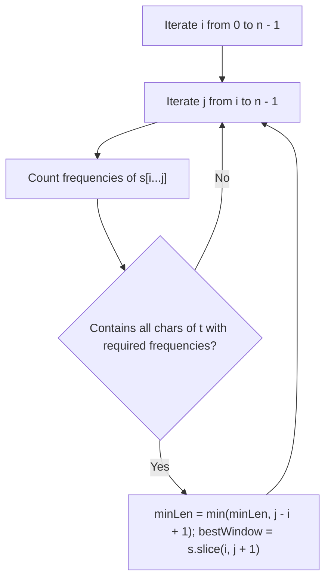
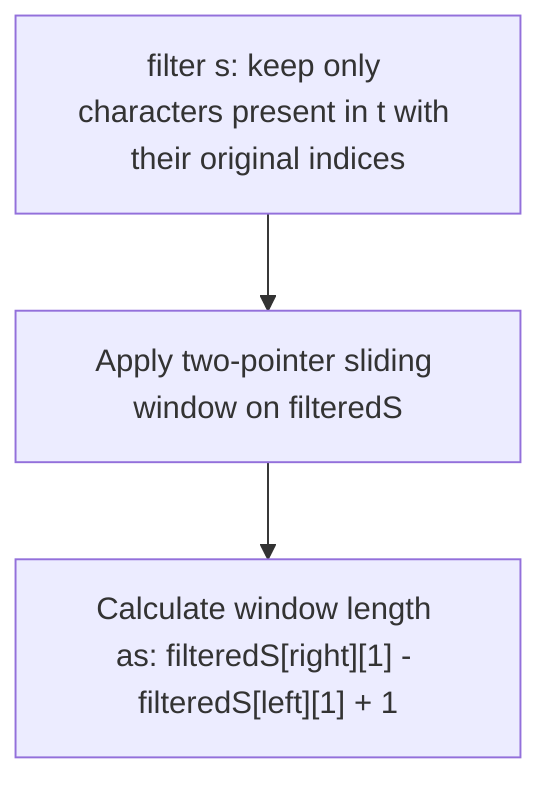
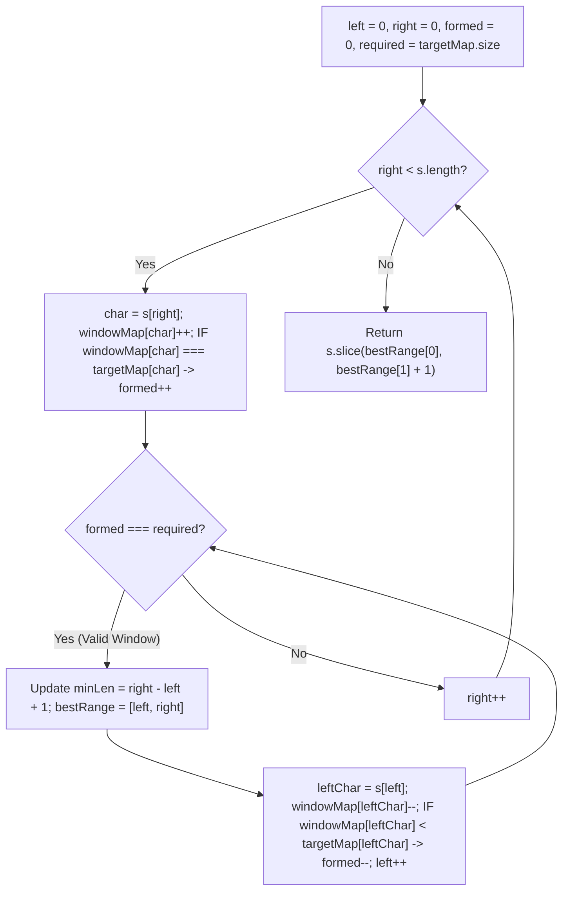
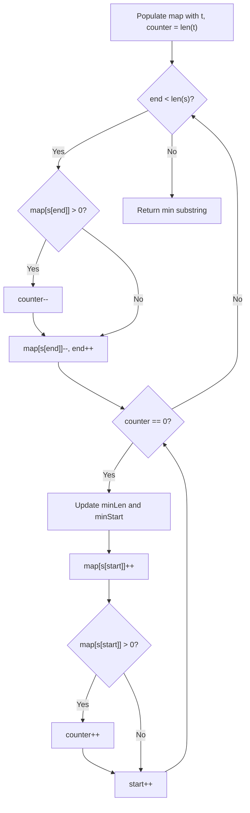

# 76. Minimum Window Substring

- **LeetCode Link**: `https://leetcode.com/problems/minimum-window-substring/`
- **Difficulty**: Hard
- **Pattern Category**: Sliding Window / Hash Table / Two Pointers
- **Prerequisite Primer**: `00-foundations/01-two-pointers.md`

---

## 1. Problem Overview & Edge Case Matrix

### Problem Statement
Given two strings `s` and `t` of lengths `m` and `n` respectively, return the **minimum window substring** of `s` such that every character in `t` (**including duplicates**) is included in the window. If there is no such substring, return the empty string `""`.

The testcases will be generated such that the answer is **unique**.

```
s = "ADOBECODEBANC", t = "ABC"

Valid Windows containing 'A', 'B', 'C':
- "ADOBEC" (Length 6)
- "BECODEBA" (Length 8)
- "CODEBA" (Length 6)
- "BANC" (Length 4 - Minimal!)
Output: "BANC"
```

### Upfront Edge Case Matrix

| Edge Case Scenario | Inputs | Expected Output | Pitfall / Failure Mode |
| :--- | :--- | :--- | :--- |
| `s.length < t.length` | `s = "a"`, `t = "aa"` | `""` | Searching when impossible |
| Exact Match | `s = "a"`, `t = "a"` | `"a"` | Off-by-one window slice boundary |
| Duplicate Requirements | `s = "aa"`, `t = "aa"` | `"aa"` | Treating `t` as a set rather than multiset |
| Characters in `t` Not in `s` | `s = "a"`, `t = "b"` | `""` | Match counter underflow |

---

## 2. Level 1: Brute Force Approach (All Substrings with Multiset Matching)

### Intuition & Visual Idea
Examine every possible substring $s[i \dots j]$. For each substring, count character frequencies and verify whether all character frequency requirements of `t` are met. Track the minimum length valid substring.



### Pseudocode
```text
FUNCTION minWindowBruteForce(s, t):
    IF s.length < t.length: RETURN ""
    minLen = INFINITY
    bestStr = ""
    
    FOR i FROM 0 TO s.length - 1:
        FOR j FROM i TO s.length - 1:
            sub = s.substring(i, j + 1)
            IF CONTAINS_ALL(sub, t):
                IF sub.length < minLen:
                    minLen = sub.length
                    bestStr = sub
    RETURN bestStr
```

### Step-by-Step Dry Run
`s = "ADOBECODEBANC"`, `t = "ABC"`

| Start `i` | End `j` | Substring | Contains `A:1, B:1, C:1`? | Action |
| :--- | :--- | :--- | :--- | :--- |
| 0 | 5 | `"ADOBEC"` | **Yes** | `minLen = 6, best = "ADOBEC"` |
| 5 | 10 | `"CODEBA"` | **Yes** | `minLen = 6` |
| 9 | 12 | `"BANC"` | **Yes** | `minLen = 4, best = "BANC"` |

### Modern JavaScript Implementation
```javascript
/**
 * Level 1: Brute Force All Substrings
 * Time Complexity:  O(N^3)
 * Space Complexity: O(Sigma)
 */
function minWindowBruteForce(s, t) {
  if (s.length < t.length) return '';

  const tMap = new Map();
  for (const c of t) tMap.set(c, (tMap.get(c) || 0) + 1);

  let minLen = Infinity;
  let best = '';

  for (let i = 0; i < s.length; i++) {
    for (let j = i; j < s.length; j++) {
      if (j - i + 1 >= minLen) continue; // Pruning

      const windowMap = new Map();
      for (let k = i; k <= j; k++) {
        windowMap.set(s[k], (windowMap.get(s[k]) || 0) + 1);
      }

      let valid = true;
      for (const [char, count] of tMap.entries()) {
        if ((windowMap.get(char) || 0) < count) {
          valid = false;
          break;
        }
      }

      if (valid) {
        minLen = j - i + 1;
        best = s.slice(i, j + 1);
      }
    }
  }

  return best;
}
```

### Complexity Breakdown
- **Time Complexity**: $O(N^3)$ — $O(N^2)$ substrings, each taking $O(N)$ to count frequencies.
- **Space Complexity**: $O(\Sigma)$ — Hash maps for character frequencies.

#### 🎙️ How to Explain to Interviewer (Verbatim Script)
> *"This brute-force approach inspects all $O(N^2)$ substrings in $s$ and verifies whether each candidate contains all characters in $t$ with sufficient counts. This takes $O(N^3)$ time and $O(\Sigma)$ auxiliary space."*

---

## 3. Level 2: Optimized Approach (Filtered Characters Sliding Window)

### Intuition & Visual Bottleneck Elimination
Most characters in `s` might not even exist in `t`!
We can pre-filter `s` into an array `filteredS = [[char, originalIndex], ...]`, filtering out irrelevant characters. We then apply sliding window exclusively across `filteredS`.



### Pseudocode
```text
FUNCTION minWindowFiltered(s, t):
    filteredS = []
    FOR i FROM 0 TO s.length - 1:
        IF tMap.has(s[i]):
            filteredS.push([s[i], i])
            
    // Standard sliding window over filteredS
```

### Step-by-Step Dry Run
`s = "A D O B E C O D E B A N C"`, `t = "ABC"`
`filteredS = [ ['A',0], ['B',3], ['C',5], ['B',9], ['A',10], ['C',12] ]`

| Window in `filteredS` | Original Range in `s` | Window String | Length |
| :--- | :--- | :--- | :--- |
| `[0 ... 2]` | `s[0 ... 5]` | `"ADOBEC"` | 6 |
| `[1 ... 4]` | `s[3 ... 10]` | `"BECODEBA"` | 8 |
| `[3 ... 5]` | `s[9 ... 12]` | `"BANC"` | **4** |

### Modern JavaScript Implementation
```javascript
/**
 * Level 2: Filtered Sliding Window
 * Time Complexity:  O(|S| + |T|)
 * Space Complexity: O(|S| + |T|)
 */
function minWindowFiltered(s, t) {
  if (s.length < t.length) return '';

  const targetMap = new Map();
  for (const c of t) targetMap.set(c, (targetMap.get(c) || 0) + 1);

  const filtered = [];
  for (let i = 0; i < s.length; i++) {
    if (targetMap.has(s[i])) {
      filtered.push([s[i], i]);
    }
  }

  const windowMap = new Map();
  let formed = 0;
  const required = targetMap.size;
  let minLen = Infinity;
  let bestRange = [-1, -1];

  let left = 0;
  for (let right = 0; right < filtered.length; right++) {
    const [char] = filtered[right];
    windowMap.set(char, (windowMap.get(char) || 0) + 1);

    if (windowMap.get(char) === targetMap.get(char)) {
      formed++;
    }

    while (left <= right && formed === required) {
      const startIdx = filtered[left][1];
      const endIdx = filtered[right][1];
      const currentLen = endIdx - startIdx + 1;

      if (currentLen < minLen) {
        minLen = currentLen;
        bestRange = [startIdx, endIdx];
      }

      const [leftChar] = filtered[left];
      windowMap.set(leftChar, windowMap.get(leftChar) - 1);
      if (windowMap.get(leftChar) < targetMap.get(leftChar)) {
        formed--;
      }
      left++;
    }
  }

  return minLen === Infinity ? '' : s.slice(bestRange[0], bestRange[1] + 1);
}
```

### Complexity Breakdown
- **Time Complexity**: $O(|S| + |T|)$ — Linear scan to filter, linear scan across filtered elements.
- **Space Complexity**: $O(|S| + |T|)$ — Stores the `filtered` list in heap memory.

#### 🎙️ How to Explain to Interviewer (Verbatim Script)
> *"For **Time Complexity**, this runs in $O(|S| + |T|)$ time. Filtering out irrelevant characters reduces the effective search space for sliding window operations when $|T| \ll |S|$.
>
> For **Space Complexity**, it takes $O(|S| + |T|)$ auxiliary memory to store the filtered character-index tuples."*

---

## 4. Level 3: Most Optimal / Canonical Approach (In-Place Array Sliding Window with Match Counter)

### Intuition & Invariant Proof
1. Maintain a frequency map of `t` (`targetMap`) and active `windowMap`.
2. Maintain `formed`: number of unique characters whose required count has been satisfied in the current window.
3. **Expand Right**: Add `s[right]` to `windowMap`. If `windowMap.get(char) === targetMap.get(char)`, increment `formed++`.
4. **Shrink Left**: When `formed === targetMap.size` (all required characters satisfied):
   - Record `[left, right]` if `right - left + 1 < minLen`.
   - Remove `s[left]` from `windowMap`. If `windowMap.get(leftChar) < targetMap.get(leftChar)`, decrement `formed--`.
   - Advance `left++`.
5. Return the minimal window substring.

```
s = "A D O B E C O D E B A N C" , t = "ABC" (required unique chars = 3)
Window expands to s[0..5] ("ADOBEC"): formed = 3 -> valid! minLen = 6
Shrink left: remove 'A', formed = 2 -> expand right until 'A' found at index 10.
Window s[9..12] ("BANC"): formed = 3 -> valid! minLen = 4 (Minimal!)
```



### Pseudocode
```text
FUNCTION minWindow(s, t):
    IF s.length < t.length: RETURN ""
    targetMap = BUILD_MAP(t)
    windowMap = new Map()
    
    formed = 0, required = targetMap.size
    minLen = INFINITY, best = [-1, -1]
    left = 0
    
    FOR right FROM 0 TO s.length - 1:
        c = s[right]
        windowMap.set(c, (windowMap.get(c) || 0) + 1)
        IF targetMap.has(c) AND windowMap.get(c) == targetMap.get(c):
            formed++
            
        WHILE left <= right AND formed == required:
            IF right - left + 1 < minLen:
                minLen = right - left + 1
                best = [left, right]
                
            leftChar = s[left]
            windowMap.set(leftChar, windowMap.get(leftChar) - 1)
            IF targetMap.has(leftChar) AND windowMap.get(leftChar) < targetMap.get(leftChar):
                formed--
            left++
            
    RETURN minLen == INFINITY ? "" : s.substring(best[0], best[1] + 1)
```

### Step-by-Step Dry Run
`s = "ADOBECODEBANC"`, `t = "ABC"`, `required = 3`

| `right` | `s[right]` | `formed` | `formed === 3` | `left` | Current Window | `minLen` |
| :--- | :--- | :--- | :--- | :--- | :--- | :--- |
| 5 | `'C'` | 3 | **True** | 0 | `"ADOBEC"` | 6 |
| 5 | `'C'` | 2 (Shrink `'A'`) | False | 1 | - | 6 |
| 10 | `'A'` | 3 | **True** | 1 | `"DOBECODEBA"` | 6 |
| 10 | `'A'` | 3 | **True** | 5 | `"CODEBA"` | 6 |
| 12 | `'C'` | 3 | **True** | 9 | `"BANC"` | **4** |

### Modern JavaScript Implementation
```javascript
/**
 * Level 3: Direct Sliding Window with Formed Counter (Canonical Optimal)
 * Time Complexity:  O(|S| + |T|)
 * Space Complexity: O(Sigma)
 */
function minWindow(s, t) {
  if (s.length < t.length) return '';

  const targetMap = new Map();
  for (let i = 0; i < t.length; i++) {
    const c = t[i];
    targetMap.set(c, (targetMap.get(c) || 0) + 1);
  }

  const windowMap = new Map();
  let formed = 0;
  const required = targetMap.size;

  let minLen = Infinity;
  let bestStart = 0;
  let bestEnd = 0;

  let left = 0;
  for (let right = 0; right < s.length; right++) {
    const char = s[right];
    windowMap.set(char, (windowMap.get(char) || 0) + 1);

    if (targetMap.has(char) && windowMap.get(char) === targetMap.get(char)) {
      formed++;
    }

    // Shrink window while valid
    while (left <= right && formed === required) {
      const windowLen = right - left + 1;
      if (windowLen < minLen) {
        minLen = windowLen;
        bestStart = left;
        bestEnd = right;
      }

      const leftChar = s[left];
      windowMap.set(leftChar, windowMap.get(leftChar) - 1);
      if (targetMap.has(leftChar) && windowMap.get(leftChar) < targetMap.get(leftChar)) {
        formed--;
      }
      left++;
    }
  }

  return minLen === Infinity ? '' : s.slice(bestStart, bestEnd + 1);
}
```

### Complexity Breakdown
- **Time Complexity**: $O(|S| + |T|)$ — Building `targetMap` takes $O(|T|)$. In `s`, `right` increments $|S|$ times and `left` increments at most $|S|$ times ($2|S|$ operations).
- **Space Complexity**: $O(\Sigma)$ — Hash maps store at most unique characters in $S$ and $T$.

#### 🎙️ How to Explain to Interviewer (Verbatim Script)
> *"For **Time Complexity**, this algorithm runs in $O(|S| + |T|)$ linear time. Precomputing target frequencies takes $O(|T|)$. We then slide a dynamic window across $s$ using two pointers. We maintain a `formed` match counter so that validating whether the current window contains all target characters is an $O(1)$ integer comparison rather than scanning a 128-entry map. The left and right pointers each traverse $s$ at most once.
>
> For **Space Complexity**, it is $O(\Sigma)$ auxiliary space, where $\Sigma$ is the alphabet size of unique characters stored in the frequency maps."*

---

## 5. JavaScript-Specific Gotchas & V8 Optimizations
- **Strict Count Match**: We increment `formed++` strictly when `windowMap.get(char) === targetMap.get(char)` (exact equality), not `>=`. If `windowMap.get(char) > targetMap.get(char)`, `formed` has already been credited.

---

## 6. Real-World MAANG Interview Follow-Ups & Extensions

### Follow-Up 1: Minimum Window Substring with Zero Extra Memory (Typed Array ASCII Table)
- **Scenario**: When strings consist only of standard ASCII characters, eliminate Map allocation entirely.
- **JS Code**:
```javascript
function minWindowASCII(s, t) {
  if (s.length < t.length) return '';
  const target = new Int32Array(128);
  const window = new Int32Array(128);
  let required = 0;

  for (let i = 0; i < t.length; i++) {
    const code = t.charCodeAt(i);
    if (target[code] === 0) required++;
    target[code]++;
  }

  let formed = 0, minLen = Infinity, start = 0, left = 0;
  for (let right = 0; right < s.length; right++) {
    const rCode = s.charCodeAt(right);
    window[rCode]++;
    if (target[rCode] > 0 && window[rCode] === target[rCode]) formed++;

    while (left <= right && formed === required) {
      if (right - left + 1 < minLen) {
        minLen = right - left + 1;
        start = left;
      }
      const lCode = s.charCodeAt(left);
      window[lCode]--;
      if (target[lCode] > 0 && window[lCode] < target[lCode]) formed--;
      left++;
    }
  }

  return minLen === Infinity ? '' : s.slice(start, start + minLen);
}
```

### Follow-Up 2: Smallest Subarray Containing All Occurrences of Most Frequent Element
- **Scenario**: Find the shortest contiguous subarray containing every occurrence of the array's most frequent element (LeetCode 697).
- **Solution Strategy**: Track `{ firstIndex, lastIndex, frequency }` in a single hash map pass.

---

## 7. What LeetCode Discuss Says (Language-Independent)

Source: top-voted post by zjh08177 (with explanation by redtesla) —
`https://leetcode.com/problems/minimum-window-substring/solutions/26808/here-is-a-10-line-template-that-can-solve-most-substring-problems/`
— 1M+ views / 7K+ votes / 278+ comments.
Language-independent summary. No new JS here.

### A. Optimal way from Discuss (Sliding Window + Frequency Map Template)

This is the famous "10-line template that solves most substring problems". We use two pointers: `start` and `end`.
1. We use a Hash Map (or fixed array of size 128 for ASCII) to count how many times each character in `t` is required.
2. We use a `counter` equal to the length of `t` to track how many *required characters* are currently missing from our window.
3. We move `end` to expand the window. If the current character is required (its count in the map > 0), we decrease the `counter`. We decrease the character's count in the map regardless.
4. When `counter == 0`, the window is valid. We then record the minimum window size and try to shrink it by moving `start`.
5. When shrinking, if the character leaving the window is a required one (its count becomes > 0), we increase the `counter`, making the window invalid again, forcing `end` to move forward.

```text
FUNCTION minWindow(s, t):
    IF length(s) == 0 OR length(t) == 0:
        RETURN ""
        
    map = Array of 128 integers, all 0
    FOR each char in t:
        map[char]++
        
    counter = length(t)
    start = 0, end = 0
    minStart = 0, minLen = INFINITY
    
    WHILE end < length(s):
        // If s[end] is in t, decrease the required counter
        IF map[s[end]] > 0:
            counter--
        
        // Decrease the frequency in map (can be negative for chars not in t or excess chars)
        map[s[end]]--
        end++
        
        // When counter is 0, the window is valid. Try shrinking it.
        WHILE counter == 0:
            IF end - start < minLen:
                minLen = end - start
                minStart = start
                
            // s[start] is leaving the window
            map[s[start]]++
            
            // If it was a required char, our window is now invalid
            IF map[s[start]] > 0:
                counter++
                
            start++
            
    IF minLen == INFINITY:
        RETURN ""
    ELSE:
        RETURN substring(s, minStart, minLen)
```

- Time: O(S + T) where S and T are the lengths of strings `s` and `t`. Both `start` and `end` traverse `s` at most once.
- Space: O(1) because the ASCII map is a constant size (128).



### B. Dry run on LeetCode Example 1 (s = "ADOBECODEBANC", t = "ABC")

Initial Map: `A:1, B:1, C:1`. `counter = 3`.

| `end` | `s[end]` | `map` (key elements) | `counter` | `start` (shrinking logic) | `minLen` |
| :--- | :--- | :--- | :--- | :--- | :--- |
| 0 | 'A' | `A:0, B:1, C:1` | 2 | | INF |
| 1-2 | 'D','O' | `A:0, B:1, C:1, D:-1...` | 2 | | INF |
| 3 | 'B' | `A:0, B:0, C:1` | 1 | | INF |
| 4-4 | 'E' | ... | 1 | | INF |
| 5 | 'C' | `A:0, B:0, C:0` | **0 (Valid)** | Shrink `start`: 'A' leaves. `A:1`. `counter` = 1. Window was `0..5` | 6 |
| 6-9 | ... | `B:-1, C:-1` ... | 1 | | 6 |
| 10 | 'A' | `A:0, B:-1, C:-1` | **0 (Valid)** | Shrink `start`: 'D','O','B','E','C' leave. `C:0`. `counter` = 1. Window was `5..10` | 6 |
| 11 | 'N' | ... | 1 | | 6 |
| 12 | 'C' | `A:0, B:0, C:0` | **0 (Valid)** | Shrink `start`: 'O','D','E','B','A' leave. `A:1`. `counter` = 1. Window was `9..12` | 4 ("BANC") |

### C. Pitfalls from comments

- **Negative values in the map:** A common point of confusion is why the map values go negative. The map tracks `required_count - current_window_count`. If a character is not in `t` at all, its value drops to `-1, -2, ...` as we expand, and returns to `0` as we shrink. If it is in `t` but we have *excess*, it also drops below `0`. We only increase the `counter` when a value becomes strictly `> 0`, meaning we are actually missing a required character.
- **`end++` vs Length Calculation:** The algorithm increments `end++` *before* the inner `WHILE` loop. Because of this, the window size calculation is simply `end - start` (not `end - start + 1`). This off-by-one is a massive source of bugs.
- **Cryptic Code-Golf:** The original post writes `if (map[s[end++]]-- > 0) counter--;`. The discussion highly recommends expanding this out into readable lines for actual interviews, as doing operations inside array indices with post-increments is prone to errors and hard for an interviewer to read.

### D. Companies

- Discuss post itself names none.
  Companies tab on LeetCode is premium-locked.
- External source:
  `https://github.com/liquidslr/leetcode-company-wise-problems`
  (LeetCode company tags, updated June 2025).
- All-time (36): Adobe, Airbnb, Amazon, Anduril, Apollo.io, Apple, Bloomberg, Cisco, DP world, Goldman Sachs, Google, Harness, IBM, Infosys, LinkedIn, Lyft, Meesho, Meta, Microsoft, Moloco, Oracle, Qualtrics, Salesforce, SAP, Snap, Snowflake, SoFi, Swiggy, Thoughtspot, TikTok, Uber, Walmart Labs, Wissen Technology, Yandex, Zeta, Zoho.
- Recent: 30 days — Amazon.
- Recent: 3 months — Amazon, Google, Lyft, Meta, Microsoft.
