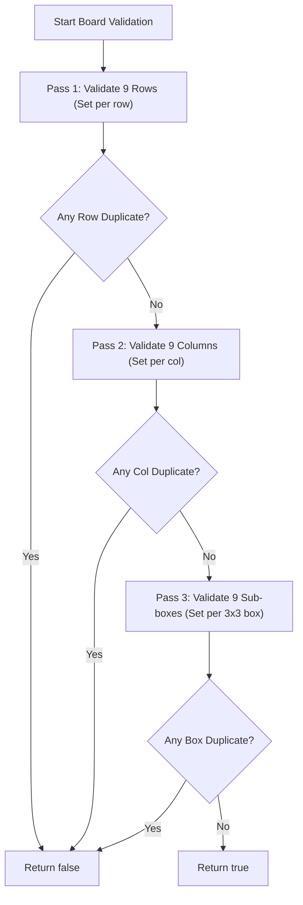
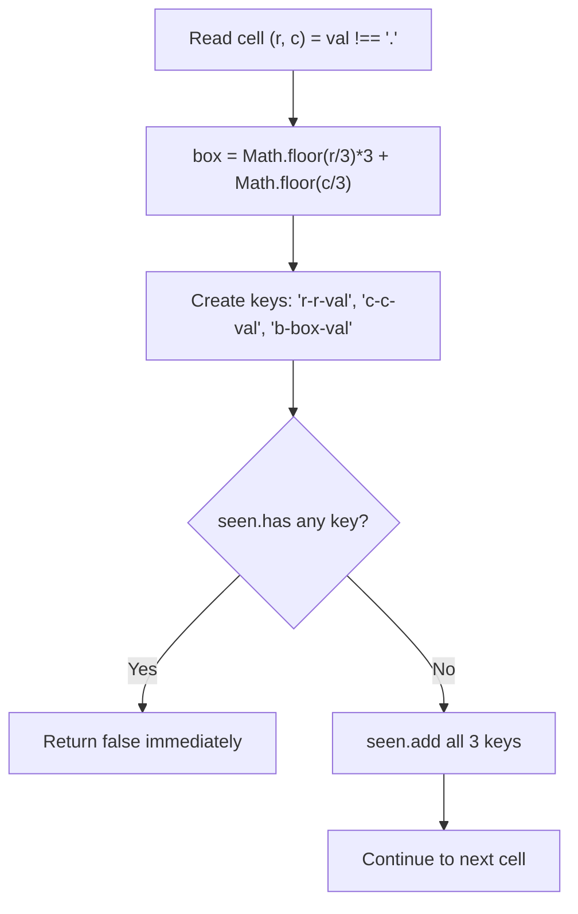
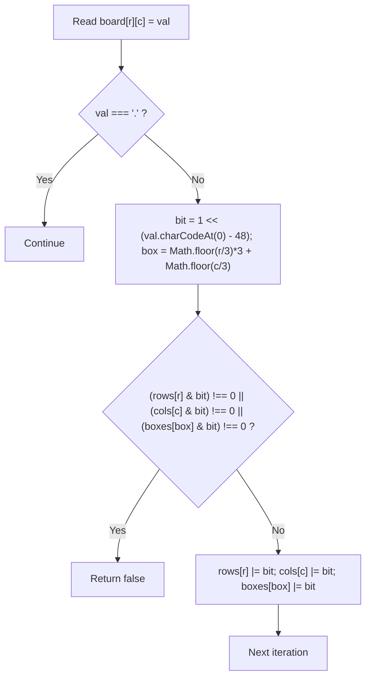
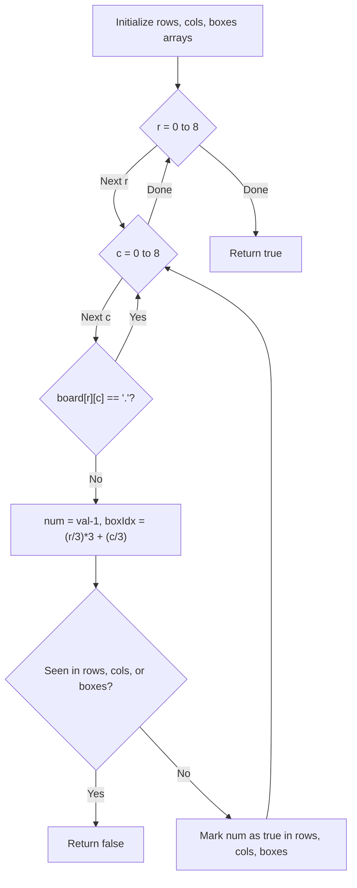

# 36. Valid Sudoku

- **LeetCode Link**: `https://leetcode.com/problems/valid-sudoku/`
- **Difficulty**: Medium
- **Pattern Category**: Matrix / Hash Table / Bitmask
- **Prerequisite Primer**: `00-foundations/01-js-interview-runtime-quirks.md`

---

## 1. Problem Overview & Edge Case Matrix

### Problem Statement
Determine if a $9 \times 9$ Sudoku board is valid. Only the filled cells need to be validated according to the following rules:
1. Each row must contain the digits `1-9` without repetition.
2. Each column must contain the digits `1-9` without repetition.
3. Each of the nine $3 \times 3$ sub-boxes of the grid must contain the digits `1-9` without repetition.

**Note**:
- A Sudoku board (partially filled) could be valid but is not necessarily solvable.
- Only the filled cells need to be validated according to the mentioned rules.
- Empty cells are indicated by the character `'.'`.

```
Board Dimension: 9x9
Sub-box Index Formula: boxIndex = Math.floor(r / 3) * 3 + Math.floor(c / 3)

       Col 0..2     Col 3..5     Col 6..8
Row 0..2 [ Box 0 ]    [ Box 1 ]    [ Box 2 ]
Row 3..5 [ Box 3 ]    [ Box 4 ]    [ Box 5 ]
Row 6..8 [ Box 6 ]    [ Box 7 ]    [ Box 8 ]
```

### Upfront Edge Case Matrix

| Edge Case Scenario | Inputs | Expected Output | Pitfall / Failure Mode |
| :--- | :--- | :--- | :--- |
| Completely Empty Board | All 81 cells are `'.'` | `true` | Attempting to process `'.'` as digits |
| Single Duplicate in Row | `board[0][0] = '5'`, `board[0][8] = '5'` | `false` | Failing to span entire row length |
| Single Duplicate in Sub-Box | `board[0][0] = '8'`, `board[2][2] = '8'` | `false` | Incorrect 2D-to-1D sub-box mapping |
| All 81 Valid Cells (Complete) | Fully solved valid Sudoku | `true` | Off-by-one boundary validation |
| Multiple Duplicate Sets | Duplicates in rows and boxes | `false` | Early termination vs unhandled exceptions |

---

## 2. Level 1: Brute Force Approach (Three Separate Passes)

### Intuition & Visual Idea
Check each of the 3 rules independently through 3 separate traversals:
1. Check each of the 9 rows: verify no duplicates among non-dot characters.
2. Check each of the 9 columns: verify no duplicates among non-dot characters.
3. Check each of the nine $3 \times 3$ sub-boxes: verify no duplicates among non-dot characters.



### Pseudocode
```text
FUNCTION isValidSudokuBruteForce(board):
    // 1. Check rows
    FOR r FROM 0 TO 8:
        seen = NEW SET()
        FOR c FROM 0 TO 8:
            val = board[r][c]
            IF val != '.':
                IF seen.HAS(val): RETURN false
                seen.ADD(val)

    // 2. Check columns
    FOR c FROM 0 TO 8:
        seen = NEW SET()
        FOR r FROM 0 TO 8:
            val = board[r][c]
            IF val != '.':
                IF seen.HAS(val): RETURN false
                seen.ADD(val)

    // 3. Check 3x3 boxes
    FOR box FROM 0 TO 8:
        seen = NEW SET()
        startR = (box / 3) * 3
        startC = (box % 3) * 3
        FOR r FROM 0 TO 2:
            FOR c FROM 0 TO 2:
                val = board[startR + r][startC + c]
                IF val != '.':
                    IF seen.HAS(val): RETURN false
                    seen.ADD(val)

    RETURN true
```

### Step-by-Step Dry Run
`board[0] = ["5","3",".",".","7",".",".",".","."]`

| Pass | Target | Cells Checked | Non-dot Values | `seen.has(val)` | Status |
| :--- | :--- | :--- | :--- | :--- | :--- |
| Row Pass | Row 0 | Cols 0..8 | `'5'`, `'3'`, `'7'` | All false | Row 0 Valid |
| Col Pass | Col 0 | Rows 0..8 | `'5'`, `'6'`, `'8'`, `'4'`, `'7'` | All false | Col 0 Valid |
| Box Pass | Box 0 | Rows 0..2, Cols 0..2 | `'5'`, `'3'`, `'6'`, `'9'`, `'8'` | All false | Box 0 Valid |

### Modern JavaScript Implementation
```javascript
/**
 * Level 1: Brute Force (Three Separate Validation Passes)
 * Time Complexity:  O(1) - Exactly 3 * 81 = 243 operations for 9x9 grid
 * Space Complexity: O(1) - Auxiliary Set holds at most 9 elements
 */
function isValidSudokuBruteForce(board) {
  // Check rows
  for (let r = 0; r < 9; r++) {
    const seen = new Set();
    for (let c = 0; c < 9; c++) {
      const val = board[r][c];
      if (val !== '.') {
        if (seen.has(val)) return false;
        seen.add(val);
      }
    }
  }

  // Check columns
  for (let c = 0; c < 9; c++) {
    const seen = new Set();
    for (let r = 0; r < 9; r++) {
      const val = board[r][c];
      if (val !== '.') {
        if (seen.has(val)) return false;
        seen.add(val);
      }
    }
  }

  // Check 3x3 sub-boxes
  for (let box = 0; box < 9; box++) {
    const seen = new Set();
    const startR = Math.floor(box / 3) * 3;
    const startC = (box % 3) * 3;

    for (let r = 0; r < 3; r++) {
      for (let c = 0; c < 3; c++) {
        const val = board[startR + r][startC + c];
        if (val !== '.') {
          if (seen.has(val)) return false;
          seen.add(val);
        }
      }
    }
  }

  return true;
}
```

### Complexity Breakdown
- **Time Complexity**: $O(1)$ — Since the grid is strictly $9 \times 9$, there are at most $3 \times 81 = 243$ cell checks. In generalized $N \times N$, this is $O(N^2)$.
- **Space Complexity**: $O(1)$ — The `Set` holds at most 9 digits at any time.

#### 🎙️ How to Explain to Interviewer
> *"In this baseline approach, we validate the three Sudoku invariants in three distinct passes: one pass for each row, one pass for each column, and one pass for each of the nine $3 \times 3$ sub-grids. Each pass isolates the validation set, making the logic easy to read and verify. For a fixed $9 \times 9$ board, this performs 243 iterations with $O(1)$ auxiliary memory."*

---

## 3. Level 2: Optimized Approach (Single Pass with String Keys / Coordinate Hash)

### Intuition & Visual Bottleneck Elimination
Instead of scanning the grid three times, we can inspect each cell $(r, c)$ exactly once. If the cell contains a digit $v$, we construct three unique descriptor keys:
- Row presence: `r${r}:${val}`
- Col presence: `c${c}:${val}`
- Box presence: `b${boxIdx}:${val}` where `boxIdx = Math.floor(r / 3) * 3 + Math.floor(c / 3)`.

If any of these three keys is already in our `Set`, the board violates Sudoku rules and we immediately return `false`.



### Pseudocode
```text
FUNCTION isValidSudokuOptimized(board):
    seen = NEW SET()
    
    FOR r FROM 0 TO 8:
        FOR c FROM 0 TO 8:
            val = board[r][c]
            IF val != '.':
                boxIdx = FLOOR(r / 3) * 3 + FLOOR(c / 3)
                rowKey = "r" + r + val
                colKey = "c" + c + val
                boxKey = "b" + boxIdx + val
                
                IF seen.HAS(rowKey) OR seen.HAS(colKey) OR seen.HAS(boxKey):
                    RETURN false
                    
                seen.ADD(rowKey)
                seen.ADD(colKey)
                seen.ADD(boxKey)
                
    RETURN true
```

### Step-by-Step Dry Run
Cell `(0, 0) = '5'`, `boxIdx = 0`:

| Step | Cell `(r, c)` | Value | Generated Keys | In `seen`? | `seen.size` After |
| :--- | :--- | :--- | :--- | :--- | :--- |
| 1 | `(0, 0)` | `'5'` | `"r0:5"`, `"c0:5"`, `"b0:5"` | None | 3 |
| 2 | `(0, 1)` | `'3'` | `"r0:3"`, `"c1:3"`, `"b0:3"` | None | 6 |
| 3 | `(0, 4)` | `'7'` | `"r0:7"`, `"c4:7"`, `"b1:7"` | None | 9 |
| 4 | `(1, 0)` | `'6'` | `"r1:6"`, `"c0:6"`, `"b0:6"` | None | 12 |

### Modern JavaScript Implementation
```javascript
/**
 * Level 2: Optimized Single Pass with Composite String Hashes
 * Time Complexity:  O(1) - Exactly 81 cell reads
 * Space Complexity: O(1) - Up to 3 * 81 = 243 strings in the Set
 */
function isValidSudokuOptimized(board) {
  const seen = new Set();

  for (let r = 0; r < 9; r++) {
    for (let c = 0; c < 9; c++) {
      const val = board[r][c];
      if (val === '.') continue;

      const boxIdx = Math.floor(r / 3) * 3 + Math.floor(c / 3);
      const rowKey = `r${r}:${val}`;
      const colKey = `c${c}:${val}`;
      const boxKey = `b${boxIdx}:${val}`;

      if (seen.has(rowKey) || seen.has(colKey) || seen.has(boxKey)) {
        return false;
      }

      seen.add(rowKey);
      seen.add(colKey);
      seen.add(boxKey);
    }
  }

  return true;
}
```

### Complexity Breakdown
- **Time Complexity**: $O(1)$ — Visits each of the 81 cells exactly once.
- **Space Complexity**: $O(1)$ — At most $3 \times 81 = 243$ small string entries in the hash set.

#### 🎙️ How to Explain to Interviewer
> *"By encoding the row index, column index, and $3 \times 3$ sub-box index directly into composite hash keys, we collapse the three passes into a single scan over the 81 cells. This provides early termination as soon as any conflict is detected, avoiding redundant memory checks."*

---

## 4. Level 3: Most Optimal / Canonical Approach (Bit Manipulation with Bitmasks)

### Intuition & Mathematical Proof
Each digit is an integer between `1` and `9`. A single 16-bit integer can act as a boolean set of 9 flags!
- If digit $d \in [1, 9]$ is present, we set the $d$-th bit: `mask |= (1 << d)`.
- To check if digit $d$ was previously seen: `(mask & (1 << d)) !== 0`.

We maintain three arrays of length 9:
- `rows[9]`: `rows[r]` is a bitmask of digits seen in row $r$.
- `cols[9]`: `cols[c]` is a bitmask of digits seen in col $c$.
- `boxes[9]`: `boxes[b]` is a bitmask of digits seen in box $b$.

This eliminates all string allocations, avoids garbage collection overhead, and operates using raw CPU bitwise instructions.

```
Digit: 5 -> Bit shifted: 1 << 5 = 0b00100000 (32)
Checking: (mask & (1 << 5)) !== 0
Updating: mask = mask | (1 << 5)
```



### Pseudocode
```text
FUNCTION isValidSudoku(board):
    rows = ARRAY OF SIZE 9 FILLED WITH 0
    cols = ARRAY OF SIZE 9 FILLED WITH 0
    boxes = ARRAY OF SIZE 9 FILLED WITH 0

    FOR r FROM 0 TO 8:
        FOR c FROM 0 TO 8:
            ch = board[r][c]
            IF ch == '.': CONTINUE
            
            bit = 1 << (CHAR_CODE(ch) - 48)
            boxIdx = (r / 3) * 3 + (c / 3)
            
            IF (rows[r] & bit) != 0 OR (cols[c] & bit) != 0 OR (boxes[boxIdx] & bit) != 0:
                RETURN false
                
            rows[r] |= bit
            cols[c] |= bit
            boxes[boxIdx] |= bit

    RETURN true
```

### Step-by-Step Dry Run
`board[0][0] = '5'`, `r=0, c=0, box=0`:

| Step | `(r, c)` | Digit | `bit = 1 << digit` | `rows[0] & bit` | `cols[0] & bit` | `boxes[0] & bit` | State After OR |
| :--- | :--- | :--- | :--- | :--- | :--- | :--- | :--- |
| 1 | `(0, 0)` | 5 | `1 << 5 = 32` | `0 & 32 = 0` | `0 & 32 = 0` | `0 & 32 = 0` | `rows[0]=32, cols[0]=32, boxes[0]=32` |
| 2 | `(0, 1)` | 3 | `1 << 3 = 8` | `32 & 8 = 0` | `0 & 8 = 0` | `32 & 8 = 0` | `rows[0]=40, cols[1]=8, boxes[0]=40` |
| 3 | `(0, 4)` | 7 | `1 << 7 = 128` | `40 & 128 = 0` | `0 & 128 = 0` | `0 & 128 = 0` | `rows[0]=168, cols[4]=128, boxes[1]=128` |
| 4 | Dupl. | 5 | `1 << 5 = 32` | `rows[0] & 32 != 0` | - | - | **Conflict detected! Return `false`** |

### Modern JavaScript Implementation
```javascript
/**
 * Level 3: Canonical Single Pass with Zero-Allocation Bitmasks
 * Time Complexity:  O(1) - 81 iterations using single CPU bitwise operations
 * Space Complexity: O(1) - 3 Uint16Array typed arrays of 9 elements
 */
function isValidSudoku(board) {
  // Use typed arrays for packed SMI representation in V8
  const rows = new Uint16Array(9);
  const cols = new Uint16Array(9);
  const boxes = new Uint16Array(9);

  for (let r = 0; r < 9; r++) {
    for (let c = 0; c < 9; c++) {
      const char = board[r][c];
      if (char === '.') continue;

      // Fast digit extraction avoiding Number() or parseInt()
      const digit = char.charCodeAt(0) - 48; // '1' -> 1, '9' -> 9
      const bit = 1 << digit;
      const boxIdx = Math.floor(r / 3) * 3 + Math.floor(c / 3);

      // Check if bit is already flipped in row, col, or box
      if ((rows[r] & bit) !== 0 || (cols[c] & bit) !== 0 || (boxes[boxIdx] & bit) !== 0) {
        return false;
      }

      // Flip bit in all three tracking masks
      rows[r] |= bit;
      cols[c] |= bit;
      boxes[boxIdx] |= bit;
    }
  }

  return true;
}
```

### Complexity Breakdown
- **Time Complexity**: $O(1)$ — 81 constant-time iterations. Bitwise AND (`&`) and OR (`|`) execute in a single CPU cycle.
- **Space Complexity**: $O(1)$ — $3 \times 9 \times 2 = 54$ bytes of stack/buffer space using `Uint16Array`. Zero dynamic heap object allocation.

#### 🎙️ How to Explain to Interviewer
> *"Because the alphabet of valid characters is strictly bounded between digits 1 and 9, we represent the seen sets as 9-bit bitmasks within 16-bit integers. A digit $d$ corresponds to $1 \ll d$. We check membership with bitwise AND and register observation with bitwise OR. Using `Uint16Array` completely eliminates dynamic string and object allocation, creating zero V8 garbage collection pressure."*

---

## 5. JavaScript-Specific Gotchas & V8 Optimizations
- **GC Overhead of String Concatenation**: Level 2 allocates up to 243 string descriptors (`'r0:5'`, etc.). In high-throughput matrix validation or game solvers, generating thousands of short strings triggers V8 Scavenger garbage collection cycles. Level 3's `Uint16Array` uses 54 bytes total and never triggers GC.
- **Fast Integer Extraction via `charCodeAt(0) - 48`**: In V8, `Number(char)` or `parseInt(char, 10)` requires string parsing and function dispatch. `char.charCodeAt(0) - 48` compiles down to an immediate subtraction instruction in TurboFan JIT.
- **Bitwise 32-bit Truncation**: JavaScript bitwise operations (`<<`, `|`, `&`) operate on 32-bit signed integers. Since Sudoku digits only range from 1 to 9 ($1 \ll 9 = 512$), all bit operations fit safely within 32-bit integers without precision loss.

---

## 6. Real-World MAANG Interview Follow-Ups & Extensions

### Follow-Up 1: Full Sudoku Solver via Backtracking with Bitmasks
- **Scenario**: Given an initial valid partially filled board, fill in all empty cells to solve the puzzle.
- **Solution Strategy**: Use Depth-First Search with backtracking. Maintain the same bitmasks from Level 3. At each empty cell, find allowed digits via `~mask & 0x3FE`, choose the cell with the fewest candidates (MRV heuristic - Minimum Remaining Values), and recurse.
- **JS Code**:
```javascript
function solveSudoku(board) {
  const rows = new Uint16Array(9);
  const cols = new Uint16Array(9);
  const boxes = new Uint16Array(9);
  const emptyCells = [];

  for (let r = 0; r < 9; r++) {
    for (let c = 0; c < 9; c++) {
      if (board[r][c] === '.') {
        emptyCells.push([r, c]);
      } else {
        const bit = 1 << (board[r][c].charCodeAt(0) - 48);
        const b = Math.floor(r / 3) * 3 + Math.floor(c / 3);
        rows[r] |= bit;
        cols[c] |= bit;
        boxes[b] |= bit;
      }
    }
  }

  function backtrack(idx) {
    if (idx === emptyCells.length) return true;

    const [r, c] = emptyCells[idx];
    const b = Math.floor(r / 3) * 3 + Math.floor(c / 3);
    const used = rows[r] | cols[c] | boxes[b];

    for (let digit = 1; digit <= 9; digit++) {
      const bit = 1 << digit;
      if ((used & bit) === 0) {
        rows[r] |= bit;
        cols[c] |= bit;
        boxes[b] |= bit;
        board[r][c] = String(digit);

        if (backtrack(idx + 1)) return true;

        rows[r] ^= bit;
        cols[c] ^= bit;
        boxes[b] ^= bit;
        board[r][c] = '.';
      }
    }
    return false;
  }

  backtrack(0);
}
```

### Follow-Up 2: Validating Generalized $N \times N$ Sudoku Boards ($N = K^2$)
- **Scenario**: Validate an $N \times N$ board (e.g. $16 \times 16$ with $4 \times 4$ sub-boxes or $25 \times 25$ with $5 \times 5$ sub-boxes) streamed over chunks.
- **Solution Strategy**: When $N > 31$, bitwise shifting with standard 32-bit signed integers overflows. We switch to `BigInt` bitmasks (`1n << BigInt(val)`) or `Uint32Array` multi-word bitmaps.
- **JS Code**:
```javascript
function isValidGeneralizedSudoku(board, k) {
  const n = k * k;
  const rows = new Array(n).fill(0n);
  const cols = new Array(n).fill(0n);
  const boxes = new Array(n).fill(0n);

  for (let r = 0; r < n; r++) {
    for (let c = 0; c < n; c++) {
      const val = board[r][c];
      if (val === 0 || val === '.') continue;

      const num = BigInt(val);
      const bit = 1n << num;
      const boxIdx = Math.floor(r / k) * k + Math.floor(c / k);

      if ((rows[r] & bit) !== 0n || (cols[c] & bit) !== 0n || (boxes[boxIdx] & bit) !== 0n) {
        return false;
      }

      rows[r] |= bit;
      cols[c] |= bit;
      boxes[boxIdx] |= bit;
    }
  }

  return true;
}
```

---

## 7. What LeetCode Discuss Says (Language-Independent)

Source: top-voted post by daulat_309 —
`https://leetcode.com/problems/valid-sudoku/solutions/5713401/valid-sudoku-100-beat-o-1-java-c-c-c-python3-go-javascript-typescript/`
— 82.2K views / 411 votes / 18 comments.
Language-independent summary. No new JS here.

### A. Optimal way from Discuss (One Pass with Hash Sets / Boolean Arrays)

To validate a Sudoku board efficiently, we can verify the rows, columns, and 3x3 boxes in a single pass. We can use three arrays of Hash Sets (or 2D boolean arrays since the dimensions are fixed to 9) to keep track of the digits we've seen.
The trickiest part is determining which 3x3 box a cell `(i, j)` belongs to. The formula `boxIndex = (i / 3) * 3 + (j / 3)` maps any `(row, col)` to a box index from 0 to 8.

```text
FUNCTION isValidSudoku(board):
    rows = 9 arrays of size 9 initialized to false
    cols = 9 arrays of size 9 initialized to false
    boxes = 9 arrays of size 9 initialized to false
    
    FOR r = 0 TO 8:
        FOR c = 0 TO 8:
            IF board[r][c] == '.':
                CONTINUE
                
            // Convert character '1'-'9' to integer index 0-8
            num = board[r][c] - '1'
            boxIndex = floor(r / 3) * 3 + floor(c / 3)
            
            IF rows[r][num] OR cols[c][num] OR boxes[boxIndex][num]:
                RETURN false
                
            rows[r][num] = true
            cols[c][num] = true
            boxes[boxIndex][num] = true
            
    RETURN true
```

- Time: O(1) or O(81). Since the board is strictly 9x9, the time complexity is constant.
- Space: O(1) or O(81 * 3). The memory used by the boolean arrays is also strictly constant.



### B. Dry run on LeetCode Example 1 (snippet)

Consider processing the top-left cell `board[0][0] = '5'` and `board[0][1] = '3'`:

| `r` | `c` | `board[r][c]` | `num` | `boxIndex` | Check | Action |
| :--- | :--- | :--- | :--- | :--- | :--- | :--- |
| 0 | 0 | '5' | 4 | (0/3)*3 + (0/3) = 0 | Not seen | `rows[0][4] = true`<br>`cols[0][4] = true`<br>`boxes[0][4] = true` |
| 0 | 1 | '3' | 2 | (0/3)*3 + (1/3) = 0 | Not seen | `rows[0][2] = true`<br>`cols[1][2] = true`<br>`boxes[0][2] = true` |
| ... | ...| ... | ... | ... | ... | ... |

If `board[0][4]` later contains '5', `rows[0][4]` is already true, so we return false.

### C. Pitfalls from comments

- **The `boxIndex` Formula:** The formula `(r / 3) * 3 + (c / 3)` is commonly forgotten in interviews. It relies on integer division (where `floor(r/3)` maps rows 0,1,2 to 0; 3,4,5 to 1; 6,7,8 to 2). An alternative that avoids this is using a 3D boolean array `boxes[r/3][c/3][num] = true`, which is often easier to memorize and conceptualize.
- **Constant Time Confusion:** Some candidates get into debates with interviewers over whether the complexity is $O(N^2)$ where $N=9$, or $O(1)$. Since the grid size is permanently fixed at 9x9 by the problem description, iterating 81 times is technically $O(1)$. In an interview, it's best to say "It's $O(1)$ because the board size is fixed at 81, but generalized to an $N \times N$ board, it would be $O(N^2)$".
- **String Encoding (Not Recommended):** An older popular solution created strings like `"5 in row 0"` and `"5 in col 0"` and added them to a single Hash Set. While clever, this allocates memory and does string concatenation 81 times, making it incredibly slow compared to the boolean array approach.

### D. Companies

- Discuss post itself names none.
  Companies tab on LeetCode is premium-locked.
- External source:
  `https://github.com/liquidslr/leetcode-company-wise-problems`
  (LeetCode company tags, updated June 2025).
- All-time (24): Amazon, Apple, Bloomberg, Confluent, EarnIn, Geico, Goldman Sachs, Google, Karat, Meta, Microsoft, Oracle, PayPal, Riot Games, Samsara, Snap, TikTok, Uber, Upstart, Verkada, Walmart Labs, Wissen Technology, Yandex, Zoho.
- Recent: 30 days — Amazon.
- Recent: 3 months — Amazon, Apple, Bloomberg, Google.
