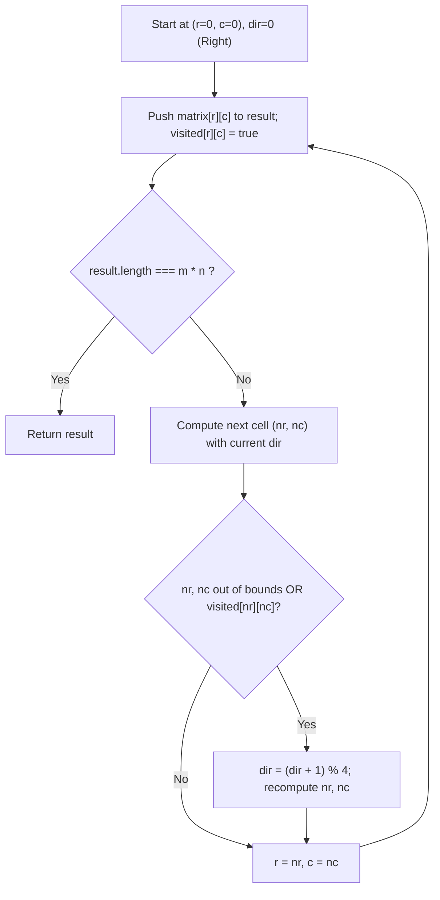
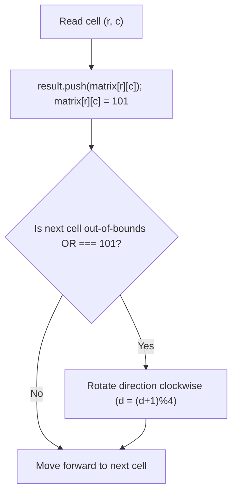
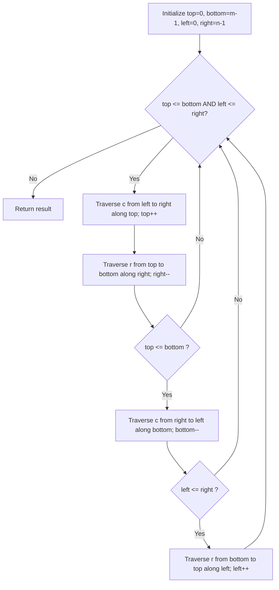
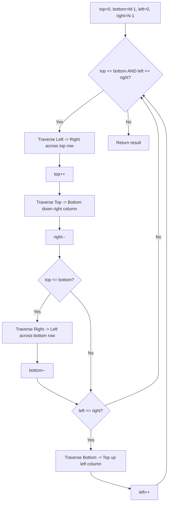

# 54. Spiral Matrix

- **LeetCode Link**: `https://leetcode.com/problems/spiral-matrix/`
- **Difficulty**: Medium
- **Pattern Category**: Matrix / Simulation / Boundary Shrinking
- **Prerequisite Primer**: `00-foundations/01-js-interview-runtime-quirks.md`

---

## 1. Problem Overview & Edge Case Matrix

### Problem Statement
Given an $m \times n$ `matrix`, return all elements of the `matrix` in **spiral order** (clockwise traversal starting from top-left).

```
Matrix: 3 x 3
[ 1 ,  2 ,  3 ]
[ 4 ,  5 ,  6 ]
[ 7 ,  8 ,  9 ]

Spiral Path:
1 -> 2 -> 3
          |
4 -> 5    6
^         |
7 <- 8 <--+

Output: [1, 2, 3, 6, 9, 8, 7, 4, 5]
```

### Upfront Edge Case Matrix

| Edge Case Scenario | Inputs | Expected Output | Pitfall / Failure Mode |
| :--- | :--- | :--- | :--- |
| Single Row ($1 \times N$) | `[[1, 2, 3, 4]]` | `[1, 2, 3, 4]` | Duplicate bottom traverse pass when `top === bottom` |
| Single Column ($M \times 1$) | `[[1], [2], [3]]` | `[1, 2, 3]` | Duplicate left traverse pass when `left === right` |
| Single Element ($1 \times 1$) | `[[42]]` | `[42]` | Infinite loop or off-by-one pointer index |
| Wide Matrix ($2 \times 4$) | `[[1,2,3,4],[5,6,7,8]]` | `[1,2,3,4,8,7,6,5]` | Premature termination before inner scan |
| Tall Matrix ($4 \times 2$) | `[[1,2],[3,4],[5,6],[7,8]]` | `[1,2,4,6,8,7,5,3]` | Incorrect row/col guard checks during turn |

---

## 2. Level 1: Brute Force Approach (Simulation with Visited Grid & Direction Vectors)

### Intuition & Visual Idea
Simulate a walking robot on an $m \times n$ grid.
The robot moves in 4 directions cyclically:
- Right: $(0, 1)$
- Down: $(1, 0)$
- Left: $(0, -1)$
- Up: $(-1, 0)$

We maintain an auxiliary 2D boolean matrix `visited`. When the robot encounters a boundary or an already visited cell, it makes a $90^\circ$ clockwise turn: `dir = (dir + 1) % 4`.



### Pseudocode
```text
FUNCTION spiralOrderBruteForce(matrix):
    IF matrix is empty: RETURN []
    m = matrix.length, n = matrix[0].length
    visited = 2D boolean array of m x n
    dirs = [[0, 1], [1, 0], [0, -1], [-1, 0]]
    d = 0, r = 0, c = 0
    result = []
    
    FOR step FROM 0 TO m * n - 1:
        result.append(matrix[r][c])
        visited[r][c] = true
        
        nr = r + dirs[d][0]
        nc = c + dirs[d][1]
        
        IF nr < 0 OR nr >= m OR nc < 0 OR nc >= n OR visited[nr][nc]:
            d = (d + 1) % 4
            nr = r + dirs[d][0]
            nc = c + dirs[d][1]
            
        r = nr
        c = nc
        
    RETURN result
```

### Step-by-Step Dry Run
`matrix = [[1, 2], [3, 4]]`, $m=2, n=2$

| Step | `(r, c)` | Val | `visited` | Next Attempt | Action | `dir` |
| :--- | :--- | :--- | :--- | :--- | :--- | :--- |
| 0 | `(0, 0)` | 1 | `(0,0)=true` | `(0, 1)` (valid) | Move right | 0 (Right) |
| 1 | `(0, 1)` | 2 | `(0,1)=true` | `(0, 2)` (OOB) | Turn down to `(1, 1)` | 1 (Down) |
| 2 | `(1, 1)` | 4 | `(1,1)=true` | `(2, 1)` (OOB) | Turn left to `(1, 0)` | 2 (Left) |
| 3 | `(1, 0)` | 3 | `(1,0)=true` | Finished | Result: `[1, 2, 4, 3]` | - |

### Modern JavaScript Implementation
```javascript
/**
 * Level 1: Simulation with Visited Matrix and Direction Cycle
 * Time Complexity:  O(M * N)
 * Space Complexity: O(M * N) auxiliary visited grid
 */
function spiralOrderBruteForce(matrix) {
  if (!matrix || matrix.length === 0 || matrix[0].length === 0) return [];

  const m = matrix.length;
  const n = matrix[0].length;
  const total = m * n;
  const result = new Array(total);
  const visited = Array.from({ length: m }, () => new Uint8Array(n));

  // Directions: Right, Down, Left, Up
  const dr = [0, 1, 0, -1];
  const dc = [1, 0, -1, 0];
  let d = 0;
  let r = 0;
  let c = 0;

  for (let i = 0; i < total; i++) {
    result[i] = matrix[r][c];
    visited[r][c] = 1;

    let nr = r + dr[d];
    let nc = c + dc[d];

    // Check if next coordinate is out of bounds or already visited
    if (nr < 0 || nr >= m || nc < 0 || nc >= n || visited[nr][nc] === 1) {
      d = (d + 1) % 4; // Turn 90 degrees clockwise
      nr = r + dr[d];
      nc = c + dc[d];
    }

    r = nr;
    c = nc;
  }

  return result;
}
```

### Complexity Breakdown
- **Time Complexity**: $O(M \times N)$ — Exactly $M \times N$ iterations, constant work per cell.
- **Space Complexity**: $O(M \times N)$ auxiliary space for the `visited` grid.

#### 🎙️ How to Explain to Interviewer
> *"We model the spiral as a direct simulation of a walker moving with a direction vector. Whenever the next forward step violates boundaries or enters a visited cell, the walker rotates $90^\circ$ clockwise. This approach cleanly mirrors physical movement but requires $O(M \times N)$ extra memory for the visited matrix."*

---

## 3. Level 2: Optimized Approach (In-Place Sentinel Marking)

### Intuition & Visual Bottleneck Elimination
The problem constraints state that $-100 \le \text{matrix}[i][j] \le 100$.
Instead of allocating an auxiliary $M \times N$ `visited` grid, we can mark visited cells in-place with a sentinel value outside the domain, such as `101`.



### Pseudocode
```text
FUNCTION spiralOrderSentinel(matrix):
    m = matrix.length, n = matrix[0].length
    SENTINEL = 101
    dirs = [[0, 1], [1, 0], [0, -1], [-1, 0]]
    d = 0, r = 0, c = 0
    result = []
    
    FOR i FROM 0 TO m * n - 1:
        result.append(matrix[r][c])
        matrix[r][c] = SENTINEL
        
        nr = r + dirs[d][0]
        nc = c + dirs[d][1]
        
        IF nr < 0 OR nr >= m OR nc < 0 OR nc >= n OR matrix[nr][nc] == SENTINEL:
            d = (d + 1) % 4
            nr = r + dirs[d][0]
            nc = c + dirs[d][1]
            
        r = nr
        c = nc
        
    RETURN result
```

### Step-by-Step Dry Run
`matrix = [[1, 2], [3, 4]]`

| Step | `(r, c)` | Read Val | Mutated Grid | Next Move | Turn Needed? |
| :--- | :--- | :--- | :--- | :--- | :--- |
| 0 | `(0, 0)` | 1 | `[[101, 2], [3, 4]]` | `(0, 1)` | No |
| 1 | `(0, 1)` | 2 | `[[101, 101], [3, 4]]` | `(0, 2)` (OOB) | Yes $\to$ `(1, 1)` |
| 2 | `(1, 1)` | 4 | `[[101, 101], [3, 101]]`| `(2, 1)` (OOB) | Yes $\to$ `(1, 0)` |
| 3 | `(1, 0)` | 3 | `[[101, 101], [101, 101]]`| Complete | Done |

### Modern JavaScript Implementation
```javascript
/**
 * Level 2: In-Place Sentinel Mutation
 * Time Complexity:  O(M * N)
 * Space Complexity: O(1) auxiliary (mutates input matrix)
 */
function spiralOrderSentinel(matrix) {
  if (!matrix || matrix.length === 0 || matrix[0].length === 0) return [];

  const m = matrix.length;
  const n = matrix[0].length;
  const total = m * n;
  const result = new Array(total);
  const SENTINEL = 101; // Out-of-domain marker

  const dr = [0, 1, 0, -1];
  const dc = [1, 0, -1, 0];
  let d = 0;
  let r = 0;
  let c = 0;

  for (let i = 0; i < total; i++) {
    result[i] = matrix[r][c];
    matrix[r][c] = SENTINEL; // In-place stamp

    let nr = r + dr[d];
    let nc = c + dc[d];

    if (nr < 0 || nr >= m || nc < 0 || nc >= n || matrix[nr][nc] === SENTINEL) {
      d = (d + 1) % 4;
      nr = r + dr[d];
      nc = c + dc[d];
    }

    r = nr;
    c = nc;
  }

  return result;
}
```

### Complexity Breakdown
- **Time Complexity**: $O(M \times N)$ — Single pass through each element.
- **Space Complexity**: $O(1)$ auxiliary space — Input array is mutated in place.

#### 🎙️ How to Explain to Interviewer
> *"Because cell values are strictly constrained between -100 and 100, we can reclaim auxiliary space by marking traversed cells in-place with an out-of-domain sentinel (101). This eliminates the $O(M \times N)$ visited matrix, achieving $O(1)$ extra space, provided the caller allows input mutation."*

---

## 4. Level 3: Most Optimal / Canonical Approach (Four Boundary Pointers)

### Intuition & Invariant Proof
We do not need to mutate the input, nor allocate extra visited structures.
A matrix spiral is fundamentally peeling concentric outer layers (rectangles) inward.
We define four dynamic boundaries:
- `top`: Row index of the top unvisited row (starts at `0`).
- `bottom`: Row index of the bottom unvisited row (starts at `m - 1`).
- `left`: Column index of the leftmost unvisited col (starts at `0`).
- `right`: Column index of the rightmost unvisited col (starts at `n - 1`).

In each cycle:
1. Traverse from `left` to `right` along row `top`. Increment `top++`.
2. Traverse from `top` to `bottom` along column `right`. Decrement `right--`.
3. If `top <= bottom`: Traverse from `right` down to `left` along row `bottom`. Decrement `bottom--`.
4. If `left <= right`: Traverse from `bottom` up to `top` along column `left`. Increment `left++`.

```
         left                  right
top   -> [  1 ,   2 ,   3 ,   4  ]
         [  5 ,   6 ,   7 ,   8  ]
bottom-> [  9 ,  10 ,  11 ,  12  ]

Phase 1: Read row top (1..4)   -> top becomes 1
Phase 2: Read col right (8,12) -> right becomes 2
Phase 3: Read row bottom (11,10,9) -> bottom becomes 1
Phase 4: Read col left (5)     -> left becomes 1
Inner layer remaining: [6, 7]
```



### Pseudocode
```text
FUNCTION spiralOrder(matrix):
    top = 0, bottom = matrix.length - 1
    left = 0, right = matrix[0].length - 1
    result = []
    
    WHILE top <= bottom AND left <= right:
        // 1. Traverse Right
        FOR c FROM left TO right:
            result.append(matrix[top][c])
        top++
        
        // 2. Traverse Down
        FOR r FROM top TO bottom:
            result.append(matrix[r][right])
        right--
        
        // 3. Traverse Left (Critical guard!)
        IF top <= bottom:
            FOR c FROM right DOWNTO left:
                result.append(matrix[bottom][c])
            bottom--
            
        // 4. Traverse Up (Critical guard!)
        IF left <= right:
            FOR r FROM bottom DOWNTO top:
                result.append(matrix[r][left])
            left++
            
    RETURN result
```

### Step-by-Step Dry Run
`matrix = [[1, 2, 3], [4, 5, 6], [7, 8, 9]]`, $m=3, n=3$

| Iteration | Phase | Traversed Indices | Elements Added | Boundaries After Phase |
| :--- | :--- | :--- | :--- | :--- |
| Layer 0 | Right | `(0,0), (0,1), (0,2)` | `1, 2, 3` | `top = 1, bottom = 2, left = 0, right = 2` |
| Layer 0 | Down | `(1,2), (2,2)` | `6, 9` | `top = 1, bottom = 2, left = 0, right = 1` |
| Layer 0 | Left | `(2,1), (2,0)` | `8, 7` | `top = 1, bottom = 1, left = 0, right = 1` |
| Layer 0 | Up | `(1,0)` | `4` | `top = 1, bottom = 1, left = 1, right = 1` |
| Layer 1 | Right | `(1,1)` | `5` | `top = 2, bottom = 1, left = 1, right = 1` |
| Termination | - | `top > bottom` | Loop ends | Result: `[1, 2, 3, 6, 9, 8, 7, 4, 5]` |

### Modern JavaScript Implementation
```javascript
/**
 * Level 3: Canonical Boundary Pointers (Zero Mutation, O(1) Auxiliary Space)
 * Time Complexity:  O(M * N)
 * Space Complexity: O(1) auxiliary (excluding return array)
 */
function spiralOrder(matrix) {
  if (!matrix || matrix.length === 0 || matrix[0].length === 0) return [];

  const m = matrix.length;
  const n = matrix[0].length;
  const total = m * n;
  const result = new Array(total);
  let idx = 0;

  let top = 0;
  let bottom = m - 1;
  let left = 0;
  let right = n - 1;

  while (top <= bottom && left <= right) {
    // 1. Traverse Right across top boundary
    for (let c = left; c <= right; c++) {
      result[idx++] = matrix[top][c];
    }
    top++;

    // 2. Traverse Down along right boundary
    for (let r = top; r <= bottom; r++) {
      result[idx++] = matrix[r][right];
    }
    right--;

    // 3. Traverse Left along bottom boundary (Guard against single remaining row)
    if (top <= bottom) {
      for (let c = right; c >= left; c--) {
        result[idx++] = matrix[bottom][c];
      }
      bottom--;
    }

    // 4. Traverse Up along left boundary (Guard against single remaining column)
    if (left <= right) {
      for (let r = bottom; r >= top; r--) {
        result[idx++] = matrix[r][left];
      }
      left++;
    }
  }

  return result;
}
```

### Complexity Breakdown
- **Time Complexity**: $O(M \times N)$ — Every cell is visited exactly once.
- **Space Complexity**: $O(1)$ auxiliary memory — Strictly 4 boundary variables and a pointer index. Input is never mutated.

#### 🎙️ How to Explain to Interviewer
> *"The boundary-shrinking approach models the spiral as peeling concentric rectangular perimeters inward. The two critical invariants are the guards `top <= bottom` before traversing left and `left <= right` before traversing up. Without these guards, non-square matrices (like $1 \times N$ or $M \times 1$) would re-traverse already processed cells in reverse. We pre-allocate the output array to guarantee packed memory layout in V8."*

---

## 5. JavaScript-Specific Gotchas & V8 Optimizations
- **The Non-Square Matrix Trap**: The most common interview bug is omitting `if (top <= bottom)` and `if (left <= right)`. In a $1 \times 4$ matrix, `top` increments from 0 to 1 after the first right pass; without the guard, the bottom pass would execute for row 0 again in reverse, producing duplicates!
- **Pre-allocating Array Length**: Instead of `const result = []; result.push(...)`, initializing `const result = new Array(m * n)` and using `result[idx++] = ...` instructs V8's TurboFan to allocate a contiguous `PACKED_SMI_ELEMENTS` or `PACKED_DOUBLE_ELEMENTS` buffer upfront, completely bypassing dynamic buffer growth and reallocation spikes.

---

## 6. Real-World MAANG Interview Follow-Ups & Extensions

### Follow-Up 1: Spiral Matrix II (In-Place Spiral Generation)
- **Scenario**: Given a positive integer $n$, generate an $n \times n$ matrix filled with elements from `1` to `n^2` in spiral order.
- **Solution Strategy**: Use the identical four boundary pointers, writing an incrementing counter into an uninitialized preallocated 2D matrix.
- **JS Code**:
```javascript
function generateMatrix(n) {
  const matrix = Array.from({ length: n }, () => new Int32Array(n));
  let top = 0, bottom = n - 1;
  let left = 0, right = n - 1;
  let num = 1;

  while (top <= bottom && left <= right) {
    for (let c = left; c <= right; c++) matrix[top][c] = num++;
    top++;
    for (let r = top; r <= bottom; r++) matrix[r][right] = num++;
    right--;
    if (top <= bottom) {
      for (let c = right; c >= left; c--) matrix[bottom][c] = num++;
      bottom--;
    }
    if (left <= right) {
      for (let r = bottom; r >= top; r--) matrix[r][left] = num++;
      left++;
    }
  }

  return matrix;
}
```

### Follow-Up 2: External Memory Spiral Traversal on Gigabyte-Sized Matrices
- **Scenario**: The matrix is $10^5 \times 10^5$ elements stored on disk as row-major binary blocks. You only have 64 MB of RAM. How do you stream the spiral traversal without loading the matrix?
- **Solution Strategy**: Implement a Block-Cache paging system. Top and bottom sweeps read contiguous row slices, requiring sequential disk I/O. Left and right vertical sweeps read stride offsets; buffer vertical chunk pages in an LRU memory cache or transpose chunk blocks prior to traversal.
- **JS Code**:
```javascript
async function* streamSpiralFromDisk(fileHandle, m, n, bytesPerElem = 4) {
  let top = 0, bottom = m - 1;
  let left = 0, right = n - 1;

  async function readCell(r, c) {
    const offset = (r * n + c) * bytesPerElem;
    const buffer = Buffer.alloc(bytesPerElem);
    await fileHandle.read(buffer, 0, bytesPerElem, offset);
    return buffer.readInt32LE(0);
  }

  while (top <= bottom && left <= right) {
    for (let c = left; c <= right; c++) yield await readCell(top, c);
    top++;
    for (let r = top; r <= bottom; r++) yield await readCell(r, right);
    right--;
    if (top <= bottom) {
      for (let c = right; c >= left; c--) yield await readCell(bottom, c);
      bottom--;
    }
    if (left <= right) {
      for (let r = bottom; r >= top; r--) yield await readCell(r, left);
      left++;
    }
  }
}
```

---

## 7. What LeetCode Discuss Says (Language-Independent)

Source: top-voted post by lexitron —
`https://leetcode.com/problems/spiral-matrix/solutions/6321151/clean-code-beats-100-c-java-py3-js-easy-explanation/`
— 55.8K views / 277 votes / 12 comments.
Language-independent summary. No new JS here.

### A. Optimal way from Discuss (Boundary Simulation)

The most intuitive and readable way to traverse the matrix in a spiral is to simulate the process by maintaining four boundary variables: `top`, `bottom`, `left`, and `right`.
We iterate in four directions (Right, Down, Left, Up), shrinking the respective boundary after each direction is completed.

```text
FUNCTION spiralOrder(matrix):
    IF length(matrix) == 0:
        RETURN []
        
    res = []
    top = 0
    bottom = length(matrix) - 1
    left = 0
    right = length(matrix[0]) - 1
    
    WHILE top <= bottom AND left <= right:
        // Traverse Right
        FOR i = left TO right:
            res.push(matrix[top][i])
        top++
        
        // Traverse Down
        FOR i = top TO bottom:
            res.push(matrix[i][right])
        right--
        
        // Check if we still have a valid row to traverse Left
        IF top <= bottom:
            FOR i = right DOWN TO left:
                res.push(matrix[bottom][i])
            bottom--
            
        // Check if we still have a valid column to traverse Up
        IF left <= right:
            FOR i = bottom DOWN TO top:
                res.push(matrix[i][left])
            left++
            
    RETURN res
```

- Time: O(M * N) where M is the number of rows and N is the number of columns. Every element is visited exactly once.
- Space: O(1) extra space (excluding the output array).



### B. Dry run on LeetCode Example 1

Matrix:
```text
[1, 2, 3]
[4, 5, 6]
[7, 8, 9]
```
`top`=0, `bottom`=2, `left`=0, `right`=2.

| Step | Action | Output `res` | Boundary Update |
| :--- | :--- | :--- | :--- |
| 1 | Right: `left` to `right` on `top` (0) | `[1, 2, 3]` | `top++` = 1 |
| 2 | Down: `top` to `bottom` on `right` (2) | `[1, 2, 3, 6, 9]` | `right--` = 1 |
| 3 | Left: `right` to `left` on `bottom` (2) | `[1, 2, 3, 6, 9, 8, 7]` | `bottom--` = 1 |
| 4 | Up: `bottom` to `top` on `left` (0) | `[1, 2, 3, 6, 9, 8, 7, 4]` | `left++` = 1 |
| 5 | Right: `left` to `right` on `top` (1) | `[... 7, 4, 5]` | `top++` = 2 |
| 6 | Loop ends because `top` (2) > `bottom` (1). | | |

### C. Pitfalls from comments

- **Missing the Inner Conditionals:** The most common mistake is omitting `IF top <= bottom:` before moving Left, and `IF left <= right:` before moving Up. Without these checks, if you have a non-square matrix (e.g., 3x4), the loop will bounce back and duplicate the middle elements because the bounds have crossed within the `WHILE` loop itself.
- **Off-by-one errors:** People often try to make the boundary variables exclusive (e.g., `right = cols`, looping to `right - 1`). Using inclusive boundaries (`right = cols - 1`) and `<= ` checks makes the logic significantly easier to reason about.
- **Direction Arrays (Alternative Approach):** Some solutions use a `visited` matrix and a direction array `[(0,1), (1,0), (0,-1), (-1,0)]`. While this avoids boundary shrinking logic, it usually requires $O(M \cdot N)$ extra space for the `visited` matrix, making it less optimal than this boundary simulation.

### D. Companies

- Discuss post itself names none.
  Companies tab on LeetCode is premium-locked.
- External source:
  `https://github.com/liquidslr/leetcode-company-wise-problems`
  (LeetCode company tags, updated June 2025).
- All-time (68): Accenture, Adobe, Akamai, Amazon, AMD, Anduril, Apple, Autodesk, Bloomberg, Capital One, Cisco, Darwinbox, Databricks, Dataminr, Deutsche Bank, Docusign, eBay, Epic Systems, Flipkart, Goldman Sachs, Google, IBM, Infosys, Intuit, Josh Technology, Meta, Microsoft, Morgan Stanley, NetApp, Nordstrom, Nutanix, Nvidia, Oracle, PayPal, PhonePe, PornHub, RBC, Roblox, Salesforce, SIG, TCS, The Trade Desk, TikTok, Uber, Visa, Walmart Labs, Wells Fargo, Wissen Technology, Yahoo, Yandex, Zoho.
- Recent: 30 days — Bloomberg, Google, Microsoft.
- Recent: 3 months — Amazon, Bloomberg, Google, Meta, Microsoft.
