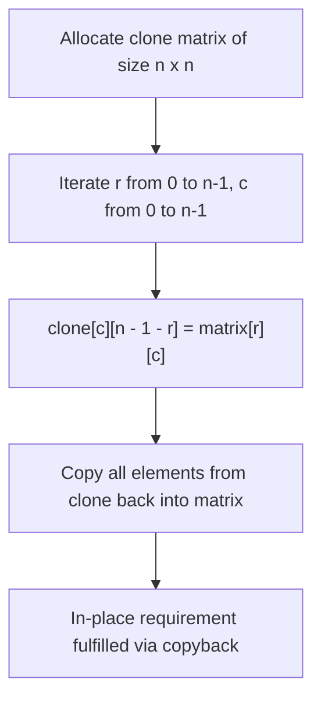
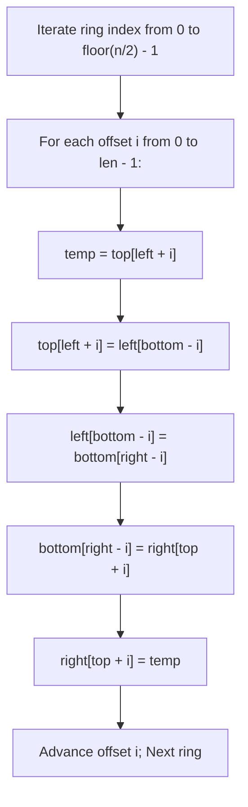
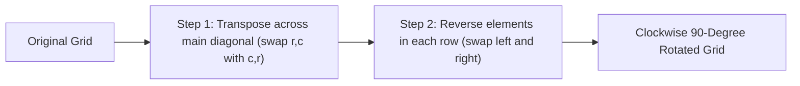
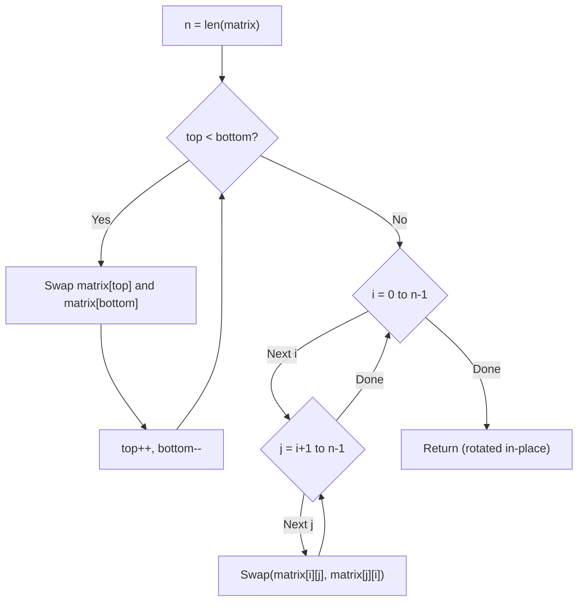

# 48. Rotate Image

- **LeetCode Link**: `https://leetcode.com/problems/rotate-image/`
- **Difficulty**: Medium
- **Pattern Category**: Matrix / In-Place Manipulation / Linear Algebra Transpose
- **Prerequisite Primer**: `00-foundations/01-js-interview-runtime-quirks.md`

---

## 1. Problem Overview & Edge Case Matrix

### Problem Statement
You are given an $n \times n$ 2D `matrix` representing an image, rotate the image by **90 degrees (clockwise)** in-place.

You have to rotate the image **in-place**, which means you have to modify the input 2D matrix directly. **DO NOT** allocate another 2D matrix to perform the rotation.

```
Original Matrix (3x3):       Rotated 90 deg Clockwise:
[ 1 ,  2 ,  3 ]              [ 7 ,  4 ,  1 ]
[ 4 ,  5 ,  6 ]     ===>     [ 8 ,  5 ,  2 ]
[ 7 ,  8 ,  9 ]              [ 9 ,  6 ,  3 ]

Transformation Formula:
Cell at (r, c) moves to (c, n - 1 - r)
- (0, 0) -> (0, 2) [value 1]
- (0, 1) -> (1, 2) [value 2]
- (0, 2) -> (2, 2) [value 3]
```

### Upfront Edge Case Matrix

| Edge Case Scenario | Inputs | Expected Output | Pitfall / Failure Mode |
| :--- | :--- | :--- | :--- |
| Single Cell ($1 \times 1$) | `[[1]]` | `[[1]]` | Out-of-bounds loop termination |
| $2 \times 2$ Minimal Grid | `[[1,2],[3,4]]` | `[[3,1],[4,2]]` | Off-by-one ring bounds |
| Odd Dimension ($3 \times 3, 5 \times 5$) | Center element exists | Center element unchanged | Erroneously overwriting central element |
| Even Dimension ($4 \times 4$) | No single center element | All 4 quadrantal rings rotated | Double-swapping corners |
| Negative and Zero Values | `[[-1, 0], [0, -1]]` | `[[0, -1], [-1, 0]]` | Sign bit corruption |

---

## 2. Level 1: Brute Force Approach (Auxiliary Grid Mapping)

### Intuition & Visual Idea
The geometric transformation of rotating $90^\circ$ clockwise maps cell $(r, c)$ to coordinate $(c, n - 1 - r)$.
Create an auxiliary matrix `clone` of identical size $n \times n$, populate it using the transformation formula, and then copy the contents back into `matrix`.



### Pseudocode
```text
FUNCTION rotateBruteForce(matrix):
    n = matrix.length
    clone = 2D array of size n x n
    
    FOR r FROM 0 TO n - 1:
        FOR c FROM 0 TO n - 1:
            clone[c][n - 1 - r] = matrix[r][c]
            
    FOR r FROM 0 TO n - 1:
        FOR c FROM 0 TO n - 1:
            matrix[r][c] = clone[r][c]
```

### Step-by-Step Dry Run
`matrix = [[1, 2], [3, 4]]`, $n = 2$

| Step | Source `(r, c)` | Value | Target `(c, n - 1 - r)` | Clone Placement |
| :--- | :--- | :--- | :--- | :--- |
| 1 | `(0, 0)` | 1 | `(0, 2 - 1 - 0) = (0, 1)` | `clone[0][1] = 1` |
| 2 | `(0, 1)` | 2 | `(1, 2 - 1 - 0) = (1, 1)` | `clone[1][1] = 2` |
| 3 | `(1, 0)` | 3 | `(0, 2 - 1 - 1) = (0, 0)` | `clone[0][0] = 3` |
| 4 | `(1, 1)` | 4 | `(1, 2 - 1 - 1) = (1, 0)` | `clone[1][0] = 4` |
| Result | Final `clone` | `[[3, 1], [4, 2]]` | Copied to `matrix` | Correct |

### Modern JavaScript Implementation
```javascript
/**
 * Level 1: Brute Force with Auxiliary Matrix and Copyback
 * Time Complexity:  O(N^2)
 * Space Complexity: O(N^2) auxiliary memory
 */
function rotateBruteForce(matrix) {
  const n = matrix.length;
  const clone = Array.from({ length: n }, () => new Array(n));

  // Map each element to its clockwise rotated position
  for (let r = 0; r < n; r++) {
    for (let c = 0; c < n; c++) {
      clone[c][n - 1 - r] = matrix[r][c];
    }
  }

  // Copy values back to original matrix
  for (let r = 0; r < n; r++) {
    for (let c = 0; c < n; c++) {
      matrix[r][c] = clone[r][c];
    }
  }
}
```

### Complexity Breakdown
- **Time Complexity**: $O(N^2)$ — Two complete passes over $N \times N$ cells.
- **Space Complexity**: $O(N^2)$ — Allocates an auxiliary $N \times N$ matrix.

#### 🎙️ How to Explain to Interviewer
> *"The direct mathematical definition of rotating a point $(r, c)$ by 90 degrees clockwise puts it at $(c, n - 1 - r)$. Using an auxiliary buffer guarantees that no unrotated cells are overwritten. While optimal in time ($O(N^2)$), it violates the strict $O(1)$ auxiliary memory requirement of whiteboard interviews."*

---

## 3. Level 2: Optimized Approach (Concentric Ring 4-Way Swaps)

### Intuition & Visual Bottleneck Elimination
Instead of rotating the entire grid at once, peel the matrix in concentric rings from outermost to innermost.
For each ring, elements move in 4-way cyclical groups:
- Top cell $\to$ Right cell
- Right cell $\to$ Bottom cell
- Bottom cell $\to$ Left cell
- Left cell $\to$ Top cell

Using a single temporary variable `temp`, we can perform this 4-way circular shift directly in-place!

```
Concentric Ring 4-Way Shift:
Top:    matrix[top][left + i]
Right:  matrix[top + i][right]
Bottom: matrix[bottom][right - i]
Left:   matrix[bottom - i][left]
```



### Pseudocode
```text
FUNCTION rotateFourWay(matrix):
    n = matrix.length
    left = 0, right = n - 1
    
    WHILE left < right:
        FOR i FROM 0 TO (right - left - 1):
            top = left
            bottom = right
            
            // Save top-left
            temp = matrix[top][left + i]
            
            // Move bottom-left to top-left
            matrix[top][left + i] = matrix[bottom - i][left]
            
            // Move bottom-right to bottom-left
            matrix[bottom - i][left] = matrix[bottom][right - i]
            
            // Move top-right to bottom-right
            matrix[bottom][right - i] = matrix[top + i][right]
            
            // Assign saved top-left to top-right
            matrix[top + i][right] = temp
            
        left++
        right--
```

### Step-by-Step Dry Run
`matrix = [[1, 2, 3], [4, 5, 6], [7, 8, 9]]`, Outer Ring ($left=0, right=2$)

| Offset `i` | 4 Elements in Cycle | Rotation Action | Resulting Corners |
| :--- | :--- | :--- | :--- |
| `i = 0` | Top `(0,0)=1`, Right `(0,2)=3`, Bottom `(2,2)=9`, Left `(2,0)=7` | Circular shift 4 corners | `[7, 2, 1], [4, 5, 6], [9, 8, 3]` |
| `i = 1` | Top `(0,1)=2`, Right `(1,2)=6`, Bottom `(2,1)=8`, Left `(1,0)=4` | Circular shift 4 edges | `[7, 4, 1], [8, 5, 2], [9, 6, 3]` |
| Ring 1 | $left=1, right=1$ ($left \ge right$) | Center element `5` untouched | Complete |

### Modern JavaScript Implementation
```javascript
/**
 * Level 2: Concentric Ring 4-Way In-Place Swaps
 * Time Complexity:  O(N^2)
 * Space Complexity: O(1) Auxiliary
 */
function rotateFourWay(matrix) {
  const n = matrix.length;
  let left = 0;
  let right = n - 1;

  while (left < right) {
    const top = left;
    const bottom = right;

    for (let i = 0; i < right - left; i++) {
      // Save top-left
      const temp = matrix[top][left + i];

      // Move bottom-left into top-left
      matrix[top][left + i] = matrix[bottom - i][left];

      // Move bottom-right into bottom-left
      matrix[bottom - i][left] = matrix[bottom][right - i];

      // Move top-right into bottom-right
      matrix[bottom][right - i] = matrix[top + i][right];

      // Assign saved top-left into top-right
      matrix[top + i][right] = temp;
    }

    left++;
    right--;
  }
}
```

### Complexity Breakdown
- **Time Complexity**: $O(N^2)$ — Each of the $N^2$ cells is moved exactly once.
- **Space Complexity**: $O(1)$ — Only a single temporary scalar variable `temp`.

#### 🎙️ How to Explain to Interviewer
> *"We decompose the rotation into $\lfloor N/2 \rfloor$ concentric rings. For each ring, every group of four symmetrical cells forms a closed 4-way cycle. Rotating each 4-element cycle with a single temporary variable operates strictly in-place with zero heap allocations."*

---

## 4. Level 3: Most Optimal / Canonical Approach (Linear Algebra: Transpose & Reverse Rows)

### Intuition & Mathematical Proof
A clockwise 90-degree matrix rotation can be factored into two elementary matrix reflections:
$$\text{Rotate}_{90^\circ}(A) = \text{ReverseRows}(\text{Transpose}(A))$$

1. **Step 1: Transpose the Matrix** (Swap across the main diagonal: $matrix[r][c] \leftrightarrow matrix[c][r]$ for all $r < c$).
   - This reflects the grid across the main diagonal ($y = -x$).
2. **Step 2: Reverse Each Row Horizontally** (Two-pointer swap for each row).
   - This reflects the grid across the vertical centerline.

```
Original:           1. Transpose:          2. Reverse Each Row:
[ 1 , 2 , 3 ]       [ 1 , 4 , 7 ]          [ 7 , 4 , 1 ]
[ 4 , 5 , 6 ]  ==>  [ 2 , 5 , 8 ]   ===>   [ 8 , 5 , 2 ]
[ 7 , 8 , 9 ]       [ 3 , 6 , 9 ]          [ 9 , 6 , 3 ]
```

**Why is this the industry favorite?**
- Zero complex 4-way index offset calculations (`bottom - i`, `right - i`).
- Invariant simplicity: Impossible to get an off-by-one bug in a whiteboard interview.
- Superior CPU Cache Locality: Reversing contiguous rows reads packed cache lines efficiently.



### Pseudocode
```text
FUNCTION rotate(matrix):
    n = matrix.length
    
    // Step 1: Transpose
    FOR r FROM 0 TO n - 1:
        FOR c FROM r + 1 TO n - 1:
            SWAP matrix[r][c] WITH matrix[c][r]
            
    // Step 2: Reverse Rows
    FOR r FROM 0 TO n - 1:
        left = 0, right = n - 1
        WHILE left < right:
            SWAP matrix[r][left] WITH matrix[r][right]
            left++
            right--
```

### Step-by-Step Dry Run
`matrix = [[1, 2, 3], [4, 5, 6], [7, 8, 9]]`, $n = 3$

| Phase | Operation | Elements Swapped | Intermediate Matrix |
| :--- | :--- | :--- | :--- |
| Transpose | `(0, 1) <-> (1, 0)` | `2` and `4` | `[[1, 4, 3], [2, 5, 6], [7, 8, 9]]` |
| Transpose | `(0, 2) <-> (2, 0)` | `3` and `7` | `[[1, 4, 7], [2, 5, 6], [3, 8, 9]]` |
| Transpose | `(1, 2) <-> (2, 1)` | `6` and `8` | `[[1, 4, 7], [2, 5, 8], [3, 6, 9]]` (Transposed!) |
| Reverse Row 0 | `matrix[0][0] <-> matrix[0][2]` | `1` and `7` | `[7, 4, 1]` |
| Reverse Row 1 | `matrix[1][0] <-> matrix[1][2]` | `2` and `8` | `[8, 5, 2]` |
| Reverse Row 2 | `matrix[2][0] <-> matrix[2][2]` | `3` and `9` | `[9, 6, 3]` (Done!) |

### Modern JavaScript Implementation
```javascript
/**
 * Level 3: Canonical Transpose + Reverse Rows (Optimal In-Place)
 * Time Complexity:  O(N^2)
 * Space Complexity: O(1) Auxiliary
 */
function rotate(matrix) {
  const n = matrix.length;

  // Step 1: Transpose matrix in-place (swap matrix[r][c] with matrix[c][r])
  for (let r = 0; r < n; r++) {
    for (let c = r + 1; c < n; c++) {
      const temp = matrix[r][c];
      matrix[r][c] = matrix[c][r];
      matrix[c][r] = temp;
    }
  }

  // Step 2: Reverse each row in-place
  for (let r = 0; r < n; r++) {
    const row = matrix[r];
    let left = 0;
    let right = n - 1;
    while (left < right) {
      const temp = row[left];
      row[left] = row[right];
      row[right] = temp;
      left++;
      right--;
    }
  }
}
```

### Complexity Breakdown
- **Time Complexity**: $O(N^2)$ — Transpose takes $\frac{N(N-1)}{2}$ swaps; row reversal takes $N \times \frac{N}{2}$ swaps. Total operations: $N^2 - \frac{N}{2} \approx N^2$.
- **Space Complexity**: $O(1)$ auxiliary space — Modifies memory directly with primitive swaps.

#### 🎙️ How to Explain to Interviewer
> *"A 90-degree clockwise rotation is the composition of two geometric symmetries: a matrix transpose across the main diagonal followed by a horizontal reflection of every row. This two-step approach avoids error-prone 4-variable cyclic math and is substantially more cache-friendly during row reversal because row elements reside in contiguous memory."*

---

## 5. JavaScript-Specific Gotchas & V8 Optimizations
- **Avoiding Destructuring Swaps in Hot Loops**: In JavaScript, writing `[matrix[r][c], matrix[c][r]] = [matrix[c][r], matrix[r][c]]` is visually elegant, but creates an ephemeral 2-element array allocation on every swap. In an $N=1000$ matrix ($5 \times 10^5$ swaps), this causes massive V8 minor GC spikes. Using a simple scalar `const temp` stays purely inside CPU registers.
- **Contiguous Memory Row Access**: In Level 3 Step 2, `const row = matrix[r]` extracts the pointer to the inner array once. Subsequent pointer increments (`row[left]`, `row[right]`) access a continuous SMI array buffer without repeatedly resolving property access `matrix[r]`.

---

## 6. Real-World MAANG Interview Follow-Ups & Extensions

### Follow-Up 1: Rotate 90 Degrees Counter-Clockwise
- **Scenario**: Rotate the matrix $90^\circ$ counter-clockwise in-place.
- **Solution Strategy**: Reverse the order of steps or reflection axis:
  1. Reverse each row first, then transpose. (OR Transpose first, then reverse each column).
- **JS Code**:
```javascript
function rotateCounterClockwise(matrix) {
  const n = matrix.length;

  // Step 1: Reverse each row
  for (let r = 0; r < n; r++) {
    matrix[r].reverse();
  }

  // Step 2: Transpose
  for (let r = 0; r < n; r++) {
    for (let c = r + 1; c < n; c++) {
      const temp = matrix[r][c];
      matrix[r][c] = matrix[c][r];
      matrix[c][r] = temp;
    }
  }
}
```

### Follow-Up 2: Rotate 180 Degrees In-Place
- **Scenario**: Rotate the matrix $180^\circ$ clockwise/counter-clockwise in-place.
- **Solution Strategy**: Reversing all rows vertically (swap row `0` with `n-1`, etc.) followed by reversing each row horizontally.
- **JS Code**:
```javascript
function rotate180(matrix) {
  const n = matrix.length;
  // Step 1: Swap rows vertically
  let top = 0, bottom = n - 1;
  while (top < bottom) {
    const temp = matrix[top];
    matrix[top] = matrix[bottom];
    matrix[bottom] = temp;
    top++;
    bottom--;
  }

  // Step 2: Reverse each row
  for (let r = 0; r < n; r++) {
    matrix[r].reverse();
  }
}
```

---

## 7. What LeetCode Discuss Says (Language-Independent)

Source: top-voted post by Shichao —
`https://leetcode.com/problems/rotate-image/solutions/18872/a-common-method-to-rotate-the-image/`
— 335.9K views / 4.1K votes / 262 comments.
Language-independent summary. No new JS here.

### A. Optimal way from Discuss (Reverse + Transpose)

Rotating a 2D matrix by 90 degrees clockwise in-place can be tricky if you try to swap 4 corners at a time using complex index math. The most upvoted approach on LeetCode reveals a much simpler, two-step mathematical trick:
1. **Reverse** the matrix vertically (flip upside down).
2. **Transpose** the matrix (swap elements across the main diagonal).

Alternatively, you can Transpose first, then Reverse horizontally (left-to-right). Both achieve the exact same 90-degree clockwise rotation.

```text
FUNCTION rotate(matrix):
    n = length(matrix)
    
    // Step 1: Reverse up to down
    top = 0
    bottom = n - 1
    WHILE top < bottom:
        // Swap entire rows
        swap(matrix[top], matrix[bottom])
        top++
        bottom--
        
    // Step 2: Transpose (swap symmetry)
    FOR i = 0 TO n - 1:
        // Start j from i + 1 to only swap across the diagonal once
        FOR j = i + 1 TO n - 1:
            swap(matrix[i][j], matrix[j][i])
```

- Time: O(M) where M is the total number of cells in the matrix ($N \times N$). We touch each cell twice (once during reverse, once during transpose).
- Space: O(1) as the problem strictly requires an in-place rotation without allocating a new 2D array.



### B. Dry run on LeetCode Example 1

Original Matrix:
```text
1 2 3
4 5 6
7 8 9
```

**Step 1: Reverse up to down**
Swap row 0 with row 2. Row 1 stays in place.
```text
7 8 9
4 5 6
1 2 3
```

**Step 2: Transpose (swap symmetry)**
Swap elements across the top-left to bottom-right diagonal.
- `i=0, j=1`: swap(8, 4)
- `i=0, j=2`: swap(9, 1)
- `i=1, j=2`: swap(6, 2)
```text
7 4 1
8 5 2
9 6 3
```
Result matches exactly.

### C. Pitfalls from comments

- **Anti-Clockwise Rotation:** A highly upvoted comment notes that this pattern is universally useful. To rotate **anti-clockwise**, you simply reverse the order of operations: Transpose first, then reverse up-to-down (or reverse left-to-right, then transpose).
- **Transposing incorrectly:** A common bug during the Transpose step is running the inner loop `j` from `0` to `n-1`. This swaps every element twice, completely undoing the transpose! The inner loop *must* start from `j = i + 1` so that it only sweeps the upper triangle of the matrix.
- **Direct 4-way swap:** Some interviewers might ask you to do it in one pass without reversing. To do a direct 4-way swap, the loop bounds are tricky: `i = 0 to n/2`, `j = i to n-i-1`, and the swap relies on `tmp = m[i][j]`, moving `m[n-1-j][i]` to top-left, etc. While faster (one pass), the Reverse + Transpose method is heavily preferred by candidates for being infinitely less prone to index-out-of-bounds bugs.

### D. Companies

- Discuss post itself names none.
  Companies tab on LeetCode is premium-locked.
- External source:
  `https://github.com/liquidslr/leetcode-company-wise-problems`
  (LeetCode company tags, updated June 2025).
- All-time (34): Accenture, Adobe, Amazon, Anduril, Apple, Bloomberg, Capital One, Cisco, Citigroup, Flipkart, Goldman Sachs, Google, IBM, Infosys, Intel, Mastercard, Meta, Microsoft, Nutanix, Nvidia, Oracle, PayPal, Qualcomm, Rakuten, Roblox, Samsung, SIG, TCS, Tesla, TikTok, Uber, Visa, Zillow, Zoho.
- Recent: 30 days — Amazon, Bloomberg.
- Recent: 3 months — Amazon, Bloomberg, Google, Meta, Microsoft.
