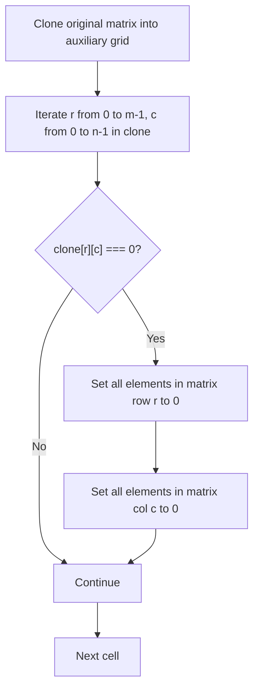
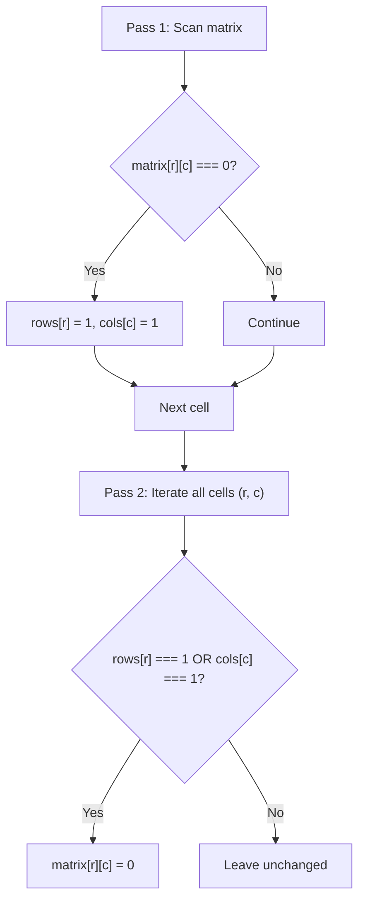
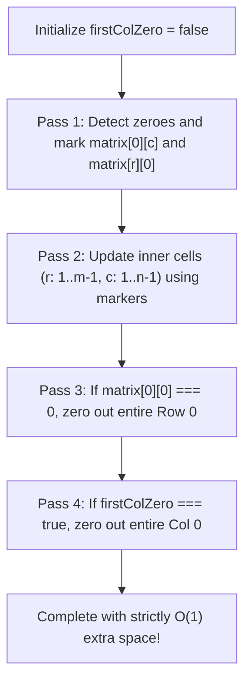
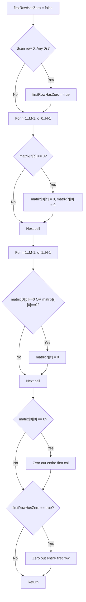

# 73. Set Matrix Zeroes

- **LeetCode Link**: `https://leetcode.com/problems/set-matrix-zeroes/`
- **Difficulty**: Medium
- **Pattern Category**: Matrix / In-Place State Encoding / Flag Pointers
- **Prerequisite Primer**: `00-foundations/01-js-interview-runtime-quirks.md`

---

## 1. Problem Overview & Edge Case Matrix

### Problem Statement
Given an $m \times n$ integer `matrix`, if an element is `0`, set its entire row and column to `0`'s.
You must do it **in place**.

```
Input Matrix (3 x 3):         Output Matrix:
[ 1 ,  1 ,  1 ]               [ 1 ,  0 ,  1 ]
[ 1 ,  0 ,  1 ]      ===>     [ 0 ,  0 ,  0 ]
[ 1 ,  1 ,  1 ]               [ 1 ,  0 ,  1 ]

Input Matrix with overlapping zeros:
[ 0 ,  1 ,  2 ,  0 ]          [ 0 ,  0 ,  0 ,  0 ]
[ 3 ,  4 ,  5 ,  2 ]   ===>   [ 0 ,  4 ,  5 ,  0 ]
[ 1 ,  3 ,  1 ,  5 ]          [ 0 ,  3 ,  1 ,  0 ]
```

### Upfront Edge Case Matrix

| Edge Case Scenario | Inputs | Expected Output | Pitfall / Failure Mode |
| :--- | :--- | :--- | :--- |
| Zero in First Row | `[[0, 1, 2]]` | `[[0, 0, 0]]` | Overwriting row 0 state before reading cols |
| Zero in First Column | `[[0], [1], [2]]` | `[[0], [0], [0]]` | Collapsing col 0 marker with row 0 marker |
| Zero at Origin `(0, 0)` | `[[0, 1], [1, 1]]` | `[[0, 0], [0, 1]]` | Ambiguity in whether row 0 or col 0 is zeroed |
| Matrix has No Zeroes | `[[1, 2], [3, 4]]` | `[[1, 2], [3, 4]]` | Modifying unmodified cells |
| Entire Matrix is Zero | `[[0, 0], [0, 0]]` | `[[0, 0], [0, 0]]` | Infinite re-processing or NaN states |

---

## 2. Level 1: Brute Force Approach (Auxiliary Grid Cloning)

### Intuition & Visual Idea
If we directly overwrite elements to `0` while scanning the matrix, subsequent iterations will mistake those newly placed zeroes for original zeroes, cascading until the entire board becomes zero!
To prevent this domino effect, make a deep clone of `matrix`. Iterate through `clone`; whenever `clone[r][c] === 0`, zero out row `r` and column `c` in the original `matrix`.



### Pseudocode
```text
FUNCTION setZeroesBruteForce(matrix):
    m = matrix.length, n = matrix[0].length
    clone = DEEP_COPY(matrix)
    
    FOR r FROM 0 TO m - 1:
        FOR c FROM 0 TO n - 1:
            IF clone[r][c] == 0:
                FOR colIdx FROM 0 TO n - 1:
                    matrix[r][colIdx] = 0
                FOR rowIdx FROM 0 TO m - 1:
                    matrix[rowIdx][c] = 0
```

### Step-by-Step Dry Run
`matrix = [[1, 1], [0, 1]]`, `clone = [[1, 1], [0, 1]]`

| Cell `(r, c)` in Clone | Val | Action on `matrix` | `matrix` State After Step |
| :--- | :--- | :--- | :--- |
| `(0, 0)` | 1 | No-op | `[[1, 1], [0, 1]]` |
| `(0, 1)` | 1 | No-op | `[[1, 1], [0, 1]]` |
| `(1, 0)` | 0 | Zero out row 1 & col 0 | `[[0, 1], [0, 0]]` |
| `(1, 1)` | 1 | No-op | `[[0, 1], [0, 0]]` (Correct!) |

### Modern JavaScript Implementation
```javascript
/**
 * Level 1: Brute Force with Auxiliary Matrix Deep Copy
 * Time Complexity:  O(M * N * (M + N))
 * Space Complexity: O(M * N) auxiliary memory
 */
function setZeroesBruteForce(matrix) {
  const m = matrix.length;
  const n = matrix[0].length;
  // Deep clone matrix
  const clone = matrix.map(row => [...row]);

  for (let r = 0; r < m; r++) {
    for (let c = 0; c < n; c++) {
      if (clone[r][c] === 0) {
        // Zero entire row
        for (let colIdx = 0; colIdx < n; colIdx++) {
          matrix[r][colIdx] = 0;
        }
        // Zero entire column
        for (let rowIdx = 0; rowIdx < m; rowIdx++) {
          matrix[rowIdx][c] = 0;
        }
      }
    }
  }
}
```

### Complexity Breakdown
- **Time Complexity**: $O(M \times N \times (M + N))$ worst-case if many zeroes, or $O(M \times N)$ if tracked with sets.
- **Space Complexity**: $O(M \times N)$ — Complete duplicate clone of the grid.

#### 🎙️ How to Explain to Interviewer
> *"A naive in-place update fails because newly placed zeroes are indistinguishable from original zeroes, causing an uncontrolled cascade. Cloning the matrix gives us an immutable snapshot of original zeroes. However, allocating $O(M \times N)$ extra memory is suboptimal when we only need to remember which rows and columns must be cleared."*

---

## 3. Level 2: Optimized Approach (Row and Column Marker Arrays)

### Intuition & Visual Bottleneck Elimination
Instead of remembering every individual zero coordinate, we only need to know:
- Does row $r$ contain at least one zero?
- Does column $c$ contain at least one zero?

We maintain two 1D boolean marker arrays: `rows[m]` and `cols[n]`.
1. Pass 1: Scan matrix. If `matrix[r][c] === 0`, set `rows[r] = 1` and `cols[c] = 1`.
2. Pass 2: Iterate through all cells $(r, c)$. If `rows[r] === 1 || cols[c] === 1`, set `matrix[r][c] = 0`.



### Pseudocode
```text
FUNCTION setZeroesRowCol(matrix):
    m = matrix.length, n = matrix[0].length
    rows = ARRAY OF SIZE m FILLED WITH 0
    cols = ARRAY OF SIZE n FILLED WITH 0
    
    FOR r FROM 0 TO m - 1:
        FOR c FROM 0 TO n - 1:
            IF matrix[r][c] == 0:
                rows[r] = 1
                cols[c] = 1
                
    FOR r FROM 0 TO m - 1:
        FOR c FROM 0 TO n - 1:
            IF rows[r] == 1 OR cols[c] == 1:
                matrix[r][c] = 0
```

### Step-by-Step Dry Run
`matrix = [[1, 1, 1], [1, 0, 1], [1, 1, 1]]`

| Pass | Cell `(r, c)` | Value | Marker Action | Marker State |
| :--- | :--- | :--- | :--- | :--- |
| Pass 1 | `(1, 1)` | 0 | Mark row 1, col 1 | `rows = [0, 1, 0], cols = [0, 1, 0]` |
| Pass 2 | `(0, 1)` | 1 | `cols[1] === 1` | `matrix[0][1] = 0` |
| Pass 2 | `(1, 0)` | 1 | `rows[1] === 1` | `matrix[1][0] = 0` |
| Pass 2 | `(1, 2)` | 1 | `rows[1] === 1` | `matrix[1][2] = 0` |
| Pass 2 | `(2, 1)` | 1 | `cols[1] === 1` | `matrix[2][1] = 0` |

### Modern JavaScript Implementation
```javascript
/**
 * Level 2: Row & Column Boolean Buffers
 * Time Complexity:  O(M * N)
 * Space Complexity: O(M + N) Auxiliary Space
 */
function setZeroesRowColArrays(matrix) {
  const m = matrix.length;
  const n = matrix[0].length;
  const rows = new Uint8Array(m);
  const cols = new Uint8Array(n);

  // Pass 1: Record row and column zero positions
  for (let r = 0; r < m; r++) {
    for (let c = 0; c < n; c++) {
      if (matrix[r][c] === 0) {
        rows[r] = 1;
        cols[c] = 1;
      }
    }
  }

  // Pass 2: Update cells based on marker arrays
  for (let r = 0; r < m; r++) {
    for (let c = 0; c < n; c++) {
      if (rows[r] === 1 || cols[c] === 1) {
        matrix[r][c] = 0;
      }
    }
  }
}
```

### Complexity Breakdown
- **Time Complexity**: $O(M \times N)$ — Two non-nested passes over all matrix elements.
- **Space Complexity**: $O(M + N)$ — Two typed arrays of size $M$ and $N$.

#### 🎙️ How to Explain to Interviewer
> *"Instead of caching entire matrix values, we project the zero positions onto two 1D vectors of length $M$ and $N$. If any cell $(r, c)$ contains zero, we flag row $r$ and column $c$. In the second pass, any cell falling in an active row or column is set to zero. This drops memory from $O(M \times N)$ down to $O(M + N)$."*

---

## 4. Level 3: Most Optimal / Canonical Approach (First Row & Column as In-Place Markers)

### Intuition & Invariant Proof
Can we achieve strictly $O(1)$ auxiliary space without allocating the $O(M + N)$ arrays?
**Yes!** We can use the **first row (`matrix[0][..]`)** and **first column (`matrix[..][0]`)** of the matrix itself as the two marker vectors!

However, cell `matrix[0][0]` is shared by both row 0 and column 0. To resolve this collision:
- We let `matrix[0][0]` represent whether **Row 0** needs to be zeroed out.
- We maintain a single primitive variable `firstColZero = false` to track whether **Column 0** needs to be zeroed out.

```
       col 0    col 1    col 2    col 3
row 0 [ (0,0) ][ col 1 ][ col 2 ][ col 3 ]  <- Row 0 markers
row 1 [ row 1 ][       ][       ][       ]
row 2 [ row 2 ][       ][       ][       ]
        ^
  Col 0 markers
  + `firstColZero` boolean flag
```



### Pseudocode
```text
FUNCTION setZeroes(matrix):
    m = matrix.length, n = matrix[0].length
    firstColZero = false
    
    // Pass 1: Mark zeroes in first row and first column
    FOR r FROM 0 TO m - 1:
        IF matrix[r][0] == 0:
            firstColZero = true
        FOR c FROM 1 TO n - 1:
            IF matrix[r][c] == 0:
                matrix[r][0] = 0
                matrix[0][c] = 0
                
    // Pass 2: Update inner grid cells
    FOR r FROM 1 TO m - 1:
        FOR c FROM 1 TO n - 1:
            IF matrix[r][0] == 0 OR matrix[0][c] == 0:
                matrix[r][c] = 0
                
    // Pass 3: Handle first row
    IF matrix[0][0] == 0:
        FOR c FROM 0 TO n - 1:
            matrix[0][c] = 0
            
    // Pass 4: Handle first column
    IF firstColZero:
        FOR r FROM 0 TO m - 1:
            matrix[r][0] = 0
```

### Step-by-Step Dry Run
`matrix = [[1, 1, 1], [1, 0, 1], [1, 1, 1]]`

| Phase | Cell | Value | Marker Mutation | Matrix State |
| :--- | :--- | :--- | :--- | :--- |
| Pass 1 | `(1, 1)` | 0 | `matrix[1][0]=0, matrix[0][1]=0` | `[[1, 0, 1], [0, 0, 1], [1, 1, 1]]`, `col0=false` |
| Pass 2 | `(1, 2)` | 1 | `matrix[1][0] === 0` | Set `matrix[1][2] = 0` |
| Pass 2 | `(2, 1)` | 1 | `matrix[0][1] === 0` | Set `matrix[2][1] = 0` |
| Pass 3 | Row 0 | `matrix[0][0] === 1` | No change to row 0 | Row 0 preserved |
| Pass 4 | Col 0 | `firstColZero === false` | No change to col 0 | Col 0 preserved |
| Final | Result | - | - | `[[1, 0, 1], [0, 0, 0], [1, 0, 1]]` (Correct!) |

### Modern JavaScript Implementation
```javascript
/**
 * Level 3: Canonical In-Place Flag Markers
 * Time Complexity:  O(M * N)
 * Space Complexity: O(1) Auxiliary Space
 */
function setZeroes(matrix) {
  const m = matrix.length;
  const n = matrix[0].length;
  let firstColZero = false;

  // Step 1: Record zeroes in first row and column
  for (let r = 0; r < m; r++) {
    // Check if column 0 naturally contains a zero
    if (matrix[r][0] === 0) {
      firstColZero = true;
    }

    // Inspect columns 1 through n - 1
    for (let c = 1; c < n; c++) {
      if (matrix[r][c] === 0) {
        matrix[r][0] = 0; // Row marker
        matrix[0][c] = 0; // Column marker
      }
    }
  }

  // Step 2: Zero out inner cells using boundary markers
  for (let r = 1; r < m; r++) {
    for (let c = 1; c < n; c++) {
      if (matrix[r][0] === 0 || matrix[0][c] === 0) {
        matrix[r][c] = 0;
      }
    }
  }

  // Step 3: Zero out first row if origin marker is set
  if (matrix[0][0] === 0) {
    for (let c = 0; c < n; c++) {
      matrix[0][c] = 0;
    }
  }

  // Step 4: Zero out first column if separate flag is set
  if (firstColZero) {
    for (let r = 0; r < m; r++) {
      matrix[r][0] = 0;
    }
  }
}
```

### Complexity Breakdown
- **Time Complexity**: $O(M \times N)$ — Exactly two full iterations over the grid.
- **Space Complexity**: $O(1)$ auxiliary space — Only a single boolean flag `firstColZero` is stored on the stack.

#### 🎙️ How to Explain to Interviewer
> *"To achieve $O(1)$ space, we reuse the matrix's own first row and column as our hash markers. The primary trap is that cell $(0, 0)$ represents the intersection of both row 0 and column 0. We decouple them by designating `matrix[0][0]` exclusively for row 0, while keeping a single primitive boolean `firstColZero` for column 0. We then update inner elements first ($r \ge 1, c \ge 1$) so we do not overwrite our marker headers prematurely."*

---

## 5. JavaScript-Specific Gotchas & V8 Optimizations
- **The Execution Order Invariant**: You **must** update the inner sub-matrix ($r \in [1, m-1], c \in [1, n-1]$) *before* zeroing row 0 or column 0. If you zero out row 0 first, all column markers (`matrix[0][c]`) become 0, and step 2 will erroneously obliterate the entire matrix into zeroes!
- **Zero Representation in V8**: In V8, standard numeric zero `0` is represented as a direct SMI (Small Integer). Writing integer `0` avoids boxing and retains `PACKED_SMI_ELEMENTS` type consistency across array rows.

---

## 6. Real-World MAANG Interview Follow-Ups & Extensions

### Follow-Up 1: Sparse Matrix with Extreme Dimensions ($10^9 \times 10^9$)
- **Scenario**: The matrix dimension is $10^9 \times 10^9$, but it contains only $K = 500$ zeroes. You cannot represent the matrix as a 2D array.
- **Solution Strategy**: Use Coordinate Compression / Hash Sets. Store unique row indices in a `Set<number>` `zeroRows` and unique col indices in `zeroCols`. Space complexity is $O(K)$. Cell $(r, c)$ is $0$ if `zeroRows.has(r) || zeroCols.has(c)`.
- **JS Code**:
```javascript
class SparseZeroMatrix {
  constructor(defaultVal = 1) {
    this.zeroRows = new Set();
    this.zeroCols = new Set();
    this.data = new Map(); // key: `${r},${c}`
  }

  set(r, c, val) {
    if (val === 0) {
      this.zeroRows.add(r);
      this.zeroCols.add(c);
    } else {
      this.data.set(`${r},${c}`, val);
    }
  }

  get(r, c) {
    if (this.zeroRows.has(r) || this.zeroCols.has(c)) {
      return 0;
    }
    return this.data.get(`${r},${c}`) ?? 1;
  }
}
```

### Follow-Up 2: Concurrency & Shared Memory Zeroing via Worker Threads
- **Scenario**: How to parallelize zeroing across multi-core Node.js processes without IPC serialization overhead?
- **Solution Strategy**: Store the matrix inside a single continuous `SharedArrayBuffer` with an `Int32Array` view. Pass the buffer reference to worker threads, partitioning row segments.
- **JS Code**:
```javascript
import { Worker, isMainThread, parentPort, workerData } from 'worker_threads';

if (isMainThread) {
  function parallelSetZeroes(matrix) {
    const m = matrix.length;
    const n = matrix[0].length;
    const sab = new SharedArrayBuffer(m * n * 4);
    const sharedArr = new Int32Array(sab);

    // Initialize buffer
    for (let r = 0; r < m; r++) {
      for (let c = 0; c < n; c++) {
        sharedArr[r * n + c] = matrix[r][c];
      }
    }
    // Dispatch partition ranges to workers...
  }
}
```

---

## 7. What LeetCode Discuss Says (Language-Independent)

Source: top-voted post by niits —
`https://leetcode.com/problems/set-matrix-zeroes/solutions/3472518/video-o-1-space-use-the-first-row-and-column-as-a-note/`
— 83.2K views / 749 votes / 14 comments.
Language-independent summary. No new JS here.

### A. Optimal way from Discuss (In-place with First Row/Col as Notes)

The problem asks us to set entire rows and columns to zero if any element is zero, but requires an $O(1)$ space solution. The optimal strategy is to use the **first row and first column** of the matrix itself to store our "flags" indicating whether that row or column needs to be zeroed.
Because the first cell `matrix[0][0]` overlaps for both the first row and first column, we use an extra boolean variable (e.g., `firstRowHasZero`) to disambiguate.

```text
FUNCTION setZeroes(matrix):
    ROWS = length(matrix)
    COLS = length(matrix[0])
    firstRowHasZero = false
    
    // Step 1: Scan first row
    FOR c = 0 TO COLS - 1:
        IF matrix[0][c] == 0:
            firstRowHasZero = true
            BREAK
            
    // Step 2: Use first row/col as markers
    FOR r = 1 TO ROWS - 1:
        FOR c = 0 TO COLS - 1:
            IF matrix[r][c] == 0:
                matrix[0][c] = 0  // Mark column
                matrix[r][0] = 0  // Mark row
                
    // Step 3: Zero out inner matrix based on markers
    FOR r = 1 TO ROWS - 1:
        FOR c = 1 TO COLS - 1:
            IF matrix[0][c] == 0 OR matrix[r][0] == 0:
                matrix[r][c] = 0
                
    // Step 4: Zero out first column if needed
    IF matrix[0][0] == 0:
        FOR r = 0 TO ROWS - 1:
            matrix[r][0] = 0
            
    // Step 5: Zero out first row if needed
    IF firstRowHasZero:
        FOR c = 0 TO COLS - 1:
            matrix[0][c] = 0
```

- Time: O(M * N) where M is rows and N is columns. We iterate over the matrix roughly twice.
- Space: O(1) since we only use one extra boolean variable and the matrix itself to store flags.



### B. Dry run on LeetCode Example 2

Matrix:
```text
0 1 2 0
3 4 5 2
1 3 1 5
```
- **Step 1:** `matrix[0][0]` is 0, so `firstRowHasZero = true`.
- **Step 2:** Scan from `r=1`. No zeroes found in inner matrix.
- **Step 3:** Apply markers. Inner matrix (`r=1..2, c=1..3`) remains untouched since markers aren't 0.
- **Step 4:** `matrix[0][0] == 0`, so zero out first column.
- **Step 5:** `firstRowHasZero == true`, so zero out first row.
Result:
```text
0 0 0 0
0 4 5 2
0 3 1 5
```

### C. Pitfalls from comments

- **The `matrix[0][0]` overlap:** `matrix[0][0]` sits at the intersection of the first row and first column. If you just use it to mark both, you lose track of whether it was a row zero or a col zero that triggered it, cascading into clearing rows/cols that shouldn't be cleared. That is why an external `firstRowHasZero` (or `firstColHasZero`) boolean is strictly necessary.
- **Applying zeroes before finishing markers:** If you immediately set a row to zero when you find a zero, you destroy the data for upcoming iterations, resulting in the whole matrix turning into zeroes. You must do a distinct "mark" pass, and then a separate "apply" pass.
- **Applying zeroes to the first row/col too early:** You MUST zero out the inner matrix (`r=1` onwards, `c=1` onwards) *before* zeroing out the first row/col. If you zero out the first row/col early, you wipe out all your marker flags!

### D. Companies

- Discuss post itself names none.
  Companies tab on LeetCode is premium-locked.
- External source:
  `https://github.com/liquidslr/leetcode-company-wise-problems`
  (LeetCode company tags, updated June 2025).
- All-time (20): Amazon, Apple, Autodesk, Bloomberg, eBay, Goldman Sachs, Google, Infosys, Juspay, Meta, Microsoft, Nutanix, Nvidia, Nykaa, Oracle, ServiceNow, TCS, Walmart Labs, Zoho, ZScaler.
- Recent: 30 days — (none).
- Recent: 3 months — Amazon, Bloomberg, Google, Meta, Microsoft.
