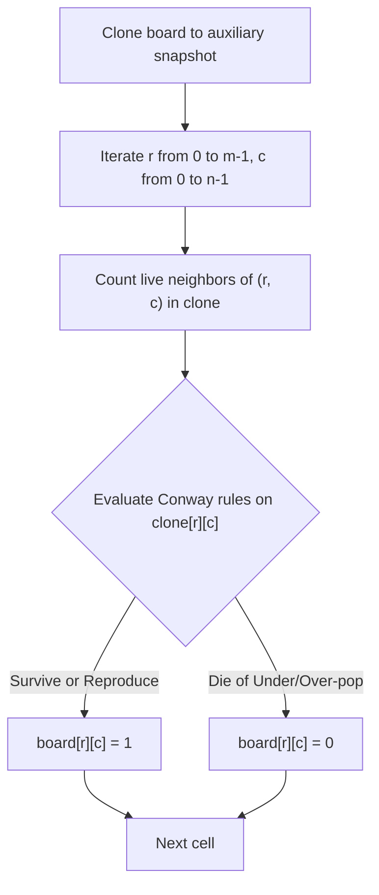
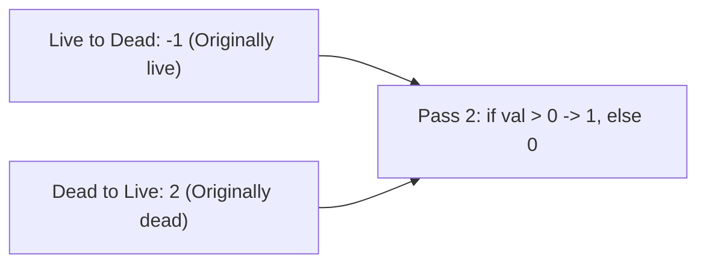
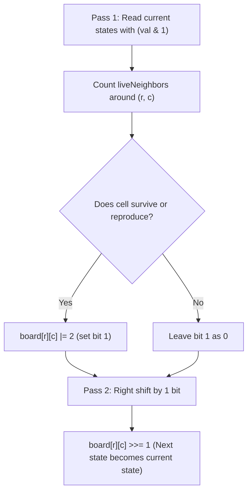

# 289. Game of Life

- **LeetCode Link**: `https://leetcode.com/problems/game-of-life/`
- **Difficulty**: Medium
- **Pattern Category**: Matrix / Simulation / In-Place Bit State Encoding
- **Prerequisite Primer**: `00-foundations/01-js-interview-runtime-quirks.md`

---

## 1. Problem Overview & Edge Case Matrix

### Problem Statement
According to Wikipedia's article on Conway's Game of Life, the board is made up of an $m \times n$ grid of cells, where each cell has an initial state: **live** (`1`) or **dead** (`0`). Each cell interacts with its eight neighbors (horizontal, vertical, diagonal) using the following four rules:

1. **Under-population**: Any live cell with fewer than two live neighbors dies.
2. **Survival**: Any live cell with two or three live neighbors lives on to the next generation.
3. **Over-population**: Any live cell with more than three live neighbors dies.
4. **Reproduction**: Any dead cell with exactly three live neighbors becomes a live cell.

The next state is created by applying the above rules **simultaneously** to every cell in the current state of the m-by-n grid board.
Compute the next state **in-place**.

```
Moore Neighborhood (8 Directions):
[ (r-1, c-1) , (r-1, c) , (r-1, c+1) ]
[ (r  , c-1) ,  (r, c)  , (r  , c+1) ]
[ (r+1, c-1) , (r+1, c) , (r+1, c+1) ]

Transition Rules Summary:
- Live (1) + <2 live neighbors -> Dies (0)
- Live (1) + 2 or 3 live neighbors -> Lives (1)
- Live (1) + >3 live neighbors -> Dies (0)
- Dead (0) + 3 live neighbors -> Lives (1)
```

### Upfront Edge Case Matrix

| Edge Case Scenario | Inputs | Expected Output | Pitfall / Failure Mode |
| :--- | :--- | :--- | :--- |
| All Dead Cells | `[[0, 0], [0, 0]]` | `[[0, 0], [0, 0]]` | Erroneous reproduction triggering |
| $2 \times 2$ Block (Still Life) | `[[1, 1], [1, 1]]` | `[[1, 1], [1, 1]]` | Over-population false trigger (each has 3 neighbors) |
| Isolated Single Live Cell | `[[1]]` | `[[0]]` | Under-population with 0 neighbors |
| Blinker Oscillator | `[[0,1,0],[0,1,0],[0,1,0]]` | `[[0,0,0],[1,1,1],[0,0,0]]` | Boundary neighbor indexing out-of-bounds |
| Single Row / Single Col | `[[1, 1, 1]]` | `[[0, 1, 0]]` | Center survives (2 neighbors), ends die |

---

## 2. Level 1: Brute Force Approach (Auxiliary Grid Cloning)

### Intuition & Visual Idea
Because all state transitions occur **simultaneously**, updating cell $(r, c)$ immediately would corrupt the neighbor counts for subsequent cells $(r, c+1)$ and $(r+1, c)$.
The simplest solution is to clone the entire board. We count live neighbors using the immutable snapshot `clone`, and write new states directly into `board`.



### Pseudocode
```text
FUNCTION gameOfLifeBruteForce(board):
    m = board.length, n = board[0].length
    clone = DEEP_COPY(board)
    
    FOR r FROM 0 TO m - 1:
        FOR c FROM 0 TO n - 1:
            liveNeighbors = COUNT_LIVE_NEIGHBORS(clone, r, c)
            
            IF clone[r][c] == 1:
                IF liveNeighbors < 2 OR liveNeighbors > 3:
                    board[r][c] = 0
                ELSE:
                    board[r][c] = 1
            ELSE:
                IF liveNeighbors == 3:
                    board[r][c] = 1
                ELSE:
                    board[r][c] = 0
```

### Step-by-Step Dry Run
`board = [[0, 1, 0], [0, 0, 1], [1, 1, 1], [0, 0, 0]]`

| Cell `(r, c)` | Initial State | Live Neighbors in Clone | Rule Applied | Next State Written to `board` |
| :--- | :--- | :--- | :--- | :--- |
| `(0, 0)` | 0 (Dead) | 1 (`(0, 1)`) | Dead $\neq 3$ | `0` |
| `(0, 1)` | 1 (Live) | 1 (`(1, 2)`) | Under-population ($< 2$) | `0` |
| `(1, 2)` | 1 (Live) | 3 (`(0,1),(2,1),(2,2)`) | Survival ($2 \le k \le 3$) | `1` |
| `(2, 1)` | 1 (Live) | 3 (`(1,2),(2,0),(2,2)`) | Survival | `1` |
| `(2, 2)` | 1 (Live) | 2 (`(1,2),(2,1)`) | Survival | `1` |

### Modern JavaScript Implementation
```javascript
/**
 * Level 1: Brute Force with Auxiliary Snapshot Clone
 * Time Complexity:  O(M * N)
 * Space Complexity: O(M * N) auxiliary memory
 */
function gameOfLifeBruteForce(board) {
  const m = board.length;
  const n = board[0].length;
  const clone = board.map(row => [...row]);

  // Static 8-direction offsets
  const directions = [
    [-1, -1], [-1, 0], [-1, 1],
    [0, -1],           [0, 1],
    [1, -1],  [1, 0],  [1, 1]
  ];

  for (let r = 0; r < m; r++) {
    for (let c = 0; c < n; c++) {
      let liveNeighbors = 0;

      for (let i = 0; i < 8; i++) {
        const nr = r + directions[i][0];
        const nc = c + directions[i][1];
        if (nr >= 0 && nr < m && nc >= 0 && nc < n) {
          liveNeighbors += clone[nr][nc];
        }
      }

      // Apply Conway's rules
      if (clone[r][c] === 1) {
        if (liveNeighbors < 2 || liveNeighbors > 3) {
          board[r][c] = 0;
        } else {
          board[r][c] = 1;
        }
      } else {
        if (liveNeighbors === 3) {
          board[r][c] = 1;
        }
      }
    }
  }
}
```

### Complexity Breakdown
- **Time Complexity**: $O(M \times N)$ — $8 \times M \times N$ constant-time neighbor lookups.
- **Space Complexity**: $O(M \times N)$ — Duplicates board memory for the clone.

#### 🎙️ How to Explain to Interviewer
> *"Because Conway's Game of Life updates every cell synchronously based on the previous generation's configuration, cloning the board preserves the baseline state during iteration. This achieves clean separation between reads and writes in $O(M \times N)$ time, but consumes $O(M \times N)$ extra memory."*

---

## 3. Level 2: Optimized Approach (Intermediate State Encoding)

### Intuition & Visual Bottleneck Elimination
To eliminate the $O(M \times N)$ auxiliary clone, we encode both the **past** and **present** states into custom integer transition codes:
- `0`: Was dead, remains dead
- `1`: Was live, remains live
- `-1`: Was live, now died in this generation
- `2`: Was dead, now revived in this generation

When checking neighbors:
- Any cell with value `1` or `-1` was **originally live** (count as `1`).
- Any cell with value `0` or `2` was **originally dead** (count as `0`).

In Pass 2, normalize values:
- `board[r][c] > 0 ? 1 : 0`.



### Pseudocode
```text
FUNCTION gameOfLifeStateEncoding(board):
    FOR r FROM 0 TO m - 1:
        FOR c FROM 0 TO n - 1:
            liveNeighbors = 0
            FOR each neighbor (nr, nc):
                IF |board[nr][nc]| == 1: liveNeighbors++
                
            IF board[r][c] == 1 AND (liveNeighbors < 2 OR liveNeighbors > 3):
                board[r][c] = -1 // Live -> Dead
            ELSE IF board[r][c] == 0 AND liveNeighbors == 3:
                board[r][c] = 2  // Dead -> Live

    FOR r FROM 0 TO m - 1:
        FOR c FROM 0 TO n - 1:
            board[r][c] = (board[r][c] > 0) ? 1 : 0
```

### Step-by-Step Dry Run
`board[0][1] = 1`, `liveNeighbors = 1`:

| Cell | Initial | Live Neighbors | State Code Assigned | Original Live Checked via `|val| === 1` | Pass 2 Normalized |
| :--- | :--- | :--- | :--- | :--- | :--- |
| `(0, 1)` | 1 | 1 | `-1` (Died) | `|-1| === 1` $\to$ counts as 1 for neighbors | `0` |
| `(1, 1)` | 0 | 3 | `2` (Born) | `|2| !== 1` $\to$ counts as 0 for neighbors | `1` |
| `(2, 2)` | 1 | 2 | `1` (Survives) | `|1| === 1` $\to$ counts as 1 for neighbors | `1` |

### Modern JavaScript Implementation
```javascript
/**
 * Level 2: In-Place Custom State Encoding (-1, 0, 1, 2)
 * Time Complexity:  O(M * N)
 * Space Complexity: O(1) Auxiliary Space
 */
function gameOfLifeStateEncoding(board) {
  const m = board.length;
  const n = board[0].length;

  for (let r = 0; r < m; r++) {
    for (let c = 0; c < n; c++) {
      let liveNeighbors = 0;

      // Check all 8 surrounding neighbors
      for (let dr = -1; dr <= 1; dr++) {
        for (let dc = -1; dc <= 1; dc++) {
          if (dr === 0 && dc === 0) continue;
          const nr = r + dr;
          const nc = c + dc;
          if (nr >= 0 && nr < m && nc >= 0 && nc < n) {
            // Values 1 and -1 represent cells that were originally alive
            if (Math.abs(board[nr][nc]) === 1) {
              liveNeighbors++;
            }
          }
        }
      }

      // Rule 1 & 3: Live cell dies -> Mark as -1
      if (board[r][c] === 1 && (liveNeighbors < 2 || liveNeighbors > 3)) {
        board[r][c] = -1;
      }
      // Rule 4: Dead cell becomes live -> Mark as 2
      if (board[r][c] === 0 && liveNeighbors === 3) {
        board[r][c] = 2;
      }
    }
  }

  // Pass 2: Normalize intermediate state codes to final 0 and 1
  for (let r = 0; r < m; r++) {
    for (let c = 0; c < n; c++) {
      board[r][c] = board[r][c] > 0 ? 1 : 0;
    }
  }
}
```

### Complexity Breakdown
- **Time Complexity**: $O(M \times N)$ — Two scans over the matrix.
- **Space Complexity**: $O(1)$ auxiliary space — Memory modified directly in place.

#### 🎙️ How to Explain to Interviewer
> *"By encoding state transitions into intermediate values (`-1` for live-to-dead, `2` for dead-to-live), each cell holds both its original history and its pending future. When inspecting neighboring cells, checking `Math.abs(val) === 1` yields the original state. A second pass normalizes the values back to 0 or 1 in $O(1)$ memory."*

---

## 4. Level 3: Most Optimal / Canonical Approach (Bit Manipulation 2-Bit State Encoding)

### Intuition & Invariant Proof
Every cell value is a 32-bit integer in JavaScript. Since the state is binary (0 or 1), we only need **two bits** to store both past and future states:
- **Bit 0 (LSB, $2^0$)**: Current State ($0$ = Dead, $1$ = Live).
- **Bit 1 (Second bit, $2^1$)**: Next State ($0$ = Dead, $1$ = Live).

```
State Representation: [ Bit 1 (Next) ][ Bit 0 (Current) ]
- 0b00 (0): Dead  -> Remains Dead
- 0b01 (1): Live  -> Dies (Live to Dead)
- 0b10 (2): Dead  -> Born (Dead to Live)
- 0b11 (3): Live  -> Survives (Live to Live)
```

**Bitwise Operations**:
- Extract current state: `board[nr][nc] & 1`
- Set next state to live: `board[r][c] |= 2` (or `board[r][c] |= (1 << 1)`)
- Final update: `board[r][c] >>= 1` (shifts Bit 1 into Bit 0).

This is mathematically optimal:
- Zero branch conditions (`Math.abs` or custom negative comparisons).
- A single arithmetic right shift `>> 1` in Pass 2 applies to all cells simultaneously.
- Zero extra memory, executed at native CPU bitwise speed.



### Pseudocode
```text
FUNCTION gameOfLife(board):
    m = board.length, n = board[0].length
    
    // Pass 1: Set bit 1 for next state
    FOR r FROM 0 TO m - 1:
        FOR c FROM 0 TO n - 1:
            liveNeighbors = 0
            FOR each (dr, dc) IN 8 directions:
                nr = r + dr, nc = c + dc
                IF VALID(nr, nc):
                    liveNeighbors += (board[nr][nc] & 1)
                    
            currentState = board[r][c] & 1
            IF currentState == 1:
                IF liveNeighbors == 2 OR liveNeighbors == 3:
                    board[r][c] |= 2 // Next state is live
            ELSE:
                IF liveNeighbors == 3:
                    board[r][c] |= 2 // Next state is live

    // Pass 2: Shift bit 1 to bit 0
    FOR r FROM 0 TO m - 1:
        FOR c FROM 0 TO n - 1:
            board[r][c] >>= 1
```

### Step-by-Step Dry Run
`board = [[1, 1], [1, 0]]`

| Cell `(r, c)` | Current (`& 1`) | Live Neighbors | Next State | Bitwise Update | Binary Value | Pass 2 (`>> 1`) |
| :--- | :--- | :--- | :--- | :--- | :--- | :--- |
| `(0, 0)` | 1 | 2 (`(0,1),(1,0)`) | Live | `1 \| 2 = 3` | `0b11` | `3 >> 1 = 1` |
| `(0, 1)` | 1 | 2 (`(0,0),(1,0)`) | Live | `1 \| 2 = 3` | `0b11` | `3 >> 1 = 1` |
| `(1, 0)` | 1 | 2 (`(0,0),(0,1)`) | Live | `1 \| 2 = 3` | `0b11` | `3 >> 1 = 1` |
| `(1, 1)` | 0 | 3 (`(0,0),(0,1),(1,0)`) | Live | `0 \| 2 = 2` | `0b10` | `2 >> 1 = 1` |

### Modern JavaScript Implementation
```javascript
/**
 * Level 3: Canonical 2-Bit State Encoding (Zero-Allocation Bitwise)
 * Time Complexity:  O(M * N)
 * Space Complexity: O(1) Auxiliary Space
 */
function gameOfLife(board) {
  const m = board.length;
  const n = board[0].length;

  for (let r = 0; r < m; r++) {
    for (let c = 0; c < n; c++) {
      let liveNeighbors = 0;

      // Count neighbors using the least significant bit (Bit 0)
      for (let dr = -1; dr <= 1; dr++) {
        for (let dc = -1; dc <= 1; dc++) {
          if (dr === 0 && dc === 0) continue;
          const nr = r + dr;
          const nc = c + dc;
          if (nr >= 0 && nr < m && nc >= 0 && nc < n) {
            liveNeighbors += board[nr][nc] & 1;
          }
        }
      }

      const isLive = (board[r][c] & 1) === 1;

      // Check survival or reproduction condition
      if (isLive) {
        if (liveNeighbors === 2 || liveNeighbors === 3) {
          board[r][c] |= 2; // Set 2nd bit (next state = 1)
        }
      } else {
        if (liveNeighbors === 3) {
          board[r][c] |= 2; // Set 2nd bit (next state = 1)
        }
      }
    }
  }

  // Pass 2: Extract next state by shifting right by 1 bit
  for (let r = 0; r < m; r++) {
    for (let c = 0; c < n; c++) {
      board[r][c] >>= 1;
    }
  }
}
```

### Complexity Breakdown
- **Time Complexity**: $O(M \times N)$ — Exactly $M \times N$ cell evaluations with 8 neighbor checks each.
- **Space Complexity**: $O(1)$ auxiliary space — Completely in-place mutation using bits 0 and 1.

#### 🎙️ How to Explain to Interviewer
> *"Because cell states are binary, we use the first two bits of each 32-bit integer: bit 0 stores the current state and bit 1 stores the next state. To read a neighbor's past state without interference, we mask with `& 1`. If the cell lives in the next generation, we flip bit 1 with `|= 2`. Finally, a single pass with `>>= 1` shifts the future generation into place. This achieves optimal bitwise speed with zero heap allocations."*

---

## 5. JavaScript-Specific Gotchas & V8 Optimizations
- **Loop Unrolling vs Static Offsets**: Allocating `const dirs = [[-1,-1], ...]` inside nested loops creates thousands of garbage-collected objects. Nested loops `for (let dr = -1; dr <= 1; dr++)` are hoisted by V8's TurboFan compiler and execute in CPU registers.
- **Bitwise Operators in V8**: `& 1`, `|= 2`, and `>>= 1` coerce values into 32-bit signed integers. Since board values are exclusively `0`, `1`, `2`, or `3`, they are stored as raw SMIs (Small Integers) with no object boxing overhead.

---

## 6. Real-World MAANG Interview Follow-Ups & Extensions

### Follow-Up 1: Infinite Board with Sparse Live Cells
- **Scenario**: The board is infinite in dimension, but only contains a sparse set of $K$ live cells ($K \ll \infty$). How do you simulate generations efficiently without an infinite matrix?
- **Solution Strategy**: Use a Hash Map of coordinate counts `Map<string, number>` or `Set<string>`. Only live cells and their immediate neighbors can potentially change state. For each live cell, increment the neighbor count of its 8 surrounding neighbors in the map.
- **JS Code**:
```javascript
function gameOfLifeInfinite(liveCells) {
  // liveCells: Set of string coordinates "r,c"
  const neighborCounts = new Map();

  for (const cell of liveCells) {
    const [r, c] = cell.split(',').map(Number);
    for (let dr = -1; dr <= 1; dr++) {
      for (let dc = -1; dc <= 1; dc++) {
        if (dr === 0 && dc === 0) continue;
        const key = `${r + dr},${c + dc}`;
        neighborCounts.set(key, (neighborCounts.get(key) || 0) + 1);
      }
    }
  }

  const nextLiveCells = new Set();

  for (const [coord, count] of neighborCounts.entries()) {
    if (count === 3 || (count === 2 && liveCells.has(coord))) {
      nextLiveCells.add(coord);
    }
  }

  return nextLiveCells;
}
```

### Follow-Up 2: Streaming Line-by-Line Pipeline (Memory-Constrained External Matrix)
- **Scenario**: The grid has 1 million rows and 1,000 columns. You cannot load the full board into memory.
- **Solution Strategy**: Maintain a rolling window of only **3 rows**: `prevRow`, `currRow`, `nextRow`. When computing the new state for `currRow`, only rows `prev`, `curr`, and `next` are required. After computing, write `currRow` to output stream, slide rows down, and read the next row from disk. Space reduces from $O(M \times N)$ to $O(3N) = O(N)$.
- **JS Code**:
```javascript
async function* processGameOfLifeStreaming(rowStream, n) {
  let prev = null;
  let curr = await rowStream.readRow();
  let next = await rowStream.readRow();

  while (curr !== null) {
    const newCurr = new Uint8Array(n);

    for (let c = 0; c < n; c++) {
      let live = 0;
      for (let dc = -1; dc <= 1; dc++) {
        const nc = c + dc;
        if (nc >= 0 && nc < n) {
          if (prev) live += prev[nc];
          if (dc !== 0) live += curr[nc];
          if (next) live += next[nc];
        }
      }

      if (curr[c] === 1) {
        newCurr[c] = (live === 2 || live === 3) ? 1 : 0;
      } else {
        newCurr[c] = (live === 3) ? 1 : 0;
      }
    }

    yield newCurr;
    prev = curr;
    curr = next;
    next = await rowStream.readRow();
  }
}
```
