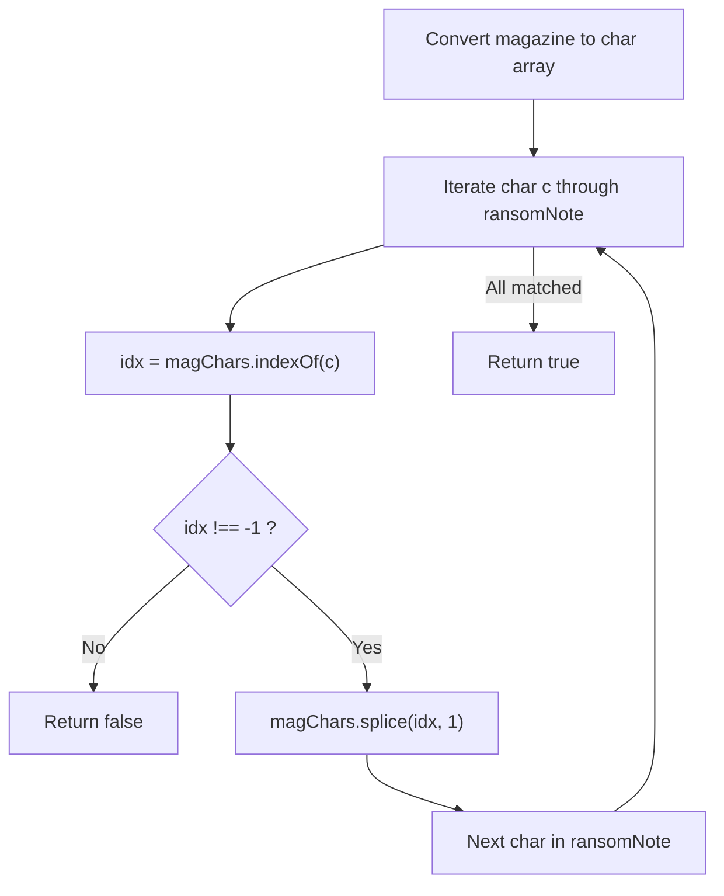
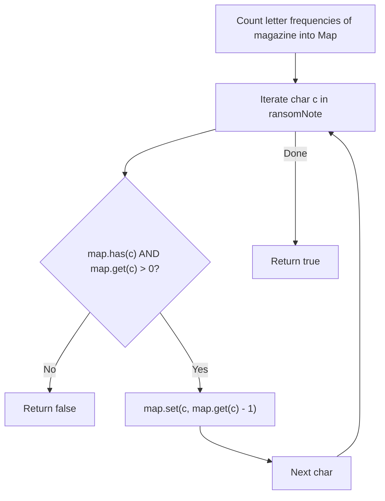
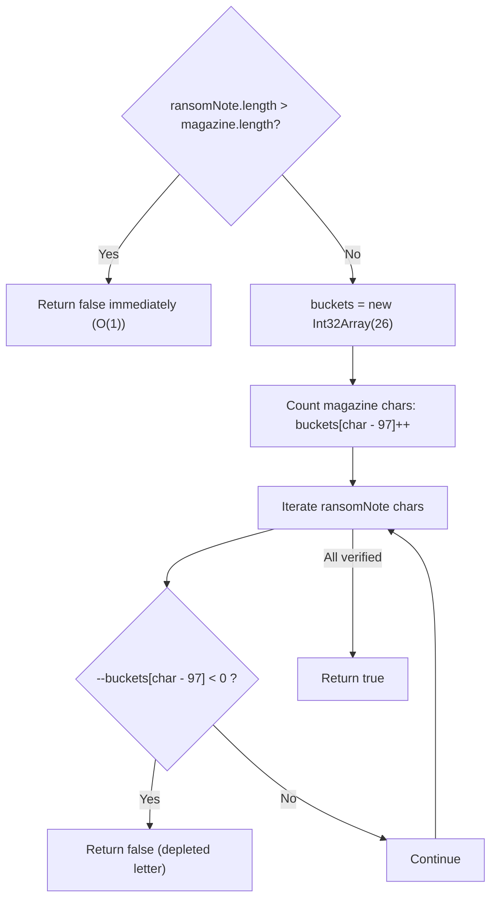

# 383. Ransom Note

- **LeetCode Link**: `https://leetcode.com/problems/ransom-note/`
- **Difficulty**: Easy
- **Pattern Category**: Hash Table / Frequency Counting / Fixed-Array Bucket
- **Prerequisite Primer**: `00-foundations/01-js-interview-runtime-quirks.md`

---

## 1. Problem Overview & Edge Case Matrix

### Problem Statement
Given two strings `ransomNote` and `magazine`, return `true` if `ransomNote` can be constructed by using the letters from `magazine` and `false` otherwise.

Each letter in `magazine` can only be used once in `ransomNote`. Both strings consist only of lowercase English letters.

```
ransomNote = "aa", magazine = "aab"
Frequency in magazine: { 'a': 2, 'b': 1 }
Required by ransom:    { 'a': 2 }
magazine satisfies requirement -> Output: true

ransomNote = "aa", magazine = "ab"
Frequency in magazine: { 'a': 1, 'b': 1 }
Required by ransom:    { 'a': 2 } (Magazine only has 1 'a')
Output: false
```

### Upfront Edge Case Matrix

| Edge Case Scenario | Inputs | Expected Output | Pitfall / Failure Mode |
| :--- | :--- | :--- | :--- |
| `ransomNote.length > magazine.length` | `ransomNote = "abc"`, `magazine = "ab"` | `false` | Redundant iteration when impossible |
| Identical Strings | `ransomNote = "hello"`, `magazine = "hello"` | `true` | Unnecessary full frequency allocation |
| Single Character Match | `ransomNote = "a"`, `magazine = "a"` | `true` | Loop fence-post bug |
| Missing Required Character | `ransomNote = "z"`, `magazine = "abcdef"` | `false` | Undefined hash table lookup handling |
| Insufficient Duplicate Counts | `ransomNote = "aaa"`, `magazine = "aa"` | `false` | Treating magazine as a unique set rather than multiset |

---

## 2. Level 1: Brute Force Approach (Array Splicing / Index Search)

### Intuition & Visual Idea
Convert `magazine` into an array of characters. For every character in `ransomNote`, search for its first occurrence in the magazine array using `indexOf()`. If found, `splice` the matched character out of the array to prevent reuse. If any character is not found, return `false`.



### Pseudocode
```text
FUNCTION canConstructBruteForce(ransomNote, magazine):
    IF ransomNote.length > magazine.length: RETURN false
    magChars = ARRAY OF magazine CHARACTERS
    
    FOR EACH char IN ransomNote:
        idx = magChars.INDEX_OF(char)
        IF idx == -1:
            RETURN false
        magChars.SPLICE(idx, 1)
        
    RETURN true
```

### Step-by-Step Dry Run
`ransomNote = "aa"`, `magazine = "ab"`

| Step | `char` in Ransom | `magChars` State | `indexOf(char)` | Action | Result |
| :--- | :--- | :--- | :--- | :--- | :--- |
| 1 | `'a'` | `['a', 'b']` | 0 | `magChars.splice(0, 1)` | `magChars = ['b']` |
| 2 | `'a'` | `['b']` | -1 | Not found! | Return `false` |

### Modern JavaScript Implementation
```javascript
/**
 * Level 1: Brute Force with Array.prototype.splice
 * Time Complexity:  O(M * N) where N = ransomNote.length, M = magazine.length
 * Space Complexity: O(M) for character array
 */
function canConstructBruteForce(ransomNote, magazine) {
  if (ransomNote.length > magazine.length) return false;

  const magChars = magazine.split('');

  for (let i = 0; i < ransomNote.length; i++) {
    const char = ransomNote[i];
    const idx = magChars.indexOf(char);

    if (idx === -1) {
      return false; // Character missing or exhausted
    }

    magChars.splice(idx, 1); // Remove character so it cannot be reused
  }

  return true;
}
```

### Complexity Breakdown
- **Time Complexity**: $O(M \times N)$ — In each of the $N$ iterations, `indexOf` scans $O(M)$ elements and `splice` shifts $O(M)$ elements.
- **Space Complexity**: $O(M)$ — Allocates character array for `magazine`.

#### 🎙️ How to Explain to Interviewer
> *"The naive approach simulates physically cutting letters out of a magazine by converting it to an array and using `splice()` whenever a letter matches. Because `indexOf()` and `splice()` both require linear $O(M)$ scans, the total time complexity is quadratic $O(M \times N)$."*

---

## 3. Level 2: Optimized Approach (Hash Map Frequency Counter)

### Intuition & Visual Bottleneck Elimination
Instead of repeatedly scanning and mutating the magazine string, we perform a single linear pass over `magazine` to aggregate character counts in a `Map`.
Then, we traverse `ransomNote` and decrement the corresponding count. If a character is absent or its count reaches `0`, the ransom note cannot be assembled.



### Pseudocode
```text
FUNCTION canConstructMap(ransomNote, magazine):
    IF ransomNote.length > magazine.length: RETURN false
    counts = NEW MAP()
    
    FOR EACH char IN magazine:
        counts.SET(char, (counts.GET(char) || 0) + 1)
        
    FOR EACH char IN ransomNote:
        count = counts.GET(char) || 0
        IF count == 0:
            RETURN false
        counts.SET(char, count - 1)
        
    RETURN true
```

### Step-by-Step Dry Run
`ransomNote = "aab"`, `magazine = "baa"`

| Phase | Character | Map Operation | `counts` State |
| :--- | :--- | :--- | :--- |
| Build Map | `'b', 'a', 'a'` | Increment counts | `{'b': 1, 'a': 2}` |
| Check Ransom | `'a'` | $2 > 0 \to$ decrement | `{'b': 1, 'a': 1}` |
| Check Ransom | `'a'` | $1 > 0 \to$ decrement | `{'b': 1, 'a': 0}` |
| Check Ransom | `'b'` | $1 > 0 \to$ decrement | `{'b': 0, 'a': 0}` |
| Result | All satisfied | - | Return `true` |

### Modern JavaScript Implementation
```javascript
/**
 * Level 2: Hash Map Frequency Counter
 * Time Complexity:  O(M + N)
 * Space Complexity: O(K) where K <= 26 unique characters
 */
function canConstructMap(ransomNote, magazine) {
  if (ransomNote.length > magazine.length) return false;

  const counts = new Map();

  // Record available letters from magazine
  for (let i = 0; i < magazine.length; i++) {
    const char = magazine[i];
    counts.set(char, (counts.get(char) || 0) + 1);
  }

  // Consume letters for ransom note
  for (let i = 0; i < ransomNote.length; i++) {
    const char = ransomNote[i];
    const available = counts.get(char) || 0;

    if (available === 0) {
      return false; // Character missing or depleted
    }

    counts.set(char, available - 1);
  }

  return true;
}
```

### Complexity Breakdown
- **Time Complexity**: $O(M + N)$ — Two independent linear passes.
- **Space Complexity**: $O(K)$ where $K \le 26$ unique lowercase English letters ($O(1)$ auxiliary space).

#### 🎙️ How to Explain to Interviewer
> *"By indexing character counts into a Hash Map, we decouple searching from string mutation. We build a multiset of available magazine characters in $O(M)$ time and consume characters in $O(N)$ time. Lookups and updates in `Map` take $O(1)$ average time."*

---

## 4. Level 3: Most Optimal / Canonical Approach (Fixed 26-Element Typed Array Bucket)

### Intuition & Mathematical Proof
The problem guarantees that all characters are lowercase English letters (`'a'` through `'z'`).
Instead of the hashing and bucket-chaining overhead of JavaScript `Map`, we use a **fixed-size 26-element typed array**:
$$\text{index} = \text{char.charCodeAt}(0) - 97$$

- Index `0` corresponds to `'a'`, index `25` to `'z'`.
- Array access in V8 compiles directly to base pointer + offset CPU addressing, executing orders of magnitude faster than `Map.prototype.get()`.
- Zero dynamic object allocations, zero garbage collection.

```
ASCII Mapping:
'a' (97) - 97 = 0
'b' (98) - 97 = 1
...
'z' (122) - 97 = 25

Array Memory Layout:
[ 2 ,  1 ,  0 ,  0 , ... ,  0 ]
 'a'  'b'  'c'  'd'       'z'
```



### Pseudocode
```text
FUNCTION canConstruct(ransomNote, magazine):
    IF ransomNote.length > magazine.length: RETURN false
    buckets = ARRAY OF 26 ZEROES
    
    FOR i FROM 0 TO magazine.length - 1:
        buckets[CHAR_CODE(magazine[i]) - 97]++
        
    FOR i FROM 0 TO ransomNote.length - 1:
        idx = CHAR_CODE(ransomNote[i]) - 97
        buckets[idx]--
        IF buckets[idx] < 0:
            RETURN false
            
    RETURN true
```

### Step-by-Step Dry Run
`ransomNote = "aa"`, `magazine = "aab"`

| Step | Char | Code - 97 | Operation | `buckets[0]` ('a') | `buckets[1]` ('b') | Condition Checked |
| :--- | :--- | :--- | :--- | :--- | :--- | :--- |
| Build | `'a'` | 0 | `buckets[0]++` | 1 | 0 | - |
| Build | `'a'` | 0 | `buckets[0]++` | 2 | 0 | - |
| Build | `'b'` | 1 | `buckets[1]++` | 2 | 1 | - |
| Check | `'a'` | 0 | `--buckets[0]` | 1 | 1 | $1 \ge 0$ (OK) |
| Check | `'a'` | 0 | `--buckets[0]` | 0 | 1 | $0 \ge 0$ (OK) |
| Final | Finished | - | - | 0 | 1 | Return `true` |

### Modern JavaScript Implementation
```javascript
/**
 * Level 3: Canonical Fixed Alphabet Bucket (Zero Allocation)
 * Time Complexity:  O(M + N)
 * Space Complexity: O(1) Auxiliary Space (26 integers / 104 bytes)
 */
function canConstruct(ransomNote, magazine) {
  // Pruning: A shorter magazine can never contain a longer ransom note
  if (ransomNote.length > magazine.length) return false;

  // Int32Array guarantees packed SMI representation with zero GC pressure
  const counts = new Int32Array(26);

  // Increment available character counts from magazine
  for (let i = 0; i < magazine.length; i++) {
    counts[magazine.charCodeAt(i) - 97]++;
  }

  // Decrement character counts for ransom note
  for (let i = 0; i < ransomNote.length; i++) {
    const idx = ransomNote.charCodeAt(i) - 97;
    // If count drops below zero, magazine does not have enough of this character
    if (--counts[idx] < 0) {
      return false;
    }
  }

  return true;
}
```

### Complexity Breakdown
- **Time Complexity**: $O(M + N)$ — Where $M$ is `magazine.length` and $N$ is `ransomNote.length`. Visits each character at most once.
- **Space Complexity**: $O(1)$ — Exactly 26 integers (104 bytes) using `Int32Array`.

#### 🎙️ How to Explain to Interviewer
> *"Because the alphabet is strictly 26 lowercase English letters, a fixed 26-element array directly indexed by `charCodeAt(i) - 97` replaces the dynamic hash map. We populate counts from the magazine in $O(M)$ and decrement counts for the ransom note in $O(N)$. If any bucket decrements below zero, we terminate early and return `false`. Pre-checking string lengths guarantees $O(1)$ rejection when the note exceeds the magazine."*

---

## 5. JavaScript-Specific Gotchas & V8 Optimizations
- **String Indexing (`charCodeAt` vs String Bracket `str[i]`)**: Calling `str.charCodeAt(i)` retrieves the UTF-16 code point as an integer directly, skipping string character boxing that occurs when reading `str[i]`.
- **Early Length Pruning**: In high-throughput validation pipelines, `if (ransomNote.length > magazine.length) return false;` saves tens of thousands of unnecessary loops and allocations before touching memory.

---

## 6. Real-World MAANG Interview Follow-Ups & Extensions

### Follow-Up 1: Multilingual & Emoji Unicode Support
- **Scenario**: What if inputs contain arbitrary Unicode characters, accents, or emojis (e.g. `ransomNote = "café ☕"`)?
- **Solution Strategy**: `charCodeAt` breaks on 32-bit astral Unicode (surrogate pairs like emojis). Use `codePointAt()` and `for (const char of str)` iterator with `Map<string, number>`.
- **JS Code**:
```javascript
function canConstructUnicode(ransomNote, magazine) {
  if (ransomNote.length > magazine.length) return false;

  const counts = new Map();
  for (const char of magazine) {
    counts.set(char, (counts.get(char) || 0) + 1);
  }

  for (const char of ransomNote) {
    const available = counts.get(char) || 0;
    if (available === 0) return false;
    counts.set(char, available - 1);
  }

  return true;
}
```

### Follow-Up 2: Streaming Magazine Feed (Network Chunks)
- **Scenario**: The magazine arrives over a network socket as a continuous stream of text chunks. How do we determine if the ransom note is satisfiable as early as possible without loading the entire stream?
- **Solution Strategy**: Invert the logic: build a demand map for `ransomNote`, track `remainingDemandedCount = ransomNote.length`. As chunks arrive, satisfy demands and decrement `remainingDemandedCount`. When it reaches 0, close the stream early!
- **JS Code**:
```javascript
async function canConstructStreaming(ransomNote, readableStream) {
  const demand = new Int32Array(26);
  let remaining = ransomNote.length;

  for (let i = 0; i < ransomNote.length; i++) {
    demand[ransomNote.charCodeAt(i) - 97]++;
  }

  for await (const chunk of readableStream) {
    const text = chunk.toString();
    for (let i = 0; i < text.length; i++) {
      const idx = text.charCodeAt(i) - 97;
      if (idx >= 0 && idx < 26 && demand[idx] > 0) {
        demand[idx]--;
        remaining--;
        if (remaining === 0) return true; // Early termination!
      }
    }
  }

  return remaining === 0;
}
```
