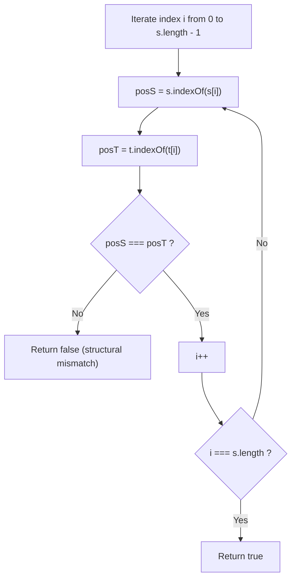
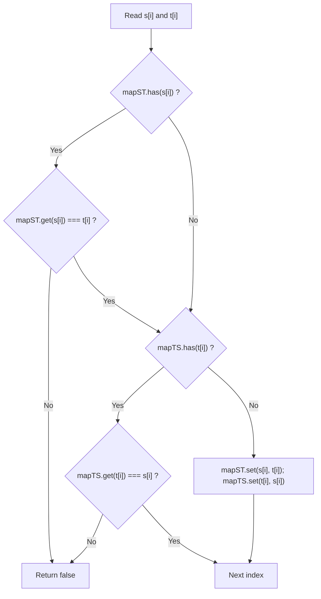
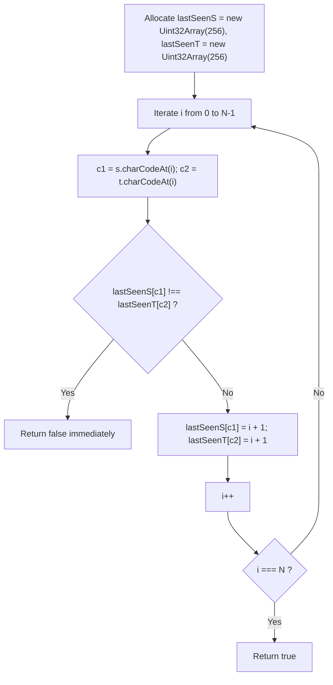

# 205. Isomorphic Strings

- **LeetCode Link**: `https://leetcode.com/problems/isomorphic-strings/`
- **Difficulty**: Easy
- **Pattern Category**: Hash Table / Bijective Mapping / Transformation Invariant
- **Prerequisite Primer**: `00-foundations/01-js-interview-runtime-quirks.md`

---

## 1. Problem Overview & Edge Case Matrix

### Problem Statement
Given two strings `s` and `t`, determine if they are **isomorphic**.

Two strings `s` and `t` are isomorphic if the characters in `s` can be replaced to get `t`.
All occurrences of a character must be replaced with another character while preserving the order of characters. No two characters may map to the same character, but a character may map to itself.

In mathematical terms, there must exist a **bijective mapping** (one-to-one and onto) between the alphabet of `s` and the alphabet of `t`:
1. **Injective**: If $s[i] \neq s[j]$, then $t[i] \neq t[j]$.
2. **Deterministic**: If $s[i] = s[j]$, then $t[i] = t[j]$.

```
Example 1:
s = "egg", t = "add"
'e' -> 'a'
'g' -> 'd'
Valid bijection -> true

Example 2:
s = "foo", t = "bar"
'f' -> 'b'
'o' -> 'a'
'o' -> 'r' (Conflict: 'o' maps to both 'a' and 'r') -> false

Example 3:
s = "badc", t = "baba"
'b' -> 'b'
'a' -> 'a'
'd' -> 'b' (Conflict: both 'b' and 'd' map to 'b') -> false
```

### Upfront Edge Case Matrix

| Edge Case Scenario | Inputs | Expected Output | Pitfall / Failure Mode |
| :--- | :--- | :--- | :--- |
| Differing String Lengths | `s = "ab"`, `t = "a"` | `false` | Accessing out-of-bounds characters |
| One-Way Collision (Many-to-One) | `s = "badc"`, `t = "baba"` | `false` | Validating $s \to t$ but forgetting $t \to s$ |
| Non-Deterministic Mapping (One-to-Many) | `s = "foo"`, `t = "bar"` | `false` | Overwriting existing map key bindings |
| Character Maps to Itself | `s = "paper"`, `t = "title"` | `true` | Treating identity mappings (`'p' -> 't'`) as invalid |
| Single Character Strings | `s = "a"`, `t = "b"` | `true` | Boundary loop termination failure |

---

## 2. Level 1: Brute Force Approach (First Occurrence Index Signature Matching)

### Intuition & Visual Idea
If two strings are isomorphic, the **first occurrence index** of the character at position $i$ in `s` must be identical to the first occurrence index of the character at position $i$ in `t`.
For example:
- `s = "egg"`: indices of first occurrence for `'e'`, `'g'`, `'g'` are `[0, 1, 1]`.
- `t = "add"`: indices of first occurrence for `'a'`, `'d'`, `'d'` are `[0, 1, 1]`.
Both structural signatures match!



### Pseudocode
```text
FUNCTION isIsomorphicBruteForce(s, t):
    IF s.length != t.length: RETURN false
    
    FOR i FROM 0 TO s.length - 1:
        IF s.INDEX_OF(s[i]) != t.INDEX_OF(t[i]):
            RETURN false
            
    RETURN true
```

### Step-by-Step Dry Run
`s = "foo"`, `t = "bar"`

| Index `i` | `s[i]` | `s.indexOf(s[i])` | `t[i]` | `t.indexOf(t[i])` | Match? |
| :--- | :--- | :--- | :--- | :--- | :--- |
| 0 | `'f'` | 0 | `'b'` | 0 | Yes |
| 1 | `'o'` | 1 | `'a'` | 1 | Yes |
| 2 | `'o'` | 1 (first at 1) | `'r'` | 2 (first at 2) | **Mismatch ($1 \neq 2$) $\to$ `false`** |

### Modern JavaScript Implementation
```javascript
/**
 * Level 1: First-Occurrence Structural Signature
 * Time Complexity:  O(N^2) due to indexOf on each iteration
 * Space Complexity: O(1)
 */
function isIsomorphicBruteForce(s, t) {
  if (s.length !== t.length) return false;

  for (let i = 0; i < s.length; i++) {
    // Structural invariant: First appearance index must match
    if (s.indexOf(s[i]) !== t.indexOf(t[i])) {
      return false;
    }
  }

  return true;
}
```

### Complexity Breakdown
- **Time Complexity**: $O(N^2)$ — For each character, `s.indexOf()` scans up to $N$ characters.
- **Space Complexity**: $O(1)$ — Zero auxiliary data structures allocated.

#### 🎙️ How to Explain to Interviewer
> *"Two strings are isomorphic if and only if their character repetition patterns match. In this baseline approach, we test whether the first appearance index of `s[i]` equals the first appearance index of `t[i]`. While concise and requiring $O(1)$ memory, calling `indexOf` inside the loop causes quadratic $O(N^2)$ time."*

---

## 3. Level 2: Optimized Approach (Dual Hash Maps for Bijection)

### Intuition & Visual Bottleneck Elimination
To achieve linear $O(N)$ time, replace the linear searches with two Hash Maps:
1. `mapST`: Maps character from `s` to character in `t`.
2. `mapTS`: Maps character from `t` to character in `s`.

For every index $i$:
- If `s[i]` is in `mapST`, verify `mapST.get(s[i]) === t[i]`.
- If `t[i]` is in `mapTS`, verify `mapTS.get(t[i]) === s[i]`.
- If neither is mapped, register both: `mapST.set(s[i], t[i])` and `mapTS.set(t[i], s[i])`.



### Pseudocode
```text
FUNCTION isIsomorphicTwoMaps(s, t):
    IF s.length != t.length: RETURN false
    mapST = NEW MAP()
    mapTS = NEW MAP()
    
    FOR i FROM 0 TO s.length - 1:
        c1 = s[i], c2 = t[i]
        
        IF (mapST.HAS(c1) AND mapST.GET(c1) != c2) OR
           (mapTS.HAS(c2) AND mapTS.GET(c2) != c1):
            RETURN false
            
        mapST.SET(c1, c2)
        mapTS.SET(c2, c1)
        
    RETURN true
```

### Step-by-Step Dry Run
`s = "badc"`, `t = "baba"`

| `i` | `c1` | `c2` | `mapST` Check | `mapTS` Check | Action / Conflict |
| :--- | :--- | :--- | :--- | :--- | :--- |
| 0 | `'b'` | `'b'` | None | None | Bind `b <-> b` |
| 1 | `'a'` | `'a'` | None | None | Bind `a <-> a` |
| 2 | `'d'` | `'b'` | `'d'` unmapped | `'b'` maps to `'b'`! $\neq$ `'d'` | **Conflict! Return `false`** |

### Modern JavaScript Implementation
```javascript
/**
 * Level 2: Dual Hash Maps for Bijective Validation
 * Time Complexity:  O(N)
 * Space Complexity: O(K) where K <= 256 unique characters (O(1) auxiliary)
 */
function isIsomorphicTwoMaps(s, t) {
  if (s.length !== t.length) return false;

  const mapST = new Map();
  const mapTS = new Map();

  for (let i = 0; i < s.length; i++) {
    const c1 = s[i];
    const c2 = t[i];

    const mappedTo = mapST.get(c1);
    const mappedFrom = mapTS.get(c2);

    // Verify forward and reverse bindings
    if (
      (mappedTo !== undefined && mappedTo !== c2) ||
      (mappedFrom !== undefined && mappedFrom !== c1)
    ) {
      return false;
    }

    mapST.set(c1, c2);
    mapTS.set(c2, c1);
  }

  return true;
}
```

### Complexity Breakdown
- **Time Complexity**: $O(N)$ — Single pass over string length $N$ with $O(1)$ map operations.
- **Space Complexity**: $O(K)$ where $K$ is the unique character set size ($\le 256$ ASCII, so strictly $O(1)$ auxiliary).

#### 🎙️ How to Explain to Interviewer
> *"A valid isomorphism is a two-way mathematical bijection. Mapping only $s \to t$ would accept `badc` and `baba` because each character in `s` maps to only one character in `t`. To prevent many-to-one collisions, we use two Hash Maps: one forward map $s \to t$ and one reverse map $t \to s$. Both lookups run in $O(1)$ average time."*

---

## 4. Level 3: Most Optimal / Canonical Approach (Dual 256-Element Fixed Typed Arrays)

### Intuition & Mathematical Proof
Instead of storing character-to-character mappings in dynamic hash maps, we track the **last seen index** of each character using two fixed-size 256-element typed arrays (`Uint32Array` or `Int32Array`).
- `lastSeenS[256]`
- `lastSeenT[256]`

For each character at index $i$:
1. Read `codeS = s.charCodeAt(i)` and `codeT = t.charCodeAt(i)`.
2. Check: `lastSeenS[codeS] !== lastSeenT[codeT]`.
   - If they do not match, the two characters were last seen at different positions, violating isomorphism $\implies$ return `false`!
3. Record current position: `lastSeenS[codeS] = i + 1` and `lastSeenT[codeT] = i + 1`.

**Why `i + 1` instead of `i`?**
Typed arrays initialize with `0`. By storing `1-based index` ($i + 1$), an unseen character has value `0`, while a character seen at index 0 has value `1`.

```
Index i = 0: 'e' and 'a' -> both currently 0 -> match! -> update both to 1
Index i = 1: 'g' and 'd' -> both currently 0 -> match! -> update both to 2
Index i = 2: 'g' and 'd' -> both currently 2 -> match! -> update both to 3
```



### Pseudocode
```text
FUNCTION isIsomorphic(s, t):
    IF s.length != t.length: RETURN false
    lastS = ARRAY OF SIZE 256 FILLED WITH 0
    lastT = ARRAY OF SIZE 256 FILLED WITH 0
    
    FOR i FROM 0 TO s.length - 1:
        codeS = CHAR_CODE(s[i])
        codeT = CHAR_CODE(t[i])
        
        IF lastS[codeS] != lastT[codeT]:
            RETURN false
            
        lastS[codeS] = i + 1
        lastT[codeT] = i + 1
        
    RETURN true
```

### Step-by-Step Dry Run
`s = "egg"`, `t = "add"`

| `i` | `s[i]` / `codeS` | `t[i]` / `codeT` | `lastS[codeS]` | `lastT[codeT]` | Equal? | Updated to `i + 1` |
| :--- | :--- | :--- | :--- | :--- | :--- | :--- |
| 0 | `'e'` (101) | `'a'` (97) | 0 | 0 | Yes ($0 == 0$) | `lastS[101]=1, lastT[97]=1` |
| 1 | `'g'` (103) | `'d'` (100) | 0 | 0 | Yes ($0 == 0$) | `lastS[103]=2, lastT[100]=2` |
| 2 | `'g'` (103) | `'d'` (100) | 2 | 2 | Yes ($2 == 2$) | `lastS[103]=3, lastT[100]=3` |
| Result | Loop ends | - | - | - | - | Return `true` |

### Modern JavaScript Implementation
```javascript
/**
 * Level 3: Canonical Last-Seen Position Matching (Zero Heap Allocation)
 * Time Complexity:  O(N)
 * Space Complexity: O(1) Auxiliary Space (2 * 256 integers = 2 KB)
 */
function isIsomorphic(s, t) {
  if (s.length !== t.length) return false;

  const n = s.length;
  // Fixed size 256 handles all standard ASCII characters
  const lastSeenS = new Uint32Array(256);
  const lastSeenT = new Uint32Array(256);

  for (let i = 0; i < n; i++) {
    const codeS = s.charCodeAt(i);
    const codeT = t.charCodeAt(i);

    // If characters were last observed at different positions, pattern is broken
    if (lastSeenS[codeS] !== lastSeenT[codeT]) {
      return false;
    }

    // Mark 1-based position (+1 distinguishes index 0 from uninitialized 0)
    const pos = i + 1;
    lastSeenS[codeS] = pos;
    lastSeenT[codeT] = pos;
  }

  return true;
}
```

### Complexity Breakdown
- **Time Complexity**: $O(N)$ — Single scan through both strings. Array indexing via ASCII code runs in a single CPU machine instruction.
- **Space Complexity**: $O(1)$ — Exactly $2 \times 256 \times 4 = 2,048$ bytes (2 KB) of contiguous buffer memory.

#### 🎙️ How to Explain to Interviewer
> *"Instead of tracking character bindings with Map objects, we track the last seen position of each character using two 256-element typed arrays. If `lastSeenS[s[i]]` differs from `lastSeenT[t[i]]`, the characters were introduced or repeated at different steps, proving the strings are not isomorphic. Using `i + 1` elegantly separates unvisited characters (0) from characters seen at index 0. This runs in $O(N)$ time with zero GC pressure."*

---

## 5. JavaScript-Specific Gotchas & V8 Optimizations
- **The 1-Based Indexing Trick**: A common bug when using typed arrays is storing `i`. Because typed arrays initialize to `0`, storing `i = 0` leaves the entry indistinguishable from an unvisited cell! Storing `i + 1` completely resolves this without needing `-1` initializations.
- **Zero V8 Garbage Collection**: Using `new Uint32Array(256)` allocates a small flat buffer on the stack/nursery heap. Inside the loop, `s.charCodeAt(i)` avoids creating substring objects, ensuring TurboFan keeps all operations in CPU registers.

---

## 6. Real-World MAANG Interview Follow-Ups & Extensions

### Follow-Up 1: Group Isomorphic Strings
- **Scenario**: Given an array of strings, group all isomorphic strings together (analogous to Group Anagrams).
- **Solution Strategy**: Normalize each string into a canonical structural key where each newly encountered character is assigned an incrementing integer ID (e.g., `"egg"` $\to$ `"0,1,1"`, `"add"` $\to$ `"0,1,1"`). Group by the canonical key in a Hash Map.
- **JS Code**:
```javascript
function groupIsomorphicStrings(strings) {
  const groups = new Map();

  function getCanonicalKey(str) {
    const seen = new Map();
    let nextId = 0;
    const tokens = [];

    for (let i = 0; i < str.length; i++) {
      const char = str[i];
      if (!seen.has(char)) {
        seen.set(char, nextId++);
      }
      tokens.push(seen.get(char));
    }
    return tokens.join(',');
  }

  for (const s of strings) {
    const key = getCanonicalKey(s);
    if (!groups.has(key)) groups.set(key, []);
    groups.get(key).push(s);
  }

  return Array.from(groups.values());
}
```

### Follow-Up 2: Isomorphic Verification for Full Unicode Streams
- **Scenario**: Strings contain code points beyond standard 256 ASCII (e.g. CJK characters, emojis) streaming in unbounded lengths.
- **Solution Strategy**: `Uint32Array(256)` will index out of bounds. We use `Map<number, number>` tracking code point positions via `codePointAt()` and `for...of` iteration.
- **JS Code**:
```javascript
function isIsomorphicUnicode(s, t) {
  const charsS = Array.from(s);
  const charsT = Array.from(t);
  if (charsS.length !== charsT.length) return false;

  const lastS = new Map();
  const lastT = new Map();

  for (let i = 0; i < charsS.length; i++) {
    const c1 = charsS[i];
    const c2 = charsT[i];

    if ((lastS.get(c1) || 0) !== (lastT.get(c2) || 0)) {
      return false;
    }

    const pos = i + 1;
    lastS.set(c1, pos);
    lastT.set(c2, pos);
  }

  return true;
}
```
