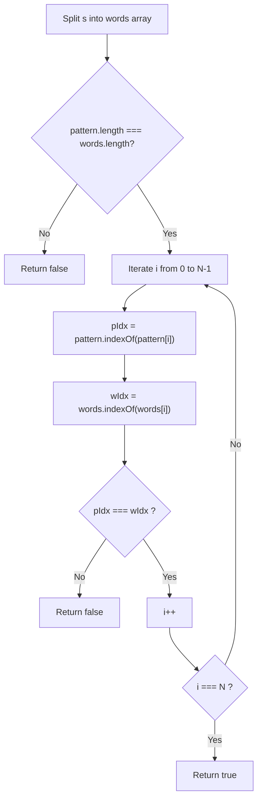
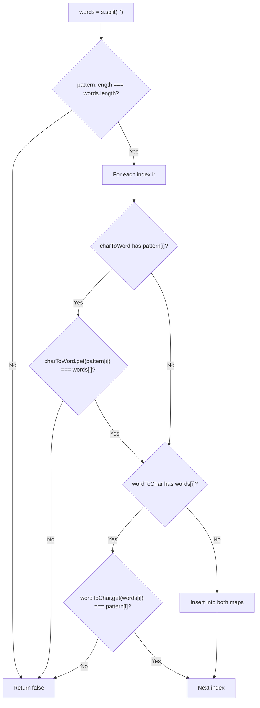
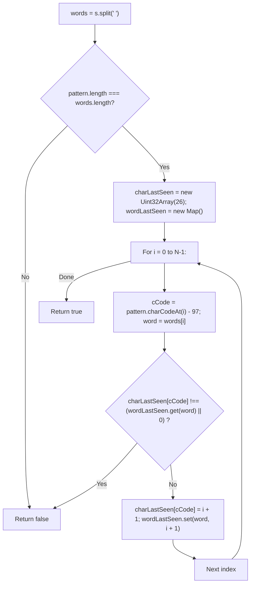

# 290. Word Pattern

- **LeetCode Link**: `https://leetcode.com/problems/word-pattern/`
- **Difficulty**: Easy
- **Pattern Category**: Hash Table / Bijective Mapping / Token Normalization
- **Prerequisite Primer**: `00-foundations/01-js-interview-runtime-quirks.md`

---

## 1. Problem Overview & Edge Case Matrix

### Problem Statement
Given a `pattern` and a string `s`, find if `s` follows the same pattern.

Here **follow** means a full match, such that there is a **bijection** (one-to-one and onto correspondence) between a letter in `pattern` and a non-empty word in `s`.
1. Each letter in `pattern` maps to exactly one unique word in `s`.
2. Each unique word in `s` maps to exactly one letter in `pattern`.
3. No two distinct letters map to the same word, and no single letter maps to two different words.

```
Example 1:
pattern = "abba", s = "dog cat cat dog"
'a' -> "dog"
'b' -> "cat"
Valid bijection -> true

Example 2:
pattern = "abba", s = "dog cat cat fish"
'a' -> "dog"
'a' -> "fish" (Conflict: 'a' maps to both "dog" and "fish") -> false

Example 3:
pattern = "abba", s = "dog dog dog dog"
'a' -> "dog"
'b' -> "dog" (Conflict: both 'a' and 'b' map to "dog") -> false
```

### Upfront Edge Case Matrix

| Edge Case Scenario | Inputs | Expected Output | Pitfall / Failure Mode |
| :--- | :--- | :--- | :--- |
| Word Count $\neq$ Pattern Length | `pattern = "aaa"`, `s = "aa aa aa aa"` | `false` | Unhandled index out-of-bounds |
| Object Prototype Collision | `pattern = "a"`, `s = "constructor"` | `true` | Using plain `{}` object where `"constructor"` exists on prototype |
| Many-to-One Word Collision | `pattern = "abba"`, `s = "dog dog dog dog"` | `false` | Checking only $char \to word$ without verifying $word \to char$ |
| One-to-Many Word Collision | `pattern = "aaaa"`, `s = "dog cat cat dog"` | `false` | Overwriting existing character-to-word assignment |
| Single Letter / Word | `pattern = "x"`, `s = "hello"` | `true` | Minimum boundary condition |

---

## 2. Level 1: Brute Force Approach (First Occurrence Index Comparison)

### Intuition & Visual Idea
Two sequences follow the same pattern if and only if their repetition signatures match index for index.
We split `s` by space delimiter into `words`. If `pattern.length !== words.length`, they cannot match.
For each index $i$:
- The first occurrence index of `pattern[i]` in `pattern` must equal the first occurrence index of `words[i]` in `words`.



### Pseudocode
```text
FUNCTION wordPatternBruteForce(pattern, s):
    words = s.SPLIT(' ')
    IF pattern.length != words.length: RETURN false
    
    FOR i FROM 0 TO pattern.length - 1:
        IF pattern.INDEX_OF(pattern[i]) != words.INDEX_OF(words[i]):
            RETURN false
            
    RETURN true
```

### Step-by-Step Dry Run
`pattern = "abba"`, `s = "dog cat cat fish"`
`words = ["dog", "cat", "cat", "fish"]`

| `i` | `pattern[i]` | `pattern.indexOf` | `words[i]` | `words.indexOf` | Match? |
| :--- | :--- | :--- | :--- | :--- | :--- |
| 0 | `'a'` | 0 | `"dog"` | 0 | Yes ($0 == 0$) |
| 1 | `'b'` | 1 | `"cat"` | 1 | Yes ($1 == 1$) |
| 2 | `'b'` | 1 | `"cat"` | 1 | Yes ($1 == 1$) |
| 3 | `'a'` | 0 | `"fish"` | 3 | **Mismatch ($0 \neq 3$) $\to$ `false`** |

### Modern JavaScript Implementation
```javascript
/**
 * Level 1: First Occurrence Index Signature
 * Time Complexity:  O(N^2) due to nested indexOf scans
 * Space Complexity: O(N) for words token array
 */
function wordPatternBruteForce(pattern, s) {
  const words = s.split(' ');
  if (pattern.length !== words.length) return false;

  for (let i = 0; i < pattern.length; i++) {
    // Structural invariant: First introduction positions must match
    if (pattern.indexOf(pattern[i]) !== words.indexOf(words[i])) {
      return false;
    }
  }

  return true;
}
```

### Complexity Breakdown
- **Time Complexity**: $O(N^2)$ — For each of the $N$ tokens, `indexOf` scans arrays of size $N$.
- **Space Complexity**: $O(N)$ — Splits string $s$ into an array of $N$ words.

#### 🎙️ How to Explain to Interviewer
> *"A valid bijection guarantees identical index recurrence. Comparing `pattern.indexOf(pattern[i])` against `words.indexOf(words[i])` verifies that both symbols were introduced and repeated at the exact same indices. While structurally elegant, repeatedly calling `indexOf` creates an $O(N^2)$ bottleneck."*

---

## 3. Level 2: Optimized Approach (Dual Hash Maps for Bijection)

### Intuition & Visual Bottleneck Elimination
To improve from quadratic to linear time, we use two Hash Maps:
- `charToWord`: Maps pattern character $\to$ word string.
- `wordToChar`: Maps word string $\to$ pattern character.

At each step $i$:
1. If `charToWord` contains `pattern[i]`, verify its mapped word equals `words[i]`.
2. If `wordToChar` contains `words[i]`, verify its mapped character equals `pattern[i]`.
3. If neither exists, insert both mappings.



### Pseudocode
```text
FUNCTION wordPatternTwoMaps(pattern, s):
    words = s.SPLIT(' ')
    IF pattern.length != words.length: RETURN false
    
    charToWord = NEW MAP()
    wordToChar = NEW MAP()
    
    FOR i FROM 0 TO pattern.length - 1:
        c = pattern[i]
        w = words[i]
        
        IF (charToWord.HAS(c) AND charToWord.GET(c) != w) OR
           (wordToChar.HAS(w) AND wordToChar.GET(w) != c):
            RETURN false
            
        charToWord.SET(c, w)
        wordToChar.SET(w, c)
        
    RETURN true
```

### Step-by-Step Dry Run
`pattern = "abba"`, `words = ["dog", "dog", "dog", "dog"]`

| `i` | `c` | `w` | `charToWord` Check | `wordToChar` Check | Outcome |
| :--- | :--- | :--- | :--- | :--- | :--- |
| 0 | `'a'` | `"dog"` | Unmapped | Unmapped | Bind `'a' <-> "dog"` |
| 1 | `'b'` | `"dog"` | `'b'` unmapped | `"dog"` already maps to `'a'`! | **Collision detected $\to$ return `false`** |

### Modern JavaScript Implementation
```javascript
/**
 * Level 2: Dual Hash Maps
 * Time Complexity:  O(N + M) where N = pattern.length, M = length of s
 * Space Complexity: O(U) where U = number of unique words/characters
 */
function wordPatternTwoMaps(pattern, s) {
  const words = s.split(' ');
  if (pattern.length !== words.length) return false;

  // Use Map to avoid prototype property collision (e.g., word = "constructor")
  const charToWord = new Map();
  const wordToChar = new Map();

  for (let i = 0; i < pattern.length; i++) {
    const char = pattern[i];
    const word = words[i];

    const mappedWord = charToWord.get(char);
    const mappedChar = wordToChar.get(word);

    if (
      (mappedWord !== undefined && mappedWord !== word) ||
      (mappedChar !== undefined && mappedChar !== char)
    ) {
      return false;
    }

    charToWord.set(char, word);
    wordToChar.set(word, char);
  }

  return true;
}
```

### Complexity Breakdown
- **Time Complexity**: $O(N + M)$ — Splitting string $s$ takes $O(M)$ time; $N$ map lookups take $O(1)$ average each.
- **Space Complexity**: $O(N)$ — Storing words array and unique entries in maps.

#### 🎙️ How to Explain to Interviewer
> *"A bijection requires verifying both directions: that one character never maps to multiple words, and that multiple characters never map to the same word. Using two JavaScript `Map` instances eliminates prototype pollution bugs that arise with plain object hashes and guarantees $O(1)$ average time per token."*

---

## 4. Level 3: Most Optimal / Canonical Approach (Fixed Typed Array for Chars + Single Word Map)

### Intuition & Mathematical Proof
We can optimize Level 2 significantly by combining two architectural insights:
1. `pattern` consists solely of 26 lowercase English letters $\implies$ use a **`Uint32Array(26)`** to store character positions!
2. `words` are dynamic strings $\implies$ use a **single `Map<string, number>`** to store word positions.

Instead of storing cross-references between characters and words, both data structures store the **1-based index ($i + 1$)** of when they were last observed:
- Character last seen: `charLastSeen[pattern.charCodeAt(i) - 97]`
- Word last seen: `wordLastSeen.get(words[i]) || 0`

If at any point `charLastSeen !== wordLastSeen`, the structural symmetry is broken $\implies$ return `false`!

```
pattern[i] = 'a' -> charLastSeen['a']
words[i]   = "dog" -> wordLastSeen["dog"]

If charLastSeen['a'] !== wordLastSeen["dog"]:
  One appeared without the other previously -> Return false!
```



### Pseudocode
```text
FUNCTION wordPattern(pattern, s):
    words = s.SPLIT(' ')
    IF pattern.length != words.length: RETURN false
    
    charLastSeen = ARRAY OF 26 ZEROES
    wordLastSeen = NEW MAP()
    
    FOR i FROM 0 TO pattern.length - 1:
        cIdx = CHAR_CODE(pattern[i]) - 97
        w = words[i]
        
        lastC = charLastSeen[cIdx]
        lastW = wordLastSeen.GET(w) || 0
        
        IF lastC != lastW:
            RETURN false
            
        charLastSeen[cIdx] = i + 1
        wordLastSeen.SET(w, i + 1)
        
    RETURN true
```

### Step-by-Step Dry Run
`pattern = "abba"`, `s = "dog cat cat dog"`

| `i` | Char `c` | Word `w` | `charLastSeen[c]` | `wordLastSeen[w]` | Equal? | Update to `i + 1` |
| :--- | :--- | :--- | :--- | :--- | :--- | :--- |
| 0 | `'a'` | `"dog"` | 0 | 0 | Yes | `'a' -> 1`, `"dog" -> 1` |
| 1 | `'b'` | `"cat"` | 0 | 0 | Yes | `'b' -> 2`, `"cat" -> 2` |
| 2 | `'b'` | `"cat"` | 2 | 2 | Yes | `'b' -> 3`, `"cat" -> 3` |
| 3 | `'a'` | `"dog"` | 1 | 1 | Yes | `'a' -> 4`, `"dog" -> 4` |
| End | - | - | - | - | - | Return `true` |

### Modern JavaScript Implementation
```javascript
/**
 * Level 3: Canonical Last-Seen Synchronization
 * Time Complexity:  O(N + M) where N = pattern.length, M = s.length
 * Space Complexity: O(U) where U = number of unique words
 */
function wordPattern(pattern, s) {
  const words = s.split(' ');
  const n = pattern.length;

  // Short-circuit: Mismatched token counts
  if (n !== words.length) return false;

  // 26-element typed array for characters (zero heap allocation)
  const charLastSeen = new Uint32Array(26);
  // Map for arbitrary word strings
  const wordLastSeen = new Map();

  for (let i = 0; i < n; i++) {
    const charCode = pattern.charCodeAt(i) - 97;
    const word = words[i];

    const lastCharPos = charLastSeen[charCode];
    const lastWordPos = wordLastSeen.get(word) || 0;

    // Both must have been observed at the exact same prior 1-based index
    if (lastCharPos !== lastWordPos) {
      return false;
    }

    const currentPos = i + 1;
    charLastSeen[charCode] = currentPos;
    wordLastSeen.set(word, currentPos);
  }

  return true;
}
```

### Complexity Breakdown
- **Time Complexity**: $O(N + M)$ — $O(M)$ to tokenize string $s$, and $N$ iterations doing $O(1)$ array and hash map operations.
- **Space Complexity**: $O(U)$ — Where $U$ is the number of unique words stored in `wordLastSeen`. The character buffer is strictly 26 integers ($O(1)$).

#### 🎙️ How to Explain to Interviewer
> *"Instead of keeping two cross-referencing maps, we observe that if a character and a word correspond, their last-seen positions must advance in lockstep. We store the character positions in a fixed 26-element typed array and word positions in a single Map. Comparing their last-seen indices simultaneously validates both forward and backward bijection in a single pass."*

---

## 5. JavaScript-Specific Gotchas & V8 Optimizations
- **The Prototype Trap (`{}` vs `Map`)**: If an interviewee uses a plain object `{}` as a hash table, testing `s = "constructor"` causes `wordToChar["constructor"]` to evaluate to `[Function: Object]`, breaking the equality comparison and causing a false negative! Always use `Map` or `Object.create(null)` for arbitrary string inputs.
- **`Uint32Array(26)` Efficiency**: A 26-element typed array occupies 104 contiguous bytes in V8 memory. Looking up `charLastSeen[charCode]` incurs zero property hashing, zero string allocation, and runs at direct CPU memory speed.

---

## 6. Real-World MAANG Interview Follow-Ups & Extensions

### Follow-Up 1: Word Pattern II (Unsegmented String with Backtracking)
- **Scenario**: What if `s` is not space-separated (e.g. `pattern = "abab"`, `s = "redblueredblue"`)?
- **Solution Strategy**: There are no explicit word boundaries. We must use Backtracking with DFS. At each character in `pattern`, branch through all possible substring lengths for the current word.
- **JS Code**:
```javascript
function wordPatternMatch(pattern, s) {
  const charToWord = new Map();
  const wordToChar = new Map();

  function backtrack(pIdx, sIdx) {
    if (pIdx === pattern.length && sIdx === s.length) return true;
    if (pIdx === pattern.length || sIdx === s.length) return false;

    const char = pattern[pIdx];

    if (charToWord.has(char)) {
      const word = charToWord.get(char);
      if (!s.startsWith(word, sIdx)) return false;
      return backtrack(pIdx + 1, sIdx + word.length);
    }

    for (let end = sIdx + 1; end <= s.length; end++) {
      const word = s.substring(sIdx, end);
      if (wordToChar.has(word)) continue; // Injective check

      charToWord.set(char, word);
      wordToChar.set(word, char);

      if (backtrack(pIdx + 1, end)) return true;

      charToWord.delete(char);
      wordToChar.delete(word);
    }

    return false;
  }

  return backtrack(0, 0);
}
```

### Follow-Up 2: Streaming Zero-Allocation Tokenizer
- **Scenario**: String `s` is a 100 MB string. `s.split(' ')` would allocate an array of millions of string objects, exhausting memory. How to validate without `split()`?
- **Solution Strategy**: Implement a two-pointer parser that extracts slice coordinates `[start, end)` without pre-allocating the entire array.
- **JS Code**:
```javascript
function wordPatternStreaming(pattern, s) {
  let sIdx = 0;
  const n = pattern.length;
  const charLastSeen = new Uint32Array(26);
  const wordLastSeen = new Map();

  for (let i = 0; i < n; i++) {
    if (sIdx >= s.length) return false;

    // Find next word boundaries
    while (sIdx < s.length && s[sIdx] === ' ') sIdx++;
    const start = sIdx;
    while (sIdx < s.length && s[sIdx] !== ' ') sIdx++;
    const word = s.substring(start, sIdx);

    const charCode = pattern.charCodeAt(i) - 97;
    const lastCharPos = charLastSeen[charCode];
    const lastWordPos = wordLastSeen.get(word) || 0;

    if (lastCharPos !== lastWordPos) return false;

    const currentPos = i + 1;
    charLastSeen[charCode] = currentPos;
    wordLastSeen.set(word, currentPos);
  }

  // Ensure no trailing words remain in s
  while (sIdx < s.length && s[sIdx] === ' ') sIdx++;
  return sIdx === s.length;
}
```
