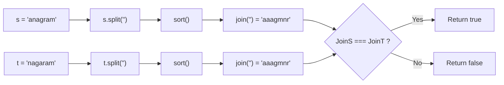
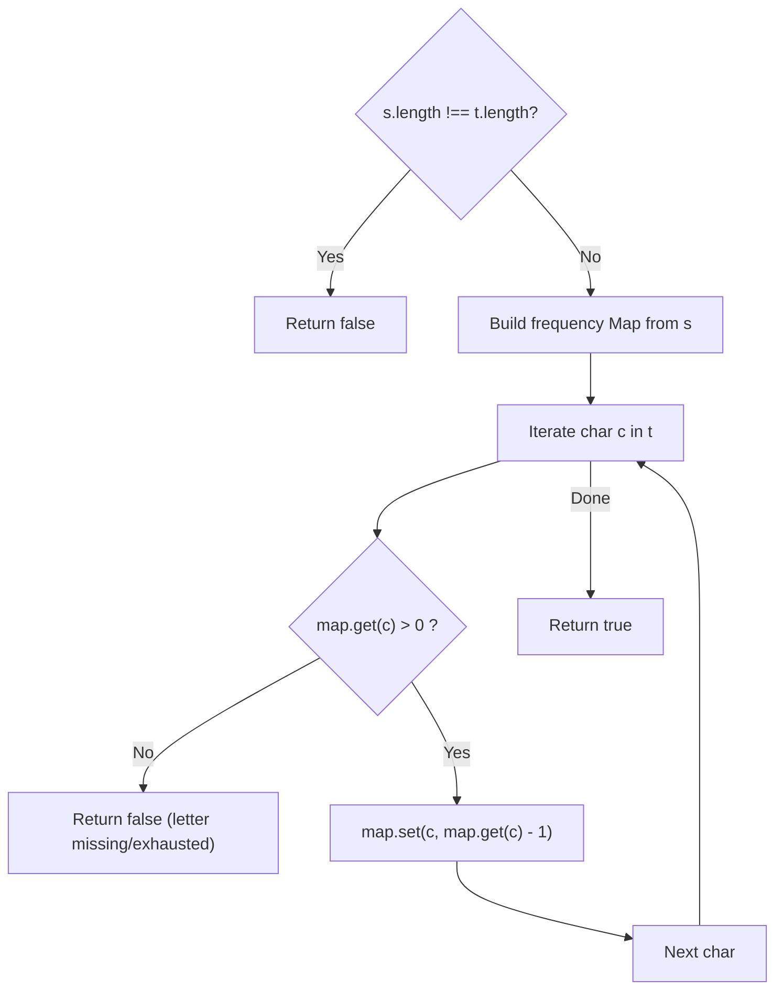
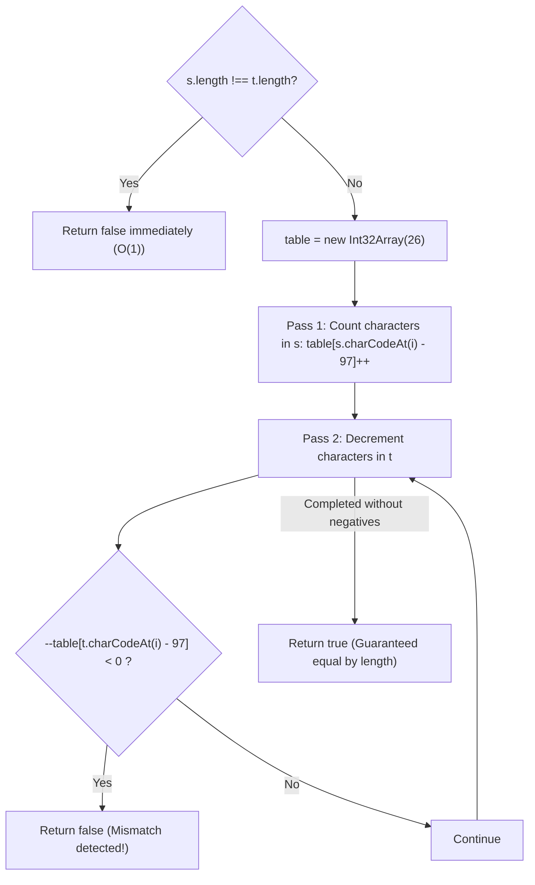

# 242. Valid Anagram

- **LeetCode Link**: `https://leetcode.com/problems/valid-anagram/`
- **Difficulty**: Easy
- **Pattern Category**: Hash Table / Frequency Counting / Alphabet Bucketing
- **Prerequisite Primer**: `00-foundations/01-js-interview-runtime-quirks.md`

---

## 1. Problem Overview & Edge Case Matrix

### Problem Statement
Given two strings `s` and `t`, return `true` if `t` is an **anagram** of `s`, and `false` otherwise.

An **anagram** is a word or phrase formed by rearranging the letters of a different word or phrase, typically using all the original letters exactly once. Both strings consist of lowercase English letters.

```
Example 1:
s = "anagram", t = "nagaram"
Frequencies match: a:3, g:1, m:1, n:1, r:1 -> Output: true

Example 2:
s = "rat", t = "car"
Frequencies mismatch: 'c' != 't' -> Output: false
```

### Upfront Edge Case Matrix

| Edge Case Scenario | Inputs | Expected Output | Pitfall / Failure Mode |
| :--- | :--- | :--- | :--- |
| Mismatched String Lengths | `s = "a"`, `t = "ab"` | `false` | Allocating frequency map when lengths differ |
| Identical Strings | `s = "listen"`, `t = "listen"` | `true` | Redundant full scan |
| Same Unique Letters, Different Counts | `s = "aacc"`, `t = "ccca"` | `false` | Checking set inclusion rather than multiset frequencies |
| Single Matching Character | `s = "z"`, `t = "z"` | `true` | Loop off-by-one fencepost |
| Completely Disjoint Characters | `s = "abc"`, `t = "xyz"` | `false` | Unhandled negative bucket values |

---

## 2. Level 1: Brute Force Approach (Sorting & Canonical String Comparison)

### Intuition & Visual Idea
If two strings are anagrams, their sorted character sequences must be identical.
We convert both strings to character arrays, sort them lexicographically using JavaScript's native `.sort()`, join them back into strings, and check for equality.



### Pseudocode
```text
FUNCTION isAnagramSort(s, t):
    IF s.length != t.length: RETURN false
    sortedS = s.SPLIT('').SORT().JOIN('')
    sortedT = t.SPLIT('').SORT().JOIN('')
    RETURN sortedS == sortedT
```

### Step-by-Step Dry Run
`s = "rat"`, `t = "car"`

| Step | `s` Processing | `t` Processing | Comparison |
| :--- | :--- | :--- | :--- |
| 1. Length Check | $3 == 3$ (Pass) | $3 == 3$ (Pass) | Continue |
| 2. Split | `['r', 'a', 't']` | `['c', 'a', 'r']` | - |
| 3. Sort | `['a', 'r', 't']` | `['a', 'c', 'r']` | - |
| 4. Join | `"art"` | `"acr"` | `"art" !== "acr"` $\to$ `false` |

### Modern JavaScript Implementation
```javascript
/**
 * Level 1: Sorting Character Arrays
 * Time Complexity:  O(N log N)
 * Space Complexity: O(N) auxiliary space
 */
function isAnagramSort(s, t) {
  if (s.length !== t.length) return false;

  const sortedS = s.split('').sort().join('');
  const sortedT = t.split('').sort().join('');

  return sortedS === sortedT;
}
```

### Complexity Breakdown
- **Time Complexity**: $O(N \log N)$ — TimSort in V8 on $N$ characters.
- **Space Complexity**: $O(N)$ — Allocates intermediate arrays and joined strings.

#### 🎙️ How to Explain to Interviewer
> *"Sorting provides a canonical form for any anagram. If the sorted representations of both strings are identical, they share the exact same character multiset. While simple to implement, sorting costs $O(N \log N)$ time and allocates multiple intermediate arrays in V8."*

---

## 3. Level 2: Optimized Approach (Hash Map Frequency Counter)

### Intuition & Visual Bottleneck Elimination
Instead of sorting, count character occurrences using a `Map`.
1. Increment character counts for string `s`.
2. Decrement character counts for string `t`. If a character from `t` is missing or its count reaches `0`, return `false`.



### Pseudocode
```text
FUNCTION isAnagramMap(s, t):
    IF s.length != t.length: RETURN false
    counts = NEW MAP()
    
    FOR EACH char IN s:
        counts.SET(char, (counts.GET(char) || 0) + 1)
        
    FOR EACH char IN t:
        count = counts.GET(char) || 0
        IF count == 0:
            RETURN false
        counts.SET(char, count - 1)
        
    RETURN true
```

### Step-by-Step Dry Run
`s = "anagram"`, `t = "nagaram"`

| Step | Char in `t` | Available in Map Before | Map After Decrement | Valid? |
| :--- | :--- | :--- | :--- | :--- |
| Initial | - | `{'a':3, 'n':1, 'g':1, 'r':1, 'm':1}` | - | - |
| 1 | `'n'` | 1 | `{'a':3, 'n':0, ...}` | Yes |
| 2 | `'a'` | 3 | `{'a':2, 'n':0, ...}` | Yes |
| 3 | `'g'` | 1 | `{'g':0, ...}` | Yes |
| 4 | `'a'` | 2 | `{'a':1, ...}` | Yes |
| 5 | `'r'` | 1 | `{'r':0, ...}` | Yes |
| 6 | `'a'` | 1 | `{'a':0, ...}` | Yes |
| 7 | `'m'` | 1 | `{'m':0, ...}` | Yes |
| Result | All characters verified | - | - | Return `true` |

### Modern JavaScript Implementation
```javascript
/**
 * Level 2: Hash Map Frequency Balancing
 * Time Complexity:  O(N)
 * Space Complexity: O(K) where K <= 26 unique characters (O(1) auxiliary)
 */
function isAnagramMap(s, t) {
  if (s.length !== t.length) return false;

  const counts = new Map();

  for (let i = 0; i < s.length; i++) {
    const char = s[i];
    counts.set(char, (counts.get(char) || 0) + 1);
  }

  for (let i = 0; i < t.length; i++) {
    const char = t[i];
    const available = counts.get(char) || 0;

    if (available === 0) {
      return false; // Character missing or depleted
    }

    counts.set(char, available - 1);
  }

  return true;
}
```

### Complexity Breakdown
- **Time Complexity**: $O(N)$ — Two passes of length $N$ with $O(1)$ map lookups.
- **Space Complexity**: $O(K)$ — Up to 26 key-value pairs in the Map.

#### 🎙️ How to Explain to Interviewer
> *"We tally character counts for string `s` in a Hash Map and then consume those counts using string `t`. Because we established that `s.length === t.length`, if no count drops below zero during consumption, the two strings must have identical character frequencies."*

---

## 4. Level 3: Most Optimal / Canonical Approach (Fixed 26-Element Array with Conservation of Sum)

### Intuition & Mathematical Proof
Since both strings consist solely of lowercase English letters, a fixed 26-element typed array (`Int32Array(26)`) indexed by `charCodeAt(i) - 97` acts as a zero-allocation frequency table.

**The Early-Termination Conservation Invariant**:
1. Check `s.length !== t.length`. If lengths differ, return `false` immediately.
2. Populate the frequency table from `s`.
3. In the second pass over `t`, decrement the corresponding bucket:
   `if (--table[code] < 0) return false;`

**Proof**:
Since $\sum \text{counts}(s) = N = \sum \text{counts}(t)$, if no bucket is ever decremented below zero, then no bucket can possibly remain greater than zero!
Therefore, **no final pass over the 26 buckets is needed**. We achieve true single-pass verification over $t$ with early termination on the first discrepancy.

```
ASCII Mapping:
'a' -> index 0
'z' -> index 25

Array Table Layout:
[ 3 ,  0 ,  0 ,  1 , ... ,  1 ]
 'a'  'b'  'c'  'g'       'r'
```



### Pseudocode
```text
FUNCTION isAnagram(s, t):
    IF s.length != t.length: RETURN false
    table = ARRAY OF 26 ZEROES
    
    FOR i FROM 0 TO s.length - 1:
        table[CHAR_CODE(s[i]) - 97]++
        
    FOR i FROM 0 TO t.length - 1:
        idx = CHAR_CODE(t[i]) - 97
        table[idx]--
        IF table[idx] < 0:
            RETURN false
            
    RETURN true
```

### Step-by-Step Dry Run
`s = "ab"`, `t = "ba"`

| Step | Operation | `table[0]` ('a') | `table[1]` ('b') | Condition |
| :--- | :--- | :--- | :--- | :--- |
| Initial | `new Int32Array(26)` | 0 | 0 | - |
| Pass 1 (s) | `s[0] = 'a'` | 1 | 0 | - |
| Pass 1 (s) | `s[1] = 'b'` | 1 | 1 | - |
| Pass 2 (t) | `t[0] = 'b'` $\to$ `--table[1]` | 1 | 0 | $0 \ge 0$ (OK) |
| Pass 2 (t) | `t[1] = 'a'` $\to$ `--table[0]` | 0 | 0 | $0 \ge 0$ (OK) |
| Result | Loop finished | 0 | 0 | Return `true` |

### Modern JavaScript Implementation
```javascript
/**
 * Level 3: Canonical Alphabet Bucket with Length Pruning
 * Time Complexity:  O(N)
 * Space Complexity: O(1) Auxiliary Space (26 integers / 104 bytes)
 */
function isAnagram(s, t) {
  // Pruning: Anagrams must have identical length
  if (s.length !== t.length) return false;

  const n = s.length;
  const table = new Int32Array(26);

  // Pass 1: Build frequency table from string s
  for (let i = 0; i < n; i++) {
    table[s.charCodeAt(i) - 97]++;
  }

  // Pass 2: Decrement counts using string t
  for (let i = 0; i < n; i++) {
    const idx = t.charCodeAt(i) - 97;
    // If count drops below 0, t has more of this character than s
    if (--table[idx] < 0) {
      return false;
    }
  }

  return true;
}
```

### Complexity Breakdown
- **Time Complexity**: $O(N)$ — Exactly $2N$ character visits. Early termination returns on the first mismatched frequency.
- **Space Complexity**: $O(1)$ auxiliary space — Exactly 26 integers allocated as a contiguous buffer (104 bytes).

#### 🎙️ How to Explain to Interviewer
> *"Because English lowercase letters map directly to indices 0 through 25, a 26-element integer typed array serves as an ultra-fast frequency bucket. After incrementing counts with string `s`, we decrement with string `t`. By conservation of sum, if no count ever drops below zero, then all counts must be exactly zero upon completion. This eliminates the secondary loop over the alphabet array and yields zero V8 GC overhead."*

---

## 5. JavaScript-Specific Gotchas & V8 Optimizations
- **Why `charCodeAt(i) - 97` Beats String Indexing**: In V8, `s[i]` creates an ephemeral 1-character string object. Using `s.charCodeAt(i)` fetches the UTF-16 numerical integer directly, allowing TurboFan to keep the character code in a CPU register.
- **`Int32Array(26)` vs Plain Array `[]`**: Plain JavaScript arrays can transition through multiple element kinds (`HOLEY_SMI_ELEMENTS`). An `Int32Array` guarantees an unboxed, fixed-size contiguous memory block with direct pointer arithmetic.

---

## 6. Real-World MAANG Interview Follow-Ups & Extensions

### Follow-Up 1: Full Unicode & Multilingual Support
- **Scenario**: What if the inputs contain arbitrary Unicode characters (e.g., accents, Chinese characters, emojis)?
- **Solution Strategy**: `charCodeAt` only handles BMP characters and `Int32Array(26)` overflows. We must iterate code points via `for...of` or `codePointAt` and use a `Map<number, number>`.
- **JS Code**:
```javascript
function isAnagramUnicode(s, t) {
  if (s.length !== t.length) return false;

  const counts = new Map();

  for (const char of s) {
    counts.set(char, (counts.get(char) || 0) + 1);
  }

  for (const char of t) {
    const available = counts.get(char) || 0;
    if (available === 0) return false;
    counts.set(char, available - 1);
  }

  return true;
}
```

### Follow-Up 2: Grouping Billions of Streaming Anagram Queries
- **Scenario**: In an ultra-high-throughput search engine, billions of words must be hashed so that any two anagrams share the same 64-bit fingerprint without sorting strings.
- **Solution Strategy**: Prime Number Product or Count-Signature Hashing. Assign each of the 26 letters a unique prime number: `a=2, b=3, c=5, ...`. By the Fundamental Theorem of Arithmetic, the product of primes is unique to each multiset of letters! (Use BigInt with modular hash to avoid integer overflow).
- **JS Code**:
```javascript
const PRIMES = [
  2n, 3n, 5n, 7n, 11n, 13n, 17n, 19n, 23n, 29n, 31n, 37n, 41n,
  43n, 47n, 53n, 59n, 61n, 67n, 71n, 73n, 79n, 83n, 89n, 97n, 101n
];

function getAnagramPrimeHash(str) {
  let hash = 1n;
  const MOD = 1000000007n; // Or use 64-bit BigInt
  for (let i = 0; i < str.length; i++) {
    const prime = PRIMES[str.charCodeAt(i) - 97];
    hash = (hash * prime) % MOD;
  }
  return hash;
}
```
