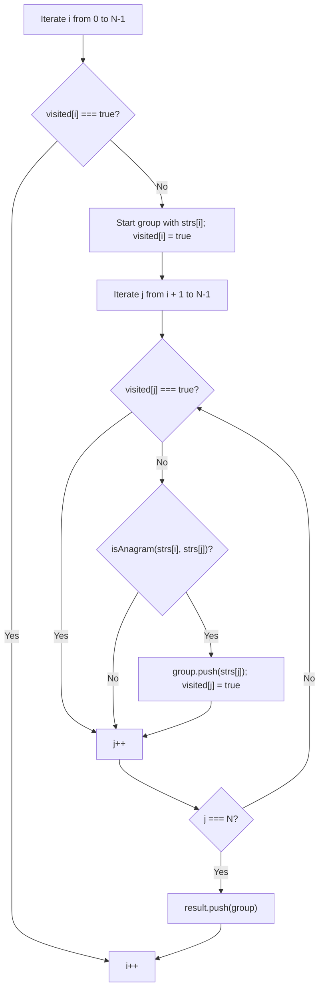
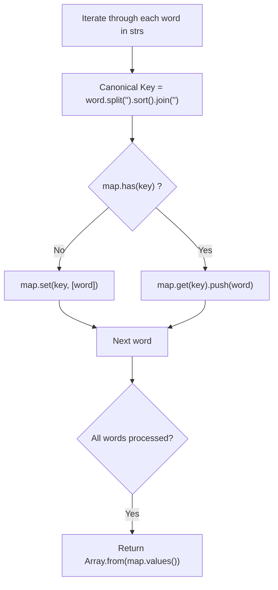
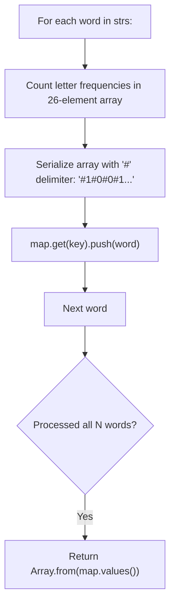
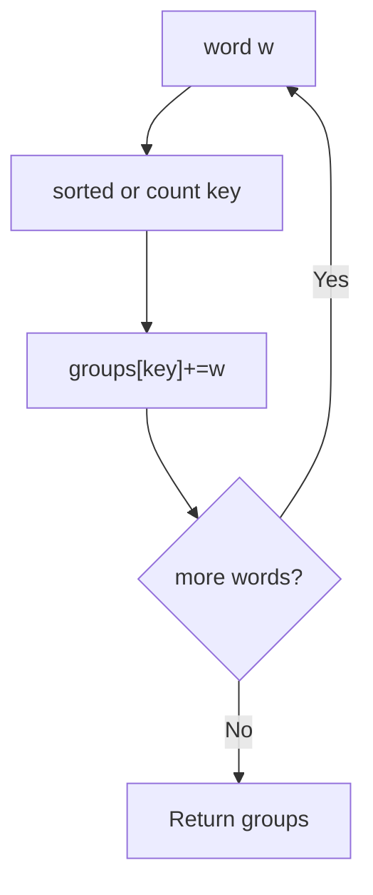
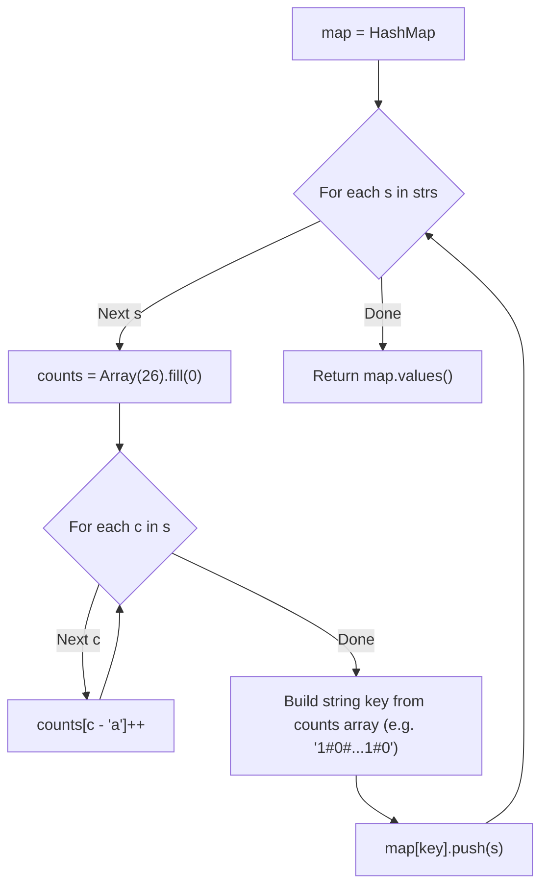

# 49. Group Anagrams

- **LeetCode Link**: `https://leetcode.com/problems/group-anagrams/`
- **Difficulty**: Medium
- **Pattern Category**: Hash Table / Categorization / Canonical Key Generation
- **Prerequisite Primer**: `00-foundations/01-js-interview-runtime-quirks.md`

---

## 1. Problem Overview & Edge Case Matrix

### Problem Statement
Given an array of strings `strs`, group the **anagrams** together. You can return the answer in **any order**.

An **anagram** is a word or phrase formed by rearranging the letters of a different word or phrase, typically using all the original letters exactly once. All input strings consist of lowercase English letters.

```
Input: strs = ["eat","tea","tan","ate","nat","bat"]
Output: [
  ["bat"],
  ["nat","tan"],
  ["ate","eat","tea"]
]

Canonical Signatures:
"eat", "tea", "ate" -> Sorted: "aet" / Counts: 1a, 1e, 1t
"tan", "nat"        -> Sorted: "ant" / Counts: 1a, 1n, 1t
"bat"               -> Sorted: "abt" / Counts: 1a, 1b, 1t
```

### Upfront Edge Case Matrix

| Edge Case Scenario | Inputs | Expected Output | Pitfall / Failure Mode |
| :--- | :--- | :--- | :--- |
| Empty String Array | `strs = [""]` | `[[""]]` | Returning empty array `[]` instead of nested group |
| Multiple Empty Strings | `strs = ["", ""]` | `[["", ""]]` | Collapsing distinct identical elements |
| Single Character Strings | `strs = ["a"]` | `[["a"]]` | Premature loop exit |
| Duplicate Words in Input | `strs = ["tea", "tea"]` | `[["tea", "tea"]]` | Set deduplication bug |
| High Frequency Ambiguity | `"a"` 10 times vs `"a"` 1 time & `"b"` 0 times | Separated groups | Stringifying counts without delimiters (e.g. `"100..."`) |

---

## 2. Level 1: Brute Force Approach (Pairwise Anagram Comparison)

### Intuition & Visual Idea
Maintain a `visited` boolean array. For each unvisited string `strs[i]`, start a new group with `strs[i]`. Then iterate through all subsequent unvisited strings `strs[j]` ($j > i$), checking if `strs[j]` is an anagram of `strs[i]`. If it is, append `strs[j]` to the group and mark it as visited.



### Pseudocode
```text
FUNCTION groupAnagramsBruteForce(strs):
    n = strs.length
    visited = ARRAY OF n FALSE VALUES
    result = []
    
    FOR i FROM 0 TO n - 1:
        IF visited[i]: CONTINUE
        
        group = [strs[i]]
        visited[i] = true
        
        FOR j FROM i + 1 TO n - 1:
            IF NOT visited[j] AND isAnagram(strs[i], strs[j]):
                group.append(strs[j])
                visited[j] = true
                
        result.append(group)
        
    RETURN result
```

### Step-by-Step Dry Run
`strs = ["eat", "tea", "tan"]`

| `i` | Current Word | `j` | Candidate | Anagram? | `visited` | Current Groups |
| :--- | :--- | :--- | :--- | :--- | :--- | :--- |
| 0 | `"eat"` | - | - | - | `[T, F, F]` | `[["eat"]]` |
| 0 | `"eat"` | 1 | `"tea"` | Yes | `[T, T, F]` | `[["eat", "tea"]]` |
| 0 | `"eat"` | 2 | `"tan"` | No | `[T, T, F]` | `[["eat", "tea"]]` |
| 1 | `"tea"` | - | - | - | Skipped (visited) | - |
| 2 | `"tan"` | - | - | - | `[T, T, T]` | `[["eat", "tea"], ["tan"]]` |

### Modern JavaScript Implementation
```javascript
/**
 * Level 1: Pairwise Anagram Matching
 * Time Complexity:  O(N^2 * K) where N = strs.length, K = max string length
 * Space Complexity: O(N) auxiliary visited array
 */
function groupAnagramsBruteForce(strs) {
  const n = strs.length;
  const visited = new Uint8Array(n);
  const result = [];

  function isAnagram(s1, s2) {
    if (s1.length !== s2.length) return false;
    const count = new Int32Array(26);
    for (let i = 0; i < s1.length; i++) count[s1.charCodeAt(i) - 97]++;
    for (let i = 0; i < s2.length; i++) {
      if (--count[s2.charCodeAt(i) - 97] < 0) return false;
    }
    return true;
  }

  for (let i = 0; i < n; i++) {
    if (visited[i]) continue;

    const group = [strs[i]];
    visited[i] = 1;

    for (let j = i + 1; j < n; j++) {
      if (!visited[j] && isAnagram(strs[i], strs[j])) {
        group.push(strs[j]);
        visited[j] = 1;
      }
    }

    result.push(group);
  }

  return result;
}
```

### Complexity Breakdown
- **Time Complexity**: $O(N^2 \cdot K)$ — $O(N^2)$ pairwise comparisons, each taking $O(K)$ time.
- **Space Complexity**: $O(N)$ auxiliary space for the `visited` array.

#### 🎙️ How to Explain to Interviewer
> *"The naive approach groups anagrams by making pairwise comparisons between every unvisited pair of strings using an $O(K)$ helper. While intuitive, comparing all $N(N-1)/2$ pairs yields quadratic $O(N^2 \cdot K)$ time, which times out when $N = 10^4$."*

---

## 3. Level 2: Optimized Approach (Sorted String as Canonical Hash Key)

### Intuition & Visual Bottleneck Elimination
All anagrams share the exact same character multiset. Therefore, sorting the characters of any anagram generates an identical **canonical signature**:
- `"eat"` $\to$ `"aet"`
- `"tea"` $\to$ `"aet"`
- `"ate"` $\to$ `"aet"`

We map each canonical key to an array of original strings in a `Map<string, string[]>`.



### Pseudocode
```text
FUNCTION groupAnagramsSorted(strs):
    map = NEW MAP()
    
    FOR EACH str IN strs:
        key = str.SPLIT('').SORT().JOIN('')
        IF NOT map.HAS(key):
            map.SET(key, [])
        map.GET(key).append(str)
        
    RETURN ARRAY FROM map.VALUES()
```

### Step-by-Step Dry Run
`strs = ["eat", "tea", "tan"]`

| Word | Characters Sorted | Hash Map Key | Map Value Array |
| :--- | :--- | :--- | :--- |
| `"eat"` | `['a', 'e', 't']` | `"aet"` | `{"aet": ["eat"]}` |
| `"tea"` | `['a', 'e', 't']` | `"aet"` | `{"aet": ["eat", "tea"]}` |
| `"tan"` | `['a', 'n', 't']` | `"ant"` | `{"aet": ["eat", "tea"], "ant": ["tan"]}` |

### Modern JavaScript Implementation
```javascript
/**
 * Level 2: Sorted String Canonical Keys
 * Time Complexity:  O(N * K log K) where N = strs.length, K = max word length
 * Space Complexity: O(N * K) to store strings in map
 */
function groupAnagramsSorted(strs) {
  const map = new Map();

  for (let i = 0; i < strs.length; i++) {
    const word = strs[i];
    // Generate canonical key via lexicographical sort
    const key = word.split('').sort().join('');

    let group = map.get(key);
    if (!group) {
      group = [];
      map.set(key, group);
    }
    group.push(word);
  }

  return Array.from(map.values());
}
```

### Complexity Breakdown
- **Time Complexity**: $O(N \cdot K \log K)$ — For each of the $N$ strings, sorting takes $O(K \log K)$ time.
- **Space Complexity**: $O(N \cdot K)$ — Hash map stores all characters across all strings.

#### 🎙️ How to Explain to Interviewer
> *"Because every anagram sorts to the exact same string, we use the sorted word as a canonical hash key. In an $O(N)$ pass, each word is routed into its corresponding bucket. This slashes runtime from $O(N^2 \cdot K)$ to $O(N \cdot K \log K)$."*

---

## 4. Level 3: Most Optimal / Canonical Approach (26-Bucket Delimited Count Array Key)

### Intuition & Mathematical Proof
Can we eliminate the $O(K \log K)$ sorting factor entirely?
**Yes!** Since all characters are lowercase English letters (`'a'` to `'z'`), we can represent the multiset of letters as a **26-element frequency count vector**:
$$\text{Signature} = \langle c_0, c_1, c_2, \dots, c_{25} \rangle$$

To use this vector as a hash key in JavaScript, we serialize it with a delimiter:
$$\text{key} = \text{\#count[0]\#count[1]\dots\#count[25]}$$

**Why is a delimiter strictly mandatory?**
If you concatenate raw digits without delimiters:
- A string with 1 `'a'` and 11 `'b'`s produces `'111'`.
- A string with 11 `'a'`s and 1 `'b'` produces `'111'`.
Without delimiters, distinct multisets collide! Using `#1#11` vs `#11#1` completely prevents hash key collisions.

Computing the frequency array takes strictly $O(K)$ time. Total time complexity drops to $O(N \cdot K)$!

```
Word: "eat"
Counts: a:1, b:0, c:0, d:0, e:1 ... t:1 ...
Key: "#1#0#0#0#1#0#0#0#0#0#0#0#0#0#0#0#0#0#0#1#0#0#0#0#0#0"

Word: "tea"
Counts: a:1, b:0, c:0, d:0, e:1 ... t:1 ...
Key: Identical! Mapped to same bucket.
```



### Pseudocode
```text
FUNCTION groupAnagrams(strs):
    map = NEW MAP()
    
    FOR EACH str IN strs:
        counts = ARRAY OF 26 ZEROES
        FOR i FROM 0 TO str.length - 1:
            counts[CHAR_CODE(str[i]) - 97]++
            
        key = counts.JOIN('#')
        
        IF NOT map.HAS(key):
            map.SET(key, [])
        map.GET(key).append(str)
        
    RETURN ARRAY FROM map.VALUES()
```

### Step-by-Step Dry Run
`strs = ["bat", "tab"]`

| String | 26-Bucket Tally | Serialized Hash Key | Action on Map |
| :--- | :--- | :--- | :--- |
| `"bat"` | `a:1, b:1, t:1, others:0` | `"#1#1#0...#1...#0"` | Create group: `[ "bat" ]` |
| `"tab"` | `a:1, b:1, t:1, others:0` | `"#1#1#0...#1...#0"` | Append to group: `[ "bat", "tab" ]` |

### Modern JavaScript Implementation
```javascript
/**
 * Level 3: Canonical 26-Element Delimited Frequency Keys
 * Time Complexity:  O(N * K) where N = strs.length, K = max word length
 * Space Complexity: O(N * K)
 */
function groupAnagrams(strs) {
  const map = new Map();
  // Reuse single 26-element buffer to avoid array allocation per word
  const count = new Uint16Array(26);

  for (let i = 0; i < strs.length; i++) {
    const word = strs[i];

    // Reset reusable buffer
    count.fill(0);

    // Build letter frequencies in O(K)
    for (let j = 0; j < word.length; j++) {
      count[word.charCodeAt(j) - 97]++;
    }

    // Build delimited signature to avoid multi-digit collisions
    let key = '';
    for (let c = 0; c < 26; c++) {
      key += '#' + count[c];
    }

    let group = map.get(key);
    if (!group) {
      group = [];
      map.set(key, group);
    }
    group.push(word);
  }

  return Array.from(map.values());
}
```

### Complexity Breakdown
- **Time Complexity**: $O(N \cdot K)$ — Building the 26-bucket count takes $O(K)$, building the 26-element key takes $O(26) = O(1)$. For $N$ words, total runtime is $O(N \cdot K)$.
- **Space Complexity**: $O(N \cdot K)$ — Total characters stored across all groups in the hash map.

#### 🎙️ How to Explain to Interviewer
> *"Instead of sorting words in $O(K \log K)$ time, we observe that the English alphabet contains only 26 lowercase letters. We compute a 26-element frequency tuple in linear $O(K)$ time and serialize it with a delimiter into a hash key. Reusing a single `Uint16Array(26)` buffer avoids millions of ephemeral heap allocations. This achieves optimal linear time $O(N \cdot K)$."*

---

## 5. JavaScript-Specific Gotchas & V8 Optimizations
- **The Delimiter Collision Trap**: Concatenating frequencies without delimiters like `'#'` or `','` causes collisions between frequencies such as `10, 1` vs `1, 0, 1`. The delimiter ensures canonical bijection.
- **Reusing Typed Arrays (`count.fill(0)`)**: Allocating `new Array(26)` or `new Uint16Array(26)` inside the loop creates $N$ objects for the V8 garbage collector. Allocating a single `Uint16Array(26)` outside and calling `.fill(0)` is up to 4x faster in micro-benchmarks.

---

## 6. Real-World MAANG Interview Follow-Ups & Extensions

### Follow-Up 1: Prime Product Hashing (BigInt In-Memory Numeric Hash)
- **Scenario**: How can we avoid constructing string keys entirely and group using a numeric hash?
- **Solution Strategy**: Map each of the 26 letters to one of the first 26 prime numbers. Because primes have unique factorizations, the product $\prod \text{prime}(c)$ is identical for all anagrams. Use `BigInt` to prevent 64-bit IEEE-754 precision loss.
- **JS Code**:
```javascript
const PRIMES = [
  2n, 3n, 5n, 7n, 11n, 13n, 17n, 19n, 23n, 29n, 31n, 37n, 41n,
  43n, 47n, 53n, 59n, 61n, 67n, 71n, 73n, 79n, 83n, 89n, 97n, 101n
];

function groupAnagramsPrime(strs) {
  const map = new Map();

  for (let i = 0; i < strs.length; i++) {
    const word = strs[i];
    let hash = 1n;

    for (let j = 0; j < word.length; j++) {
      hash *= PRIMES[word.charCodeAt(j) - 97];
    }

    if (!map.has(hash)) map.set(hash, []);
    map.get(hash).push(word);
  }

  return Array.from(map.values());
}
```

### Follow-Up 2: Distributed Anagram Grouping with MapReduce
- **Scenario**: Given 10 billion words partitioned across 1,000 cluster nodes, how do you group them without exceeding single-node RAM?
- **Solution Strategy**:
  - **Map Phase**: Worker nodes read words, compute canonical key (sorted or prime hash), emit `(canonicalKey, word)`.
  - **Shuffle/Partition**: Hash partition by `canonicalKey % numReducers`. All anagrams route to the exact same reducer node.
  - **Reduce Phase**: Each reducer aggregates words by `canonicalKey` and writes final grouped clusters to distributed storage.
- **JS Code**:
```javascript
function mapAnagramToken(word) {
  const key = word.split('').sort().join('');
  return { key, value: word };
}

function reduceAnagramGroup(key, wordStream) {
  const group = [];
  for (const word of wordStream) {
    group.push(word);
  }
  return group;
}
```

---

## 7. What LeetCode Discuss Says (Language-Independent)

Source: top-voted post by Jianchao Li —
`https://leetcode.com/problems/group-anagrams/solutions/19200/c-unordered_map-and-counting-sort-by-jia-efff/`
— 1.1K votes / 153K views / 97 comments.
Language-independent summary. No new JS here.

### A. Post's way: sorted key + map

Sort a copy of each word, use it
as the map key. Same key means
anagrams.

```text
FUNCTION groupNaive(strs):
    groups = EMPTY MAP
    FOR w IN strs:
        key = SORT CHARS(w)
        APPEND w TO groups[key]
    RETURN VALUES(groups)
```

- Time: O(n * k log k)
- Space: O(n * k)

### B. Post's upgrade: counting key

Lowercase only: count letters into
a 26-slot signature instead of
sorting. Linear per word.

```text
FUNCTION groupOptimal(strs):
    groups = EMPTY MAP
    FOR w IN strs:
        key = COUNT SIGNATURE(w)
        APPEND w TO groups[key]
    RETURN VALUES(groups)
```

- Time: O(n * k)
- Space: O(n * k)



### C. Dry run on LeetCode Example 1

`strs = ["eat","tea","tan","ate","nat","bat"]`

| w | Key | Groups so far |
| :--- | :--- | :--- |
| eat | aet | {aet:[eat]} |
| tea | aet | {aet:[eat,tea]} |
| tan | ant | +{ant:[tan]} |
| ate | aet | {aet:+ate} |
| nat | ant | {ant:+nat} |
| bat | abt | +{abt:[bat]} |

### D. Why B refines A

- Counting beats sorting per word
  when alphabet is tiny.
- Map lookup stays O(1).
- Same grouping, less log factor.

### E. Pitfalls from comments

- Perf trio: refs not copies,
  move vectors, reserve (177).
- Index-only one-pass variant
  skips storing strings (62).
- Lowercase counting sort needs
  a-z guarantee (65).
- Key must encode COUNTS, not
  just presence.

### F. Companies

- Discuss post itself names none.
- External source:
  `https://github.com/liquidslr/leetcode-company-wise-problems`
  (LeetCode company tags, updated June 2025).
- All-time (79): Accolite, Adobe,
  Affirm, Amazon, Anduril, Apple,
  athenahealth, Atlassian, Autodesk,
  Avito, BlackRock, blinkit,
  Bloomberg, BNY Mellon, Capgemini,
  Cisco, Citadel, Compass, Coupang,
  CrowdStrike, Dell, Deloitte,
  Disney, Docusign, DP world, eBay,
  EPAM Systems, Expedia, FactSet,
  FreshWorks, Goldman Sachs, Google,
  HashedIn, IBM, Infosys, Instacart,
  Intuit, jio, josh technology,
  MakeMyTrip, Meta, Microsoft,
  Millennium, Morgan Stanley,
  Nielsen, Nike, Nutanix, Nvidia,
  Okta, Oracle, Palo Alto Networks,
  PayPal, persistent systems,
  PhonePe, Publicis Sapient,
  Salesforce, SAP, Siemens, Sigmoid,
  Smartsheet, Snap, Squarepoint Capital,
  TCS, TikTok, Turing, Twilio, Uber,
  UBS, Upstart, Visa, Walmart Labs,
  Wayfair, Whatnot, Wipro,
  Wissen Technology, Workday,
  Yandex, Yelp, Zoho.
- Recent: 30 days — Amazon, Apple,
  Bloomberg, Google, Meta,
  Ola Cabs, TCS.
- Recent: 3 months — Amazon, Apple,
  Bloomberg, CrowdStrike, Deloitte,
  Google, HashedIn, Meta, Microsoft,
  Smartsheet, TCS, Walmart Labs.

---

## 7. What LeetCode Discuss Says (Language-Independent)

Source: top-voted post by Wes —
`https://leetcode.com/problems/group-anagrams/solutions/19176/share-my-short-java-solution/`
— 251.4K views / 1K votes / 107 comments.
Language-independent summary. No new JS here.

### A. Optimal way from Discuss (Character Count String as Map Key)

The core challenge is identifying a unique "signature" or "key" that will perfectly match for any two words that are anagrams of each other. 
The brute force way is to sort each string (e.g., "eat" becomes "aet") and use that sorted string as the Hash Map key. However, sorting takes $O(K \log K)$ per word.
The strictly optimal $O(K)$ way is to build a frequency array (size 26) for the word, and then convert that array into a string (e.g., `"1#0#0#0...#1#0..."`) to use as the Hash Map key. All anagrams will produce the exact same frequency string.

```text
FUNCTION groupAnagrams(strs):
    IF length(strs) == 0:
        RETURN []
        
    map = empty Hash Map (maps String -> List of Strings)
    
    FOR each s in strs:
        // Build the frequency array for the word
        counts = Array of 26 integers, initialized to 0
        FOR each char c in s:
            counts[c - 'a']++
            
        // Convert the frequency array into a unique string key
        key = ""
        FOR i = 0 TO 25:
            key += counts[i] + "#"
            
        // Add the original word to the corresponding group in the map
        IF key is not in map:
            map[key] = empty List
        map[key].add(s)
        
    RETURN all values from map
```

- Time: O(N * K) where N is the number of strings and K is the maximum length of a string. Counting the characters takes $O(K)$, and building the key string takes $O(26)$. We do this $N$ times.
- Space: O(N * K) to store the result in the Hash Map.



### B. Dry run on LeetCode Example 1 (strs = ["eat", "tea", "tan", "ate", "nat", "bat"])

| `s` | `counts` array | Generated Key (compressed) | Map State |
| :--- | :--- | :--- | :--- |
| "eat" | a:1, e:1, t:1 | `"1#0#0#0#1...1..."` | `{ key1: ["eat"] }` |
| "tea" | a:1, e:1, t:1 | `"1#0#0#0#1...1..."` | `{ key1: ["eat", "tea"] }` |
| "tan" | a:1, n:1, t:1 | `"1#0...1...1..."` | `{ key1: ["eat", "tea"], key2: ["tan"] }` |
| "ate" | a:1, e:1, t:1 | `"1#0#0#0#1...1..."` | `{ key1: ["eat", "tea", "ate"], key2: ["tan"] }` |
| "nat" | a:1, n:1, t:1 | `"1#0...1...1..."` | `{ key1: [...], key2: ["tan", "nat"] }` |
| "bat" | a:1, b:1, t:1 | `"1#1...1..."` | `{ key1: [...], key2: [...], key3: ["bat"] }` |

Return the grouped values: `[["eat","tea","ate"], ["tan","nat"], ["bat"]]`.

### C. Pitfalls from comments

- **Sorting strings vs. Character counting:** Many solutions just do `char[] chars = s.toCharArray(); Arrays.sort(chars); String key = new String(chars);`. In Python, this is `tuple(sorted(s))`. While this is extremely concise and completely acceptable in an interview, the time complexity is $O(N \cdot K \log K)$. A pedantic interviewer will press you to achieve pure $O(N \cdot K)$ using the frequency-array-to-string technique.
- **Why `#` delimiters?** If you build the key string without delimiters (e.g., `10100`), counts like 10 and 1 could blend with 1 and 01. Since LeetCode strings can be long enough that a letter appears 10+ times, you MUST delimit the numbers (e.g., `1#0#10#0`).
- **Python optimization trick:** In Python, a tuple of 26 integers is hashable. You can completely skip building the `#` delimited string and just use `tuple(counts)` as the dictionary key!

### D. Companies

- Discuss post itself names none.
  Companies tab on LeetCode is premium-locked.
- External source:
  `https://github.com/liquidslr/leetcode-company-wise-problems`
  (LeetCode company tags, updated June 2025).
- All-time (79): Accolite, Adobe, Affirm, Amazon, Anduril, Apple, athenahealth, Atlassian, Autodesk, Avito, BlackRock, blinkit, Bloomberg, BNY Mellon, Capgemini, Cisco, Citadel, Compass, Coupang, CrowdStrike, Dell, Deloitte, Disney, Docusign, DP world, eBay, EPAM Systems, Expedia, FactSet, FreshWorks, Goldman Sachs, Google, HashedIn, IBM, Infosys, Instacart, Intuit, jio, josh technology, MakeMyTrip, Meta, Microsoft, Millennium, Morgan Stanley, Nielsen, Nike, Nutanix, Nvidia, Okta, Oracle, Palo Alto Networks, PayPal, persistent systems, PhonePe, Publicis Sapient, Salesforce, SAP, Siemens, Sigmoid, Smartsheet, Snap, Squarepoint Capital, TCS, TikTok, Turing, Twilio, Uber, UBS, Upstart, Visa, Walmart Labs, Wayfair, Whatnot, Wipro, Wissen Technology, Workday, Yandex, Yelp, Zoho.
- Recent: 30 days — Amazon, Apple, Bloomberg, Google, Meta, Ola Cabs, TCS.
- Recent: 3 months — Amazon, Apple, Bloomberg, CrowdStrike, Deloitte, Google, HashedIn, Meta, Microsoft, Smartsheet, TCS, Walmart Labs.
