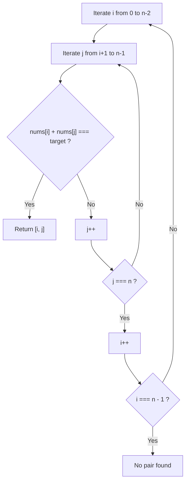
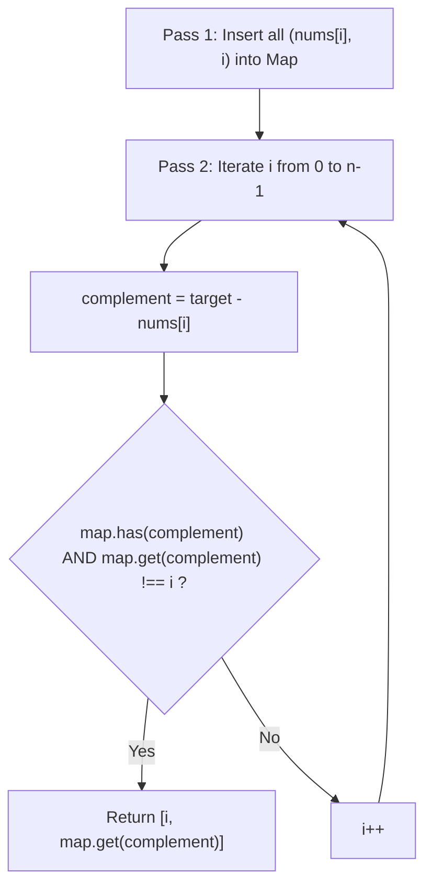
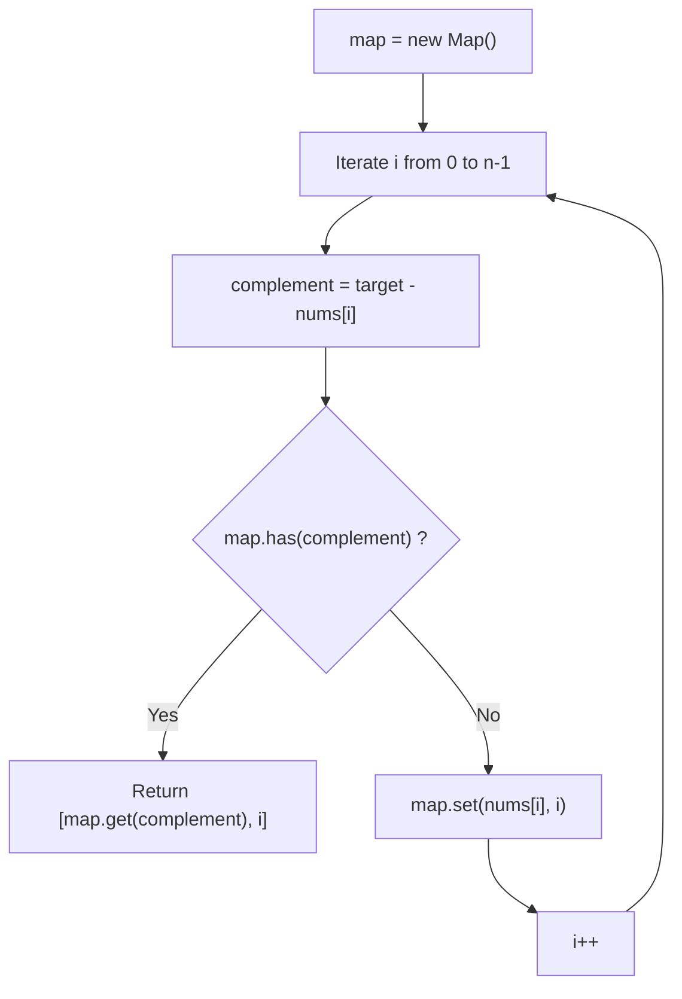
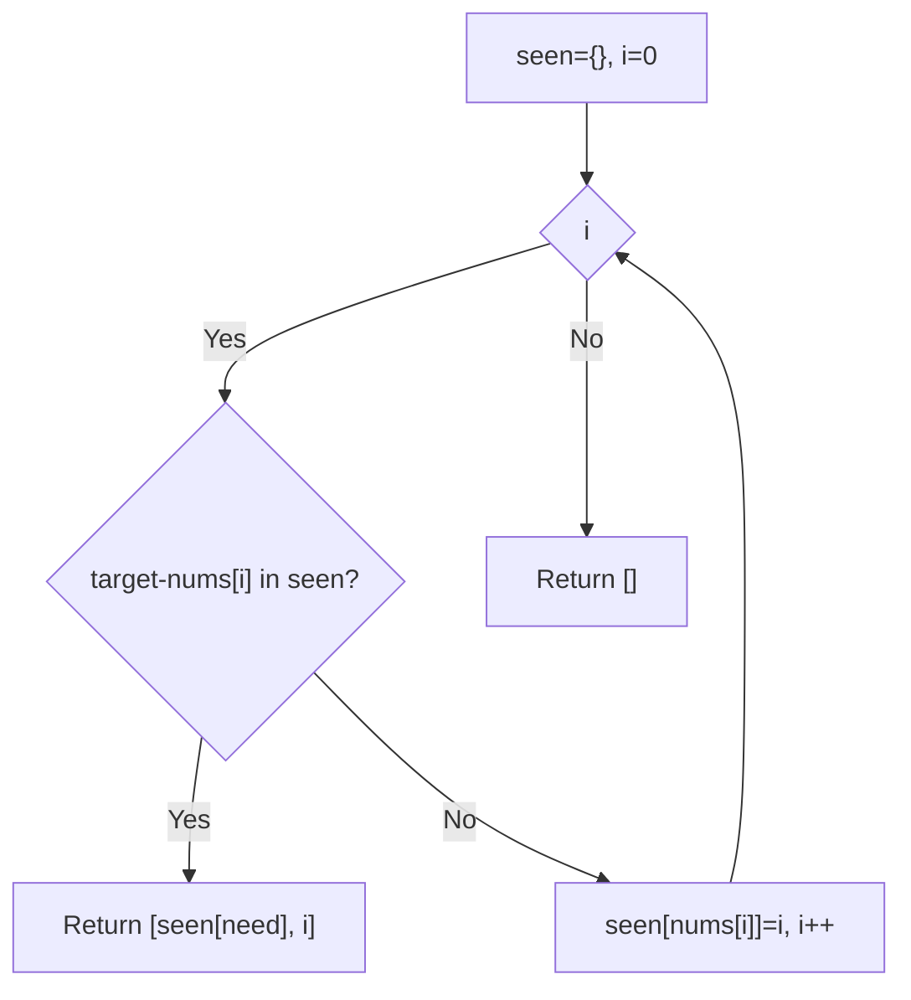
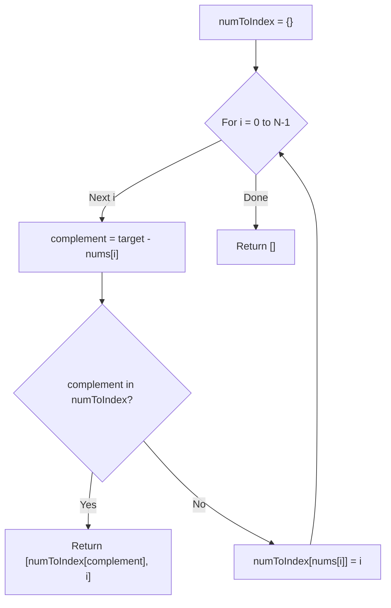

# 1. Two Sum

- **LeetCode Link**: `https://leetcode.com/problems/two-sum/`
- **Difficulty**: Easy
- **Pattern Category**: Hash Table / Complement Lookup / Single Pass
- **Prerequisite Primer**: `00-foundations/01-js-interview-runtime-quirks.md`

---

## 1. Problem Overview & Edge Case Matrix

### Problem Statement
Given an array of integers `nums` and an integer `target`, return **indices of the two numbers** such that they add up to `target`.

You may assume that each input would have **exactly one solution**, and you may not use the same element twice. You can return the answer in any order.

```
Mathematical Relation:
nums[i] + nums[j] = target
<=> complement = target - nums[i]

Example 1:
nums = [2, 7, 11, 15], target = 9
At index 0: val = 2, complement = 9 - 2 = 7 (not seen yet)
At index 1: val = 7, complement = 9 - 7 = 2 (seen at index 0!)
Match found: [0, 1]
```

### Upfront Edge Case Matrix

| Edge Case Scenario | Inputs | Expected Output | Pitfall / Failure Mode |
| :--- | :--- | :--- | :--- |
| Duplicate Elements Sum to Target | `nums = [3, 3]`, `target = 6` | `[0, 1]` | Overwriting key in hash map before checking complement |
| Target is Zero | `nums = [-3, 4, 3, 90]`, `target = 0` | `[0, 2]` | JavaScript falsy `0` handling bug (`if (map.get(0))`) |
| Negative Numbers and Target | `nums = [-10, -5, 2]`, `target = -15` | `[0, 1]` | Sign arithmetic truncation |
| Minimal Array of 2 Elements | `nums = [1, 2]`, `target = 3` | `[0, 1]` | Off-by-one boundary checks |
| Large Dispersed Values | `nums = [10^9, -10^9]`, `target = 0` | `[0, 1]` | Bitwise integer overflow if using bitwise operators |

---

## 2. Level 1: Brute Force Approach (Exhaustive Nested Loops)

### Intuition & Visual Idea
Test every pair of distinct indices $(i, j)$ with $0 \le i < j < n$. For each pair, compute their sum. If $nums[i] + nums[j] === target$, return $[i, j]$.



### Pseudocode
```text
FUNCTION twoSumBruteForce(nums, target):
    n = nums.length
    FOR i FROM 0 TO n - 2:
        FOR j FROM i + 1 TO n - 1:
            IF nums[i] + nums[j] == target:
                RETURN [i, j]
                
    RETURN []
```

### Step-by-Step Dry Run
`nums = [2, 7, 11, 15]`, `target = 9`

| `i` | `nums[i]` | `j` | `nums[j]` | `sum = nums[i] + nums[j]` | `sum === target`? | Action |
| :--- | :--- | :--- | :--- | :--- | :--- | :--- |
| 0 | 2 | 1 | 7 | $2 + 7 = 9$ | Yes ($9 == 9$) | Return `[0, 1]` |

### Modern JavaScript Implementation
```javascript
/**
 * Level 1: Brute Force Nested Loops
 * Time Complexity:  O(N^2)
 * Space Complexity: O(1)
 */
function twoSumBruteForce(nums, target) {
  const n = nums.length;

  for (let i = 0; i < n - 1; i++) {
    for (let j = i + 1; j < n; j++) {
      if (nums[i] + nums[j] === target) {
        return [i, j];
      }
    }
  }

  return [];
}
```

### Complexity Breakdown
- **Time Complexity**: $O(N^2)$ — $\frac{N(N-1)}{2}$ comparisons in worst case.
- **Space Complexity**: $O(1)$ — No auxiliary memory used.

#### 🎙️ How to Explain to Interviewer
> *"The baseline approach examines every unique pair of elements via two nested loops. While it requires $O(1)$ memory, checking all $O(N^2)$ pairs is unacceptable for large inputs ($N > 10^4$)."*

---

## 3. Level 2: Optimized Approach (Two-Pass Hash Map)

### Intuition & Visual Bottleneck Elimination
Instead of repeatedly scanning for an element's partner, we can achieve $O(1)$ lookups using a Hash Map:
1. **Pass 1**: Insert each number and its index into a `Map<number, number>`.
2. **Pass 2**: For each number at index $i$, calculate `complement = target - nums[i]`. If `complement` exists in the map and is located at a different index $j \neq i$, we have found the solution.



### Pseudocode
```text
FUNCTION twoSumTwoPass(nums, target):
    map = NEW MAP()
    FOR i FROM 0 TO nums.length - 1:
        map.SET(nums[i], i)
        
    FOR i FROM 0 TO nums.length - 1:
        complement = target - nums[i]
        IF map.HAS(complement) AND map.GET(complement) != i:
            RETURN [i, map.GET(complement)]
            
    RETURN []
```

### Step-by-Step Dry Run
`nums = [3, 2, 4]`, `target = 6`

| Pass | `i` | Value | Action | Map State |
| :--- | :--- | :--- | :--- | :--- |
| Pass 1 | 0, 1, 2 | 3, 2, 4 | Insert all | `{3: 0, 2: 1, 4: 2}` |
| Pass 2 | 0 | 3 | `comp = 6 - 3 = 3`, `map.get(3) = 0 === i` | Skip (same element) |
| Pass 2 | 1 | 2 | `comp = 6 - 2 = 4`, `map.get(4) = 2 !== 1` | Match! Return `[1, 2]` |

### Modern JavaScript Implementation
```javascript
/**
 * Level 2: Two-Pass Hash Map
 * Time Complexity:  O(N)
 * Space Complexity: O(N) auxiliary space
 */
function twoSumTwoPass(nums, target) {
  const map = new Map();

  // Pass 1: Build lookup table
  for (let i = 0; i < nums.length; i++) {
    map.set(nums[i], i);
  }

  // Pass 2: Search for complement
  for (let i = 0; i < nums.length; i++) {
    const complement = target - nums[i];
    const matchIdx = map.get(complement);

    // Ensure we do not pair an element with itself
    if (matchIdx !== undefined && matchIdx !== i) {
      return [i, matchIdx];
    }
  }

  return [];
}
```

### Complexity Breakdown
- **Time Complexity**: $O(N)$ — Two sequential linear passes.
- **Space Complexity**: $O(N)$ — Storing $N$ elements in the map.

#### 🎙️ How to Explain to Interviewer
> *"Trading memory for speed, we index values into a Hash Map in Pass 1. In Pass 2, we query for each value's complement in $O(1)$ time. We must explicitly check that `matchIdx !== i` to ensure an element is not paired with itself."*

---

## 4. Level 3: Most Optimal / Canonical Approach (Single-Pass Hash Map with Complement Interception)

### Intuition & Mathematical Proof
We can collapse the two passes into a **single pass**.
As we traverse `nums`, for each element `nums[i]`, we calculate `complement = target - nums[i]`:
- **If `complement` is already in the map**, we immediately return `[map.get(complement), i]`!
- **Otherwise**, we insert the current element: `map.set(nums[i], i)`.

**Proof of Correctness**:
Let the unique target pair be at indices $i$ and $j$ where $i < j$.
When the loop visits index $i$, $nums[j]$ has not yet been seen, so $nums[i]$ is simply added to the map.
When the loop subsequently arrives at index $j$, its complement is $target - nums[j] = nums[i]$. Because $i < j$, $nums[i]$ is already waiting in the map!
Thus, the pair is guaranteed to be intercepted at the second element, completely avoiding self-pairing bugs and eliminating the need for a second pass.

```
Target: 9
Array:  [ 2 ,  7 ,  11 ,  15 ]
Index:    0    1    2     3

i = 0: val = 2, complement = 7. 7 not in map. Store: { 2: 0 }
i = 1: val = 7, complement = 2. 2 IS in map! Match: [0, 1]
```



### Pseudocode
```text
FUNCTION twoSum(nums, target):
    seen = NEW MAP()
    
    FOR i FROM 0 TO nums.length - 1:
        complement = target - nums[i]
        
        IF seen.HAS(complement):
            RETURN [seen.GET(complement), i]
            
        seen.SET(nums[i], i)
        
    RETURN []
```

### Step-by-Step Dry Run
`nums = [3, 3]`, `target = 6`

| `i` | `nums[i]` | `complement = 6 - nums[i]` | In `seen`? | Action | `seen` State After |
| :--- | :--- | :--- | :--- | :--- | :--- |
| 0 | 3 | $6 - 3 = 3$ | No | Store `3 -> 0` | `{3: 0}` |
| 1 | 3 | $6 - 3 = 3$ | **Yes!** (at index 0) | Return `[0, 1]` | Done! |

### Modern JavaScript Implementation
```javascript
/**
 * Level 3: Canonical Single-Pass Hash Map
 * Time Complexity:  O(N) - Single pass, average O(1) lookup
 * Space Complexity: O(N) - Holds at most N entries in Map
 */
function twoSum(nums, target) {
  const seen = new Map();
  const n = nums.length;

  for (let i = 0; i < n; i++) {
    const num = nums[i];
    const complement = target - num;

    // Check if the required complement was previously stored
    if (seen.has(complement)) {
      return [seen.get(complement), i];
    }

    // Store current number and its index
    seen.set(num, i);
  }

  return [];
}
```

### Complexity Breakdown
- **Time Complexity**: $O(N)$ — Visits each array element at most once; Map lookups and insertions take $O(1)$ average time.
- **Space Complexity**: $O(N)$ — Stores at most $N$ elements in the `Map`.

#### 🎙️ How to Explain to Interviewer
> *"By checking for the complement before storing the current element, we solve the problem in a single linear pass. This handles duplicate elements like `[3, 3]` effortlessly without key overwrite issues, guarantees an element is never matched with itself, and terminates the moment the solution pair is encountered."*

---

## 5. JavaScript-Specific Gotchas & V8 Optimizations
- **The Falsy `0` Index Trap**: If you write `if (seen[complement])` using a plain JS object, when the complement is at index `0`, `seen[complement]` evaluates to `0` (which is falsy!). The check fails! Always use `seen.has(complement)` or `matchIdx !== undefined`.
- **`Map` vs Plain Object `{}`**: In JavaScript, `{ [num]: i }` coerces numeric keys into strings (e.g. `2` becomes `"2"`). For large arrays, string allocations trigger V8 GC cycles. JavaScript `Map` preserves numeric keys directly, optimizing lookups.

---

## 6. Real-World MAANG Interview Follow-Ups & Extensions

### Follow-Up 1: Two Sum with Streaming Data Structure (Design)
- **Scenario**: Design a data structure that supports `add(number)` and `find(value)`.
- **Solution Strategy**: Maintain a frequency Map. In `find(target)`, iterate unique keys $k$. Complement is $target - k$. If $k === comp$, check if count $\ge 2$.
- **JS Code**:
```javascript
class TwoSum {
  constructor() {
    this.freq = new Map();
  }

  add(number) {
    this.freq.set(number, (this.freq.get(number) || 0) + 1);
  }

  find(value) {
    for (const [num, count] of this.freq.entries()) {
      const complement = value - num;
      if (complement === num) {
        if (count >= 2) return true;
      } else if (this.freq.has(complement)) {
        return true;
      }
    }
    return false;
  }
}
```

### Follow-Up 2: Return All Unique Pairs Summing to Target
- **Scenario**: Return all distinct pairs of numbers `[a, b]` that sum to target, without duplicate index pairs or duplicate value combinations.
- **Solution Strategy**: Sort the array and use Two Pointers, skipping identical adjacent values to avoid duplicate pairs in $O(1)$ space.
- **JS Code**:
```javascript
function twoSumAllUniquePairs(nums, target) {
  nums.sort((a, b) => a - b);
  const result = [];
  let left = 0;
  let right = nums.length - 1;

  while (left < right) {
    const sum = nums[left] + nums[right];
    if (sum === target) {
      result.push([nums[left], nums[right]]);
      while (left < right && nums[left] === nums[left + 1]) left++;
      while (left < right && nums[right] === nums[right - 1]) right--;
      left++;
      right--;
    } else if (sum < target) {
      left++;
    } else {
      right--;
    }
  }

  return result;
}
```

---

## 7. What LeetCode Discuss Says (Language-Independent)

Source: top-voted post by Rahul Varma —
`https://leetcode.com/problems/two-sum/solutions/3619262/3-methods-c-java-python-beginner-friendl-x595/`
— 12.1K votes / 2.4M views / 291 comments.
Language-independent summary. No new JS here.

### A. Post's three methods

Method 1 — brute force pairs.
Method 2 — two-pass hash table.
Method 3 — one-pass hash table.

```text
FUNCTION twoSumBrute(nums, target):
    FOR i FROM 0 TO n - 1:
        FOR j FROM i + 1 TO n - 1:
            IF nums[i] + nums[j] == target:
                RETURN [i, j]
```

- Time: O(n squared)
- Space: O(1)

### B. Post's pick: one-pass hash

Read each value once. Ask the map
for its complement first, store the
value after. Complement found means
the pair spans past and present.

```text
FUNCTION twoSumOptimal(nums, target):
    seen = EMPTY MAP
    FOR i FROM 0 TO n - 1:
        need = target - nums[i]
        IF need IN seen:
            RETURN [seen[need], i]
        seen[nums[i]] = i
```

- Time: O(n)
- Space: O(n)



### C. Dry run on LeetCode Example 1

`nums = [2, 7, 11, 15]`, `target = 9`

| i | nums[i] | need | seen | Action |
| :--- | :--- | :--- | :--- | :--- |
| 0 | 2 | 7 | {} | Store {2:0} |
| 1 | 7 | 2 | {2:0} | Hit → [0,1] |

### D. Why one-pass wins

- Complement check before store
  stops same-element pairing.
- Exactly one solution exists,
  so first hit returns.
- Two-pass builds the map first;
  one-pass merges both loops.

### E. Pitfalls from comments

- Author's beginner list is the
  top thread (3.8K) — useful
  study order, not errata.
- Nested loops feel wrong after
  learning maps (90) — trust it.
- Store AFTER checking, never
  before (self-pair bug).
- Duplicate values fine: first
  index stays until matched.

### F. Companies

- Discuss post itself names none.
- External source:
  `https://github.com/liquidslr/leetcode-company-wise-problems`
  (LeetCode company tags, updated June 2025).
- All-time (115): Accenture,
  Accolite, Adobe, Airbnb,
  Airbus SE, Akamai, Altimetrik,
  Amazon, AMD, American Express,
  Anduril, Apple, Atlassian,
  Autodesk, Barclays, BlackRock,
  Bloomberg, ByteDance, Capgemini,
  Capital One, ciena, Cisco,
  Citadel, Citigroup, Cognizant,
  Comcast, Criteo, Databricks,
  DE Shaw, Delhivery, Dell,
  Deloitte, Deutsche Bank, DevRev,
  Devsinc, DoorDash, Dropbox, eBay,
  EPAM Systems, Epic Systems,
  Expedia, EY, Flipkart, Garmin,
  Goldman Sachs, Google, Grab,
  HashedIn, HCL, Honeywell, Huawei,
  Hubspot, IBM, Infosys, Intel,
  Intuit, Jane Street, jio, Juspay,
  KLA, LinkedIn, Lowe's, Mastercard,
  Meta, Microsoft, Microstrategy,
  MindTree, MongoDB, Morgan Stanley,
  NetApp, Nvidia, Optum, Oracle,
  Ozon, Palo Alto Networks, PayPal,
  persistent systems, PhonePe,
  Publicis Sapient, Pwc, Qualcomm,
  Roblox, Salesforce, Samsung, SAP,
  ServiceNow, Snowflake, Sony,
  Splunk, Spotify, Synopsys, TCS,
  Tech Mahindra, Tekion, Tesla,
  ThoughtWorks, Tiger Analytics,
  TikTok, Tinkoff, Toast, Turing,
  Uber, UKG, Virtusa, Visa, VK,
  Walmart Labs, Warnermedia,
  Western Digital, Wipro, Wix,
  Yahoo, Yandex, Yelp, Zoho.
- Recent: 30 days — Amazon,
  Bloomberg, Google, Infosys,
  Meta, Microsoft, Ola Cabs, TCS.
- Recent: 3 months — Altimetrik,
  Amazon, Apple, Bloomberg,
  Capgemini, Cognizant, Google,
  Infosys, Meta, Microsoft,
  Microstrategy, MongoDB, TCS.

---

## 7. What LeetCode Discuss Says (Language-Independent)

Source: top-voted post by Rahul Varma —
`https://leetcode.com/problems/two-sum/solutions/3619262/3-methods-c-java-python-beginner-friendly/`
— 2.4M views / 12.1K votes / 291 comments.
Language-independent summary. No new JS here.

### A. Optimal way from Discuss (One-Pass Hash Table)

The brute force approach compares every pair of numbers ($O(N^2)$). The widely accepted optimal approach is to iterate through the array exactly once while building a Hash Map that stores `(number -> its index)`.
For each number, we calculate its `complement` (i.e., `target - current number`). If the `complement` is already in the Hash Map, we immediately have our pair!

```text
FUNCTION twoSum(nums, target):
    numToIndex = empty Hash Map
    
    FOR i = 0 TO length(nums) - 1:
        complement = target - nums[i]
        
        // If we've already seen the number we need, return the pair
        IF complement is in numToIndex:
            RETURN [numToIndex[complement], i]
            
        // Otherwise, store the current number and its index
        numToIndex[nums[i]] = i
        
    RETURN []
```

- Time: O(N) where N is the length of `nums`. We traverse the list exactly once, and Hash Map lookups are $O(1)$ on average.
- Space: O(N) to store up to N elements in the Hash Map.



### B. Dry run on LeetCode Example 1 (nums = [2, 7, 11, 15], target = 9)

| `i` | `nums[i]` | `complement` | `numToIndex` has `complement`? | Action |
| :--- | :--- | :--- | :--- | :--- |
| 0 | 2 | 9 - 2 = **7** | No. Map is `{}`. | Add `2:0`. Map becomes `{2:0}`. |
| 1 | 7 | 9 - 7 = **2** | **Yes!** Map has `2` at index `0`. | Return `[0, 1]`. |

The loop finishes on the second element. The result `[0, 1]` is perfectly correct.

### C. Pitfalls from comments

- **Two-Pass vs One-Pass:** A very common, slightly slower valid solution is building the Hash Map entirely first (Pass 1), and then iterating again to find the complement (Pass 2). You have to be careful in Pass 2 to ensure `numToIndex[complement] != i` (so you don't reuse the same element). The **One-Pass** approach strictly avoids this because we check the map *before* adding the current element, completely eliminating self-referential pair collisions.
- **Sorting and Two Pointers:** If you sort the array, you can use two pointers (left at 0, right at end) to find the target in $O(N \log N)$ time and $O(1)$ space. However, because the problem asks for the *original indices*, sorting destroys the original indices. You'd have to store pairs `(value, original_index)` before sorting, which requires $O(N)$ space anyway, defeating the purpose of the $O(1)$ space benefit of sorting. The Hash Map is unequivocally the best approach.

### D. Companies

- Discuss post itself names none.
  Companies tab on LeetCode is premium-locked.
- External source:
  `https://github.com/liquidslr/leetcode-company-wise-problems`
  (LeetCode company tags, updated June 2025).
- All-time (103): Accenture, Accolite, Adobe, Airbnb, Airbus SE, Akamai, Altimetrik, Amazon, AMD, American Express, Anduril, Apple, Atlassian, Autodesk, Barclays, BlackRock, Bloomberg, ByteDance, Capgemini, Capital One, ciena, Cisco, Citadel, Citigroup, Cognizant, Comcast, Criteo, Databricks, DE Shaw, Delhivery, Dell, Deloitte, Deutsche Bank, DevRev, Devsinc, DoorDash, Dropbox, eBay, EPAM Systems, Epic Systems, Expedia, EY, Flipkart, Garmin, Goldman Sachs, Google, Grab, HashedIn, HCL, Honeywell, Huawei, Hubspot, IBM, Infosys, Intel, Intuit, Jane Street, Jio, Juspay, KLA, LinkedIn, Lowe's, Mastercard, Meta, Microsoft, Microstrategy, MindTree, MongoDB, Morgan Stanley, NetApp, Nvidia, Optum, Oracle, Ozon, Palo Alto Networks, PayPal, Persistent Systems, PhonePe, Publicis Sapient, Pwc, Qualcomm, Roblox, Salesforce, Samsung, SAP, ServiceNow, Snowflake, Sony, Splunk, Spotify, Synopsys, TCS, Tech Mahindra, Tekion, Tesla, ThoughtWorks, Tiger Analytics, TikTok, Tinkoff, Toast, Turing, Uber, UKG, Virtusa, Visa, VK, Walmart Labs, Warnermedia, Western Digital, Wipro, Wix, Yahoo, Yandex, Yelp, Zoho.
- Recent: 30 days — Amazon, Bloomberg, Google, Infosys, Meta, Microsoft, Ola Cabs, TCS.
- Recent: 3 months — Altimetrik, Amazon, Apple, Bloomberg, Capgemini, Cognizant, Google, Infosys, Meta, Microsoft, Microstrategy, MongoDB, TCS.
