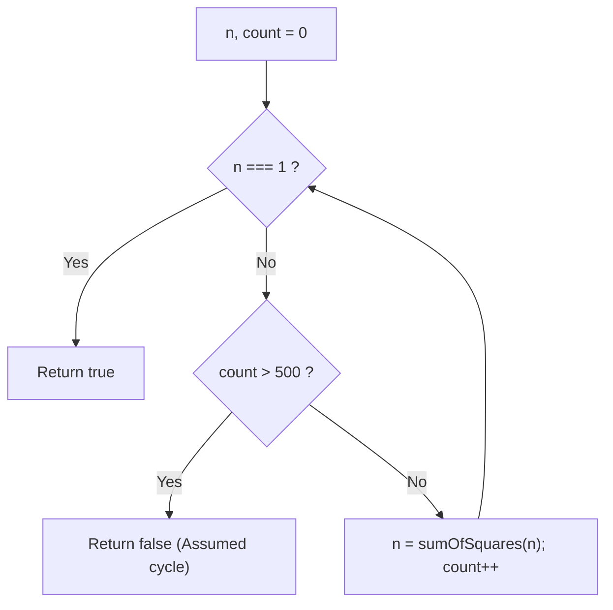
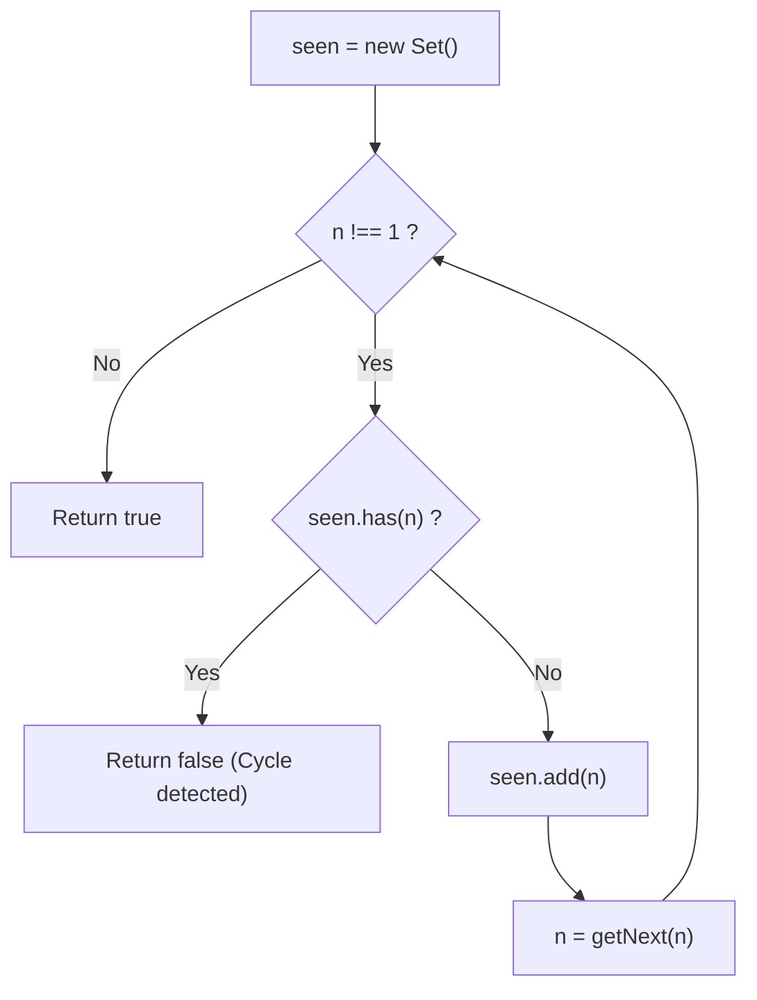
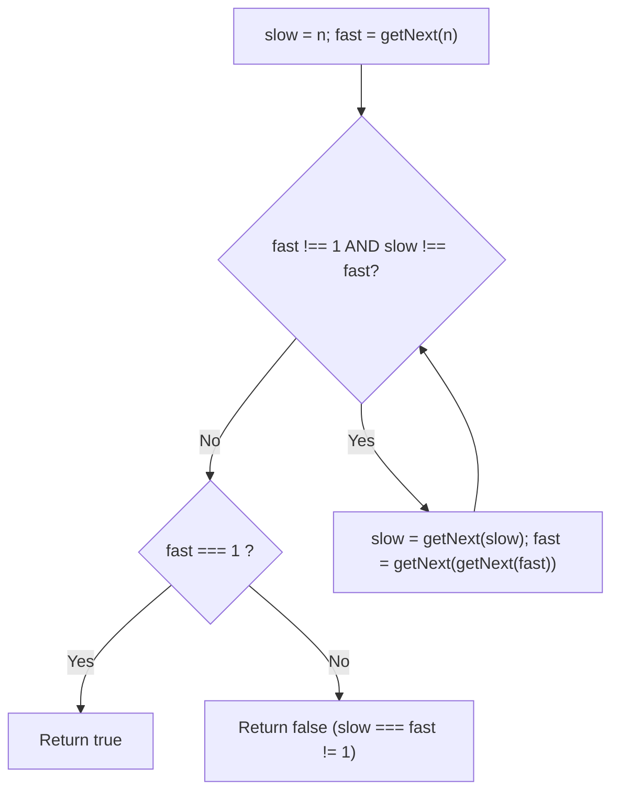

# 202. Happy Number

- **LeetCode Link**: `https://leetcode.com/problems/happy-number/`
- **Difficulty**: Easy
- **Pattern Category**: Hash Table / Cycle Detection / Floyd's Tortoise and Hare
- **Prerequisite Primer**: `00-foundations/01-js-interview-runtime-quirks.md`

---

## 1. Problem Overview & Edge Case Matrix

### Problem Statement
Write an algorithm to determine if a number `n` is **happy**.

A **happy number** is a number defined by the following process:
- Starting with any positive integer, replace the number by the sum of the squares of its digits.
- Repeat the process until the number equals `1` (where it will stay), or it **loops endlessly in a cycle** which does not include `1`.
- Those numbers for which this process ends in `1` are happy.

Return `true` if `n` is a happy number, and `false` if not.

```
Example 1: n = 19
1^2 + 9^2 = 1 + 81 = 82
8^2 + 2^2 = 64 + 4 = 68
6^2 + 8^2 = 36 + 64 = 100
1^2 + 0^2 + 0^2 = 1 + 0 + 0 = 1 (Happy! -> Return true)

Example 2: n = 2
2 -> 4 -> 16 -> 37 -> 58 -> 89 -> 145 -> 42 -> 20 -> 4 (Trapped in cycle! -> Return false)
```

### Upfront Edge Case Matrix

| Edge Case Scenario | Inputs | Expected Output | Pitfall / Failure Mode |
| :--- | :--- | :--- | :--- |
| Immediate Happy ($n = 1$) | `n = 1` | `true` | Loop terminating before checking `1` |
| Smallest Known Unhappy ($n = 2$) | `n = 2` | `false` | Infinite loop without cycle detection |
| Single Digit Happy ($n = 7$) | `n = 7` | `true` | Mistaking intermediate single digits for cycles |
| Power of 10 ($n = 100$) | `n = 100` | `true` | Zero-digit square handling |
| Maximum 32-bit Integer | `n = 2147483647` | `false` | Arithmetic overflow during digit squaring |

---

## 2. Level 1: Brute Force Approach (Arbitrary Iteration Limit / Recursion Depth)

### Intuition & Visual Idea
Simulate the process of replacing $n$ with the sum of its squared digits. If the value becomes 1, return `true`. To avoid an infinite loop on cyclic numbers, set an arbitrary iteration cap (e.g., 500 steps). If 1 is not reached within 500 iterations, assume the number is trapped in a cycle and return `false`.



### Pseudocode
```text
FUNCTION isHappyBruteForce(n):
    count = 0
    WHILE n != 1 AND count < 500:
        n = GET_SUM_OF_SQUARES(n)
        count++
    RETURN n == 1
```

### Step-by-Step Dry Run
`n = 19`, `count = 0`

| Iteration | Current `n` | Digit Squares | Sum of Squares | `n === 1`? |
| :--- | :--- | :--- | :--- | :--- |
| 0 | 19 | $1^2 + 9^2 = 1 + 81$ | 82 | No |
| 1 | 82 | $8^2 + 2^2 = 64 + 4$ | 68 | No |
| 2 | 68 | $6^2 + 8^2 = 36 + 64$ | 100 | No |
| 3 | 100 | $1^2 + 0^2 + 0^2 = 1$ | 1 | **Yes $\to$ Return `true`** |

### Modern JavaScript Implementation
```javascript
/**
 * Level 1: Brute Force with Step Counter Limit
 * Time Complexity:  O(K * log N) where K is constant step bound
 * Space Complexity: O(1)
 */
function isHappyBruteForce(n) {
  function getNext(num) {
    let sum = 0;
    while (num > 0) {
      const digit = num % 10;
      sum += digit * digit;
      num = Math.trunc(num / 10);
    }
    return sum;
  }

  let count = 0;
  while (n !== 1 && count < 500) {
    n = getNext(n);
    count++;
  }

  return n === 1;
}
```

### Complexity Breakdown
- **Time Complexity**: $O(K \log N)$ — Where $K \le 500$ is the arbitrary step threshold.
- **Space Complexity**: $O(1)$ — Only a loop counter scalar.

#### 🎙️ How to Explain to Interviewer
> *"The naive approach replaces $n$ repeatedly and relies on a hardcoded step cap (like 500) to terminate cycles. While it works practically on LeetCode tests, it lacks mathematical rigor because an arbitrary step limit cannot guarantee correctness for unbounded inputs."*

---

## 3. Level 2: Optimized Approach (Hash Set Cycle Detection)

### Intuition & Visual Bottleneck Elimination
Instead of an arbitrary iteration limit, detect cycles deterministically using a `Set<number>`.
At each step:
1. If $n = 1$, return `true`.
2. If `seen.has(n)`, we have encountered a repeating value $\implies$ the sequence has entered an infinite cycle $\implies$ return `false`.
3. Otherwise, insert $n$ into `seen` and compute the next value.



### Pseudocode
```text
FUNCTION isHappySet(n):
    seen = NEW SET()
    
    WHILE n != 1:
        IF seen.HAS(n):
            RETURN false
        seen.ADD(n)
        n = GET_NEXT(n)
        
    RETURN true
```

### Step-by-Step Dry Run
`n = 2`

| Step | `n` | `seen.has(n)`? | `seen` Set After | Next Value |
| :--- | :--- | :--- | :--- | :--- |
| 1 | 2 | No | `{2}` | $2^2 = 4$ |
| 2 | 4 | No | `{2, 4}` | $4^2 = 16$ |
| 3 | 16 | No | `{2, 4, 16}` | $1^2 + 6^2 = 37$ |
| ... | ... | ... | ... | ... |
| 9 | 20 | No | `{..., 20}` | $2^2 + 0^2 = 4$ |
| 10 | 4 | **Yes! (4 already in set)** | - | **Cycle detected $\to$ Return `false`** |

### Modern JavaScript Implementation
```javascript
/**
 * Level 2: Hash Set Cycle Detection
 * Time Complexity:  O(log N)
 * Space Complexity: O(log N) for visited numbers in set
 */
function isHappySet(n) {
  const seen = new Set();

  function getNext(num) {
    let sum = 0;
    while (num > 0) {
      const digit = num % 10;
      sum += digit * digit;
      num = Math.trunc(num / 10);
    }
    return sum;
  }

  while (n !== 1) {
    if (seen.has(n)) {
      return false; // Cycle detected
    }
    seen.add(n);
    n = getNext(n);
  }

  return true;
}
```

### Complexity Breakdown
- **Time Complexity**: $O(\log N)$ — For numbers $\ge 1000$, $\sum \text{digits}^2 < n$, quickly shrinking below 243. Numbers below 243 either reach 1 or cycle within at most 8 steps.
- **Space Complexity**: $O(\log N)$ — Stores visited states in the `Set`.

#### 🎙️ How to Explain to Interviewer
> *"By treating the digit square sum as a state transition function, numbers either converge to 1 or enter a closed finite cycle. Storing visited values in a Hash Set detects repeat occurrences in $O(1)$ time, guaranteeing deterministic termination."*

---

## 4. Level 3: Most Optimal / Canonical Approach (Floyd's Tortoise & Hare Cycle Detection)

### Intuition & Mathematical Proof
We can view the sequence of numbers as an **implicit singly linked list**, where each number $x$ points to its successor $f(x) = \text{getNext}(x)$.
- Detecting whether a linked list contains a cycle can be done with **Floyd's Cycle-Finding Algorithm (Tortoise and Hare)**!
- `slow` advances 1 step at a time: `slow = getNext(slow)`
- `fast` advances 2 steps at a time: `fast = getNext(getNext(fast))`

If `fast` reaches `1`, then $n$ is a happy number!
If `slow === fast` (and neither is `1`), they have collided inside an infinite cycle $\implies$ not a happy number!

This eliminates the `Set` completely, achieving **$O(1)$ auxiliary space**.

```
Cycle Visualization for Unhappy Numbers (Base 10):
4 -> 16 -> 37 -> 58 -> 89 -> 145 -> 42 -> 20 -> 4
^                                               |
+-----------------------------------------------+
```



### Pseudocode
```text
FUNCTION isHappy(n):
    slow = n
    fast = GET_NEXT(n)
    
    WHILE fast != 1 AND slow != fast:
        slow = GET_NEXT(slow)
        fast = GET_NEXT(GET_NEXT(fast))
        
    RETURN fast == 1
```

### Step-by-Step Dry Run
`n = 19`:

| Iteration | `slow` (1 Step) | `fast` (2 Steps) | `fast === 1`? | `slow === fast`? |
| :--- | :--- | :--- | :--- | :--- |
| Start | 19 | `getNext(19) = 82` | No | No |
| 1 | `getNext(19) = 82` | `getNext(82) -> 68 -> getNext(68) = 100` | No | No |
| 2 | `getNext(82) = 68` | `getNext(100) -> 1 -> getNext(1) = 1` | **Yes!** | - |
| Result | Loop ends | `fast === 1` | **Return `true`** | - |

### Modern JavaScript Implementation
```javascript
/**
 * Level 3: Canonical Floyd's Tortoise and Hare Cycle Detection
 * Time Complexity:  O(log N)
 * Space Complexity: O(1) Auxiliary Space
 */
function isHappy(n) {
  function getNext(num) {
    let sum = 0;
    while (num > 0) {
      const digit = num % 10;
      sum += digit * digit;
      num = Math.trunc(num / 10);
    }
    return sum;
  }

  let slow = n;
  let fast = getNext(n);

  // Advance slow by 1 step, fast by 2 steps until collision or reaching 1
  while (fast !== 1 && slow !== fast) {
    slow = getNext(slow);
    fast = getNext(getNext(fast));
  }

  return fast === 1;
}
```

### Complexity Breakdown
- **Time Complexity**: $O(\log N)$ — Finding next number takes $O(\log N)$ arithmetic operations. The chain length before collision or reaching 1 is bounded by a small constant ($< 50$).
- **Space Complexity**: $O(1)$ auxiliary space — Exactly two pointer variables (`slow`, `fast`). Zero heap memory.

#### 🎙️ How to Explain to Interviewer
> *"Because the succession of digit square sums acts as a deterministic directed graph where each node has out-degree 1, any path must eventually terminate at 1 or enter a closed loop. We apply Floyd's Cycle Detection algorithm using two pointers: slow advances one step and fast advances two steps. If fast reaches 1, the number is happy; if fast collides with slow, we have identified a cycle in $O(1)$ memory without hashing."*

---

## 5. JavaScript-Specific Gotchas & V8 Optimizations
- **Arithmetic Digit Extraction vs String Conversion**: Writing `String(n).split('').reduce((acc, d) => acc + d * d, 0)` is visually succinct, but allocates new strings, arrays, and closures in every iteration! `num % 10` paired with `Math.trunc(num / 10)` keeps operations strictly in hardware registers.
- **Lookup Table for Squares**: In high-throughput numerical tasks, a static table `const SQUARES = [0, 1, 4, 9, 16, 25, 36, 49, 64, 81]` avoids the multiplication instruction entirely: `sum += SQUARES[num % 10]`.

---

## 6. Real-World MAANG Interview Follow-Ups & Extensions

### Follow-Up 1: Constant Time Mathematical Shortcut (`n === 4`)
- **Scenario**: In base 10, it is mathematically proven that **4** is the only cycle that exists. Any unhappy number must pass through the number 4! Can we simplify the cycle check?
- **Solution Strategy**: Replace Floyd's algorithm with a single pointer: `while (n !== 1 && n !== 4) n = getNext(n); return n === 1;`.
- **JS Code**:
```javascript
function isHappyDirect(n) {
  const SQUARES = [0, 1, 4, 9, 16, 25, 36, 49, 64, 81];

  while (n !== 1 && n !== 4) {
    let sum = 0;
    while (n > 0) {
      sum += SQUARES[n % 10];
      n = Math.trunc(n / 10);
    }
    n = sum;
  }

  return n === 1;
}
```

### Follow-Up 2: Count Happy Numbers in Range $[1, N]$ with Bitset Cache
- **Scenario**: Count how many numbers in $[1, N]$ are happy, where $N = 10^7$.
- **Solution Strategy**: Precompute happy status for numbers $\le 243$ into a `Uint8Array`. For any $x \in [1, N]$, calculate its immediate digit square sum and look up its status in $O(1)$ time!
- **JS Code**:
```javascript
function countHappyNumbers(N) {
  // Precompute happy status up to maximum digit square sum for 7 digits: 7 * 81 = 567
  const isHappyLookup = new Uint8Array(568);
  for (let i = 1; i <= 567; i++) {
    isHappyLookup[i] = isHappyDirect(i) ? 1 : 0;
  }

  let count = 0;
  for (let i = 1; i <= N; i++) {
    let num = i;
    let sum = 0;
    while (num > 0) {
      const d = num % 10;
      sum += d * d;
      num = Math.trunc(num / 10);
    }
    if (isHappyLookup[sum] === 1) count++;
  }

  return count;
}
```
