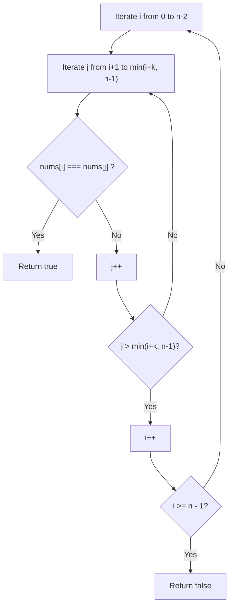
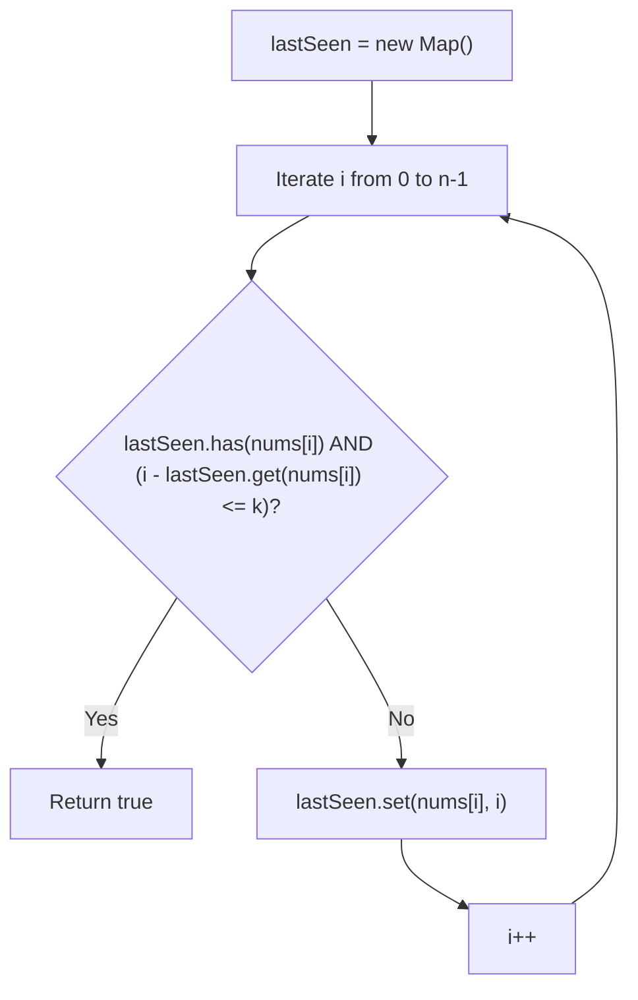
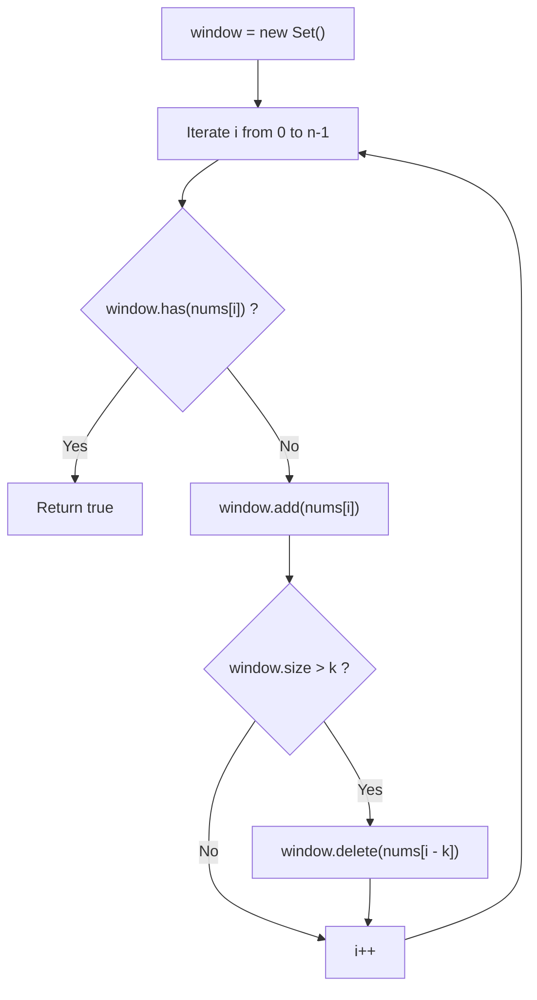
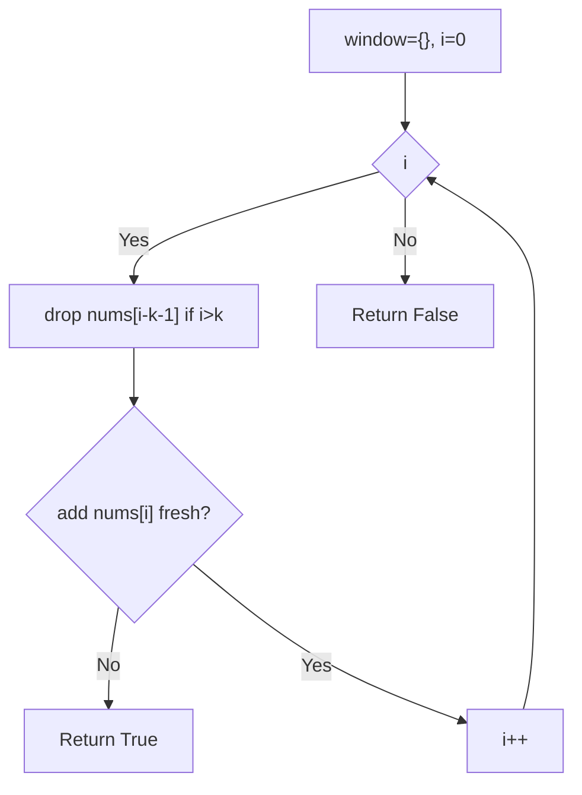
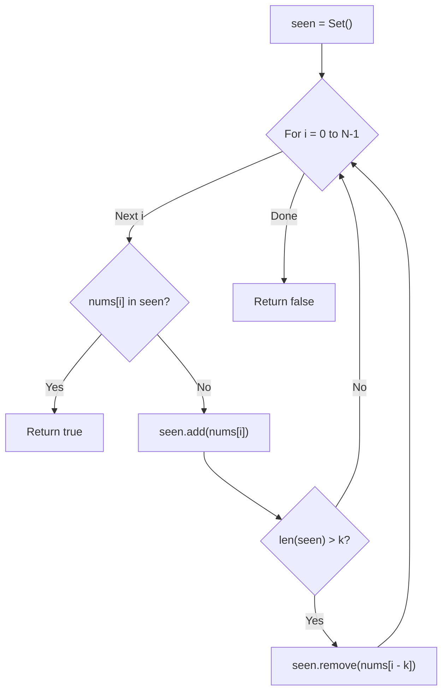

# 219. Contains Duplicate II

- **LeetCode Link**: `https://leetcode.com/problems/contains-duplicate-ii/`
- **Difficulty**: Easy
- **Pattern Category**: Hash Table / Sliding Window / Proximity Index Check
- **Prerequisite Primer**: `00-foundations/01-js-interview-runtime-quirks.md`

---

## 1. Problem Overview & Edge Case Matrix

### Problem Statement
Given an integer array `nums` and an integer `k`, return `true` if there are two **distinct indices** `i` and `j` in the array such that:
$$nums[i] == nums[j] \quad \text{and} \quad |i - j| \le k$$

Return `false` otherwise.

```
Example 1:
nums = [1, 2, 3, 1], k = 3
Indices: 0 and 3
nums[0] == nums[3] == 1, |0 - 3| = 3 <= 3 -> Output: true

Example 2:
nums = [1, 0, 1, 1], k = 1
Indices: 2 and 3
nums[2] == nums[3] == 1, |2 - 3| = 1 <= 1 -> Output: true

Example 3:
nums = [1, 2, 3, 1, 2, 3], k = 2
Distance between 1s is 3 > 2
Distance between 2s is 3 > 2
Distance between 3s is 3 > 2 -> Output: false
```

### Upfront Edge Case Matrix

| Edge Case Scenario | Inputs | Expected Output | Pitfall / Failure Mode |
| :--- | :--- | :--- | :--- |
| Zero Distance Limit ($k = 0$) | `nums = [1, 1]`, `k = 0` | `false` | Matching identical index $i = j$ |
| Large Window ($k \ge n$) | `nums = [1, 2, 1]`, `k = 10` | `true` | Out-of-bounds window index calculation |
| Distant Duplicates ($|i - j| > k$) | `nums = [1, 2, 3, 1]`, `k = 2` | `false` | Flagging any duplicate regardless of distance |
| Multiple Duplicate Clusters | `nums = [1, 0, 1, 1]`, `k = 1` | `true` | Failing to update latest index for subsequent matches |
| Completely Unique Array | `nums = [1, 2, 3, 4]`, `k = 5` | `false` | False positive triggers |

---

## 2. Level 1: Brute Force Approach (Nested Window Linear Scan)

### Intuition & Visual Idea
For each index $i$, inspect elements at indices $j$ from $i + 1$ up to $\min(i + k, n - 1)$. If any $nums[j] === nums[i]$, a valid nearby duplicate is found immediately.



### Pseudocode
```text
FUNCTION containsNearbyDuplicateBruteForce(nums, k):
    IF k <= 0: RETURN false
    n = nums.length
    
    FOR i FROM 0 TO n - 2:
        maxJ = MIN(i + k, n - 1)
        FOR j FROM i + 1 TO maxJ:
            IF nums[i] == nums[j]:
                RETURN true
                
    RETURN false
```

### Step-by-Step Dry Run
`nums = [1, 2, 3, 1]`, `k = 3`

| `i` | `nums[i]` | `j` Range | Values Checked at `j` | Match Found? |
| :--- | :--- | :--- | :--- | :--- |
| 0 | 1 | `1..3` | `nums[1]=2`, `nums[2]=3`, `nums[3]=1` | **Yes ($nums[0] == nums[3]$) $\to$ `true`** |

### Modern JavaScript Implementation
```javascript
/**
 * Level 1: Brute Force Nested Scan within K-radius
 * Time Complexity:  O(N * min(N, k))
 * Space Complexity: O(1)
 */
function containsNearbyDuplicateBruteForce(nums, k) {
  if (k <= 0) return false;
  const n = nums.length;

  for (let i = 0; i < n - 1; i++) {
    const limit = Math.min(i + k, n - 1);
    for (let j = i + 1; j <= limit; j++) {
      if (nums[i] === nums[j]) {
        return true;
      }
    }
  }

  return false;
}
```

### Complexity Breakdown
- **Time Complexity**: $O(N \cdot \min(N, k))$ — Worst case when $k \approx N$ is $O(N^2)$.
- **Space Complexity**: $O(1)$ — No additional data structures allocated.

#### 🎙️ How to Explain to Interviewer
> *"The naive approach checks all elements within distance $k$ of each index. When $k$ is small, this runs quickly, but when $k$ approaches $N$, time complexity degrades to $O(N^2)$, exceeding time limits on large inputs."*

---

## 3. Level 2: Optimized Approach (Full Hash Map of Last-Seen Indices)

### Intuition & Visual Bottleneck Elimination
Instead of scanning forward, we can record the **most recent index** of each number in a Hash Map `lastSeen`:
As we iterate through `nums` at index $i$:
1. If `lastSeen.has(nums[i])`:
   - Compute distance: $\Delta = i - \text{lastSeen.get}(nums[i])$.
   - If $\Delta \le k$, return `true`.
2. Update the map with the current position: `lastSeen.set(nums[i], i)`.
   - *Why always update?* Because a later instance will be closest to the current index $i$, minimizing $\Delta$ for future checks!



### Pseudocode
```text
FUNCTION containsNearbyDuplicateMap(nums, k):
    IF k <= 0: RETURN false
    lastSeen = NEW MAP()
    
    FOR i FROM 0 TO nums.length - 1:
        num = nums[i]
        IF lastSeen.HAS(num) AND (i - lastSeen.GET(num) <= k):
            RETURN true
        lastSeen.SET(num, i)
        
    RETURN false
```

### Step-by-Step Dry Run
`nums = [1, 0, 1, 1]`, `k = 1`

| `i` | `nums[i]` | Prior Index in Map | $\Delta = i - \text{prev}$ | $\Delta \le 1$? | Action |
| :--- | :--- | :--- | :--- | :--- | :--- |
| 0 | 1 | None | - | - | Set `1 -> 0` |
| 1 | 0 | None | - | - | Set `0 -> 1` |
| 2 | 1 | 0 | $2 - 0 = 2$ | No ($2 > 1$) | Update `1 -> 2` |
| 3 | 1 | 2 | $3 - 2 = 1$ | **Yes ($1 \le 1$)** | **Return `true`** |

### Modern JavaScript Implementation
```javascript
/**
 * Level 2: Hash Map Tracking Last Observed Index
 * Time Complexity:  O(N)
 * Space Complexity: O(N) auxiliary space
 */
function containsNearbyDuplicateMap(nums, k) {
  if (k <= 0) return false;

  const lastSeen = new Map();
  const n = nums.length;

  for (let i = 0; i < n; i++) {
    const val = nums[i];

    if (lastSeen.has(val) && i - lastSeen.get(val) <= k) {
      return true;
    }

    lastSeen.set(val, i);
  }

  return false;
}
```

### Complexity Breakdown
- **Time Complexity**: $O(N)$ — Single pass over array with $O(1)$ average Map lookups.
- **Space Complexity**: $O(N)$ — In the worst case, stores all $N$ elements in the Map.

#### 🎙️ How to Explain to Interviewer
> *"By indexing each number's latest occurrence into a Hash Map, we check proximity in $O(1)$ time. Updating the map with the latest index guarantees that subsequent comparisons always measure against the closest predecessor. This reduces runtime to $O(N)$ with $O(N)$ memory."*

---

## 4. Level 3: Most Optimal / Canonical Approach (Sliding Window Hash Set of Size K)

### Intuition & Mathematical Proof
We do not actually need to remember all $N$ indices in memory!
We only need to know: **Is there any duplicate inside the current sliding window of length $k$?**

We maintain a `Set<number>` containing at most $k$ elements:
1. If `set.has(nums[i])`: A duplicate exists within the last $k$ elements $\implies$ return `true`!
2. Add `nums[i]` to `set`.
3. If `set.size > k`: Remove the element that has slid out of the window: `set.delete(nums[i - k])`.

This bounds auxiliary memory to **$O(\min(N, k))$** instead of $O(N)$. If $k = 5$ and $N = 10^7$, memory usage is $O(1)$ rather than gigabytes!

```
nums = [ 1 ,  2 ,  3 ,  1 ] , k = 3

Window 0..2:  Set = { 1, 2, 3 } (size 3)
Step i = 3:   nums[3] = 1. Is 1 in Set? YES! Return true!
```



### Pseudocode
```text
FUNCTION containsNearbyDuplicate(nums, k):
    IF k <= 0: RETURN false
    window = NEW SET()
    
    FOR i FROM 0 TO nums.length - 1:
        IF window.HAS(nums[i]):
            RETURN true
            
        window.ADD(nums[i])
        
        IF window.SIZE > k:
            window.DELETE(nums[i - k])
            
    RETURN false
```

### Step-by-Step Dry Run
`nums = [1, 2, 3, 1, 2, 3]`, `k = 2`

| `i` | `nums[i]` | In `window`? | Action | `window` After Step |
| :--- | :--- | :--- | :--- | :--- |
| 0 | 1 | No | Add 1 | `{1}` |
| 1 | 2 | No | Add 2 | `{1, 2}` |
| 2 | 3 | No | Add 3; size > 2 $\to$ delete `nums[0]=1` | `{2, 3}` |
| 3 | 1 | No | Add 1; size > 2 $\to$ delete `nums[1]=2` | `{3, 1}` |
| 4 | 2 | No | Add 2; size > 2 $\to$ delete `nums[2]=3` | `{1, 2}` |
| 5 | 3 | No | Add 3; size > 2 $\to$ delete `nums[3]=1` | `{2, 3}` |
| End | - | - | - | **Return `false`** |

### Modern JavaScript Implementation
```javascript
/**
 * Level 3: Canonical Sliding Window Hash Set
 * Time Complexity:  O(N)
 * Space Complexity: O(min(N, k)) auxiliary memory
 */
function containsNearbyDuplicate(nums, k) {
  // Pruning: Distinct indices require distance >= 1
  if (k <= 0) return false;

  const window = new Set();
  const n = nums.length;

  for (let i = 0; i < n; i++) {
    const val = nums[i];

    // If already in the active window of size k, condition is satisfied
    if (window.has(val)) {
      return true;
    }

    window.add(val);

    // Evict element that falls outside the trailing window boundary
    if (window.size > k) {
      window.delete(nums[i - k]);
    }
  }

  return false;
}
```

### Complexity Breakdown
- **Time Complexity**: $O(N)$ — Exactly $N$ iterations with $O(1)$ amortized `Set` insertion, lookup, and deletion.
- **Space Complexity**: $O(\min(N, k))$ — The `Set` never holds more than $k + 1$ elements simultaneously.

#### 🎙️ How to Explain to Interviewer
> *"Instead of recording all indices in an unbounded map, we recognize that duplicates are only valid within distance $k$. We maintain a sliding window of size $k$ using a JavaScript `Set`. For every element, we check membership in the active window, add it, and evict the element at index $i - k$ once the window exceeds $k$. This reduces memory consumption to strictly $O(\min(N, k))$."*

---

## 5. JavaScript-Specific Gotchas & V8 Optimizations
- **The $k = 0$ Shortcut**: Since distinct indices require $i \neq j$, the minimum possible distance is $|i - j| \ge 1$. If $k = 0$, `|i - j| <= 0` is mathematically impossible for distinct indices! An immediate `if (k <= 0) return false;` saves unnecessary set instantiation.
- **Set Eviction Performance**: Keeping the `Set` bounded to $k$ entries prevents V8 hash table bucket re-hashing expansions and ensures the working set fits into CPU L1/L2 caches when $k$ is small.

---

## 6. Real-World MAANG Interview Follow-Ups & Extensions

### Follow-Up 1: Contains Duplicate III (Value Difference $\le t$)
- **Scenario**: Return true if there are two distinct indices with $|i - j| \le k$ and $|nums[i] - nums[j]| \le t$.
- **Solution Strategy**: Standard hashing fails because values can differ by $t$. We use **Bucket Sort (Bucket Hashing)** with bucket size $w = t + 1$. Each bucket $B = \lfloor x / w \rfloor$ holds at most 1 number. We check bucket $B$, $B - 1$, and $B + 1$ within the sliding window of size $k$.
- **JS Code**:
```javascript
function containsNearbyAlmostDuplicate(nums, k, t) {
  if (k <= 0 || t < 0) return false;
  const buckets = new Map();
  const w = t + 1;

  function getBucketId(val) {
    return Math.floor(val / w);
  }

  for (let i = 0; i < nums.length; i++) {
    const val = nums[i];
    const bId = getBucketId(val);

    if (buckets.has(bId)) return true;
    if (buckets.has(bId - 1) && Math.abs(val - buckets.get(bId - 1)) <= t) return true;
    if (buckets.has(bId + 1) && Math.abs(val - buckets.get(bId + 1)) <= t) return true;

    buckets.set(bId, val);

    if (buckets.size > k) {
      buckets.delete(getBucketId(nums[i - k]));
    }
  }

  return false;
}
```

### Follow-Up 2: Sliding TTL Window Rate Limiter
- **Scenario**: Detect duplicate requests from the same user ID within a dynamic time window of $K$ milliseconds in a streaming server environment.
- **Solution Strategy**: Maintain a Map from `userId` to timestamp. Purge expired entries using an active priority queue or linked hash map (LRU cache pattern).
- **JS Code**:
```javascript
class SlidingWindowRateLimiter {
  constructor(windowMs) {
    this.windowMs = windowMs;
    this.history = new Map(); // userId -> lastTimestamp
  }

  isDuplicate(userId, currentTimestamp = Date.now()) {
    const lastTime = this.history.get(userId);
    if (lastTime !== undefined && (currentTimestamp - lastTime) <= this.windowMs) {
      return true; // Duplicate detected within TTL
    }
    this.history.set(userId, currentTimestamp);
    return false;
  }
}
```

---

## 7. What LeetCode Discuss Says (Language-Independent)

Source: top-voted post by southpenguin —
`https://leetcode.com/problems/contains-duplicate-ii/solutions/61372/simple-java-solution-by-southpenguin-ruxe/`
— 796 votes / 124.5K views / 81 comments.
Language-independent summary. No new JS here.

### A. Naive way (baseline context)

For each pair within distance k,
compare values. Quadratic.

```text
FUNCTION dupNaive(nums, k):
    FOR i FROM 0 TO n - 1:
        FOR j FROM i + 1 TO MIN(i + k, n - 1):
            IF nums[i] == nums[j]:
                RETURN True
    RETURN False
```

- Time: O(n * k)
- Space: O(1)

### B. Post's way: k-sized window set

Slide a window of the last k+1
values. Set add() failing means
the value is already inside —
a duplicate within range.

```text
FUNCTION dupOptimal(nums, k):
    window = EMPTY SET
    FOR i FROM 0 TO n - 1:
        IF i > k:
            REMOVE nums[i - k - 1] FROM window
        IF ADD nums[i] TO window FAILS:
            RETURN True
    RETURN False
```

- Time: O(n)
- Space: O(min(n, k))



### C. Dry run on LeetCode Example 1

`nums = [1, 2, 3, 1]`, `k = 3`

| i | Evict | window | Add  | Result |
| :--- | :--- | :--- | :--- | :--- |
| 0 | - | {} | 1 fresh | - |
| 1 | - | {1} | 2 fresh | - |
| 2 | - | {1,2} | 3 fresh | - |
| 3 | - | {1,2,3} | 1 dup | True |

### D. Why B beats A

- Window caps memory at k+1.
- add() doubles as membership
  test — no separate lookup.
- One pass, evict-as-you-go.

### E. Pitfalls from comments

- add()-returns-false IS the
  check; no contains() needed.
- Evict BEFORE add when i > k,
  or the window holds k+2.
- Last-index map variant works
  but costs O(n) space (43).
- k = 0: window empties at once,
  always False.

### F. Companies

- Discuss post itself names none.
- External source:
  `https://github.com/liquidslr/leetcode-company-wise-problems`
  (LeetCode company tags, updated June 2025).
- All-time (14): Accenture, Adobe,
  Airbnb, Amazon, Apple,
  Arista Networks, Bloomberg,
  Flipkart, Google, Meta, Microsoft,
  Netflix, TCS, Zoho.
- Recent: 30 days — Bloomberg,
  Google.
- Recent: 3 months — Amazon,
  Bloomberg, Google, Meta,
  Microsoft, TCS.

---

## 7. What LeetCode Discuss Says (Language-Independent)

Source: top-voted post by Pradhuman Gupta —
`https://leetcode.com/problems/contains-duplicate-ii/solutions/3990812/beats-100-sliding-window-with-hashset-java-c-python-javascript/`
— 38.7K views / 292 votes / 6 comments.
Language-independent summary. No new JS here.

### A. Optimal way from Discuss (Sliding Window with Hash Set)

The naive way to solve this is checking every pair using a nested loop within distance $k$, which takes $O(N \cdot k)$ time. The optimal way is to use a **sliding window** paired with a **Hash Set**.
We iterate through the array, maintaining a Hash Set of the numbers seen in the last $k$ elements. If the current number is already in the set, we found a duplicate within distance $k$ and return `true`. If the size of the set exceeds $k$, we remove the oldest element (at index `i - k`) from the set.

```text
FUNCTION containsNearbyDuplicate(nums, k):
    seen = empty Hash Set
    
    FOR i = 0 TO length(nums) - 1:
        // Check if the current element is already in the window
        IF nums[i] is in seen:
            RETURN true
            
        // Add the current element to the set
        seen.add(nums[i])
        
        // If the window size exceeds k, remove the oldest element
        IF length(seen) > k:
            seen.remove(nums[i - k])
            
    RETURN false
```

- Time: O(N) where N is the length of `nums`. We traverse the array exactly once, and Hash Set operations (`add`, `remove`, `contains`) are $O(1)$ on average.
- Space: O(min(N, K)) to store up to $k$ elements in the Hash Set.



### B. Dry run on LeetCode Example 1 (nums = [1,2,3,1], k = 3)

| `i` | `nums[i]` | `seen` Set before check | Action | `seen` Set after action |
| :--- | :--- | :--- | :--- | :--- |
| 0 | 1 | `{}` | `1` not in set. Add `1`. Size 1 $\ngtr$ 3. | `{1}` |
| 1 | 2 | `{1}` | `2` not in set. Add `2`. Size 2 $\ngtr$ 3. | `{1, 2}` |
| 2 | 3 | `{1, 2}` | `3` not in set. Add `3`. Size 3 $\ngtr$ 3. | `{1, 2, 3}` |
| 3 | 1 | `{1, 2, 3}` | **`1` is in set!** | Return `true`. |

### C. Pitfalls from comments

- **Hash Map vs Hash Set:** An alternative solution uses a Hash Map storing the most recent index of each value (`map[nums[i]] = i`). If `map` has `nums[i]` and `i - map[nums[i]] <= k`, return `true`. While both approaches are $O(N)$ time, the Sliding Window Hash Set approach is slightly more space-efficient because it only ever stores $k$ elements, whereas the Hash Map approach will store all $N$ elements if there are no duplicates.
- **Removing from the set:** A common bug when writing the Sliding Window approach is trying to use `i > k` as the condition instead of checking the actual length of the set, or removing `nums[i - k - 1]` instead of `nums[i - k]`. Checking if `seen.length > k` (or `i >= k` if removing *before* adding) is robust and prevents off-by-one errors.
- **Handling $k = 0$:** If $k = 0$, a duplicate cannot exist within a distance of 0 (since it means comparing the element to itself). The code handles this: the set immediately exceeds size 0, removes the element, and is always empty for the next iteration. Alternatively, a quick `if k == 0: return false` at the very top is a good micro-optimization.

### D. Companies

- Discuss post itself names none.
  Companies tab on LeetCode is premium-locked.
- External source:
  `https://github.com/liquidslr/leetcode-company-wise-problems`
  (LeetCode company tags, updated June 2025).
- All-time (21): Accenture, Adobe, Airbnb, Amazon, Apple, Arista Networks, Bloomberg, Flipkart, Google, Meta, Microsoft, Netflix, TCS, Zoho.
- Recent: 30 days — Bloomberg, Google.
- Recent: 3 months — Amazon, Bloomberg, Google, Meta, Microsoft, TCS.
